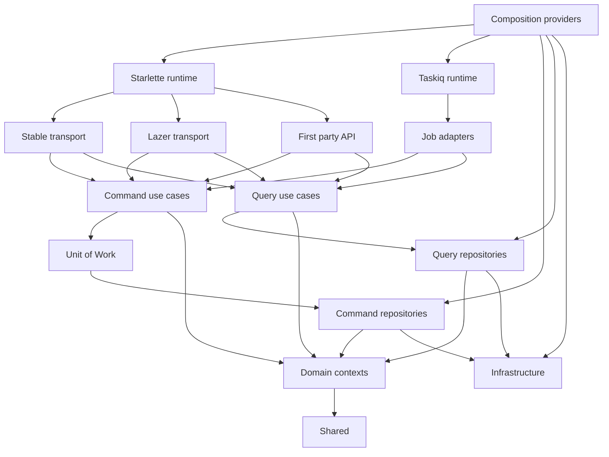
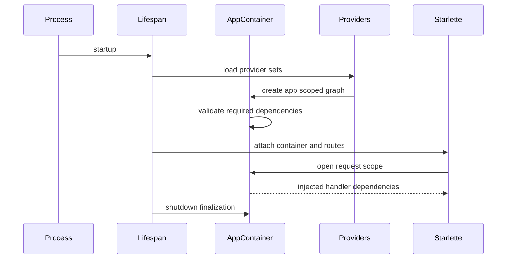
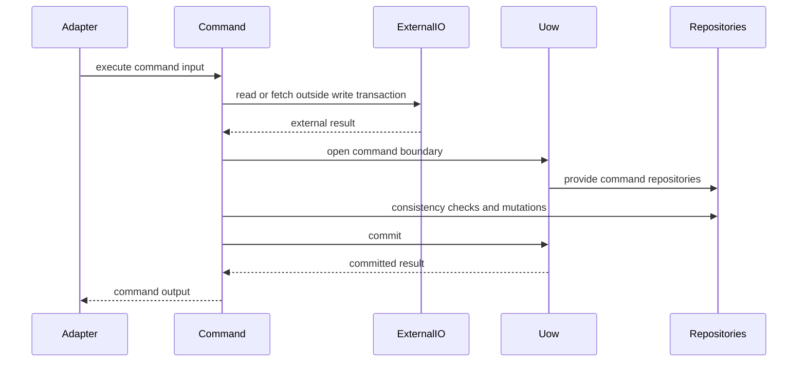
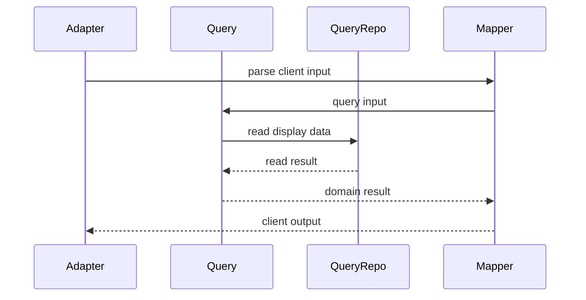
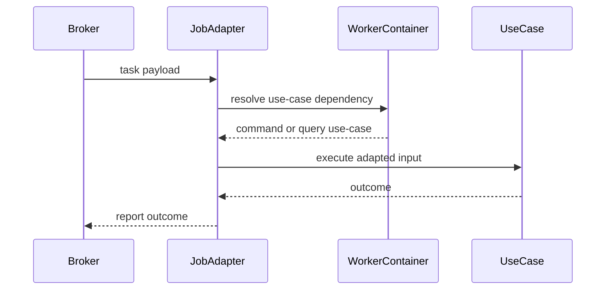
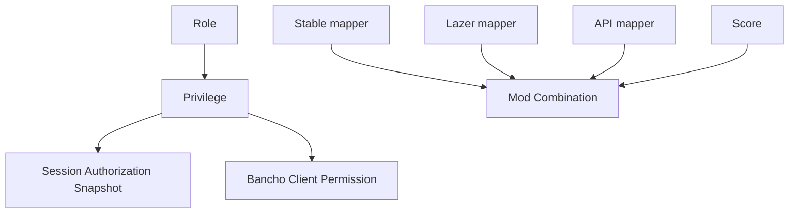
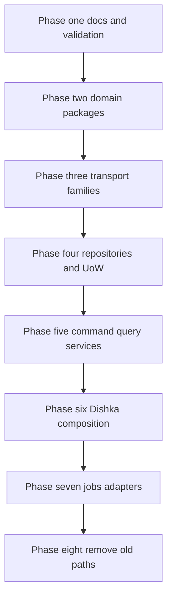

# Design Document

## Overview

Athena の app/worker/test composition、dependency lifecycle、use-case、repository、domain、transport、jobs の境界を再設計する。外部から観測できる stable client と worker の挙動は維持しつつ、内部構造を Dishka ベースの composition root、command/query use-case、Unit of Work、bounded context domain、transport family adapter へ移行する。

この spec は leaderboard、lazer、first-party API、WebUI 管理 API を今後追加しても、mutation、read model、compatibility mapping、worker job が同じ場所に集まらない構造を提供する。完成時点では旧 dependency container、manual service registry、flat package import facade は supported path として残さない。

### Goals

- app/worker/test の dependency graph と lifecycle を Dishka で明示し、startup failure と shutdown failure を観測可能にする。
- command/query use-case と command/query repository を分離し、command-side mutation を Unit of Work で一貫させる。
- domain を bounded context に再編し、stable/lazer/API の compatibility semantics を mapper 境界へ隔離する。
- stable、lazer、first-party API transport family と jobs adapter を package と import-linter で強制する。
- `docs/architecture.md` と dependency validation を同じ architecture rule に同期する。

### Non-Goals

- leaderboard projection、user stats、user ranking の本体実装。
- lazer REST API、SignalR、first-party public/admin API endpoint の機能実装。
- stable bancho wire behavior、public route、task name、packet shape、compatibility response shape の仕様変更。
- event sourcing、別 read database、production topology、HA 方針の導入。
- 旧 package path の compatibility facade 提供。

## Boundary Commitments

### This Spec Owns

- `dishka`、`starlette-dishka`、`dishka.integrations.taskiq` を使う composition root と provider package。
- app process、worker process、tests の dependency graph、scope、startup/shutdown lifecycle。
- `services/commands` と `services/queries` の use-case boundary。
- `UnitOfWorkFactory`、`UnitOfWork`、command repository、query repository の persistence boundary。
- `domain/identity`、`domain/chat`、`domain/beatmaps`、`domain/scores`、`domain/storage`、`domain/compatibility/stable`、`domain/events` の package boundary。
- `transports/stable`、`transports/lazer`、`transports/api` の transport family boundary と mapper placement。
- `jobs/` の taskiq adapter boundary。
- `docs/architecture.md` と `pyproject.toml` import-linter contracts の更新。
- 旧 container、manual registry、flat package import path の完全撤去。

### Out of Boundary

- 新しい product behavior、route behavior、task behavior、client-visible response behavior。
- leaderboard/stats/ranking の projection schema と aggregation algorithm。
- lazer OAuth2、lazer API payload の詳細機能、SignalR protocol の本体実装。
- WebUI フロントエンド、admin UI workflow、first-party API の feature contract。
- distributed event bus、read replica、separate read store、production HA topology。
- 旧 path alias、deprecated import facade、temporary compatibility module。

### Allowed Dependencies

- Existing approved specs for login、polling、chat、beatmap mirror、score ingestion、legacy getscores、worker jobs.
- `dishka` と `starlette-dishka` は composition/integration module のみが import する。
- `taskiq` integration は `worker.py`、`composition/providers/worker.py`、`jobs/` の adapter wiring のみが使う。
- SQLAlchemy async と asyncpg は repository implementation と database infrastructure に閉じる。
- Valkey client と taskiq broker は infrastructure/provider で構成し、services は concrete client を受け取らない。
- Pydantic は config と API I/O boundary のみに使い、domain model には使わない。
- Domain は stdlib dataclass/value object、enum、domain event、shared types のみへ依存する。

### Revalidation Triggers

- Public route、host routing、task name、packet ID、legacy web response shape、score submit response shape の変更。
- Provider scope、startup dependency、shutdown finalizer、test provider replacement contract の変更。
- `UnitOfWork` の repository property、commit/rollback semantics、query repository contract の変更。
- Role、Privilege、Bancho Client Permission、Session Authorization Snapshot、ModCombination の用語や ownership の変更。
- transport family package path、mapper placement、transport interdependency rule の変更。
- `docs/architecture.md` と import-linter contract の不一致。

## Architecture

### Existing Architecture Analysis

- Current `composition/service_registry.py` assembles repositories, services, transports, listeners, job registration, and startup validation in one app-side registry.
- Current `composition/worker_runtime.py` manually builds worker dependencies separately from app composition.
- Current custom `Container` supports singleton and transient lookup but not request scope, provider replacement, or Starlette/taskiq integration contracts.
- Current SQLAlchemy repositories open sessions and commit per method, so multi-repository command outcomes cannot be controlled by a single transaction boundary.
- Current flat `domain`, `services`, and `transports` package shapes make compatibility semantics and business concepts hard to distinguish.

### Architecture Pattern & Boundary Map

Selected pattern: layered modular monolith with hexagonal adapters, command/query use-case split, and Unit of Work for command-side persistence. Composition is the outer root that wires concrete adapters; runtime adapters call services; services depend on domain and repository interfaces; concrete repositories and infrastructure never leak upward.



Dependency rules:

- `composition` may import provider definitions, concrete repositories, infrastructure, services, transports, and jobs because it is the composition root.
- `transports` and `jobs` may import command/query use-cases and transport/job-local mappers, but not concrete repositories or SQLAlchemy models.
- `services.commands` may import `repositories.interfaces.unit_of_work`, command repository interfaces, domain, shared, and infrastructure interfaces only when an existing cross-cutting port is not a repository.
- `services.queries` may import query repository interfaces, domain, and shared. Query services do not mutate durable state.
- `repositories.interfaces` may import domain and shared only.
- `repositories.sqlalchemy` and `repositories.memory` implement repository interfaces. They are wired only by composition.
- `domain` imports no transport, service, repository, infrastructure, SQLAlchemy, Valkey, taskiq, or HTTP client modules.

### Technology Stack

| Layer | Choice / Version | Role in Feature | Notes |
|-------|------------------|-----------------|-------|
| Dependency composition | `dishka` lock-resolved dependency | Provider graph, APP/REQUEST scope, finalization | New runtime dependency |
| Starlette integration | `starlette-dishka` lock-resolved dependency | Request scope and Starlette handler injection | New runtime dependency |
| Worker integration | `dishka.integrations.taskiq` from `dishka` | Taskiq dependency injection | Uses existing taskiq broker |
| Backend services | Python 3.14 dataclasses and Protocols | DI-library-independent use-cases and repository ports | Services do not import Dishka |
| Persistence | SQLAlchemy 2.0 async plus asyncpg | Concrete command/query repository adapters | Transaction ownership moves to UoW for commands |
| State and queue | Valkey, taskiq, taskiq-redis | Session, packet queue, state, background tasks | Concrete clients stay in infrastructure/providers |
| Validation | pytest, basedpyright, ruff, import-linter | Regression, type, lint, boundary enforcement | Completion gate |

## File Structure Plan

### Directory Structure

```text
src/osu_server/
├── composition/
│   ├── application.py                 # Starlette root app assembly and route mounting
│   ├── endpoints.py                   # Starlette endpoint functions resolving injected handlers
│   ├── lifespan.py                    # Starlette lifespan using Dishka app container
│   ├── taskiq_integration.py          # Taskiq broker and Dishka setup
│   ├── starlette_integration.py       # Starlette Dishka setup helpers
│   └── providers/
│       ├── __init__.py
│       ├── common.py                  # CompositionProviderSet shared by app and worker
│       ├── app.py                     # AppProviderSet for transports and app-only state
│       ├── worker.py                  # WorkerProviderSet for taskiq jobs
│       ├── test.py                    # TestProviderSet and provider replacement helpers
│       └── container.py               # make_app_container and make_worker_container factories
├── services/
│   ├── commands/
│   │   ├── identity/                  # authentication, registration, authorization refresh commands
│   │   ├── chat/                      # send and persist message commands
│   │   ├── beatmaps/                  # beatmap fetch and refresh commands
│   │   ├── scores/                    # score submission command
│   │   └── storage/                   # blob write commands shared by use-cases
│   └── queries/
│       ├── identity/                  # online user and session read models
│       ├── chat/                      # channel catalog and message display queries
│       ├── beatmaps/                  # beatmap resolution and freshness reads
│       └── scores/                    # legacy getscores and score display queries
├── repositories/
│   ├── interfaces/
│   │   ├── unit_of_work.py            # UnitOfWork and UnitOfWorkFactory protocols
│   │   ├── commands/                  # command repository Protocols
│   │   └── queries/                   # read-only repository Protocols
│   ├── sqlalchemy/
│   │   ├── unit_of_work.py            # SQLAlchemyUnitOfWork
│   │   ├── commands/                  # UoW-bound SQLAlchemy command repositories
│   │   ├── queries/                   # independent SQLAlchemy query repositories
│   │   └── models/                    # SQLAlchemy persistence models
│   ├── memory/
│   │   ├── unit_of_work.py            # InMemoryUnitOfWork for tests
│   │   ├── commands/                  # typed in-memory command repositories
│   │   └── queries/                   # typed in-memory query repositories
│   └── valkey/
│       └── session_store.py           # Valkey-backed session repository adapter
├── domain/
│   ├── identity/
│   │   ├── authorization.py           # Privilege and authorization policies
│   │   ├── roles.py                   # Role aggregate
│   │   ├── sessions.py                # Session Authorization Snapshot
│   │   └── users.py                   # User entities and identifiers
│   ├── chat/
│   ├── beatmaps/
│   ├── scores/
│   │   ├── models.py                  # Score aggregate and scoring value objects
│   │   ├── mods.py                    # Mod and ModCombination canonical bitmask
│   │   ├── submission.py              # Score Submission aggregate
│   │   ├── replay.py                  # Replay entity
│   │   └── validation.py              # Score validation rules
│   ├── storage/
│   ├── compatibility/
│   │   └── stable/
│   │       ├── permissions.py         # Bancho Client Permission value and mapping contract
│   │       ├── mods.py                # Stable mod representation support matrix
│   │       └── getscores.py           # Stable compatibility response semantics
│   └── events/
├── transports/
│   ├── stable/
│   │   ├── bancho/
│   │   │   ├── protocol/              # packet definitions, parser, writer
│   │   │   ├── handlers/              # C2S handler adapters
│   │   │   ├── workflows/             # stable endpoint workflows
│   │   │   └── mappers/               # stable packet to use-case mappers
│   │   └── web_legacy/
│   │       ├── endpoints/             # legacy PHP-compatible endpoints
│   │       └── mappers/               # form and text response mappers
│   ├── lazer/
│   │   ├── api/                       # future lazer REST adapters
│   │   └── signalr/                   # future lazer realtime adapters
│   └── api/
│       ├── public/                    # first-party public API adapters
│       └── admin/                     # first-party admin API adapters
├── jobs/
│   ├── beatmap_fetch.py               # Taskiq adapter only
│   ├── chat_persistence.py            # Taskiq adapter only
│   └── registry.py                    # Task registration
└── infrastructure/
    ├── database/
    ├── cache/
    ├── state/
    ├── storage/
    ├── messaging/
    └── logging.py
docs/
├── architecture.md                    # New architecture guide
└── adr/0002-adopt-dishka-for-composition-di.md
```

### Component Path Map

- Composition Providers — `src/osu_server/composition/providers/common.py`, `src/osu_server/composition/providers/app.py`, `src/osu_server/composition/providers/worker.py`, `src/osu_server/composition/providers/test.py`, `src/osu_server/composition/providers/container.py`
- Runtime Lifecycle — `src/osu_server/composition/lifespan.py`, `src/osu_server/composition/starlette_integration.py`, `src/osu_server/composition/taskiq_integration.py`, `src/osu_server/app.py`, `src/osu_server/worker.py`
- Command Use Cases — `src/osu_server/services/commands/identity/`, `src/osu_server/services/commands/chat/`, `src/osu_server/services/commands/beatmaps/`, `src/osu_server/services/commands/scores/`, `src/osu_server/services/commands/storage/`
- Query Use Cases — `src/osu_server/services/queries/identity/`, `src/osu_server/services/queries/chat/`, `src/osu_server/services/queries/beatmaps/`, `src/osu_server/services/queries/scores/`
- Unit of Work — `src/osu_server/repositories/interfaces/unit_of_work.py`, `src/osu_server/repositories/sqlalchemy/unit_of_work.py`, `src/osu_server/repositories/memory/unit_of_work.py`
- Command Repositories — `src/osu_server/repositories/interfaces/commands/`, `src/osu_server/repositories/sqlalchemy/commands/`, `src/osu_server/repositories/memory/commands/`
- Query Repositories — `src/osu_server/repositories/interfaces/queries/`, `src/osu_server/repositories/sqlalchemy/queries/`, `src/osu_server/repositories/memory/queries/`
- Domain Context Packages — `src/osu_server/domain/identity/`, `src/osu_server/domain/chat/`, `src/osu_server/domain/beatmaps/`, `src/osu_server/domain/scores/`, `src/osu_server/domain/storage/`, `src/osu_server/domain/events/`
- Stable Compatibility Context — `src/osu_server/domain/compatibility/stable/permissions.py`, `src/osu_server/domain/compatibility/stable/mods.py`, `src/osu_server/domain/compatibility/stable/getscores.py`
- Transport Families — `src/osu_server/transports/stable/`, `src/osu_server/transports/lazer/`, `src/osu_server/transports/api/`
- Transport Mappers — `src/osu_server/transports/stable/bancho/mappers/`, `src/osu_server/transports/stable/web_legacy/mappers/`, `src/osu_server/transports/lazer/api/mappers/`, `src/osu_server/transports/lazer/signalr/mappers/`, `src/osu_server/transports/api/public/mappers/`, `src/osu_server/transports/api/admin/mappers/`
- Job Adapters — `src/osu_server/jobs/beatmap_fetch.py`, `src/osu_server/jobs/chat_persistence.py`, `src/osu_server/jobs/registry.py`
- Architecture Boundary Contract — `docs/architecture.md`, `pyproject.toml`, `tests/`

### Modified Files

- `pyproject.toml` — add `dishka`, `starlette-dishka`, and import-linter contracts for new boundaries.
- `src/osu_server/app.py` — continue to expose the Starlette app while delegating assembly to the new composition root.
- `src/osu_server/worker.py` — configure taskiq broker through Dishka integration and remove manual runtime state composition.
- `tests/**` — update imports and fixtures to provider replacement, UoW, command/query use-cases, new transport paths, and old path residual checks.
- `CONTEXT.md` — keep Role, Privilege, Bancho Client Permission, Session Authorization Snapshot, and ModCombination terminology aligned.

### Removed Files and Unsupported Paths

- `src/osu_server/infrastructure/di/` — removed entirely.
- `src/osu_server/composition/service_registry.py` — removed with no compatibility facade.
- `src/osu_server/composition/worker_runtime.py` — removed with no compatibility facade.
- `src/osu_server/services/*.py` flat service entry points — migrated into `services/commands` or `services/queries`; no re-export modules.
- `src/osu_server/domain/*.py` flat domain modules that represent bounded-context concepts — migrated into context packages; no re-export modules.
- `src/osu_server/transports/bancho`, `src/osu_server/transports/web_legacy`, `src/osu_server/transports/api`, `src/osu_server/transports/signalr` old root packages — migrated to family packages; old paths unsupported.
- `src/osu_server/repositories/interfaces/*.py`, `src/osu_server/repositories/sqlalchemy/*.py`, and `src/osu_server/repositories/memory/*.py` flat repository modules — migrated into command/query packages or explicit non-CQRS adapters; old paths unsupported.

## System Flows

### App Startup and Request Scope



Startup fails before serving traffic when provider graph construction fails. Shutdown uses Dishka finalization and logs failures.

### Command Use-Case Transaction



If command mutation fails, UoW rolls back and the command returns or raises an observable failure according to the use-case contract.

### Query Use-Case Read Path



Query services do not open command UoW and do not mutate durable state to fill missing read data.

### Worker Job Adapter



Job adapters do not own business rules, idempotency rules, repository access, or transaction logic.

## Requirements Traceability

| Requirement | Summary | Components | Interfaces | Flows |
|-------------|---------|------------|------------|-------|
| 1.1 | stable client workflows preserve observable semantics | Transport Families, Transport Mappers, Command Use Cases, Query Use Cases | Stable mapper contracts, command/query outputs | App startup, command, query |
| 1.2 | background task outcomes preserved | Job Adapters, Command Use Cases | Taskiq adapter contract, use-case output | Worker job |
| 1.3 | integration coverage passes per phase | Architecture Boundary Contract | pytest/import-linter gates | Migration strategy |
| 1.4 | no new product behavior | Boundary Commitments | Non-goal enforcement | Migration strategy |
| 1.5 | public routes and task names preserved | Runtime Lifecycle, Transport Families, Job Adapters | Route/task registration contracts | App startup, worker job |
| 2.1 | app composes dependencies before serving | Composition Providers, Runtime Lifecycle | `make_app_container` | App startup |
| 2.2 | worker composes dependencies before tasks | Composition Providers, Runtime Lifecycle | `make_worker_container` | Worker job |
| 2.3 | managed dependencies close on shutdown | Runtime Lifecycle | Dishka APP finalization | App startup |
| 2.4 | tests replace providers without production branches | Composition Providers | TestProviderSet | Testing strategy |
| 2.5 | legacy container API removed | Architecture Boundary Contract | old path residual checks | Migration strategy |
| 2.6 | startup fails on missing dependency | Runtime Lifecycle | provider graph validation | App startup |
| 3.1 | state-changing workflows use command boundary | Command Use Cases | command service interfaces | Command |
| 3.2 | read workflows use query boundary | Query Use Cases | query service interfaces | Query |
| 3.3 | mixed read plus mutation is command-side | Command Use Cases, Unit of Work | UoW contract | Command |
| 3.4 | services independent of transport names | Command Use Cases, Query Use Cases | package rules | Boundary validation |
| 3.5 | future leaderboard uses query boundary | Query Use Cases, Query Repositories | read-optimized repository Protocols | Query |
| 3.6 | transport invocation distinguishes command/query | Transport Mappers, Transport Families | mapper to use-case contracts | Command, query |
| 4.1 | multi-step command commits atomically | Unit of Work, Command Repositories | `UnitOfWork.commit` | Command |
| 4.2 | failed command preserves consistency | Unit of Work, Command Use Cases | rollback and error contracts | Command |
| 4.3 | external I/O does not hold write transaction | Command Use Cases | phase separation contract | Command |
| 4.4 | mutation consistency checks share boundary | Unit of Work, Command Repositories | UoW repository set | Command |
| 4.5 | command repos separate from query repos | Command Repositories, Query Repositories | repository package contracts | Boundary validation |
| 4.6 | no low-level persistence in adapters or services | Architecture Boundary Contract | import-linter rules | Boundary validation |
| 5.1 | read-only workflows avoid command transaction | Query Use Cases, Query Repositories | query repository Protocols | Query |
| 5.2 | query workflows do not mutate durable state | Query Use Cases | query output contract | Query |
| 5.3 | unavailable read returns empty or unavailable | Query Use Cases | unavailable result envelope | Query |
| 5.4 | future read contracts do not expand commands | Query Repositories | read-optimized Protocols | Query |
| 5.5 | query validation coverage separate from command | Testing Strategy | query tests | Testing strategy |
| 6.1 | shared concepts are transport-independent | Domain Context Packages | core domain dataclasses | Domain model |
| 6.2 | stable compatibility semantics are separate | Stable Compatibility Context, Transport Mappers | stable compatibility values | Transport mapping |
| 6.3 | Bancho permission derived from privileges | Stable Compatibility Context | permission mapper contract | Transport mapping |
| 6.4 | authorization uses privileges | Domain Context Packages, Command Use Cases | Privilege policy | Command |
| 6.5 | mods canonicalized before use-cases | Domain Context Packages, Transport Mappers | ModCombination mapper | Transport mapping |
| 6.6 | unsupported client mod representation explicit | Stable Compatibility Context, Transport Mappers | support matrix result | Transport mapping |
| 6.7 | terminology consistent in docs and tests | Domain Context Packages, Architecture Boundary Contract | docs validation | Testing strategy |
| 7.1 | stable traffic handled in stable family | Transport Families | stable routes and handlers | App startup |
| 7.2 | lazer traffic handled in lazer family | Transport Families | future lazer mount contracts | App startup |
| 7.3 | first-party API traffic handled in API family | Transport Families | public/admin mount contracts | App startup |
| 7.4 | transport input converted before services | Transport Mappers | input mapper contracts | Query, command |
| 7.5 | transport output converted at boundary | Transport Mappers | output mapper contracts | Query, command |
| 7.6 | wire structs stay out of domain/services | Architecture Boundary Contract | import-linter rules | Boundary validation |
| 7.7 | transport families do not import each other | Architecture Boundary Contract | transport family forbidden rules | Boundary validation |
| 8.1 | background task routes through composition | Job Adapters, Runtime Lifecycle | taskiq Dishka injection | Worker job |
| 8.2 | job adapter limited to adaptation/invocation/reporting | Job Adapters | task adapter contract | Worker job |
| 8.3 | business and idempotency stay in use-case | Command Use Cases | command service contracts | Worker job |
| 8.4 | missing dependency fails observably | Job Adapters, Runtime Lifecycle | dependency failure logging | Worker job |
| 8.5 | jobs do not access low-level persistence | Architecture Boundary Contract | import-linter rules | Boundary validation |
| 9.1 | architecture docs describe new structure | Architecture Boundary Contract | `docs/architecture.md` | Migration strategy |
| 9.2 | docs boundaries enforced mechanically | Architecture Boundary Contract | import-linter contracts | Boundary validation |
| 9.3 | docs and validation conflict blocks completion | Architecture Boundary Contract | review checklist | Migration strategy |
| 9.4 | docs guide future feature placement | Architecture Boundary Contract | placement guide | Migration strategy |
| 9.5 | validation suite includes quality gates | Testing Strategy | ruff, basedpyright, pytest, import-linter | Testing strategy |
| 10.1 | no legacy container API remains | Architecture Boundary Contract | old path residual checks | Migration strategy |
| 10.2 | no manual service registry remains | Architecture Boundary Contract | old path residual checks | Migration strategy |
| 10.3 | no deprecated import facade remains | Architecture Boundary Contract | import and rg checks | Migration strategy |
| 10.4 | deprecated imports detectable | Architecture Boundary Contract | import-linter and tests | Boundary validation |
| 10.5 | tests and docs use new paths | Architecture Boundary Contract | docs/tests checks | Migration strategy |
| 10.6 | old and new paths not both supported | Architecture Boundary Contract | completion gate | Migration strategy |

## Components and Interfaces

| Component | Domain/Layer | Intent | Req Coverage | Key Dependencies | Contracts |
|-----------|--------------|--------|--------------|------------------|-----------|
| Composition Providers | Composition | Define app, worker, and test provider graph | 2.1, 2.2, 2.4, 2.6 | Dishka P0, AppConfig P0 | Service, State |
| Runtime Lifecycle | Composition | Integrate Dishka with Starlette and taskiq lifecycle | 1.5, 2.1, 2.2, 2.3, 8.1, 8.4 | starlette-dishka P0, taskiq P0 | Service, State |
| Command Use Cases | Services | Own state-changing workflows | 3.1, 3.3, 4.1, 4.2, 4.3, 4.4, 6.4, 8.3 | Unit of Work P0, Domain P0 | Service |
| Query Use Cases | Services | Own read-only workflows | 3.2, 3.5, 5.1, 5.2, 5.3, 5.4, 5.5 | Query Repositories P0, Domain P0 | Service |
| Unit of Work | Repositories | Own command transaction boundary | 4.1, 4.2, 4.4, 4.6 | SQLAlchemy P0 | Service, State |
| Command Repositories | Repositories | Provide mutation-focused persistence ports | 4.1, 4.5, 4.6 | UoW P0, Domain P0 | Service |
| Query Repositories | Repositories | Provide read-optimized persistence ports | 5.1, 5.2, 5.4 | SQLAlchemy P1, Domain P0 | Service |
| Domain Context Packages | Domain | Define transport-independent business language | 6.1, 6.4, 6.5, 6.7 | Shared P0 | State |
| Stable Compatibility Context | Domain compatibility | Hold stable compatibility values and support matrix | 6.2, 6.3, 6.6 | Domain identity P0, Domain scores P0 | State |
| Transport Families | Transports | Separate stable, lazer, and first-party API adapters | 1.1, 7.1, 7.2, 7.3, 7.7 | Starlette P0, Services P0 | API |
| Transport Mappers | Transports | Convert wire inputs and outputs at client family boundary | 6.2, 6.3, 6.5, 6.6, 7.4, 7.5, 7.6 | Domain P0 | Service |
| Job Adapters | Jobs | Adapt taskiq payloads to use-cases | 1.2, 8.1, 8.2, 8.4, 8.5 | taskiq P0, Services P0 | Batch |
| Architecture Boundary Contract | Validation | Keep docs, package layout, and import rules aligned | 1.3, 9.1, 9.2, 9.3, 9.4, 9.5, 10.1, 10.2, 10.3, 10.4, 10.5, 10.6 | import-linter P0, pytest P0 | Batch |

### Composition

#### Composition Providers

| Field | Detail |
|-------|--------|
| Intent | Centralize provider definitions for app, worker, and tests |
| Requirements | 2.1, 2.2, 2.4, 2.6 |

**Responsibilities & Constraints**

- Define provider sets in `composition/providers/common.py`, `app.py`, `worker.py`, and `test.py`.
- Expose container factories from `composition/providers/container.py`.
- Use APP scope for config, engines, clients, broker, storage backend, singleton-like services, and long-lived adapters.
- Use REQUEST scope for request-scoped dependencies and UoW factories where applicable.
- Do not put `config.environment == "test"` replacement branches in production provider functions; tests use provider replacement.
- Do not import provider or Dishka types from services/domain/repository interfaces.

**Dependencies**

- Inbound: `composition/lifespan.py`, `worker.py`, tests — create runtime containers (P0)
- Outbound: Dishka — provider graph and finalization (P0)
- Outbound: infrastructure factories — DB, Valkey, storage, HTTP client, broker (P0)

**Contracts**: Service [x] / API [ ] / Event [ ] / Batch [ ] / State [x]

##### Service Interface

```python
from collections.abc import Iterable
from dishka import AsyncContainer, Provider

def make_app_container(config: AppConfig, overrides: Iterable[Provider] = ()) -> AsyncContainer: ...

def make_worker_container(config: AppConfig, overrides: Iterable[Provider] = ()) -> AsyncContainer: ...
```

- Preconditions: `AppConfig` is fully loaded and validated.
- Postconditions: Required APP scoped dependencies are constructible before runtime begins serving.
- Invariants: Provider overrides are explicit and local to test/runtime construction.

#### Runtime Lifecycle

| Field | Detail |
|-------|--------|
| Intent | Attach Dishka lifecycle to Starlette and taskiq |
| Requirements | 1.5, 2.1, 2.2, 2.3, 2.6, 8.1, 8.4 |

**Responsibilities & Constraints**

- `composition/starlette_integration.py` installs `starlette-dishka` integration and request scope.
- `composition/taskiq_integration.py` installs `dishka.integrations.taskiq` for worker tasks.
- `composition/lifespan.py` starts the app container, validates infrastructure health where currently required, and finalizes dependencies on shutdown.
- `worker.py` creates the worker container before task execution and finalizes it on worker shutdown.
- Missing provider or dependency failure prevents serving or task execution.

**Dependencies**

- Inbound: Starlette app factory and taskiq worker entry point (P0)
- External: `starlette-dishka`, taskiq, Dishka integration (P0)
- Outbound: Composition Providers (P0)

**Contracts**: Service [x] / API [ ] / Event [ ] / Batch [x] / State [x]

##### Batch / Job Contract

- Trigger: taskiq worker startup and shutdown events.
- Input / validation: loaded `AppConfig` and broker state.
- Output / destination: initialized container attached to broker integration.
- Idempotency & recovery: repeated startup creates a fresh container; failed startup logs and stops worker readiness.

### Services

#### Command Use Cases

| Field | Detail |
|-------|--------|
| Intent | Own mutation workflows independent of transport family |
| Requirements | 3.1, 3.3, 3.4, 3.6, 4.1, 4.2, 4.3, 4.4, 6.4, 8.3 |

**Responsibilities & Constraints**

- Each state-changing workflow is represented as a command class with an explicit input dataclass and result dataclass.
- Command use-cases own business rules, idempotency rules, authorization decisions, and transaction timing.
- Commands open UoW only around durable command-side consistency checks and mutations.
- Commands do not import Starlette, taskiq, packet structs, SQLAlchemy models, DB sessions, or raw SQL.
- Workflows that both read and mutate durable state are command-side.

**Dependencies**

- Inbound: Transport Families, Job Adapters (P0)
- Outbound: Unit of Work, command repository interfaces, domain contexts, shared errors (P0)
- Outbound: query use-case only when explicitly documented as a read collaborator without mutation (P2)

**Contracts**: Service [x] / API [ ] / Event [ ] / Batch [ ] / State [ ]

##### Service Interface

```python
from dataclasses import dataclass

@dataclass(frozen=True, slots=True)
class CommandInput:
    request_id: str

@dataclass(frozen=True, slots=True)
class CommandResult:
    outcome: str

class CommandUseCase(Protocol):
    async def execute(self, input_data: CommandInput) -> CommandResult: ...
```

- Preconditions: transport/job input has already been parsed and mapped into domain/use-case values.
- Postconditions: all durable command-side changes are committed as one outcome or rolled back.
- Invariants: no client-family wire type crosses into command input.

#### Query Use Cases

| Field | Detail |
|-------|--------|
| Intent | Own read-only display, search, aggregation, and compatibility read workflows |
| Requirements | 3.2, 3.5, 3.6, 5.1, 5.2, 5.3, 5.4, 5.5 |

**Responsibilities & Constraints**

- Query use-cases expose read-only interfaces for display/search/aggregation workflows.
- Query services use query repositories and do not open command UoW.
- Missing read data returns an explicit unavailable/empty result instead of creating command-side state.
- Future leaderboard/stats/ranking read contracts are added here without expanding score ingestion command repositories.

**Dependencies**

- Inbound: Transport Families, Job Adapters (P0)
- Outbound: Query Repositories, domain contexts, shared errors (P0)

**Contracts**: Service [x] / API [ ] / Event [ ] / Batch [ ] / State [ ]

##### Service Interface

```python
@dataclass(frozen=True, slots=True)
class QueryInput:
    request_id: str

@dataclass(frozen=True, slots=True)
class QueryResult:
    state: str

class QueryUseCase(Protocol):
    async def execute(self, input_data: QueryInput) -> QueryResult: ...
```

- Preconditions: no mutation is required to satisfy the requested view.
- Postconditions: durable state is unchanged.
- Invariants: query outputs are safe for transport mapper conversion.

### Persistence

#### Unit of Work

| Field | Detail |
|-------|--------|
| Intent | Own command-side transaction scope and command repository set |
| Requirements | 4.1, 4.2, 4.4, 4.6 |

**Responsibilities & Constraints**

- `repositories/interfaces/unit_of_work.py` defines UoW contracts.
- SQLAlchemy UoW owns `AsyncSession` and transaction lifecycle.
- Repositories obtained from UoW do not commit or rollback.
- UoW exposes only command repository interfaces needed by command use-cases.
- UoW rollback occurs on exception or explicit failed command path before commit.

**Dependencies**

- Inbound: Command Use Cases (P0)
- Outbound: Command Repositories, SQLAlchemy session factory in implementation (P0)

**Contracts**: Service [x] / API [ ] / Event [ ] / Batch [ ] / State [x]

##### Service Interface

```python
from collections.abc import AsyncContextManager
from typing import Protocol

class UnitOfWork(Protocol):
    users: UserCommandRepository
    roles: RoleCommandRepository
    channels: ChannelCommandRepository
    scores: ScoreCommandRepository
    submissions: ScoreSubmissionCommandRepository
    replays: ReplayCommandRepository
    blobs: BlobCommandRepository
    beatmaps: BeatmapCommandRepository

    async def commit(self) -> None: ...
    async def rollback(self) -> None: ...

class UnitOfWorkFactory(Protocol):
    def __call__(self) -> AsyncContextManager[UnitOfWork]: ...
```

- Preconditions: opened inside a command use-case mutation phase.
- Postconditions: `commit()` makes all repository changes durable; rollback leaves no partial command-side outcome.
- Invariants: low-level session object is never exposed outside repository implementation package.

#### Command Repositories

| Field | Detail |
|-------|--------|
| Intent | Provide mutation-focused persistence ports inside UoW |
| Requirements | 4.1, 4.4, 4.5, 4.6 |

**Responsibilities & Constraints**

- Command repository interfaces contain mutation and consistency-check methods required for command outcomes.
- SQLAlchemy command repositories receive the UoW-owned session.
- Memory command repositories participate in `InMemoryUnitOfWork` transaction simulation for tests.
- Command repositories do not contain presentation-only reads.

**Contracts**: Service [x] / API [ ] / Event [ ] / Batch [ ] / State [ ]

##### Service Interface

```python
class ScoreCommandRepository(Protocol):
    async def get_by_online_checksum(self, checksum: str) -> Score | None: ...
    async def create(self, score: Score) -> Score: ...
```

#### Query Repositories

| Field | Detail |
|-------|--------|
| Intent | Provide read-only and read-optimized persistence ports |
| Requirements | 5.1, 5.2, 5.3, 5.4 |

**Responsibilities & Constraints**

- Query repositories expose display/search/aggregation methods.
- Query repositories do not mutate durable state and do not require command UoW.
- SQLAlchemy query repositories may use independent sessions for short read operations.
- Future leaderboard/stats/ranking repositories are added under query packages.

**Contracts**: Service [x] / API [ ] / Event [ ] / Batch [ ] / State [ ]

##### Service Interface

```python
class LegacyGetscoresQueryRepository(Protocol):
    async def find_by_checksum(self, checksum: str) -> LegacyGetscoresReadModel | None: ...
```

### Domain

#### Domain Context Packages

| Field | Detail |
|-------|--------|
| Intent | Define core business concepts independent of client families |
| Requirements | 6.1, 6.4, 6.5, 6.7 |

**Responsibilities & Constraints**

- `domain/identity` owns Role, Privilege, authorization policy, session authorization snapshot, and users.
- `domain/scores` owns Score, Score Submission, Replay, Playstyle, Ruleset, Mod, ModCombination, and validation.
- `domain/beatmaps`, `domain/chat`, `domain/storage`, and `domain/events` own their bounded context language.
- Domain objects are stdlib dataclasses/value objects/enums and contain no Pydantic, SQLAlchemy, transport, taskiq, Valkey, or HTTP client dependency.

**Contracts**: Service [ ] / API [ ] / Event [ ] / Batch [ ] / State [x]

##### State Management

- State model: aggregates and value objects grouped by bounded context.
- Persistence & consistency: repository interfaces map domain objects to storage; domain does not know storage details.
- Concurrency strategy: handled by UoW and repository implementation, not by domain package imports.

#### Stable Compatibility Context

| Field | Detail |
|-------|--------|
| Intent | Represent stable client-visible compatibility semantics separately from core authorization and scoring |
| Requirements | 6.2, 6.3, 6.6 |

**Responsibilities & Constraints**

- `domain/compatibility/stable/permissions.py` defines Bancho Client Permission as a stable compatibility value.
- Stable permission output is derived from `Privilege`; it is never used for server authorization.
- `domain/compatibility/stable/mods.py` defines stable representation support and unsupported cases for canonical `ModCombination`.
- Wire parsing/building still lives in `transports/stable`; compatibility domain does not import packet structs.

**Contracts**: Service [ ] / API [ ] / Event [ ] / Batch [ ] / State [x]

### Transports and Jobs

#### Transport Families

| Field | Detail |
|-------|--------|
| Intent | Keep stable, lazer, and first-party API adapters independent |
| Requirements | 1.1, 1.5, 7.1, 7.2, 7.3, 7.7 |

**Responsibilities & Constraints**

- `transports/stable/bancho` handles stable binary protocol and polling workflow.
- `transports/stable/web_legacy` handles legacy PHP-compatible endpoints.
- `transports/lazer/api` and `transports/lazer/signalr` reserve lazer compatibility adapters.
- `transports/api/public` and `transports/api/admin` reserve Athena-owned API adapters for WebUI and operators.
- Transport families must not import implementation details from each other.

**Contracts**: Service [ ] / API [x] / Event [ ] / Batch [ ] / State [ ]

##### API Contract

| Method | Endpoint Family | Request | Response | Errors |
|--------|-----------------|---------|----------|--------|
| existing | stable bancho and web legacy | existing packet or form input | existing response shape | existing behavior preserved |
| future | lazer API and signalr | deferred | deferred | deferred to later specs |
| future | first-party public and admin API | deferred | deferred | deferred to later specs |

#### Transport Mappers

| Field | Detail |
|-------|--------|
| Intent | Convert client-family inputs and outputs at the adapter boundary |
| Requirements | 6.2, 6.3, 6.5, 6.6, 7.4, 7.5, 7.6 |

**Responsibilities & Constraints**

- Stable mapper converts packet/form/query/text data to command/query input and back to packet/text response.
- Lazer mapper converts JSON/SignalR payloads to command/query input and back to lazer payloads.
- First-party API mapper converts Athena-owned JSON payloads to command/query input and back.
- Bancho Client Permission mapping lives in stable mapper or stable compatibility mapper, not in core authorization service.
- Stable int mod bitmask and lazer JSON mod payloads both canonicalize to `ModCombination` before services.

**Contracts**: Service [x] / API [ ] / Event [ ] / Batch [ ] / State [ ]

##### Service Interface

```python
class StableScoreSubmitMapper(Protocol):
    def to_command_input(self, payload: StableScoreSubmitPayload) -> SubmitScoreInput: ...
    def to_response(self, result: SubmitScoreResult) -> StableScoreSubmitResponse: ...
```

#### Job Adapters

| Field | Detail |
|-------|--------|
| Intent | Keep taskiq task functions as thin adapters |
| Requirements | 1.2, 8.1, 8.2, 8.3, 8.4, 8.5 |

**Responsibilities & Constraints**

- Convert task payload primitives into command/query input dataclasses.
- Resolve the required use-case through taskiq Dishka integration.
- Invoke the use-case and report success/failure through logs/task outcome.
- Do not import concrete repositories, SQLAlchemy models, DB sessions, or business rules.

**Contracts**: Service [ ] / API [ ] / Event [ ] / Batch [x] / State [ ]

##### Batch / Job Contract

- Trigger: existing task names remain unchanged.
- Input / validation: task payload primitives mapped to typed use-case input.
- Output / destination: task outcome and structured logs.
- Idempotency & recovery: use-case owns idempotency and retry safety.

### Validation

#### Architecture Boundary Contract

| Field | Detail |
|-------|--------|
| Intent | Make architecture documentation and mechanical validation agree |
| Requirements | 1.3, 4.6, 7.6, 7.7, 8.5, 9.1, 9.2, 9.3, 9.4, 9.5, 10.1, 10.2, 10.3, 10.4, 10.5, 10.6 |

**Responsibilities & Constraints**

- `docs/architecture.md` explains layer direction, placement rules, command/query, UoW, transport families, jobs, domain compatibility, and composition.
- `pyproject.toml` import-linter contracts enforce the same boundaries.
- Tests or validation scripts detect old path imports and unsupported facade modules.
- Completion is blocked if old and new package paths both support the same responsibility.

**Contracts**: Service [ ] / API [ ] / Event [ ] / Batch [x] / State [ ]

##### Batch / Job Contract

- Trigger: CI or local quality command.
- Input / validation: source tree, tests, docs, import graph.
- Output / destination: pass/fail gate.
- Idempotency & recovery: deterministic checks with no source mutation except formatter when explicitly run.

## Data Models

### Domain Model

- Identity context:
  - `Role`: named authorization bundle assigned to users.
  - `Privilege`: server-side authorization capability and source of truth.
  - `SessionAuthorizationSnapshot`: point-in-time session authorization view.
  - `BanchoClientPermission`: stable compatibility output derived from `Privilege`.
- Scores context:
  - `Score`: canonical gameplay result. `mods` becomes `ModCombination` instead of raw `int`.
  - `Mod`: internal `IntFlag` bitmask that can include stable and lazer-supported mods.
  - `ModCombination`: frozen value object wrapping bitmask operations and compatibility checks.
  - `ScoreSubmission` and `Replay` remain command-side aggregates for idempotency and replay uniqueness.



### Logical Data Model

- No new product table is required solely by this architecture refactor.
- Existing SQLAlchemy models may move package location but remain persistence models, not domain models.
- UoW changes transaction ownership, not the logical identity of persisted aggregates.
- `Score.mods` remains stored as an integer bitmask in persistence unless a later schema spec changes storage.
- Query repository read models may be dataclasses that do not map 1:1 to command aggregates.

### Data Contracts & Integration

- Transport input dataclasses are local to transport family mappers.
- Command input/result dataclasses live with command use-cases.
- Query input/result dataclasses live with query use-cases.
- Repository Protocols define persistence contracts; SQLAlchemy models are not accepted across service boundaries.

## Error Handling

### Error Strategy

- Composition errors fail startup before serving requests or executing tasks.
- Shutdown finalizer failures are logged with enough dependency context to diagnose leaks.
- Command failure before commit rolls back UoW and returns a typed use-case error or raises a domain/application exception according to existing workflow semantics.
- Query unavailable states return explicit empty/unavailable result envelopes.
- Job dependency resolution failures are task failures with structured logs, not silent no-ops.

### Error Categories and Responses

- User or client errors: transport mapper returns existing stable/web behavior for current endpoints.
- Business logic errors: command/query result envelopes preserve existing behavior while separating internal error types.
- System errors: provider graph, DB, Valkey, storage, and broker failures surface during startup, command execution, query execution, or task execution with structured logging.

### Monitoring

- Startup and shutdown logs include runtime type, provider graph phase, and dependency category.
- UoW rollback logs include use-case name and failure category without exposing credentials or sensitive payloads.
- Job adapter logs include task name, payload identifiers safe for logs, and dependency resolution failure reason.

## Testing Strategy

### Unit Tests

- Composition Providers: verify app/worker containers resolve required handlers/use-cases and tests can replace providers without production branches.
- Unit of Work: verify SQLAlchemy and memory UoW commit/rollback semantics, including multi-repository command success and failure.
- Command Use Cases: verify score submission, auth, chat persistence, and beatmap fetch commands use UoW boundaries and do not import transport or SQLAlchemy models.
- Query Use Cases: verify legacy getscores and beatmap resolution queries are read-only and return unavailable/empty results without mutation.
- Transport Mappers: verify stable permission mapping, stable/lazer/API mod canonicalization, unsupported mod representation, and response shape preservation.
- Domain Context Packages: verify Role, Privilege, Bancho Client Permission, Session Authorization Snapshot, Mod, and ModCombination terminology and invariants.

### Integration Tests

- Starlette app startup: provider graph constructs all app dependencies before serving and finalizes dependencies on shutdown.
- Worker startup: taskiq broker has Dishka integration and existing task names resolve use-case dependencies.
- Stable regression: existing login, polling, chat, registration, getscores, and score submit tests pass with new transport paths.
- Persistence regression: score submission command commits submission, score, replay, and state update atomically where current behavior requires a completed outcome.
- Job regression: existing beatmap fetch and chat persistence task adapters invoke use-cases and report dependency failures observably.

### Boundary and Quality Gates

- `ruff format --check src tests`
- `ruff check src tests`
- `basedpyright src tests`
- `pytest tests`
- `import-linter`
- old path residual checks for `infrastructure.di`, `composition.service_registry`, `composition.worker_runtime`, old root transport paths, and flat service/domain/repository facades.
- docs/import-linter sync check that `docs/architecture.md` describes every enforced boundary.

## Security Considerations

- Authorization source of truth is `Privilege`, not Bancho Client Permission.
- Stable client permission flags are compatibility output only and cannot be accepted as internal authorization input.
- Score submission and password-sensitive logs keep current redaction behavior; mapper and command split must not expose raw credentials, replay bytes, or decrypted score payload.
- Test providers must not bypass production authorization logic through environment branches in production code.

## Performance & Scalability

- Command UoW transactions are bounded to durable consistency checks and mutations; external network I/O waits happen outside write transactions.
- Query-side read contracts prepare leaderboard/stats/ranking additions without forcing presentation reads through score ingestion command repositories.
- Dishka APP scope manages long-lived expensive resources; REQUEST scope avoids accidental global state for per-request dependencies.
- Valkey-backed state and taskiq remain compatible with the existing horizontal scaling assumptions; no production topology change is introduced here.

## Migration Strategy



- Phase one: create `docs/architecture.md`, update import-linter target contracts, and add old path residual tests in failing or pending form as appropriate for task sequencing.
- Phase two: move domain bounded contexts and stable compatibility values, including authorization terminology and canonical mods.
- Phase three: move transport packages into stable/lazer/api families and update route assembly/tests without changing external behavior.
- Phase four: introduce UoW and command/query repository packages; migrate SQLAlchemy/memory implementations away from per-method commit for command paths.
- Phase five: split existing services into command/query use-cases by business workflow, not transport family.
- Phase six: add Dishka providers and Starlette/taskiq integration; remove old custom container and service registry.
- Phase seven: thin jobs to taskiq adapters and move business/idempotency logic into use-cases.
- Phase eight: remove old package paths, re-export facades, docs references, and tests using deprecated imports; run full validation gates.
