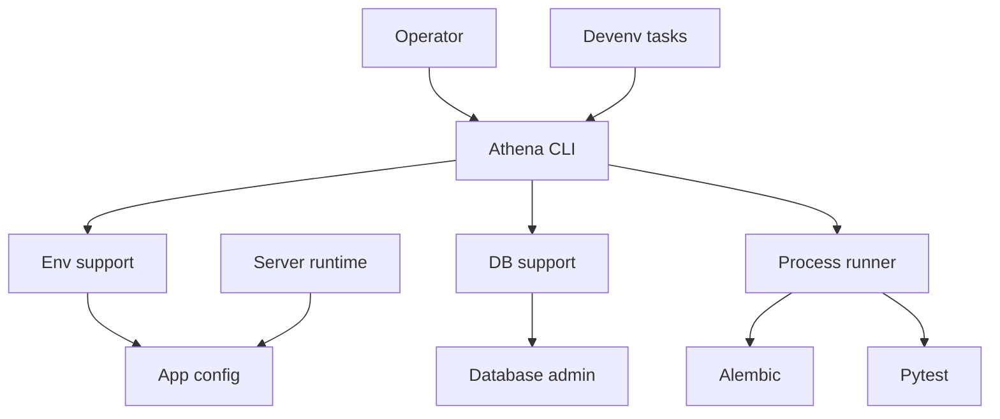
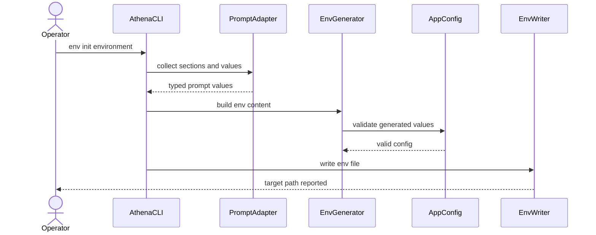
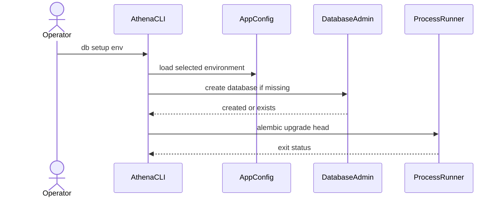
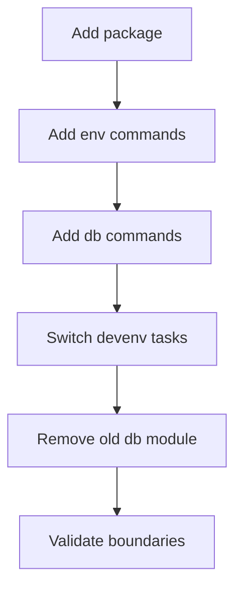

# Technical Design Document

## Overview

Athena CLI Management は、開発者と運用者が環境ファイル生成、DB 準備、マイグレーション、設定検証、テスト実行を `athena` から一貫して実行できるようにする管理 CLI 基盤である。既存の `AppConfig`、DB admin helper、Alembic、devenv task を再利用しつつ、CLI を `athena_cli` package として server runtime から分離する。

この feature は CLI transport の基礎を確立する。CLI は command routing、prompt、presentation、subprocess orchestration を担当し、server 側の runtime 起動は扱わない。development/test 限定の user 管理は、専用 command use-case と management composition を通る薄い運用 adapter として扱う。

### Goals

- `athena` console script と command group を提供し、管理操作の入口を統一する。
- `.env.<environment>` 生成、見本出力、上書き安全性、設定検証を `AppConfig` schema と整合させる。
- DB 作成、migration、setup、pytest 実行を環境選択付きで orchestration する。
- `devenv` task 名を維持しつつ、内部実装を Athena CLI 呼び出しに集約する。
- `athena_cli` と `osu_server` の依存方向を import-linter で検査可能にする。

### Non-Goals

- サーバー起動コマンド、worker 起動コマンドの追加。
- user BAN、restrict、blob GC、audit log 基盤。
- production での user role 変更、または複数 role の付与/剥奪を扱う本格的な RBAC 管理 UI/API。
- DB drop、reset、seed、外部サービス疎通確認。
- `osu_server` から `athena_server` への rename。

## Boundary Commitments

### This Spec Owns

- `src/athena_cli` package と `athena` console script の導入。
- CLI command groups: `env`, `db`, `config`, top-level `test`。
- 共通 environment 選択と process environment への反映。
- env generation core、DSN builder、env file writer、prompt adapter、schema-based example renderer。
- DB create/migrate/setup と pytest subprocess orchestration。
- development/test 限定の `athena dev change-password` と `athena dev change-role`。
- `devenv.nix` task wrapper の CLI 経由化。
- 暫定 `python -m osu_server.db` entrypoint の削除。
- `osu_server` が `athena_cli` に依存しない import-linter contract。

### Out of Boundary

- user BAN/restrict、blob 管理、audit log、doctor/connectivity check は後続 spec が所有する。
- production user 管理は audit log と権限チェックを含む後続 spec が所有する。
- Alembic migration implementation 自体は Alembic が所有する。本 spec は CLI から `alembic upgrade head` を実行する orchestration のみを所有する。
- `AppConfig` の全設定項目の意味や validation policy は既存 config subsystem が所有する。本 spec は CLI 生成と検証に必要な schema 参照を行う。
- devenv 固有の dynamic port 計算は `devenv.nix` が所有する。CLI は devenv 内部を知らない。

### Allowed Dependencies

- `athena_cli` may import `osu_server.config`, `osu_server.infrastructure.database.admin`, and lightweight management composition helpers under `osu_server.composition.management`.
- `athena_cli` may invoke external commands through subprocess: `alembic upgrade head`, `pytest`.
- `athena_cli` may use Typer for CLI routing and InquirerPy for interactive prompts.
- `osu_server` must not import `athena_cli`.
- `services`, `transports`, `jobs`, `domain`, `repositories`, `infrastructure` must not gain CLI presentation or prompt responsibilities.

### Revalidation Triggers

- `AppConfig` field names, required fields, env var mapping, or validation semantics change.
- DB admin helper return contract or failure behavior changes.
- Alembic invocation contract changes from subprocess to API integration.
- CLI command names, options, or exit code semantics change.
- `devenv.nix` test DB/Valkey default injection changes.
- import-linter root package or dependency direction changes.

## Architecture

### Existing Architecture Analysis

Current server code follows a layered modular monolith: transports call services, services call repositories/domain, infrastructure provides DB/Valkey/runtime integrations. CLI is introduced as a separate transport-like package, not as `osu_server.transports`, because it targets operational workflows and should not become part of app or worker startup.

Existing reusable assets:

- `AppConfig` and `load_config()` already load `.env.<environment>` according to `ENVIRONMENT`.
- `create_database_if_missing()` already implements idempotent PostgreSQL DB creation.
- `alembic/env.py` already loads config through `load_config()`.
- `devenv.nix` already computes test DB and Valkey defaults.

### Architecture Pattern & Boundary Map

Selected pattern: separate CLI transport package with thin orchestration and typed support modules.



Key decisions:

- CLI depends on server support, but server runtime never depends on CLI.
- Prompt and presentation are isolated inside `athena_cli`.
- Env generation and DSN construction are pure typed functions so interactive and non-interactive flows share the same core.
- Migration and test execution use subprocess initially, avoiding Alembic API coupling.

### Technology Stack

| Layer | Choice / Version | Role in Feature | Notes |
|-------|------------------|-----------------|-------|
| CLI | Typer (new dependency, uv lock resolved) | Command groups, typed options, `CliRunner` testing | Official docs confirm explicit `add_typer(..., name=...)`, callback options, and `typer.testing.CliRunner` |
| Prompt | InquirerPy (new dependency, uv lock resolved) | checkbox, secret, confirm, text prompt | Official docs confirm checkbox choices, secret prompt, confirm prompt, and validation hooks |
| Config | pydantic-settings + Pydantic v2 | `AppConfig` validation and schema introspection | Existing stack |
| DB | SQLAlchemy 2.0 async + asyncpg | Existing DB create helper | No SQLite/test-only driver introduced |
| Migration | Alembic | `alembic upgrade head` subprocess | Existing migration owner |
| Runtime | uv/devenv/subprocess | CLI install and task wrappers | devenv dynamic defaults stay in Nix |

## File Structure Plan

### Directory Structure

```text
src/
├── athena_cli/
│   ├── __init__.py                    # CLI package marker
│   ├── main.py                        # Typer root app and command group registration
│   ├── context.py                     # Environment selection and CLI context dataclasses
│   ├── errors.py                      # CLI-specific exceptions and exit code mapping
│   ├── presentation.py                # Console output, masking, and error formatting
│   ├── prompts.py                     # InquirerPy adapter and prompt result types
│   ├── runners.py                     # Subprocess runner abstraction for Alembic and pytest
│   ├── commands/
│   │   ├── __init__.py
│   │   ├── env.py                     # `athena env init` and `athena env example`
│   │   ├── db.py                      # `athena db create`, `migrate`, `setup`
│   │   ├── config.py                  # `athena config check`
│   │   └── test.py                    # `athena test`
│   └── env/
│       ├── __init__.py
│       ├── schema.py                  # AppConfig field introspection and env var metadata
│       ├── generation.py              # env content generation and missing value detection
│       ├── dsn.py                     # PostgreSQL and Valkey DSN builders
│       ├── writer.py                  # `.env.<environment>` path and overwrite safety
│       └── production.py              # unsafe production local default checks
└── osu_server/
    └── infrastructure/database/admin.py # reused by CLI, not owned by CLI

tests/
├── unit/athena_cli/
│   ├── test_context.py
│   ├── test_env_generation.py
│   ├── test_env_writer.py
│   ├── test_dsn.py
│   ├── test_production_config.py
│   └── test_runners.py
└── integration/athena_cli/
    ├── test_cli_help.py
    ├── test_cli_env.py
    ├── test_cli_db.py
    ├── test_cli_config.py
    └── test_cli_test_command.py
```

### Component Ownership Map

| Component | Primary File Path | Notes |
|-----------|-------------------|-------|
| Root CLI App | `src/athena_cli/main.py` | Registers command groups and root callback. |
| CLI Context | `src/athena_cli/context.py` | Owns environment literals, fallback, and subprocess env construction. |
| Prompt Adapter | `src/athena_cli/prompts.py` | Contains all InquirerPy interaction and typed prompt result conversion. |
| Presentation | `src/athena_cli/presentation.py` | Owns masking, production banner, and command output formatting. |
| Env Schema | `src/athena_cli/env/schema.py` | Reads `AppConfig.model_fields`; does not read `.env.example`. |
| DSN Builder | `src/athena_cli/env/dsn.py` | Builds file values and masked display values. |
| Env Generator | `src/athena_cli/env/generation.py` | Shares interactive and non-interactive env content generation. |
| Env Writer | `src/athena_cli/env/writer.py` | Applies overwrite and production confirmation policy. |
| Production Safety | `src/athena_cli/env/production.py` | Rejects unsafe production defaults for config checks. |
| DB Command | `src/athena_cli/commands/db.py` | Orchestrates create, migrate, and setup. |
| Database Admin Adapter | `src/athena_cli/commands/db.py` | Thin async call boundary around `create_database_if_missing()`. |
| Process Runner | `src/athena_cli/runners.py` | Runs Alembic and pytest subprocesses. |
| Config Command | `src/athena_cli/commands/config.py` | Loads config and applies production safety checks. |
| Test Command | `src/athena_cli/commands/test.py` | Runs setup guard then pytest. |
| Devenv Integration | `devenv.nix` | Preserves task names and injects final `DATABASE_URL` / `VALKEY_URL`. |
| Packaging Integration | `pyproject.toml` | Adds package, script, dependencies, ruff, and import-linter settings. |
| Boundary Contract | `pyproject.toml` | Adds import-linter root and forbidden dependency contract. |

### Modified Files

- `pyproject.toml` — add `typer`, `InquirerPy`, `[project.scripts] athena`, wheel package `src/athena_cli`, Ruff first-party package, import-linter root package and forbidden contract.
- `devenv.nix` — keep task names, replace task bodies with `uv run athena ...` while preserving dynamic `DATABASE_URL` and `VALKEY_URL` injection.
- `src/osu_server/db.py` — delete temporary argparse DB CLI.
- `tests/unit/infrastructure/test_config.py` — extend only if needed to cover schema assumptions used by env generation.
- `.env.example` — keep as human-readable example; may be updated to match generated schema output but is not source of truth.

## System Flows

### env init flow



Flow decisions:

- `--non-interactive` skips `PromptAdapter` and uses process env/default values only.
- Generated content is validated before file write.
- Existing files fail unless overwrite rules are satisfied.

### db setup and test flow



`athena test --env test` reuses setup behavior and runs pytest only when setup succeeds.

## Requirements Traceability

| Requirement | Summary | Components | Interfaces | Flows |
|-------------|---------|------------|------------|-------|
| 1.1 | Help shows command groups | Root CLI App | Typer app | CLI help |
| 1.2 | Unknown commands fail | Root CLI App | Typer app | CLI help |
| 1.3 | `athena` console script exists | Packaging Integration | console script | CLI help |
| 1.4 | No server startup command | Root CLI App | command registry | CLI help |
| 2.1 | Supported `--env` values target environment | CLI Context | environment option | all command flows |
| 2.2 | Omitted `--env` uses process env or development | CLI Context | environment resolver | all command flows |
| 2.3 | Unsupported env fails | CLI Context, Error Mapping | validation error | all command flows |
| 2.4 | Production visible before non-read-only work | Presentation, CLI Context | production banner | env/db flows |
| 3.1 | Interactive env wizard starts | Env Command, Prompt Adapter | prompt contract | env init flow |
| 3.2 | Section selection | Prompt Adapter | checkbox prompt | env init flow |
| 3.3 | DB parts generate database URL | DSN Builder, Env Generator | DSN contract | env init flow |
| 3.4 | Valkey parts generate URL | DSN Builder, Env Generator | DSN contract | env init flow |
| 3.5 | osu API prompt and credentials | Prompt Adapter, Env Generator | section values | env init flow |
| 3.6 | Secret input hidden and masked | Prompt Adapter, Presentation | secret masking | env init flow |
| 3.7 | Invalid content fails before write | Env Generator, Env Writer | validation result | env init flow |
| 4.1 | Non-interactive generation | Env Command, Env Generator | generation input | env init flow |
| 4.2 | Missing required values listed | Env Generator, Error Mapping | missing values error | env init flow |
| 4.3 | Example derived from schema | Env Schema, Env Command | example output | env example |
| 4.4 | `.env.example` not source of truth | Env Schema | schema source | env example |
| 5.1 | Existing file fails without force | Env Writer | write policy | env init flow |
| 5.2 | Non-production force overwrite | Env Writer, Presentation | write policy | env init flow |
| 5.3 | Production overwrite requires force and confirmation | Env Writer, Prompt Adapter | confirmation | env init flow |
| 5.4 | Written path reported | Presentation, Env Writer | output contract | env init flow |
| 6.1 | DB create creates missing DB | DB Command, Database Admin Adapter | create command | db flow |
| 6.2 | Existing DB exits successfully | DB Command | status output | db flow |
| 6.3 | Production DB create confirmation | DB Command, Prompt Adapter | confirmation | db flow |
| 6.4 | DB create failure exits non-zero | Error Mapping | error output | db flow |
| 7.1 | DB migrate applies migrations | DB Command, Process Runner | subprocess | db flow |
| 7.2 | DB setup create then migrate | DB Command | setup orchestration | db flow |
| 7.3 | Idempotent setup succeeds | DB Command | setup orchestration | db flow |
| 7.4 | Migration failure exits non-zero | Process Runner, Error Mapping | subprocess result | db flow |
| 7.5 | No drop/reset/seed | DB Command | command registry | CLI help |
| 8.1 | Config check validates environment | Config Command | validation command | config check |
| 8.2 | Success without external contact | Config Command | config load only | config check |
| 8.3 | Validation failure lists settings | Error Mapping | validation output | config check |
| 8.4 | Production unsafe local defaults rejected | Production Safety | safety check | config check |
| 8.5 | No connectivity checks | Config Command | command scope | config check |
| 9.1 | Test prepares DB then pytest | Test Command, DB Command, Process Runner | test command | test flow |
| 9.2 | Single path passed to pytest | Test Command | path option | test flow |
| 9.3 | Multiple paths passed to pytest | Test Command | repeated option | test flow |
| 9.4 | Default `tests/` | Test Command | path default | test flow |
| 9.5 | Setup failure skips pytest | Test Command | orchestration guard | test flow |
| 9.6 | Pytest exit propagated | Process Runner, Error Mapping | subprocess result | test flow |
| 10.1 | `db:test:create` invokes CLI | Devenv Integration | task wrapper | devenv flow |
| 10.2 | `db:test:migrate` invokes CLI | Devenv Integration | task wrapper | devenv flow |
| 10.3 | `test` invokes CLI | Devenv Integration | task wrapper | devenv flow |
| 10.4 | devenv defaults stay in Nix | Devenv Integration, CLI Context | env injection | devenv flow |
| 11.1 | Temporary DB CLI removed | Packaging Integration | removed module | old entrypoint |
| 11.2 | Docs/hints point to canonical CLI | Devenv Integration | task command text | devenv flow |
| 11.3 | Removed path does not perform DB admin | Packaging Integration | no module | old entrypoint |
| 12.1 | Server runtime does not import CLI | Boundary Contract | import-linter | startup |
| 12.2 | CLI can call config/service behavior | Boundary Contract | allowed imports | all flows |
| 12.3 | Dependency boundary validated | Boundary Contract | import-linter | validation |
| 12.4 | No future state-changing commands | Root CLI App | command registry | CLI help |

## Components and Interfaces

| Component | Domain/Layer | Intent | Req Coverage | Key Dependencies | Contracts |
|-----------|--------------|--------|--------------|------------------|-----------|
| Root CLI App | CLI | Typer app and command registration | 1.1, 1.2, 1.4, 7.5, 12.4 | Typer P0 | API |
| CLI Context | CLI | Resolve and expose selected environment | 2.1, 2.2, 2.3, 2.4 | AppConfig P1 | State |
| Prompt Adapter | CLI | Typed wrapper around InquirerPy prompts | 3.1, 3.2, 3.5, 3.6, 5.3, 6.3 | InquirerPy P1 | Service |
| Presentation | CLI | Output, masking, and error formatting | 2.4, 3.6, 5.4, 8.3 | Typer P1 | Service |
| Env Schema | Env | Introspect `AppConfig.model_fields` | 4.3, 4.4 | AppConfig P0 | Service |
| DSN Builder | Env | Build PostgreSQL and Valkey DSNs from parts | 3.3, 3.4 | urllib P0 | Service |
| Env Generator | Env | Convert prompt/env values to dotenv content | 3.7, 4.1, 4.2 | Env Schema P0, AppConfig P0 | Service |
| Env Writer | Env | Apply file path and overwrite policy | 5.1, 5.2, 5.3, 5.4 | pathlib P0 | Service |
| Production Safety | Env | Reject unsafe production local defaults | 8.4 | AppConfig P0 | Service |
| DB Command | CLI | DB create/migrate/setup orchestration | 6.1, 6.2, 6.3, 6.4, 7.1, 7.2, 7.3, 7.4, 7.5 | Database Admin Adapter P0, Process Runner P0 | API |
| Database Admin Adapter | CLI | Call existing DB create helper | 6.1, 6.2, 6.4 | `create_database_if_missing` P0 | Service |
| Process Runner | CLI | Run Alembic and pytest with selected environment | 7.1, 7.4, 9.1, 9.5, 9.6 | subprocess P0 | Service |
| Config Command | CLI | Load and validate selected config | 8.1, 8.2, 8.3, 8.5 | AppConfig P0, Production Safety P0 | API |
| Test Command | CLI | Setup test DB and run pytest paths | 9.1, 9.2, 9.3, 9.4, 9.5, 9.6 | DB Command P0, Process Runner P0 | API |
| Devenv Integration | Infra | Keep task names and delegate to CLI | 10.1, 10.2, 10.3, 10.4, 11.2 | devenv P0, uv P0 | Batch |
| Packaging Integration | Infra | Install package and remove temporary entrypoint | 1.3, 11.1, 11.3 | pyproject P0 | Batch |
| Boundary Contract | Architecture | Enforce CLI/server dependency direction | 12.1, 12.2, 12.3 | import-linter P0 | Batch |

### CLI Layer

#### Root CLI App

| Field | Detail |
|-------|--------|
| Intent | `athena` root command and command group registration |
| Requirements | 1.1, 1.2, 1.4, 7.5, 12.4 |

**Responsibilities & Constraints**
- Register `env`, `db`, `config`, and `test` only.
- Use explicit Typer sub-app names.
- Omit server startup and future state-changing management commands.

**Dependencies**
- External: Typer — command routing and help output (P0)
- Outbound: command modules — command registration (P0)

**Contracts**: API [x] / Event [ ] / Batch [ ] / State [ ]

##### API Contract
- Trigger: `athena --help`, `athena env ...`, `athena db ...`, `athena config ...`, `athena test ...`.
- Unknown commands return non-zero exit code through Typer.
- Help output includes only in-scope command groups.

#### CLI Context

| Field | Detail |
|-------|--------|
| Intent | Resolve, validate, and apply selected environment |
| Requirements | 2.1, 2.2, 2.3, 2.4, 10.4 |

**Responsibilities & Constraints**
- Supported environments are `development`, `test`, and `production`.
- Omitted `--env` uses existing `ENVIRONMENT` or falls back to `development`.
- Selected env is applied to subprocess environment as `ENVIRONMENT`.
- Production non-read-only commands display production target before work.

**Contracts**: Service [x] / State [x]

##### Service Interface
```python
@dataclass(frozen=True, slots=True)
class CliContext:
    environment: Literal["development", "test", "production"]
    env_file_name: str

class EnvironmentResolver(Protocol):
    def resolve(self, raw_environment: str | None) -> CliContext: ...
```

- Preconditions: raw value is CLI option, process env, or `None`.
- Postconditions: result environment is one of the supported literals.
- Invariants: resolver does not read or write env files.

#### Prompt Adapter

| Field | Detail |
|-------|--------|
| Intent | Isolate InquirerPy weak typing behind typed prompt methods |
| Requirements | 3.1, 3.2, 3.5, 3.6, 5.3, 6.3 |

**Responsibilities & Constraints**
- Provide checkbox, text, secret, and confirm methods.
- Return typed dataclasses or primitive values, not raw `Any` prompt maps.
- Secret values are never printed; confirmation output receives masked values.
- Non-interactive mode bypasses this component entirely.

**Dependencies**
- External: InquirerPy — interactive prompt execution (P1)

**Contracts**: Service [x]

##### Service Interface
```python
class PromptAdapter(Protocol):
    def select_env_sections(self) -> frozenset[EnvSection]: ...
    def ask_database_parts(self) -> DatabaseDsnParts: ...
    def ask_valkey_parts(self) -> ValkeyDsnParts: ...
    def ask_official_osu_api(self) -> OfficialOsuApiInput: ...
    def confirm(self, message: str) -> bool: ...
```

- Preconditions: interactive terminal is available.
- Postconditions: returned values are validated at CLI boundary shape level.
- Invariants: prompt adapter does not write files and does not load `AppConfig`.

### Env Layer

#### Env Schema

| Field | Detail |
|-------|--------|
| Intent | Provide stable env var metadata from `AppConfig` |
| Requirements | 4.3, 4.4 |

**Responsibilities & Constraints**
- Derive env var names from `AppConfig.model_fields` and `env_prefix=""`.
- Classify required, optional, defaulted, secret, and list-like fields.
- `.env.example` remains output documentation only, never input source.

**Contracts**: Service [x]

##### Service Interface
```python
@dataclass(frozen=True, slots=True)
class EnvFieldSpec:
    field_name: str
    env_name: str
    required: bool
    default: str | None
    secret: bool
    list_like: bool

class EnvSchemaProvider(Protocol):
    def list_fields(self) -> tuple[EnvFieldSpec, ...]: ...
```

#### DSN Builder

| Field | Detail |
|-------|--------|
| Intent | Construct connection URLs from individual parts |
| Requirements | 3.3, 3.4 |

**Responsibilities & Constraints**
- Build PostgreSQL DSNs and Valkey DSNs with URL encoding for credentials and path segments.
- Keep file output value separate from masked display value.
- Do not test connectivity.

**Contracts**: Service [x]

##### Service Interface
```python
@dataclass(frozen=True, slots=True)
class DatabaseDsnParts:
    host: str
    port: int
    database: str
    username: str | None
    password: str | None

@dataclass(frozen=True, slots=True)
class ValkeyDsnParts:
    host: str
    port: int
    database: int
    password: str | None

class DsnBuilder(Protocol):
    def build_database_url(self, parts: DatabaseDsnParts) -> str: ...
    def build_valkey_url(self, parts: ValkeyDsnParts) -> str: ...
```

#### Env Generator

| Field | Detail |
|-------|--------|
| Intent | Produce validated dotenv content from selected values |
| Requirements | 3.7, 4.1, 4.2 |

**Responsibilities & Constraints**
- Interactive and non-interactive flows share this component.
- Validate generated content by constructing `AppConfig` before file write.
- Missing required values in non-interactive mode are returned as explicit field names.

**Contracts**: Service [x]

##### Service Interface
```python
@dataclass(frozen=True, slots=True)
class EnvGenerationInput:
    environment: Literal["development", "test", "production"]
    values: Mapping[str, str]

@dataclass(frozen=True, slots=True)
class EnvGenerationResult:
    content: str
    masked_summary: tuple[str, ...]

class EnvGenerator(Protocol):
    def generate(self, input: EnvGenerationInput) -> EnvGenerationResult: ...
```

#### Env Writer

| Field | Detail |
|-------|--------|
| Intent | Write `.env.<environment>` using explicit overwrite policy |
| Requirements | 5.1, 5.2, 5.3, 5.4 |

**Responsibilities & Constraints**
- Target path is project-relative `.env.<environment>`.
- Existing file without `--force` fails before content write.
- `.env.production` overwrite requires both `--force` and confirmation.

**Contracts**: Service [x]

##### Service Interface
```python
@dataclass(frozen=True, slots=True)
class EnvWriteRequest:
    environment: Literal["development", "test", "production"]
    content: str
    force: bool
    confirmed: bool

class EnvWriter(Protocol):
    def write(self, request: EnvWriteRequest) -> Path: ...
```

### DB and Process Layer

#### Database Admin Adapter

| Field | Detail |
|-------|--------|
| Intent | Bridge CLI DB create to existing DB helper |
| Requirements | 6.1, 6.2, 6.4 |

**Responsibilities & Constraints**
- Call `create_database_if_missing(str(config.database_url))`.
- Convert helper return value to CLI status message.
- Surface helper exceptions through CLI error mapping.

**Contracts**: Service [x]

##### Service Interface
```python
class DatabaseCreator(Protocol):
    async def create_if_missing(self, database_url: str) -> bool: ...
```

#### Process Runner

| Field | Detail |
|-------|--------|
| Intent | Execute Alembic and pytest with passthrough exit behavior |
| Requirements | 7.1, 7.4, 9.1, 9.5, 9.6 |

**Responsibilities & Constraints**
- Run `alembic upgrade head` and pytest as subprocesses.
- Pass selected `ENVIRONMENT` plus inherited process env.
- Preserve stdout/stderr passthrough for operator visibility.
- Return explicit exit code for CLI propagation.

**Contracts**: Service [x]

##### Service Interface
```python
@dataclass(frozen=True, slots=True)
class CommandResult:
    exit_code: int

class ProcessRunner(Protocol):
    def run(self, argv: Sequence[str], env: Mapping[str, str]) -> CommandResult: ...
```

### Infrastructure Integration

#### Devenv Integration

| Field | Detail |
|-------|--------|
| Intent | Preserve existing task names while delegating to Athena CLI |
| Requirements | 10.1, 10.2, 10.3, 10.4, 11.2 |

**Responsibilities & Constraints**
- `db:test:create` calls `uv run athena db create --env test`.
- `db:test:migrate` calls `uv run athena db migrate --env test`.
- `test` calls `uv run athena test --env test`.
- `DATABASE_URL`, `VALKEY_URL`, `ENVIRONMENT=test`, `.env.test`, and dynamic defaults remain resolved in Nix shell logic before invoking `uv run athena ...`.

**Contracts**: Batch [x]

##### Batch / Job Contract
- Trigger: `devenv tasks run <task>`.
- Input: environment variables exported by task body.
- Output: CLI exit code.
- Idempotency: create/migrate/test behavior remains idempotent where underlying commands are idempotent.

#### Boundary Contract

| Field | Detail |
|-------|--------|
| Intent | Enforce CLI/server dependency direction |
| Requirements | 12.1, 12.2, 12.3 |

**Responsibilities & Constraints**
- Add `athena_cli` to import-linter root packages.
- Add forbidden contract from `osu_server` to `athena_cli`.
- Allow `athena_cli` to import approved `osu_server` support modules.

**Contracts**: Batch [x]

##### Batch / Job Contract
- Trigger: `import-linter lint` or pre-commit hook.
- Output: pass when server runtime has no CLI dependency.
- Recovery: remove forbidden import or move shared logic out of CLI.

## Data Models

No database schema changes are introduced.

### Domain Model

CLI-only value objects are standard `@dataclass(slots=True, frozen=True)` types:

- `CliContext`
- `EnvFieldSpec`
- `DatabaseDsnParts`
- `ValkeyDsnParts`
- `OfficialOsuApiInput`
- `EnvGenerationInput`
- `EnvGenerationResult`
- `EnvWriteRequest`
- `CommandResult`

These are not persistent domain aggregates and do not enter `osu_server.domain`.

### Data Contracts & Integration

- dotenv output uses uppercase env var names matching `AppConfig` with `env_prefix=""`.
- list-like values use the same format accepted by current `AppConfig` validators.
- secret values are written to file when provided but masked in console output.

## Error Handling

### Error Strategy

- CLI user errors produce non-zero exit codes and actionable messages.
- Typer handles unknown commands and malformed options.
- CLI-specific errors are raised from typed support modules and converted at command boundary.
- Subprocess failures propagate the subprocess exit code where applicable.

### Error Categories and Responses

- Environment validation error: unsupported `--env` → non-zero exit and supported values.
- Missing env values: non-interactive generation lacks required values → non-zero exit and missing env names.
- File safety error: existing file without force or unconfirmed production overwrite → non-zero exit, no write.
- Config validation error: Pydantic validation failure → non-zero exit and field-oriented summary.
- DB create error: helper exception → non-zero exit and failure reason.
- Migration/test failure: subprocess exit code propagated.

### Monitoring

No new telemetry pipeline is added. CLI outputs operator-visible messages to stdout/stderr only.

## Testing Strategy

### Unit Tests

- `EnvironmentResolver` validates supported environments, fallback from process env, and unsupported env failure for 2.1, 2.2, 2.3.
- `DsnBuilder` encodes PostgreSQL and Valkey credentials, database names, and password masking separation for 3.3, 3.4, 3.6.
- `EnvGenerator` detects missing required values in non-interactive mode and validates generated content before writer use for 3.7, 4.1, 4.2.
- `EnvWriter` rejects existing files without force and requires confirmation for `.env.production` overwrite for 5.1, 5.2, 5.3.
- `Production Safety` rejects unsafe production local defaults without contacting external services for 8.4, 8.5.
- `ProcessRunner` returns exit codes and preserves argv/env construction for 7.4, 9.6.

### Integration Tests

- Typer `CliRunner` verifies root help lists `env`, `db`, `config`, `test` and omits server startup commands for 1.1, 1.4, 12.4.
- `athena env example` output is derived from `AppConfig` schema and does not read `.env.example` for 4.3, 4.4.
- `athena env init --non-interactive` writes `.env.development` only when required values exist and reports target path for 4.1, 5.4.
- `athena db create --env test` uses stubbed database creator and reports created/already exists outcomes for 6.1, 6.2.
- `athena db setup --env test` runs create then migrate and stops on migration failure for 7.2, 7.4.
- `athena config check --env production` validates config and applies production safety checks without DB/Valkey/osu/blob connectivity for 8.1, 8.2, 8.5.
- `athena test --env test --path a --path b` runs setup first and passes both paths to pytest for 9.1, 9.3, 9.5.

### Configuration and Boundary Tests

- `import-linter lint` verifies `osu_server` does not depend on `athena_cli` for 12.1, 12.3.
- `nix-instantiate --parse devenv.nix` verifies task wrapper syntax after replacing commands for 10.1, 10.2, 10.3.
- A packaging smoke test verifies `uv run athena --help` resolves the console script for 1.3.

## Security Considerations

- Secret prompt input is hidden through InquirerPy secret prompts and masked in confirmation output.
- Production env overwrite and production DB create require explicit confirmation.
- Config generation never logs full secret values.
- CLI does not add BAN/restrict/role/blob GC commands before audit log exists.
- DB create uses existing PostgreSQL identifier quoting through `quote_identifier()`.

## Migration Strategy



- Introduce `athena_cli` package and tests first.
- Add env/config/db/test commands behind new console script.
- Replace devenv task bodies after CLI commands are available.
- Delete `src/osu_server/db.py` only after `athena db create` is covered.
- Validate with pytest, basedpyright, ruff, import-linter, and Nix parse.
