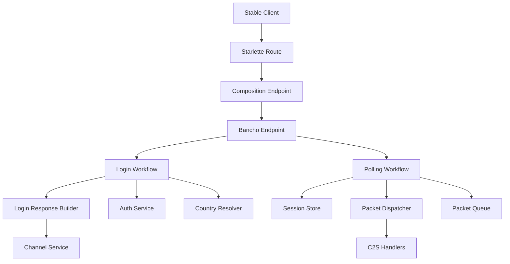
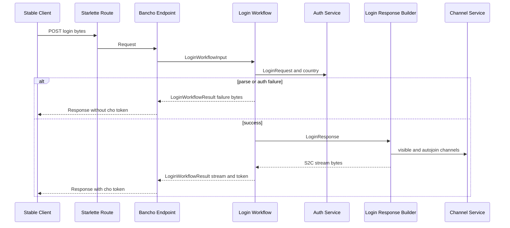
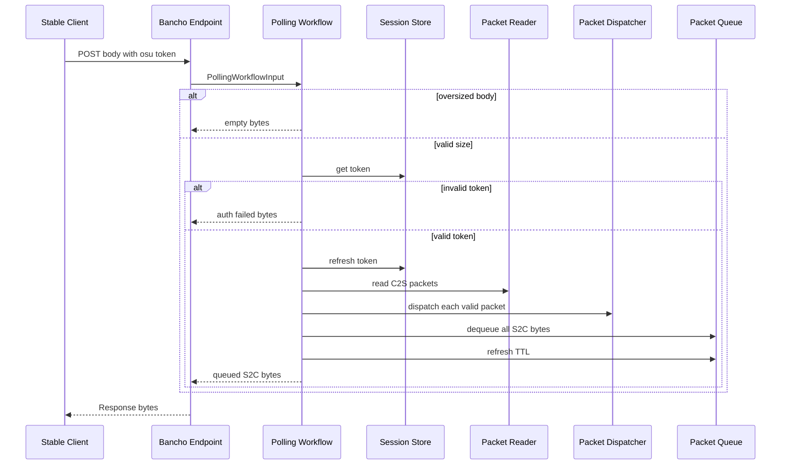

# Design Document

## Overview

この設計は、stable bancho の `POST /` 入口を `BanchoEndpoint` として HTTP 境界に限定し、ログイン処理、polling pipeline、初期 S2C packet stream 生成を bancho transport 内の workflow に分離します。対象ユーザーは Bancho transport を保守・拡張する開発者です。

現在の `LoginHandler` は複数のサービス、状態ストア、packet dispatcher、packet queue、S2C builder 依存を直接抱えています。本設計は wire behavior を維持したまま、変更単位とテスト単位を `BanchoEndpoint`、`LoginWorkflow`、`PollingWorkflow`、`LoginResponseBuilder` に分けます。

### Goals

- `POST /` の login と polling の外部挙動を完全維持する。
- HTTP request / response 処理を `BanchoEndpoint` に閉じ込める。
- Login と polling を Starlette 非依存の input / result contract で単体テスト可能にする。
- 初期 S2C packet stream 生成を独立した builder として検証可能にする。
- DI、routing、既存 C2S handler registration と統合テストを維持する。

### Non-Goals

- bancho wire protocol の packet ID、packet payload、packet order の仕様変更。
- 認証、セッション、チャンネル、packet queue、C2S dispatcher の意味論変更。
- top-level Application 層の新設。
- lazer、REST API、web legacy、SignalR の変更。
- 新しい外部依存や storage schema の導入。

## Boundary Commitments

### This Spec Owns

- `LoginHandler` の責務分離と `BanchoEndpoint` への置き換え。
- `LoginWorkflowInput` / `LoginWorkflowResult`、`PollingWorkflowInput` / `PollingWorkflowResult` の contract。
- `LoginWorkflow` による login parse、country resolution、auth orchestration、login result mapping。
- `LoginResponseBuilder` による初期 S2C packet stream 構築。
- `PollingWorkflow` による body-size check、session validation、TTL refresh、C2S parse / dispatch、S2C drain、queue TTL refresh、diagnostic logging。
- composition root、lifespan、endpoint adapter、unit / integration / E2E tests の更新。

### Out of Boundary

- `AuthService`、`ChannelService`、`SessionStore`、`PacketQueue`、`PacketDispatcher` の public contract 変更。
- `read_packets`、S2C packet builder、bancho parser の protocol format 変更。
- `services` 層への bancho protocol 固有 logic の移動。
- backward compatibility alias としての `LoginHandler` 残置。
- database、Valkey key schema、taskiq job、EventBus listener の設計変更。

### Allowed Dependencies

- `BanchoEndpoint` は Starlette `Request` / `Response` と bancho workflow のみを扱う。
- `LoginWorkflow` は `AuthService`、`CountryResolver`、`parse_login_request`、`login_reply`、`LoginResponseBuilder` に依存してよい。
- `LoginResponseBuilder` は `ChannelService`、bancho S2C builder、`PermissionService.to_client_flags`、country conversion に依存してよい。
- `PollingWorkflow` は `SessionStore`、`PacketQueue`、`PacketDispatcher`、`read_packets`、`login_reply`、structlog に依存してよい。
- 新規 workflow は `src/osu_server/transports/bancho` 配下に置き、`osu_server.services` から import されてはならない。
- import-linter の既存レイヤー規約を変更しない。

### Revalidation Triggers

- `cho-token` / `osu-token` header semantics の変更。
- Login success stream の packet 内容または順序の変更。
- Polling の body-size check、session validation、C2S dispatch、S2C drain の順序変更。
- `PacketDispatcher.dispatch`、`PacketQueue.dequeue_all`、`SessionStore.refresh` の contract 変更。
- composition state key または DI registration name の変更。
- structlog event name の変更。

## Architecture

### Existing Architecture Analysis

`LoginHandler` は `src/osu_server/transports/bancho/handlers/login.py` にあり、`POST /` の login と polling を `osu-token` header の有無で分岐しています。login path は body parsing、country resolution、auth、S2C stream construction を行い、polling path は body-size validation、session validation、C2S parse / dispatch、S2C queue drain を行います。

既存の reusable assets は十分です。`AuthService`、`ChannelService`、`SessionStore`、`PacketQueue`、`PacketDispatcher`、`read_packets`、S2C builder は維持し、責務配置だけを変更します。

### Architecture Pattern & Boundary Map

選択する pattern は bancho-local workflow extraction です。top-level Application 層を増やさず、protocol-specific orchestration を bancho transport の内側に閉じ込めます。



**Architecture Integration**

- Selected pattern: bancho-local workflow extraction。HTTP endpoint と protocol workflow の境界を分ける。
- Domain / feature boundaries: bancho transport が protocol orchestration を所有し、services は protocol 非依存のままにする。
- Existing patterns preserved: Starlette routing、自前 DI、PacketDispatcher registration、in-memory test doubles、strict type checking。
- New components rationale: `BanchoEndpoint` は HTTP 境界、workflow は testable orchestration、builder は byte-compatible S2C construction を担当する。
- Steering compliance: 既存レイヤー、TDD、basedpyright strict、ruff、import-linter を維持する。

### Technology Stack

| Layer | Choice / Version | Role in Feature | Notes |
|-------|------------------|-----------------|-------|
| Runtime | Python `>=3.14` | Typed dataclass と async workflow | 既存 `pyproject.toml` に準拠 |
| ASGI | Starlette declared dependency | `BanchoEndpoint` の HTTP request / response boundary | 新規 API は導入しない |
| Protocol | caterpillar-py `>=2.8.1` and existing bancho builders | C2S parsing and S2C bytes | 既存 reader / builder を再利用 |
| Services | Existing `AuthService`, `ChannelService`, `PermissionService` | Auth and channel visibility queries | public contract 変更なし |
| State | Existing `SessionStore`, `PacketQueue` | Session validation, TTL refresh, S2C drain | storage schema 変更なし |
| Observability | structlog `>=25.5.0` | Existing diagnostic events | event name を維持 |
| Testing | pytest, pytest-asyncio | Workflow, endpoint, integration, E2E validation | 既存 in-memory doubles を継続 |
| Architecture guard | import-linter | Layer boundary validation | contract 変更なし |

## File Structure Plan

### Directory Structure

```text
src/osu_server/
├── composition/
│   ├── endpoints.py                         # app.state.bancho_endpoint へ委譲
│   ├── lifespan.py                          # BanchoEndpoint を DI から解決して app.state に格納
│   └── service_registry.py                  # builder、workflow、endpoint を登録
└── transports/bancho/
    ├── endpoint.py                          # BanchoEndpoint。HTTP 境界のみ
    ├── workflows/
    │   ├── __init__.py                      # workflow public exports
    │   ├── login.py                         # LoginWorkflow と login input/result 型
    │   ├── polling.py                       # PollingWorkflow と polling input/result 型
    │   └── login_response_builder.py        # LoginResponseBuilder と protocol version 定数
    ├── handlers/
    │   └── login.py                         # 削除。旧 LoginHandler の残置は禁止
    ├── dispatch.py                          # 既存 PacketDispatcher。変更なし想定
    ├── parsers/login.py                     # 既存 login parser。変更なし想定
    └── protocol/                            # 既存 reader / S2C builders。変更なし想定
```

### Modified Files

- `src/osu_server/transports/bancho/endpoint.py` - 新規。`BanchoEndpoint` が `osu-token` header presence で workflow を選び、result を Starlette `Response` に変換する。
- `src/osu_server/transports/bancho/workflows/login.py` - 新規。login body parsing、country resolution、auth、success/failure result mapping を所有する。
- `src/osu_server/transports/bancho/workflows/polling.py` - 新規。polling pipeline の順序と failure tolerance を所有する。
- `src/osu_server/transports/bancho/workflows/login_response_builder.py` - 新規。成功 login response の S2C packet stream 構築を所有する。
- `src/osu_server/transports/bancho/workflows/__init__.py` - 新規。必要な workflow 型だけを明示 export する。
- `src/osu_server/transports/bancho/handlers/login.py` - 削除。旧 `LoginHandler` を alias として残さない。
- `src/osu_server/composition/service_registry.py` - `LoginResponseBuilder`、`LoginWorkflow`、`PollingWorkflow`、`BanchoEndpoint` を DI 登録し、既存 `PacketDispatcher` instance を `PollingWorkflow` に渡す。
- `src/osu_server/composition/lifespan.py` - `BanchoEndpoint` を resolve し、`app.state.bancho_endpoint` に格納する。
- `src/osu_server/composition/endpoints.py` - `bancho_endpoint` が `app.state.bancho_endpoint` に委譲する。
- `src/osu_server/composition/application.py` - route shape は維持。docstring の handler 名だけ必要に応じて更新する。
- `tests/unit/transports/bancho/test_endpoint.py` - 新規または移動。login / polling branch と HTTP response mapping を検証する。
- `tests/unit/transports/bancho/test_login_workflow.py` - 新規。parse failure、auth failure、success token、contextvars を検証する。
- `tests/unit/transports/bancho/test_login_response_builder.py` - 新規。初期 S2C packet stream 内容と順序を検証する。
- `tests/unit/transports/bancho/test_polling_workflow.py` - 新規または既存 `tests/unit/transports/test_polling_pipeline.py` の移動。polling pipeline を direct workflow invocation で検証する。
- `tests/unit/test_di_integration.py` - `LoginHandler` 解決 assertion を `BanchoEndpoint` と workflow collaborator 解決 assertion に置き換える。
- `tests/integration/test_login_flow.py`、`tests/integration/test_polling_e2e.py`、`tests/integration/test_chat_e2e.py`、`tests/integration/test_chat_pipeline.py`、`tests/e2e/test_c2s_e2e.py` - import / fixture を新 endpoint 構成へ更新し、wire behavior assertion は維持する。

## System Flows

### Login flow



### Polling flow



## Requirements Traceability

| Requirement | Summary | Components | Interfaces | Flows |
|-------------|---------|------------|------------|-------|
| 1.1 | Login request without `osu-token` remains login | BanchoEndpoint, LoginWorkflow | `BanchoEndpoint.__call__`, `LoginWorkflow.execute` | Login flow |
| 1.2 | Request with `osu-token` remains polling | BanchoEndpoint, PollingWorkflow | `BanchoEndpoint.__call__`, `PollingWorkflow.execute` | Polling flow |
| 1.3 | Login parse failure returns auth failed packet | LoginWorkflow | `LoginWorkflowResult.content` | Login flow |
| 1.4 | Auth rejection returns same login result packet | LoginWorkflow | `LoginWorkflowResult.content` | Login flow |
| 1.5 | Success returns `cho-token` and byte-compatible stream | BanchoEndpoint, LoginWorkflow, LoginResponseBuilder | `LoginWorkflowResult.cho_token`, `LoginResponseBuilder.build` | Login flow |
| 1.6 | Route, method, headers, status remain stable | BanchoEndpoint, Composition Wiring | Starlette `POST /`, `app.state.bancho_endpoint` | Login flow, Polling flow |
| 2.1 | Success stream includes login reply, protocol, permission, presence, stats | LoginResponseBuilder | `LoginResponseBuilder.build` | Login flow |
| 2.2 | Visible channels included | LoginResponseBuilder, ChannelService | `get_visible_channels` result consumption | Login flow |
| 2.3 | Autojoin channels included | LoginResponseBuilder, ChannelService | `get_autojoin_channels` result consumption | Login flow |
| 2.4 | Completion, friends, silence, presence bundle included | LoginResponseBuilder | `LoginResponseBuilder.build` | Login flow |
| 2.5 | Initial packet order remains compatible | LoginResponseBuilder | builder packet order contract | Login flow |
| 3.1 | C2S packets parsed and dispatched in order | PollingWorkflow, PacketDispatcher | `read_packets`, `dispatch` | Polling flow |
| 3.2 | Empty body drains S2C only | PollingWorkflow, PacketQueue | `PollingWorkflowInput.body`, `dequeue_all` | Polling flow |
| 3.3 | Invalid token returns auth failed packet | PollingWorkflow, SessionStore | `SessionStore.get` | Polling flow |
| 3.4 | Oversized body returns empty response | PollingWorkflow | body-size precondition | Polling flow |
| 3.5 | C2S parse failure still drains S2C | PollingWorkflow, PacketQueue | `PacketReadError` handling | Polling flow |
| 3.6 | C2S handler failure does not stop polling response | PollingWorkflow, PacketDispatcher | per-packet exception boundary | Polling flow |
| 3.7 | Session and queue lifetime behavior preserved | PollingWorkflow, SessionStore, PacketQueue | `refresh`, `refresh_ttl` | Polling flow |
| 4.1 | Login workflow direct test input/result | LoginWorkflow | `LoginWorkflowInput`, `LoginWorkflowResult` | Login flow |
| 4.2 | Polling workflow direct test input/result | PollingWorkflow | `PollingWorkflowInput`, `PollingWorkflowResult` | Polling flow |
| 4.3 | HTTP extraction changes isolated | BanchoEndpoint | endpoint request mapping | Login flow, Polling flow |
| 4.4 | Login response construction isolated from polling | LoginResponseBuilder | `build` | Login flow |
| 4.5 | Polling isolated from login auth and S2C construction | PollingWorkflow | `execute` | Polling flow |
| 4.6 | Bancho workflow stays inside bancho boundary | File Structure Plan, import-linter | module placement contract | Architecture map |
| 5.1 | Composition preserves route-level behavior | Composition Wiring, BanchoEndpoint | `bancho_endpoint` adapter | Login flow, Polling flow |
| 5.2 | C2S handler registration preserved | Composition Wiring, PacketDispatcher | `register_all`, `dispatch` | Polling flow |
| 5.3 | Future handlers use existing dispatch contract | PacketDispatcher, PollingWorkflow | `PacketHandler` contract | Polling flow |
| 5.4 | DI resolves endpoint and collaborators | Composition Wiring | DI singleton registrations | Architecture map |
| 6.1 | Unit tests cover workflows and endpoint routing | Testing Strategy | workflow direct invocation | Login flow, Polling flow |
| 6.2 | E2E/integration proves wire compatibility | Testing Strategy | TestClient flows | Login flow, Polling flow |
| 6.3 | DI integration proves composition | Testing Strategy, Composition Wiring | container resolution | Architecture map |
| 6.4 | Diagnostic log categories preserved | LoginWorkflow, PollingWorkflow | structlog events | Error handling |
| 6.5 | Stable bancho test coverage not reduced | Testing Strategy | regression suite retention | All flows |

## Components and Interfaces

| Component | Domain / Layer | Intent | Req Coverage | Key Dependencies | Contracts |
|-----------|----------------|--------|--------------|------------------|-----------|
| BanchoEndpoint | Transports bancho HTTP | Convert Starlette request to workflow input and workflow result to Response | 1.1, 1.2, 1.5, 1.6, 4.3, 5.1 | LoginWorkflow P0, PollingWorkflow P0, Starlette P0 | API, Service |
| LoginWorkflow | Transports bancho workflow | Parse and authenticate login requests without HTTP response coupling | 1.1, 1.3, 1.4, 1.5, 4.1, 6.4 | AuthService P0, CountryResolver P0, LoginResponseBuilder P0 | Service |
| LoginResponseBuilder | Transports bancho workflow | Build byte-compatible initial login S2C stream | 1.5, 2.1, 2.2, 2.3, 2.4, 2.5, 4.4 | ChannelService P0, S2C builders P0 | Service |
| PollingWorkflow | Transports bancho workflow | Execute polling pipeline without HTTP response coupling | 1.2, 3.1, 3.2, 3.3, 3.4, 3.5, 3.6, 3.7, 4.2, 4.5, 6.4 | SessionStore P0, PacketQueue P0, PacketDispatcher P0 | Service |
| Composition Wiring | Composition | Register and resolve endpoint and workflow graph | 1.6, 5.1, 5.2, 5.4, 6.3 | Container P0, AppConfig P1 | State |
| PacketDispatcher | Transports bancho dispatch | Existing C2S handler registry and dispatch contract | 3.1, 3.6, 5.2, 5.3 | C2S handlers P0 | Service |
| PacketQueue | Infrastructure state | Existing per-user S2C drain and queue TTL contract | 3.2, 3.5, 3.7 | Valkey or in-memory state P0 | State |

### Bancho Transport Endpoint

#### BanchoEndpoint

| Field | Detail |
|-------|--------|
| Intent | Starlette-facing callable for stable bancho `POST /` |
| Requirements | 1.1, 1.2, 1.5, 1.6, 4.3, 5.1 |

**Responsibilities & Constraints**

- Owns only HTTP boundary logic: request body reading, header presence branch, Response construction.
- Uses header presence, not token truthiness, to preserve login vs polling selection.
- Does not parse login body, authenticate, build S2C streams, parse C2S packets, or access queues directly.

**Dependencies**

- Inbound: `composition.endpoints.bancho_endpoint` - route adapter (P0)
- Outbound: `LoginWorkflow` - login branch (P0)
- Outbound: `PollingWorkflow` - polling branch (P0)
- External: Starlette `Request` / `Response` - HTTP boundary only (P0)

**Contracts**: Service [x] / API [x] / Event [ ] / Batch [ ] / State [ ]

##### Service Interface

```python
class BanchoEndpoint:
    async def __call__(self, request: Request) -> Response: ...
```

- Preconditions: request is a Starlette request for bancho `POST /`.
- Postconditions: response content and headers reflect workflow result.
- Invariants: `osu-token` header presence selects polling; absence selects login.

##### API Contract

| Method | Endpoint | Request | Response | Errors |
|--------|----------|---------|----------|--------|
| POST | `/` | stable bancho login body without `osu-token` | S2C bytes with optional `cho-token` on success | auth failure encoded as S2C login reply |
| POST | `/` | stable bancho polling body with `osu-token` | S2C bytes from polling workflow | invalid token encoded as S2C login reply |

**Implementation Notes**

- Integration: `composition.endpoints.bancho_endpoint` reads `app.state.bancho_endpoint`.
- Validation: endpoint unit tests assert branch behavior and header mapping.
- Risks: accidentally checking token truthiness would change empty-token behavior.

### Bancho Workflows

#### LoginWorkflow

| Field | Detail |
|-------|--------|
| Intent | Starlette-independent login orchestration |
| Requirements | 1.1, 1.3, 1.4, 1.5, 4.1, 6.4 |

**Responsibilities & Constraints**

- Converts `LoginWorkflowInput` into `LoginWorkflowResult`.
- Owns parse failure handling and `login_parse_failed` logging.
- Calls `CountryResolver` with header mapping and `AuthService.login` with parsed login request.
- Maps `LoginResult` failures to `login_reply(result)` bytes without `cho_token`.
- On success, binds structlog contextvars and delegates S2C stream construction to `LoginResponseBuilder`.

**Dependencies**

- Inbound: `BanchoEndpoint` - login branch (P0)
- Outbound: `parse_login_request` - login body parser (P0)
- Outbound: `CountryResolver` - country code from headers (P1)
- Outbound: `AuthService` - authentication (P0)
- Outbound: `LoginResponseBuilder` - success stream (P0)
- Outbound: `login_reply` - failure packet bytes (P0)

**Contracts**: Service [x] / API [ ] / Event [ ] / Batch [ ] / State [ ]

##### Service Interface

```python
@dataclass(slots=True, frozen=True)
class LoginWorkflowInput:
    body: bytes
    headers: Mapping[str, str]

@dataclass(slots=True, frozen=True)
class LoginWorkflowResult:
    content: bytes
    cho_token: str | None

class LoginWorkflow:
    async def execute(self, input: LoginWorkflowInput) -> LoginWorkflowResult: ...
```

- Preconditions: `input.body` is the raw HTTP request body; `input.headers` is a read-only header mapping.
- Postconditions: `content` is a complete S2C response byte stream; `cho_token` is present only for successful authentication.
- Invariants: parse failure and auth failure never include `cho_token`.

**Implementation Notes**

- Integration: no Starlette import in this module.
- Validation: unit tests call `execute` directly with in-memory repositories and stub country resolver.
- Risks: contextvars binding must remain success-only.

#### LoginResponseBuilder

| Field | Detail |
|-------|--------|
| Intent | Build the successful login S2C packet stream |
| Requirements | 1.5, 2.1, 2.2, 2.3, 2.4, 2.5, 4.4 |

**Responsibilities & Constraints**

- Converts `LoginResponse` into byte-compatible S2C stream.
- Owns protocol version constant placement after extraction.
- Preserves packet order from the current `_build_login_response_stream` function.
- Reads visible and autojoin channel lists from `ChannelService`; does not mutate channel state.

**Dependencies**

- Inbound: `LoginWorkflow` - success response construction (P0)
- Outbound: `ChannelService` - visible and autojoin channel queries (P0)
- Outbound: existing S2C builder functions - packet bytes (P0)
- Outbound: `PermissionService.to_client_flags` - client permission flags (P1)

**Contracts**: Service [x] / API [ ] / Event [ ] / Batch [ ] / State [ ]

##### Service Interface

```python
class LoginResponseBuilder:
    async def build(self, login_response: LoginResponse) -> bytes: ...
```

- Preconditions: `login_response` is an authenticated login result from `AuthService`.
- Postconditions: return value is the full initial S2C packet stream.
- Invariants: packet order remains login reply, protocol version, permissions, user presence, user stats, visible channels, autojoin channels, completion packets.

**Implementation Notes**

- Integration: current `_build_login_response_stream` logic moves here without semantic change.
- Validation: unit tests parse packet stream and assert required packet IDs, dynamic channels, and ordering.
- Risks: channel query ordering affects byte sequence; tests must compare packet order, not only presence.

#### PollingWorkflow

| Field | Detail |
|-------|--------|
| Intent | Starlette-independent polling pipeline |
| Requirements | 1.2, 3.1, 3.2, 3.3, 3.4, 3.5, 3.6, 3.7, 4.2, 4.5, 6.4 |

**Responsibilities & Constraints**

- Converts `PollingWorkflowInput` into `PollingWorkflowResult`.
- Preserves current processing order: body-size check, session validation, session TTL refresh, C2S parse / dispatch, S2C drain, queue TTL refresh, completion log.
- Catches C2S parse errors and per-handler exceptions without preventing valid S2C drain.
- Does not know Starlette `Request` or `Response`.

**Dependencies**

- Inbound: `BanchoEndpoint` - polling branch (P0)
- Outbound: `SessionStore` - token lookup and refresh (P0)
- Outbound: `read_packets` - C2S parser (P0)
- Outbound: `PacketDispatcher` - C2S dispatch (P0)
- Outbound: `PacketQueue` - S2C drain and TTL refresh (P0)
- Outbound: `login_reply` - invalid-token failure bytes (P0)

**Contracts**: Service [x] / API [ ] / Event [ ] / Batch [ ] / State [x]

##### Service Interface

```python
@dataclass(slots=True, frozen=True)
class PollingWorkflowInput:
    token: str
    body: bytes

@dataclass(slots=True, frozen=True)
class PollingWorkflowResult:
    content: bytes

class PollingWorkflow:
    async def execute(self, input: PollingWorkflowInput) -> PollingWorkflowResult: ...
```

- Preconditions: `input.token` is the raw `osu-token` header value; `input.body` is raw polling body bytes.
- Postconditions: `content` is the exact S2C response bytes for the poll.
- Invariants: oversized body returns empty content before session lookup; invalid session returns auth failed bytes; valid session drains queue after C2S processing.

##### State Management

- State model: existing session token state and per-user packet queue.
- Persistence & consistency: no schema change; existing in-memory or Valkey-backed implementation behavior is preserved.
- Concurrency strategy: relies on existing `PacketQueue.dequeue_all` atomicity contract for duplicate prevention.

**Implementation Notes**

- Integration: receives the same `PacketDispatcher` instance that service registry populated with lifecycle and chat handlers.
- Validation: polling workflow unit tests assert sequence-sensitive behavior.
- Risks: moving code can accidentally change body-size validation order or handler exception tolerance.

### Composition

#### Composition Wiring

| Field | Detail |
|-------|--------|
| Intent | Build and expose the refactored bancho endpoint graph |
| Requirements | 1.6, 5.1, 5.2, 5.4, 6.3 |

**Responsibilities & Constraints**

- Registers `LoginResponseBuilder`, `LoginWorkflow`, `PollingWorkflow`, and `BanchoEndpoint` as singleton graph objects.
- Preserves existing `PacketDispatcher` registration before `PollingWorkflow` handles polling traffic.
- Exposes endpoint through `app.state.bancho_endpoint`.

**Dependencies**

- Inbound: Starlette lifespan startup (P0)
- Outbound: Container registrations (P0)
- Outbound: existing services and state stores (P0)

**Contracts**: Service [ ] / API [ ] / Event [ ] / Batch [ ] / State [x]

##### State Management

- State model: `app.state.bancho_endpoint` replaces `app.state.login_handler`.
- Consistency: route-level behavior remains the same because `composition.endpoints.bancho_endpoint` remains the Starlette route target.

**Implementation Notes**

- Integration: do not alter `composition.application.create_app` route shape.
- Validation: DI test resolves endpoint and workflow collaborators from the full container.
- Risks: stale imports from `LoginHandler` must be removed rather than hidden with aliases.

## Data Models

### Domain Model

No persisted domain model changes are introduced. New data models are transport-local value objects:

```python
@dataclass(slots=True, frozen=True)
class LoginWorkflowInput:
    body: bytes
    headers: Mapping[str, str]

@dataclass(slots=True, frozen=True)
class LoginWorkflowResult:
    content: bytes
    cho_token: str | None

@dataclass(slots=True, frozen=True)
class PollingWorkflowInput:
    token: str
    body: bytes

@dataclass(slots=True, frozen=True)
class PollingWorkflowResult:
    content: bytes
```

### Logical Data Model

- `content` is already-built S2C bytes and is opaque to `BanchoEndpoint`.
- `cho_token` is the only workflow output that becomes an HTTP header.
- `headers` is a read-only mapping used only for country resolution.
- No database or Valkey key structure changes.

### Data Contracts & Integration

- Login success: `LoginWorkflowResult(content=<initial S2C stream>, cho_token=<token>)` maps to HTTP response with `cho-token`.
- Login failure: `LoginWorkflowResult(content=<login_reply failure>, cho_token=None)` maps to HTTP response without `cho-token`.
- Polling result: `PollingWorkflowResult(content=<S2C bytes>)` maps directly to HTTP response body.

## Error Handling

### Error Strategy

Error behavior is preservation-first. The refactor moves error handling to workflow boundaries but keeps observable bytes and diagnostic categories unchanged.

### Error Categories and Responses

| Category | Owner | Response |
|----------|-------|----------|
| Login body parse failure | LoginWorkflow | log `login_parse_failed`; return `login_reply(AUTHENTICATION_FAILED)` |
| Auth rejection | LoginWorkflow | return `login_reply(result)` without `cho-token` |
| Auth unexpected exception | AuthService | existing `SERVER_ERROR` result remains mapped by LoginWorkflow |
| Oversized polling body | PollingWorkflow | log `polling_body_too_large`; return empty bytes before session lookup |
| Invalid polling token | PollingWorkflow | return `login_reply(AUTHENTICATION_FAILED)` |
| C2S parse failure | PollingWorkflow | log `c2s_parse_error`; continue to S2C drain |
| C2S handler failure | PollingWorkflow | log `c2s_handler_error`; continue with subsequent packets |
| Polling completion | PollingWorkflow | log `polling_complete` with `c2s_count`, `s2c_bytes`, `elapsed_ms` |

### Monitoring

No new monitoring system is introduced. Existing structlog event names are the compatibility surface for diagnostics and tests.

## Testing Strategy

### Unit Tests

- `test_endpoint.py`: assert absence of `osu-token` calls `LoginWorkflow`, presence of `osu-token` calls `PollingWorkflow`, and `cho-token` is only emitted when workflow result includes it. Covers 1.1, 1.2, 1.5, 1.6, 4.3.
- `test_login_workflow.py`: assert parse failure bytes/log, auth failure bytes/no token, success token/content, contextvars success-only behavior. Covers 1.3, 1.4, 4.1, 6.4.
- `test_login_response_builder.py`: assert packet sequence contains login reply, protocol version, permissions, presence, stats, dynamic visible channels, dynamic autojoin channels, completion packets in order. Covers 2.1, 2.2, 2.3, 2.4, 2.5.
- `test_polling_workflow.py`: assert body-size check before session lookup, invalid token auth failed, C2S dispatch order, empty body drain, parse error drain, handler exception continuation, queue TTL refresh, completion log. Covers 3.1 through 3.7, 4.2, 4.5, 6.4.
- `test_di_integration.py`: assert full container resolves `BanchoEndpoint`, `LoginWorkflow`, `PollingWorkflow`, `LoginResponseBuilder`, and registered `PacketDispatcher` handlers. Covers 5.2, 5.3, 5.4, 6.3.

### Integration Tests

- `tests/integration/test_login_flow.py`: keep register then login, `cho-token`, first login reply packet, protocol version, permissions, packet count, re-login token behavior, invalid credentials. Covers 1.1, 1.4, 1.5, 1.6, 6.2.
- `tests/integration/test_polling_e2e.py`: keep full C2S to S2C flow, valid token empty body, invalid token, no-token login fallback, oversized body, corrupt packet drain, handler exception continuation. Covers 1.2, 3.1 through 3.7, 6.2.
- `tests/integration/test_chat_e2e.py` and `tests/integration/test_chat_pipeline.py`: update fixture construction to use the new endpoint graph and keep chat packet behavior assertions. Covers 5.3, 6.5.

### E2E Tests

- `tests/e2e/test_c2s_e2e.py`: keep client-like login, token use, polling-dispatched C2S behavior, and S2C response assertions. Covers 1.6, 5.1, 5.3, 6.2.

### Static and Architecture Checks

- `ruff check src tests` and `ruff format --check src tests` must pass.
- `basedpyright src tests` must pass without new broad suppressions.
- `import-linter` must pass with existing contracts.

## Security Considerations

- The refactor must not log password MD5, token values, raw request body, or raw packet payload beyond existing safe metadata.
- The `cho-token` and `osu-token` header semantics remain unchanged.
- Login parse and auth failure continue to avoid revealing whether a username exists.
- No new external network call or credential storage is introduced.

## Performance & Scalability

- No additional persistence call is introduced beyond existing auth, channel lookup, session lookup/refresh, packet dispatch, and queue drain operations.
- Login response building continues to query visible and autojoin channel lists exactly once each.
- Polling keeps body-size rejection before session lookup to avoid unnecessary state access for oversized requests.
- Endpoint result mapping is O(1) around existing byte payloads and must not re-parse S2C bytes.

## Migration Strategy

No data migration is required. Code migration is a single release refactor:

1. Add new endpoint, workflow, and builder components.
2. Move behavior from `LoginHandler` into the new components with unit tests.
3. Update composition and test fixtures to resolve `BanchoEndpoint`.
4. Remove `handlers/login.py` and all `LoginHandler` imports.
5. Run unit, integration, E2E, static type, lint, format, and import-linter checks.

Rollback is normal source control rollback because no schema or state format changes are introduced.
