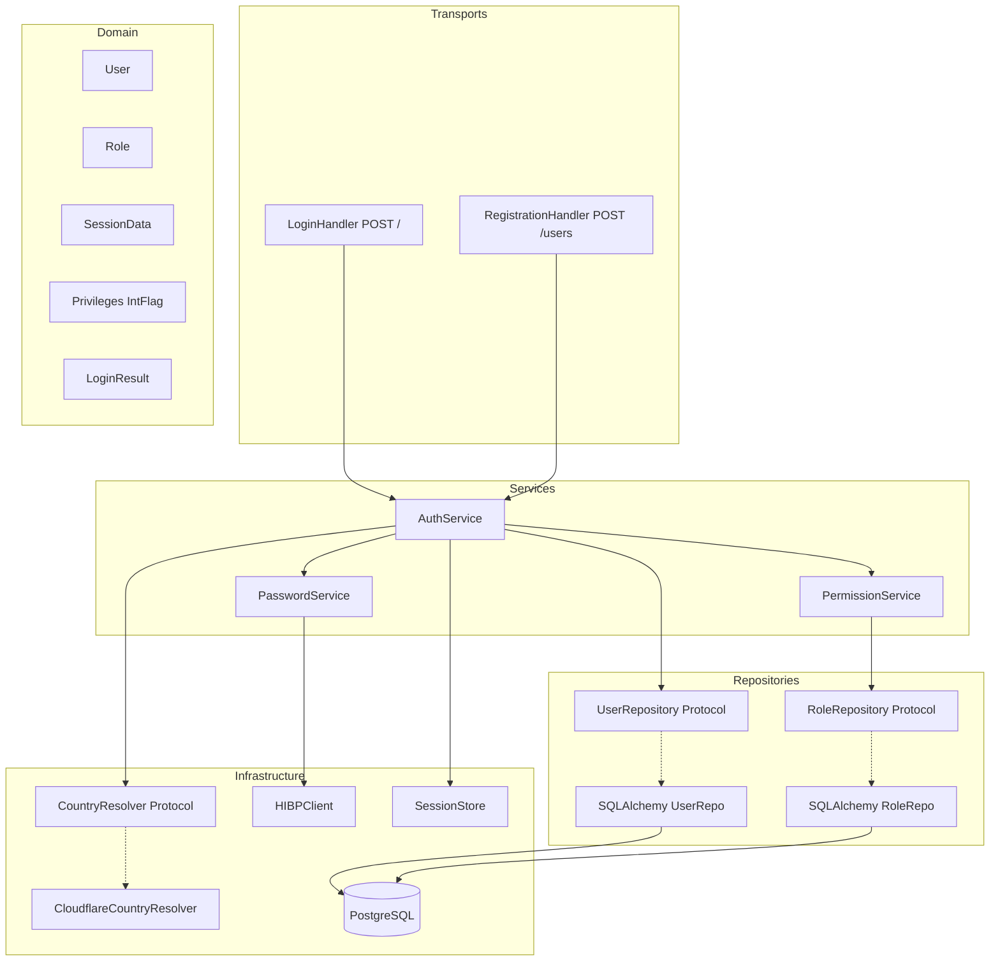
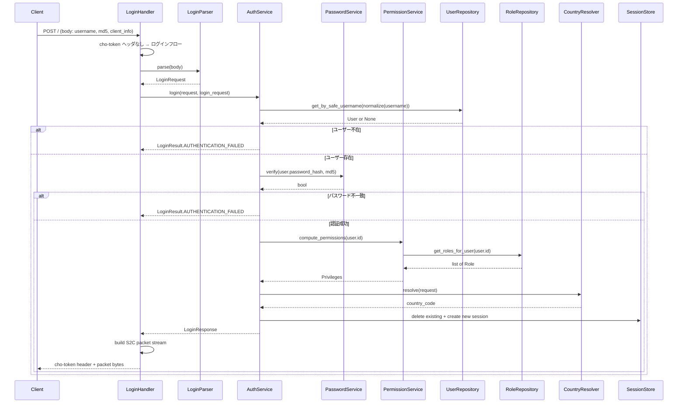
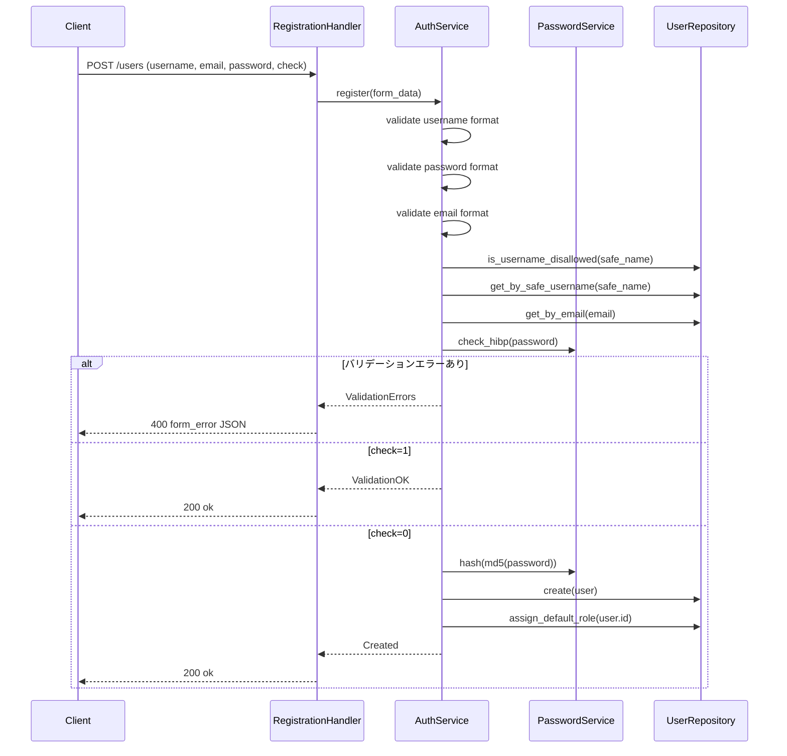
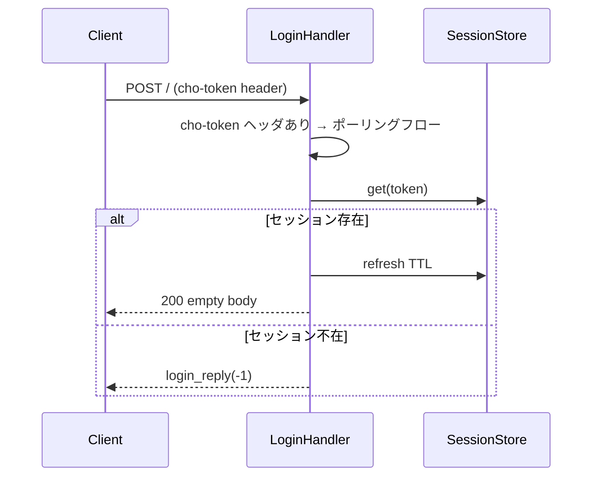

# Design Document: bancho-login

## Overview

**Purpose**: osu! stable クライアントのアカウント登録・ログイン・セッション確立を実現する。bancho-protocol（パケット基盤）と foundation（DI, DB, Redis）の上に、認証ドメイン・RBAC・ユーザー永続化を構築する。

**Users**: osu! stable クライアントのプレイヤー（登録・ログイン）、サーバー運営者（権限管理の基盤）。

**Impact**: athena が初めて実クライアントからの接続を受け付け、セッションを維持できるようになる PoC の核心機能。

### Goals
- stable クライアントがログインしてセッションを確立し、接続状態を維持できる
- ゲーム内登録フォームからアカウントを作成できる
- RBAC 基盤でロールベースの権限管理ができる
- パスワードを安全に保存・照合し、漏洩パスワードの使用を防止できる

### Non-Goals
- C2S パケットポーリング処理（stub のみ、次 spec）
- チャット、プレゼンス配信、スコア送信
- GeoIP フォールバック（Cloudflare ヘッダのみ）
- メール認証フロー・メール送信
- RBAC 管理 UI（ロール CRUD）
- ログインエラーコード -2〜-7 の分岐処理

## Boundary Commitments

### This Spec Owns
- `POST /` ログインハンドラ（リクエストパース、認証、応答パケット構築、ポーリング stub）
- `POST /users` 登録ハンドラ（バリデーション、アカウント作成）
- User ドメインモデル、Role ドメインモデル、SessionData、Privileges、LoginResult
- UserRepository、RoleRepository（Protocol + SQLAlchemy + InMemory）
- AuthService、PasswordService、PermissionService
- CountryResolver（Protocol + Cloudflare 実装）
- HIBP クライアント
- Alembic マイグレーション（users, roles, user_roles, disallowed_usernames）
- DI 登録の拡張

### Out of Boundary
- ポーリングでの C2S パケット dispatch（空レスポンスを返すだけ）
- S2C パケットビルダー関数の実装（bancho-protocol で実装済み）
- SessionStore 自体の実装（foundation で実装済み）
- チャット、プレゼンス、ban/restrict、スコア送信
- GeoIP、メール認証、RBAC 管理 UI

### Allowed Dependencies
- **bancho-protocol**: S2C ビルダー12関数、ServerPacketID enum、write_packet
- **foundation**: DI Container、SessionStore Protocol + 実装、AsyncEngine、async_sessionmaker、AppConfig、Base model、AppError
- **外部ライブラリ**: argon2-cffi（既存）、httpx（新規追加）

### Revalidation Triggers
- SessionStore Protocol のシグネチャ変更
- S2C ビルダー関数のシグネチャ変更
- DI Container の register/resolve API 変更
- AppConfig のフィールド追加（認証関連）
- User テーブルスキーマ変更（下流 spec に影響）

## Architecture

### Architecture Pattern & Boundary Map

既存のレイヤードアーキテクチャに新規コンポーネントをスロットイン。



**Architecture Integration**:
- **Selected pattern**: 既存レイヤードアーキテクチャの拡張
- **Domain boundaries**: 認証ドメイン（User, Role, Privileges）はドメイン層、フロー制御はサービス層
- **Existing patterns preserved**: Protocol + 複数実装 + DI 切り替え（SessionStore と同パターン）
- **New components rationale**: AuthService（オーケストレーション）、PasswordService（ブロッキング処理隔離）、PermissionService（RBAC 計算の分離）
- **Dependency direction**: Transports → Services → Domain ← Repositories → Infrastructure

### Technology Stack

| Layer | Choice | Role | Notes |
|-------|--------|------|-------|
| HTTP | Starlette | リクエスト/レスポンス処理 | 既存 |
| Password | argon2-cffi | argon2id ハッシュ | 既存依存。`run_in_executor` で非同期化 |
| HTTP Client | httpx | HIBP API 呼び出し | **新規依存** |
| ORM | SQLAlchemy 2.0 async | User/Role 永続化 | 既存 |
| Migration | Alembic | スキーマ管理 | 既存 |
| Session | Redis (SessionStore) | セッション保存 | 既存 |

## File Structure Plan

### Directory Structure

```
src/osu_server/
├── domain/
│   ├── user.py                    # User dataclass
│   ├── role.py                    # Role dataclass, Privileges IntFlag
│   ├── session.py                 # SessionData dataclass
│   └── auth.py                    # LoginResult enum, LoginRequest, ClientInfo
├── repositories/
│   ├── interfaces/
│   │   ├── user_repository.py     # UserRepository Protocol
│   │   └── role_repository.py     # RoleRepository Protocol
│   ├── sqlalchemy/
│   │   ├── models/
│   │   │   ├── user.py            # SQLAlchemy User model
│   │   │   ├── role.py            # SQLAlchemy Role + UserRole models
│   │   │   └── __init__.py        # Re-export for Alembic auto-detection
│   │   ├── user_repository.py     # SQLAlchemyUserRepository
│   │   └── role_repository.py     # SQLAlchemyRoleRepository
│   └── memory/
│       ├── user_repository.py     # InMemoryUserRepository
│       └── role_repository.py     # InMemoryRoleRepository
├── services/
│   ├── auth_service.py            # ログイン/登録オーケストレーション
│   ├── password_service.py        # ハッシュ/検証/HIBP
│   └── permission_service.py      # RBAC 計算 + クライアントフラグ変換
├── transports/
│   ├── bancho/
│   │   ├── handlers/
│   │   │   └── login.py           # POST / ハンドラ（ログイン + ポーリング stub）
│   │   └── parsers/
│   │       └── login.py           # LoginRequest/ClientInfo パーサー
│   └── web_legacy/
│       ├── __init__.py             # Starlette routes
│       └── registration.py         # POST /users ハンドラ
├── infrastructure/
│   ├── country/
│   │   ├── interfaces.py          # CountryResolver Protocol
│   │   └── cloudflare.py          # CloudflareCountryResolver
│   └── security/
│       └── hibp.py                # HIBPClient (httpx)
└── shared/
    └── errors.py                  # AuthenticationError, RegistrationError 追加

alembic/versions/
└── xxxx_create_users_roles.py     # users, roles, user_roles, disallowed_usernames

tests/
├── unit/
│   ├── domain/
│   │   ├── test_user.py           # safe_username 正規化
│   │   ├── test_role.py           # Privileges 計算
│   │   └── test_auth.py           # LoginResult, ClientInfo パース
│   ├── services/
│   │   ├── test_auth_service.py   # ログイン/登録フロー
│   │   ├── test_password_service.py # ハッシュ/検証/HIBP
│   │   └── test_permission_service.py # RBAC 計算
│   ├── repositories/
│   │   ├── test_user_repository.py # Protocol 準拠テスト
│   │   └── test_role_repository.py
│   └── transports/
│       ├── test_login_handler.py
│       ├── test_login_parser.py
│       └── test_registration.py
└── integration/
    ├── test_login_flow.py          # E2E ログインフロー
    └── test_registration_flow.py   # E2E 登録フロー
```

### Modified Files
- `src/osu_server/app.py` — ログインハンドラへのルート差し替え、web_legacy マウント、DI 登録拡張
- `src/osu_server/infrastructure/di/providers.py` — 全サービス・Repository・CountryResolver の DI 登録
- `src/osu_server/shared/errors.py` — `AuthenticationError`, `RegistrationError` 追加
- `pyproject.toml` — httpx 依存追加、import-linter 契約更新

## System Flows

### ログインフロー



### 登録フロー



### ポーリングフロー



## Requirements Traceability

| Req | Summary | Components | Interfaces | Flows |
|-----|---------|------------|------------|-------|
| 1.1-1.7 | アカウント登録 | AuthService, RegistrationHandler, UserRepository, RoleRepository | `AuthService.register()` | Registration |
| 2.1-2.3 | リアルタイムバリデーション | AuthService, RegistrationHandler | `AuthService.register(check=True)` | Registration |
| 3.1-3.6 | 入力バリデーション | AuthService | `AuthService._validate_*()` | Registration |
| 4.1-4.6 | パスワードセキュリティ | PasswordService, HIBPClient | `PasswordService.hash/verify/check_hibp()` | Login + Registration |
| 5.1-5.8 | ログイン認証 | AuthService, LoginHandler, LoginParser, SessionStore | `AuthService.login()` | Login |
| 6.1-6.10 | ログイン応答パケット | LoginHandler（S2C ビルダー呼び出し） | `LoginHandler._build_response()` | Login |
| 7.1-7.4 | ポーリング stub | LoginHandler, SessionStore | `LoginHandler._handle_polling()` | Polling |
| 8.1-8.7 | RBAC | PermissionService, RoleRepository, Role, Privileges | `PermissionService.compute/to_client_flags()` | Login |
| 9.1-9.3 | 国判定 | CountryResolver, CloudflareCountryResolver | `CountryResolver.resolve()` | Login |
| 10.1-10.4 | セッション管理 | SessionStore, SessionData | `SessionStore.create/get/delete` | All |

## Components and Interfaces

### Summary

| Component | Layer | Intent | Req Coverage | Key Dependencies | Contracts |
|-----------|-------|--------|--------------|------------------|-----------|
| User | Domain | ユーザーエンティティ | 1, 5 | — | — |
| Role | Domain | ロールエンティティ + Privileges IntFlag | 8 | — | — |
| SessionData | Domain | 型安全なセッションデータ | 10 | — | — |
| LoginResult | Domain | ログインエラーコード enum | 5 | — | — |
| UserRepository | Repository | ユーザー CRUD + 禁止名チェック | 1, 3, 5 | async_sessionmaker (P0) | Service |
| RoleRepository | Repository | ロール取得 + デフォルトロール付与 | 8 | async_sessionmaker (P0) | Service |
| AuthService | Service | ログイン/登録オーケストレーション | 1-5 | UserRepo (P0), PasswordService (P0), PermissionService (P1), SessionStore (P0) | Service |
| PasswordService | Service | パスワードハッシュ/検証/HIBP | 4 | HIBPClient (P1) | Service |
| PermissionService | Service | RBAC 計算 + クライアント変換 | 8 | RoleRepo (P0) | Service |
| LoginHandler | Transport | POST / ハンドラ | 5, 6, 7 | AuthService (P0), SessionStore (P0) | API |
| RegistrationHandler | Transport | POST /users ハンドラ | 1, 2, 3 | AuthService (P0) | API |
| CountryResolver | Infrastructure | 国コード検出 | 9 | — | Service |
| HIBPClient | Infrastructure | 漏洩パスワードチェック | 4 | httpx (P0) | Service |

### Domain Layer

#### User

| Field | Detail |
|-------|--------|
| Intent | ユーザーエンティティ（ドメインモデル） |
| Requirements | 1.1-1.7, 5.1 |

```python
@dataclass(slots=True)
class User:
    id: int
    username: str
    safe_username: str
    email: str
    password_hash: str
    country: str
    created_at: datetime
    updated_at: datetime

    @staticmethod
    def normalize_username(username: str) -> str:
        """小文字化 + スペース→アンダースコア変換"""
        return username.lower().replace(" ", "_")
```

- Invariants: `safe_username == normalize_username(username)`、`email` は小文字化済み

#### Role + Privileges

| Field | Detail |
|-------|--------|
| Intent | ロールエンティティ + 権限ビットフラグ |
| Requirements | 8.1-8.7 |

```python
class Privileges(IntFlag):
    NONE         = 0
    NORMAL       = 1 << 0
    VERIFIED     = 1 << 1
    SUPPORTER    = 1 << 2
    MODERATOR    = 1 << 3
    ADMIN        = 1 << 4
    DEVELOPER    = 1 << 5
    TOURNAMENT   = 1 << 6
    UNRESTRICTED = 1 << 7

class ClientPermissions(IntFlag):
    """osu! クライアントが理解するフラグ"""
    NORMAL    = 1
    MODERATOR = 2
    SUPPORTER = 4
    PEPPY     = 8
    DEVELOPER = 16

@dataclass(slots=True)
class Role:
    id: int
    name: str
    permissions: Privileges
    position: int
```

**Default Role Seeds**:

| Name | permissions | position |
|------|------------|----------|
| Default | `NORMAL \| VERIFIED \| UNRESTRICTED` | 0 |
| Admin | 全フラグ ON | 100 |

#### SessionData

| Field | Detail |
|-------|--------|
| Intent | 型安全なセッションデータ |
| Requirements | 10.1 |

```python
@dataclass(slots=True)
class SessionData:
    user_id: int
    username: str
    privileges: int  # Privileges の int 値
    country: str
    osu_version: str
    utc_offset: int
    display_city: bool
    client_hashes: str
    pm_private: bool
```

- `dataclasses.asdict()` で `dict[str, object]` に変換して SessionStore に渡す
- 復元は `SessionData(**data)` で型安全に戻す

#### LoginResult + LoginRequest

| Field | Detail |
|-------|--------|
| Intent | ログインエラーコード + リクエスト構造体 |
| Requirements | 5.4-5.6 |

```python
class LoginResult(IntEnum):
    AUTHENTICATION_FAILED = -1
    OLD_CLIENT = -2          # プレースホルダー
    BANNED = -3              # プレースホルダー
    BANNED_ALT = -4          # プレースホルダー
    SERVER_ERROR = -5
    SUPPORTER_ONLY = -6      # プレースホルダー
    PASSWORD_RESET = -7      # プレースホルダー

@dataclass(slots=True)
class ClientInfo:
    osu_version: str
    utc_offset: int
    display_city: bool
    client_hashes: str
    pm_private: bool

@dataclass(slots=True)
class LoginRequest:
    username: str
    password_md5: str
    client_info: ClientInfo
```

### Repository Layer

#### UserRepository

| Field | Detail |
|-------|--------|
| Intent | ユーザー CRUD + 禁止名チェック |
| Requirements | 1.3-1.7, 3.6, 5.1 |

**Contracts**: Service [x]

```python
@runtime_checkable
class UserRepository(Protocol):
    async def create(self, user: User) -> User: ...
    async def get_by_id(self, user_id: int) -> User | None: ...
    async def get_by_safe_username(self, safe_username: str) -> User | None: ...
    async def get_by_email(self, email: str) -> User | None: ...
    async def is_username_disallowed(self, safe_username: str) -> bool: ...
    async def add_disallowed_username(self, safe_username: str) -> None: ...
```

- Preconditions: `safe_username` は正規化済み（`User.normalize_username()` 適用済み）
- Postconditions: `create()` は `id` が採番された User を返す
- 実装: SQLAlchemyUserRepository（citext 可）、InMemoryUserRepository（テスト用）

#### RoleRepository

| Field | Detail |
|-------|--------|
| Intent | ロール取得 + ユーザーへのロール付与 |
| Requirements | 8.1-8.6 |

**Contracts**: Service [x]

```python
@runtime_checkable
class RoleRepository(Protocol):
    async def get_by_id(self, role_id: int) -> Role | None: ...
    async def get_by_name(self, name: str) -> Role | None: ...
    async def get_roles_for_user(self, user_id: int) -> list[Role]: ...
    async def assign_role(self, user_id: int, role_id: int) -> None: ...
    async def get_default_role(self) -> Role: ...
```

- Preconditions: デフォルトロールは Alembic seed で存在が保証
- Postconditions: `get_roles_for_user()` は position 昇順でソート

### Service Layer

#### AuthService

| Field | Detail |
|-------|--------|
| Intent | ログイン/登録フローのオーケストレーション |
| Requirements | 1.1-1.7, 2.1-2.3, 3.1-3.6, 5.1-5.8 |

**Dependencies**:
- Inbound: LoginHandler, RegistrationHandler — フロー起動 (P0)
- Outbound: UserRepository — ユーザー検索/作成 (P0), PasswordService — ハッシュ/検証 (P0), PermissionService — 権限計算 (P1), SessionStore — セッション管理 (P0), CountryResolver — 国判定 (P1)

**Contracts**: Service [x]

```python
class AuthService:
    def __init__(
        self,
        user_repo: UserRepository,
        role_repo: RoleRepository,
        password_service: PasswordService,
        permission_service: PermissionService,
        session_store: SessionStore,
        country_resolver: CountryResolver,
    ) -> None: ...

    async def login(
        self, request: Request, login_request: LoginRequest
    ) -> LoginResponse | LoginResult: ...

    async def register(
        self, form_data: RegistrationForm, check_only: bool = False
    ) -> RegistrationResult: ...
```

```python
@dataclass(slots=True)
class LoginResponse:
    token: str
    user: User
    privileges: Privileges
    country: str
    session_data: SessionData

@dataclass(slots=True)
class RegistrationForm:
    username: str
    email: str
    password: str

@dataclass(slots=True)
class RegistrationResult:
    success: bool
    errors: dict[str, list[str]]  # field -> messages
```

- `login()`: ユーザー検索 → パスワード照合 → 権限計算 → 国判定 → 既存セッション破棄 → 新規セッション作成
- `register()`: バリデーション → 重複チェック → HIBP → (check_only なら終了) → パスワードハッシュ → ユーザー作成 → デフォルトロール付与

#### PasswordService

| Field | Detail |
|-------|--------|
| Intent | パスワードハッシュ/検証/HIBP チェック（ブロッキング処理の隔離） |
| Requirements | 4.1-4.6 |

**Dependencies**:
- External: argon2-cffi — ハッシュ/検証 (P0), httpx — HIBP API (P1)

**Contracts**: Service [x]

```python
class PasswordService:
    async def hash(self, password: str) -> str:
        """argon2id でハッシュ。run_in_executor で非同期化"""
        ...

    async def verify(self, hash: str, password: str) -> bool:
        """ハッシュ照合。VerifyMismatchError → False"""
        ...

    async def check_hibp(self, password: str) -> bool:
        """HIBP k-Anonymity チェック。True = 漏洩済み"""
        ...

    async def prepare_password(self, plain_password: str) -> str:
        """平文 → MD5 → argon2id。登録時に使用"""
        ...
```

- `hash()` / `verify()`: `asyncio.get_running_loop().run_in_executor(None, ...)` で非同期化
- `check_hibp()`: httpx で HIBP API 呼び出し。到達不能時は `False` を返す（フォールバック）
- `prepare_password()`: 登録時の平文パスワードを MD5 → argon2id の一連で処理

#### PermissionService

| Field | Detail |
|-------|--------|
| Intent | RBAC 権限計算 + クライアントフラグ変換 |
| Requirements | 8.1-8.5 |

**Dependencies**:
- Outbound: RoleRepository — ロール取得 (P0)

**Contracts**: Service [x]

```python
class PermissionService:
    def __init__(self, role_repo: RoleRepository) -> None: ...

    async def compute_permissions(self, user_id: int) -> Privileges:
        """全ロールの permissions を OR 結合"""
        ...

    @staticmethod
    def to_client_flags(privileges: Privileges) -> ClientPermissions:
        """内部権限 → osu! クライアント用フラグに変換"""
        ...
```

### Transport Layer

#### LoginHandler

| Field | Detail |
|-------|--------|
| Intent | `POST /` ハンドラ（ログイン + ポーリング stub） |
| Requirements | 5.1-5.8, 6.1-6.10, 7.1-7.4 |

**Contracts**: API [x]

| Method | Endpoint | Request | Response | Errors |
|--------|----------|---------|----------|--------|
| POST | / | Raw body (login) or cho-token header (polling) | cho-token + S2C packet stream (login) or empty (polling) | login_reply(-1), login_reply(-5) |

```python
async def bancho_handler(request: Request) -> Response:
    """cho-token ヘッダの有無でログイン/ポーリングを判別"""
    if "osu-token" in request.headers:
        return await _handle_polling(request)
    return await _handle_login(request)
```

- `_handle_login()`: LoginParser でパース → AuthService.login() → S2C パケットストリーム構築 → Response
- `_handle_polling()`: SessionStore.get(token) → 存在すれば TTL 延長 + 空 Response、不在なら login_reply(-1)
- S2C パケットストリーム構築: 既存ビルダー12関数を順次呼び出し、`b"".join()` で結合

#### LoginParser

| Field | Detail |
|-------|--------|
| Intent | ログインリクエストボディのパース |
| Requirements | 5.2-5.3 |

```python
def parse_login_request(body: bytes) -> LoginRequest:
    """body を username, password_md5, client_info の3行に分離してパース"""
    ...

def parse_client_info(raw: str) -> ClientInfo:
    """'version|utc_offset|display_city|hashes|pm_private' をパース"""
    ...
```

#### RegistrationHandler

| Field | Detail |
|-------|--------|
| Intent | `POST /users` ハンドラ |
| Requirements | 1.1-1.7, 2.1-2.3 |

**Contracts**: API [x]

| Method | Endpoint | Request | Response | Errors |
|--------|----------|---------|----------|--------|
| POST | /users | Form: user[username], user[user_email], user[password], check | `b"ok"` | 400 `{"form_error": {"user": {field: [messages]}}}` |

```python
async def register_handler(request: Request) -> Response:
    """フォームデータをパースし AuthService.register() に委譲"""
    ...
```

### Infrastructure Layer

#### CountryResolver

| Field | Detail |
|-------|--------|
| Intent | リクエストから国コードを検出 |
| Requirements | 9.1-9.3 |

**Contracts**: Service [x]

```python
@runtime_checkable
class CountryResolver(Protocol):
    def resolve(self, request: Request) -> str:
        """国コードを返す。検出不能時は "XX" """
        ...

class CloudflareCountryResolver:
    def resolve(self, request: Request) -> str:
        return request.headers.get("CF-IPCountry", "XX")
```

#### HIBPClient

| Field | Detail |
|-------|--------|
| Intent | HIBP k-Anonymity API クライアント |
| Requirements | 4.4-4.5 |

```python
class HIBPClient:
    def __init__(self, http_client: httpx.AsyncClient) -> None: ...

    async def is_password_compromised(self, password: str) -> bool:
        """SHA-1 先頭5文字を送信、サフィックス照合。到達不能時は False"""
        ...
```

## Data Models

### Physical Data Model

#### users テーブル

| Column | Type | Constraints |
|--------|------|-------------|
| id | SERIAL | PK |
| username | VARCHAR(15) | NOT NULL |
| safe_username | VARCHAR(15) | NOT NULL, UNIQUE |
| email | VARCHAR(255) | NOT NULL, UNIQUE |
| password_hash | VARCHAR(255) | NOT NULL |
| country | VARCHAR(2) | NOT NULL, DEFAULT 'XX' |
| created_at | TIMESTAMPTZ | NOT NULL, DEFAULT NOW() |
| updated_at | TIMESTAMPTZ | NOT NULL, DEFAULT NOW() |

#### roles テーブル

| Column | Type | Constraints |
|--------|------|-------------|
| id | SERIAL | PK |
| name | VARCHAR(32) | NOT NULL, UNIQUE |
| permissions | INTEGER | NOT NULL, DEFAULT 0 |
| position | INTEGER | NOT NULL, DEFAULT 0 |

#### user_roles テーブル

| Column | Type | Constraints |
|--------|------|-------------|
| user_id | INTEGER | FK → users.id, PK |
| role_id | INTEGER | FK → roles.id, PK |

#### disallowed_usernames テーブル

| Column | Type | Constraints |
|--------|------|-------------|
| id | SERIAL | PK |
| safe_username | VARCHAR(15) | NOT NULL, UNIQUE |
| created_at | TIMESTAMPTZ | NOT NULL, DEFAULT NOW() |

**Indexes**:
- `users.safe_username` — UNIQUE (自動的にインデックス)
- `users.email` — UNIQUE (自動的にインデックス)
- `user_roles(user_id, role_id)` — 複合 PK
- `disallowed_usernames.safe_username` — UNIQUE

**Seed Data** (Alembic マイグレーション内):
- Role: Default (permissions=NORMAL|VERIFIED|UNRESTRICTED, position=0)
- Role: Admin (permissions=全フラグ, position=100)

## Error Handling

### Error Categories

| Category | Error | HTTP Status | Response |
|----------|-------|-------------|----------|
| 認証失敗 | ユーザー不在/パスワード不一致 | 200 | login_reply(-1) |
| サーバーエラー | 予期せぬ例外 | 200 | login_reply(-5) |
| 登録バリデーション | 入力不正 | 400 | `{"form_error": {"user": {field: [msgs]}}}` |
| 登録重複 | ユーザー名/メール重複 | 400 | 同上 |
| セッション不在 | ポーリング時にトークン無効 | 200 | login_reply(-1) or 空 body + cho-token なし |

**Note**: bancho プロトコルのエラーは HTTP 200 + パケット内エラーコードで返す（HTTP ステータスではない）。

### Error Hierarchy

```python
class AuthenticationError(AppError):
    """ログイン認証エラー"""
    result: LoginResult

class RegistrationError(AppError):
    """登録バリデーションエラー"""
    errors: dict[str, list[str]]
```

## Testing Strategy

### Unit Tests
- **User.normalize_username()**: 大文字→小文字、スペース→アンダースコア、混合入力
- **Privileges IntFlag**: OR 結合、to_client_flags() 変換、全フラグ組み合わせ
- **LoginParser.parse_login_request()**: 正常パース、不正フォーマット、エッジケース
- **PasswordService.hash/verify()**: argon2id ラウンドトリップ、不一致検出
- **PasswordService.check_hibp()**: 漏洩パスワード検出、非漏洩パスワード、API 到達不能フォールバック
- **AuthService.register()**: バリデーション全ルール（ユーザー名、パスワード、メール）、重複チェック、check_only モード、HIBP 連携
- **AuthService.login()**: 認証成功、ユーザー不在、パスワード不一致、セッション作成確認、既存セッション破棄確認
- **PermissionService**: 複数ロール OR 結合、クライアントフラグ変換

### Integration Tests
- **ログイン E2E**: TestClient → POST / → cho-token 返却 + パケットストリーム検証
- **登録 E2E**: TestClient → POST /users → ユーザー DB 確認 + デフォルトロール確認
- **登録バリデーション**: check=1 でバリデーションのみ → DB に作成されていないことを確認
- **ポーリング stub**: ログイン → cho-token 取得 → ポーリング → 空レスポンス確認
- **再ログイン**: ログイン → 再ログイン → 旧セッション破棄 + 新セッション作成確認

### Repository Tests
- **UserRepository Protocol 準拠**: SessionStore と同パターンの parametrized テスト（InMemory + SQLAlchemy）
- **RoleRepository Protocol 準拠**: 同上
- **禁止ユーザー名**: 追加、チェック、重複追加のエッジケース

## Security Considerations

- **パスワード保存**: argon2id（OWASP 推奨パラメータ）。平文・MD5 を DB に保存しない
- **認証エラーの情報漏洩防止**: ユーザー不在/パスワード不一致を区別しない（コード -1 統一）
- **HIBP**: k-Anonymity で SHA-1 先頭5文字のみ送信。完全ハッシュは外部に出ない
- **セッショントークン**: crypto-safe ランダム生成（SessionStore の責務）
- **TOCTOU 防止**: SessionStore の Redis 実装は atomic Lua スクリプト済み
- **入力バリデーション**: ユーザー名は正規表現で厳密制限、SQL injection は SQLAlchemy のパラメータバインドで防御
