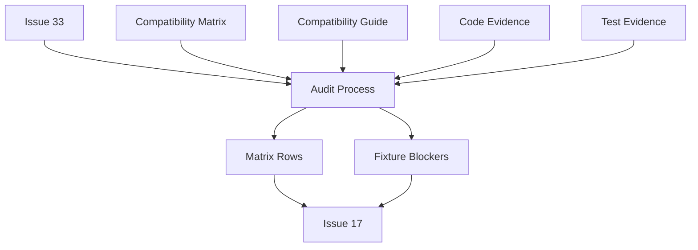
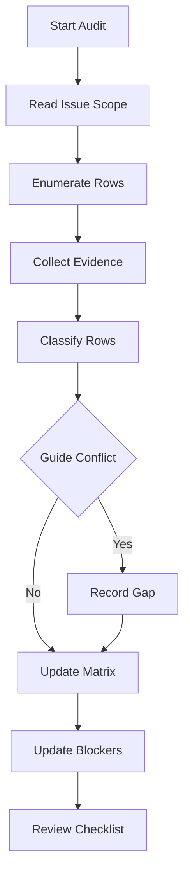

# 設計文書

## 概要

Bancho Packet / Struct Inventory Audit は、GitHub Issue #33 の範囲にある stable Bancho C2S packet、S2C packet、Bancho struct を監査し、packet-family implementation と #17 fixture extraction が推測ではなく確認済み row から開始できるようにする documentation design である。

利用者は stable compatibility 保守者、packet-family 実装者、fixture 抽出担当者、AI 実装エージェントである。この spec は runtime behavior を変えず、既存の stable compatibility matrix を source of truth として、分類、implementation status、evidence note、reference source、fixture blocker を読める状態にする。

### 目標

- GitHub Issue #33 の C2S packet、S2C packet、Bancho struct row を漏れなく監査対象にする。
- `required`、`deferred`、`out of scope`、`needs reference evidence` の分類を既存 implementation status と混同しない形で記録する。
- S2C packet の builder status と runtime emission status を分離して読めるようにする。
- #17 fixture extraction をブロックする packet / struct row と exact reference source を明示する。
- Matrix と guide の矛盾を unresolved evidence gap として可視化する。

### 非目標

- packet parser、packet builder、packet handler、runtime behavior を実装しない。
- golden fixture file を作成しない。
- real-client traffic capture を実施しない。
- `/web` endpoint、static/media、release/update、persistence inventory をこの spec に含めない。
- DB schema、Valkey state、taskiq job、CLI command、new dependency を追加しない。

## 境界コミットメント

### この spec が所有するもの

- `docs/stable-compatibility-matrix.md` の C2S Packet Coverage、S2C Packet Coverage、Bancho Struct Coverage に対する audit classification と evidence note。
- S2C packet row で builder status、runtime emission status、documented non-emission reason を区別する audit contract。
- Bancho struct row で confirmed source、missing field/value audit note、explicit deferral reason を区別する audit contract。
- #17 fixture extraction blocker rollup と exact reference source naming。
- Matrix と `docs/stable-compatibility-guide.md` の Bancho Packet Payload Reference が矛盾した場合の unresolved evidence gap 表現。

### 境界外

- Runtime stable transport implementation。
- Protocol parser/builder code、handler registration、packet dispatch behavior。
- Golden fixture extraction、traffic capture、fixture validation tests。
- GitHub Project field updates or GitHub issue body edits。
- Parent #16 の `/web`、static/media、release/update、persistence inventory。
- Downstream #17 の fixture file placement and extraction method。

### 許可する依存

- GitHub Issue #33 — authoritative scope and acceptance criteria。
- GitHub Issue #16 — parent inventory context only。
- GitHub Issue #17 — downstream fixture extraction consumer only。
- `docs/stable-compatibility-matrix.md` — authoritative audit output。
- `docs/stable-compatibility-guide.md` — packet payload and struct reference consistency source。
- Existing protocol enums, builders, handlers, and tests under `src/osu_server/transports/stable/bancho/` and `tests/` — evidence sources only。
- Lekuruu `bancho-documentation` wiki and listed reference implementations — reference source names only unless a task explicitly audits their paths.

### 再検証条件

- GitHub Issue #33 scope or acceptance criteria changes。
- C2S/S2C enum membership or packet ID values change。
- Bancho struct field layout or payload mapping changes in `docs/stable-compatibility-guide.md`。
- New stable Bancho packet rows are added to the matrix。
- #17 fixture extraction changes its expected input format。
- A matrix row changes from `needs reference evidence` to confirmed source after additional audit。

## アーキテクチャ

### 既存アーキテクチャの分析

Athena already keeps stable compatibility planning in `docs/stable-compatibility-matrix.md`, while `docs/stable-compatibility-guide.md` carries protocol background, payload references, struct field references, implementation flow, verification requirements, and fixture extraction backlog. Runtime code under `src/osu_server/transports/stable/bancho/` contains protocol enums, current wire types, C2S handlers, and S2C builders; tests provide evidence for some implemented or builder-only rows.

The design preserves this structure. The matrix remains the canonical inventory and receives audit results. The guide remains the protocol reference and is consulted for contradictions, but it does not become a second row-level inventory.

### アーキテクチャパターンと境界図

採用 pattern は matrix-first documentation audit である。これは documentation extension であり、新しい software component ではない。



主要判断:

- Existing matrix rows are updated in place; no standalone inventory document is introduced.
- Existing implementation status values remain visible; audit classification is recorded separately in row notes or supplemental audit columns/sections.
- Guide contradictions become unresolved evidence gaps rather than guessed corrections.

### 技術スタック

| layer | choice / version | feature での役割 | notes |
| --- | --- | --- | --- |
| documentation | Markdown | matrix audit output と spec document | 既存 repository docs |
| source control | Git | review 可能な docs diff | generated artifact なし |
| validation | `git diff --check`, markdown review, targeted `rg` checks | whitespace と coverage sanity check | runtime test は不要 |
| runtime | 既存 Athena stable transport | evidence source のみ | runtime change なし |

No new libraries, package changes, migrations, or runtime services are introduced.

## ファイル構成計画

### ディレクトリ構成

```text
.kiro/
└── specs/
    └── bancho-packet-struct-inventory-audit/
        ├── requirements.md
        ├── research.md
        ├── design.md
        └── spec.json
docs/
├── stable-compatibility-matrix.md
└── stable-compatibility-guide.md
```

### 新規ファイル

- `.kiro/specs/bancho-packet-struct-inventory-audit/research.md` — discovery findings, design decisions, risks, and references for the audit.
- `.kiro/specs/bancho-packet-struct-inventory-audit/design.md` — implementation-ready design for the audit documentation changes.

### 変更ファイル

- `.kiro/specs/bancho-packet-struct-inventory-audit/spec.json` — requirements approval and design generation metadata.
- `docs/stable-compatibility-matrix.md` — primary implementation target. Add row-level audit classification/evidence notes for C2S packet, S2C packet, and Bancho struct coverage; add or update the #17 fixture blocker rollup.
- `docs/stable-compatibility-guide.md` — conditional implementation target. Update only when confirmed evidence resolves a payload or struct contradiction found during audit; otherwise leave it unchanged and record unresolved evidence gap in the matrix.

### ファイルごとの component ownership

- `docs/stable-compatibility-matrix.md` — Scope Boundary Checklist, Audit Classification Legend, C2S Packet Audit Table, S2C Packet Audit Table, Struct Audit Table, Reference Evidence Contract, Fixture Blocker Rollup, Guide Consistency Check output.
- `docs/stable-compatibility-guide.md` — Guide Consistency Check source and conditional contradiction resolution target.
- `.kiro/specs/bancho-packet-struct-inventory-audit/research.md` — discovery findings and design decisions behind all documentation components.
- `.kiro/specs/bancho-packet-struct-inventory-audit/design.md` — component contracts, traceability, and validation strategy for task generation.

No changes:

- `src/`, `tests/`, database migrations, package manager files, lint/type/import configuration.

## システムフロー

### 監査フロー



flow 判断:

- Evidence collection can cite code/tests/docs, but this spec does not implement missing code or extract fixtures.
- A row without exact source remains `needs reference evidence`.
- A contradiction between matrix and guide is recorded as unresolved until source evidence is confirmed.

## 要件 traceability

| Requirement | Summary | Components | Interfaces | Flows |
| --- | --- | --- | --- | --- |
| 1.1 | C2S rows are all in scope | C2S Packet Audit Table | Matrix Row Contract | Audit Flow |
| 1.2 | S2C rows are all in scope | S2C Packet Audit Table | Matrix Row Contract | Audit Flow |
| 1.3 | Struct rows are all in scope | Struct Audit Table | Matrix Row Contract | Audit Flow |
| 1.4 | Non-#33 rows are excluded | Scope Boundary Checklist | Scope Filter | Audit Flow |
| 2.1 | Row classification vocabulary | Audit Classification Legend | Classification Contract | Audit Flow |
| 2.2 | Implementation status and evidence note | Matrix Row Contract | Evidence Note Contract | Audit Flow |
| 2.3 | Required rows cite source | Reference Evidence Contract | Evidence Note Contract | Audit Flow |
| 2.4 | Deferred and out-of-scope rows cite reason | Audit Classification Legend | Deferral Reason Contract | Audit Flow |
| 2.5 | Insufficient evidence rows are marked | Reference Evidence Contract | Gap Contract | Audit Flow |
| 3.1 | C2S status and evidence | C2S Packet Audit Table | Matrix Row Contract | Audit Flow |
| 3.2 | C2S payload or no-payload confirmation | C2S Packet Audit Table | Payload Reference Contract | Audit Flow |
| 3.3 | Ambiguous C2S behavior names next audit type | Reference Evidence Contract | Gap Contract | Audit Flow |
| 3.4 | C2S fixture blockers visible | Fixture Blocker Rollup | Fixture Handoff Contract | Audit Flow |
| 4.1 | S2C builder/runtime/non-emission status | S2C Packet Audit Table | Emission Status Contract | Audit Flow |
| 4.2 | Builder status differs from runtime status | S2C Packet Audit Table | Emission Status Contract | Audit Flow |
| 4.3 | Non-emission reason documented | S2C Packet Audit Table | Matrix Row Contract | Audit Flow |
| 4.4 | Ambiguous S2C behavior names next audit type | Reference Evidence Contract | Gap Contract | Audit Flow |
| 5.1 | Struct source or missing note or deferral | Struct Audit Table | Struct Evidence Contract | Audit Flow |
| 5.2 | Struct blocking packet dependencies visible | Struct Audit Table | Dependency Contract | Audit Flow |
| 5.3 | Unconfirmed layout or enum values call out evidence | Reference Evidence Contract | Gap Contract | Audit Flow |
| 5.4 | Struct fixture priority has exact source | Fixture Blocker Rollup | Fixture Handoff Contract | Audit Flow |
| 6.1 | #17 blockers listed | Fixture Blocker Rollup | Fixture Handoff Contract | Audit Flow |
| 6.2 | Blockers name exact source | Fixture Blocker Rollup | Fixture Handoff Contract | Audit Flow |
| 6.3 | Blockers without exact source stay evidence-needed | Reference Evidence Contract | Gap Contract | Audit Flow |
| 6.4 | Confirmed and evidence-needed rows are distinguishable | Fixture Blocker Rollup | Classification Contract | Audit Flow |
| 7.1 | Parser builder handler runtime implementation excluded | Scope Boundary Checklist | Scope Filter | Audit Flow |
| 7.2 | Fixture and traffic capture excluded | Scope Boundary Checklist | Scope Filter | Audit Flow |
| 7.3 | Implementation gaps are not marked complete | Audit Classification Legend | Evidence Note Contract | Audit Flow |
| 7.4 | Fixture gaps are not marked extracted | Fixture Blocker Rollup | Fixture Handoff Contract | Audit Flow |
| 8.1 | C2S matrix section updated | C2S Packet Audit Table | Matrix Row Contract | Audit Flow |
| 8.2 | S2C matrix section updated | S2C Packet Audit Table | Matrix Row Contract | Audit Flow |
| 8.3 | Struct matrix section updated | Struct Audit Table | Matrix Row Contract | Audit Flow |
| 8.4 | Matrix and guide contradictions shown | Guide Consistency Check | Gap Contract | Audit Flow |

## component と interface

| component | domain / layer | 意図 | req coverage | key dependencies | contract |
| --- | --- | --- | --- | --- | --- |
| Scope Boundary Checklist | Documentation | Keep #33 scope separate from parent and downstream issues | 1.4, 7.1, 7.2 | GitHub Issue #33, #16, #17 | Scope Filter |
| Audit Classification Legend | Documentation | Define classification language without replacing implementation status | 2.1, 2.4, 6.4, 7.3 | Matrix status labels | Classification Contract |
| C2S Packet Audit Table | Documentation | Record C2S status, payload evidence, ambiguity, and fixture blockers | 1.1, 3.1-3.4, 8.1 | Matrix C2S, guide payload reference, code/tests | Matrix Row Contract |
| S2C Packet Audit Table | Documentation | Record S2C builder/runtime/non-emission evidence | 1.2, 4.1-4.4, 8.2 | Matrix S2C, guide payload reference, code/tests | Matrix Row Contract |
| Struct Audit Table | Documentation | Record struct source, missing field/value notes, dependencies, deferrals | 1.3, 5.1-5.4, 8.3 | Matrix struct, guide struct reference | Matrix Row Contract |
| Reference Evidence Contract | Documentation | Standardize exact source names and evidence gap language | 2.3, 2.5, 3.3, 4.4, 5.3, 6.3 | Matrix source policy, guide references | Evidence Note Contract |
| Fixture Blocker Rollup | Documentation | Hand off #17 blocker rows with exact sources | 3.4, 5.4, 6.1-6.4, 7.4 | #17, guide fixture backlog | Fixture Handoff Contract |
| Guide Consistency Check | Documentation | Detect matrix/guide contradictions and record unresolved gaps | 8.4 | Compatibility guide | Gap Contract |

### matrix note の形式

Audit data is represented in matrix rows as structured note clauses rather than
new runtime schema. Use this compact form when a row has audit evidence:

```text
Audit: classification=<classification>; evidence=<proof or gap>;
source=<exact doc/test/path>; verification=<none|unit|integration|fixture|real-client-probe>;
payload=<confirmed|needs-reference>:<shape>; fixture blocker=<none|#17: reason>.
```

Unresolved evidence gaps must name the next audit type:

```text
evidence gap=needs-reference-implementation-audit:<missing behavior or source>
```

Reference sources use exact names: documentation sections such as
`docs/stable-compatibility-guide.md` Bancho Packet Payload Reference, repository
paths such as `src/osu_server/transports/stable/bancho/handlers/chat.py`, test
paths such as `tests/integration/test_chat_e2e.py`, or redacted capture names.

### documentation component

#### scope boundary checklist

| field | detail |
| --- | --- |
| intent | audit task が implementation、fixture、sibling inventory work を吸収しないようにする |
| requirements | 1.4, 7.1, 7.2 |

**責務と制約**

- Treat #33 as the implementation scope source.
- Treat #16 as parent context only.
- Treat #17 as downstream consumer only.
- Reject additions that require runtime code, fixture files, traffic capture, or non-Bancho inventory rows.

**依存**

- Inbound: GitHub Issue #33 — audit task definition (P0)
- Outbound: `docs/stable-compatibility-matrix.md` — scope language and row updates (P0)
- External: GitHub Issue #16 and #17 — adjacency only (P1)

**contract**: documentation contract.

**実装 note**

- Add boundary wording near the affected matrix sections if readers could confuse #33 with the broader #16.
- Keep sibling tasks for `/web`, static/media, release/update, and persistence out of this matrix change except for existing cross-references.

#### audit classification legend

| field | detail |
| --- | --- |
| intent | 既存 implementation status と並べて audit classification を読めるようにする |
| requirements | 2.1, 2.4, 6.4, 7.3 |

**責務と制約**

- Preserve existing status labels such as `Implemented`, `Partial`, `Builder`, `Declared`, and `Missing`.
- Add audit classification language: `required`, `deferred`, `out of scope`, `needs reference evidence`.
- Explain that classification answers whether Athena should pursue compatibility for the row, while implementation status answers how much exists today.

**依存**

- Inbound: Existing matrix status labels — current implementation maturity (P0)
- Outbound: C2S, S2C, and struct audit rows — shared classification vocabulary (P0)

**contract**: documentation contract.

**実装 note**

- Prefer a compact legend over repeating the same explanation in every row.
- If table width becomes too large, put classification and evidence into structured notes rather than adding many columns.

#### C2S packet audit table

| field | detail |
| --- | --- |
| intent | 実装なしで、すべての C2S row を parser/handler planning に使える状態にする |
| requirements | 1.1, 3.1, 3.2, 3.3, 3.4, 8.1 |

**責務と制約**

- Enumerate all C2S rows already in the matrix.
- Record current implementation status and evidence note.
- State payload or no-payload confirmation status.
- Mark ambiguous behavior with required next audit type: doc audit, reference implementation audit, or real-client traffic capture.
- Mark #17 fixture blockers.

**依存**

- Inbound: `ClientPacketID` enum and tests — implementation evidence (P1)
- Inbound: guide payload reference — payload shape source (P0)
- Outbound: Fixture Blocker Rollup — blocker rows (P0)

**contract**: documentation contract.

**実装 note**

- Do not infer behavior from packet names alone.
- Empty payload rows still need evidence notes because no-payload is itself a compatibility assertion.

#### S2C packet audit table

| field | detail |
| --- | --- |
| intent | packet buildability と実際の runtime emission を分離する |
| requirements | 1.2, 4.1, 4.2, 4.3, 4.4, 8.2 |

**責務と制約**

- Enumerate all S2C rows already in the matrix.
- Record builder status separately from runtime emission status.
- Record documented non-emission reason where Athena deliberately does not send a packet.
- Use explicit non-emission reason labels: `deferred-non-emission` for stable
  behavior intentionally postponed, `out-of-scope-intentional` for packets not
  owned by this stable scope, and `compatible-without-emission` when evidence
  shows stable clients do not require Athena to emit that packet.
- Mark ambiguous behavior with required next audit type.

**依存**

- Inbound: `ServerPacketID` enum and tests — ID evidence (P1)
- Inbound: S2C builder modules and tests — builder evidence (P1)
- Inbound: guide payload reference — payload and non-payload source (P0)
- Outbound: Fixture Blocker Rollup — blocker rows (P0)

**contract**: documentation contract.

**実装 note**

- `Builder` is not equivalent to implemented runtime behavior.
- Rows such as `USER_QUIT` need explicit notes when current runtime output differs from modern stable shape.

#### struct audit table

| field | detail |
| --- | --- |
| intent | fixture または packet work の前に struct source と missing field/value evidence を明確にする |
| requirements | 1.3, 5.1, 5.2, 5.3, 5.4, 8.3 |

**責務と制約**

- Enumerate all Bancho struct rows already in the matrix.
- Record confirmed source, missing field/value audit note, or explicit deferral reason.
- Preserve blocking packet dependencies.
- Mark struct rows that are #17 priority fixture inputs.

**依存**

- Inbound: guide struct field reference — layout and enum values (P0)
- Inbound: protocol type implementation and tests — implementation evidence (P1)
- Outbound: Fixture Blocker Rollup — blocker rows (P0)

**contract**: documentation contract.

**実装 note**

- Do not duplicate full field layouts in the matrix when the guide already owns the detail.
- A struct can be partially implemented and still need fixture evidence.

#### reference evidence contract

| field | detail |
| --- | --- |
| intent | exact source name と unresolved evidence language を標準化する |
| requirements | 2.3, 2.5, 3.3, 4.4, 5.3, 6.3 |

**責務と制約**

- Use exact source names such as Lekuruu page name, reference implementation repository/path, observed traffic capture name, or Athena test path.
- Distinguish `needs-doc-audit`, `needs-reference-implementation-audit`, and `needs-traffic-capture`.
- Mark rows as `needs reference evidence` when exact source names are not yet available.

**依存**

- Inbound: matrix source policy and reference implementation map (P0)
- Outbound: all audit tables and blocker rollup (P0)

**contract**: documentation contract.

**実装 note**

- Avoid vague evidence such as "wiki" or "reference impl" when a file/page name is needed for #17.
- If the exact path is unavailable, name the missing evidence instead of fabricating one.
- Example confirmed source note: `source=docs/stable-compatibility-guide.md Bancho Struct Field Reference; verification=none`.
- Example unresolved gap note: `evidence gap=needs-traffic-capture:exact enabled flag width is missing`.

#### fixture blocker rollup

| field | detail |
| --- | --- |
| intent | #17 に fixture extraction をブロックする packet/struct row の concise list を渡す |
| requirements | 3.4, 5.4, 6.1, 6.2, 6.3, 6.4, 7.4 |

**責務と制約**

- List blocker row identifier, row type, classification, implementation status, exact reference source or source gap, and reason it blocks #17.
- Keep confirmed required rows separate from rows still needing evidence.
- Do not create fixture files.

**依存**

- Inbound: C2S, S2C, and struct audit tables (P0)
- Inbound: guide fixture extraction backlog (P0)
- Outbound: GitHub Issue #17 work planning (P1)

**contract**: documentation contract.

**実装 note**

- Seed the rollup from `docs/stable-compatibility-guide.md` Fixture Extraction Backlog and known guide priorities: `Match`, `MatchJoin`, `ReplayFrameBundle`, `ScoreFrame`, and S2C enum correction cases.
- Include additional blockers found during row audit when a row is marked as blocking by Requirement 3.4 / 4.4 / 5.4, has an unresolved evidence gap from Guide Consistency Check, or is explicitly listed in the compatibility guide backlog.
- Keep fixture-ready blockers under a confirmed section, for example:
  `Match | Bancho struct | required | Missing | docs/stable-compatibility-guide.md Bancho Struct Field Reference | Match golden bytes`.
- Keep evidence-needed blockers under a separate section, for example:
  `QuitState | Bancho struct | needs reference evidence | Missing | exact source gap: USER_QUIT shape unresolved | wait for traffic or reference implementation evidence`.

#### guide consistency check

| field | detail |
| --- | --- |
| intent | matrix と guide の silent disagreement を防ぐ |
| requirements | 8.4 |

**責務と制約**

- Compare matrix audit claims against guide payload and struct references.
- If guide and matrix conflict, record unresolved evidence gap in the matrix.
- Update guide only when confirmed evidence resolves the contradiction.

**依存**

- Inbound: `docs/stable-compatibility-guide.md` Bancho Packet Payload Reference (P0)
- Outbound: `docs/stable-compatibility-matrix.md` evidence gap notes (P0)

**contract**: documentation contract.

**実装 note**

- Contradictions are not blockers for writing the audit, but they must not be hidden.

## データモデル

No runtime data model, database schema, API payload, event schema, or durable state is introduced.

### documentation data contract

Audit rows use these logical fields, whether expressed as table columns or structured row notes:

| Field | Meaning | Required For |
| --- | --- | --- |
| Row identifier | Packet ID and name, or struct type name | All rows |
| Row type | C2S packet, S2C packet, or Bancho struct | All rows |
| Implementation status | Existing matrix status label | All rows |
| Audit classification | `required`, `deferred`, `out of scope`, or `needs reference evidence` | All rows |
| Evidence note | Current proof, gap, or deferral explanation | All rows |
| Reference source | Exact doc, test, reference implementation path, or traffic capture name | Required and blocker rows |
| Verification status | `none`, `unit`, `integration`, `fixture`, or `real-client-probe` when known | Rows with evidence |
| Fixture blocker | Whether this row blocks #17 and why | Blocking rows |

### 整合性ルール

- A row marked `required` must name evidence or a reference source.
- A row without exact source for #17 must be `needs reference evidence`.
- A row marked `out of scope` or `deferred` must state the reason.
- A S2C row marked `deferred` or `out of scope` must include `deferred-non-emission`, `out-of-scope-intentional`, or `compatible-without-emission` when Athena has a documented non-emission policy for that packet.
- S2C rows must not treat builder availability as runtime emission.
- Struct rows must not claim fixture readiness without confirmed field/value evidence.

## エラーハンドリング

### エラー方針

Audit uncertainty is represented in documentation, not hidden in implementation:

- Missing exact source -> mark `needs reference evidence`.
- Matrix/guide contradiction -> mark unresolved evidence gap.
- Implemented code exists but behavior is partial -> preserve implementation status and add missing behavior note.
- Fixture need found -> record #17 blocker; do not mark fixture extracted.

### エラー分類と response

- Scope error: requested row is outside #33 -> leave out of this spec or reference sibling issue.
- Evidence error: source exists but is not exact enough -> record required audit type.
- Consistency error: matrix and guide disagree -> record unresolved evidence gap.
- Review error: row count or blocker list is incomplete -> repair docs before claiming done.

### 監視

No runtime monitoring is added. Reviewability is provided by Git diff, `git diff --check`, targeted `rg` checks, and reviewer inspection of updated row sections.

## テスト方針

### ドキュメント検証

- Verify all C2S packet rows from the existing matrix remain present and have audit classification/evidence notes. Covers 1.1, 3.1, 3.2, 8.1.
- Verify all S2C packet rows from the existing matrix remain present and distinguish builder/runtime/non-emission status. Covers 1.2, 4.1, 4.2, 4.3, 8.2.
- Verify all Bancho struct rows from the existing matrix remain present and include source, missing field/value note, or deferral reason. Covers 1.3, 5.1, 5.2, 8.3.
- Verify #17 blocker rollup contains exact source names or marks rows as `needs reference evidence`. Covers 3.4, 5.4, 6.1, 6.2, 6.3, 6.4.
- Verify matrix/guide contradictions found during audit are visible as unresolved evidence gaps. Covers 8.4.

### 境界検証

- Confirm no `src/`, `tests/fixtures/`, migration, package manager, or runtime configuration files are modified. Covers 7.1, 7.2, 7.3, 7.4.
- Confirm no sibling #16 rows for `/web`, static/media, release/update, or persistence are added to this spec's required work. Covers 1.4.

### 機械チェック

- Run `git diff --check`.
- Run targeted `rg` checks for classification vocabulary and blocker section presence after docs are updated.
- Review Markdown table rendering for modified matrix sections.

## セキュリティ考慮

This audit does not process credentials, session tokens, replay payloads, or traffic captures. If later evidence references observed traffic, row notes must use redacted capture names and must not include raw credentials, tokens, or replay bytes.

## 移行方針

No runtime migration is needed. The rollout is a documentation update:

1. Update C2S audit rows.
2. Update S2C audit rows.
3. Update Bancho struct audit rows.
4. Add or update #17 fixture blocker rollup.
5. Run documentation checks and review the final diff.
