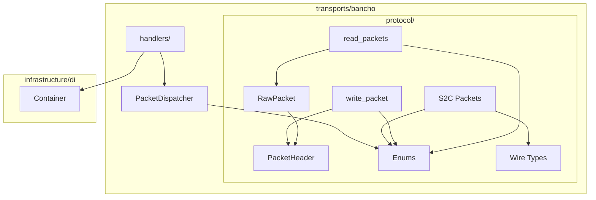
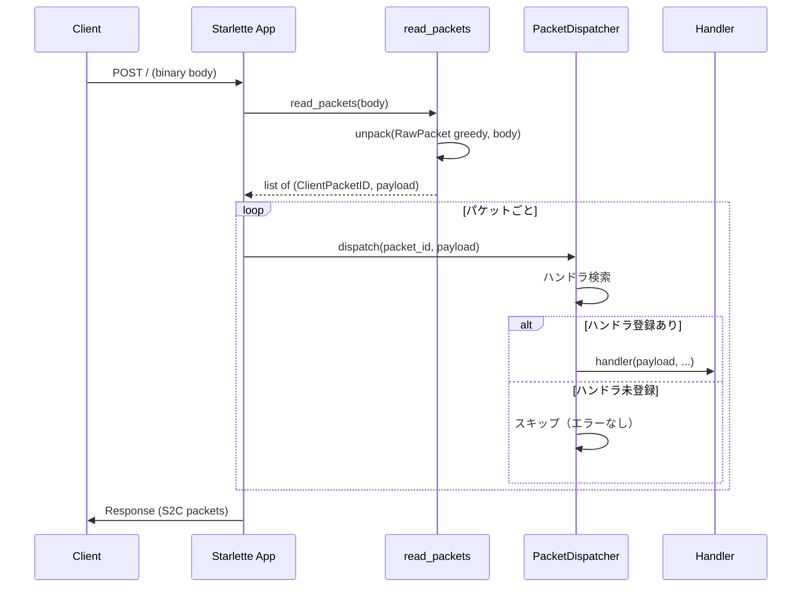
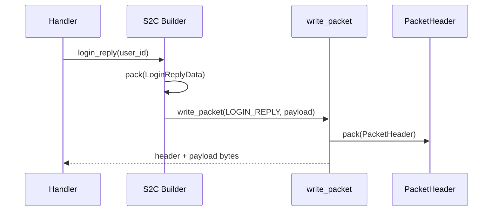

# Design Document: bancho-protocol

## Overview

**Purpose**: stable クライアントとの bancho バイナリプロトコル通信基盤を提供する。Caterpillar による宣言的パケット定義、ストリームからのパケット読み取り、S2C パケット構築、デコレータ駆動のディスパッチ機構を実装する。

**Users**: サーバー開発者が後続 spec（bancho-login, bancho-chat 等）でハンドラを実装する際の土台として利用する。

### Goals
- Caterpillar 宣言的構文でパケット構造を型安全に定義する
- C2S パケット読み取りと S2C パケット構築を統一的なユーティリティで提供する
- デコレータ登録による拡張容易なディスパッチ機構を構築する
- ログイン応答シーケンスに必要な全 S2C パケット型を定義する

### Non-Goals
- 個別パケットハンドラのビジネスロジック実装（bancho-login 等が担当）
- チャット・スコア・マルチプレイ関連パケット型定義（後続 spec）
- HTTP リクエスト/レスポンスの処理（bancho-login がルートハンドラを実装）
- クライアント認証・セッション管理（foundation / bancho-login が担当）

## Boundary Commitments

### This Spec Owns
- パケットヘッダの struct 定義と読み書き
- ClientPacketID / ServerPacketID 列挙型の全値定義
- 基本ワイヤ型（BanchoString, Message, IntList, Channel, StatusUpdate）の定義と双方向変換
- バイトストリームからの C2S パケット一括読み取り機能（RawPacket struct + `read_packets()` 関数）
- S2C パケットバイト列構築ユーティリティ（write_packet）
- デコレータ駆動の PacketDispatcher（ハンドラ登録・検索・呼び出し・一覧取得・重複検出）
- ログイン応答シーケンス用 S2C パケット型（LoginReply, ProtocolVersion, UserPresence 等）

### Out of Boundary
- パケットハンドラの実装（bancho-login 等の後続 spec が担当）
- ハンドラ関数の具体的シグネチャ（payload 以外のコンテキスト引数は後続 spec で定義）
- HTTP ルートハンドラ（POST `/` のリクエスト処理は bancho-login が担当）
- Match, ScoreFrame, ReplayFrame 等のマルチプレイ/スペクテイター関連型
- パケット圧縮の実装（ヘッダの Compression フィールドは定義するが、現代クライアントでは未使用）
- 条件付きフィールドを持つパケット型（Match の freemod → slot_mods、ScoreFrame の ScoreV2 → combo/bonus 等）。後続 spec で Caterpillar Switch (`F(this.field) >> {value: Type, ...}`) を使用して定義する

### Allowed Dependencies
- **foundation spec**: DI コンテナ（Container）、AppConfig、Starlette アプリ骨格
- **caterpillar-py**: バイナリ struct 定義・シリアライゼーション（v2.8.1+）
- **Python 標準ライブラリ**: enum, struct, dataclasses

### Revalidation Triggers
- PacketHeader のフィールド構成変更
- ClientPacketID / ServerPacketID の値追加・変更
- BanchoString のワイヤフォーマット変更
- PacketDispatcher のハンドラ登録インターフェース変更
- write_packet のシグネチャ変更

## Architecture

### Architecture Pattern & Boundary Map

Caterpillar 宣言的定義を中心とした Protocol 層 + Dispatch 層の 2 層構成。foundation の DI コンテナと統合し、import-linter のレイヤー規則に準拠する。



**Architecture Integration**:
- **選定パターン**: Protocol 層（データ定義）+ Dispatch 層（制御フロー）の分離
- **既存パターン維持**: foundation の DI コンテナ登録パターン、Protocol ベースの構造的型付け
- **依存方向**: `handlers/` → `dispatch` → `protocol/` → `caterpillar` （一方向のみ）
- **Caterpillar 機能の活用方針**: Greedy 配列 (`Type[...]`) でパケット一括読み取り。条件付きフィールドには Switch (`F(this.field) >> {...}`) を使用（`with If()` は Python 3.14 非互換のため不使用）

### Technology Stack

| Layer | Choice / Version | Role in Feature | Notes |
|-------|------------------|-----------------|-------|
| Binary Protocol | caterpillar-py v2.8.1+ | パケット struct 定義、pack/unpack、Greedy 配列、Switch | Python 3.14 互換。`with If()` は不使用（3.14 非互換）→ Switch で代替 |
| Enum | Python 標準 IntEnum | ClientPacketID / ServerPacketID | 値ベースの高速ルックアップ |
| DI | foundation Container | PacketDispatcher のシングルトン管理 | 既存パターン踏襲 |
| Type Check | basedpyright (strict) | 全コンポーネントの型安全性保証 | 既存設定踏襲 |

## File Structure Plan

### Directory Structure
```
src/osu_server/transports/bancho/
├── __init__.py
├── protocol/
│   ├── __init__.py          # パブリック API の re-export
│   ├── header.py            # PacketHeader struct
│   ├── enums.py             # ClientPacketID, ServerPacketID
│   ├── types.py             # BanchoString, Message, IntList, Channel, StatusUpdate
│   ├── reader.py            # RawPacket struct + read_packets()（Greedy 配列で一括パース）
│   ├── writer.py            # write_packet（ServerPacketID + payload → bytes）
│   ├── c2s/                 # C2S パケットペイロード定義（後続 spec で追加）
│   │   └── __init__.py
│   └── s2c/                 # S2C パケットペイロード定義
│       ├── __init__.py
│       └── login.py         # ログイン関連 S2C パケット型 + ビルダー関数
├── dispatch.py              # PacketDispatcher, handler デコレータ
└── handlers/                # C2S パケットハンドラ（後続 spec で追加）
    └── __init__.py

tests/unit/transports/bancho/
├── __init__.py
├── protocol/
│   ├── __init__.py
│   ├── test_header.py
│   ├── test_enums.py
│   ├── test_types.py
│   ├── test_reader.py
│   ├── test_writer.py
│   └── test_s2c_login.py
└── test_dispatch.py
```

### Modified Files
- `pyproject.toml` — `caterpillar-py` を dependencies に追加
- `src/osu_server/app.py` — lifespan 内で PacketDispatcher を DI コンテナにシングルトン登録（infrastructure → transports の逆方向 import を避けるため、composition root で登録）

## System Flows

### C2S パケット受信 → ディスパッチ



### S2C パケット構築



## Requirements Traceability

| Requirement | Summary | Components | Interfaces | Flows |
|-------------|---------|------------|------------|-------|
| 1.1, 1.2 | ヘッダ定義（3 フィールド、LE） | PacketHeader | pack/unpack | — |
| 1.3, 1.4 | ヘッダ読み書き | PacketHeader | pack/unpack | — |
| 2.1, 2.2, 2.3, 2.4 | パケット ID 列挙型 | ClientPacketID, ServerPacketID | IntEnum | — |
| 3.1 | BanchoString | BanchoString | FieldStruct | — |
| 3.2, 3.3, 3.4, 3.5 | ワイヤ型 | Message, IntList, Channel, StatusUpdate | Caterpillar struct | — |
| 3.6 | 双方向変換 | 全ワイヤ型 | pack/unpack | — |
| 4.1, 4.2 | C2S パケット読み取り | RawPacket, read\_packets | unpack(RawPacket[...]) | C2S 受信フロー |
| 4.3 | S2C パケット構築 | write_packet | write\_packet() | S2C 構築フロー |
| 4.4, 4.5 | データ不足エラー | read\_packets | PacketReadError | C2S 受信フロー |
| 5.1, 5.5 | ハンドラ登録 | PacketDispatcher | register() | — |
| 5.2, 5.3 | ハンドラ呼び出し | PacketDispatcher | dispatch() | C2S 受信フロー |
| 5.4 | ハンドラ一覧 | PacketDispatcher | get\_handlers() | — |
| 6.1–6.12 | S2C パケット型 | s2c/login.py | ビルダー関数 | S2C 構築フロー |

## Components and Interfaces

| Component | Domain/Layer | Intent | Req Coverage | Key Dependencies | Contracts |
|-----------|-------------|--------|-------------|-----------------|-----------|
| PacketHeader | protocol | パケットヘッダの struct 定義 | 1.1–1.4 | caterpillar-py (P0) | State |
| ClientPacketID | protocol | C2S パケット ID 列挙 | 2.1, 2.3, 2.4 | — | — |
| ServerPacketID | protocol | S2C パケット ID 列挙 | 2.2, 2.3, 2.4 | — | — |
| BanchoString | protocol | osu! 独自文字列型 | 3.1, 3.6 | caterpillar-py VarInt (P0) | State |
| Wire Types | protocol | Message, IntList, Channel, StatusUpdate | 3.2–3.6 | BanchoString (P0) | State |
| RawPacket + read_packets | protocol | バイトストリーム → パケット列 | 4.1, 4.2, 4.4, 4.5 | PacketHeader, ClientPacketID (P0) | Service |
| write_packet | protocol | ServerPacketID + payload → bytes | 4.3 | PacketHeader (P0) | Service |
| PacketDispatcher | dispatch | ハンドラ登録・検索・呼び出し | 5.1–5.5 | ClientPacketID (P0) | Service |
| S2C Login Packets | protocol/s2c | ログイン応答パケット型 | 6.1–6.12 | Wire Types, write_packet (P0) | State |

### Protocol Layer

#### PacketHeader

| Field | Detail |
|-------|--------|
| Intent | bancho パケットヘッダ（7 バイト固定長）の宣言的定義と双方向変換 |
| Requirements | 1.1, 1.2, 1.3, 1.4 |

**Responsibilities & Constraints**
- PacketID (uint16)、Compression (boolean, 1 byte)、ContentSize (uint32) の 3 フィールドを Caterpillar struct で定義
- 全フィールド リトルエンディアン
- `pack()` でヘッダ → 7 バイト、`unpack()` で 7 バイト → ヘッダ

**Dependencies**
- External: caterpillar-py — struct 定義・シリアライゼーション (P0)

**Contracts**: State [x]

##### State Management
```python
@struct(order=LittleEndian)
class PacketHeader:
    packet_id: uint16
    compression: boolean
    content_size: uint32
```
- 7 バイト固定長（HEADER_SIZE = 7）
- Compression は現代クライアントでは常に False

#### ClientPacketID / ServerPacketID

| Field | Detail |
|-------|--------|
| Intent | C2S / S2C パケット ID の型安全な列挙型定義 |
| Requirements | 2.1, 2.2, 2.3, 2.4 |

**Responsibilities & Constraints**
- Python `IntEnum` を使用（値ベースの高速ルックアップ、int 互換）
- bancho-documentation Wiki の現行パケット ID 一覧に準拠
- 2 つの列挙型を完全に分離し、同一数値 ID が方向ごとに独立

**Dependencies**
- なし（Python 標準ライブラリのみ）

**Implementation Notes**
- ClientPacketID: 41 エントリ（ID 0–109 のうちクライアント→サーバー方向）
- ServerPacketID: 62 エントリ（ID 5–107 のうちサーバー→クライアント方向）

#### BanchoString

| Field | Detail |
|-------|--------|
| Intent | osu! 独自の文字列ワイヤフォーマットを Caterpillar FieldStruct として実装 |
| Requirements | 3.1, 3.6 |

**Responsibilities & Constraints**
- Presence byte: `0x00` = 空文字列、`0x0b` = 文字列あり
- 長さ: ULEB128 エンコード（Caterpillar `VarInt` 使用）
- データ: UTF-8 バイト列
- 他の Caterpillar struct にフィールドとしてネスト可能

**Dependencies**
- External: caterpillar-py VarInt — ULEB128 エンコード/デコード (P0)

**Contracts**: State [x]

##### State Management
```python
class BanchoString(FieldStruct):
    """osu! BanchoString: 0x00 (empty) or 0x0b + ULEB128 length + UTF-8 data"""

    def pack(self, value: str, context: Context) -> None: ...
    def unpack(self, context: Context) -> str: ...
```
- Preconditions: value は str 型
- Postconditions: pack は presence byte + ULEB128 長 + UTF-8 バイトを出力。空文字列は `0x00` のみ
- Invariants: unpack(pack(s)) == s（任意の str s に対して）

#### Wire Types (Message, IntList, Channel, StatusUpdate)

| Field | Detail |
|-------|--------|
| Intent | プロトコルで共有される基本データ型の Caterpillar struct 定義 |
| Requirements | 3.2, 3.3, 3.4, 3.5, 3.6 |

**Responsibilities & Constraints**
- 各型は Caterpillar `@struct(order=LittleEndian)` で定義
- 全型で pack/unpack 双方向変換をサポート

**Dependencies**
- Inbound: BanchoString — 文字列フィールドに使用 (P0)
- External: caterpillar-py — struct 定義 (P0)

**Contracts**: State [x]

##### State Management
```python
@struct(order=LittleEndian)
class Message:
    sender: BanchoString
    content: BanchoString
    target: BanchoString
    sender_id: int32

@struct(order=LittleEndian)
class IntList:
    count: uint16
    values: int32[this.count]

@struct(order=LittleEndian)
class Channel:
    name: BanchoString
    topic: BanchoString
    user_count: int16

@struct(order=LittleEndian)
class StatusUpdate:
    status: uint8      # Status enum value
    status_text: BanchoString
    beatmap_md5: BanchoString
    mods: int32
    play_mode: uint8   # Mode enum value
    beatmap_id: int32
```

#### RawPacket + read_packets

| Field | Detail |
|-------|--------|
| Intent | Caterpillar Greedy 配列でバイトストリームから C2S パケットを一括読み取り |
| Requirements | 4.1, 4.2, 4.4, 4.5 |

**Responsibilities & Constraints**
- `RawPacket` は Caterpillar struct でヘッダ + 可変長ペイロードを一体定義
- Greedy 配列 `RawPacket[...]` で HTTP body から全パケットを一括パース（EOF まで）
- `read_packets()` は Caterpillar `unpack()` のラッパー + ClientPacketID 変換
- 未知の PacketID（ClientPacketID に存在しない値）はスキップ

**Dependencies**
- Inbound: ClientPacketID — パケット ID の型変換 (P0)
- External: caterpillar-py — Greedy 配列、struct 定義 (P0)

**Contracts**: Service [x]

##### State Management
```python
@struct(order=LittleEndian)
class RawPacket:
    """ヘッダ + 可変長ペイロードを一体化したパケット struct"""
    packet_id: uint16
    compression: boolean
    content_size: uint32
    payload: Bytes(this.content_size)
```
- PacketHeader と同じフィールド構成 + payload を追加
- Caterpillar の `this.content_size` で動的長ペイロードを自動切り出し

##### Service Interface
```python
def read_packets(data: bytes | bytearray) -> list[tuple[ClientPacketID, bytes]]:
    """バイトストリームから全 C2S パケットを一括読み取る。

    内部で unpack(RawPacket[...], data) を使用し、Caterpillar の
    Greedy 配列で EOF まで全パケットをパースする。
    """
    ...
```
- Preconditions: data は 0 バイト以上の任意長バイト列
- Postconditions: (ClientPacketID, payload_bytes) のリストを返す。空バイト列の場合は空リスト
- Error: パース中にデータ不足が発生した場合、Caterpillar が例外を送出 → `PacketReadError` でラップ。Greedy 配列が不完全データを黙って切り捨てる場合は、消費バイト数と入力バイト数を事後比較し、残余バイトがあれば `PacketReadError` を送出する
- 未知の PacketID（ClientPacketID に存在しない値）はフィルタしてスキップ

#### write_packet

| Field | Detail |
|-------|--------|
| Intent | ServerPacketID とペイロードからヘッダ付き完全パケットバイト列を生成 |
| Requirements | 4.3 |

**Dependencies**
- Inbound: PacketHeader — ヘッダのシリアライズ (P0)

**Contracts**: Service [x]

##### Service Interface
```python
def write_packet(packet_id: ServerPacketID, payload: bytes = b"") -> bytes:
    """ServerPacketID とペイロードから完全なパケットバイト列を構築する"""
    ...
```
- Preconditions: packet_id は有効な ServerPacketID
- Postconditions: 返却値は 7 バイトヘッダ + payload の連結。Compression は False 固定

### Dispatch Layer

#### PacketDispatcher

| Field | Detail |
|-------|--------|
| Intent | C2S パケットハンドラのデコレータ登録と受信パケットのディスパッチ |
| Requirements | 5.1, 5.2, 5.3, 5.4, 5.5 |

**Responsibilities & Constraints**
- ハンドラを ClientPacketID → Callable のマッピングで管理
- `app.py` の lifespan 内で DI コンテナにシングルトン登録される（infrastructure → transports の逆方向 import を回避）
- モジュールレベルのデフォルトインスタンスを提供（デコレータ登録用）

**Dependencies**
- Inbound: ClientPacketID — パケット ID のキー (P0)
- Outbound: app.py lifespan — DI 登録 (P1)

**Contracts**: Service [x]

##### Service Interface
```python
# ハンドラ型定義
type PacketHandler = Callable[..., Awaitable[None]]

class PacketDispatcher:
    """C2S パケットハンドラのレジストリとディスパッチャ"""

    def register(self, packet_id: ClientPacketID) -> Callable[[PacketHandler], PacketHandler]:
        """ハンドラをデコレータで登録する。重複登録時は DuplicateHandlerError を送出"""
        ...

    async def dispatch(self, packet_id: ClientPacketID, payload: bytes, *args: Any, **kwargs: Any) -> None:
        """登録済みハンドラを呼び出す。未登録の場合は無視（エラーなし）"""
        ...

    def get_handlers(self) -> dict[ClientPacketID, PacketHandler]:
        """登録済み全ハンドラの読み取り専用コピーを返す"""
        ...

# モジュールレベルのデフォルトインスタンス（デコレータ登録用）
dispatcher = PacketDispatcher()

# デコレータ使用例
@dispatcher.register(ClientPacketID.SEND_MESSAGE)
async def handle_send_message(payload: bytes, ...) -> None:
    ...
```
- Preconditions: register() は未登録の ClientPacketID に対してのみ成功
- Error: 同一 ClientPacketID の重複登録で `DuplicateHandlerError` を送出
- dispatch() は未登録 ID に対してエラーなしでリターン

### Protocol/S2C Layer

#### S2C Login Packets

| Field | Detail |
|-------|--------|
| Intent | ログイン応答シーケンスで使用する全 S2C パケットの型定義とビルダー関数 |
| Requirements | 6.1–6.12 |

**Responsibilities & Constraints**
- 各パケットは Caterpillar struct + ビルダー関数のペアで定義
- ビルダー関数は `write_packet()` を使用して完全なパケットバイト列を返す
- ServerPacketID との対応は各ビルダー関数内で明示

**Dependencies**
- Inbound: Wire Types — BanchoString, IntList, Channel, StatusUpdate (P0)
- Inbound: write_packet — パケットバイト列構築 (P0)
- Inbound: ServerPacketID — パケット ID (P0)

**Contracts**: State [x]

##### State Management

各パケット型の構造と対応するビルダー関数:

| Packet | ServerPacketID | Payload |
|--------|---------------|---------|
| LoginReply | LOGIN_REPLY (5) | int32 (正値=userId, 負値=エラーコード) |
| ProtocolVersion | PROTOCOL_VERSION (75) | int32 |
| LoginPermissions | LOGIN_PERMISSIONS (71) | int32 (権限ビットマスク) |
| Notification | ANNOUNCE (24) | BanchoString |
| UserPresence | USER_PRESENCE (83) | UserId, Username, Timezone, CountryId, Permissions\|Mode, Longitude, Latitude, Rank |
| UserStats | USER_STATS (11) | UserId, StatusUpdate, RankedScore, Accuracy, PlayCount, TotalScore, Rank, PP |
| FriendsList | FRIENDS_LIST (72) | IntList |
| ChannelAvailable | CHANNEL_AVAILABLE (65) | Channel |
| ChannelAvailableAutojoin | CHANNEL_AVAILABLE_AUTOJOIN (67) | Channel |
| ChannelInfoComplete | CHANNEL_INFO_COMPLETE (89) | なし (空ペイロード) |
| SilenceInfo | SILENCE_INFO (92) | int32 (残り秒数) |
| UserPresenceBundle | USER_PRESENCE_BUNDLE (96) | IntList (ユーザー ID 一覧) |

```python
# ビルダー関数のインターフェース例
def login_reply(user_id: int) -> bytes: ...
def protocol_version(version: int) -> bytes: ...
def login_permissions(permissions: int) -> bytes: ...
def notification(message: str) -> bytes: ...
def user_presence(user_id: int, username: str, timezone: int, country_id: int,
                  permissions: int, mode: int, longitude: float, latitude: float,
                  rank: int) -> bytes: ...
def user_stats(user_id: int, status: StatusUpdate, ranked_score: int, accuracy: float,
               play_count: int, total_score: int, rank: int, pp: int) -> bytes: ...
def friends_list(friend_ids: list[int]) -> bytes: ...
def channel_available(name: str, topic: str, user_count: int) -> bytes: ...
def channel_available_autojoin(name: str, topic: str, user_count: int) -> bytes: ...
def channel_info_complete() -> bytes: ...
def silence_info(remaining_seconds: int) -> bytes: ...
def user_presence_bundle(user_ids: list[int]) -> bytes: ...
```

## Error Handling

### Error Strategy

プロトコル層のエラーは専用例外クラスで表現し、呼び出し元（トランスポートハンドラ）が適切に処理する。

### Error Categories

```python
class PacketError(Exception):
    """パケットプロトコルの基底例外"""

class PacketReadError(PacketError):
    """パケット読み取り時のエラー（ヘッダ/ペイロード不足）"""

class DuplicateHandlerError(PacketError):
    """同一 ClientPacketID への重複ハンドラ登録"""
```

| Error | Trigger | Recovery |
|-------|---------|----------|
| PacketReadError | ヘッダ 7 バイト未満、ペイロード不足 | 呼び出し元がコネクション切断または残バッファ破棄 |
| DuplicateHandlerError | 同一 PacketID に 2 つ目のハンドラ登録 | 起動時に検出、開発者が修正 |

## Testing Strategy

### Unit Tests

1. **PacketHeader**: pack/unpack ラウンドトリップ、リトルエンディアン検証、既知バイト列との照合 (1.1–1.4)
2. **Enums**: ClientPacketID 全 41 値の存在確認、ServerPacketID 全 62 値の存在確認、分離検証 (2.1–2.4)
3. **BanchoString**: 空文字列 (`0x00`)、通常文字列、マルチバイト UTF-8、ラウンドトリップ (3.1, 3.6)
4. **Wire Types**: Message/IntList/Channel/StatusUpdate の pack/unpack、既知バイト列との照合 (3.2–3.5)
5. **RawPacket + read_packets**: 単一パケット、複数連結パケット（Greedy 一括パース）、不正データのエラー、未知 PacketID スキップ (4.1, 4.2, 4.4, 4.5)
6. **write_packet**: 正しいヘッダ生成、空ペイロード、既知パケットとの照合 (4.3)
7. **PacketDispatcher**: register → dispatch 成功、未登録 ID 無視、ハンドラ一覧取得、重複登録エラー (5.1–5.5)
8. **S2C Login Packets**: 各ビルダー関数が正しいバイト列を生成、ServerPacketID 対応の正確性 (6.1–6.12)

### Integration Tests

1. **read_packets → PacketDispatcher**: バイトストリームからの一括読み取り → ディスパッチ → ハンドラ呼び出しの end-to-end フロー
2. **DI 統合**: PacketDispatcher が Container 経由で resolve 可能であること
