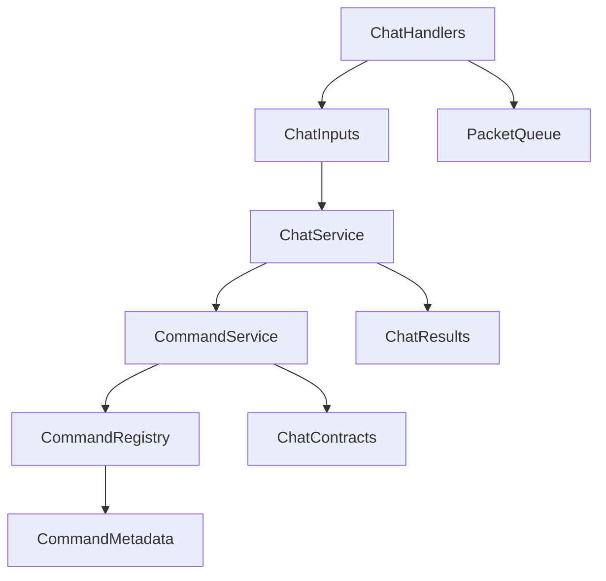
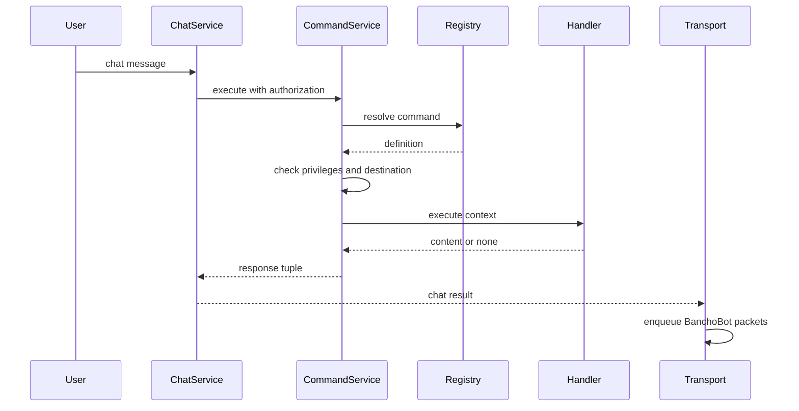
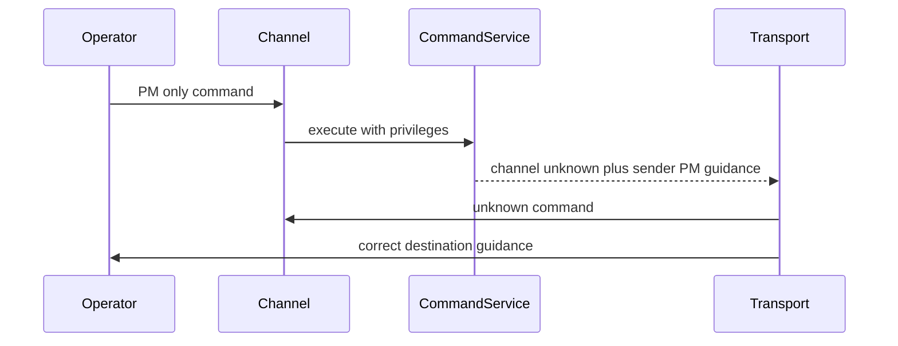

# Design Document

## Overview

BanchoBot admin command foundation は、既存の registry-backed BanchoBot command system を拡張し、将来の管理 command を `Privileges` と実行場所で安全に制御できるようにする。既存の `!help` と `!roll` は維持し、新しい player-visible admin command は追加しない。

この design の主な利用者は athena 開発者と BanchoBot 経由で管理操作を行う将来の operator である。開発者は `required_privileges` と `allowed_destinations` を command registration metadata として指定し、operator は BanchoBot PM または channel で自分が実行可能な command だけを discover する。

### Goals

- BanchoBot command metadata に required privileges、allowed destinations、usage、argument help を追加する。
- channel と PM の両方で同じ session authorization snapshot に基づいて command を判定する。
- public channel で PM-only admin command 名を露出しない help と unknown behavior を実現する。
- `!help --all`、`!help --help`、`!<command> --help` を共通 help contract として提供する。

### Non-Goals

- `!role`、`!ban`、`!silence`、Beatmap rank 変更 command の実装。
- 新しい `Privileges` member の追加。
- role position に基づく対象ユーザー別の許可判定。
- authorization refresh を実行する command。
- 監査ログ基盤。
- 共通 argument parser または validation error format の導入。

## Boundary Commitments

### This Spec Owns

- BanchoBot command registration metadata の contract。
- `Privileges` による command entry authorization。
- `allowed_destinations` による channel / PM execution gating。
- 権限と現在の実行場所に基づく command discovery。
- Common help options: `--help` and `!help --all`。
- `ChatService` と Bancho transport が複数 BanchoBot command responses を運べる contract。

### Out of Boundary

- 具体的な player-visible admin command の catalog。
- command handler 内部の business rule authorization。
- role repository、user repository、beatmap repository、DB schema、migration。
- packet format と BanchoBot identity。
- chat validation、silence、rate limit、channel membership の既存判定順の変更。

### Allowed Dependencies

- `services.bancho_bot` may import from `domain.chat`, `domain.role`, and Python standard library.
- `ChatService` may pass validated chat inputs and authorization snapshots into `CommandService`.
- Bancho transport handlers may continue to own packet serialization and `BANCHO_BOT_IDENTITY`.
- Composition roots may instantiate builtin registry and inject `CommandService`.
- No new runtime dependency is introduced.

### Revalidation Triggers

- `CommandService.execute()` input or return contract changes.
- `CommandMetadata`, `CommandContext`, or command decorator parameter changes.
- `ChatCommandResponse` or chat result command response contract changes.
- Session authorization snapshot shape changes.
- ChatService command detection point moves relative to validation, routing, silence, or rate limit checks.
- Future specs introduce role-position command authorization or audit logging that must observe command execution.

## Architecture

### Existing Architecture Analysis

- `services.bancho_bot` already contains `CommandService`, `CommandRegistry`, `CommandMetadata`, `CommandContext`, and builtin `!roll` / `!help`.
- `CommandService.execute()` currently receives only sender identity, target, and content. It must receive authorization to evaluate required privileges.
- `SendChannelMessageInput` carries authorization; `SendPrivateMessageInput` does not. PM path must be extended so PM command execution uses the same session snapshot as channel execution.
- `ChannelMessageResult` and `PrivateMessageResult` currently carry one optional `command_response`. Destination guidance requires multiple responses.

### Architecture Pattern & Boundary Map



**Architecture Integration**:

- Selected pattern: extend the existing typed command registry.
- Domain boundaries: `services.bancho_bot` owns command-level authorization and destination gating; `ChatService` owns chat pipeline ordering; transport owns packet serialization and enqueue.
- Existing patterns preserved: constructor injection, `@dataclass(slots=True)`, standard library only, async command handlers, deterministic registry order.
- New components rationale: value objects are added for destination kind, argument help metadata, and response sets because these are shared contracts across registry, service, and transport.
- Steering compliance: no new dependency, Python type hints, pytest-first implementation.

### Technology Stack

| Layer | Choice / Version | Role in Feature | Notes |
|-------|------------------|-----------------|-------|
| Backend / Services | Python 3.14 standard library | dataclasses, IntFlag checks, enum values | No new package |
| Domain | existing `domain.chat`, `domain.role` | chat input/result contracts and `Privileges` | No DB change |
| Transport | existing Bancho handlers | serialize one or more command responses as BanchoBot messages | Packet format unchanged |
| Testing | pytest + pytest-asyncio | service, transport, integration coverage | Existing stack |

## File Structure Plan

### Directory Structure

```text
src/osu_server/
├── domain/
│   └── chat.py                         # shared chat authorization and multiple command response result fields
└── services/
    └── bancho_bot/
        ├── context.py                  # CommandMetadata, CommandContext, CommandArgument, CommandDestination
        ├── registry.py                 # decorator contract with required_privileges and allowed_destinations
        ├── command_service.py          # authorization, destination gating, common help dispatch
        └── commands/
            └── general.py              # updated !roll and !help metadata and help options
```

### Modified Files

- `src/osu_server/domain/chat.py` — add shared `ChatAuthorization`; add tuple command response fields to channel and PM results; add authorization to PM input.
- `src/osu_server/services/bancho_bot/context.py` — replace `visible` metadata with `required_privileges`, `allowed_destinations`, `usage`, and argument help metadata; add destination kind to `CommandContext`.
- `src/osu_server/services/bancho_bot/registry.py` — extend `CommandRegistry.command()` and standalone `command()` decorator parameters; expose all command metadata in registration order.
- `src/osu_server/services/bancho_bot/command_service.py` — accept authorization, enforce privilege and destination gates, build common help responses, return response tuples.
- `src/osu_server/services/bancho_bot/commands/general.py` — register `!roll` and `!help` with usage and argument metadata; keep normal outputs compatible.
- `src/osu_server/services/chat_service.py` — pass authorization into command execution for both channel and PM; return tuple command responses.
- `src/osu_server/transports/bancho/handlers/chat.py` — pass PM authorization from session; enqueue all command responses deterministically.
- `src/osu_server/composition/service_registry.py` — no behavior change expected beyond import/type compatibility if signatures change.
- `src/osu_server/composition/worker_runtime.py` — no behavior change expected beyond import/type compatibility if signatures change.
- `tests/unit/services/bancho_bot/test_command_service.py` — expand command authorization, discovery, destination, help, and response tuple coverage.
- `tests/unit/services/test_chat_service.py` — verify channel and PM authorization propagation and result contract.
- `tests/unit/transports/bancho/test_chat_handlers.py` — verify PM authorization propagation and multiple command response enqueue.
- `tests/integration/test_chat_e2e.py` and `tests/integration/test_chat_pipeline.py` — verify existing `!help` / `!roll` behavior and public channel unknown behavior remain stable.

## System Flows

### Command Execution



### PM-only Command in Public Channel



Key decision: command service returns response intent only. Packet author identity and queue writes remain in Bancho transport.

## Requirements Traceability

| Requirement | Summary | Components | Interfaces | Flows |
|-------------|---------|------------|------------|-------|
| 1.1 | command metadata includes privileges and destinations | CommandMetadata, CommandRegistry | decorator contract | command execution |
| 1.2 | unspecified privileges mean public command | CommandMetadata, CommandService | `required_privileges` default | command execution |
| 1.3 | specified privileges gate execution | CommandService | authorization check | command execution |
| 1.4 | multiple privileges require all flags | CommandService | authorization check | command execution |
| 1.5 | ADMIN bypass | CommandService | authorization check | command execution |
| 1.6 | unspecified destinations mean both | CommandMetadata, CommandService | `allowed_destinations` default | command execution |
| 1.7 | entry auth excludes role identity and position | CommandService | authorization check | command execution |
| 2.1 | authorized channel execution | CommandService, ChatService, Transport | response tuple | command execution |
| 2.2 | authorized PM execution | CommandService, ChatService, Transport | response tuple | command execution |
| 2.3 | unauthorized registered command returns fixed unknown | CommandService | unknown response | command execution |
| 2.4 | unregistered command returns fixed unknown | CommandService | unknown response | command execution |
| 2.5 | authorization uses session snapshot | ChatService, ChatInputs, CommandContext | `ChatAuthorization` | command execution |
| 2.6 | public destination violation returns unknown and PM guidance | CommandService, Transport | response tuple | PM-only public flow |
| 2.7 | PM destination violation returns guidance | CommandService, Transport | response tuple | command execution |
| 2.8 | unauthorized destination violation returns unknown only | CommandService | authorization before guidance | command execution |
| 2.9 | normal chat rejection prevents command execution | ChatService | existing pipeline order | command execution |
| 3.1 | help lists executable commands in current place | CommandService, Registry, help command | discoverable metadata | command discovery |
| 3.2 | help hides insufficient privilege commands | CommandService, Registry | metadata filter | command discovery |
| 3.3 | help hides wrong destination commands | CommandService, Registry | metadata filter | command discovery |
| 3.4 | help preserves registration order | CommandRegistry | ordered definitions | command discovery |
| 3.5 | help all lists names and descriptions | help command | metadata list | command discovery |
| 3.6 | help help shows help command options | help command | common help contract | command discovery |
| 3.7 | public help hides PM-only commands | CommandService, help command | destination filter | command discovery |
| 3.8 | help remains public | CommandMetadata | default privileges | command discovery |
| 4.1 | command detail help shows name usage arguments | CommandService | common help renderer | detail help |
| 4.2 | unauthorized detail help returns unknown | CommandService | authorization before help | detail help |
| 4.3 | argument help supports name required description | CommandArgument | metadata contract | detail help |
| 4.4 | chat help hides required privileges | help renderer | output contract | detail help |
| 4.5 | first arg help invokes common detail help | CommandService | parser branch | detail help |
| 4.6 | non-first help remains handler arg | CommandService | parser branch | command execution |
| 4.7 | first arg all invokes help all | help command | parser branch | command discovery |
| 5.1 | roll behavior preserved | general commands | handler contract | command execution |
| 5.2 | normal help format preserved and filtered | help command | metadata list | command discovery |
| 5.3 | non-command ignored | CommandService | parser branch | command execution |
| 5.4 | prefix-only ignored | CommandService | parser branch | command execution |
| 5.5 | handler none yields no response | CommandService | handler contract | command execution |
| 5.6 | no new visible admin commands | builtin registry | registration catalog | composition |
| 6.1 | command-specific validation remains handler owned | handler contract | context and metadata access | command execution |
| 6.2 | handlers can reuse usage metadata | CommandContext | metadata access | command execution |
| 6.3 | no shared validation error format | handler contract | no parser dependency | command execution |

## Components and Interfaces

| Component | Domain/Layer | Intent | Req Coverage | Key Dependencies | Contracts |
|-----------|--------------|--------|--------------|------------------|-----------|
| CommandMetadata | Services | Describe command auth, destination, and help metadata | 1.1-1.7, 3.1-3.8, 4.1-4.4 | `Privileges` P0 | State |
| CommandRegistry | Services | Register, resolve, and list command definitions in deterministic order | 1.1, 3.4, 5.6 | CommandMetadata P0 | Service |
| CommandService | Services | Parse, authorize, gate, help, and execute commands | 2.1-2.9, 3.1-3.8, 4.1-4.7, 5.3-5.5 | CommandRegistry P0, ChatAuthorization P0 | Service |
| CommandContext | Services | Immutable invocation context for handlers | 2.5, 6.1-6.2 | CommandMetadata P1 | State |
| Chat Contracts | Domain | Carry authorization and one or more command responses | 2.1-2.7, 2.9 | ChatCommandResponse P0 | State |
| General Commands | Services | Preserve and extend `!roll` and `!help` | 3.5-3.8, 4.7, 5.1-5.2 | CommandRegistry P0 | Service |
| Bancho ChatHandlers | Transport | Serialize command responses as BanchoBot packets | 2.1-2.7 | PacketQueue P0, BANCHO_BOT_IDENTITY P0 | Service |

### Services

#### CommandMetadata and Command Types

| Field | Detail |
|-------|--------|
| Intent | Typed command registration metadata used for auth, discovery, and help |
| Requirements | 1.1-1.7, 3.1-3.8, 4.1-4.4 |

**Responsibilities & Constraints**

- Replace `visible` with computed discoverability from privileges and destination.
- Store `description` for `!help --all`.
- Store `usage` and `arguments` for `!<command> --help`.
- Store `required_privileges`; default is `Privileges.NONE`.
- Store `allowed_destinations`; default is both channel and PM.
- Never expose `required_privileges` in chat help output.

**Contracts**: Service [ ] / API [ ] / Event [ ] / Batch [ ] / State [x]

##### State Model

```python
from dataclasses import dataclass
from enum import StrEnum

from osu_server.domain.role import Privileges

class CommandDestination(StrEnum):
    CHANNEL = "channel"
    PM = "pm"
    BOTH = "both"

@dataclass(slots=True, frozen=True)
class CommandArgument:
    name: str
    required: bool
    description: str

@dataclass(slots=True, frozen=True)
class CommandMetadata:
    name: str
    description: str
    usage: str
    arguments: tuple[CommandArgument, ...] = ()
    required_privileges: Privileges = Privileges.NONE
    allowed_destinations: CommandDestination = CommandDestination.BOTH
```

- Invariants: `name`, `description`, and `usage` are non-empty.
- Invariants: public command means `required_privileges == Privileges.NONE`.
- Invariants: chat output never includes `required_privileges`.

#### CommandRegistry

| Field | Detail |
|-------|--------|
| Intent | Register command definitions and expose ordered metadata |
| Requirements | 1.1, 3.4, 5.6 |

**Responsibilities & Constraints**

- Keep case-insensitive command names.
- Preserve insertion order.
- Reject duplicate command names.
- Provide all registered metadata to `CommandService`; filtering belongs to `CommandService` because it needs requester authorization and destination.
- Keep no global mutable registry.

**Contracts**: Service [x] / API [ ] / Event [ ] / Batch [ ] / State [ ]

##### Service Interface

```python
CommandHandler = Callable[[CommandContext], Awaitable[str | None]]

class CommandRegistry:
    def register(self, definition: CommandDefinition) -> None: ...
    def resolve(self, name: str) -> CommandDefinition | None: ...
    def commands(self) -> tuple[CommandMetadata, ...]: ...

    def command(
        self,
        name: str,
        *,
        description: str,
        usage: str,
        arguments: tuple[CommandArgument, ...] = (),
        required_privileges: Privileges = Privileges.NONE,
        allowed_destinations: CommandDestination = CommandDestination.BOTH,
    ) -> Callable[[CommandHandler], CommandDefinition]: ...
```

- Preconditions: `name`, `description`, and `usage` are non-empty.
- Postconditions: duplicate names raise `ValueError`.
- Invariants: `commands()` returns registration order.

#### CommandService

| Field | Detail |
|-------|--------|
| Intent | Convert validated chat content into zero or more BanchoBot responses |
| Requirements | 2.1-2.9, 3.1-3.8, 4.1-4.7, 5.3-5.5, 6.1-6.3 |

**Responsibilities & Constraints**

- Parse `!` prefix, command name, and whitespace-separated arguments using existing behavior.
- Determine current destination kind from target string.
- Resolve commands case-insensitively.
- Check privileges before destination guidance.
- Apply all-of privilege matching with ADMIN bypass.
- Generate fixed unknown response for unregistered or unauthorized commands.
- Generate correct-destination guidance only for authorized users.
- Handle first-argument `--help` before handler execution.
- Make metadata available to handlers for command-specific validation responses.
- Return response tuples and never enqueue packets.

**Dependencies**

- Inbound: `ChatService` invokes after chat validation and routing (P0).
- Outbound: `CommandRegistry` resolves definitions and command metadata (P0).
- Outbound: `domain.chat.ChatCommandResponse` carries response targets (P0).
- Outbound: `domain.role.Privileges` and `has_privilege` semantics (P0).

**Contracts**: Service [x] / API [ ] / Event [ ] / Batch [ ] / State [ ]

##### Service Interface

```python
class CommandService:
    async def execute(
        self,
        *,
        sender_id: int,
        sender_name: str,
        target: str,
        content: str,
        authorization: ChatAuthorization,
    ) -> tuple[ChatCommandResponse, ...]: ...
```

- Preconditions: `content` has passed existing chat validation.
- Postconditions: non-command, prefix-only, empty command name, or handler `None` returns `()`.
- Postconditions: unauthorized and unknown commands return exactly one unknown response.
- Postconditions: authorized public destination violation returns channel unknown plus sender PM guidance.
- Invariants: packet identity remains transport-owned.

#### Chat Contracts

| Field | Detail |
|-------|--------|
| Intent | Carry session authorization and multiple command responses through chat services |
| Requirements | 2.1-2.7, 2.9 |

**Responsibilities & Constraints**

- Share authorization between channel and PM inputs.
- Represent zero, one, or many BanchoBot command responses.
- Keep existing message content and delivery target semantics unchanged.

**Contracts**: Service [ ] / API [ ] / Event [ ] / Batch [ ] / State [x]

##### State Model

```python
@dataclass(slots=True, frozen=True)
class ChatAuthorization:
    privileges: int = 0
    role_ids: tuple[int, ...] = ()

@dataclass(slots=True)
class ChatCommandResponse:
    target: str
    content: str

@dataclass(slots=True)
class ChannelMessageResult:
    delivered_to: set[int] | None
    content: str
    command_responses: tuple[ChatCommandResponse, ...] = ()

@dataclass(slots=True)
class PrivateMessageResult:
    target_id: int | None
    is_online: bool
    content: str
    command_responses: tuple[ChatCommandResponse, ...] = ()
```

- Migration note: replace `command_response` references with `command_responses`. Existing single response behavior is represented as tuple length 1.
- PM input receives `authorization: ChatAuthorization` from session data in the transport handler.

#### General Commands

| Field | Detail |
|-------|--------|
| Intent | Preserve `!roll` and `!help` while providing sample metadata |
| Requirements | 3.5-3.8, 4.7, 5.1-5.2 |

**Responsibilities & Constraints**

- Register `!roll` as public, both-destination command.
- Register `!help` as public, both-destination command.
- Keep normal `!roll` output unchanged.
- Keep normal `!help` short list format: `Available commands: !roll, !help`.
- Implement `!help --all` as names plus descriptions after auth and destination filtering.
- Implement `!help --help` as help command usage and available options.
- Do not add any dummy player-visible admin command.

#### Bancho ChatHandlers

| Field | Detail |
|-------|--------|
| Intent | Serialize all command responses as BanchoBot packets |
| Requirements | 2.1-2.7 |

**Responsibilities & Constraints**

- Pass session privileges and role_ids into both channel and PM chat inputs.
- For channel messages, enqueue the original user message and every command response to channel delivery targets.
- For sender-only guidance PM, enqueue the command response to the sender only.
- Preserve `BANCHO_BOT_IDENTITY` as the packet sender for all command responses.
- Keep packet format unchanged.

**Implementation Notes**

- For channel sends, enqueue order is original message first, then channel command responses, then sender-only PM guidance when needed.
- `ChatCommandResponse.target` remains the bancho message target string. A PM guidance response uses sender username as target.

## Data Models

### Domain Model

- `CommandMetadata` is the authoritative command registration data for command-level authorization, destination gating, and help text.
- `CommandArgument` is a value object for help display only. It does not enforce argument validation.
- `ChatAuthorization` is a session-derived snapshot passed through the chat pipeline.
- `ChatCommandResponse` is a transport-neutral BanchoBot message intent.

### Logical Data Model

No persistent data model changes are required. All new data is in-memory command metadata or per-message authorization snapshot data.

### Data Contracts & Integration

- Chat service input contract changes by adding authorization to PM input.
- Chat service result contract changes from optional single command response to tuple command responses.
- No API, event, batch, database, or packet schema changes are introduced.

## Error Handling

### Error Strategy

- Unknown command and unauthorized command both return the fixed string `Unknown command. Type !help for available commands.`.
- Destination guidance is returned only after required privileges pass.
- Required privileges are never included in chat output.
- Handler-level argument errors remain handler-owned.

### Error Categories and Responses

- Unknown command: one unknown response to the normal command response target.
- Unauthorized registered command: one unknown response to the normal command response target.
- Authorized destination violation in public channel: channel unknown response plus sender PM guidance.
- Authorized destination violation in PM: sender PM guidance only.
- Handler returns `None`: no command response.

### Monitoring

No new logging requirement is introduced. Existing chat and transport logs remain sufficient for this foundation. Audit logs are deferred to a separate spec.

## Testing Strategy

### Unit Tests

- `CommandRegistry` registers metadata with `required_privileges`, `allowed_destinations`, `usage`, and `arguments`; duplicate names still fail.
- `CommandService` returns unknown for unregistered and unauthorized registered commands with identical content.
- `CommandService` applies all-of privilege checks and ADMIN bypass.
- `CommandService` filters `!help` and `!help --all` by authorization and current destination.
- `CommandService` handles `!<command> --help`, `!help --help`, and first-argument-only option parsing.
- `CommandService` returns channel unknown plus sender PM guidance for authorized PM-only command used in public channel.
- `CommandService` returns no responses for non-command, prefix-only, and handler `None`.

### Integration Tests

- `ChatService.send_channel_message()` passes channel authorization into command execution without changing silence, rate limit, routing, or persistence order.
- `ChatService.send_private_message()` passes PM authorization into command execution from transport-provided session snapshot.
- Bancho `ChatHandlers` enqueue all command responses with BanchoBot identity and deterministic order.
- Existing `!roll` and `!help` integration output remains compatible.

### E2E Tests

- Stable client flow still receives `Available commands: !roll, !help` for public channel `!help`.
- Public channel unknown command still produces `Unknown command. Type !help for available commands.` visible to channel delivery targets.
- A test-only PM-only privileged command is hidden from public channel help, visible in BanchoBot PM help for an authorized user, and never added to builtin product command catalog.

## Security Considerations

- Command existence is hidden from unauthorized users by returning the same fixed unknown response as unregistered commands.
- Public channel help is filtered by current destination, so PM-only admin command names are not exposed in channel.
- Destination guidance is only sent to users who already satisfy command required privileges.
- Required privilege names are not displayed in chat help output.
- Entry authorization uses session snapshot privileges only; target-specific role position checks stay with future command implementations.

## Performance & Scalability

- Command metadata filtering is in-memory over the registered command list and is expected to remain small.
- No database or network calls are added to command authorization.
- Multiple command responses add at most a small number of BanchoBot messages per command invocation; the known special case is channel unknown plus one sender PM guidance.

## Migration Strategy

- Update domain chat contracts first, then compile-fix service and transport references.
- Keep builtin command catalog unchanged except metadata additions and help options.
- Update tests from `command_response` to `command_responses`.
- Validate existing chat E2E before adding privileged test-only registry cases.
