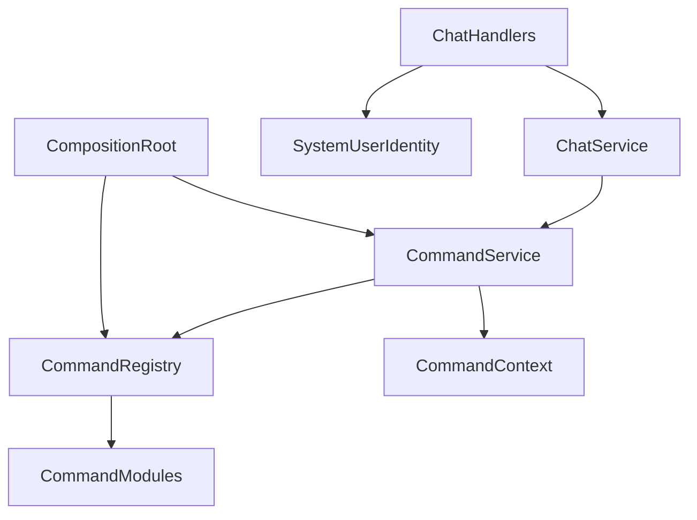
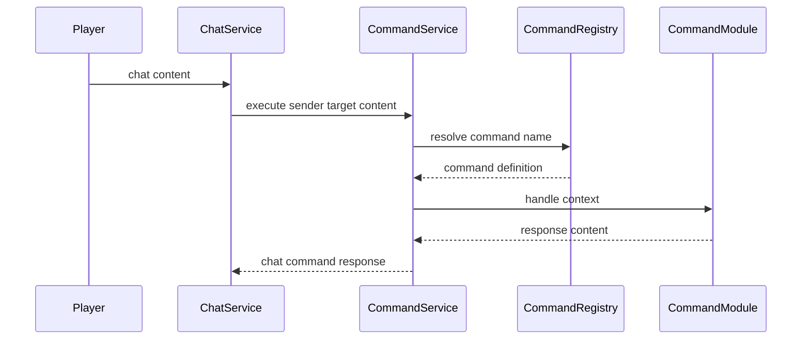

# Design Document

## Overview

BanchoBot command registry は、BanchoBot の command execution を `services.bancho_bot` namespace に集約し、core execution flow と individual command behavior を分離する。プレイヤーから見える `!roll`、`!help`、unknown command、channel / PM response target の挙動は維持する。

この feature の主な利用者は athena 開発者と stable client player である。開発者は decorator registration によって command を追加し、player は従来と同じ command behavior を受け取る。

### Goals

- `CommandService` から individual command implementation を分離する。
- decorator による typed command registration contract を提供する。
- help output と registered player-visible command metadata の整合性を維持する。
- chat pipeline、packet serialization、session authorization を変更せずに統合する。

### Non-Goals

- 新しい player-visible command の追加。
- admin command、permission-gated command、aliases の導入。
- BanchoBot online presence の変更。
- chat delivery、channel membership、session authorization、bancho packet format の変更。
- external command framework や plugin auto-discovery の導入。

## Boundary Commitments

### This Spec Owns

- BanchoBot command invocation の parsing、resolution、execution、response generation contract。
- `!roll`、`!help`、unknown command、non-command message の既存挙動維持。
- `CommandContext`、`CommandDefinition`、`CommandRegistry`、`@command` decorator の typed contract。
- builtin command registration order と help-visible metadata。

### Out of Boundary

- Chat authorization、rate limiting、silence check、channel delivery target selection。
- Private message target lookup と online delivery semantics。
- Bancho packet build、packet queue、transport handler registration。
- BanchoBot identity value の変更。
- DB、Valkey、EventBus、JobQueue、migration。

### Allowed Dependencies

- `services.bancho_bot` may import from `domain` and Python standard library.
- `ChatService` may depend on `services.bancho_bot.CommandService` through constructor injection.
- Bancho transport handlers may import `domain.system_user.BANCHO_BOT_IDENTITY` for system author identity.
- Composition roots may instantiate `CommandRegistry`, register builtin commands, and inject `CommandService`.

### Revalidation Triggers

- `CommandService.execute()` input or return contract changes.
- `CommandContext` required fields change.
- `CommandRegistry` registration order or visibility semantics change.
- `BANCHO_BOT_IDENTITY` value changes.
- ChatService command detection point moves relative to validation, routing, or PM delivery.

## Architecture

### Existing Architecture Analysis

- `src/osu_server/services/command_service.py` currently owns parsing, routing target selection, command storage, and `roll` / `help` implementation.
- `ChatService.send_channel_message()` performs command detection after channel routing and returns `ChatCommandResponse` in `ChannelMessageResult`.
- `ChatService.send_private_message()` performs command detection before PM target delivery and returns `ChatCommandResponse` in `PrivateMessageResult`.
- Bancho transport handlers build BanchoBot packets from command responses and currently read identity constants from `CommandService`.
- `src/osu_server/domain/system_user.py` already provides `BANCHO_BOT_IDENTITY`, which is the correct owner for system user identity.

### Architecture Pattern & Boundary Map



**Architecture Integration**:

- Selected pattern: typed registry with definition-returning decorator.
- Domain boundaries: `services.bancho_bot` owns command invocation only; chat services own chat validation and delivery; transports own packet serialization.
- Existing patterns preserved: constructor injection, dataclass value objects, standard-library-first implementation, service layer dependency direction.
- New components rationale: registry separates command catalog from execution; context replaces primitive argument lists; command modules isolate individual behavior.
- Steering compliance: Python 3.14, `@dataclass(slots=True)`, basedpyright strict, no new dependency.

### Technology Stack

| Layer | Choice / Version | Role in Feature | Notes |
|-------|------------------|-----------------|-------|
| Backend / Services | Python 3.14 standard library | typed dataclasses, Callable, Awaitable, random | No new package |
| Domain | existing `domain.chat`, `domain.system_user` | `ChatCommandResponse`, `BANCHO_BOT_IDENTITY` reuse | No schema change |
| Testing | pytest + pytest-asyncio | async service and command behavior verification | Existing stack |

## File Structure Plan

### Directory Structure

```text
src/osu_server/services/
└── bancho_bot/
    ├── __init__.py              # public exports for BanchoBot command service
    ├── command_service.py       # command parsing, resolution, response target selection, execution
    ├── context.py               # CommandContext and CommandMetadata value objects
    ├── registry.py              # CommandDefinition, CommandRegistry, @command decorator
    └── commands/
        ├── __init__.py          # create_builtin_registry and builtin registration order
        ├── roll.py              # !roll command behavior
        └── help.py              # !help command behavior from metadata
```

### Modified Files

- `src/osu_server/services/command_service.py` - remove after imports migrate; no compatibility shim.
- `src/osu_server/services/chat_service.py` - import `CommandService` from `services.bancho_bot` and consume `ChatCommandResponse | None` directly.
- `src/osu_server/composition/service_registry.py` - create builtin registry and inject `CommandService`.
- `src/osu_server/composition/worker_runtime.py` - create builtin registry and inject worker-side `CommandService`.
- `src/osu_server/transports/bancho/handlers/chat.py` - use `BANCHO_BOT_IDENTITY` for packet author identity.
- `tests/unit/services/test_command_service.py` - move coverage to `tests/unit/services/bancho_bot/test_command_service.py` and add registry/context cases.
- `tests/unit/services/test_chat_service.py` - update imports and assert unchanged command response behavior.
- `tests/integration/test_chat_pipeline.py` - update identity imports and verify unchanged packet output.
- `tests/unit/test_di_integration.py` - update DI assertions for new import path.

## System Flows



Key decision: response target selection remains in `CommandService`, while packet author identity remains in Bancho transport through `BANCHO_BOT_IDENTITY`.

## Requirements Traceability

| Requirement | Summary | Components | Interfaces | Flows |
|-------------|---------|------------|------------|-------|
| 1.1 | `!roll` channel response | CommandService, roll command, ChatService | `execute`, `CommandContext` | command execution flow |
| 1.2 | `!roll` PM response | CommandService, roll command, ChatService | `execute`, `ChatCommandResponse` | command execution flow |
| 1.3 | `!help` response | help command, CommandRegistry | `visible_commands` | command execution flow |
| 1.4 | unknown command response | CommandService | `execute` | command execution flow |
| 1.5 | non-command message ignored | CommandService | `execute` | command execution flow |
| 2.1 | case-insensitive resolution | CommandService, CommandRegistry | `resolve` | command execution flow |
| 2.2 | argument order preservation | CommandService, CommandContext | `args` | command execution flow |
| 2.3 | prefix-only ignored | CommandService | `execute` | command execution flow |
| 2.4 | no-response command ignored | CommandService | `execute` | command execution flow |
| 3.1 | standard registration | CommandRegistry, `@command` | `register`, `command` | composition flow |
| 3.2 | invocation context | CommandContext | dataclass fields | command execution flow |
| 3.3 | independent command behavior | command modules | `CommandDefinition.handler` | command execution flow |
| 4.1 | help lists visible commands | help command, CommandRegistry | `visible_commands` | command execution flow |
| 4.2 | added command reflected in help | CommandRegistry, help command | metadata listing | composition flow |
| 4.3 | metadata includes command name | CommandMetadata | dataclass fields | command execution flow |
| 5.1 | no new player-visible command | builtin commands init | registration order | composition flow |
| 5.2 | adjacent chat behavior unchanged | ChatService, handlers | existing chat contracts | existing chat flow |
| 5.3 | identity and target semantics | CommandService, handlers, system user identity | `ChatCommandResponse`, `BANCHO_BOT_IDENTITY` | command execution flow |

## Components and Interfaces

| Component | Domain/Layer | Intent | Req Coverage | Key Dependencies | Contracts |
|-----------|--------------|--------|--------------|------------------|-----------|
| CommandService | Services | Parse command content and execute resolved command | 1.1-1.5, 2.1-2.4, 5.3 | CommandRegistry P0, ChatCommandResponse P0 | Service |
| CommandRegistry | Services | Store and resolve typed command definitions | 3.1, 4.1-4.3 | CommandDefinition P0 | Service |
| CommandContext | Services | Immutable invocation context for handlers | 2.2, 3.2 | CommandMetadata P1 | State |
| CommandDefinition | Services | Typed command metadata and handler binding | 3.1, 3.3, 4.3 | CommandHandler P0 | State |
| Builtin commands | Services | Implement `roll` and `help` behavior | 1.1-1.4, 4.1-4.3, 5.1 | CommandContext P0 | Service |
| ChatService integration | Services | Keep existing command response integration point | 1.1, 1.2, 5.2, 5.3 | CommandService P0 | Service |
| Bancho handler identity integration | Transports | Serialize command responses as BanchoBot messages | 5.2, 5.3 | BANCHO_BOT_IDENTITY P0 | Service |

### Services

#### CommandService

| Field | Detail |
|-------|--------|
| Intent | Convert chat content into an optional BanchoBot chat response |
| Requirements | 1.1-1.5, 2.1-2.4, 5.3 |

**Responsibilities & Constraints**

- Detect command prefix and ignore non-command content.
- Parse command name and arguments without changing existing whitespace behavior.
- Resolve command names case-insensitively through `CommandRegistry`.
- Select response target: channel target remains channel, non-channel target becomes sender username.
- Return `ChatCommandResponse | None` and never enqueue packets directly.
- Do not own BanchoBot author identity.

**Dependencies**

- Inbound: `ChatService` - invokes command execution after chat validation (P0).
- Outbound: `CommandRegistry` - resolves command definitions and visible metadata (P0).
- Outbound: `domain.chat.ChatCommandResponse` - response value returned to chat pipeline (P0).

**Contracts**: Service [x] / API [ ] / Event [ ] / Batch [ ] / State [ ]

##### Service Interface

```python
class CommandService:
    def __init__(self, registry: CommandRegistry) -> None: ...

    async def execute(
        self,
        sender_id: int,
        sender_name: str,
        target: str,
        content: str,
    ) -> ChatCommandResponse | None: ...
```

- Preconditions: `content` is already validated by `ChatService`.
- Postconditions: non-command, empty command name, unresolved no-response, or handler no-response returns `None`.
- Invariants: command resolution is case-insensitive; arguments preserve order; response target semantics match existing behavior.

#### CommandRegistry

| Field | Detail |
|-------|--------|
| Intent | Register, resolve, and expose command metadata in deterministic order |
| Requirements | 2.1, 3.1, 4.1-4.3, 5.1 |

**Responsibilities & Constraints**

- Store `CommandDefinition` instances by canonical lower-case name.
- Preserve insertion order for help output.
- Reject duplicate command names during registration.
- Expose visible command metadata for help generation.
- Avoid global mutable registry state.

**Dependencies**

- Inbound: composition roots and tests - create and populate registries (P0).
- Outbound: `CommandDefinition` - typed command contract (P0).

**Contracts**: Service [x] / API [ ] / Event [ ] / Batch [ ] / State [x]

##### Service Interface

```python
CommandHandler = Callable[[CommandContext], Awaitable[str | None]]

@dataclass(slots=True, frozen=True)
class CommandDefinition:
    metadata: CommandMetadata
    handler: CommandHandler

class CommandRegistry:
    def register(self, definition: CommandDefinition) -> None: ...
    def resolve(self, name: str) -> CommandDefinition | None: ...
    def visible_commands(self) -> tuple[CommandMetadata, ...]: ...

def command(
    name: str,
    *,
    description: str,
    visible: bool = True,
) -> Callable[[CommandHandler], CommandDefinition]: ...
```

- Preconditions: command names are non-empty and do not include command prefix.
- Postconditions: `resolve()` accepts mixed-case names and returns canonical definition.
- Invariants: `visible_commands()` excludes hidden commands and preserves registration order.

#### CommandContext and CommandMetadata

| Field | Detail |
|-------|--------|
| Intent | Provide immutable typed input to command handlers |
| Requirements | 2.2, 3.2, 4.3 |

**Responsibilities & Constraints**

- Capture sender identity, original target, canonical command name, ordered arguments, and visible command metadata snapshot.
- Keep fields immutable to prevent command handlers from mutating shared registry state.
- Do not include chat delivery collaborators or session objects.

**Contracts**: Service [ ] / API [ ] / Event [ ] / Batch [ ] / State [x]

##### State Model

```python
@dataclass(slots=True, frozen=True)
class CommandMetadata:
    name: str
    description: str
    visible: bool = True

@dataclass(slots=True, frozen=True)
class CommandContext:
    sender_id: int
    sender_name: str
    target: str
    command_name: str
    args: tuple[str, ...]
    available_commands: tuple[CommandMetadata, ...]
```

### Builtin Command Modules

#### `roll` command

| Field | Detail |
|-------|--------|
| Intent | Generate the existing roll response text |
| Requirements | 1.1, 1.2, 2.2, 3.3 |

**Responsibilities & Constraints**

- Preserve current default max value, numeric first argument handling, lower bound behavior, and response format.
- Use `CommandContext.sender_name` and `CommandContext.args` only.
- Register as player-visible `roll`.

#### `help` command

| Field | Detail |
|-------|--------|
| Intent | Generate help output from visible command metadata |
| Requirements | 1.3, 4.1-4.3 |

**Responsibilities & Constraints**

- Generate `Available commands: !roll, !help` for the current builtin set.
- Read command names from `CommandContext.available_commands`.
- Register as player-visible `help`.

### Integration Components

#### ChatService integration

| Field | Detail |
|-------|--------|
| Intent | Continue invoking command execution at the existing chat pipeline point |
| Requirements | 1.1, 1.2, 5.2, 5.3 |

**Responsibilities & Constraints**

- Keep channel command detection after validation, rate limit, and channel routing.
- Keep PM command detection after validation and before PM target delivery.
- Pass `ChatCommandResponse | None` through existing result objects.
- Do not change chat persistence events.

#### Bancho handler identity integration

| Field | Detail |
|-------|--------|
| Intent | Serialize command responses using the stable BanchoBot identity |
| Requirements | 5.2, 5.3 |

**Responsibilities & Constraints**

- Use `BANCHO_BOT_IDENTITY.username` and `BANCHO_BOT_IDENTITY.user_id` when building `send_message` packets.
- Do not depend on `CommandService` for identity constants.
- Preserve current enqueue behavior for channel and PM command responses.

## Data Models

### Domain Model

- `CommandMetadata`: immutable metadata for player-visible command discovery.
- `CommandContext`: immutable invocation context for a single command execution.
- `CommandDefinition`: immutable binding between metadata and async handler.
- `ChatCommandResponse`: existing chat domain value object reused as command execution output.
- `BANCHO_BOT_IDENTITY`: existing system user identity reused for transport author identity.

### Logical Data Model

- No persisted data is introduced.
- Registry state exists only in process memory and is created by composition roots.
- Builtin command order is deterministic and defined by `create_builtin_registry()`.

## Error Handling

### Error Strategy

- Non-command content returns `None`.
- Prefix-only or empty command name returns `None`.
- Unknown command returns the existing user-facing message: `Unknown command. Type !help for available commands.`
- Handler returning `None` causes no command response.
- Duplicate command registration raises at startup or test setup and is not converted to a player-visible response.

### Monitoring

No new monitoring surface is introduced. Existing chat service logging and test coverage remain the verification mechanism for this feature.

## Testing Strategy

### Unit Tests

- `CommandRegistry` registers definitions, resolves mixed-case names, preserves visible command order, and rejects duplicate names.
- `CommandService.execute()` returns `None` for non-command content, prefix-only content, and handler no-response.
- `CommandService.execute()` preserves argument order in `CommandContext.args`.
- `roll` command preserves default max, custom numeric max, lower bound, and response format.
- `help` command reads visible command metadata and returns the existing help string.

### Integration Tests

- `ChatService.send_channel_message()` still returns original message delivery plus BanchoBot command response for `!roll`.
- `ChatService.send_private_message()` still targets the sender username for BanchoBot PM responses.
- Bancho chat handlers still enqueue command response packets using `BANCHO_BOT_IDENTITY` values.
- DI registration resolves the new `services.bancho_bot.CommandService` singleton.

### E2E Tests

- Existing bancho chat pipeline tests verify that `!roll 100` yields the same packet stream and BanchoBot identity as before.
- No Playwright verification is required because this is backend-only bancho protocol behavior.

## Migration Strategy

- Move command service implementation into `src/osu_server/services/bancho_bot/`.
- Update source and test imports from `osu_server.services.command_service` to `osu_server.services.bancho_bot`.
- Replace transport identity reads from `CommandService` with `BANCHO_BOT_IDENTITY`.
- Delete `src/osu_server/services/command_service.py` after all imports are migrated.
- Run focused command, chat service, chat pipeline, DI, ruff, and basedpyright checks.
