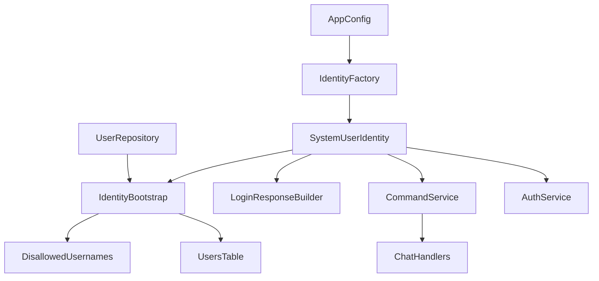
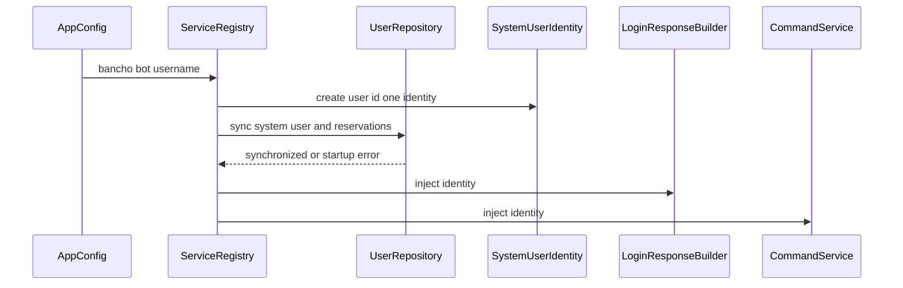

# Design Document

## Overview

この機能は、サーバー管理者が BanchoBot の表示名を AppConfig で設定できるようにします。`user_id=1` は bancho protocol の予約 ID として固定し、表示名だけを起動時設定から決定します。

既存の `users.id=1` は通常ユーザーではなく BanchoBot system user record として維持します。起動時に runtime identity、DB record、予約名を同期し、login response、command response、chat packet generation が同じ identity を参照する設計にします。

### Goals

- BanchoBot 表示名を起動時 AppConfig から決定する。
- `user_id=1` を固定し、通常ユーザーへの割り当てを防ぐ。
- `users.id=1` を BanchoBot system user record として同期する。
- `BanchoBot` と設定済み Bot 名を通常ユーザー登録から保護する。
- BanchoBot 表示箇所を injected identity に統一する。

### Non-Goals

- BanchoBot の `user_id` 設定。
- email、password_hash、country など表示名以外の設定化。
- 実行中の設定変更検知。
- 過去に使った Bot 名の履歴予約。
- 内部ログイベント名やコード上の概念名の変更。

## Boundary Commitments

### This Spec Owns

- `AppConfig` における BanchoBot 表示名設定と境界バリデーション。
- `SystemUserIdentity` を起動時に構築し、BanchoBot 表示の single runtime source として注入する構造。
- `users.id=1` の BanchoBot system user record 同期。
- `BanchoBot` と現在設定中の Bot 名の予約。
- AuthService による `user_id=1` の通常ログイン対象外化。
- LoginResponseBuilder、CommandService、ChatHandlers の BanchoBot identity 参照統一。

### Out of Boundary

- 新しい system user 種別テーブルやユーザー種別 schema の導入。
- BanchoBot 以外の system user 管理。
- message history の発言時点表示名 snapshot。
- WebUI や API 表示仕様。
- BanchoBot コマンド体系の変更。

### Allowed Dependencies

- `AppConfig` は pydantic-settings の既存設定境界を使う。
- Application composition は `service_registry.register_services()` で行う。
- 永続化は `UserRepository` Protocol を通して行い、サービス層は SQLAlchemy model を直接扱わない。
- 通常ユーザー名の正規化は `User.normalize_username()` を使う。
- `disallowed_usernames` は既存の予約名保存先として使う。

### Revalidation Triggers

- `User.normalize_username()` の仕様変更。
- `users` / `disallowed_usernames` schema 変更。
- `CommandService` または `ChatHandlers` の command response packet 契約変更。
- `LoginResponseBuilder` の roster / presence packet 構成変更。
- `AuthService.login()` の認証フロー変更。

## Architecture

### Existing Architecture Analysis

- `BANCHO_BOT_IDENTITY` は現在 `domain/system_user.py` の module constant です。
- `LoginResponseBuilder` は BanchoBot の presence と roster bundle を hardcoded identity から構築します。
- `CommandService` は class variable に BanchoBot ID と名前をコピーし、`ChatHandlers` が command response packet 作成時に参照します。
- `users.id=1` は初期 migration で seed されていますが、domain コメント上は BanchoBot は通常 session lifecycle を持たない system user です。
- `UserRepository` は disallowed username 管理を既に持ち、SQLAlchemy / InMemory の dual implementation pattern が確立済みです。

### Architecture Pattern & Boundary Map



**Architecture Integration**:
- Selected pattern: 起動時構築された immutable identity の DI 注入。
- Domain/feature boundaries: 表示名決定は config boundary、永続化整合性は repository boundary、packet 表示は transport/service consumers が担当します。
- Existing patterns preserved: AppConfig、Repository Protocol、SQLAlchemy/InMemory dual implementation、composition root wiring。
- New components rationale: `SystemUserIdentity` は既存型を維持し、bootstrap 処理は repository contract に閉じます。
- Steering compliance: SQLAlchemy model は services/transports へ漏らさず、AppConfig と Repository pattern を維持します。

### Technology Stack

| Layer | Choice / Version | Role in Feature | Notes |
|-------|------------------|-----------------|-------|
| Backend / Config | pydantic-settings via `AppConfig` | BanchoBot 表示名の起動時読み込みと形式バリデーション | 新規依存なし |
| Backend / Domain | Python `@dataclass(slots=True, frozen=True)` | `SystemUserIdentity` の immutable runtime identity | 既存パターン維持 |
| Data / Storage | SQLAlchemy 2.0 async + repository | `users.id=1` と `disallowed_usernames` の同期 | model 直接参照は repository 内に限定 |
| Infrastructure / Runtime | existing DI container | identity と services の singleton wiring | `register_services()` で初期化 |

## File Structure Plan

### Directory Structure

```text
src/osu_server/
├── config.py                                  # BanchoBot 表示名設定と形式バリデーション
├── domain/
│   └── system_user.py                        # SystemUserIdentity と BanchoBot ID/default name constants
├── repositories/
│   ├── interfaces/user_repository.py         # system user 同期 contract を追加
│   ├── memory/user_repository.py             # test 用 system user 同期実装
│   └── sqlalchemy/user_repository.py         # DB-backed system user 同期実装
├── composition/
│   └── service_registry.py                   # identity 構築、repository 同期、service 注入
├── services/
│   ├── auth_service.py                       # user_id=1 通常ログイン拒否
│   └── command_service.py                    # injected identity による Bot response identity
└── transports/bancho/
    ├── handlers/chat.py                      # command response packet の sender identity 参照更新
    └── workflows/login_response_builder.py   # login response の BanchoBot presence 参照更新

tests/
├── factories/config.py                       # config factory に bancho_bot_username 追加
├── unit/domain/test_system_user.py           # default identity constants と validation expectations
├── unit/infrastructure/test_config.py        # AppConfig validation tests
├── unit/repositories/test_user_repository.py # SQLAlchemy/InMemory contract coverage
├── unit/services/test_auth_service.py        # system user login rejection
├── unit/services/test_command_service.py     # injected identity coverage
├── unit/transports/bancho/test_login_response_builder.py # configured Bot presence coverage
└── integration/test_chat_e2e.py              # command response sender name consistency
```

### Modified Files

- `src/osu_server/config.py` — `bancho_bot_username` field and format validation.
- `src/osu_server/domain/system_user.py` — fixed BanchoBot ID/default name constants and identity factory helper.
- `src/osu_server/repositories/interfaces/user_repository.py` — `sync_system_user()` style contract for `user_id=1` synchronization.
- `src/osu_server/repositories/memory/user_repository.py` — in-memory sync and reserved ID behavior.
- `src/osu_server/repositories/sqlalchemy/user_repository.py` — transactional sync of `users.id=1` and disallowed names.
- `src/osu_server/composition/service_registry.py` — initialize identity before dependent services.
- `src/osu_server/services/auth_service.py` — reject `user_id=1` before normal password/session flow.
- `src/osu_server/services/command_service.py` — remove class-level copied username; use injected identity.
- `src/osu_server/transports/bancho/workflows/login_response_builder.py` — inject identity and use it for presence/roster.
- `src/osu_server/transports/bancho/handlers/chat.py` — use CommandService-provided identity for command response packets.
- `tests/factories/config.py` — preserve typed config factory compatibility.

## System Flows



起動時同期に失敗した場合、dependent services は登録されず、誤った Bot 表示名で稼働しません。

## Requirements Traceability

| Requirement | Summary | Components | Interfaces | Flows |
|-------------|---------|------------|------------|-------|
| 1.1 | 未設定時 default name | AppConfig, SystemUserIdentity | Config field default | startup flow |
| 1.2 | 全ユーザー可視箇所で設定名使用 | LoginResponseBuilder, CommandService, ChatHandlers | injected identity | startup flow |
| 1.3 | 起動中は起動時 identity 維持 | ServiceRegistry, SystemUserIdentity | singleton identity | startup flow |
| 1.4 | user_id=1 固定 | SystemUserIdentity | fixed constant | startup flow |
| 1.5 | user_id は設定対象外 | AppConfig, SystemUserIdentity | no config field for ID | none |
| 2.1 | 2〜15文字を有効 | AppConfig | config validation | startup flow |
| 2.2 | 長さ不正で起動失敗 | AppConfig | validation error | startup flow |
| 2.3 | 許可文字を有効 | AppConfig | config validation | startup flow |
| 2.4 | 不許可文字で起動失敗 | AppConfig | validation error | startup flow |
| 2.5 | 既存通常ユーザー衝突で起動失敗 | UserRepository sync | sync contract error | startup flow |
| 2.6 | 不正名の fallback 禁止 | AppConfig, ServiceRegistry | validation before service registration | startup flow |
| 3.1 | `BanchoBot` を予約 | UserRepository sync | disallowed username write | startup flow |
| 3.2 | 設定名を予約 | UserRepository sync | disallowed username write | startup flow |
| 3.3 | 予約名登録拒否 | AuthService, UserRepository | existing disallowed check | registration flow |
| 3.4 | safe_username 正規化 | User, UserRepository sync | `User.normalize_username()` | startup flow |
| 3.5 | 過去名は自動予約しない | UserRepository sync | current identity only | startup flow |
| 4.1 | `users.id=1` system record | UserRepository sync | sync contract | startup flow |
| 4.2 | 通常ユーザー衝突で起動失敗 | UserRepository sync | sync contract error | startup flow |
| 4.3 | 未作成なら利用可能化 | UserRepository sync | create fixed ID | startup flow |
| 4.4 | username/safe_username 同期 | UserRepository sync | update fixed ID | startup flow |
| 4.5 | 通常作成で ID 1 を割り当てない | UserRepository create | sequence/next id rule | registration flow |
| 4.6 | system record を login/session 対象外 | AuthService | login guard | login flow |
| 4.7 | 設定対象は表示名のみ | AppConfig | single config field | none |
| 5.1 | login response で設定名 | LoginResponseBuilder | injected identity | login flow |
| 5.2 | PM sender 名で設定名 | CommandService, ChatHandlers | injected identity | command flow |
| 5.3 | command response で設定名 | CommandService, ChatHandlers | injected identity | command flow |
| 5.4 | 履歴表示は現在名追従可能 | UserRepository sync, users table | `users.id=1` current username | startup flow |
| 5.5 | 内部概念名変更を要求しない | All components | no event rename contract | none |

## Components and Interfaces

| Component | Domain/Layer | Intent | Req Coverage | Key Dependencies | Contracts |
|-----------|--------------|--------|--------------|------------------|-----------|
| AppConfig BanchoBot Field | Config | 表示名の設定境界 | 1.1, 1.5, 2.1, 2.2, 2.3, 2.4, 2.6, 4.7 | pydantic-settings P0 | State |
| SystemUserIdentity | Domain | immutable Bot identity | 1.2, 1.3, 1.4, 3.4, 5.1, 5.2, 5.3 | User.normalize_username P1 | State |
| UserRepository System User Sync | Repository | `users.id=1` と予約名を同期 | 2.5, 3.1, 3.2, 3.5, 4.1, 4.2, 4.3, 4.4, 4.5, 5.4 | SQLAlchemy/InMemory P0 | Service |
| AuthService System User Guard | Service | system user の通常ログイン拒否 | 4.6 | UserRepository P0, SystemUserIdentity P1 | Service |
| Bancho Identity Consumers | Service/Transport | Bot 表示名を packet に反映 | 1.2, 5.1, 5.2, 5.3, 5.5 | SystemUserIdentity P0 | Service |
| ServiceRegistry Bootstrap | Composition | 初期化順序と singleton injection | 1.3, 2.6, 4.1 | AppConfig P0, UserRepository P0 | Batch |

### Config

#### AppConfig BanchoBot Field

| Field | Detail |
|-------|--------|
| Intent | 起動時に BanchoBot 表示名を読み込み、不正値を境界で拒否する |
| Requirements | 1.1, 1.5, 2.1, 2.2, 2.3, 2.4, 2.6, 4.7 |

**Responsibilities & Constraints**
- `bancho_bot_username: str = "BanchoBot"` を提供する。
- 2〜15文字、英数字・スペース・アンダースコア・ハイフンのみを許可する。
- `user_id` や表示名以外の system user 属性は設定項目にしない。

**Dependencies**
- External: pydantic-settings — environment variable loading (P0)
- Outbound: `SystemUserIdentity` construction — validated username input (P1)

**Contracts**: Service [ ] / API [ ] / Event [ ] / Batch [ ] / State [x]

##### State Management
- State model: 起動時に読み込まれる immutable config value。
- Persistence & consistency: process lifetime 中は変更しない。
- Concurrency strategy: runtime mutation なし。

### Domain

#### SystemUserIdentity

| Field | Detail |
|-------|--------|
| Intent | BanchoBot の fixed ID と runtime display name を表す immutable value |
| Requirements | 1.2, 1.3, 1.4, 3.4, 5.1, 5.2, 5.3 |

**Responsibilities & Constraints**
- `user_id=1` を固定する。
- `username` は AppConfig 由来の検証済み表示名を持つ。
- domain layer は AppConfig や repository を import しない。

**Dependencies**
- Inbound: ServiceRegistry — identity construction (P0)
- Outbound: none (P0)

**Contracts**: Service [ ] / API [ ] / Event [ ] / Batch [ ] / State [x]

##### State Management
- State model: `SystemUserIdentity(user_id: int, username: str)`。
- Persistence & consistency: DB 同期は repository component が担当する。
- Concurrency strategy: frozen dataclass による immutable object。

### Repository

#### UserRepository System User Sync

| Field | Detail |
|-------|--------|
| Intent | BanchoBot system user record と reserved usernames を atomic に整合させる |
| Requirements | 2.5, 3.1, 3.2, 3.5, 4.1, 4.2, 4.3, 4.4, 4.5, 5.4 |

**Responsibilities & Constraints**
- `users.id=1` が存在しない場合、BanchoBot system user record として作成する。
- `users.id=1` が存在する場合、system user として扱える内部属性を保ちつつ `username` / `safe_username` を設定名へ同期する。
- 設定名の safe username が `users.id != 1` に存在する場合は失敗する。
- `banchobot` と configured safe username を `disallowed_usernames` に idempotent に追加する。
- 通常 `create()` が `id=1` を返さないようにする。

**Dependencies**
- Inbound: ServiceRegistry Bootstrap — startup sync call (P0)
- Outbound: SQLAlchemy session or in-memory state — persistence (P0)
- Outbound: User.normalize_username — safe username derivation (P1)

**Contracts**: Service [x] / API [ ] / Event [ ] / Batch [ ] / State [ ]

##### Service Interface

```python
class UserRepository(Protocol):
    async def sync_system_user(self, identity: SystemUserIdentity) -> None: ...
```

- Preconditions:
  - `identity.user_id == 1`。
  - `identity.username` は AppConfig validation 済み。
- Postconditions:
  - `users.id=1` が BanchoBot system user record として存在する。
  - `users.id=1.username` と `safe_username` が identity に一致する。
  - `banchobot` と configured safe username が予約済み。
- Invariants:
  - `users.id != 1` に configured safe username が存在してはならない。
  - 過去の configured safe username は自動追加しない。

**Implementation Notes**
- Integration: SQLAlchemy 実装は 1 transaction で conflict check、system record upsert、reservation insert を行う。
- Validation: InMemory 実装も同じ conflict behavior を持つ。
- Risks: 既存 DB に通常ユーザーとして `id=1` がある場合の判定基準は、password/email ではなく safe username conflict と system record invariants で検出する。

### Service

#### AuthService System User Guard

| Field | Detail |
|-------|--------|
| Intent | BanchoBot system user record を通常ログインフローから除外する |
| Requirements | 4.6 |

**Responsibilities & Constraints**
- `get_by_safe_username()` が `user_id=1` を返した場合、password verification と session creation に進まない。
- 失敗結果は通常の認証失敗と同じ扱いにし、system user の存在を特別に露出しない。

**Dependencies**
- Inbound: LoginWorkflow — login request processing (P0)
- Outbound: UserRepository — user lookup (P0)
- Outbound: SystemUserIdentity — reserved ID comparison (P1)

**Contracts**: Service [x] / API [ ] / Event [ ] / Batch [ ] / State [ ]

##### Service Interface

既存 `AuthService.login()` contract を維持し、内部 guard を追加します。

- Preconditions: login_request is parsed.
- Postconditions: `user_id=1` では `SessionData` が作成されない。
- Invariants: system user login failure is indistinguishable from normal authentication failure.

#### Bancho Identity Consumers

| Field | Detail |
|-------|--------|
| Intent | BanchoBot 表示 packet を injected identity から生成する |
| Requirements | 1.2, 5.1, 5.2, 5.3, 5.5 |

**Responsibilities & Constraints**
- `LoginResponseBuilder` は constructor-injected identity を使って BanchoBot presence と roster ID を構築する。
- `CommandService` は constructor-injected identity を保持し、command response sender identity を提供する。
- `ChatHandlers` は `CommandService` の identity を使い、class-level copied username を参照しない。
- 内部ログイベント名や Python class 名は変更しない。

**Dependencies**
- Inbound: ServiceRegistry — consumer construction (P0)
- Outbound: SystemUserIdentity — Bot packet identity (P0)

**Contracts**: Service [x] / API [ ] / Event [ ] / Batch [ ] / State [ ]

##### Service Interface

```python
class CommandService:
    @property
    def bot_identity(self) -> SystemUserIdentity: ...
```

- Preconditions: `CommandService` is constructed with valid identity.
- Postconditions: command response packets use `bot_identity.username` and `bot_identity.user_id`.
- Invariants: packet sender ID remains `1` regardless of display name.

### Composition

#### ServiceRegistry Bootstrap

| Field | Detail |
|-------|--------|
| Intent | identity 構築、repository 同期、dependent service injection の順序を保証する |
| Requirements | 1.3, 2.6, 4.1 |

**Responsibilities & Constraints**
- Repository 登録後、dependent services 構築前に identity を作成して `sync_system_user()` を呼ぶ。
- sync が失敗した場合は service registration を中断する。
- identity を `AuthService`、`CommandService`、`LoginResponseBuilder` に渡す。

**Dependencies**
- Inbound: lifespan/composition root — service registration call (P0)
- Outbound: AppConfig — display name (P0)
- Outbound: UserRepository — startup sync (P0)

**Contracts**: Service [ ] / API [ ] / Event [ ] / Batch [x] / State [ ]

##### Batch / Job Contract
- Trigger: application service registration during startup.
- Input / validation: `AppConfig.bancho_bot_username` and `UserRepository` state.
- Output / destination: synchronized `users.id=1`, reserved usernames, constructed singleton services.
- Idempotency & recovery: repeated startup is idempotent when identity is unchanged; conflict raises startup error.

## Data Models

### Domain Model

- `SystemUserIdentity`
  - `user_id: int` fixed to `1` for BanchoBot.
  - `username: str` from validated AppConfig.
- Invariant: BanchoBot identity is immutable after startup.
- Invariant: BanchoBot is a system user, not a normal login/session user.

### Logical Data Model

- `users.id=1`
  - Represents BanchoBot system user record.
  - `username` and `safe_username` follow current AppConfig.
  - `email`, `password_hash`, `country` remain internal non-configurable attributes.
- `disallowed_usernames`
  - Contains `banchobot`.
  - Contains configured Bot safe username when different.
  - Does not automatically retain historical configured Bot names.

### Physical Data Model

No new table is introduced. Existing tables remain:

- `users`
  - `id` primary key.
  - `username String(15)`.
  - `safe_username String(15) unique`.
- `disallowed_usernames`
  - `safe_username String(15) unique`.

The implementation may update the existing initial migration comments or seed data if needed, but this design does not require a new schema object.

## Error Handling

### Error Strategy

- Config format errors fail during AppConfig construction.
- Existing normal-user conflict with configured Bot name fails during startup sync.
- `users.id=1` invariant violation fails during startup sync.
- System user login attempt returns normal authentication failure.

### Error Categories and Responses

- Configuration validation error: startup fails with validation details from AppConfig.
- Repository sync conflict: startup fails before bancho workflows are registered.
- Login attempt for system user: `LoginResult.AUTHENTICATION_FAILED`.

### Monitoring

- Existing startup and registration logs remain sufficient.
- Internal event names do not need renaming; where useful, logs can include configured username as a field during implementation.

## Testing Strategy

### Unit Tests

- `AppConfig` accepts default `BanchoBot` and custom valid names, and rejects invalid length/characters for 2.1〜2.6.
- `SystemUserIdentity` construction keeps `user_id=1` and configured username for 1.3〜1.5.
- `InMemoryUserRepository.sync_system_user()` creates/syncs `id=1`, reserves `banchobot` and configured safe username, rejects conflicts for 3.1〜4.4.
- `SQLAlchemyUserRepository.sync_system_user()` mirrors the in-memory contract for 2.5, 3.1〜3.5, 4.1〜4.5.
- `AuthService.login()` rejects `user_id=1` without session creation for 4.6.
- `CommandService` exposes configured Bot identity and command response packet creation uses it for 5.2〜5.3.
- `LoginResponseBuilder` emits configured BanchoBot username and fixed ID in presence/roster for 5.1.

### Integration Tests

- Full container registration with custom `bancho_bot_username` syncs repository state and resolves dependent services with the same identity.
- Registration flow rejects `BanchoBot`, configured Bot name, and normalized variants for 3.3〜3.4.
- Chat command response in bancho transport uses configured sender name and `sender_id=1` for 5.2〜5.3.

### E2E/UI Tests

- Not required. athena currently has no WebUI in this repository, and this feature is backend/bancho protocol only.

## Security Considerations

- Prevents Bot impersonation by reserving default and configured Bot names.
- Does not expose whether `user_id=1` exists through login error differences.
- Does not make BanchoBot credentials configurable.

## Migration Strategy

No schema migration is required. Existing databases already have `users` and `disallowed_usernames`. Runtime startup sync makes `users.id=1` and reservations converge to the configured state.

If an environment has a conflicting normal user, startup fails and requires operator remediation before service launch.
