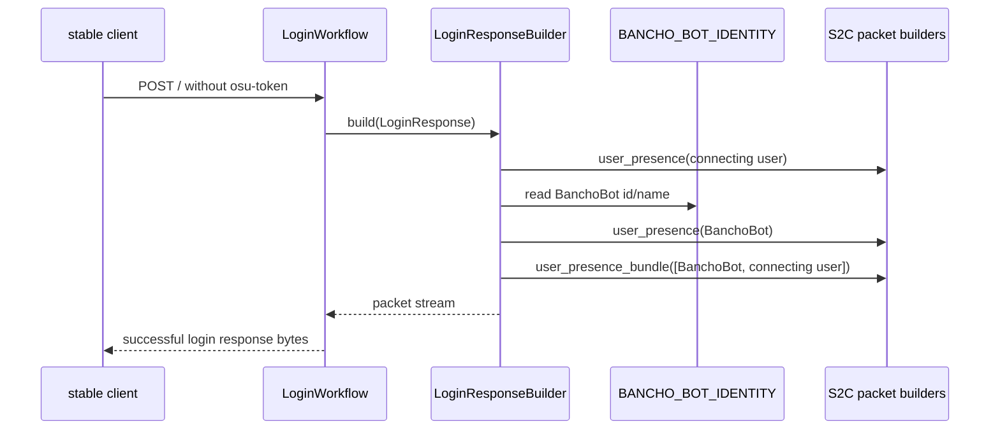
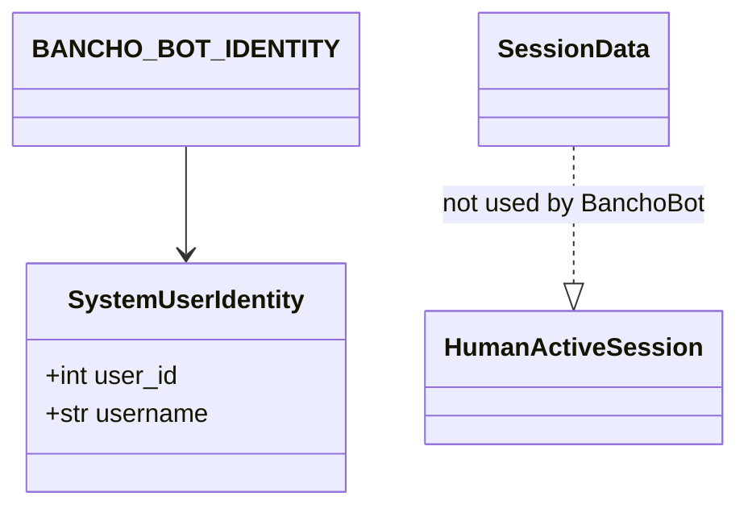

# Design Document

## Overview

この feature は、stable クライアント利用者とゲーム内 command 利用者に対して、BanchoBot を公式実装や Akatsuki と同じ常時 online の system user として見せる。現状の athena は command response を `user_id=1` / `BanchoBot` から送るが、成功ログイン時の initial presence / roster には BanchoBot を含めていないため、message sender と online user 表示が一致しない。

設計の中心は、BanchoBot を通常ユーザーの active session ではなく roster-visible system identity として扱うことです。`SessionStore` や packet delivery target には混ぜず、成功ログイン時の S2C packet stream に BanchoBot の `USER_PRESENCE` と `USER_PRESENCE_BUNDLE` entry を追加する。

### Goals

- 成功ログイン時に BanchoBot を initial online roster へ含める。
- BanchoBot の command response sender identity と roster identity を単一の source of truth に揃える。
- BanchoBot を active session、polling target、logout lifecycle target として扱わない。
- 既存 command response の channel / private message behavior を維持する。

### Non-Goals

- 新しい Bot command の追加。
- `!role` など admin command の実装。
- WebUI / API での system user 管理。
- BanchoBot の通常ログイン、polling、logout 実装。
- 複数 Bot / 外部 Bot API / AI 会話機能。
- DB schema や user seed / migration の変更。

## Boundary Commitments

### This Spec Owns

- BanchoBot を successful login response の roster-visible system user として公開する behavior。
- BanchoBot identity の domain-level contract。
- `LoginResponseBuilder` における BanchoBot `USER_PRESENCE` と duplicate-free `USER_PRESENCE_BUNDLE` construction。
- command response sender identity と roster identity の一致を固定する tests。

### Out of Boundary

- `SessionStore` の active session semantics 変更。
- BanchoBot 用 packet queue、polling endpoint、logout lifecycle。
- 通常ユーザーの presence-status 更新、play status broadcast、座標や rank の実データ化。
- Role / session authorization refresh。
- channel membership や message delivery policy の変更。

### Allowed Dependencies

- `osu_server.domain` の dataclass value object。
- `LoginResponseBuilder` と既存 S2C builders: `user_presence()`, `user_presence_bundle()`, `user_stats()`。
- `CommandService` の command response flow。
- `SessionStore` / `OnlineUsersService` は active human session source としてのみ依存可能。system user roster 生成のために semantics を変えない。
- 新しい外部 dependency は導入しない。

### Revalidation Triggers

- `CommandService` の BanchoBot ID / name contract を変更する場合。
- `LoginResponseBuilder` の packet order を変更する場合。
- `OnlineUsersService.get_all_user_ids()` を roster-visible users として再定義する場合。
- `presence-status` spec が initial presence bundle を全 online users 対応へ拡張する場合。
- BanchoBot を DB-backed user seed / migration として扱う方針へ変更する場合。

## Architecture

### Existing Architecture Analysis

- bancho successful login response は `LoginWorkflow` が authentication 結果を `LoginResponseBuilder.build()` に渡し、builder が S2C packet stream を組み立てる。
- `CommandService` は BanchoBot の command sender identity を定数として持ち、`ChatHandlers` が command response packet の sender に使っている。
- `OnlineUsersService.get_all_user_ids()` は `SessionStore` の active session user ID を返す。`LifecycleListeners` はこの list を `USER_QUIT` broadcast の配送対象に使う。
- したがって、BanchoBot を online roster に含める変更は `OnlineUsersService` ではなく login response roster construction に閉じる必要がある。

### Architecture Pattern & Boundary Map

```mermaid
flowchart LR
    AuthService[AuthService] --> LoginWorkflow[LoginWorkflow]
    LoginWorkflow --> LoginResponseBuilder[LoginResponseBuilder]
    LoginResponseBuilder --> SystemUserIdentity[SystemUserIdentity / BANCHO_BOT_IDENTITY]
    LoginResponseBuilder --> S2CLoginBuilders[S2C login packet builders]
    CommandService[CommandService] --> SystemUserIdentity
    ChatHandlers[ChatHandlers] --> CommandService
    SessionStore[SessionStore active sessions] --> OnlineUsersService[OnlineUsersService]
    OnlineUsersService --> LifecycleListeners[USER_QUIT fan-out]

    SystemUserIdentity -. roster visible only .-> LoginResponseBuilder
    SystemUserIdentity -. not a session .x SessionStore
    SystemUserIdentity -. not a delivery target .x OnlineUsersService
```

**Architecture Integration**:
- Selected pattern: domain value object + login response composition。
- Domain/feature boundaries: system roster identity と active session delivery target を分離する。
- Existing patterns preserved: dataclass domain model、transport-level S2C builder、service-level command processing、strict typing。
- New components rationale: BanchoBot identity の重複定義を避けるため domain-level identity contract を追加する。
- Steering compliance: Python dataclass、外部 dependency なし、TDD、services/transports から DB 直接参照なし。

### Technology Stack

| Layer | Choice / Version | Role in Feature | Notes |
|-------|------------------|-----------------|-------|
| Frontend / CLI | stable bancho client | `USER_PRESENCE` / `USER_PRESENCE_BUNDLE` の受信者 | UI 実装は対象外 |
| Backend / Services | Python 3.14+ / async services | command response identity の共有 | `.kiro/steering/tech.md` に準拠 |
| Domain | `@dataclass(slots=True, frozen=True)` | `SystemUserIdentity` value object | Pydantic 不使用 |
| Protocol | Caterpillar-backed S2C builders | BanchoBot presence packet construction | 既存 builder を再利用 |
| Data / Storage | なし | 新規永続化なし | `SessionStore` へ Bot を保存しない |

## File Structure Plan

### Directory Structure

```text
src/osu_server/
├── domain/
│   └── system_user.py                    # System user identity value object and BanchoBot singleton
├── services/
│   └── command_service.py                # BanchoBot command sender identity を domain identity へ接続
└── transports/bancho/workflows/
    └── login_response_builder.py         # BanchoBot presence and roster bundle construction

tests/
├── unit/domain/
│   └── test_system_user.py               # BanchoBot identity contract
├── unit/services/
│   └── test_command_service.py           # command response sender identity の維持
├── unit/transports/bancho/
│   └── test_login_response_builder.py    # packet order, presence, bundle content
└── unit/transports/bancho/listeners/
    └── test_lifecycle.py                 # BanchoBot が USER_QUIT fan-out target にならないこと
```

### Modified Files

- `src/osu_server/domain/system_user.py` — 新規。`SystemUserIdentity` と `BANCHO_BOT_IDENTITY` を定義する。
- `src/osu_server/services/command_service.py` — BanchoBot sender constants を domain identity 参照へ揃える。
- `src/osu_server/transports/bancho/workflows/login_response_builder.py` — BanchoBot `USER_PRESENCE` を追加し、bundle に BanchoBot ID と接続ユーザー ID を重複なしで含める。
- `tests/unit/transports/bancho/test_login_response_builder.py` — packet order、BanchoBot presence、bundle content の expectation を更新する。
- `tests/unit/services/test_command_service.py` — command response sender が `BANCHO_BOT_IDENTITY` と一致することを追加検証する。
- `tests/unit/services/test_online_users.py` — `OnlineUsersService` が active session user IDs のみ返す contract を維持するテストを明確化する。

## System Flows

### Successful Login Initial Presence



BanchoBot の `USER_PRESENCE` は `USER_PRESENCE_BUNDLE` より前に送信する。これにより、client が bundle や後続 command response を処理する前に BanchoBot の display name と user ID を知る。

### Active Session Lifecycle Separation

```mermaid
flowchart TD
    HumanLogin[Human user login] --> SessionStore[SessionStore active session]
    SessionStore --> OnlineUsers[OnlineUsersService active IDs]
    OnlineUsers --> QuitFanout[USER_QUIT fan-out targets]

    BanchoBot[BanchoBot system identity] --> LoginRoster[LoginResponseBuilder roster packets]
    BanchoBot -. no login .x SessionStore
    BanchoBot -. no packet queue .x QuitFanout
```

BanchoBot は roster-visible だが active session ではない。通常ユーザーの disconnect で BanchoBot の quit packet は発生せず、BanchoBot へ packet enqueue もしない。

## Requirements Traceability

| Requirement | Summary | Components | Interfaces | Flows |
|-------------|---------|------------|------------|-------|
| 1.1 | ログイン成功時に BanchoBot を initial roster へ含める | `LoginResponseBuilder`, `BANCHO_BOT_IDENTITY` | `user_presence_bundle()` | Successful Login Initial Presence |
| 1.2 | BanchoBot message 表示前に presence を提供する | `LoginResponseBuilder` | `user_presence()` | Successful Login Initial Presence |
| 1.3 | ユーザー online 中に BanchoBot を system user として見せる | `LoginResponseBuilder`, `SystemUserIdentity` | login response roster contract | Successful Login Initial Presence |
| 1.4 | 他 human user がいなくても BanchoBot を roster に含める | `LoginResponseBuilder` | duplicate-free bundle construction | Successful Login Initial Presence |
| 2.1 | roster の BanchoBot user ID と command sender ID を一致させる | `SystemUserIdentity`, `CommandService` | `BANCHO_BOT_IDENTITY.user_id` | Successful Login Initial Presence |
| 2.2 | roster の BanchoBot display name と command sender name を一致させる | `SystemUserIdentity`, `CommandService` | `BANCHO_BOT_IDENTITY.username` | Successful Login Initial Presence |
| 2.3 | message sender identity を client が知る BanchoBot identity に一致させる | `ChatHandlers`, `CommandService`, `SystemUserIdentity` | `send_message()` sender fields | Successful Login Initial Presence |
| 2.4 | roster 内で BanchoBot を一度だけ公開する | `LoginResponseBuilder` | duplicate-free bundle helper | Successful Login Initial Presence |
| 3.1 | 他 user が online の場合も BanchoBot と user を roster に共存させる | `LoginResponseBuilder`, future presence-status integration seam | bundle construction | Successful Login Initial Presence |
| 3.2 | BanchoBot の存在で human users を隠さない | `LoginResponseBuilder` | roster ID merge contract | Successful Login Initial Presence |
| 3.3 | human disconnect で BanchoBot を disconnect させない | `OnlineUsersService`, `LifecycleListeners` | active session IDs only | Active Session Lifecycle Separation |
| 3.4 | BanchoBot に user-visible login / polling / logout を要求しない | `SystemUserIdentity`, `SessionStore` boundary | no SessionData for Bot | Active Session Lifecycle Separation |
| 4.1 | 既存 command response を BanchoBot から配送し続ける | `CommandService`, `ChatHandlers` | command response object | Successful Login Initial Presence |
| 4.2 | channel command response behavior を維持する | `ChatHandlers` | `send_channel_message()` result handling | 既存 chat flow |
| 4.3 | private command response behavior を維持する | `ChatHandlers` | `send_private_message()` result handling | 既存 chat flow |
| 4.4 | online presence 追加だけで command を追加/削除/rename しない | `CommandService` | command registry unchanged | 既存 command flow |

## Components and Interfaces

| Component | Domain/Layer | Intent | Req Coverage | Key Dependencies | Contracts |
|-----------|--------------|--------|--------------|------------------|-----------|
| `SystemUserIdentity` | Domain | system user の immutable identity を表す | 2.1, 2.2, 2.4, 3.4 | なし | Value Object |
| `BANCHO_BOT_IDENTITY` | Domain | BanchoBot identity の single source of truth | 1.1, 2.1, 2.2, 4.1 | `SystemUserIdentity` | Constant |
| `LoginResponseBuilder` | Transport workflow | successful login packet stream に BanchoBot presence を含める | 1.1-1.4, 2.4, 3.1, 3.2 | `ChannelService`, S2C builders, `BANCHO_BOT_IDENTITY` | Service |
| `CommandService` | Service | command response sender identity を domain identity と一致させる | 2.1-2.3, 4.1-4.4 | `BANCHO_BOT_IDENTITY` | Service |
| `OnlineUsersService` | Service | active session user IDs の provider | 3.3, 3.4 | `SessionStore` | Service |
| `LifecycleListeners` | Transport listener | human session lifecycle の packet fan-out | 3.3, 3.4 | `OnlineUsersService`, `PacketQueue` | Event subscriber |

### Domain

#### `SystemUserIdentity`

| Field | Detail |
|-------|--------|
| Intent | ログインしない system user の wire-visible identity を表す |
| Requirements | 2.1, 2.2, 3.4 |

**Responsibilities & Constraints**
- `user_id` と `username` を immutable value として保持する。
- BanchoBot が active session ではないことを型名と配置で明示する。
- `SessionData`、Repository、DB model を持たない。

**Dependencies**
- Inbound: `LoginResponseBuilder` — roster presence construction。
- Inbound: `CommandService` — command response sender identity。
- Outbound: なし。

**Contracts**: Service [ ] / API [ ] / Event [ ] / Batch [ ] / State [ ]

##### Value Object Interface

```python
from dataclasses import dataclass

@dataclass(slots=True, frozen=True)
class SystemUserIdentity:
    user_id: int
    username: str

BANCHO_BOT_IDENTITY = SystemUserIdentity(user_id=1, username="BanchoBot")
```

- Preconditions: `user_id` は bancho wire protocol 上の user ID として使える正の整数。
- Postconditions: command sender と roster presence が同じ value を参照する。
- Invariants: BanchoBot ID は `1`、username は `BanchoBot`。

### Transport Workflow

#### `LoginResponseBuilder`

| Field | Detail |
|-------|--------|
| Intent | successful login response に user と BanchoBot の initial presence / roster を構築する |
| Requirements | 1.1, 1.2, 1.3, 1.4, 2.4, 3.1, 3.2 |

**Responsibilities & Constraints**
- 接続ユーザー本人の existing presence / stats packet を維持する。
- BanchoBot の `USER_PRESENCE` を `USER_PRESENCE_BUNDLE` より前に追加する。
- `USER_PRESENCE_BUNDLE` に BanchoBot ID と接続ユーザー ID を重複なしで含める。
- `SessionStore` を直接参照しない。
- BanchoBot の `USER_STATS` は追加しない。Requirement は presence / roster identity に限定され、既存実装にも Bot stats contract はない。

**Dependencies**
- Inbound: `LoginWorkflow` — authenticated `LoginResponse` を渡す。
- Outbound: `ChannelService` — visible / autojoin channel list。
- Outbound: `BANCHO_BOT_IDENTITY` — Bot ID / username。
- Outbound: S2C login builders — packet bytes construction。

**Contracts**: Service [x] / API [ ] / Event [ ] / Batch [ ] / State [ ]

##### Service Interface

```python
class LoginResponseBuilder:
    async def build(self, login_response: LoginResponse) -> bytes: ...
```

- Preconditions: `login_response` は successful authentication の結果。
- Postconditions:
  - returned bytes に BanchoBot `USER_PRESENCE` が含まれる。
  - returned bytes の `USER_PRESENCE_BUNDLE` に `BANCHO_BOT_IDENTITY.user_id` が一度だけ含まれる。
  - existing channel packets と command behavior は変更しない。
- Invariants: BanchoBot presence は bundle より前。

**Implementation Notes**
- BanchoBot presence の fields は deterministic default を使う。
  - `user_id=1`
  - `username="BanchoBot"`
  - `timezone=24`
  - `country_id=0`
  - `permissions=0`
  - `mode=0`
  - `longitude=0.0`
  - `latitude=0.0`
  - `rank=0`
- bundle は small helper で重複排除する。例: `[BANCHO_BOT_IDENTITY.user_id, user.id]` を順序維持で unique 化する。
- 将来 presence-status が全 online users を bundle に追加する場合も、この helper を再利用する。

### Services

#### `CommandService`

| Field | Detail |
|-------|--------|
| Intent | command response の BanchoBot sender identity を domain identity と一致させる |
| Requirements | 2.1, 2.2, 2.3, 4.1, 4.4 |

**Responsibilities & Constraints**
- command registry は変更しない。
- response content / target behavior は変更しない。
- sender ID / sender name は `BANCHO_BOT_IDENTITY` と一致させる。

**Dependencies**
- Inbound: `ChatHandlers` / chat service flow。
- Outbound: `BANCHO_BOT_IDENTITY`。

**Contracts**: Service [x] / API [ ] / Event [ ] / Batch [ ] / State [ ]

##### Service Interface

既存 command execution interface を維持する。BanchoBot identity だけを共有 value object へ接続する。

- Preconditions: command content は既存 parser / registry により処理される。
- Postconditions: command response sender identity は roster identity と一致する。
- Invariants: `roll` / `help` など既存 command の追加、削除、rename は行わない。

#### `OnlineUsersService` and `LifecycleListeners`

| Field | Detail |
|-------|--------|
| Intent | active human sessions の lifecycle fan-out を system roster identity から分離する |
| Requirements | 3.3, 3.4 |

**Responsibilities & Constraints**
- `OnlineUsersService.get_all_user_ids()` は active session user IDs のみ返す。
- BanchoBot ID を `USER_QUIT` fan-out target に含めない。
- BanchoBot disconnect packet を human disconnect に連動して送らない。

**Dependencies**
- Inbound: `LifecycleListeners`。
- Outbound: `SessionStore`。

**Contracts**: Service [x] / API [ ] / Event [x] / Batch [ ] / State [ ]

##### Event Contract

- Subscribed events: `UserDisconnected`
- Published / enqueued packets: `USER_QUIT` to active session users except disconnecting user。
- Ordering / delivery guarantees: 既存 packet queue semantics を維持する。

## Data Models

### Domain Model



- `SystemUserIdentity` は login しない system user の wire-visible identity。
- `BANCHO_BOT_IDENTITY` は immutable singleton constant。
- `SessionData` は human active sessions のみを表し、BanchoBot には使わない。

### Logical Data Model

- `SystemUserIdentity.user_id`: bancho protocol の user ID。
- `SystemUserIdentity.username`: client display name / message sender name。
- BanchoBot の logical identity は `user_id=1`, `username="BanchoBot"`。
- DB table、Valkey key、migration は追加しない。

### Data Contracts & Integration

**S2C Packet Data**
- `USER_PRESENCE`:
  - BanchoBot identity を `user_id` / `username` に入れる。
  - その他 fields は deterministic default。
- `USER_PRESENCE_BUNDLE`:
  - BanchoBot ID と接続ユーザー ID を含む。
  - 同一 ID は一度だけ含める。

## Error Handling

### Error Strategy

この feature は login success response の deterministic packet construction であり、新しい user input や external API failure を導入しない。主な failure mode は実装上の identity drift または duplicate roster entry であり、unit tests で防止する。

### Error Categories and Responses

- Identity drift: `BANCHO_BOT_IDENTITY` と command sender の不一致を unit test で検出する。
- Duplicate roster entry: bundle construction test で検出する。
- Lifecycle contamination: `USER_QUIT` fan-out test で BanchoBot が配送対象にならないことを検出する。

### Monitoring

新規 monitoring は追加しない。ログイン成功時に毎回発生するため、BanchoBot presence 追加だけをログ出力しない。

## Testing Strategy

### Unit Tests

- `tests/unit/domain/test_system_user.py`
  - `BANCHO_BOT_IDENTITY.user_id == 1`、`username == "BanchoBot"` を検証する。
  - dataclass が immutable であることを検証する。
- `tests/unit/transports/bancho/test_login_response_builder.py`
  - successful login response に BanchoBot `USER_PRESENCE` が含まれることを検証する。
  - BanchoBot `USER_PRESENCE` が `USER_PRESENCE_BUNDLE` より前にあることを検証する。
  - `USER_PRESENCE_BUNDLE` が BanchoBot ID と接続ユーザー ID を重複なしで含むことを検証する。
  - channel packets、friends、silence の既存 order が壊れていないことを検証する。
- `tests/unit/services/test_command_service.py`
  - channel command response / private command response が `BANCHO_BOT_IDENTITY` と同じ sender ID / name を使うことを検証する。
- `tests/unit/services/test_online_users.py`
  - `OnlineUsersService.get_all_user_ids()` が `SessionStore` の active session IDs のみ返し、BanchoBot を暗黙追加しないことを明確化する。
- `tests/unit/transports/bancho/listeners/test_lifecycle.py`
  - human disconnect 時の `USER_QUIT` fan-out target に BanchoBot が含まれないことを検証する。

### Integration Tests

- `tests/integration/test_chat_e2e.py`
  - ログイン response の initial packet stream に BanchoBot presence と bundle entry が含まれることを検証する。
  - command response sender が client に事前通知された BanchoBot identity と一致することを検証する。
- `tests/integration/test_chat_pipeline.py`
  - channel command / private command の response behavior が既存通りであることを検証する。

### E2E / UI Tests

- WebUI は対象外。
- bancho binary protocol は pytest の HTTP POST + S2C bytes 検証で代替する。

### Performance / Load

- 新規 I/O なし。login response に固定長 packet が 1 つ増えるだけなので load test は不要。
- 将来 full online roster を bundle に入れる場合は presence-status spec で再評価する。

## Security Considerations

- BanchoBot は認証可能な通常ユーザーとして追加しないため、credential / session / token surface は増えない。
- `SessionStore` に Bot session を作らないため、Bot の token hijack や queue polling は発生しない。
- command 権限や admin command は変更しない。

## Performance & Scalability

- 成功ログイン response に固定の `USER_PRESENCE` と bundle ID が追加されるだけで、DB / Valkey access は増えない。
- duplicate-free bundle helper は小さな list に対する O(n) 処理で十分。
- 将来 active online users 全体を initial bundle に入れる場合は、この spec の revalidation trigger として扱う。
