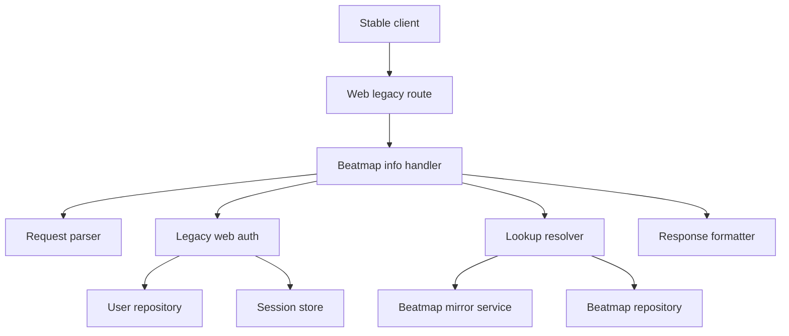
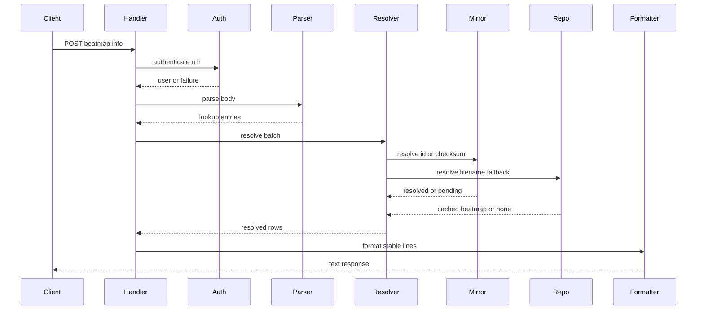

# Design Document

## Overview

この feature は osu! stable client の beatmap import 時に呼ばれる `/web/osu-getbeatmapinfo.php` を Athena の web legacy transport に追加する。client は JSON body の `Filenames` / `Ids` と query credentials を送信し、Athena は known beatmap の id、beatmapset id、md5、stable status、mode 別 grade を legacy response line として返す。

この endpoint は beatmap metadata lookup の入口であり、leaderboard、score submission、PP calculation、beatmap upload は扱わない。metadata lookup は既存の `BeatmapMirrorService` と beatmap repository を使い、`.osu` file body fetch は要求しない。

### Goals

- `osu.$DOMAIN` 上の `POST /web/osu-getbeatmapinfo.php` を stable-compatible に処理する。
- 実 client fixture に基づく JSON `Filenames` / `Ids` request を parse する。
- filename / checksum / beatmap id から metadata-only beatmap resolution を行う。
- stable-compatible response line を生成し、unresolved / NotSubmitted は行省略する。

### Non-Goals

- `/web/osu-osz2-getscores.php` と leaderboard formatting。
- osu!direct search/download、`.osz` proxy、beatmap upload。
- score persistence、personal best repository の本格実装、PP calculation。
- local upload id model や database schema の全面変更。

## Boundary Commitments

### This Spec Owns

- `POST /web/osu-getbeatmapinfo.php` の web legacy transport handler。
- request parsing、lookup candidate normalization、stable response formatting。
- legacy `u` / `h` credential と active session の確認。
- metadata-only lookup orchestration と bounded wait option の指定。
- filename lookup を可能にする beatmap repository read contract。
- real stable client fixture と reference fixture に基づく parser / formatter validation。

### Out of Boundary

- leaderboard score retrieval and `/web/osu-osz2-getscores.php`。
- score write model、best score calculation、grade persistence。
- `.osu` file body fetch、Blob storage writes、PP worker integration。
- beatmap upload lifecycle、local id allocation、WebUI policy management。
- API v2 / WebUI 用 provenance response。

### Allowed Dependencies

- `BeatmapMirrorService` for metadata resolution and bounded wait behavior。
- `BeatmapRepository` for filename fallback lookup。
- `UserRepository`, `PasswordService`, `SessionStore` for legacy web authentication。
- Existing Starlette routing, DI registration, lifespan state adapters。
- Existing structlog logging conventions for operator-observable parse / batch / lookup events。
- Existing test factories and in-memory repositories for typed tests。

### Revalidation Triggers

- Stable fixture changes for request body shape, response line fields, or status values。
- `BeatmapMirrorService` result shape or option semantics changes。
- Beatmap repository identity model changes, especially filename or future local upload identity。
- Legacy web auth contract changes for `u` / `h` or active session requirements。
- Future score repository integration that changes grade projection behavior。

## Architecture

### Existing Architecture Analysis

Athena routes `osu.$DOMAIN` to a Starlette `Router` in `composition/application.py`. Transport adapters in `composition/endpoints.py` pull concrete handlers from `app.state`, and `composition/service_registry.py` registers those handlers through the lightweight DI container. Existing web legacy handlers are callable classes under `transports/web_legacy/`.

`BeatmapMirrorService` already supports `resolve_by_beatmap_id()` and `resolve_by_checksum()` with `BeatmapResolveOptions(require_osu_file=False, wait_timeout_seconds=...)`. Current repository contracts do not expose filename lookup, while real stable fixture evidence shows `osu-getbeatmapinfo.php` sends original `.osu` filenames in `Filenames`. This spec therefore adds a narrow filename lookup read contract without changing beatmap identity ownership.

### Architecture Pattern & Boundary Map

Selected pattern: thin transport adapter + typed parser/formatter + existing service orchestration. Stable-specific request and response rules stay in `transports/web_legacy`; metadata ownership stays in `beatmap-mirror`; auth credential checking is isolated in a reusable service.



Architecture decisions:

- Stable-specific parser and formatter are transport-layer modules.
- Metadata fetch uses `BeatmapMirrorService` with `.osu` file requirement disabled.
- Filename fallback reads persisted metadata only; it does not trigger external filename search.
- Unresolved entries are omitted rather than represented as placeholder rows.
- Response order is not a compatibility contract; the response index field is.

### Technology Stack

| Layer | Choice / Version | Role in Feature | Notes |
|-------|------------------|-----------------|-------|
| Backend / Services | Python 3.14+ dataclasses | Request/value objects and typed results | Existing steering |
| Transport | Starlette | Host route and callable endpoint | Existing app pattern |
| Domain Services | Existing `BeatmapMirrorService` | Metadata-only resolution | No new external dependency |
| Persistence | Existing repository Protocols | Beatmap filename fallback lookup | Adds narrow read method |
| Observability | structlog | Parse, auth, batch, and unresolved diagnostics | Existing convention |
| Tests | pytest + TestClient | Unit and integration coverage | Fixture-backed parser tests |

## File Structure Plan

### Directory Structure

```text
src/osu_server/
├── services/
│   └── legacy_web_auth_service.py
├── transports/
│   └── web_legacy/
│       ├── beatmap_info.py
│       ├── beatmap_info_parser.py
│       └── beatmap_info_formatter.py
└── tests support through existing test tree

tests/
├── fixtures/
│   └── web_legacy/
│       └── beatmap_info/
│           ├── official_response.json
│           └── stable_import_request.json
├── unit/
│   └── transports/
│       └── web_legacy/
│           ├── test_beatmap_info_parser.py
│           ├── test_beatmap_info_formatter.py
│           └── test_beatmap_info_handler.py
└── integration/
    └── test_beatmap_info_endpoint.py
```

### Modified Files

- `src/osu_server/composition/application.py` — add `POST /web/osu-getbeatmapinfo.php` only under `Host("osu.$DOMAIN")`.
- `src/osu_server/composition/endpoints.py` — add adapter resolving `BeatmapInfoHandler` from `app.state`.
- `src/osu_server/composition/lifespan.py` — store `beatmap_info_handler` on app state.
- `src/osu_server/composition/service_registry.py` — register `LegacyWebAuthService` and `BeatmapInfoHandler`.
- `src/osu_server/repositories/interfaces/beatmap_repository.py` — add `get_beatmap_by_filename(filename: str)`.
- `src/osu_server/repositories/memory/beatmap_repository.py` — support filename lookup for unit/integration tests.
- `src/osu_server/repositories/sqlalchemy/models/beatmap.py` — add persisted original filename only if not already available through existing metadata.
- `src/osu_server/repositories/sqlalchemy/beatmap_repository.py` — implement filename lookup.
- `.kiro/specs/beatmap-info-endpoint/research.md` — keep fixture evidence and design decisions current.

No new third-party package is introduced.

## System Flows

### Beatmap Info Request



Flow decisions:

- Authentication failure stops before parsing diagnostics are exposed in the body.
- Invalid or oversized request bodies return HTTP 200 with empty body and structured diagnostics.
- The resolver rechecks metadata after bounded wait to pick up beatmapset snapshots saved during the same batch.
- The formatter emits only resolved rows with stable-compatible index values.

## Requirements Traceability

| Requirement | Summary | Components | Interfaces | Flows |
|-------------|---------|------------|------------|-------|
| 1.1 | osu domain endpoint handles request | Application route, endpoint adapter, handler | API contract | Beatmap Info Request |
| 1.2 | no path fallback required | Application route | Route table | Beatmap Info Request |
| 1.3 | scope limited to lookup and formatting | Handler, formatter | API contract | Beatmap Info Request |
| 1.4 | excludes leaderboard, direct, score, PP, upload | Boundary commitments | None | None |
| 2.1 | valid credentials and session authorize | LegacyWebAuthService | Service contract | Beatmap Info Request |
| 2.2 | invalid credentials reject | LegacyWebAuthService | Service contract | Beatmap Info Request |
| 2.3 | missing active session rejects | LegacyWebAuthService | Service contract | Beatmap Info Request |
| 2.4 | unauthorized body discloses nothing | Handler | API contract | Beatmap Info Request |
| 3.1 | filename entries preserve index | Parser | Parser contract | Beatmap Info Request |
| 3.2 | id entries preserve id lookup | Parser | Parser contract | Beatmap Info Request |
| 3.3 | zero lookup entries empty body | Handler, parser | API contract | Beatmap Info Request |
| 3.4 | over 100 entries empty body and log | Parser, handler | Parser result | Beatmap Info Request |
| 3.5 | parse failure empty body and log | Parser, handler | Parser error | Beatmap Info Request |
| 3.6 | real fixture validation | Tests, fixtures | Fixture contract | None |
| 4.1 | md5 in filename preferred | Lookup parser | Lookup contract | Beatmap Info Request |
| 4.2 | explicit id next | Lookup parser | Lookup contract | Beatmap Info Request |
| 4.3 | filename fallback | Resolver, repository | Repository contract | Beatmap Info Request |
| 4.4 | unparsable omitted and logged | Parser, handler | Parser result | Beatmap Info Request |
| 4.5 | avoid ambiguous id inference | Parser | Parser contract | None |
| 5.1 | known cache hit | Resolver, mirror service | Service call | Beatmap Info Request |
| 5.2 | unknown requests metadata | Resolver, mirror service | Service call | Beatmap Info Request |
| 5.3 | bounded wait | Resolver, mirror service | Resolve options | Beatmap Info Request |
| 5.4 | include resolved after wait | Resolver, formatter | Batch result | Beatmap Info Request |
| 5.5 | pending omitted | Resolver, formatter | Batch result | Beatmap Info Request |
| 5.6 | metadata only, no `.osu` fetch | Resolver | Resolve options | Beatmap Info Request |
| 6.1 | beatmapset snapshot reuse | Resolver | Batch resolution | Beatmap Info Request |
| 6.2 | recheck after wait | Resolver | Batch resolution | Beatmap Info Request |
| 6.3 | consistent set ids and statuses | Resolver, formatter | Batch result | Beatmap Info Request |
| 6.4 | stable index values identify entries | Formatter | Response contract | Beatmap Info Request |
| 7.1 | official not submitted omitted | Resolver, formatter | Result filter | Beatmap Info Request |
| 7.2 | unknown/pending/failed omitted | Resolver, formatter | Result filter | Beatmap Info Request |
| 7.3 | not submitted not source failure in body | Formatter | Response contract | None |
| 7.4 | refreshed result used later | Resolver, mirror service | Service call | Beatmap Info Request |
| 8.1 | filename row uses original index | Formatter | Response contract | Beatmap Info Request |
| 8.2 | id row uses stable id index | Formatter | Response contract | Beatmap Info Request |
| 8.3 | row fields complete | Formatter | Response contract | Beatmap Info Request |
| 8.4 | line order independent with indexes | Formatter | Response contract | Beatmap Info Request |
| 8.5 | unresolved rows omitted | Formatter | Response contract | Beatmap Info Request |
| 8.6 | provenance omitted | Formatter | Response contract | Beatmap Info Request |
| 9.1 | stable supported status mapping | Status mapper | Formatter contract | None |
| 9.2 | local loved-like mapping | Status mapper | Formatter contract | None |
| 9.3 | local ranked-like mapping | Status mapper | Formatter contract | None |
| 9.4 | pending-like mapping | Status mapper | Formatter contract | None |
| 9.5 | hidden statuses omitted | Status mapper, formatter | Formatter contract | None |
| 10.1 | personal grades when available | Grade provider port | Grade contract | Beatmap Info Request |
| 10.2 | neutral grades fallback | Grade provider port, formatter | Grade contract | Beatmap Info Request |
| 10.3 | no score persistence dependency | Grade provider port | Service contract | None |
| 10.4 | no score mutation | Grade provider port | Service contract | None |
| 11.1 | duplicate target avoids conflict | Resolver, mirror service | Batch resolution | Beatmap Info Request |
| 11.2 | all unknown within limit can fetch | Resolver | Batch resolution | Beatmap Info Request |
| 11.3 | pending fetch is existing work | Mirror service | Service call | Beatmap Info Request |
| 11.4 | large/repeated diagnostics | Handler, resolver | Logging contract | Beatmap Info Request |
| 12.1 | future local-source response support | Formatter, status mapper | Response contract | None |
| 12.2 | effective status after policy | Status mapper | Formatter contract | None |
| 12.3 | no provenance in stable response | Formatter | Response contract | None |
| 12.4 | upload lifecycle not defined | Boundary commitments | None | None |
| 13.1 | real fixture validation | Tests, fixtures | Fixture contract | None |
| 13.2 | provisional fixture distinction | Tests, research notes | Fixture metadata | None |
| 13.3 | reference implementations documented | Research log | Research contract | None |
| 13.4 | real fixture overrides provisional | Research log, tests | Fixture policy | None |

## Components and Interfaces

| Component | Domain/Layer | Intent | Req Coverage | Key Dependencies | Contracts |
|-----------|--------------|--------|--------------|------------------|-----------|
| BeatmapInfoHandler | Transport | Authenticate, parse, resolve, format endpoint response | 1, 2, 3, 5, 7, 8, 11 | LegacyWebAuthService P0, BeatmapInfoResolver P0 | API, Service |
| BeatmapInfoRequestParser | Transport | Parse stable JSON body into typed lookup entries | 3, 4, 13 | none P0 | Service |
| BeatmapInfoResolver | Transport orchestration | Resolve lookup entries through mirror and repository | 4, 5, 6, 7, 11 | BeatmapMirrorService P0, BeatmapRepository P1 | Service, Batch |
| BeatmapInfoFormatter | Transport | Convert resolved rows to stable response lines | 8, 9, 10, 12 | StableStatusMapper P0, GradeProvider P2 | Service |
| StableStatusMapper | Transport | Map effective beatmap status to stable values or omit | 7, 9, 12 | Beatmap domain P0 | Service |
| LegacyWebAuthService | Service | Verify legacy `u` / `h` credentials and active session | 2 | UserRepository P0, PasswordService P0, SessionStore P0 | Service |
| BeatmapInfoGradeProvider | Service port | Return personal grades or neutral fallback | 10 | future score repository P2 | Service |
| BeatmapRepository filename lookup | Repository | Read beatmap by original filename fallback | 4, 5 | existing persistence P0 | State |

### Transport Layer

#### BeatmapInfoHandler

| Field | Detail |
|-------|--------|
| Intent | Stable beatmap info endpoint callable |
| Requirements | 1.1, 1.3, 2.4, 3.3, 3.4, 3.5, 5.1, 5.5, 8.5, 11.4 |

**Responsibilities & Constraints**

- Reads query credentials and raw request body.
- Delegates authentication, parsing, resolving, and formatting.
- Returns `401` for authentication failure.
- Returns `200` empty body for parse failure, zero entries, or oversized batches.
- Does not access SQLAlchemy models or sessions directly.

**Dependencies**

- Inbound: Starlette route — invokes endpoint (P0)
- Outbound: `LegacyWebAuthService` — authenticates stable user (P0)
- Outbound: `BeatmapInfoRequestParser` — parses body (P0)
- Outbound: `BeatmapInfoResolver` — resolves metadata (P0)
- Outbound: `BeatmapInfoFormatter` — builds response body (P0)

**Contracts**: Service [x] / API [x] / Event [ ] / Batch [ ] / State [ ]

##### API Contract

| Method | Endpoint | Request | Response | Errors |
|--------|----------|---------|----------|--------|
| POST | `/web/osu-getbeatmapinfo.php` on `osu.$DOMAIN` | query `u`, `h`; JSON body with `Filenames`, `Ids` | `text/html` or text body with newline-delimited rows | `401` auth failure; `200` empty body for invalid batch |

##### Service Interface

```python
class BeatmapInfoHandler:
    async def __call__(self, request: Request) -> Response: ...
```

Preconditions:

- Route is only registered under the osu web host router.

Postconditions:

- Response body contains no unresolved placeholder rows.
- Unauthorized responses do not reveal lookup details.

#### BeatmapInfoRequestParser

| Field | Detail |
|-------|--------|
| Intent | Convert raw stable request into typed lookup entries |
| Requirements | 3.1, 3.2, 3.3, 3.4, 3.5, 4.1, 4.2, 4.4, 4.5, 13.1 |

**Responsibilities & Constraints**

- Supports observed JSON body with `Filenames: list[str]` and `Ids: list[int]`.
- Produces explicit parse outcomes instead of raising transport-visible exceptions.
- Preserves filename request indexes.
- Does not infer beatmap id from ambiguous filename text.
- Enforces total lookup limit of 100.

**Contracts**: Service [x] / API [ ] / Event [ ] / Batch [ ] / State [ ]

##### Service Interface

```python
@dataclass(slots=True, frozen=True)
class BeatmapInfoParseResult:
    entries: tuple[BeatmapInfoLookupEntry, ...]
    error: BeatmapInfoParseError | None

@dataclass(slots=True, frozen=True)
class BeatmapInfoLookupEntry:
    response_index: int
    filename: str | None
    beatmap_id: int | None
    checksum_md5: str | None
    source: BeatmapInfoLookupSource

class BeatmapInfoRequestParser:
    def parse(self, body: bytes) -> BeatmapInfoParseResult: ...
```

`BeatmapInfoLookupSource` values:

- `filename`
- `id`

`BeatmapInfoParseError` values:

- `invalid_json`
- `invalid_shape`
- `too_many_entries`

#### BeatmapInfoResolver

| Field | Detail |
|-------|--------|
| Intent | Resolve batch entries to beatmap rows without stable formatting |
| Requirements | 4.1, 4.2, 4.3, 5.1, 5.2, 5.3, 5.4, 5.6, 6.1, 6.2, 6.3, 7.1, 7.2, 11.1, 11.2, 11.3 |

**Responsibilities & Constraints**

- Resolves checksum first, explicit beatmap id second, filename fallback third.
- Uses `BeatmapResolveOptions(require_osu_file=False, wait_timeout_seconds=configured_default)`.
- Performs a post-wait recheck for filename fallback to benefit from newly saved beatmapset metadata.
- Filters pending, failed, unknown, and not-submitted results from output.
- Avoids manual in-memory global cache; repository and mirror service remain the source of truth.

**Dependencies**

- Outbound: `BeatmapMirrorService` — id/checksum metadata resolution (P0)
- Outbound: `BeatmapRepository` — filename fallback lookup and recheck (P1)

**Contracts**: Service [x] / API [ ] / Event [ ] / Batch [x] / State [ ]

##### Service Interface

```python
@dataclass(slots=True, frozen=True)
class BeatmapInfoResolvedRow:
    response_index: int
    beatmap: Beatmap
    beatmapset: BeatmapSet

class BeatmapInfoResolver:
    async def resolve(
        self,
        entries: tuple[BeatmapInfoLookupEntry, ...],
    ) -> tuple[BeatmapInfoResolvedRow, ...]: ...
```

Preconditions:

- Entries are already validated by parser.

Postconditions:

- Returned rows contain only beatmaps with usable metadata and beatmapset identity.
- Returned rows may be in any order, but each row contains the correct response index.

### Formatting Layer

#### BeatmapInfoFormatter

| Field | Detail |
|-------|--------|
| Intent | Build stable-compatible newline-delimited response body |
| Requirements | 8.1, 8.2, 8.3, 8.4, 8.5, 8.6, 10.1, 10.2, 10.3, 10.4, 12.1, 12.3 |

**Responsibilities & Constraints**

- Emits rows as `index|beatmap_id|beatmapset_id|md5|status|grade_osu|grade_taiko|grade_catch|grade_mania`.
- Uses `-1` response index for id-based entries only when the resolver marks them that way.
- Does not emit provenance fields.
- Uses neutral grades until personal grade data is available.

**Contracts**: Service [x] / API [ ] / Event [ ] / Batch [ ] / State [ ]

##### Service Interface

```python
class BeatmapInfoFormatter:
    def format_rows(
        self,
        rows: tuple[BeatmapInfoResolvedRow, ...],
        user_id: int,
    ) -> bytes: ...
```

Invariants:

- Empty input returns `b""`.
- Rows with no stable status mapping are skipped.

#### StableStatusMapper

| Field | Detail |
|-------|--------|
| Intent | Convert effective Athena status to stable response status |
| Requirements | 7.1, 7.2, 9.1, 9.2, 9.3, 9.4, 9.5, 12.2 |

**Responsibilities & Constraints**

- Keeps transport-specific numeric mapping out of domain models.
- Returns `None` for statuses that should be omitted.
- Maps local Loved-like and Ranked-like effective statuses through the same formatter contract without exposing local origin.

##### Service Interface

```python
class StableStatusMapper:
    def map(self, beatmap: Beatmap) -> int | None: ...
```

Open validation:

- Exact numeric values are finalized against fixture evidence during implementation. Current official fixture shows Ranked response value `1`.

### Service Layer

#### LegacyWebAuthService

| Field | Detail |
|-------|--------|
| Intent | Shared auth for stable web endpoints using `u` and `h` |
| Requirements | 2.1, 2.2, 2.3, 2.4 |

**Responsibilities & Constraints**

- Normalizes username using existing user rules.
- Verifies `h` against stored password hash using existing password verification.
- Requires active session by user id.
- Returns typed success/failure result; handler decides HTTP response.

**Contracts**: Service [x] / API [ ] / Event [ ] / Batch [ ] / State [ ]

##### Service Interface

```python
@dataclass(slots=True, frozen=True)
class LegacyWebAuthResult:
    user_id: int | None
    username: str | None
    failure: LegacyWebAuthFailure | None

class LegacyWebAuthService:
    async def authenticate(self, username: str | None, password_md5: str | None) -> LegacyWebAuthResult: ...
```

`LegacyWebAuthFailure` values:

- `missing_credentials`
- `invalid_credentials`
- `session_not_found`

#### BeatmapInfoGradeProvider

| Field | Detail |
|-------|--------|
| Intent | Return personal grades with neutral fallback |
| Requirements | 10.1, 10.2, 10.3, 10.4 |

**Responsibilities & Constraints**

- Initial implementation returns neutral grades for all modes.
- Future score repository integration replaces only this component.
- It never mutates scores.

##### Service Interface

```python
type BeatmapInfoGrades = tuple[str, str, str, str]

class BeatmapInfoGradeProvider:
    async def get_grades(self, user_id: int, beatmap_ids: tuple[int, ...]) -> dict[int, BeatmapInfoGrades]: ...
```

### Repository Layer

#### BeatmapRepository Filename Lookup

| Field | Detail |
|-------|--------|
| Intent | Resolve observed stable filename fallback from persisted metadata |
| Requirements | 4.3, 5.1, 6.2 |

**Responsibilities & Constraints**

- Adds `get_beatmap_by_filename(filename: str) -> Beatmap | None`.
- Filename lookup is exact match after parser-level normalization.
- It does not query external sources directly.
- If current schema lacks filename, design permits adding a nullable filename field to beatmaps through the beatmap mirror persistence area.

##### State Management

- Natural lookup key: original `.osu` filename as sent by stable client.
- Consistency: filename belongs to beatmap metadata snapshot and may be updated on metadata refresh or future upload.
- Collision risk: filename is not globally authoritative; checksum and id remain higher priority.

## Data Models

### Domain Model

This feature introduces transport value objects only:

- `BeatmapInfoLookupEntry`
- `BeatmapInfoParseResult`
- `BeatmapInfoResolvedRow`
- `LegacyWebAuthResult`

It reuses existing `Beatmap`, `BeatmapSet`, `BeatmapResolveOptions`, and `BeatmapResolveResult`.

### Logical Data Model

No new aggregate is owned by this spec. A repository read key for original filename is added because observed stable client requests send filename-only entries.

Structure decision:

- `Beatmap.checksum_md5` remains the preferred identity key.
- `Beatmap.id` remains the explicit id lookup key for current scope.
- `original_filename` is a fallback lookup attribute, not authoritative identity.

### Data Contracts & Integration

#### Request Body

```json
{
  "Filenames": ["Artist - Title (Creator) [Difficulty].osu"],
  "Ids": []
}
```

Validation rules:

- Missing arrays are treated as invalid shape unless fixture evidence later proves omitted fields are valid.
- Total entries must be 1 through 100 for normal processing.
- More than 100 entries returns empty body.

#### Response Body

```text
0|5394746|2464628|046b348fa9babf41261ccc8aa14edbfc|1|N|N|N|N
```

Fields:

1. Request index or stable id lookup index.
2. Beatmap id.
3. Beatmapset id.
4. MD5 checksum.
5. Stable-compatible status.
6. osu grade.
7. taiko grade.
8. catch grade.
9. mania grade.

## Error Handling

### Error Strategy

- Authentication failures return HTTP `401` with no beatmap data.
- Parse errors, zero entries, and over-limit batches return HTTP `200` with empty body to avoid breaking legacy client behavior.
- Per-entry lookup failures omit only that entry.
- Unexpected exceptions are left to existing middleware after structured context is logged where possible.

### Error Categories and Responses

| Category | Condition | Response | Observable Signal |
|----------|-----------|----------|-------------------|
| Auth | missing or invalid `u` / `h` | `401` | `beatmap_info_auth_failed` |
| Session | no active session | `401` | `beatmap_info_auth_failed` |
| Parse | invalid JSON or shape | `200` empty | `beatmap_info_parse_failed` |
| Batch | more than 100 entries | `200` empty | `beatmap_info_batch_rejected` |
| Lookup | unresolved entry | omit row | `beatmap_info_lookup_unresolved` |
| Status | not submitted or hidden | omit row | optional debug-level status |

## Testing Strategy

### Unit Tests

- Parser accepts real JSON fixture with `Filenames` and empty `Ids`, preserving filename indexes (`3.1`, `3.2`, `13.1`).
- Parser rejects invalid shape and over-100 batches with typed errors (`3.4`, `3.5`).
- Lookup candidate extraction prefers md5, then explicit id, then filename and avoids ambiguous id inference (`4.1`, `4.2`, `4.3`, `4.5`).
- Formatter emits fixture-compatible rows and skips unmappable statuses (`8.3`, `8.5`, `9.1`, `9.5`).
- Legacy auth accepts valid `u` / `h` only when active session exists (`2.1`, `2.2`, `2.3`).

### Integration Tests

- `Host: osu.$DOMAIN` routes `POST /web/osu-getbeatmapinfo.php` to handler; path fallback is absent (`1.1`, `1.2`).
- Known filename-only fixture returns stable rows from in-memory beatmap repository (`3.6`, `4.3`, `8.1`).
- Unknown entries enqueue metadata resolution through `BeatmapMirrorService` and return empty until resolved (`5.2`, `5.3`, `5.5`).
- Metadata saved for one difficulty makes another same-set entry resolvable after recheck (`6.1`, `6.2`, `6.3`).
- Unauthorized request returns `401` without body disclosure (`2.4`).

### Fixture Validation

- Store observed stable request fixture separately from reference-server fixture (`13.2`).
- Store official response body fixture and assert field parsing/formatting compatibility (`13.3`, `13.4`).
- Do not include HTTP chunk framing bytes in application response fixtures.

### Performance and Load

- Validate that 100-entry batch completes without external `.osu` file fetch (`5.6`, `11.2`).
- Validate duplicate lookup targets do not create duplicate conflicting response rows (`11.1`, `11.3`).

## Security Considerations

- `h` is a password md5 and must not be logged.
- Parse and lookup diagnostics must redact credentials and raw auth query values.
- Stable response must not disclose internal source, verification, policy, or override provenance (`8.6`, `12.3`).
- Active session requirement prevents offline credential replay from retrieving user-specific grades.

## Performance & Scalability

- Batch limit is 100 entries.
- `.osu` file fetch is explicitly disabled for this endpoint.
- Filename fallback is a repository read and must be indexed or constrained enough for exact lookup.
- Bounded wait uses existing beatmap mirror wait behavior; the handler does not hold database transactions across waits.

## Migration Strategy

No broad migration is owned by this spec. If filename lookup requires persistence support, add a nullable original filename attribute through the beatmap repository model and migration. Existing beatmap records without filename remain resolvable by checksum or id and simply miss filename fallback until refreshed.

## Supporting References

- `.kiro/specs/beatmap-info-endpoint/research.md` records observed stable request and official response fixtures.
- `.kiro/specs/beatmap-mirror/requirements.md` defines metadata resolution and fetch-state behavior reused by this endpoint.
