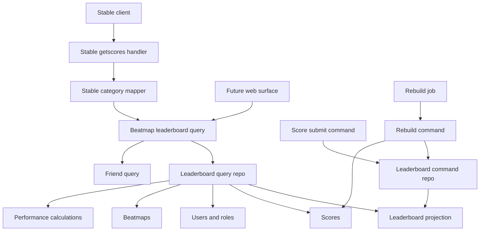
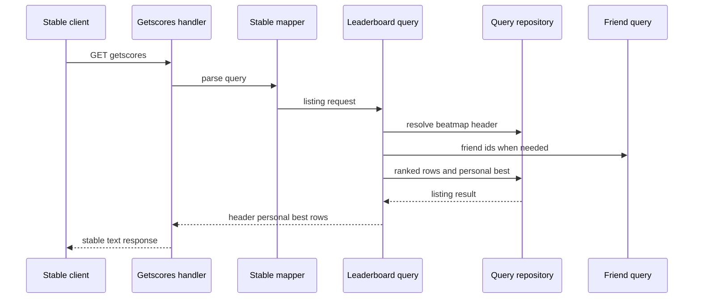
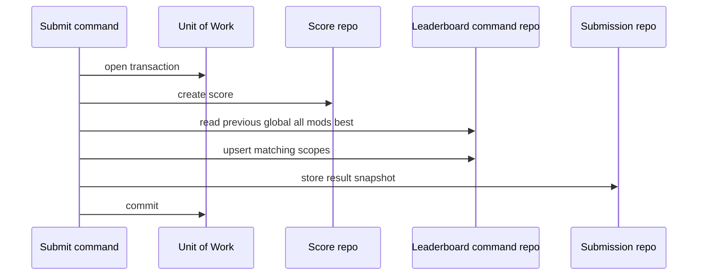
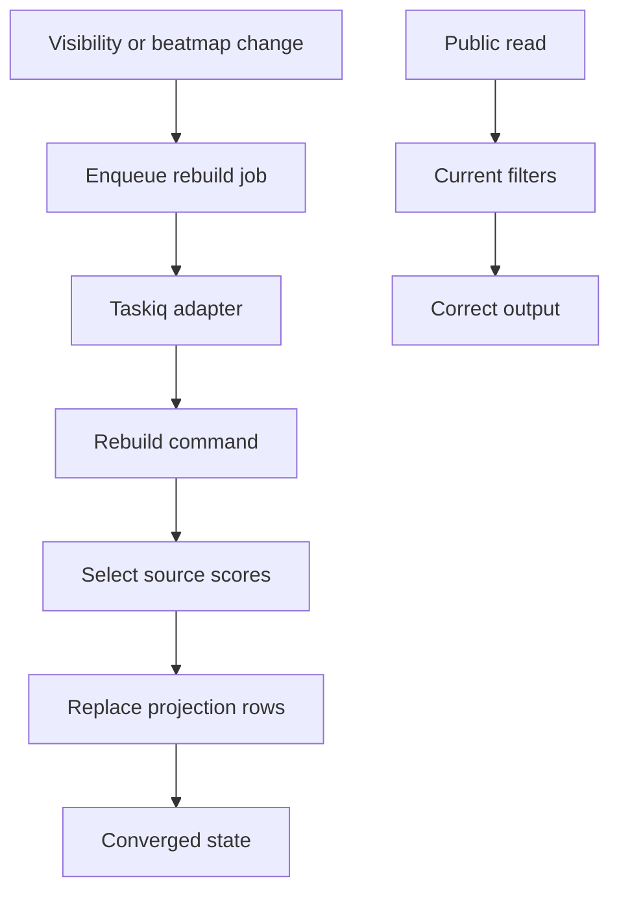
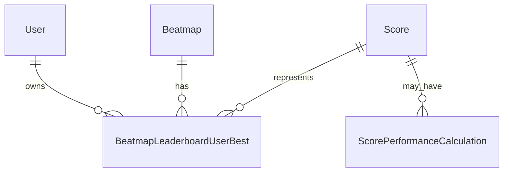
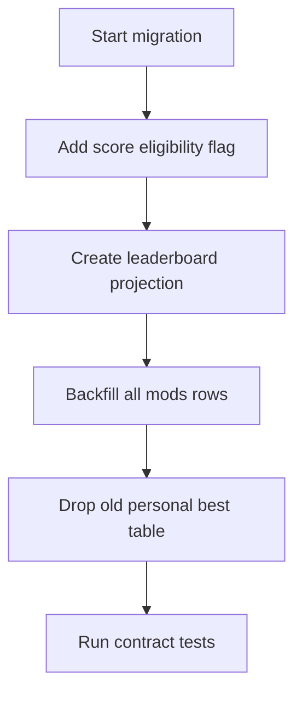

# Design Document

## Overview

beatmap-leaderboards は、保存済み Score から Beatmap ごとの score-priority leaderboard rows と viewer 自身の score-priority Personal Best を提供する。stable client は `/web/osu-osz2-getscores.php` で Global、Local 互換、Country、Selected Mods、Friends を参照し、将来の Web 表示も同じ query result を再利用する。

この設計は current `personal_bests` を延命しない。Beatmap Leaderboard 用の代表 Score は `beatmap_leaderboard_user_bests` に再設計し、PP-priority の `beatmap_performance_bests` は user-stats の責務として明確に分離する。

### Goals

- Beatmap Leaderboard rows を score 降順、submission time 昇順、Score ID 昇順で deterministic に返す。
- Personal Best を top rows とは別枠で返し、top 50 外でも actual rank を表示できるようにする。
- Global、Local 互換、Country、Selected Mods、Friends を同じ domain query contract で扱う。
- NC/DT、PF/SD、NoMod、Mirror unsupported を stable-compatible な Leaderboard Mod Filter policy として定義する。
- Beatmap status、checksum、user visibility の変更後も read-time filter で public output を正しく保つ。
- Submit path と rebuild job が同じ score-priority rank policy を使う。

### Non-Goals

- non-vanilla playstyle の leaderboard 実装。
- lazer API endpoint と SignalR surface。
- PP-priority `beatmap_performance_bests` の table、repository、rebuild 実装。
- User Profile、Top Plays、User Stats、User Ranking の集計。
- Operator-only inspection surface for hidden scores。
- Mirror selected-mod filter の明示サポート。

## Boundary Commitments

### This Spec Owns

- Beatmap Leaderboard category、scope、rank key、mod filter key、row result の domain language。
- score-priority projection `beatmap_leaderboard_user_bests` の schema、migration、command/query repository contract。
- `personal_bests` table の Beatmap Leaderboard 用 projection からの撤去と migration path。
- `scores.leaderboard_eligible_at_submission` による submission-time leaderboard eligibility evidence。
- Score record persistence と leaderboard adoption の分離。leaderboard 非対象でも保存対象として受け付けた Score は projection に採用しない。
- stable getscores request を Beatmap Leaderboard query input へ変換する compatibility mapper。
- stable getscores response における header、Personal Best row、score rows、score count の contract。
- Submit Score command が Global all-mods Personal Best delta を score-priority projection から計算すること。
- Beatmap/User scope の idempotent leaderboard reconciliation job adapter と command use-case。
- Public leaderboard read-time filters: current Beatmap status、current checksum、passed、submission-time eligibility、score owner visibility。

### Out of Boundary

- Score payload parsing、decryption、hit validation、replay persistence、submission fingerprint ownership。
- Score submission の基本認証、重複判定、failed score 保存、replay blob 保存。
- Score PP calculation, formula profile, performance recalculation ownership。
- `beatmap_performance_bests` の実装と PP-based stats/ranking selection。
- Friend Relationship mutation, friendable user policy, friend-only DM。
- Beatmap rank management UI/API and audited rank status mutation。
- Admin/moderator inspection of restricted or hidden scores。
- Lazer, first-party Web API route shape, and Web UI components。

### Allowed Dependencies

- Domain: `domain/scores`, `domain/beatmaps`, `domain/identity`, `domain/compatibility/stable` value objects and policies。
- Command side: `UnitOfWorkFactory` and command repository interfaces。
- Query side: Beatmap, leaderboard, friend relationship, score performance, user/role query repositories。
- Runtime: stable web legacy handler, taskiq job adapters, Dishka provider sets。
- Data: PostgreSQL through SQLAlchemy 2.0 async and Alembic migrations。

Forbidden dependencies:

- Domain code must not import SQLAlchemy, taskiq, Valkey, Starlette, FastAPI, Dishka, or stable wire parser types。
- Query use-cases must not open command Unit of Work or mutate projection state。
- Jobs must not import SQLAlchemy models, DB sessions, raw SQL, or concrete repository factories。
- Stable transport must not import SQLAlchemy models or command repositories。
- Beatmap Leaderboard code must not reimplement Friend Relationship mutation or PP calculation policy。

### Revalidation Triggers

- Stable getscores `v`, `vv`, `mods`, or response row wire shape changes。
- `beatmap_leaderboard_user_bests` natural key, rank key, or `mod_filter_key` semantics change。
- Score submission acceptance rules or `leaderboard_eligible_at_submission` meaning changes。
- `score_performance_calculations` current-row semantics or PP display policy changes。
- Friend Relationships eligible user set contract changes。
- Role/Privilege model changes that affect `LeaderboardVisibleUserPolicy`。
- Beatmap metadata status or checksum source of truth changes。
- Future user-stats implements `beatmap_performance_bests` and wants to consume Beatmap Leaderboard data。

## Architecture

### Existing Architecture Analysis

Athena already uses a layered modular monolith with stable transport adapters, command/query use-cases, Unit of Work command persistence, query repositories, SQLAlchemy adapters, taskiq jobs, and Dishka composition. Existing getscores code resolves Beatmap header state and optional Global Personal Best, but it does not list rows, interpret category semantics, or maintain a projection suitable for mod-filtered scopes.

Score submission already creates Score, Replay, Personal Best projection, and idempotency snapshot in a single Unit of Work. This design keeps that transaction pattern but replaces the old Personal Best projection with a leaderboard-specific repository. Score PP Calculation already stores current Performance Calculation and remains the PP source for display enrichment.

### Architecture Pattern & Boundary Map

Selected pattern: dedicated Beatmap Leaderboard subsystem with score-priority projection and transport-local stable compatibility mapping.



Key decisions:

- `beatmap_leaderboard_user_bests` stores one representative Score per Beatmap, ruleset, playstyle, user, and mod filter scope。
- Country and Friends are current viewer filters over all-mods projection rows, not projection dimensions。
- Selected Mods uses canonical `mod_filter_key`; displayed mods always come from the source Score。
- Rebuild jobs repair projection drift, while public reads still apply current eligibility and visibility predicates。
- PP may be read for row display, but PP never orders Beatmap Leaderboard rows。
- Stored-but-ineligible Score rows remain source records and never become projection candidates until a future explicit migration policy says otherwise。

### Technology Stack

| Layer | Choice / Version | Role in Feature | Notes |
| --- | --- | --- | --- |
| Backend / Services | Python 3.14 dataclasses and Protocols | Domain policies and command/query inputs | No Pydantic in domain |
| Stable transport | Starlette web legacy handler | `/web/osu-osz2-getscores.php` request/response adaptation | Existing endpoint |
| Data / Storage | PostgreSQL + SQLAlchemy 2.0 async | Projection table, score eligibility snapshot, read joins | Alembic migration required |
| Messaging / Jobs | taskiq + taskiq-redis | Reconciliation jobs | Jobs are corrective, not read correctness source |
| Composition | Dishka | App/worker/test provider wiring | Existing provider pattern |

## File Structure Plan

### Directory Structure

```text
src/
└── osu_server/
    ├── domain/
    │   ├── compatibility/
    │   │   └── stable/
    │   │       ├── getscores.py
    │   │       └── leaderboards.py
    │   ├── identity/
    │   │   └── leaderboard_visibility.py
    │   └── scores/
    │       └── leaderboards.py
    ├── services/
    │   ├── commands/
    │   │   └── scores/
    │   │       ├── submit_score.py
    │   │       ├── process_submission.py
    │   │       └── leaderboards/
    │   │           ├── __init__.py
    │   │           ├── rebuild_beatmap_leaderboards.py
    │   │           └── update_beatmap_leaderboard.py
    │   └── queries/
    │       └── scores/
    │           ├── beatmap_score_listing.py
    │           └── beatmap_leaderboards.py
    ├── repositories/
    │   ├── interfaces/
    │   │   ├── commands/
    │   │   │   └── beatmap_leaderboards.py
    │   │   ├── queries/
    │   │   │   └── beatmap_leaderboards.py
    │   │   └── unit_of_work.py
    │   ├── sqlalchemy/
    │   │   ├── commands/
    │   │   │   └── beatmap_leaderboards.py
    │   │   ├── models/
    │   │   │   ├── beatmap_leaderboard.py
    │   │   │   └── score.py
    │   │   ├── queries/
    │   │   │   └── beatmap_leaderboards.py
    │   │   └── unit_of_work.py
    │   └── memory/
    │       ├── commands/
    │       │   ├── beatmap_leaderboards.py
    │       │   └── state.py
    │       └── queries/
    │           └── beatmap_leaderboards.py
    ├── jobs/
    │   └── beatmap_leaderboards.py
    ├── composition/
    │   └── providers/
    │       ├── repositories.py
    │       └── leaderboard.py
    └── transports/
        └── stable/
            └── web_legacy/
                ├── getscores.py
                └── mappers/
                    └── getscores.py

alembic/
└── versions/
    └── 20260618_0100_rebuild_beatmap_leaderboard_bests.py
```

### Modified Files

- `src/osu_server/domain/scores/__init__.py` — export leaderboard domain values and retire old Personal Best exports after call sites migrate.
- `src/osu_server/domain/compatibility/stable/getscores.py` — replace stable-shaped PB-only result with header, personal_best, rows, and category result values.
- `src/osu_server/services/queries/scores/beatmap_score_listing.py` — preserve beatmap header resolution and delegate supported leaderboard reads to `BeatmapLeaderboardQuery`.
- `src/osu_server/services/queries/identity/friend_relationships.py` — adjust `GetFriendEligibleUserIdsQuery` to return viewer plus current friend target IDs for Friends leaderboard filtering while keeping `ListFriendIdsQuery` target-only for login.
- `src/osu_server/services/commands/scores/submit_score.py` — compute submit PB delta from Global all-mods `beatmap_leaderboard_user_bests` and upsert projection entries in the same Unit of Work.
- `src/osu_server/services/commands/scores/process_submission.py` — pass `leaderboard_eligible_at_submission` and avoid using non-eligible scores for PB delta.
- `src/osu_server/domain/beatmaps/models.py` and score submission eligibility flow — keep accepting stored Score records where score-ingestion allows them, while marking leaderboard adoption separately.
- `src/osu_server/repositories/interfaces/unit_of_work.py` — expose `beatmap_leaderboards` command repository and remove `personal_bests` once migration is complete.
- `src/osu_server/repositories/sqlalchemy/unit_of_work.py` — bind SQLAlchemy leaderboard command repository.
- `src/osu_server/repositories/memory/commands/state.py` — add in-memory leaderboard projection state.
- `src/osu_server/repositories/sqlalchemy/models/__init__.py` — register `BeatmapLeaderboardUserBestModel`.
- `src/osu_server/composition/providers/repositories.py` — provide leaderboard query repository.
- `src/osu_server/worker.py` — resolve leaderboard rebuild use-cases into taskiq state.
- `src/osu_server/jobs/__init__.py` — register leaderboard job module.
- `tests/unit/transports/web_legacy/test_getscores_formatter.py` — update score count, PB, and row formatting expectations.
- `tests/integration/test_getscores_endpoint.py` — update endpoint contract from PB fallback row to top rows plus separate PB.

## System Flows

### Stable Getscores Read



The query returns header-only responses for unsupported categories, non-vanilla playstyle, song select/editor requests, stale checksum update responses, and non-visible current Beatmap statuses.

### Submit Projection Update



Retry with an existing submission fingerprint returns the saved submit result and does not recalculate PB delta or mutate projection.

### Reconciliation



Read correctness does not wait for `Done`; stale projection rows are filtered by current public predicates.

## Requirements Traceability

| Requirement | Summary | Components | Interfaces | Flows |
| --- | --- | --- | --- | --- |
| 1.1 | Visible vanilla beatmaps return supported categories | `BeatmapLeaderboardQuery`, query repo | `BeatmapLeaderboardQuery.execute` | Stable Getscores Read |
| 1.2 | Global uses all visible eligible scores | Scope policy, query repo | `LeaderboardCategory.GLOBAL` | Stable Getscores Read |
| 1.3 | Stable Local uses Global candidates | Stable mapper | `StableGetscoresLeaderboardMapper` | Stable Getscores Read |
| 1.4 | Unsupported category returns header with empty rows | Stable mapper, query | `UnsupportedLeaderboardCategory` result | Stable Getscores Read |
| 1.5 | Non-vanilla returns empty leaderboard | Query request validation | `playstyle` guard | Stable Getscores Read |
| 1.6 | Song select/editor suppresses rows and PB | Stable mapper, formatter | `song_select` flag | Stable Getscores Read |
| 2.1 | One representative score per user per scope | Projection command repo | `upsert_if_better` | Submit Projection Update |
| 2.2 | Rank order is score desc, submitted_at asc, score_id asc | `ScoreRankKey` | `beats` policy | Submit Projection Update |
| 2.3 | At most 50 rows | Query repo | `limit=50` contract | Stable Getscores Read |
| 2.4 | Row ranks are 1 through returned rows | Query repo, formatter | `rank` field | Stable Getscores Read |
| 2.5 | Stable score count excludes PB | Formatter | `score_count=len(rows)` | Stable Getscores Read |
| 2.6 | Same score/time uses lower Score ID | `ScoreRankKey` | `score_id` tie-break | Submit Projection Update |
| 3.1 | Authenticated viewer PB returned separately | Query use-case | `personal_best` result | Stable Getscores Read |
| 3.2 | PB outside top 50 includes actual rank | Query repo | window rank for PB | Stable Getscores Read |
| 3.3 | PB can also appear in rows | Formatter | no dedupe rule | Stable Getscores Read |
| 3.4 | Global/Country/Friends PB ignores mods | Scope policy | all-mods `mod_filter_key=NULL` | Stable Getscores Read |
| 3.5 | Selected Mods PB uses filter | Mod filter policy | `mod_filter_key` | Stable Getscores Read |
| 3.6 | Unknown viewer has no PB | Query use-case | viewer context guard | Stable Getscores Read |
| 3.7 | Non-visible viewer has no PB but public rows remain | Visibility policy | `LeaderboardVisibleUserPolicy` | Stable Getscores Read |
| 4.1 | Country uses current owner country | Query repo | country filter | Stable Getscores Read |
| 4.2 | Missing or `XX` viewer country returns empty | Query use-case | country guard | Stable Getscores Read |
| 4.3 | Friends includes current friend targets and viewer | Friend query dependency | `GetFriendEligibleUserIdsQuery` | Stable Getscores Read |
| 4.4 | Reverse-only relationship excluded | Friend query dependency | friend eligible set | Stable Getscores Read |
| 4.5 | Country/Friends ignore selected mods | Scope policy | all-mods key | Stable Getscores Read |
| 4.6 | Friend changes reflected on read | Friend query dependency | current read | Stable Getscores Read |
| 4.7 | Country changes reflected on read | Query repo | current user country | Stable Getscores Read |
| 4.8 | Unauthenticated viewer-dependent categories empty | Query use-case | viewer guard | Stable Getscores Read |
| 5.1 | Selected Mods filters rows and PB | Mod filter policy, query repo | `mod_filter_key` | Stable Getscores Read |
| 5.2 | NC matches DT and NC while displaying NC | Mod filter policy | canonical DT key | Submit Projection Update |
| 5.3 | PF matches SD and PF while displaying PF | Mod filter policy | canonical SD key | Submit Projection Update |
| 5.4 | NoMod includes non-gameplay preference mods | Mod filter policy | NoMod key `0` | Submit Projection Update |
| 5.5 | NoMod excludes NC | Mod filter policy | gameplay mod check | Submit Projection Update |
| 5.6 | Multiple gameplay mods require exact selected gameplay set | Mod filter policy | canonical key | Submit Projection Update |
| 5.7 | Same score can appear in multiple matching scopes | Command repo | multi-key upsert | Submit Projection Update |
| 5.8 | Explicit Mirror selected filter returns empty | Stable mapper, mod policy | unsupported filter result | Stable Getscores Read |
| 6.1 | Failed scores excluded | Eligibility policy | `passed=true` predicate | Stable Getscores Read |
| 6.2 | Stored ineligible scores remain excluded | Eligibility snapshot | `leaderboard_eligible_at_submission` | Stable Getscores Read |
| 6.3 | Visible users may appear | Visibility policy | bitwise role predicate | Stable Getscores Read |
| 6.4 | Non-visible owners excluded | Query repo | owner visibility filter | Stable Getscores Read |
| 6.5 | Visibility changes apply on read | Query repo | current role join | Stable Getscores Read |
| 6.6 | Visible again users can reappear | Projection retained, read filter | visibility filter | Reconciliation |
| 6.7 | Non-visible viewer still sees public rows | Query use-case | PB-only viewer visibility guard | Stable Getscores Read |
| 7.1 | Non-visible current Beatmap returns no rows/PB | Query use-case | current status guard | Stable Getscores Read |
| 7.2 | Pre-promotion scores not adopted | Eligibility snapshot | submission-time flag | Reconciliation |
| 7.3 | Downgraded Beatmap hides rows/PB | Query use-case | current status guard | Stable Getscores Read |
| 7.4 | Old checksum scores excluded | Query repo | current checksum predicate | Stable Getscores Read |
| 7.5 | Outdated request checksum returns update available | Header resolver | update outcome | Stable Getscores Read |
| 7.6 | Pending reconciliation still filters current state | Query repo | read-time predicates | Reconciliation |
| 8.1 | Accepted eligible score compares previous Global all-mods PB | Submit command | command repo read | Submit Projection Update |
| 8.2 | Stable submit PB delta uses Global all-mods only | Submit command | `mod_filter_key=NULL` | Submit Projection Update |
| 8.3 | Ineligible score does not improve submit delta | Eligibility snapshot | command guard | Submit Projection Update |
| 8.4 | Retry uses saved submit result | Submit command | submission snapshot | Submit Projection Update |
| 8.5 | Later categories resolve own PB | Query use-case | category scope | Stable Getscores Read |
| 9.1 | Current PP available for Ranked/Approved rows | Query repo | performance left join | Stable Getscores Read |
| 9.2 | Missing PP does not hide row | Query repo | nullable PP | Stable Getscores Read |
| 9.3 | Loved/Qualified do not require PP | Query repo | nullable PP | Stable Getscores Read |
| 9.4 | Ranking never uses PP | `ScoreRankKey` | score-priority ordering | Stable Getscores Read |
| 9.5 | PP-priority best is separate | Boundary commitments | out-of-boundary table | Reconciliation |
| 10.1 | Visibility rebuild async | Rebuild job | user rebuild payload | Reconciliation |
| 10.2 | Beatmap status rebuild async | Rebuild job | beatmapset payload | Reconciliation |
| 10.3 | Beatmap checksum rebuild async | Rebuild job | beatmapset payload | Reconciliation |
| 10.4 | Pending rebuild reads filter current state | Query repo | read-time predicates | Stable Getscores Read |
| 10.5 | Repeated rebuild converges | Rebuild command repo | replace from source scores | Reconciliation |

## Components and Interfaces

| Component | Domain/Layer | Intent | Req Coverage | Key Dependencies | Contracts |
| --- | --- | --- | --- | --- | --- |
| Leaderboard domain policy | Domain scores | Scope, rank key, mod filter, row values | 2.1-2.6, 5.1-5.8, 9.4 | `ModCombination` P0 | Service, State |
| Leaderboard visible user policy | Domain identity | Public leaderboard visibility without admin bypass | 3.7, 6.3-6.7 | `Privileges` P0 | Service |
| Stable getscores leaderboard mapper | Stable compatibility | Map raw stable fields to query category and mod filter | 1.3, 1.4, 1.6, 5.8 | stable parser P0 | Service |
| Beatmap leaderboard query | Query service | Resolve header, rows, PB, viewer-dependent scopes | 1.1-7.6, 9.1-9.4, 10.4 | query repos P0, friend query P1 | Service |
| Beatmap leaderboard command repo | Command persistence | Upsert and rebuild projection rows | 2.1-2.6, 5.7, 8.1-8.4, 10.5 | UoW P0 | State |
| Beatmap leaderboard query repo | Query persistence | Return top rows and PB rank with current filters | 2.3-4.8, 6.1-7.6, 9.1-9.4 | SQLAlchemy P0 | Service |
| Submit leaderboard updater | Command service | Update projection and PB delta during accepted submit | 8.1-8.4 | submit command P0 | Service |
| Rebuild command and jobs | Command and runtime | Correct projection after user/beatmap/checksum changes | 10.1-10.5 | taskiq P1, UoW P0 | Batch |
| Stable getscores formatter | Stable transport | Emit compatible text response with separate PB and rows | 2.5, 3.1-3.3 | stable query result P0 | API |

### Domain

#### Leaderboard Domain Policy

| Field | Detail |
| --- | --- |
| Intent | Define transport-neutral Beatmap Leaderboard scope, rank, and row language. |
| Requirements | 2.1-2.6, 5.1-5.8, 9.4 |

Responsibilities and constraints:

- `LeaderboardCategory` includes `GLOBAL`, `COUNTRY`, `SELECTED_MODS`, `FRIENDS` only.
- `LeaderboardScope` identity is Beatmap, ruleset, playstyle, and optional `mod_filter_key`.
- `ScoreRankKey` orders by `score desc`, `submitted_at asc`, `score_id asc`.
- `mod_filter_key` is `None` for all-mods and non-null canonical integer for Selected Mods.
- Raw score mods are never overwritten for display.

Service interface:

```python
@dataclass(slots=True, frozen=True)
class ScoreRankKey:
    score: int
    submitted_at: datetime
    score_id: int

def score_beats_current(candidate: ScoreRankKey, current: ScoreRankKey | None) -> bool: ...

@dataclass(slots=True, frozen=True)
class LeaderboardModFilter:
    key: int
    unsupported: bool = False

def filter_from_mod_combination(mods: ModCombination) -> LeaderboardModFilter: ...
def projection_keys_for_score(mods: ModCombination) -> tuple[int | None, ...]: ...
```

Preconditions:

- `score_id` and Beatmap/user identifiers are positive.
- `submitted_at` is server submission acceptance time.
- `mod_filter_key=None` is reserved for all-mods only.

Postconditions:

- NC and DT selected filters resolve to the same canonical key.
- PF and SD selected filters resolve to the same canonical key.
- Mirror selected filter returns unsupported in initial scope.

#### Leaderboard Visible User Policy

| Field | Detail |
| --- | --- |
| Intent | Decide whether a score owner is visible on public Beatmap Leaderboards. |
| Requirements | 3.7, 6.3-6.7 |

Responsibilities and constraints:

- Uses explicit bitwise policy: user is visible when current privileges include both `NORMAL` and `UNRESTRICTED`.
- Does not use `has_privilege()` because that function grants ADMIN bypass.
- Applies to score owners and to viewer Personal Best visibility.
- Does not block public rows for a non-visible viewer.

Service interface:

```python
def is_leaderboard_visible_user(privileges: Privileges) -> bool: ...
```

### Stable Compatibility

#### Stable Getscores Leaderboard Mapper

| Field | Detail |
| --- | --- |
| Intent | Convert stable getscores raw fields into Beatmap Leaderboard query input. |
| Requirements | 1.3, 1.4, 1.6, 5.8 |

Responsibilities and constraints:

- Maps stable Local `v=1` to Global candidate set.
- Maps `v=2` to Selected Mods, `v=3` to Friends, `v=4` to Country.
- Unsupported `v` values produce a supported header with empty rows and no PB.
- `song_select=true` produces header-only response.
- `vv` remains parsed and logged but does not change ranking semantics in this scope.
- Stable raw `mods` is converted to `ModCombination` before mod filter policy runs.

Service interface:

```python
@dataclass(slots=True, frozen=True)
class StableLeaderboardSelection:
    category: LeaderboardCategory | None
    selected_mod_filter: LeaderboardModFilter | None
    header_only: bool
    unsupported: bool

class StableGetscoresLeaderboardMapper(Protocol):
    def map_request(self, request: GetscoresRequest) -> StableLeaderboardSelection: ...
```

Validation hooks:

- Stable verification fixture must cover `v=1`, `v=2`, `v=3`, and `v=4`.
- External compatibility reference from Ripple LETS is supporting evidence, not a substitute for Athena fixtures.

### Query Layer

#### Beatmap Leaderboard Query

| Field | Detail |
| --- | --- |
| Intent | Produce a transport-neutral listing result containing header, optional PB, and rows. |
| Requirements | 1.1-7.6, 8.5, 9.1-9.4, 10.4 |

Responsibilities and constraints:

- Resolves Beatmap header through existing beatmap score listing repository behavior.
- Returns update-available when request checksum is outdated.
- Rejects non-vanilla playstyle to empty listing, not error.
- Builds viewer context for Country and Friends.
- For Friends, consumes a self-inclusive `GetFriendEligibleUserIdsQuery` result: viewer ID plus current friend target IDs. If the underlying friend query implementation is target-only, this spec must update it before leaderboard query integration.
- Requests rows and PB rank from query repository after all scope guards are known.
- Does not mutate projection or repair missing rows.

Service interface:

```python
@dataclass(slots=True, frozen=True)
class BeatmapLeaderboardRequest:
    beatmap_checksum: str | None
    filename: str | None
    beatmapset_id_hint: int | None
    viewer_user_id: int | None
    ruleset: Ruleset
    playstyle: Playstyle
    category: LeaderboardCategory | None
    selected_mod_filter: LeaderboardModFilter | None
    header_only: bool

@dataclass(slots=True, frozen=True)
class BeatmapLeaderboardResult:
    kind: GetscoresOutcomeKind
    header: BeatmapLeaderboardHeader | None
    personal_best: BeatmapLeaderboardRow | None
    rows: tuple[BeatmapLeaderboardRow, ...]
    reason: GetscoresResolveReason

class BeatmapLeaderboardQuery:
    async def execute(self, request: BeatmapLeaderboardRequest) -> BeatmapLeaderboardResult: ...
```

#### Beatmap Leaderboard Query Repository

| Field | Detail |
| --- | --- |
| Intent | Execute read-optimized leaderboard row and PB rank retrieval. |
| Requirements | 2.3-4.8, 6.1-7.6, 9.1-9.4, 10.4 |

Responsibilities and constraints:

- Reads from `beatmap_leaderboard_user_bests` joined to Score, Beatmap, User, Role, Replay, and current Performance Calculation.
- Applies current public filters in every row and PB query.
- Exposes PP only for current Ranked or Approved Beatmaps; Loved and Qualified rows remain visible with `pp=None`.
- Uses window ranking over the filtered candidate set for PB actual rank.
- Returns at most 50 rows.
- `score_count` is not total candidates; stable formatter derives it from returned row count.

Service interface:

```python
@dataclass(slots=True, frozen=True)
class LeaderboardReadScope:
    beatmap_id: int
    beatmap_checksum: str
    ruleset: Ruleset
    playstyle: Playstyle
    category: LeaderboardCategory
    mod_filter_key: int | None
    country: str | None = None
    eligible_user_ids: tuple[int, ...] | None = None

class BeatmapLeaderboardQueryRepository(Protocol):
    async def list_top_rows(self, scope: LeaderboardReadScope, *, limit: int) -> tuple[BeatmapLeaderboardRow, ...]: ...
    async def get_personal_best(self, scope: LeaderboardReadScope, *, viewer_user_id: int) -> BeatmapLeaderboardRow | None: ...
```

### Command Layer

#### Submit Leaderboard Updater

| Field | Detail |
| --- | --- |
| Intent | Update Beatmap Leaderboard projection and submit PB delta inside score submission. |
| Requirements | 2.1, 2.2, 2.6, 5.7, 8.1-8.4 |

Responsibilities and constraints:

- Runs only after Score creation and before submit snapshot persistence.
- Reads previous Global all-mods best before replacing it.
- Upserts all matching projection scopes for the accepted score.
- Does not update projection when `passed=false` or `leaderboard_eligible_at_submission=false`.
- Does not reject or delete the source Score when it is stored but leaderboard-ineligible.
- Does not recalculate anything on idempotency replay.

Service interface:

```python
@dataclass(slots=True, frozen=True)
class UpdateBeatmapLeaderboardForScoreCommand:
    score_id: int
    user_id: int
    beatmap_id: int
    ruleset: Ruleset
    playstyle: Playstyle
    mods: ModCombination
    rank_key: ScoreRankKey
    leaderboard_eligible_at_submission: bool

class UpdateBeatmapLeaderboardForScoreUseCase:
    async def execute(self, command: UpdateBeatmapLeaderboardForScoreCommand) -> PersonalBestDelta | None: ...
```

#### Beatmap Leaderboard Command Repository

| Field | Detail |
| --- | --- |
| Intent | Mutate score-priority projection rows through Unit of Work. |
| Requirements | 2.1, 2.2, 2.6, 5.7, 8.1-8.4, 10.5 |

Responsibilities and constraints:

- Natural key: `beatmap_id`, `ruleset`, `playstyle`, `user_id`, `mod_filter_key`.
- Replaces existing row only when candidate `ScoreRankKey` beats current row.
- Supports idempotent rebuild by replacing all rows for a user or beatmap slice from source Score candidates.
- Does not commit or rollback outside Unit of Work.

State contract:

```python
@dataclass(slots=True, frozen=True)
class UpsertBeatmapLeaderboardUserBest:
    beatmap_id: int
    ruleset: Ruleset
    playstyle: Playstyle
    user_id: int
    mod_filter_key: int | None
    score_id: int
    rank_key: ScoreRankKey

class BeatmapLeaderboardCommandRepository(Protocol):
    async def get_user_best(self, scope: BeatmapLeaderboardUserBestScope) -> BeatmapLeaderboardUserBest | None: ...
    async def upsert_if_better(self, command: UpsertBeatmapLeaderboardUserBest) -> BeatmapLeaderboardUserBest: ...
    async def replace_projection_slice(
        self,
        slice_: BeatmapLeaderboardProjectionSlice,
        rows: tuple[UpsertBeatmapLeaderboardUserBest, ...],
    ) -> None: ...
```

`BeatmapLeaderboardProjectionSlice` is an explicit deletion boundary, not inferred from `rows`.

```python
@dataclass(slots=True, frozen=True)
class BeatmapLeaderboardUserProjectionSlice:
    user_id: int

@dataclass(slots=True, frozen=True)
class BeatmapLeaderboardBeatmapProjectionSlice:
    beatmap_ids: tuple[int, ...]

BeatmapLeaderboardProjectionSlice = (
    BeatmapLeaderboardUserProjectionSlice | BeatmapLeaderboardBeatmapProjectionSlice
)
```

Replacement semantics:

- Delete all existing projection rows inside `slice_`.
- Insert the supplied `rows`.
- Accept empty `rows` as the correct result when no eligible source Score remains.
- Beatmapset rebuild commands resolve affected Beatmap IDs before calling the repository.

#### Rebuild Command And Jobs

| Field | Detail |
| --- | --- |
| Intent | Recompute projection rows after state changes or migration backfill. |
| Requirements | 10.1-10.5 |

Responsibilities and constraints:

- Job adapters accept primitive payloads only.
- Command use-case selects source Score candidates and writes projection rows through Unit of Work.
- Rebuild is idempotent and converges from source scores plus current Beatmap state.
- Rebuild always passes an explicit projection slice to the command repository, so stale rows are removed even when the rebuilt candidate set is empty.
- Rebuild does not delete source Score rows.
- Duplicate job enqueue is acceptable.

Batch contract:

- Task names:
  - `rebuild_beatmap_leaderboards_for_user`
  - `rebuild_beatmap_leaderboards_for_beatmapset`
- Payload:
  - user rebuild: `user_id: int`, `reason: str`
  - beatmapset rebuild: `beatmapset_id: int`, `reason: str`
- Recovery:
  - Missing target is logged and treated as no-op success.
  - Repository conflicts retry through normal taskiq retry policy.

### Stable Transport

#### Stable Getscores Formatter

| Field | Detail |
| --- | --- |
| Intent | Emit stable-compatible text response from listing result. |
| Requirements | 2.5, 3.1-3.3 |

Responsibilities and constraints:

- Header line score count is `len(rows)`.
- Personal Best line is separate and may duplicate one of the score rows.
- Score rows section contains only returned top rows.
- Header-only listings use empty PB line and empty rows section.
- Existing unavailable `-1|false` and update available `1|false` short responses remain unchanged.

API contract:

| Response kind | Content |
| --- | --- |
| Unavailable | `-1|false` |
| Update available | `1|false` |
| Header listing | status header, metadata lines, PB line, then score rows |

## Data Models

### Domain Model



Invariants:

- A projection row is derived from exactly one source Score.
- A source Score can appear in multiple projection rows when it matches all-mods and one or more Selected Mods scopes.
- `beatmap_leaderboard_user_bests` is not the source of truth for score display fields.
- PP display is an enrichment from current Performance Calculation and not part of the rank key.

### Logical Data Model

- `Score`
- Source of truth for gameplay result, raw displayed mods, passed state, checksum, server `submitted_at`, and submission-time Beatmap status.
- Adds explicit `leaderboard_eligible_at_submission`.
- Allows stored Score records to exist with `leaderboard_eligible_at_submission=false`; such rows are excluded from projection, rows, PB, and submit PB delta.
- `BeatmapLeaderboardUserBest`
  - Derived score-priority representative for one user inside one leaderboard scope.
  - Stores only scope identity and rank keys required for efficient replacement and ordering.
- `LeaderboardReadScope`
  - Query-time view over projection plus current state filters.
  - Country/Friends are filters, not stored projection dimensions.

### Physical Data Model

#### `scores`

Add column:

| Column | Type | Null | Notes |
| --- | --- | --- | --- |
| `leaderboard_eligible_at_submission` | `Boolean` | no | `true` only when the score was passed and the Beatmap was leaderboard-visible at acceptance time |

Indexes:

- `idx_scores_leaderboard_rebuild_candidate` on `beatmap_id`, `ruleset`, `playstyle`, `user_id`, `leaderboard_eligible_at_submission`, `passed`, `score`, `submitted_at`, `id`.
- Existing checksum and beatmap indexes remain available for lookup.

#### `beatmap_leaderboard_user_bests`

| Column | Type | Null | Notes |
| --- | --- | --- | --- |
| `id` | `BigInteger` | no | Primary key |
| `beatmap_id` | `Integer` | no | Beatmap identity |
| `ruleset` | `SmallInteger` | no | Vanilla ruleset mode |
| `playstyle` | `SmallInteger` | no | Initial scope uses vanilla only |
| `user_id` | `Integer` | no | Score owner |
| `mod_filter_key` | `Integer` | yes | `NULL` all-mods, `0` NoMod, positive canonical selected mods |
| `score_id` | `BigInteger` | no | FK to `scores.id` |
| `score` | `Integer` | no | Rank key copy from Score |
| `submitted_at` | `DateTime timezone` | no | Rank key copy from Score |
| `created_at` | `DateTime timezone` | no | Server default |
| `updated_at` | `DateTime timezone` | no | Server default and update timestamp |

Constraints and indexes:

- FK `score_id -> scores.id`.
- Check `mod_filter_key IS NULL OR mod_filter_key >= 0`.
- Unique expression index on `beatmap_id`, `ruleset`, `playstyle`, `user_id`, `COALESCE(mod_filter_key, -1)`.
- Ordering index on `beatmap_id`, `ruleset`, `playstyle`, `COALESCE(mod_filter_key, -1)`, `score DESC`, `submitted_at ASC`, `score_id ASC`.
- User rebuild index on `user_id`, `beatmap_id`, `ruleset`, `playstyle`.

#### Removed Or Renamed Table

- `personal_bests` is migrated away from Beatmap Leaderboard ownership.
- Existing valid rows migrate to `beatmap_leaderboard_user_bests` with `mod_filter_key=NULL`.
- Rows whose source Score is missing are skipped and counted in migration diagnostics.

## Data Contracts & Integration

### Stable Request Mapping

| Stable field | Design use |
| --- | --- |
| `c` | Beatmap checksum request identity |
| `f`, `i` | Filename fallback inside beatmapset |
| `m` | Ruleset and vanilla playstyle guard |
| `mods` | Selected Mods filter source when `v=2` |
| `v` | Leaderboard category source |
| `vv` | Compatibility version, parsed but not ranking input |
| `s` | Header-only song select/editor request |

Known category mapping:

| `v` | Meaning | Category |
| --- | --- | --- |
| `1` | Local compatible normal leaderboard | Global |
| `2` | Selected Mods | Selected Mods |
| `3` | Friends | Friends |
| `4` | Country | Country |

Unsupported values return a header with no rows and no PB.

### Query Result Contract

```python
@dataclass(slots=True, frozen=True)
class BeatmapLeaderboardRow:
    score_id: int
    user_id: int
    username: str
    beatmap_id: int
    ruleset: Ruleset
    playstyle: Playstyle
    score: int
    max_combo: int
    hit_counts: ScoreHitCounts
    perfect: bool
    displayed_mods: ModCombination
    rank: int
    submitted_at: datetime
    has_replay: bool
    pp: Decimal | None
```

`displayed_mods` always comes from source Score. `pp` is nullable and does not influence ordering.

## Error Handling

### Error Strategy

- Parse errors already represented by stable getscores parse errors continue to return compatible unavailable responses.
- Unsupported category, unsupported Mirror filter, non-vanilla playstyle, unauthenticated viewer-dependent category, and invalid country context return header-only empty leaderboard responses.
- Query repository failures are system errors and should surface through normal HTTP error handling and structured logs.
- Rebuild job target-not-found is no-op success; persistence or transaction failures fail the job visibly.

### Monitoring

Structured events:

- `beatmap_leaderboard_listing_resolved`
- `beatmap_leaderboard_listing_empty`
- `beatmap_leaderboard_projection_updated`
- `beatmap_leaderboard_projection_skipped`
- `beatmap_leaderboard_rebuild_requested`
- `beatmap_leaderboard_rebuild_completed`
- `beatmap_leaderboard_rebuild_failed`
- `beatmap_leaderboard_legacy_personal_best_skipped`

Metrics can be added later through the existing metrics surface; the design does not add a new telemetry dependency.

## Security Considerations

- Public leaderboard rows only include scores owned by Leaderboard Visible Users.
- Viewer Personal Best is suppressed when viewer is unauthenticated, unknown, or not leaderboard-visible.
- Admin bypass is not applied to public leaderboard visibility.
- Operator hidden-score inspection is excluded and must be audited in a future spec.
- Friends category uses only the viewer's current friend targets plus self; it does not expose reverse friend relationships.

## Performance & Scalability

- Stable getscores reads must be served from projection rows and indexed joins, not full scans of `scores`.
- Top rows are limited to 50.
- PB rank uses the same filtered candidate CTE/window ordering as rows so rank and display order cannot diverge.
- Rebuild jobs are idempotent and can run on multiple workers.
- Country and Friends filters are read-time to avoid projection fanout when country or friend relationships change.
- The design avoids `NULLS NOT DISTINCT` to keep uniqueness independent of PostgreSQL 15-specific syntax.

## Migration Strategy



Phase details:

- Add `scores.leaderboard_eligible_at_submission` with default `false`.
- Backfill existing scores conservatively: `passed=true` and `beatmap_status_at_submission` in Ranked, Approved, Loved, or Qualified.
- Existing or future stored scores with `leaderboard_eligible_at_submission=false` remain durable Score records but are not migrated into `beatmap_leaderboard_user_bests`.
- Create `beatmap_leaderboard_user_bests`.
- Migrate existing `personal_bests` rows to all-mods rows only when the source Score exists.
- Populate rank keys from source `scores.score`, `scores.submitted_at`, and `scores.id`.
- Do not generate Selected Mods rows from legacy `personal_bests`; use rebuild/backfill from source scores.
- Drop old `personal_bests` table after command/query call sites are migrated.
- Run a rebuild command for source scores to create Selected Mods projection keys.

Rollback considerations:

- Before dropping old `personal_bests`, migration can be rolled back by dropping the new projection and flag.
- After dropping old `personal_bests`, rollback requires restoring from migration backup or source scores; implementation tasks must stage destructive drop after tests pass.

## Testing Strategy

### Unit Tests

- `domain/scores/test_leaderboards.py`: rank key ordering covers score desc, submitted_at asc, score_id asc, and replacement decisions for 2.1, 2.2, 2.6.
- `domain/scores/test_leaderboard_mods.py`: NC/DT, PF/SD, NoMod, Nightcore exclusion, multiple selected mods, Mirror unsupported for 5.1-5.8.
- `domain/identity/test_leaderboard_visibility.py`: NORMAL+UNRESTRICTED visible, missing UNRESTRICTED hidden, ADMIN alone does not bypass for 3.7 and 6.3-6.7.
- `services/queries/identity/test_friend_leaderboard_eligible_user_ids.py`: `GetFriendEligibleUserIdsQuery` returns viewer plus current friend target IDs, returns viewer only when there are no friends, and excludes reverse-only relationships for 4.3 and 4.4.
- `transports/stable/web_legacy/test_getscores_category_mapper.py`: `v=1`, `v=2`, `v=3`, `v=4`, unsupported values, `s=1`, and Mirror selected filter for 1.3, 1.4, 1.6, 5.8.
- `transports/web_legacy/test_getscores_formatter.py`: score count excludes PB, PB duplicated when also in rows, PB outside top rows, header-only response for 2.5 and 3.1-3.3.

### Repository Contract Tests

- `tests/unit/repositories/test_beatmap_leaderboard_command_repository_contract.py`: upsert if better, tie-break replacement, same-score earlier submit wins, lower score ignored, multi-key score update, explicit slice replacement, and empty replacement deleting stale rows for 2.1, 2.2, 2.6, 5.7, 10.5.
- `tests/unit/repositories/test_beatmap_leaderboard_query_repository_contract.py`: top 50 ordering, PB actual rank outside top 50, Country current filter, Friends self-inclusion, visibility suppression, current checksum filter for 2.3-7.6.
- `tests/unit/repositories/test_beatmap_leaderboard_migration.py`: new table constraints, expression unique index, score eligibility column, legacy migration skip for missing source scores.
- SQLAlchemy query repository tests verify generated SQL uses projection and does not read command Unit of Work.

### Service Tests

- `tests/unit/services/queries/scores/test_beatmap_leaderboards.py`: unsupported category empty header, non-vanilla empty, song select header-only, unauthenticated Country/Friends empty, viewer PB suppression.
- `tests/unit/services/commands/scores/test_beatmap_leaderboard_submit_update.py`: eligible score updates Global all-mods PB delta, failed/ineligible score skips delta, idempotent retry does not recalculate.
- `tests/unit/services/commands/scores/test_beatmap_leaderboard_rebuild.py`: user rebuild and beatmapset rebuild converge and delete projection rows with no eligible source.

### Integration Tests

- `tests/integration/test_getscores_endpoint.py`: stable endpoint returns rows plus separate PB with correct count and no fallback row.
- `tests/integration/test_getscores_unavailable_paths.py`: outdated checksum returns update available without rows or PB.
- `tests/integration/transports/web_legacy/test_score_submit_e2e.py`: accepted score updates leaderboard projection and retry returns saved snapshot.
- `tests/integration/test_beatmap_leaderboard_reconciliation.py`: stale projection rows are hidden while rebuild pending and corrected after job execution.

### Performance And Load

- Seed more than 50 eligible users for one Beatmap and verify stable response returns exactly 50 rows.
- Seed PB outside top 50 and verify PB rank query remains correct.
- Rebuild repeated for same beatmapset must converge to the same projection.
- Friends leaderboard with large friend set must stay bounded by projection and indexed user filters.

## Supporting References

- `research.md` records the gap analysis, design discovery, external compatibility references, and selected architecture rationale.
- `beatmap_performance_bests` is reserved for the future `user-stats` spec and is not created by this design.
