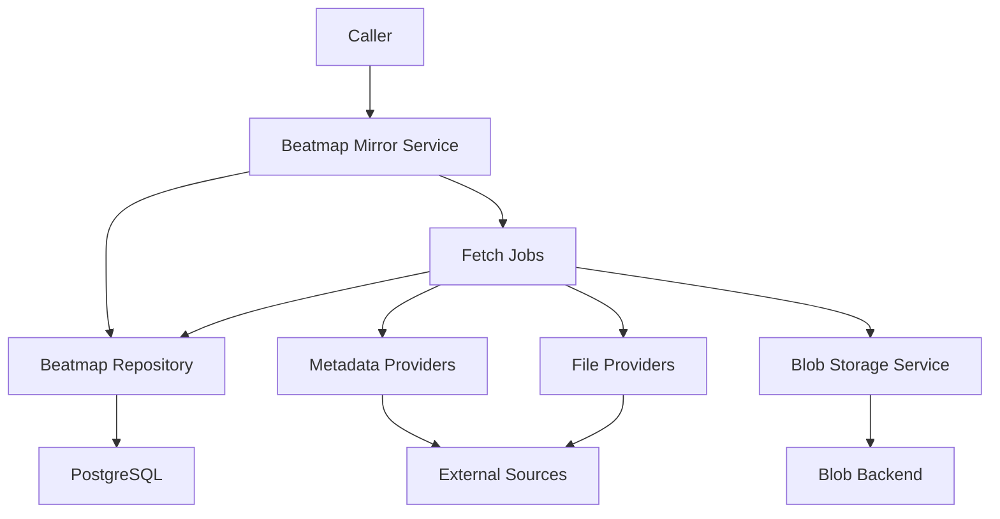
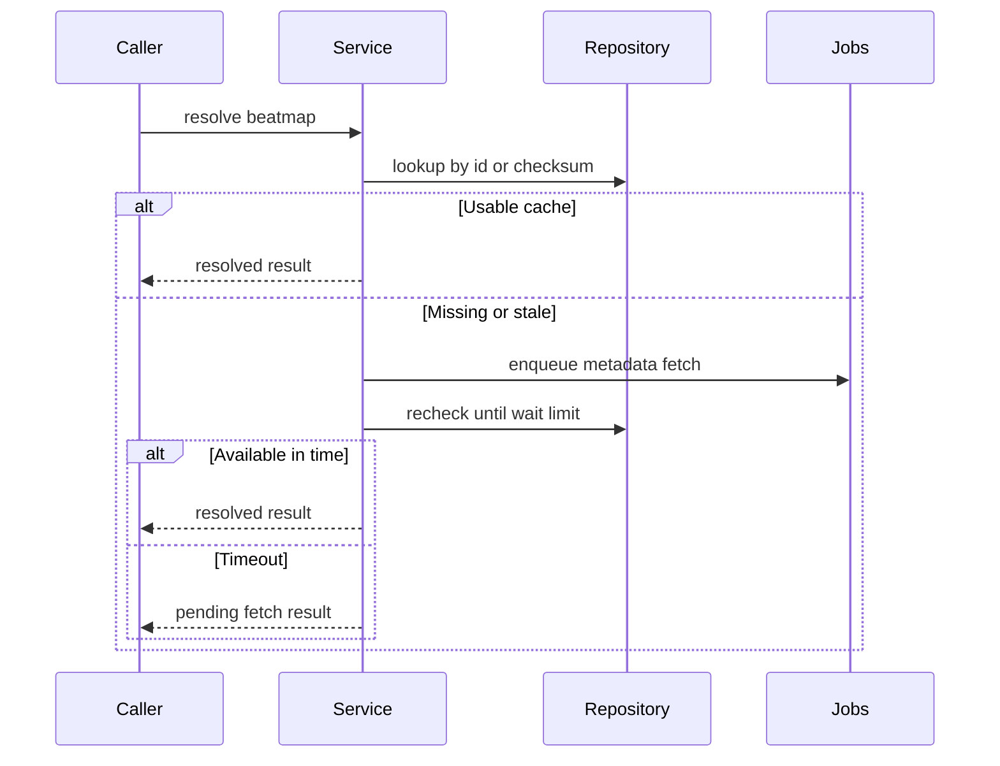
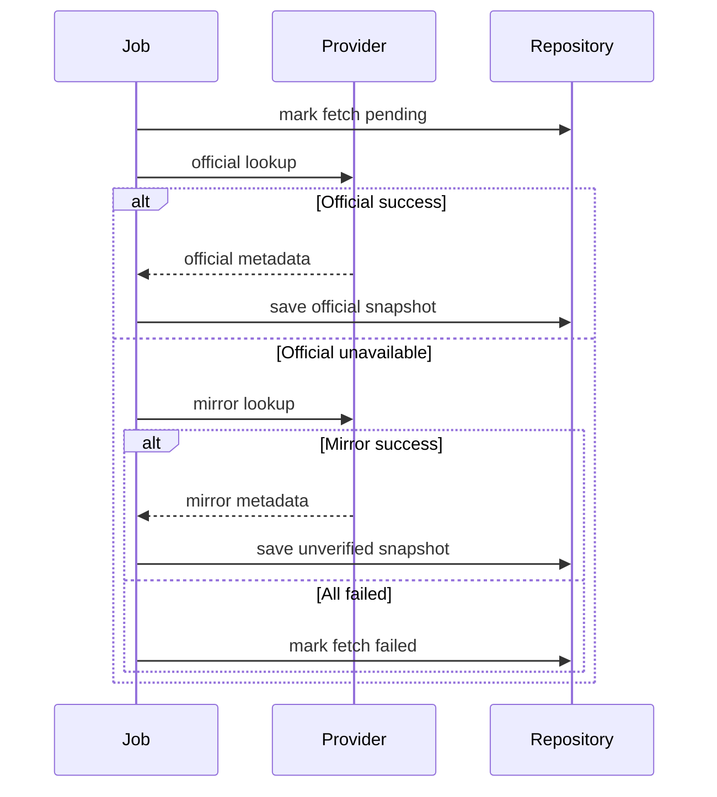
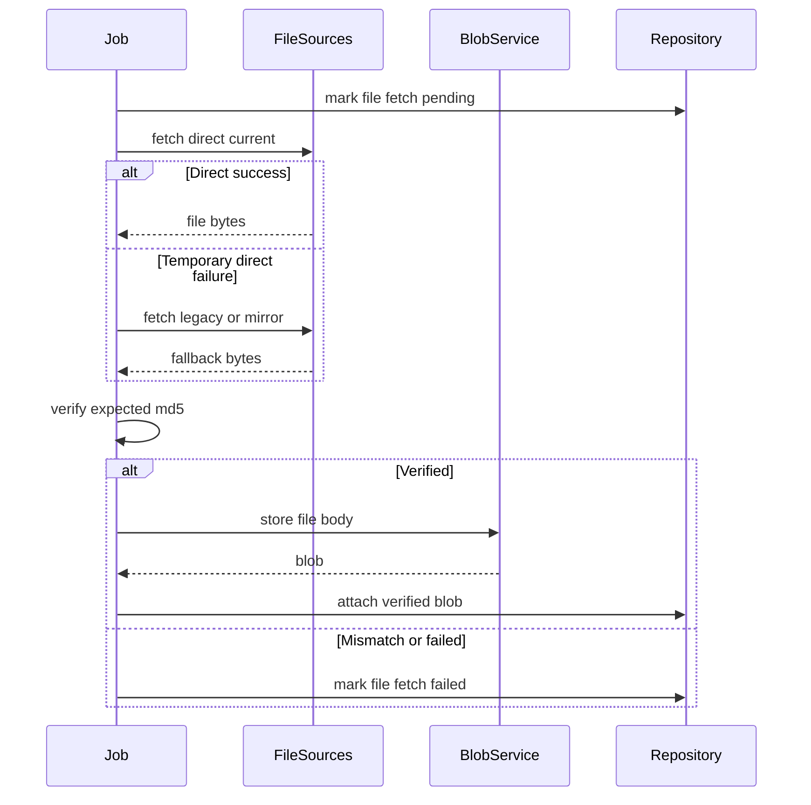
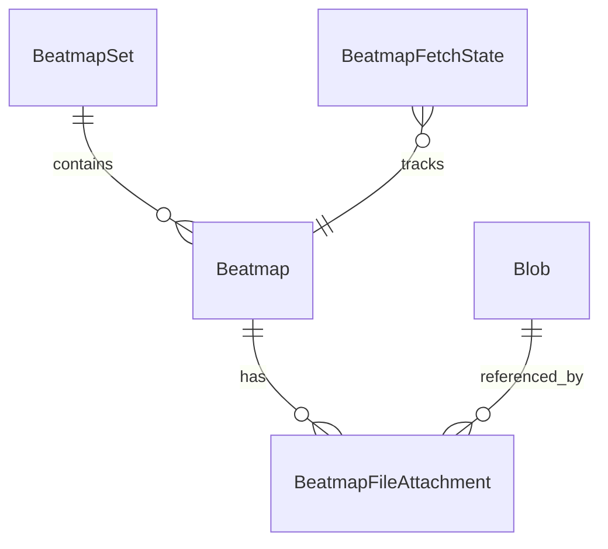
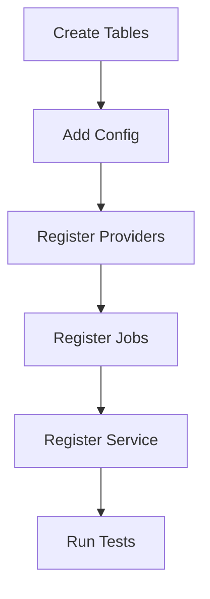

# Design Document

## Overview

This feature delivers a shared Beatmap Mirror Service for Athena score submission, leaderboard, rank management, WebUI, and future lazer workflows. It resolves beatmap metadata and `.osu` files through a cache-first service, treats official osu! API data as authoritative, uses mirror data only as configured fallback, and exposes a stable eligibility projection to downstream scoring features.

The design adds beatmap domain models, repository contracts, SQLAlchemy and in-memory repositories, provider ports for official API and file sources, taskiq jobs for metadata and `.osu` fetches, and beatmap-specific `.osu` attachment records that reference `blob-storage`.

### Goals

- Resolve beatmaps by beatmap id, beatmapset id, and checksum/md5.
- Preserve source priority: official API metadata first, mirror metadata as fallback, verified file bodies only.
- Store `.osu` file bodies through `blob-storage` and keep beatmap-specific attachment metadata in this spec.
- Separate official status from local override status and expose effective status.
- Provide score and leaderboard eligibility without moving score-submission behavior into this feature.

### Non-Goals

- Score payload parsing, score persistence, PP calculation, leaderboard update, and Bancho score result formatting.
- BanchoBot rank/request commands, WebUI rank/request screens, and rank request approval queues.
- Replay, screenshot, image upload, or osz archive extraction implementation.
- A hard dependency on a GPL or AGPL osu! API wrapper before license compatibility is approved.
- Memory cache implementation. Database cache is the source of truth for this spec.

## Boundary Commitments

### This Spec Owns

- Beatmap and beatmapset metadata models and persistence.
- Checksum/md5 lookup for beatmaps.
- Official status, local override status, and effective status semantics.
- Eligibility projection for score-submission and leaderboard consumers.
- `.osu` file fetch state and beatmap file attachment records.
- Source priority and fallback behavior for metadata and `.osu` file retrieval.
- Idempotent metadata and file fetch jobs.
- Beatmap source, fetch, checksum, and eligibility diagnostics.

### Out of Boundary

- Shared blob storage internals, physical storage backend implementation, and blob lifecycle policy.
- Score submission payload lifecycle, pending score retry, PP calculation, and leaderboard writes.
- User-facing APIs, WebUI forms, BanchoBot commands, and permission checks for rank changes.
- Full osu!direct implementation and beatmapset `.osz` download extraction.
- General-purpose mirror catalog or search UX.

### Allowed Dependencies

- `blob-storage` Blob Storage Service for `.osu` file bodies.
- `AppConfig` for source credentials, URL templates, trust policy, and timing settings.
- SQLAlchemy async repositories and Alembic migrations for persistence.
- taskiq job registration and worker lifecycle for background fetches.
- Existing `httpx` dependency for direct file downloads and fallback HTTP if no approved API library is selected.
- A future approved Python osu! API client, used only behind provider adapters.
- Existing structlog logging conventions.

### Revalidation Triggers

- Changes to `BeatmapMirrorService` result shapes or eligibility fields.
- Changes to status enum values, local override rules, or Approved handling.
- Changes to `.osu` file source priority or fallback trigger semantics.
- Changes to `beatmaps`, `beatmapsets`, `beatmap_file_attachments`, or fetch state ownership.
- Changes to `blob-storage` stream write contracts used by `.osu` file attachment.
- Any direct dependency on a third-party osu! API client with unresolved license compatibility.

## Architecture

### Existing Architecture Analysis

Athena already uses typed dataclass domain models, Protocol repositories, SQLAlchemy implementations, in-memory test implementations, a lightweight DI container, taskiq jobs, and pydantic-settings configuration. Beatmap mirror follows those patterns rather than introducing a separate subsystem.

The current codebase has no beatmap domain or repository implementation. Existing beatmap references are limited to Bancho protocol status fields such as `beatmap_md5` and `beatmap_id`.

### Architecture Pattern & Boundary Map

**Architecture Integration**:
- Selected pattern: ports and adapters with a domain service and taskiq batch jobs.
- Domain boundaries: beatmap metadata/status/file attachment are owned here; score and rank workflows consume this feature.
- Existing patterns preserved: `AppConfig`, repository Protocols, SQLAlchemy models, in-memory tests, taskiq job registry, and structlog diagnostics.
- New components rationale: provider ports isolate official API and mirror behavior; repository owns cache state; service owns status/eligibility rules.
- Steering compliance: services and jobs depend on repository interfaces, not SQLAlchemy models or sessions.



### Dependency Direction

Allowed import direction for new beatmap files:

```text
domain -> repositories.interfaces -> infrastructure.providers -> services -> jobs/composition
```

Domain modules do not import repositories, providers, services, infrastructure, or transports. Services depend on repository/provider Protocols and blob service contracts. Jobs resolve worker runtime services and do not import SQLAlchemy models or database sessions directly.

### Technology Stack

| Layer | Choice / Version | Role in Feature | Notes |
|-------|------------------|-----------------|-------|
| Backend / Services | Python 3.14+ | Domain dataclasses, Protocols, async service contracts | Existing steering |
| Data / Storage | SQLAlchemy 2 async + PostgreSQL | Beatmap cache, status, attachment, and fetch state persistence | Alembic migration required |
| Data / Storage | `blob-storage` | `.osu` file body storage | Upstream spec dependency |
| External API | Provider adapter over approved client or `httpx` | Official metadata lookup and direct `.osu` downloads | Library choice gated by license |
| Jobs | taskiq + taskiq-redis | Metadata and `.osu` file fetch jobs | Existing worker model |
| Configuration | pydantic-settings `AppConfig` | Credentials, URL templates, source toggles, trust policy | Startup validation required |
| Observability | structlog | Source, fetch, checksum, fallback diagnostics | Existing logging stack |

## File Structure Plan

### Directory Structure

```text
src/osu_server/
├── domain/
│   └── beatmap.py
├── repositories/
│   ├── interfaces/
│   │   └── beatmap_repository.py
│   ├── memory/
│   │   └── beatmap_repository.py
│   └── sqlalchemy/
│       ├── beatmap_repository.py
│       └── models/
│           └── beatmap.py
├── infrastructure/
│   └── beatmaps/
│       ├── __init__.py
│       ├── errors.py
│       ├── interfaces.py
│       ├── providers.py
│       ├── status_mapping.py
│       └── file_sources.py
├── services/
│   ├── beatmap_mirror_service.py
│   └── beatmap_eligibility.py
├── jobs/
│   └── beatmap_fetch.py
└── composition/
    └── worker_runtime.py

alembic/versions/
└── 20260604_2001_create_beatmap_mirror_tables.py

tests/
├── unit/
│   ├── domain/test_beatmap.py
│   ├── infrastructure/test_beatmap_providers.py
│   ├── repositories/test_beatmap_repository_memory.py
│   ├── services/test_beatmap_eligibility.py
│   └── services/test_beatmap_mirror_service.py
├── integration/
│   └── test_beatmap_repository_sqlalchemy.py
└── factories/
    └── beatmap.py
```

### Modified Files

- `src/osu_server/config.py` - add official API credential fields, source toggles, `.osu` file URL templates, mirror trust policy, and refresh timing settings.
- `src/osu_server/composition/service_registry.py` - register beatmap repositories, providers, and `BeatmapMirrorService`.
- `src/osu_server/composition/worker_runtime.py` - add worker-side beatmap mirror runtime creation.
- `src/osu_server/jobs/__init__.py` - import and register `osu_server.jobs.beatmap_fetch`.
- `src/osu_server/repositories/interfaces/__init__.py` - export beatmap repository Protocols if this package continues exporting repository contracts.
- `src/osu_server/repositories/memory/__init__.py` - export in-memory beatmap repository if consistent with existing package exports.
- `src/osu_server/repositories/sqlalchemy/models/__init__.py` - import beatmap ORM models for Alembic discovery.
- `tests/factories/config.py` - add typed config factory defaults for beatmap mirror fields.
- `pyproject.toml` - add an osu! API client dependency only after license approval; no change is required if the initial adapter uses existing `httpx`.

## System Flows

### Cache-First Resolve



Bounded wait rechecks persisted state without holding a transaction or database connection across the wait.

### Metadata Fetch



Official refresh updates official status and metadata but does not remove local overrides.

### `.osu` File Fetch



Fallback trigger candidates are rate limit, timeout, upstream 5xx, and connection errors. A not-found response does not automatically use mirror fallback in the first design.

## Requirements Traceability

| Requirement | Summary | Components | Interfaces | Flows |
|-------------|---------|------------|------------|-------|
| 1.1, 1.2, 1.3, 1.4, 1.5 | Resolve by id, set id, checksum, and return identity | `BeatmapMirrorService`, `BeatmapRepository`, `Beatmap`, `BeatmapSet` | `resolve_by_beatmap_id`, `resolve_by_beatmapset_id`, `resolve_by_checksum` | Cache-First Resolve |
| 2.1, 2.2, 2.3, 2.4, 2.5 | Cache-first, stale handling, bounded wait | `BeatmapMirrorService`, `BeatmapFetchState`, `FetchBeatmapMetadataJob` | repository lookup and fetch state methods | Cache-First Resolve |
| 3.1, 3.2, 3.3, 3.4, 3.5 | Source priority and verification state | `CompositeBeatmapMetadataProvider`, `BeatmapSource`, `BeatmapRepository` | metadata provider contract | Metadata Fetch |
| 4.1, 4.2, 4.3, 4.4, 4.5, 4.6 | Provider configuration and fake sources | `AppConfig`, provider factory, fake providers | config validation, provider contracts | Metadata Fetch, File Fetch |
| 5.1, 5.2, 5.3, 5.4 | Mirror trust policy | `BeatmapEligibilityService`, `MirrorTrustPolicy`, `BeatmapMirrorService` | eligibility projection | Metadata Fetch |
| 6.1, 6.2, 6.3, 6.4, 6.5, 6.6, 6.7, 6.8, 6.9, 6.10 | `.osu` file status, storage, checksum, fallback | `FetchBeatmapFileJob`, `CompositeBeatmapFileProvider`, `BeatmapFileAttachment`, Blob Storage Service | file provider contract, blob service use | `.osu` File Fetch |
| 7.1, 7.2, 7.3, 7.4, 7.5 | Fetch state reporting | `BeatmapResolveResult`, `BeatmapFetchState`, `BeatmapRepository` | result value objects | Cache-First Resolve |
| 8.1, 8.2, 8.3, 8.4, 8.5 | Freshness policy by status | `BeatmapFreshnessPolicy`, `BeatmapMirrorService` | `next_refresh_at`, `is_stale` | Cache-First Resolve |
| 9.1, 9.2, 9.3, 9.4, 9.5 | Official status and local override | `Beatmap`, `BeatmapStatusResolver`, `BeatmapRepository` | status resolver and repository update methods | Metadata Fetch |
| 10.1, 10.2, 10.3, 10.4 | Approved import and local rejection | `BeatmapRankStatus`, `LocalBeatmapStatus`, `BeatmapStatusResolver` | `validate_local_override` | Metadata Fetch |
| 11.1, 11.2, 11.3, 11.4, 11.5, 11.6 | Score eligibility projection | `BeatmapEligibilityService`, `BeatmapEligibility` | `evaluate` | Cache-First Resolve |
| 12.1, 12.2, 12.3, 12.4, 12.5 | Initial eligibility rules | `BeatmapEligibilityService`, `MirrorTrustPolicy` | `evaluate` | Cache-First Resolve |
| 13.1, 13.2, 13.3, 13.4 | Failed score eligibility | `BeatmapEligibilityService`, `ScoreKind` | failed score eligibility evaluation | Cache-First Resolve |
| 14.1, 14.2, 14.3, 14.4 | Idempotent fetch behavior | `BeatmapRepository`, `BeatmapFetchState`, fetch jobs | `try_mark_fetch_pending`, uniqueness constraints | Metadata Fetch, `.osu` File Fetch |
| 15.1, 15.2, 15.3, 15.4, 15.5 | Downstream boundary | all beatmap components | no score or UI contracts | All flows |
| 16.1, 16.2, 16.3, 16.4, 16.5, 16.6 | Diagnostics | providers, jobs, service | structured logs and error results | Metadata Fetch, `.osu` File Fetch |

## Components and Interfaces

| Component | Domain/Layer | Intent | Req Coverage | Key Dependencies | Contracts |
|-----------|--------------|--------|--------------|------------------|-----------|
| `Beatmap`, `BeatmapSet` | Domain | Represent metadata, status, and identity | 1, 3, 7, 8, 9, 10 | none | State |
| `BeatmapStatusResolver` | Domain | Derive effective status and validate overrides | 9, 10 | none | Service |
| `BeatmapEligibilityService` | Service | Project status into score/leaderboard eligibility | 5, 11, 12, 13 | `BeatmapStatusResolver` P0 | Service |
| `BeatmapRepository` | Repository | Persist metadata, attachments, and fetch state | 1, 2, 6, 7, 8, 9, 14 | SQLAlchemy or memory P0 | State |
| `BeatmapMetadataProvider` | Infrastructure | Fetch normalized metadata from official or mirror sources | 3, 4, 16 | external API P1 | Service |
| `BeatmapFileProvider` | Infrastructure | Fetch `.osu` bodies by source priority | 4, 6, 16 | httpx P0, mirror URLs P1 | Service |
| `BeatmapMirrorService` | Service | Caller-facing resolver and bounded wait coordinator | 1, 2, 5, 7, 8, 11, 15 | repository P0, broker P0 | Service |
| `FetchBeatmapMetadataJob` | Jobs | Idempotent background metadata fetch | 2, 3, 7, 8, 9, 14, 16 | provider P0, repository P0 | Batch |
| `FetchBeatmapFileJob` | Jobs | Idempotent `.osu` fetch, verification, blob attachment | 6, 7, 14, 16 | file provider P0, blob service P0 | Batch |

### Domain Layer

#### Beatmap and BeatmapSet

| Field | Detail |
|-------|--------|
| Intent | Domain entities for beatmapset snapshots and beatmap difficulty metadata |
| Requirements | 1.1, 1.2, 1.3, 1.5, 3.5, 7.1, 8.4, 9.1, 10.4 |

**Responsibilities & Constraints**
- Represent persisted metadata from official and fallback sources.
- Keep `official_status`, `official_status_source`, `official_status_verified`, `local_status_override`, and derived `effective_status` conceptually separate.
- Store checksum/md5 as beatmap identity, not as blob identity.
- Do not store `.osu` file bytes.
- Do not import provider library types.

**Dependencies**
- Inbound: `BeatmapMirrorService`, repositories, eligibility service - uses domain state (P0).
- Outbound: none.

**Contracts**: Service [ ] / API [ ] / Event [ ] / Batch [ ] / State [x]

##### State Management
- State model: dataclasses with slots.
- Persistence & consistency: repository reconstructs complete domain objects from SQLAlchemy or memory storage.
- Concurrency strategy: repository uniqueness on beatmap id and checksum protects identity.

#### BeatmapStatusResolver

| Field | Detail |
|-------|--------|
| Intent | Apply official/local status rules and reject invalid local values |
| Requirements | 9.1, 9.2, 9.3, 9.4, 9.5, 10.1, 10.2, 10.3, 10.4 |

**Responsibilities & Constraints**
- Derives effective status from local override when present, otherwise official status.
- Rejects `Approved` as a local override value.
- Preserves `Approved` as an official status and treats it like `Ranked` for ranked PP eligibility.

**Dependencies**
- Inbound: `BeatmapEligibilityService`, `BeatmapMirrorService`, repository validation paths (P0).
- Outbound: none.

**Contracts**: Service [x] / API [ ] / Event [ ] / Batch [ ] / State [ ]

##### Service Interface

```python
class BeatmapStatusResolver(Protocol):
    def effective_status(self, beatmap: Beatmap) -> BeatmapRankStatus: ...
    def validate_local_override(self, status: LocalBeatmapStatus | None) -> None: ...
```

- Preconditions: official status and local override values are parsed into Athena enums.
- Postconditions: `Approved` never appears as a local override.
- Invariants: official refresh does not remove local override.

### Service Layer

#### BeatmapEligibilityService

| Field | Detail |
|-------|--------|
| Intent | Convert effective status and source trust into score and leaderboard eligibility |
| Requirements | 5.1, 5.2, 5.3, 5.4, 11.1, 11.2, 11.3, 11.4, 11.5, 11.6, 12.1, 12.2, 12.3, 12.4, 12.5, 13.1, 13.2, 13.3, 13.4 |

**Responsibilities & Constraints**
- Returns `accepts_scores`, `has_leaderboard`, `awards_ranked_pp`, `awards_loved_pp`, `requires_osu_file_for_pp`, `is_officially_verified`, and failed score eligibility.
- Applies mirror trust policy. Default denies eligibility when only untrusted mirror status is available.
- Does not calculate PP or update score state.

**Dependencies**
- Inbound: `BeatmapMirrorService`, downstream `score-submission` later (P0).
- Outbound: `BeatmapStatusResolver` - effective status and override validation (P0).
- External: none.

**Contracts**: Service [x] / API [ ] / Event [ ] / Batch [ ] / State [ ]

##### Service Interface

```python
@dataclass(slots=True, frozen=True)
class BeatmapEligibility:
    accepts_scores: bool
    has_leaderboard: bool
    awards_ranked_pp: bool
    awards_loved_pp: bool
    requires_osu_file_for_pp: bool
    is_officially_verified: bool
    accepts_failed_scores: bool
    denial_reason: str | None

class BeatmapEligibilityService(Protocol):
    def evaluate(self, beatmap: Beatmap, *, mirror_trust_enabled: bool) -> BeatmapEligibility: ...
```

- Preconditions: beatmap has a known effective status or `Unknown`.
- Postconditions: failed scores never become leaderboard or PP eligible.
- Invariants: `Loved` never awards ranked PP; `Qualified` never awards PP.

#### BeatmapMirrorService

| Field | Detail |
|-------|--------|
| Intent | Resolve beatmaps for callers and coordinate bounded wait and fetch enqueue |
| Requirements | 1.1, 1.2, 1.3, 1.4, 1.5, 2.1, 2.2, 2.3, 2.4, 2.5, 5.1, 5.2, 5.3, 5.4, 7.1, 7.2, 7.3, 7.4, 7.5, 8.1, 8.2, 8.3, 8.4, 8.5, 11.1, 11.2, 11.3, 11.4, 11.5, 11.6, 15.1, 15.2, 15.3, 15.4, 15.5 |

**Responsibilities & Constraints**
- Provides cache-first lookup by beatmap id, beatmapset id, and checksum.
- Returns structured metadata/file fetch state.
- Enqueues metadata or file fetch jobs when records are missing, stale, mirror-sourced, or file-missing.
- Supports bounded wait without holding database sessions or transactions open.
- Does not parse scores, format Bancho responses, or enqueue S2C packets.

**Dependencies**
- Inbound: future score-submission, rank-management, WebUI, BanchoBot features (P0).
- Outbound: `BeatmapRepository`, `BeatmapEligibilityService`, taskiq broker (P0).
- External: none directly.

**Contracts**: Service [x] / API [ ] / Event [ ] / Batch [ ] / State [ ]

##### Service Interface

```python
@dataclass(slots=True, frozen=True)
class BeatmapResolveOptions:
    require_osu_file: bool = False
    wait_timeout_seconds: float = 0.0
    force_refresh: bool = False

@dataclass(slots=True, frozen=True)
class BeatmapResolveResult:
    beatmap: Beatmap | None
    beatmapset: BeatmapSet | None
    eligibility: BeatmapEligibility | None
    metadata_status: BeatmapMetadataStatus
    file_status: BeatmapFileStatus
    source: BeatmapSource | None
    verified: bool
    last_fetched_at: datetime | None
    next_refresh_at: datetime | None
    reason: str | None

class BeatmapMirrorService(Protocol):
    async def resolve_by_beatmap_id(
        self, beatmap_id: int, options: BeatmapResolveOptions
    ) -> BeatmapResolveResult: ...

    async def resolve_by_beatmapset_id(
        self, beatmapset_id: int, options: BeatmapResolveOptions
    ) -> BeatmapSetResolveResult: ...

    async def resolve_by_checksum(
        self, checksum_md5: str, options: BeatmapResolveOptions
    ) -> BeatmapResolveResult: ...
```

- Preconditions: ids are positive and checksum is a lowercase or normalizable md5 hex string.
- Postconditions: missing data returns pending or failed state, never unrelated metadata.
- Invariants: service result is independent of external provider library types.

### Repository Layer

#### BeatmapRepository

| Field | Detail |
|-------|--------|
| Intent | Persist beatmap cache, file attachment, and fetch state |
| Requirements | 1.1, 1.2, 1.3, 1.4, 1.5, 2.1, 2.2, 2.3, 2.4, 2.5, 6.1, 6.2, 6.3, 6.4, 6.5, 7.1, 7.2, 7.3, 7.4, 7.5, 8.1, 8.2, 8.3, 8.4, 9.1, 9.2, 9.3, 9.4, 9.5, 14.1, 14.2, 14.3, 14.4 |

**Responsibilities & Constraints**
- Stores beatmapsets and beatmaps as normalized records.
- Maintains checksum lookup.
- Maintains append-only `.osu` attachment records referencing blobs.
- Maintains fetch state for metadata and file jobs.
- Provides compare-and-set style pending markers for idempotent fetches.

**Dependencies**
- Inbound: `BeatmapMirrorService`, fetch jobs (P0).
- Outbound: SQLAlchemy session factory or memory state depending on implementation (P0).

**Contracts**: Service [ ] / API [ ] / Event [ ] / Batch [ ] / State [x]

##### State Management
- State model: repository returns domain dataclasses plus attachment/fetch state value objects.
- Persistence & consistency: each repository method owns a short transaction.
- Concurrency strategy: unique constraints on beatmap id, checksum, attachment pair, and fetch target prevent duplicate conflicting results.

##### Repository Interface

```python
class BeatmapRepository(Protocol):
    async def get_beatmap(self, beatmap_id: int) -> Beatmap | None: ...
    async def get_beatmapset(self, beatmapset_id: int) -> BeatmapSet | None: ...
    async def get_beatmap_by_checksum(self, checksum_md5: str) -> Beatmap | None: ...
    async def save_beatmapset_snapshot(self, snapshot: BeatmapsetSnapshot) -> None: ...
    async def get_current_file_attachment(self, beatmap_id: int) -> BeatmapFileAttachment | None: ...
    async def attach_osu_file(self, attachment: NewBeatmapFileAttachment) -> BeatmapFileAttachment: ...
    async def get_fetch_state(self, target: BeatmapFetchTarget) -> BeatmapFetchState | None: ...
    async def try_mark_fetch_pending(self, target: BeatmapFetchTarget, now: datetime) -> bool: ...
    async def mark_fetch_succeeded(self, target: BeatmapFetchTarget, now: datetime) -> None: ...
    async def mark_fetch_failed(self, target: BeatmapFetchTarget, reason: str, now: datetime) -> None: ...
```

### Infrastructure Provider Layer

#### BeatmapMetadataProvider

| Field | Detail |
|-------|--------|
| Intent | Normalize official and mirror metadata into Athena snapshots |
| Requirements | 3.1, 3.2, 3.3, 3.4, 3.5, 4.1, 4.2, 4.3, 4.4, 16.1, 16.2, 16.4 |

**Responsibilities & Constraints**
- Exposes provider-neutral lookup methods.
- Maps external status values to Athena `BeatmapRankStatus`.
- Marks mirror data as unverified.
- Does not persist data directly.

**Dependencies**
- Inbound: `FetchBeatmapMetadataJob` (P0).
- Outbound: official API client adapter, mirror adapter, `httpx` fallback adapter (P1).
- External: osu! API v2/v1, optional mirror metadata source (P1).

**Contracts**: Service [x] / API [ ] / Event [ ] / Batch [ ] / State [ ]

##### Service Interface

```python
class BeatmapMetadataProvider(Protocol):
    async def lookup_by_beatmap_id(self, beatmap_id: int) -> BeatmapsetSnapshot | None: ...
    async def lookup_by_beatmapset_id(self, beatmapset_id: int) -> BeatmapsetSnapshot | None: ...
    async def lookup_by_checksum(self, checksum_md5: str) -> BeatmapsetSnapshot | None: ...
```

- Preconditions: provider configuration has passed startup validation.
- Postconditions: returned snapshot contains source and verification metadata.
- Invariants: provider exceptions are normalized before leaving the provider layer.

#### BeatmapFileProvider

| Field | Detail |
|-------|--------|
| Intent | Fetch `.osu` file bytes using direct and mirror source priority |
| Requirements | 4.5, 4.6, 6.2, 6.3, 6.4, 6.6, 6.7, 6.8, 6.9, 6.10, 16.3, 16.4, 16.6 |

**Responsibilities & Constraints**
- Attempts `https://osu.ppy.sh/osu/{beatmap_id}` first.
- Attempts `https://old.ppy.sh/osu/{beatmap_id}` if the primary direct source is temporarily unavailable.
- Attempts configured community URL template such as `https://catboy.best/osu/{beatmap_id}` after direct sources fail with configured fallback conditions.
- Uses GET for mirror checks because `catboy.best` returned `.osu` content for GET while HEAD returned 404.
- Does not attach unverified bytes.

**Dependencies**
- Inbound: `FetchBeatmapFileJob` (P0).
- Outbound: `httpx` client (P0).
- External: osu! direct endpoints and configured mirror URLs (P1).

**Contracts**: Service [x] / API [ ] / Event [ ] / Batch [ ] / State [ ]

##### Service Interface

```python
@dataclass(slots=True, frozen=True)
class OsuFileFetchResult:
    beatmap_id: int
    body: bytes
    source: BeatmapFileSource
    original_filename: str | None

class BeatmapFileProvider(Protocol):
    async def fetch_osu_file(self, beatmap_id: int) -> OsuFileFetchResult: ...
```

- Preconditions: beatmap id is positive.
- Postconditions: body is returned only for successful HTTP 200 text/plain-like responses.
- Invariants: md5 verification is performed by the fetch job before blob attachment.

### Jobs Layer

#### FetchBeatmapMetadataJob

| Field | Detail |
|-------|--------|
| Intent | Fetch and persist metadata snapshots idempotently |
| Requirements | 2.2, 2.3, 3.1, 3.2, 3.3, 3.4, 3.5, 7.1, 7.3, 7.4, 8.1, 8.2, 8.3, 8.4, 9.3, 14.1, 14.3, 14.4, 16.1, 16.2, 16.4 |

**Responsibilities & Constraints**
- Marks fetch state pending only when no equivalent fetch is already pending.
- Tries official providers before mirror metadata providers.
- Saves official snapshots without clearing local overrides.
- Saves mirror snapshots as unverified.
- Marks failure state with normalized reason when all sources fail.

**Dependencies**
- Inbound: taskiq broker, `BeatmapMirrorService` enqueue (P0).
- Outbound: `BeatmapRepository`, `BeatmapMetadataProvider` (P0).

**Contracts**: Service [ ] / API [ ] / Event [ ] / Batch [x] / State [ ]

##### Batch / Job Contract
- Trigger: service enqueue for missing, stale, mirror-sourced, or explicit refresh.
- Input: lookup kind, lookup value, force flag.
- Output: persisted beatmapset snapshot or failed fetch state.
- Idempotency & recovery: fetch target uniqueness and pending state prevent duplicate conflicting writes.

#### FetchBeatmapFileJob

| Field | Detail |
|-------|--------|
| Intent | Fetch, verify, store, and attach `.osu` file bodies |
| Requirements | 6.1, 6.2, 6.3, 6.4, 6.5, 6.6, 6.7, 6.8, 6.9, 6.10, 7.2, 7.3, 14.2, 14.3, 14.4, 16.3, 16.4, 16.6 |

**Responsibilities & Constraints**
- Requires expected md5 from beatmap metadata before attaching a file.
- Verifies md5 before writing beatmap attachment state.
- Stores body through `blob-storage`.
- Records file source and original filename when known.
- Marks checksum mismatch and source failures as diagnostics.

**Dependencies**
- Inbound: taskiq broker, `BeatmapMirrorService` enqueue (P0).
- Outbound: `BeatmapRepository`, `BeatmapFileProvider`, Blob Storage Service (P0).

**Contracts**: Service [ ] / API [ ] / Event [ ] / Batch [x] / State [ ]

##### Batch / Job Contract
- Trigger: service enqueue for file-missing or explicit file refresh.
- Input: beatmap id, expected md5, force flag.
- Output: current verified file attachment or failed file fetch state.
- Idempotency & recovery: duplicate verified `(beatmap_id, checksum_md5)` attachments return the existing attachment.

## Data Models

### Domain Model



Key domain values:

- `BeatmapRankStatus`: `Graveyard`, `Wip`, `Pending`, `Ranked`, `Approved`, `Qualified`, `Loved`, `NotSubmitted`, `Unknown`.
- `LocalBeatmapStatus`: `Graveyard`, `Wip`, `Pending`, `Ranked`, `Qualified`, `Loved`, `NotSubmitted`. `Approved` is excluded.
- `BeatmapSource`: `osu_api_v2`, `osu_api_v1`, `mirror`.
- `BeatmapMetadataStatus`: `fresh`, `stale`, `pending_fetch`, `failed`.
- `BeatmapFileStatus`: `available`, `pending_fetch`, `missing`, `failed`.
- `BeatmapFileSource`: `osu_current`, `osu_legacy`, `community_mirror`, `archive_extracted`.

### Logical Data Model

**Structure Definition**

- `beatmapsets`
  - One row per beatmapset id.
  - Stores title/artist/creator/source/status fields needed by downstream consumers.
  - Tracks metadata source, verification flag, last fetched time, and next refresh time.
- `beatmaps`
  - One row per beatmap id.
  - Belongs to one beatmapset.
  - Stores checksum md5, mode, difficulty name, difficulty parameters, official status fields, optional local override, last fetched time, and next refresh time.
- `beatmap_file_attachments`
  - Append-only domain attachment records.
  - References one beatmap and one blob.
  - Stores checksum md5, file source, original filename, fetched time, and verified time.
- `beatmap_fetch_states`
  - One row per fetch target, where target is metadata lookup or file lookup.
  - Stores pending/succeeded/failed state, attempt count, last error, and timestamps.

**Consistency & Integrity**

- `beatmaps.beatmap_id` is unique.
- `beatmaps.checksum_md5` is indexed and unique when present.
- `beatmap_file_attachments` has unique `(beatmap_id, checksum_md5)` to avoid duplicate attachments for the same file body.
- `beatmap_fetch_states` has unique `(target_type, target_key)`.
- Official metadata refresh cannot clear `local_status_override`.
- File attachment is written only after md5 verification and blob storage success.

### Physical Data Model

Exact SQLAlchemy types are implementation details, but the migration should create these tables:

- `beatmapsets`
  - `id` primary key.
  - `artist`, `title`, `creator`, optional unicode variants.
  - `official_status`, `official_status_source`, `official_status_verified`.
  - `last_fetched_at`, `next_refresh_at`, `created_at`, `updated_at`.
- `beatmaps`
  - `id` primary key.
  - `beatmapset_id` foreign key.
  - `checksum_md5`.
  - `mode`, `version`, `total_length`, `hit_length`, `max_combo`, `bpm`, `cs`, `od`, `ar`, `hp`, `difficulty_rating`.
  - `official_status`, `official_status_source`, `official_status_verified`, `local_status_override`.
  - `last_fetched_at`, `next_refresh_at`, `created_at`, `updated_at`.
- `beatmap_file_attachments`
  - `id` primary key.
  - `beatmap_id` foreign key.
  - `blob_id` foreign key to `blobs`.
  - `checksum_md5`, `source`, `original_filename`, `fetched_at`, `verified_at`, `created_at`.
- `beatmap_fetch_states`
  - `id` primary key.
  - `target_type`, `target_key`, `status`, `attempt_count`, `last_error`, `pending_since`, `last_attempted_at`, `updated_at`.

### Data Contracts & Integration

Provider responses are normalized into `BeatmapsetSnapshot` and `BeatmapSnapshot` before persistence. No provider-specific object crosses into repository, service, or domain state.

`blob-storage` integration uses `application/octet-stream` or `text/plain` content type for `.osu` bodies depending on blob service validation. Beatmap file attachment stores the domain checksum md5 independently from blob SHA-256.

## Error Handling

### Error Strategy

- Provider errors are normalized into source failure categories: configuration, unauthorized, rate_limited, timeout, temporary_unavailable, not_found, invalid_response, checksum_mismatch.
- Metadata lookup can return stale cached data with pending refresh when safe.
- File lookup cannot mark a file available unless checksum verification succeeds.
- Bounded wait timeout returns `pending_fetch`, not an exception, for normal caller flows.

### Error Categories and Responses

- User or caller errors: invalid id, invalid checksum format, unsupported local override value.
- Source errors: official API failure, mirror failure, direct file source rate limit, timeout, 5xx, or 404.
- Integrity errors: fetched `.osu` md5 mismatch.
- System errors: database unavailable, blob storage unavailable, worker runtime unavailable.

### Monitoring

Structured log event names should include:

- `beatmap_metadata_fetch_started`
- `beatmap_metadata_fetch_succeeded`
- `beatmap_metadata_fetch_failed`
- `beatmap_file_fetch_started`
- `beatmap_file_fetch_succeeded`
- `beatmap_file_fetch_failed`
- `beatmap_file_checksum_mismatch`
- `beatmap_source_rate_limited`
- `beatmap_mirror_fallback_used`
- `beatmap_eligibility_denied`

## Testing Strategy

### Unit Tests

- `BeatmapStatusResolver` rejects local `Approved`, preserves official `Approved`, and derives effective status from local override when present.
- `BeatmapEligibilityService` maps Ranked, Approved, Loved, Qualified, Pending, WIP, Graveyard, NotSubmitted, Unknown, and untrusted mirror states to eligibility flags.
- `BeatmapMirrorService` returns cached known beatmaps synchronously and enqueues fetch for missing, stale, file-missing, and mirror-sourced results.
- `BeatmapFileProvider` source priority handles current URL, legacy URL, configured mirror fallback, and excludes 404 from fallback unless configured later.
- `FetchBeatmapFileJob` rejects md5 mismatches and does not attach failed bytes.

### Integration Tests

- SQLAlchemy repository stores a beatmapset snapshot, resolves by beatmap id, beatmapset id, and checksum, and preserves local override through official refresh.
- SQLAlchemy repository enforces duplicate attachment idempotency for `(beatmap_id, checksum_md5)`.
- Fetch state transitions from pending to succeeded or failed without duplicate conflicting rows under repeated calls.
- Service registration resolves `BeatmapMirrorService` with in-memory repositories in test environment and SQLAlchemy repositories outside test.
- Worker runtime exposes beatmap fetch services to taskiq job adapters.

### E2E Tests

- Resolve missing beatmap by id with fake provider: service returns pending, job stores metadata, later resolve returns fresh result.
- Resolve beatmap requiring `.osu` file with fake file provider and fake blob service: file status transitions to available after checksum verification.
- Direct source rate limit with configured catboy-style mirror fallback: file fetch succeeds only after md5 verification and records mirror source.

### Performance and Load

- Repeated resolve of cached beatmaps should not call external providers.
- Concurrent missing lookups for the same target should create one pending fetch state and consistent results.
- Metadata fetch should prefer batch beatmapset persistence when a set lookup returns multiple beatmaps.

## Security Considerations

- API credentials are stored only in configuration and never logged.
- Provider logs must redact tokens, keys, and Authorization headers.
- Mirror trust is disabled by default for eligibility.
- Mirror-fetched `.osu` files are treated as untrusted bytes until md5 verification passes.
- Provider adapters must reject URL templates that do not use HTTPS unless tests explicitly provide fake local providers.

## Performance & Scalability

- Database cache is authoritative for normal resolve traffic.
- Memory cache is not required and is not part of this design.
- Stale mutable statuses trigger refresh, while stable Ranked, Approved, and Loved statuses avoid unnecessary external load.
- Bounded wait must not hold database connections or transactions while sleeping.
- Fetch jobs should use source retry/backoff for temporary failures, but fallback to mirrors only for configured temporary failure classes.

## Migration Strategy



The feature has no existing production beatmap data to migrate. Rollback removes the new service wiring and leaves new tables unused; destructive table rollback is handled by Alembic downgrade only.

## Open Questions and Design Risks

- Final Python osu! API client selection depends on license review. The design can start with provider ports and an `httpx` official adapter if no acceptable client is approved.
- Exact osu! API v1 fallback strategy needs confirmation if v1 requires an API key and the selected library does not support it.
- catboy.best is a viable `.osu` GET fallback candidate, but design should keep URL templates configurable.
- `blob-storage` must be implemented before beatmap mirror implementation can complete.
- Future score-submission result notifications should consume beatmap mirror results but must not add packet-queue responsibilities here.
