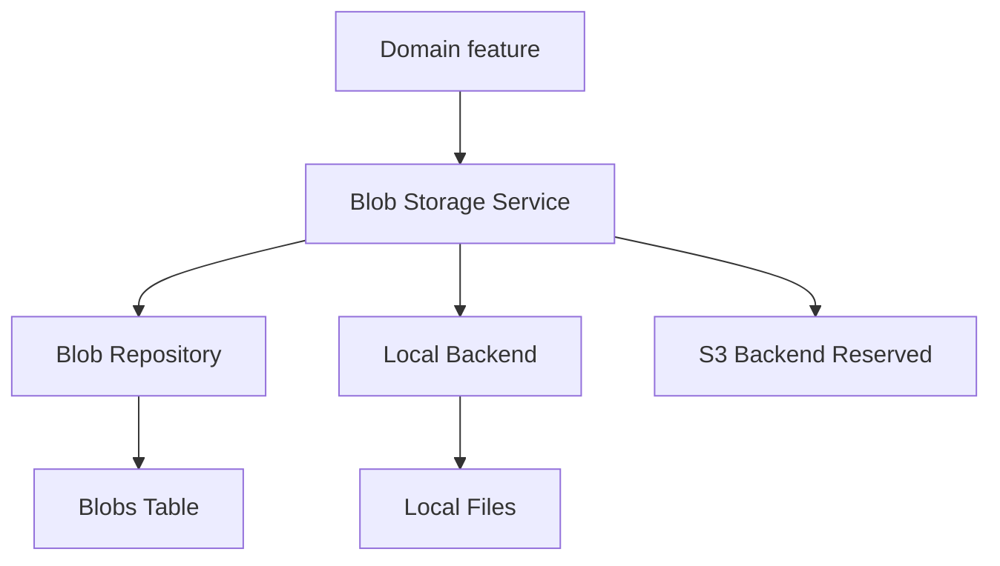
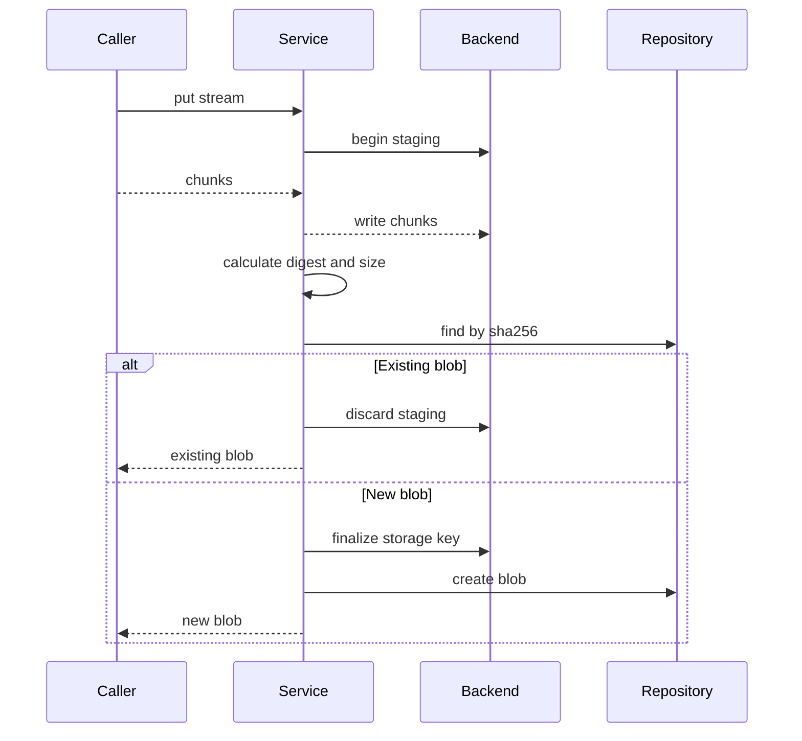
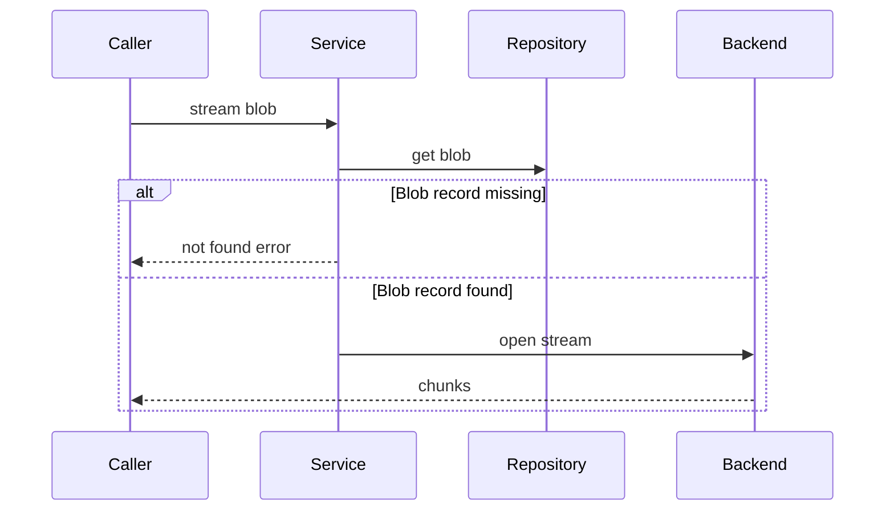
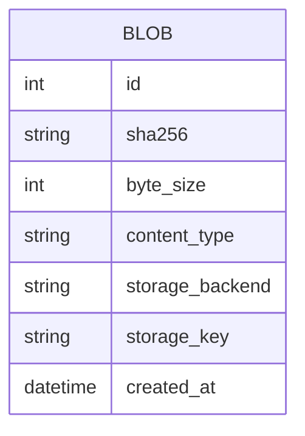

# Design Document

## Overview

This feature delivers a shared blob storage capability for Athena features that need durable file-like content. The first consumers are expected to be `beatmap-mirror` for `.osu` files and later score replay, screenshot, and image-upload features.

The design adds a content-addressed Blob Storage Service that owns immutable blob metadata and physical storage backend operations. Domain features keep their own attachment records, filenames, uploader identities, authorization rules, and domain relationships.

### Goals
- Provide Local-first blob storage with SHA-256 content addressing and deduplication.
- Expose stream-oriented read and write contracts while keeping small-data helpers for tests and small callers.
- Preserve a backend-neutral service contract so a future S3 backend can be added without changing consumers.
- Align with Athena's existing typed domain, repository, SQLAlchemy, Alembic, and DI patterns.

### Non-Goals
- No domain-specific attachment tables in this spec.
- No polymorphic attachment model.
- No end-user authorization decisions in blob storage.
- No physical deletion or garbage collection.
- No full S3 backend implementation.
- No WebUI upload flow or beatmap/replay/screenshot domain behavior.

## Boundary Commitments

### This Spec Owns
- The `Blob` domain entity and immutable blob metadata semantics.
- The `BlobRepository` contract and persistence implementation for shared blob records.
- The `BlobStorageBackend` contract and Local backend implementation.
- The `BlobStorageService` contract for stream writes, stream reads, deduplication, and small-data helpers.
- Blob storage configuration fields and startup validation.
- Alembic migration and ORM model for the shared `blobs` table.

### Out of Boundary
- Domain attachment tables such as `beatmap_file_attachments`, `score_replay_attachments`, or screenshot/image attachments.
- Domain metadata such as `original_filename`, `uploaded_by_user_id`, owner record IDs, and access policy.
- Polymorphic association infrastructure.
- User-facing upload/download endpoints.
- Authorization decisions for who can read a blob.
- Physical deletion, reference counting, and garbage collection.
- S3 object reads and writes in the first slice.

### Allowed Dependencies
- `AppConfig` for backend selection and storage configuration.
- Existing DI container and `register_services` composition root.
- SQLAlchemy async repository pattern and Alembic migrations.
- Standard-library filesystem, hashing, path, and temporary-file primitives.
- Existing test patterns: typed in-memory repositories, temp directories, and typed fakes.

### Revalidation Triggers
- Any change to `BlobStorageService` method signatures or error result shapes.
- Any change to `Blob` identity, immutability, or `sha256` uniqueness semantics.
- Any change that moves attachment metadata into the shared blob record.
- Any change that adds physical deletion or garbage collection.
- Any change that makes S3 selection silently fall back to Local.
- Any change to storage key derivation that affects downstream persisted blob references.

## Architecture

### Existing Architecture Analysis

Athena currently separates domain dataclasses, repository Protocols, SQLAlchemy implementations, in-memory test implementations, service orchestration, and composition-root wiring. The blob design extends that shape: domain objects stay framework-free, the repository owns blob metadata persistence, the backend owns physical bytes, and the service coordinates deduplication and stream semantics.

### Architecture Pattern & Boundary Map

**Architecture Integration**:
- Selected pattern: Ports and adapters with a small application service.
- Domain/feature boundaries: shared blob storage owns bytes and immutable metadata; downstream domains own attachments and access rules.
- Existing patterns preserved: `AppConfig`, DI registration, repository Protocols, SQLAlchemy models, Alembic migrations, in-memory test doubles.
- New components rationale: a storage backend port is necessary because Local exists now and S3 is an explicit future backend choice.
- Steering compliance: typed interfaces, repository pattern, SQLAlchemy isolation, and no raw DB access from services.



### Technology Stack

| Layer | Choice / Version | Role in Feature | Notes |
|-------|------------------|-----------------|-------|
| Backend / Services | Python 3.14+ | Typed domain, Protocols, async service contracts | Matches steering |
| Data / Storage | SQLAlchemy 2.0 async + PostgreSQL | Persist immutable blob metadata | Alembic migration required |
| Data / Storage | Local filesystem | First physical blob backend | Content-addressed paths |
| Infrastructure / Runtime | pydantic-settings via `AppConfig` | Backend selection and path settings | Startup validation |
| External reserved | Amazon S3 | Future backend | Recognized but unsupported in first implementation |

## File Structure Plan

### Directory Structure

```text
src/osu_server/
├── domain/
│   └── blob.py                         # Blob entity, BlobStorageBackendName, BlobError types
├── repositories/
│   ├── interfaces/
│   │   └── blob_repository.py          # BlobRepository Protocol
│   ├── memory/
│   │   └── blob_repository.py          # In-memory BlobRepository for tests
│   └── sqlalchemy/
│       ├── blob_repository.py          # SQLAlchemy BlobRepository implementation
│       └── models/
│           └── blob.py                 # BlobModel mapped to blobs table
├── infrastructure/
│   └── storage/
│       ├── __init__.py                 # Public storage exports
│       ├── interfaces.py               # BlobStorageBackend Protocol and stream type aliases
│       ├── local.py                    # LocalBlobStorageBackend
│       └── errors.py                   # Storage configuration and backend errors
├── services/
│   └── blob_storage_service.py         # BlobStorageService orchestration
└── composition/
    └── service_registry.py             # Registers repository, backend, service

alembic/versions/
└── 20260604_1846_create_blobs_table.py # Creates blobs table and indexes

tests/
├── unit/
│   ├── domain/test_blob.py
│   ├── infrastructure/test_local_blob_storage.py
│   ├── repositories/test_blob_repository_memory.py
│   └── services/test_blob_storage_service.py
├── integration/
│   └── test_blob_storage_sqlalchemy.py
└── factories/
    └── blob.py                         # Typed blob factories for tests
```

### Modified Files
- `src/osu_server/config.py` — Add blob storage backend, local directory, and S3-reserved configuration fields with validation.
- `src/osu_server/composition/service_registry.py` — Register `BlobRepository`, `BlobStorageBackend`, and `BlobStorageService`.
- `src/osu_server/repositories/sqlalchemy/models/__init__.py` — Import `BlobModel` for Alembic discovery.
- `tests/factories/config.py` — Add typed factory defaults for blob storage configuration.
- `tests/support/fakes.py` — Add typed fake backend only if tests need error injection beyond tempdir Local backend.

## System Flows

### Stream Write and Deduplication



The service calculates identity during streaming. The backend must not expose staged content until finalization succeeds.

### Stream Read



Authorization is intentionally absent from this flow. Callers perform access checks before invoking blob reads.

## Requirements Traceability

| Requirement | Summary | Components | Interfaces | Flows |
|-------------|---------|------------|------------|-------|
| 1.1, 1.2, 1.3, 1.4, 1.5 | Blob metadata creation, immutability, content type boundary | `Blob`, `BlobRepository`, `BlobStorageService` | `BlobRepository.create`, `BlobStorageService.put_stream` | Stream Write |
| 2.1, 2.2, 2.3, 2.4, 2.5 | SHA-256 addressing and deduplication | `BlobStorageService`, `BlobRepository`, `BlobStorageBackend` | `find_by_sha256`, `finalize_staging`, `discard_staging` | Stream Write |
| 3.1, 3.2, 3.3, 3.4, 3.5 | Local backend behavior and validation | `LocalBlobStorageBackend`, `AppConfig` | `validate_configuration`, backend stream methods | Stream Write, Stream Read |
| 4.1, 4.2, 4.3, 4.4 | S3-ready selection without implementation | `AppConfig`, backend factory, reserved backend interface | backend factory contract | N/A |
| 5.1, 5.2, 5.3, 5.4, 5.5 | Stream writes and helper parity | `BlobStorageService`, `BlobStorageBackend` | `put_stream`, `put_bytes`, staging methods | Stream Write |
| 6.1, 6.2, 6.3, 6.4 | Stream reads and helper parity | `BlobStorageService`, `BlobStorageBackend`, `BlobRepository` | `stream_read`, `read_bytes`, `open_read` | Stream Read |
| 7.1, 7.2, 7.3, 7.4 | Write-time integrity | `BlobStorageService` | `put_stream`, error results | Stream Write |
| 8.1, 8.2, 8.3, 8.4 | Append-only lifecycle | `BlobStorageService`, `BlobRepository` | no delete contract | Stream Write |
| 9.1, 9.2, 9.3, 9.4, 9.5 | Attachment boundary | `Blob`, downstream domain contracts | no shared attachment interface | N/A |
| 10.1, 10.2, 10.3 | Access boundary | `BlobStorageService`, downstream domain callers | trusted internal service contract | Stream Read |
| 11.1, 11.2, 11.3, 11.4 | Configuration, failure reporting, diagnostics | `AppConfig`, `BlobStorageService`, `LocalBlobStorageBackend` | typed errors, logging hooks | Stream Write, Stream Read |

## Components and Interfaces

| Component | Domain / Layer | Intent | Req Coverage | Key Dependencies | Contracts |
|-----------|----------------|--------|--------------|------------------|-----------|
| `Blob` | Domain | Immutable blob metadata entity | 1, 2, 7, 8, 9 | none | State |
| `BlobRepository` | Repository | Persist and retrieve blob metadata | 1, 2, 6, 8 | SQLAlchemy or memory implementation | Service, State |
| `BlobStorageBackend` | Infrastructure | Store and stream physical bytes | 3, 4, 5, 6, 11 | Local filesystem now, S3 later | Service |
| `LocalBlobStorageBackend` | Infrastructure | Local content-addressed file backend | 3, 5, 6, 11 | configured local directory | Service |
| `BlobStorageService` | Service | Coordinate writes, reads, deduplication, and errors | 1-11 | repository, backend, logger | Service |
| `AppConfig` blob fields | Configuration | Select backend and validate runtime prerequisites | 3, 4, 11 | pydantic-settings | State |

### Domain Layer

#### Blob

| Field | Detail |
|-------|--------|
| Intent | Immutable metadata for one stored blob body |
| Requirements | 1.1, 1.2, 1.3, 2.5, 7.1, 7.2, 8.3, 9.4 |

**Responsibilities & Constraints**
- Represents stored content, not a domain attachment.
- Owns `sha256`, `byte_size`, `content_type`, `storage_backend`, `storage_key`, and timestamps.
- Excludes `original_filename`, `uploaded_by_user_id`, and domain owner fields.
- `sha256` is lowercase hexadecimal and unique.

**Contracts**: Service [ ] / API [ ] / Event [ ] / Batch [ ] / State [x]

##### State Management
- State model: frozen or behaviorally immutable dataclass with slots.
- Persistence & consistency: created by repository; not updated after creation.
- Concurrency strategy: duplicate creation is resolved by repository unique constraint and service retry.

### Repository Layer

#### BlobRepository

| Field | Detail |
|-------|--------|
| Intent | Abstract persistence contract for shared blob records |
| Requirements | 1.1, 1.2, 2.2, 2.3, 6.2, 8.1, 8.3 |

**Responsibilities & Constraints**
- Finds blobs by ID and SHA-256.
- Creates blob records exactly once per SHA-256.
- Provides no update or delete operations in the first slice.
- Converts duplicate-create races into existing-blob results or a domain-level conflict that the service handles.

**Dependencies**
- Inbound: `BlobStorageService` — metadata lookup and creation (P0)
- Outbound: SQLAlchemy session factory or in-memory state — persistence (P0)

**Contracts**: Service [x] / API [ ] / Event [ ] / Batch [ ] / State [x]

##### Service Interface

```python
from typing import Protocol

class BlobRepository(Protocol):
    async def get_by_id(self, blob_id: int) -> Blob | None: ...
    async def get_by_sha256(self, sha256: str) -> Blob | None: ...
    async def create(self, blob: NewBlob) -> Blob: ...
```

- Preconditions: `NewBlob.sha256` is validated, `content_type` is non-empty, and storage key is backend-derived.
- Postconditions: `create` returns a persisted `Blob` or raises a duplicate conflict that can be resolved by `get_by_sha256`.
- Invariants: no repository update/delete contract exists in this feature.

### Infrastructure Layer

#### BlobStorageBackend

| Field | Detail |
|-------|--------|
| Intent | Backend-neutral contract for physical blob bytes |
| Requirements | 3.1, 3.2, 3.4, 4.4, 5.1, 5.4, 6.1, 6.4, 11.2, 11.3 |

**Responsibilities & Constraints**
- Accepts staged writes before SHA-256 final storage key is known.
- Finalizes staged content to a SHA-256-derived key.
- Opens chunk streams for existing storage keys.
- Does not know domain attachment or authorization rules.

**Dependencies**
- Inbound: `BlobStorageService` — physical storage operations (P0)
- Outbound: Local filesystem or future S3 client — byte storage (P0)

**Contracts**: Service [x] / API [ ] / Event [ ] / Batch [ ] / State [ ]

##### Service Interface

```python
from collections.abc import AsyncIterator
from typing import Protocol

type ByteChunks = AsyncIterator[bytes]

class StagedBlobWrite(Protocol):
    async def write(self, chunk: bytes) -> None: ...
    async def finalize(self, storage_key: str) -> None: ...
    async def discard(self) -> None: ...

class BlobStorageBackend(Protocol):
    async def validate_configuration(self) -> None: ...
    async def begin_write(self) -> StagedBlobWrite: ...
    async def open_read(self, storage_key: str) -> ByteChunks: ...
    async def exists(self, storage_key: str) -> bool: ...
```

- Preconditions: callers pass backend-derived storage keys only.
- Postconditions: finalized storage keys are readable; discarded staged writes are not readable.
- Invariants: backend never derives keys from filenames.

#### LocalBlobStorageBackend

| Field | Detail |
|-------|--------|
| Intent | First usable backend that stores blobs under a configured local directory |
| Requirements | 3.1, 3.2, 3.3, 3.4, 3.5, 5.4, 6.1, 11.1, 11.3 |

**Responsibilities & Constraints**
- Validates the configured root exists or can be created and is writable.
- Writes to a staging path under the same root and finalizes to the SHA-256 key.
- Uses storage keys such as `sha256/ab/cd/<digest>` for local and future S3 compatibility.
- Does not implement deletion.

**Dependencies**
- Inbound: `BlobStorageService` — selected backend (P0)
- Outbound: local filesystem — byte storage (P0)

**Contracts**: Service [x] / API [ ] / Event [ ] / Batch [ ] / State [ ]

**Implementation Notes**
- Staging files stay under `<root>/.tmp/` and final files under `<root>/sha256/<first2>/<next2>/<digest>`.
- If the final key already exists, finalization is idempotent and staged content is discarded.
- Validation failures become configuration errors before runtime writes are accepted.

### Service Layer

#### BlobStorageService

| Field | Detail |
|-------|--------|
| Intent | Caller-facing orchestration for storing, deduplicating, and reading blobs |
| Requirements | 1.1-1.5, 2.1-2.5, 5.1-5.5, 6.1-6.4, 7.1-7.4, 8.1-8.4, 9.1-9.5, 10.1-10.3, 11.2-11.4 |

**Responsibilities & Constraints**
- Validates content type and service configuration.
- Streams writes through backend staging while calculating SHA-256 and byte size.
- Checks repository for existing SHA-256 and returns existing blobs for duplicates.
- Creates new blob records only after successful backend finalization.
- Streams reads after finding blob metadata.
- Provides `put_bytes` and `read_bytes` helpers as wrappers around stream contracts.
- Logs write/read failures and deduplication outcomes.
- Provides no delete or attachment operations.

**Dependencies**
- Inbound: downstream domain services — store/read blobs (P0)
- Outbound: `BlobRepository` — metadata persistence (P0)
- Outbound: `BlobStorageBackend` — physical bytes (P0)
- External: standard hashing primitives — SHA-256 calculation (P0)

**Contracts**: Service [x] / API [ ] / Event [ ] / Batch [ ] / State [ ]

##### Service Interface

```python
from collections.abc import AsyncIterator

type ByteChunks = AsyncIterator[bytes]

class BlobStorageService:
    async def put_stream(
        self,
        chunks: ByteChunks,
        *,
        content_type: str,
    ) -> BlobStoreResult: ...

    async def put_bytes(
        self,
        data: bytes,
        *,
        content_type: str,
    ) -> BlobStoreResult: ...

    async def stream_read(self, blob_id: int) -> ByteChunks: ...
    async def read_bytes(self, blob_id: int) -> bytes: ...
```

```python
type BlobStoreResult = BlobStored | BlobDeduplicated

@dataclass(frozen=True, slots=True)
class BlobStored:
    blob: Blob

@dataclass(frozen=True, slots=True)
class BlobDeduplicated:
    blob: Blob
```

- Preconditions: `content_type` is non-empty and caller has already made authorization decisions for reads.
- Postconditions: successful write returns readable blob metadata; failed write returns no blob.
- Invariants: no successful result points at partial content; duplicate content returns existing blob.

### Configuration

#### AppConfig Blob Fields

| Field | Detail |
|-------|--------|
| Intent | Runtime configuration for backend selection and Local/S3 settings |
| Requirements | 3.3, 3.5, 4.1, 4.2, 4.3, 11.1 |

**Responsibilities & Constraints**
- Adds `blob_storage_backend: Literal["local", "s3"]`.
- Adds `blob_storage_local_dir: str`.
- Adds S3-reserved values such as bucket, region, and prefix.
- Rejects unknown backend names.
- Allows `s3` to be configured but the backend factory raises an unsupported-backend error until S3 is implemented.

**Contracts**: Service [ ] / API [ ] / Event [ ] / Batch [ ] / State [x]

## Data Models

### Domain Model



The `Blob` entity is the only data entity owned by this spec. Attachments are deliberately absent.

### Logical Data Model

**Structure Definition**
- `Blob.id`: internal integer identifier.
- `Blob.sha256`: lowercase 64-character hexadecimal content digest.
- `Blob.byte_size`: non-negative integer size calculated from accepted bytes.
- `Blob.content_type`: required MIME-like content type string.
- `Blob.storage_backend`: selected backend name for the stored object.
- `Blob.storage_key`: backend-specific key derived from SHA-256.
- `Blob.created_at`: server-side creation timestamp.

**Consistency & Integrity**
- `sha256` is unique.
- Blob records are append-only and immutable.
- The service creates blob records only after backend finalization.
- If repository creation races on `sha256`, the service resolves by reading the existing blob.

### Physical Data Model

```text
table blobs
  id                BIGINT PRIMARY KEY GENERATED BY DEFAULT AS IDENTITY
  sha256            CHAR(64) NOT NULL UNIQUE
  byte_size         BIGINT NOT NULL CHECK byte_size >= 0
  content_type      VARCHAR(255) NOT NULL
  storage_backend   VARCHAR(32) NOT NULL
  storage_key       VARCHAR(1024) NOT NULL
  created_at        TIMESTAMPTZ NOT NULL DEFAULT now()

indexes
  uq_blobs_sha256 unique sha256
  idx_blobs_storage_backend_key storage_backend, storage_key
```

The `storage_key` length stays within S3 object key constraints and is also suitable for Local paths.

## Error Handling

### Error Strategy

Errors are typed at service boundaries and logged with structured context. Blob storage never returns corrupt, partial, or unauthorized data as a successful result.

### Error Categories and Responses

| Category | Trigger | Response |
|----------|---------|----------|
| Configuration | invalid backend, missing Local path, unwritable Local path, S3 selected before implementation | startup or first-use configuration error |
| Validation | missing or empty content type | caller error before bytes are accepted |
| Write failure | staging write, hashing, finalization, repository creation failure | discard staging where possible, log failure, return no blob |
| Duplicate race | concurrent create for same SHA-256 | fetch existing blob and return deduplicated result |
| Read failure | missing blob record or missing backend object | report unavailable blob; do not return partial content |

### Monitoring

- Log backend selection and configuration validation failures.
- Log write failures with backend, storage key if known, byte count if available, and exception class.
- Log read failures with blob ID and storage key.
- Log deduplication outcomes at debug level or structured diagnostics level.

## Testing Strategy

### Unit Tests
- `Blob` validation covers lowercase SHA-256, required content type, non-negative byte size, and no attachment fields. Covers 1.1-1.5, 7.1-7.2, 9.4.
- `InMemoryBlobRepository` returns existing records by SHA-256 and rejects duplicate creates consistently. Covers 2.2-2.4, 8.1.
- `BlobStorageService.put_stream` calculates SHA-256 and byte size from chunks and returns new or deduplicated results. Covers 2.1-2.5, 5.1-5.5, 7.1-7.4.
- `BlobStorageService.stream_read` reports missing blobs and streams existing content through the backend. Covers 6.1-6.4, 11.3.
- Service rejects empty content type and keeps filename/uploader outside blob metadata. Covers 1.3-1.5, 9.3-9.4.

### Integration Tests
- Local backend writes a staged file and exposes final content only after successful finalization. Covers 3.1-3.4, 5.4, 11.2.
- SQLAlchemy blob repository persists `blobs` rows with unique SHA-256 and required fields. Covers 1.1, 2.3, 7.1-7.2.
- Composition registration selects Local backend for Local config and rejects S3 selection as unsupported. Covers 3.5, 4.1-4.4, 11.1.
- Duplicate write across service and SQLAlchemy repository returns one persisted blob. Covers 2.2-2.4, 8.3.

### E2E Tests
- No user-facing E2E path is introduced by this spec. End-to-end coverage begins in downstream specs such as `beatmap-mirror` once a domain flow uses blob storage.

### Performance / Load
- Stream write test should use multiple chunks to verify memory-independent hashing behavior. Covers 5.1-5.2.
- Stream read test should verify chunked output without requiring full content load. Covers 6.1, 6.4.
- Concurrent duplicate write test should verify unique SHA-256 behavior under race conditions. Covers 2.3, 11.4.

## Security Considerations

- Blob storage is an internal application service, not a public file server.
- Callers must authorize user access before reading and returning blob content.
- Storage keys are SHA-256-derived and never use user-provided filenames.
- Original filename and uploader identity are stored only in domain attachment records so access and audit rules stay domain-specific.
- S3 configuration must not introduce hardcoded credentials. Future S3 implementation should use environment or SDK credential provider conventions.

## Performance & Scalability

- Stream writes and reads are the primary contracts to avoid full-body memory pressure.
- `put_bytes` and `read_bytes` are convenience wrappers for tests and known-small payloads.
- SHA-256 key partitioning prevents a single flat local directory from accumulating all blobs.
- Append-only behavior avoids expensive reference checks in the first implementation.
- Future garbage collection must inspect domain attachment tables before deleting any blob.
