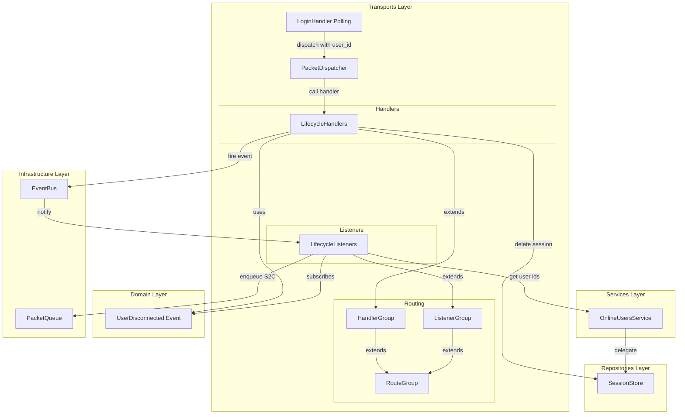
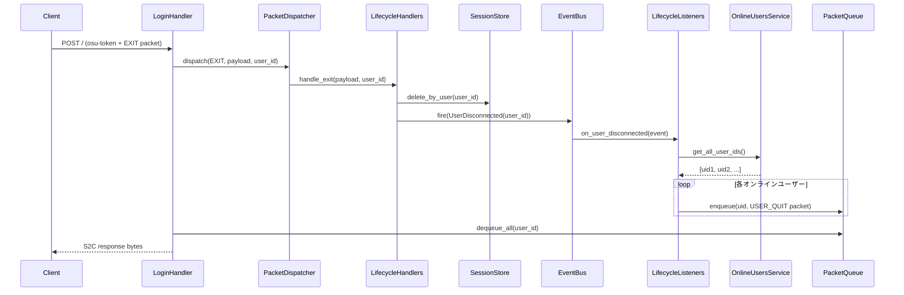

# Design Document

## Overview

**Purpose**: C2S パケットハンドラの宣言的登録インフラと初期ハンドラ（PONG / EXIT）を提供し、osu! stable クライアントからのバイナリパケットを処理する基盤を確立する。

**Users**: osu! stable クライアント（パケット処理の対象）と開発者（ハンドラ追加の利用者）。

**Impact**: 既存の PacketDispatcher / EventBus / PacketQueue インフラの上に、宣言的なハンドラ/リスナー登録パターンを導入する。LoginHandler の polling パイプラインに user_id 伝達を追加する。

### Goals
- デコレータベースの宣言的ハンドラ/リスナー登録パターンを確立する
- PONG（keepalive）と EXIT（切断）の2つの初期ハンドラを提供する
- ハンドラ → EventBus → リスナー → PacketQueue の S2C 配信パイプラインを実証する
- 後続スペック（channel-system, presence-status）でハンドラを容易に追加できる基盤を整える

### Non-Goals
- チャンネル、プレゼンス、マッチ関連ハンドラの実装
- PresenceService の実装（presence-status スペックで対応）
- PING（S2C）の定期送信メカニズム
- ハンドラスキャフォールドツールの作成

## Boundary Commitments

### This Spec Owns
- `transports/bancho/routing.py` — 汎用ルーティング基盤（RouteGroup, @route, _ROUTE_KEYS）
- `transports/bancho/handlers/base.py` — HandlerGroup（RouteGroup 継承 + register_all）
- `transports/bancho/handlers/lifecycle.py` — PONG / EXIT ハンドラ
- `transports/bancho/listeners/base.py` — ListenerGroup（RouteGroup 継承 + register_all）
- `transports/bancho/listeners/lifecycle.py` — UserDisconnected リスナー
- `domain/users/events.py` — UserDisconnected ドメインイベント
- `services/online_users.py` — OnlineUsersService
- LoginHandler の dispatch 呼び出しに user_id を追加する修正
- PacketHandler 型の厳格化
- SessionStore への `delete_by_user` メソッド追加

### Out of Boundary
- チャンネル/チャット関連ハンドラ → channel-system スペック
- プレゼンス/ステータス関連ハンドラ → presence-status スペック
- マッチ関連ハンドラ → Phase 2 以降
- OnlineUsersService の Redis SET ベース実装 → presence-status スペック
- PresenceService → presence-status スペック

### Allowed Dependencies
- `PacketDispatcher`（既存）— ハンドラの登録と dispatch
- `EventBus`（既存）— ドメインイベントの発火と購読
- `PacketQueue`（既存）— S2C パケットの enqueue
- `SessionStore`（既存 + delete_by_user 追加）— セッション管理
- `Event`（既存）— ドメインイベント基底クラス
- `ServerPacketID` / `ClientPacketID`（既存）— パケット ID enum
- `write_packet`（既存）— S2C パケットビルダー

### Revalidation Triggers
- RouteGroup の `get_routes()` シグネチャ変更
- PacketHandler 型の変更（`Callable[[bytes, int], Awaitable[None]]`）
- PacketDispatcher の `register()` / `dispatch()` インターフェース変更
- EventBus の `subscribe()` / `fire()` インターフェース変更
- OnlineUsersService のインターフェース変更

## Architecture

### Existing Architecture Analysis

**変更なしで利用するもの：**
- PacketDispatcher — `register()` と `dispatch()` のインターフェースはそのまま
- EventBus（InMemoryEventBus）— `fire()` と `subscribe()` のインターフェースはそのまま
- PacketQueue — `enqueue()` のインターフェースはそのまま
- LoginHandler — polling パイプラインの構造は維持、dispatch 呼び出しに user_id 追加のみ

**変更が必要なもの：**
- `PacketHandler` 型 — `Callable[..., Awaitable[None]]` → `Callable[[bytes, int], Awaitable[None]]`
- `LoginHandler._handle_polling` — dispatch 呼び出しに `user_id` 引数追加（1行）
- `SessionStore` Protocol — `delete_by_user(user_id: int) -> None` メソッド追加
- InMemorySessionStore / RedisSessionStore — `delete_by_user` 実装追加
- `setup_listeners()` — ListenerGroup の register_all 呼び出しに変更

### Architecture Pattern & Boundary Map



**Architecture Integration**:
- Selected pattern: HandlerGroup + ListenerGroup（RouteGroup ベースの宣言的ルーティング）
- Domain boundaries: ハンドラは「C2S パケット → ドメインイベント」、リスナーは「ドメインイベント → S2C パケット配信」の責務分離
- Existing patterns preserved: DI コンストラクタ注入、EventBus fire-and-forget、PacketQueue per-user buffering
- New components rationale: RouteGroup はデコレータ宣言と DI を両立するために必要な最小限のインフラ

### Technology Stack

| Layer | Choice / Version | Role in Feature | Notes |
|-------|------------------|-----------------|-------|
| Backend | Python 3.14+ | ハンドラ・リスナー実装 | `__init_subclass__` 使用 |
| Messaging | InMemoryEventBus（既存） | ドメインイベント配信 | fire-and-forget |
| State | PacketQueue（既存） | S2C パケットバッファ | Redis / InMemory |

## File Structure Plan

### Directory Structure

```
src/osu_server/
├── domain/
│   └── users/
│       ├── __init__.py
│       └── events.py                      # UserDisconnected イベント
├── services/
│   └── online_users.py                    # OnlineUsersService
└── transports/
    └── bancho/
        ├── routing.py                     # RouteGroup, @route, _ROUTE_KEYS
        ├── dispatch.py                    # PacketHandler 型厳格化（既存修正）
        ├── handlers/
        │   ├── __init__.py
        │   ├── base.py                    # HandlerGroup(RouteGroup), handles = route
        │   └── lifecycle.py               # LifecycleHandlers(PONG, EXIT)
        └── listeners/
            ├── __init__.py                # setup_listeners 修正
            ├── base.py                    # ListenerGroup(RouteGroup), listens = route
            └── lifecycle.py               # LifecycleListeners(UserDisconnected)
```

```
tests/
├── unit/
│   ├── test_routing.py                    # RouteGroup ユニットテスト
│   ├── test_lifecycle_handlers.py         # PONG/EXIT ハンドラユニットテスト
│   ├── test_lifecycle_listeners.py        # リスナーユニットテスト
│   └── test_online_users.py              # OnlineUsersService ユニットテスト
├── integration/
│   └── test_c2s_pipeline.py              # ハンドラ→EventBus→リスナー→PacketQueue
└── e2e/
    └── test_c2s_e2e.py                   # HTTP POST → S2C レスポンス
```

### Modified Files
- `src/osu_server/transports/bancho/dispatch.py` — PacketHandler 型を `Callable[[bytes, int], Awaitable[None]]` に厳格化
- `src/osu_server/transports/bancho/handlers/login.py` — dispatch 呼び出しに `user_id` 追加（1行）
- `src/osu_server/transports/bancho/listeners/__init__.py` — setup_listeners を ListenerGroup ベースに変更
- `src/osu_server/repositories/interfaces/session_store.py` — `delete_by_user` メソッド追加
- `src/osu_server/repositories/memory/session_store.py` — `delete_by_user` 実装
- `src/osu_server/repositories/redis/session_store.py` — `delete_by_user` 実装
- `src/osu_server/app.py` — composition root に HandlerGroup / ListenerGroup / OnlineUsersService 登録追加

## System Flows

### C2S → EventBus → S2C パイプライン（EXIT パケット）



**Key Decision**: EXIT ハンドラは try/finally パターンで、イベント発火の成功・失敗に関わらずセッション削除を保証する（Req 6.6）。

## Requirements Traceability

| Requirement | Summary | Components | Interfaces | Flows |
|-------------|---------|------------|------------|-------|
| 1.1 | ルートキーデコレータ | routing.py | `route()` | — |
| 1.2 | 自動収集 | routing.py | `__init_subclass__` | — |
| 1.3 | 一括登録 | routing.py, base.py | `get_routes()`, `register_all()` | — |
| 1.4 | コンストラクタ DI | HandlerGroup, ListenerGroup | `__init__()` | — |
| 1.5 | 空グループ警告 | routing.py, base.py | `register_all()` | — |
| 2.1 | ハンドラ基盤クラス | handlers/base.py | HandlerGroup | — |
| 2.2 | ディスパッチャー登録 | handlers/base.py | `register_all(dispatcher)` | — |
| 2.3 | 登録ログ | handlers/base.py | structlog | — |
| 2.4 | 重複登録エラー | PacketDispatcher（既存） | DuplicateHandlerError | — |
| 3.1 | リスナー基盤クラス | listeners/base.py | ListenerGroup | — |
| 3.2 | EventBus 購読登録 | listeners/base.py | `register_all(event_bus)` | — |
| 3.3 | 対称パターン | RouteGroup 共通基盤 | 同一 API | — |
| 4.1 | user_id 伝達 | login.py | `dispatch(..., user_id)` | — |
| 4.2 | シグネチャ統一 | dispatch.py | `PacketHandler` 型 | — |
| 5.1 | PONG 受理 | lifecycle.py | `handle_pong()` | — |
| 5.2 | PONG ログ | lifecycle.py + PacketDispatcher | DEBUG レベル | — |
| 6.1 | セッション削除 | lifecycle.py | `SessionStore.delete_by_user()` | EXIT flow |
| 6.2 | イベント発火 | lifecycle.py | `EventBus.fire()` | EXIT flow |
| 6.3 | 退出通知配信 | lifecycle_listeners.py | `PacketQueue.enqueue()` | EXIT flow |
| 6.4 | EXIT ログ | lifecycle.py + PacketDispatcher | INFO レベル | — |
| 6.5 | 冪等性 | lifecycle.py, SessionStore | `delete_by_user` 冪等 | — |
| 6.6 | セッション削除保証 | lifecycle.py | try/finally | EXIT flow |
| 7.1 | イベント配置 | domain/users/events.py | — | — |
| 7.2 | 不変データ構造 | domain/users/events.py | `@dataclass(frozen=True, slots=True)` | — |
| 7.3 | user_id 含有 | domain/users/events.py | `user_id: int` | — |
| 8.1-8.3 | 例外隔離 | LoginHandler（既存） | try/except + continue | — |
| 9.1 | ユニットテスト | test_*.py | — | — |
| 9.2 | 統合テスト | test_c2s_pipeline.py | — | EXIT flow |
| 9.3 | E2E テスト | test_c2s_e2e.py | — | EXIT flow |

## Components and Interfaces

| Component | Domain/Layer | Intent | Req Coverage | Key Dependencies | Contracts |
|-----------|-------------|--------|-------------|-----------------|-----------|
| RouteGroup | Transports/Routing | デコレータ付きメソッドの自動収集と列挙 | 1.1-1.5 | なし | Service |
| HandlerGroup | Transports/Handlers | C2S ハンドラのディスパッチャー登録 | 2.1-2.4 | RouteGroup (P0), PacketDispatcher (P0) | Service |
| ListenerGroup | Transports/Listeners | イベントリスナーの EventBus 購読登録 | 3.1-3.3 | RouteGroup (P0), EventBus (P0) | Service |
| LifecycleHandlers | Transports/Handlers | PONG / EXIT パケット処理 | 4.1-4.2, 5.1-5.2, 6.1-6.6 | HandlerGroup (P0), SessionStore (P0), EventBus (P0) | Service, Event |
| LifecycleListeners | Transports/Listeners | UserDisconnected → USER_QUIT 配信 | 6.3 | ListenerGroup (P0), OnlineUsersService (P0), PacketQueue (P0) | Event |
| UserDisconnected | Domain/Users | ユーザー切断ドメインイベント | 7.1-7.3 | Event 基底クラス (P0) | Event |
| OnlineUsersService | Services | オンラインユーザー列挙 | 6.3 | SessionStore (P1) | Service |

### Transports / Routing

#### RouteGroup

| Field | Detail |
|-------|--------|
| Intent | メソッドデコレータで宣言されたルートの自動収集と列挙を提供する汎用基盤 |
| Requirements | 1.1, 1.2, 1.3, 1.4, 1.5 |

**Responsibilities & Constraints**
- `@route(key)` デコレータでメソッドにルートキーを宣言
- `__init_subclass__` でクラス定義時に `_ROUTE_KEYS` 辞書を走査し `__routes__` に収集
- `get_routes()` で `(key, bound_method)` のイテレータを返す
- ハンドラの継承は規約で禁止（`vars(cls)` は自クラスのみ走査）

**Contracts**: Service [x]

##### Service Interface

```python
# モジュールレベル
_ROUTE_KEYS: dict[Callable[..., Any], Any] = {}

def route(key: Any) -> Callable[[F], F]:
    """メソッドにルートキーを宣言する。副作用は _ROUTE_KEYS への登録のみ。"""
    ...

class RouteGroup:
    __routes__: ClassVar[dict[Any, str]]

    def __init_subclass__(cls, **kwargs: object) -> None:
        """クラス定義時に _ROUTE_KEYS を走査し __routes__ に収集する。"""
        ...

    def get_routes(self) -> Iterator[tuple[Any, Callable[..., Awaitable[None]]]]:
        """(key, bound_method) のイテレータを返す。"""
        ...
```

- Preconditions: サブクラスが `@route` デコレータ付きメソッドを持つこと
- Postconditions: `__routes__` にキーとメソッド名のマッピングが格納される
- Invariants: `_ROUTE_KEYS` と `__routes__` の整合性が保たれる

### Transports / Handlers

#### HandlerGroup

| Field | Detail |
|-------|--------|
| Intent | RouteGroup を継承し、C2S パケットハンドラをディスパッチャーに一括登録する |
| Requirements | 2.1, 2.2, 2.3, 2.4 |

**Contracts**: Service [x]

##### Service Interface

```python
handles = route  # @handles(ClientPacketID.PONG) のエイリアス

class HandlerGroup(RouteGroup):
    def register_all(self, dispatcher: PacketDispatcher) -> None:
        """全 @handles メソッドをディスパッチャーに登録し、完了をログ記録する。
        登録メソッドが0件の場合は警告ログを出力する。"""
        ...
```

- Preconditions: dispatcher が有効な PacketDispatcher インスタンスであること
- Postconditions: 全 `@handles` メソッドが dispatcher に登録される
- Invariants: 重複登録は PacketDispatcher 側の DuplicateHandlerError で検出

#### LifecycleHandlers

| Field | Detail |
|-------|--------|
| Intent | PONG と EXIT の C2S パケットを処理する |
| Requirements | 4.1, 4.2, 5.1, 5.2, 6.1, 6.2, 6.4, 6.5, 6.6 |

**Dependencies**
- Inbound: PacketDispatcher — dispatch 経由でハンドラ呼び出し (P0)
- Outbound: SessionStore — `delete_by_user()` (P0)
- Outbound: EventBus — `fire(UserDisconnected)` (P0)

**Contracts**: Service [x] / Event [x]

##### Service Interface

```python
class LifecycleHandlers(HandlerGroup):
    def __init__(
        self,
        session_store: SessionStore,
        event_bus: EventBus,
    ) -> None: ...

    @handles(ClientPacketID.PONG)
    async def handle_pong(self, payload: bytes, user_id: int) -> None:
        """Keepalive 応答を受理する。処理不要。"""
        ...

    @handles(ClientPacketID.EXIT)
    async def handle_exit(self, payload: bytes, user_id: int) -> None:
        """セッション削除とユーザー切断イベントの発火。
        try/finally でセッション削除を保証する。
        delete_by_user は冪等（存在しないセッションに対してもエラーなし）。"""
        ...
```

##### Event Contract
- Published events: `UserDisconnected(user_id: int)`
- Ordering: EXIT ハンドラ内でイベントを同期的に発火。EventBus のハンドラ呼び出し順は登録順

**Implementation Notes**
- EXIT の try/finally: イベント発火を try ブロック、セッション削除を finally ブロックに配置し、イベント発火失敗時もセッション削除を保証（Req 6.6）
- PONG はメソッド本体が空（pass）。ログは PacketDispatcher の既存ログ機構が QUIET_C2S_PACKETS として DEBUG レベルで出力（Req 5.2）

### Transports / Listeners

#### ListenerGroup

| Field | Detail |
|-------|--------|
| Intent | RouteGroup を継承し、ドメインイベントリスナーを EventBus に一括購読登録する |
| Requirements | 3.1, 3.2, 3.3 |

**Contracts**: Service [x]

##### Service Interface

```python
listens = route  # @listens(UserDisconnected) のエイリアス

class ListenerGroup(RouteGroup):
    def register_all(self, event_bus: EventBus) -> None:
        """全 @listens メソッドを EventBus に購読登録し、完了をログ記録する。
        登録メソッドが0件の場合は警告ログを出力する。"""
        ...
```

#### LifecycleListeners

| Field | Detail |
|-------|--------|
| Intent | UserDisconnected イベントを受信し、全オンラインユーザーに USER_QUIT パケットを配信する |
| Requirements | 6.3 |

**Dependencies**
- Inbound: EventBus — イベント購読 (P0)
- Outbound: OnlineUsersService — 全ユーザー ID 列挙 (P0)
- Outbound: PacketQueue — S2C パケット enqueue (P0)

**Contracts**: Event [x]

##### Service Interface

```python
class LifecycleListeners(ListenerGroup):
    def __init__(
        self,
        online_users: OnlineUsersService,
        packet_queue: PacketQueue,
    ) -> None: ...

    @listens(UserDisconnected)
    async def on_user_disconnected(self, event: UserDisconnected) -> None:
        """全オンラインユーザーに USER_QUIT パケットを配信する。
        退出したユーザー自身は配信対象から除外する。"""
        ...
```

##### Event Contract
- Subscribed events: `UserDisconnected`
- Delivery guarantees: EventBus は fire-and-forget。リスナー例外は EventBus 側でログされ他リスナーに影響しない

### Domain / Users

#### UserDisconnected

| Field | Detail |
|-------|--------|
| Intent | ユーザーがサーバーから切断したことを表すドメインイベント |
| Requirements | 7.1, 7.2, 7.3 |

**Contracts**: Event [x]

##### Event Contract

```python
@dataclass(frozen=True, slots=True)
class UserDisconnected(Event):
    """ユーザーがサーバーから切断したことを表すドメインイベント。"""
    user_id: int
```

- 不変（frozen=True）
- Event 基底クラスを継承
- domain/users/events.py に配置

### Services

#### OnlineUsersService

| Field | Detail |
|-------|--------|
| Intent | オンラインユーザーの列挙を提供する（将来 presence-status で拡張前提） |
| Requirements | 6.3 |

**Dependencies**
- Outbound: SessionStore — 全セッション列挙に委譲 (P1)

**Contracts**: Service [x]

##### Service Interface

```python
class OnlineUsersService:
    def __init__(self, session_store: SessionStore) -> None: ...

    async def get_all_user_ids(self) -> list[int]:
        """全オンラインユーザーの ID リストを返す。
        現時点では SessionStore に委譲。
        presence-status スペックで Redis SET ベースに移行予定。"""
        ...
```

- Preconditions: なし
- Postconditions: 現在アクティブなセッションを持つ全ユーザー ID を返す
- Invariants: セッション TTL が切れたユーザーは含まれない

**Implementation Notes**
- SessionStore Protocol に `get_all_user_ids() -> list[int]` メソッドが必要（内部委譲用）
- 外部からは OnlineUsersService のみを参照し、SessionStore の `get_all_user_ids` を直接呼ばない
- presence-status で OnlineUsersService の内部実装を差し替えた後、SessionStore から `get_all_user_ids` を削除可能

## Data Models

### Domain Model

```python
# domain/users/events.py
@dataclass(frozen=True, slots=True)
class UserDisconnected(Event):
    user_id: int
```

### Data Contracts & Integration

**SessionStore Protocol 追加メソッド：**

```python
async def delete_by_user(self, user_id: int) -> None:
    """指定 user_id のセッションを削除する。
    セッションが存在しない場合は何もしない（冪等）。"""
    ...

async def get_all_user_ids(self) -> list[int]:
    """全アクティブセッションの user_id リストを返す。"""
    ...
```

**PacketHandler 型変更：**

```python
# 変更前
type PacketHandler = Callable[..., Awaitable[None]]

# 変更後
type PacketHandler = Callable[[bytes, int], Awaitable[None]]
```

## Error Handling

### Error Strategy

| Error Scenario | Handling | Req |
|---------------|----------|-----|
| ハンドラ例外 | LoginHandler の既存 try/except でログ記録し継続 | 8.1, 8.2, 8.3 |
| EXIT のイベント発火失敗 | try/finally でセッション削除を保証 | 6.6 |
| 存在しないセッションの EXIT | delete_by_user が冪等に処理（no-op） | 6.5 |
| 空の HandlerGroup 登録 | 警告ログ出力 | 1.5 |
| 重複パケット ID 登録 | DuplicateHandlerError（既存） | 2.4 |

### Monitoring
- `handlers_registered` — ハンドラグループ登録完了ログ（グループ名、登録数）
- `listeners_registered` — リスナーグループ登録完了ログ（グループ名、登録数）
- `c2s_packet` / `c2s_unhandled` — 既存の PacketDispatcher ログ
- `c2s_handler_error` — 既存の LoginHandler エラーログ

## Testing Strategy

### Unit Tests
1. **RouteGroup**: @route デコレータによるメソッド収集、`__init_subclass__` の動作、get_routes が正しいバウンドメソッドを返すこと、空グループの検出
2. **LifecycleHandlers.handle_pong**: 例外なく完了すること（モック不要）
3. **LifecycleHandlers.handle_exit**: SessionStore.delete_by_user と EventBus.fire が呼ばれること、try/finally でセッション削除が保証されること、冪等性（2回目の EXIT がエラーにならないこと）
4. **LifecycleListeners.on_user_disconnected**: 全オンラインユーザーの PacketQueue に USER_QUIT パケットが enqueue されること、退出ユーザー自身が除外されること
5. **OnlineUsersService**: SessionStore への委譲が正しく動作すること

### Integration Tests
1. **EXIT パイプライン**: LifecycleHandlers.handle_exit → InMemoryEventBus → LifecycleListeners.on_user_disconnected → InMemoryPacketQueue に USER_QUIT が投入されること
2. **HandlerGroup + PacketDispatcher**: register_all 後に dispatch が正しいハンドラを呼ぶこと
3. **ListenerGroup + EventBus**: register_all 後に fire が正しいリスナーを呼ぶこと

### E2E Tests
1. **EXIT → USER_QUIT 配信**: HTTP POST（EXIT パケット）→ 他ユーザーの polling レスポンスに USER_QUIT バイトが含まれること
2. **PONG 受理**: HTTP POST（PONG パケット）→ エラーなく空レスポンスが返ること
3. **例外隔離**: 不正ペイロードのパケット + PONG → PONG は正常に処理されること
