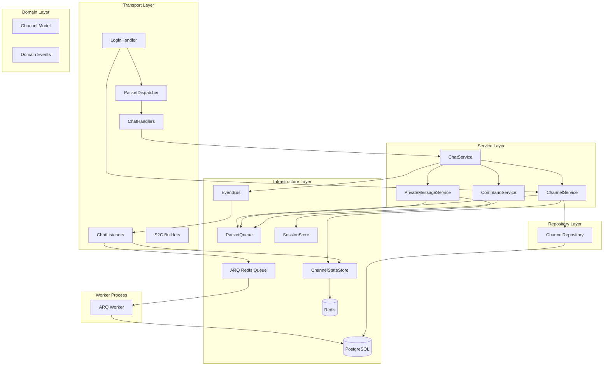
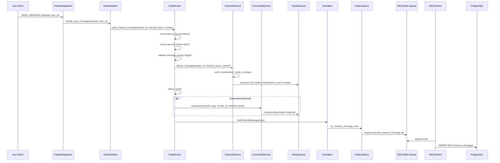
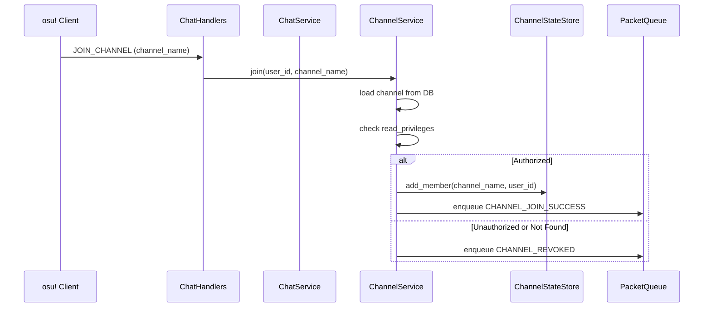

# Design Document

## Overview

**Purpose**: DB 管理のパブリック常設チャンネル、PM、BanchoBot + コマンドシステムを実装し、bancho バイナリプロトコル経由のチャット送受信を完全に動作させる。ChatService をプロトコル非依存のオーケストレーターとして設計し、将来の IRC / Bot API / Lazer 対応への拡張基盤を確立する。

**Users**: osu! stable クライアント（チャット利用）、サーバー管理者（チャンネル管理）、開発者（コマンド追加・将来のプロトコル拡張）。

**Impact**: ハードコードされた `#osu` をDB 駆動のチャンネルシステムに置き換え、4つの新規サービス、4つの C2S ハンドラ、3つの S2C ビルダー、2つの DB テーブル、Redis ステートストアを追加する。

### Goals
- ChatService をプロトコル非依存のオーケストレーターとして設計する
- bancho プロトコル経由のチャンネルメッセージ / PM 送受信を完全実装する
- ロールベースのチャンネルアクセス制御（read / write / manage）を実現する
- BanchoBot（user_id=1）と拡張可能なコマンドシステムを構築する
- 全メッセージの非同期 DB 永続化を実現する

### Non-Goals
- マルチプレイ / スペクテイター用一時チャンネル
- IRC サーバー実装、外部 Bot API
- チャンネル管理 REST API エンドポイント、メッセージ履歴取得 API
- WebUI
- Silence 付与・解除の管理操作、Channel Ban

## Boundary Commitments

### This Spec Owns
- `worker.py` — ARQ WorkerSettings + メッセージ永続化ジョブ定義
- `pyproject.toml` — `arq` 依存追加
- `domain/channel.py` — Channel ドメインモデル、ChannelType enum
- `domain/events/channels.py` — チャット関連ドメインイベント
- `repositories/interfaces/channel_repository.py` — ChannelRepository Protocol
- `repositories/sqlalchemy/channel_repository.py` + `models/channel.py` — DB 実装
- `repositories/memory/channel_repository.py` — InMemory 実装
- `infrastructure/state/interfaces/channel_state_store.py` — ChannelStateStore Protocol
- `infrastructure/state/interfaces/rate_limiter.py` — RateLimiter Protocol
- `infrastructure/state/redis/channel_state_store.py` + `memory/channel_state_store.py` — ChannelStateStore 実装
- `infrastructure/state/redis/rate_limiter.py` + `memory/rate_limiter.py` — RateLimiter 実装
- `services/chat_service.py` — ChatService（オーケストレーター）
- `services/channel_service.py` — ChannelService（チャンネル CRUD + メンバーシップ）
- `services/private_message_service.py` — PrivateMessageService
- `services/command_service.py` — CommandService + BanchoBot コマンド
- `transports/bancho/handlers/chat.py` — C2S ハンドラ 4種
- `transports/bancho/listeners/chat.py` — メッセージ永続化 + チャンネル掃除リスナー
- `transports/bancho/protocol/s2c/chat.py` — S2C ビルダー 3種
- Alembic マイグレーション — channels, channel_messages, private_messages テーブル + BanchoBot シード
- LoginHandler の動的チャンネルリスト送信への修正
- SessionData への `silence_end` フィールド追加
- AppConfig への Rate Limit / メッセージ長設定追加

### Out of Boundary
- マルチプレイ / スペクテイターチャンネル → 各システム spec で ChannelService を呼び出す
- IRC サーバー → irc-server spec
- Bot API → bot-api spec
- チャンネル管理 API エンドポイント → channel-management-api spec
- メッセージ履歴 API → chat-history-api spec
- Silence 付与・解除 → moderation-system spec

### Allowed Dependencies
- `PacketDispatcher`（既存）— C2S ハンドラ登録・dispatch
- `EventBus`（既存）— ドメインイベントの発火・購読・永続化トリガー
- `PacketQueue`（既存）— S2C パケット enqueue
- `SessionStore`（既存）— セッション管理、silence_end チェック
- `OnlineUsersService`（既存）— オンラインユーザー列挙
- `PermissionService`（既存）— ユーザー権限算出
- `HandlerGroup` / `ListenerGroup`（既存）— 宣言的ハンドラ/リスナー登録
- `Privileges`（既存）— ビットフラグ演算
- `Redis`（既存）— ChannelStateStore、RateLimiter のインフラ実装で使用
- `RateLimiter`（**新規**）— Rate Limit 判定 Protocol
- `ArqRedis`（**新規**）— ARQ ジョブ enqueue
- `async_sessionmaker`（既存）— DB 永続化（worker プロセスで使用）

### Revalidation Triggers
- ChatService のメッセージパイプラインインターフェース変更
- ChannelService の join/leave/send インターフェース変更
- ChannelStateStore Protocol の変更
- Channel ドメインモデルのフィールド変更
- SessionData の silence_end フィールド型・セマンティクス変更
- RateLimiter Protocol の変更
- CommandService のコマンド登録パターン変更

## Architecture

### Existing Architecture Analysis

**変更なしで利用:**
- PacketDispatcher — `register()` / `dispatch()` そのまま
- EventBus（InMemoryEventBus）— `fire()` / `subscribe()` そのまま
- PacketQueue — `enqueue()` そのまま
- HandlerGroup / ListenerGroup — 既存の宣言的パターンをそのまま利用
- PermissionService — `compute_permissions()` そのまま
- OnlineUsersService — `get_all_user_ids()` そのまま

**変更が必要:**
- `SessionData` — `silence_end: int = 0` フィールド追加
- `AppConfig` — Rate Limit / メッセージ長設定追加
- `LoginHandler._build_login_response_stream()` — ChannelService 依存追加、動的チャンネルリスト
- `listeners/__init__.py:setup_listeners()` — ChatListeners 登録追加
- `app.py:_register_services()` — 全新規サービスの DI 配線
- `repositories/sqlalchemy/models/__init__.py` — 新モデル import 追加

**ARQ ワーカー導入:**
CLAUDE.md / tech.md では ARQ を技術スタックとして記載しているが、実際には依存関係に未追加・worker.py も未作成。今回の spec で ARQ を導入し、grill-me で決定した「ARQ ワーカー経由の DB 永続化」（パターン C）をそのまま実装する。app プロセスは EventBus リスナーが `arq.enqueue()` で Redis キューにジョブ投入し、worker プロセスが DB に INSERT する。これによりリアルタイム配信が DB 書き込みに一切依存しない。

### Architecture Pattern & Boundary Map



### Technology Stack

| Layer | Choice | Role | Notes |
|-------|--------|------|-------|
| Services | Python async | ChatService, ChannelService, PrivateMessageService, CommandService | 既存パターン踏襲 |
| Data / DB | SQLAlchemy 2.0 async + Alembic | channels, channel_messages, private_messages テーブル | 既存パターン踏襲 |
| Data / State | Redis Set + INCR | メンバーシップ（Set）、Rate Limit（INCR+EXPIRE） | 新規、Lua 不要 |
| Messaging | EventBus（InMemory） | メッセージ永続化トリガー、チャンネルイベント | 既存利用 |
| Job Queue | ARQ（Redis ベース） | メッセージ永続化ジョブ | **新規導入** |
| Transport | Caterpillar + write_packet | S2C ビルダー 3種 | 既存パターン踏襲 |

## File Structure Plan

### Directory Structure
```
src/osu_server/
├── domain/
│   ├── channel.py              # NEW: Channel dataclass, ChannelType enum
│   └── events/
│       └── channels.py         # NEW: ChannelMessageSent, PrivateMessageSent, etc.
├── repositories/
│   ├── interfaces/
│   │   └── channel_repository.py   # NEW: ChannelRepository Protocol
│   ├── sqlalchemy/
│   │   ├── models/
│   │   │   └── channel.py         # NEW: ChannelModel, ChannelMessageModel, PrivateMessageModel
│   │   └── channel_repository.py  # NEW: SQLAlchemyChannelRepository
│   └── memory/
│       └── channel_repository.py  # NEW: InMemoryChannelRepository
├── infrastructure/
│   └── state/
│       ├── interfaces/
│       │   ├── channel_state_store.py  # NEW: ChannelStateStore Protocol
│       │   └── rate_limiter.py         # NEW: RateLimiter Protocol
│       ├── redis/
│       │   ├── channel_state_store.py  # NEW: RedisChannelStateStore
│       │   └── rate_limiter.py         # NEW: RedisRateLimiter
│       └── memory/
│           ├── channel_state_store.py  # NEW: InMemoryChannelStateStore
│           └── rate_limiter.py         # NEW: InMemoryRateLimiter
├── services/
│   ├── chat_service.py              # NEW: ChatService orchestrator
│   ├── channel_service.py           # NEW: ChannelService
│   ├── private_message_service.py   # NEW: PrivateMessageService
│   └── command_service.py           # NEW: CommandService + BanchoBot commands
├── transports/bancho/
│   ├── handlers/
│   │   └── chat.py                  # NEW: ChatHandlers (4 C2S handlers)
│   ├── listeners/
│   │   └── chat.py                  # NEW: ChatListeners (persistence + cleanup)
│   └── protocol/s2c/
│       └── chat.py                  # NEW: send_message, channel_join_success, channel_revoked
├── worker.py                        # NEW: ARQ WorkerSettings + message persistence jobs
└── config.py                        # MODIFIED: Rate Limit / message settings

alembic/versions/
└── XXXXXX_create_channels_messages.py  # NEW: channels, messages tables + BanchoBot seed

tests/
├── unit/
│   ├── domain/test_channel.py
│   ├── repositories/test_channel_repository.py
│   ├── services/
│   │   ├── test_chat_service.py
│   │   ├── test_channel_service.py
│   │   ├── test_private_message_service.py
│   │   └── test_command_service.py
│   └── transports/test_chat_handlers.py
├── integration/test_chat_pipeline.py
└── e2e/test_chat_e2e.py
```

### Modified Files
- `pyproject.toml` — `arq` 依存追加
- `domain/session.py` — `silence_end: int = 0` フィールド追加
- `config.py` — `message_max_length`, `rate_limit_messages`, `rate_limit_window` 追加
- `transports/bancho/handlers/login.py` — `_build_login_response_stream()` を動的チャンネルリストに変更
- `transports/bancho/listeners/__init__.py` — `setup_listeners()` に ChatListeners 追加
- `app.py` — `_register_services()` に全新規サービスの DI 配線追加
- `repositories/sqlalchemy/models/__init__.py` — 新モデル import 追加
- `infrastructure/di/providers.py` — ARQ Redis pool の登録追加

## System Flows

### メッセージ送信パイプライン（チャンネル）



### チャンネル参加フロー



## Requirements Traceability

| Req | Summary | Components | Interfaces | Flows |
|-----|---------|------------|------------|-------|
| 1.1-1.6 | チャンネル定義・管理 | Channel, ChannelRepository, migration | ChannelRepository Protocol | — |
| 2.1-2.6 | アクセス制御 | Channel (privileges fields), ChannelService | ChannelService.check_access() | Join Flow |
| 3.1-3.7 | 参加/離脱 | ChatHandlers, ChannelService, ChannelStateStore | ChannelStateStore Protocol | Join Flow |
| 4.1-4.4 | チャンネルメッセージ | ChatHandlers, ChatService, ChannelService | ChatService.send_channel_message() | Message Pipeline |
| 5.1-5.4 | PM | ChatHandlers, ChatService, PrivateMessageService | ChatService.send_private_message() | — |
| 6.1-6.5 | メッセージ永続化 | ChatListeners, ChannelMessageModel, PrivateMessageModel | EventBus subscribe | Message Pipeline |
| 7.1-7.3 | BanchoBot | CommandService, migration (seed) | — | — |
| 8.1-8.8 | コマンドシステム | CommandService | CommandService.execute() | Message Pipeline |
| 9.1-9.5 | Rate Limit | ChatService, AppConfig, Channel | ChatService._check_rate_limit() | Message Pipeline |
| 10.1-10.3 | Silence | ChatService, SessionData | ChatService._check_silence() | Message Pipeline |
| 11.1-11.5 | ログインフロー | LoginHandler, ChannelService | ChannelService.get_visible_channels() | — |
| 12.1-12.3 | 切断クリーンアップ | ChatListeners, ChannelStateStore | EventBus subscribe | — |
| 13.1-13.3 | バリデーション | ChatService, AppConfig | ChatService._validate_message() | Message Pipeline |
| 14.1-14.5 | テスト | All test files | — | — |

## Components and Interfaces

| Component | Layer | Intent | Req | Key Dependencies | Contracts |
|-----------|-------|--------|-----|-----------------|-----------|
| Channel | Domain | チャンネルエンティティ + ChannelType enum | 1, 2 | — | — |
| ChannelMessageSent / PrivateMessageSent | Domain | 永続化トリガーイベント | 6 | Event base | Event |
| ChannelRepository | Repository | チャンネル CRUD | 1 | async_sessionmaker (P0) | Service |
| ChannelStateStore | Infrastructure | メンバーシップ管理 | 3, 12 | Redis (P0) | Service, State |
| RateLimiter | Infrastructure | Rate Limit 判定 | 9 | Redis (P0) | Service, State |
| ChatService | Service | メッセージルーティング + バリデーション | 4, 5, 8, 9, 10, 13 | ChannelService (P0), PrivateMessageService (P0), CommandService (P1), EventBus (P0), SessionStore (P0), RateLimiter (P0) | Service |
| ChannelService | Service | チャンネル CRUD + メンバーシップ + 配信 | 1, 2, 3, 11 | ChannelRepository (P0), ChannelStateStore (P0), PacketQueue (P0) | Service |
| PrivateMessageService | Service | PM 配信 | 5 | UserRepository (P0), SessionStore (P0), PacketQueue (P0) | Service |
| CommandService | Service | コマンド解析・実行 | 7, 8 | PacketQueue (P1) | Service |
| ChatHandlers | Transport | C2S パケットハンドラ 4種 | 3, 4, 5 | ChatService (P0), ChannelService (P0) | — |
| ChatListeners | Transport | 永続化ジョブ enqueue + 切断掃除リスナー | 6, 12 | ArqRedis (P0), ChannelStateStore (P0) | Event |
| ARQ Worker | Infrastructure | メッセージ永続化ジョブ実行 | 6 | async_sessionmaker (P0), Redis (P0) | Batch |
| S2C Chat Builders | Transport | send_message, join_success, revoked | 3, 4, 5 | write_packet (P0) | — |

### Domain Layer

#### Channel

| Field | Detail |
|-------|--------|
| Intent | チャンネルエンティティと種別 enum の定義 |
| Requirements | 1.1, 1.3, 1.5, 2.1, 2.2, 9.3 |

```python
class ChannelType(Enum):
    PUBLIC = "public"
    MULTIPLAYER = "multiplayer"      # 将来用
    SPECTATOR = "spectator"          # 将来用
    TEMPORARY = "temporary"          # 将来用

@dataclass(slots=True)
class Channel:
    id: int
    name: str                         # "#osu" — # + [a-z0-9_-]
    topic: str
    channel_type: ChannelType
    auto_join: bool
    rate_limit_messages: int | None   # None → Config デフォルト
    rate_limit_window: int | None     # None → Config デフォルト
    created_at: datetime
    updated_at: datetime

@dataclass(slots=True)
class ChannelRoleOverride:
    channel_id: int
    role_id: int
    can_read: bool
    can_write: bool
```

- Invariant: `name` は `#` で始まり `[a-z0-9_-]` のみ
- Invariant: `channel_type` は今回 `PUBLIC` のみ。他は予約
- アクセス制御は `channel_role_overrides` テーブル（Discord 方式ロール別 ACL）
- override なし → fail-closed（誰もアクセス不可）
- Default ロール = @everyone 相当

#### Privileges 拡張 + has_privilege ヘルパー

```python
class Privileges(IntFlag):
    ...  # 既存フラグ
    EDIT_CHANNEL       = 1 << 8   # チャンネル CRUD
    BYPASS_CHANNEL_ACL = 1 << 9   # 全チャンネルにアクセス可

def has_privilege(user_privileges: int, required: Privileges) -> bool:
    """ADMIN は全権限をバイパスする。"""
    if user_privileges & Privileges.ADMIN:
        return True
    return bool(user_privileges & required)
```

#### Domain Events

```python
@dataclass(frozen=True, slots=True)
class ChannelMessageSent(Event):
    sender_id: int
    sender_name: str
    channel_name: str
    content: str

@dataclass(frozen=True, slots=True)
class PrivateMessageSent(Event):
    sender_id: int
    sender_name: str
    target_id: int
    target_name: str
    content: str
```

### Repository Layer

#### ChannelRepository

| Field | Detail |
|-------|--------|
| Intent | チャンネル定義の CRUD 永続化 |
| Requirements | 1.1, 1.2, 1.4, 1.6, 11.1 |

**Contracts**: Service [x]

```python
@runtime_checkable
class ChannelRepository(Protocol):
    async def create(self, channel: Channel) -> Channel: ...
    async def get_by_name(self, name: str) -> Channel | None: ...
    async def get_all(self) -> list[Channel]: ...
    async def get_auto_join(self) -> list[Channel]: ...
    async def update(self, channel: Channel) -> Channel: ...
    async def delete(self, channel_id: int) -> None: ...
```

- `create` — 名前重複時 `ValueError`
- `get_all` — ChannelType.PUBLIC のみ返却
- `get_auto_join` — `auto_join=True` のチャンネルのみ
- InMemory 実装: `dict[str, Channel]` + `_next_id` （既存 UserRepository パターン踏襲）
- SQLAlchemy 実装: `_to_domain()` マッピング（既存パターン踏襲）

### Infrastructure Layer

#### ChannelStateStore

| Field | Detail |
|-------|--------|
| Intent | チャンネルメンバーシップのランタイム管理 |
| Requirements | 3.1, 3.3, 3.6, 3.7, 12.1, 12.2 |

**Contracts**: Service [x] / State [x]

```python
@runtime_checkable
class ChannelStateStore(Protocol):
    async def add_member(self, channel_name: str, user_id: int) -> None: ...
    async def remove_member(self, channel_name: str, user_id: int) -> None: ...
    async def is_member(self, channel_name: str, user_id: int) -> bool: ...
    async def get_members(self, channel_name: str) -> set[int]: ...
    async def get_member_count(self, channel_name: str) -> int: ...
    async def get_user_channels(self, user_id: int) -> set[str]: ...
    async def remove_user_from_all(self, user_id: int) -> set[str]: ...
```

**State Management:**
- Redis 実装: 双方向 Set インデックス
  - `channel:{name}:members` → `Set[user_id]` (SADD/SREM/SMEMBERS/SCARD)
  - `user:{user_id}:channels` → `Set[channel_name]` (SADD/SREM/SMEMBERS)
  - `add_member` / `remove_member`: Redis pipeline（MULTI/EXEC）で両 Set を同時更新
  - `remove_user_from_all`: ユーザーの全チャンネルを取得 → pipeline で全 SREM + DEL
  - TTL なし（セッションライフサイクルに依存、切断時に明示的削除）
- InMemory 実装: `dict[str, set[int]]` + `dict[int, set[str]]` 双方向

#### RateLimiter

| Field | Detail |
|-------|--------|
| Intent | ユーザー単位のメッセージ送信 Rate Limit 判定 |
| Requirements | 9.1, 9.4, 9.5 |

**Contracts**: Service [x] / State [x]

```python
@runtime_checkable
class RateLimiter(Protocol):
    async def check(self, user_id: int, limit: int, window: int) -> bool: ...
    # Returns True if allowed, False if rate limited
```

- Redis 実装: `INCR rate_limit:user:{user_id}` → 1 なら `EXPIRE {window}` → 結果 > `limit` なら `False`
- InMemory 実装: `dict[int, list[float]]` でタイムスタンプリスト、window 内のカウントで判定

### Service Layer

#### ChatService

| Field | Detail |
|-------|--------|
| Intent | メッセージルーティング、バリデーション、パイプラインオーケストレーション |
| Requirements | 4.1-4.4, 5.1-5.4, 8.1-8.2, 9.1-9.5, 10.1-10.3, 13.1-13.3 |

**Contracts**: Service [x]

```python
class ChatService:
    def __init__(
        self,
        *,
        channel_service: ChannelService,
        private_message_service: PrivateMessageService,
        command_service: CommandService,
        session_store: SessionStore,
        event_bus: EventBus,
        rate_limiter: RateLimiter,
        config: AppConfig,
    ) -> None: ...

    async def send_channel_message(
        self, sender_id: int, sender_name: str, channel_name: str, content: str
    ) -> None: ...

    async def send_private_message(
        self, sender_id: int, sender_name: str, target_name: str, content: str
    ) -> None: ...
```

**メッセージパイプライン（`send_channel_message` / `send_private_message` 共通部）:**
1. `_check_silence(sender_id)` — SessionStore から silence_end 確認、期限内なら早期 return
2. `_check_rate_limit(sender_id)` — Redis `INCR user:{id}:msg_count` + `EXPIRE {window}`、超過なら早期 return
3. `_validate_message(content)` — 空チェック + 最大文字数チェック
4. ルーティング — チャンネル or PM の専用サービスに委譲
5. `_detect_command(content)` — `!` プレフィックス検出 → CommandService.execute()
6. `EventBus.fire(ChannelMessageSent / PrivateMessageSent)` — 永続化トリガー

**Rate Limit:**
- ChatService は `RateLimiter` Protocol 経由で判定（`await rate_limiter.check(user_id, limit, window)`）
- `limit` / `window` はチャンネル固有値があればそれを、なければ Config デフォルトを使用

#### ChannelService

| Field | Detail |
|-------|--------|
| Intent | チャンネル CRUD、メンバーシップ管理、メッセージ配信 |
| Requirements | 1.1-1.6, 2.1-2.6, 3.1-3.7, 4.1-4.4, 11.1-11.5 |

**Contracts**: Service [x]

```python
class ChannelService:
    def __init__(
        self,
        *,
        channel_repo: ChannelRepository,
        channel_state: ChannelStateStore,
        packet_queue: PacketQueue,
        online_users: OnlineUsersService,
    ) -> None: ...

    # CRUD
    async def create_channel(self, channel: Channel) -> Channel: ...
    async def get_channel(self, name: str) -> Channel | None: ...
    async def get_all_channels(self) -> list[Channel]: ...
    async def update_channel(self, channel: Channel) -> Channel: ...
    async def delete_channel(self, channel_id: int) -> None: ...

    # Membership
    async def join(self, user_id: int, user_privileges: int, channel_name: str) -> bool: ...
    async def leave(self, user_id: int, channel_name: str) -> None: ...

    # Message delivery
    async def deliver_message(
        self, sender_id: int, sender_name: str, channel_name: str, content: str
    ) -> None: ...

    # Login
    async def get_visible_channels(self, user_privileges: int) -> list[Channel]: ...
    async def get_autojoin_channels(self, user_privileges: int) -> list[Channel]: ...
```

- `join`: BYPASS_CHANNEL_ACL チェック or ロール別 override 照合（can_read）→ ChannelStateStore.add_member → CHANNEL_JOIN_SUCCESS 送信。権限不足/存在しない → CHANNEL_REVOKED 送信。冪等（既に参加済みなら成功扱い）
- `leave`: ChannelStateStore.remove_member → CHANNEL_REVOKED 送信
- `deliver_message`: membership + ロール別 override 照合（can_write、BYPASS_CHANNEL_ACL でバイパス）チェック → PacketQueue に S2C SEND_MESSAGE を sender 以外の全メンバーに enqueue
- `get_visible_channels`: BYPASS_CHANNEL_ACL なら全チャンネル返却、それ以外はユーザーのロール群と channel_role_overrides を照合して can_read=True のチャンネルのみ返却、`get_member_count` で user_count を付与

#### PrivateMessageService

| Field | Detail |
|-------|--------|
| Intent | PM の宛先検証と配信 |
| Requirements | 5.1-5.4 |

```python
class PrivateMessageService:
    def __init__(
        self,
        *,
        user_repo: UserRepository,
        session_store: SessionStore,
        packet_queue: PacketQueue,
    ) -> None: ...

    async def deliver_message(
        self, sender_id: int, sender_name: str, target_name: str, content: str
    ) -> tuple[bool, int | None]: ...
    # Returns (success, target_user_id)
    # success=False, target_user_id=None → ユーザー不存在
    # success=True, target_user_id=N → 配信完了(オンラインならPQ enqueue、オフラインなら何もしない)
```

- `deliver_message` フロー:
  1. `user_repo.get_by_safe_username(target_name)` → `User | None`
  2. `None` → `(False, None)` を返す（ChatService がエラー通知を送信）
  3. `User` → `session_store.get_by_user(user.id)` でオンライン判定
  4. オンライン → PacketQueue に S2C SEND_MESSAGE を enqueue
  5. オフライン → 何もしない（永続化は ChatService の EventBus 経由）
  6. `(True, user.id)` を返す（ChatService が永続化イベントに target_id を含める）

#### CommandService

| Field | Detail |
|-------|--------|
| Intent | `!` プレフィックスのコマンド解析・実行・BanchoBot レスポンス生成 |
| Requirements | 7.1-7.3, 8.1-8.8 |

```python
CommandHandler = Callable[[int, str, list[str]], Awaitable[str | None]]
# (sender_id, channel_or_target, args) -> response text or None

class CommandService:
    BANCHO_BOT_ID: ClassVar[int] = 1
    BANCHO_BOT_NAME: ClassVar[str] = "BanchoBot"

    def __init__(self, *, packet_queue: PacketQueue) -> None: ...

    def register(self, name: str, handler: CommandHandler) -> None: ...

    async def execute(
        self, sender_id: int, sender_name: str,
        target: str, content: str,
    ) -> None: ...
```

- `execute`: `content` から `!` を除去、スペースでコマンド名と引数を分割、登録済みハンドラを呼び出し、レスポンスがあれば BanchoBot として S2C SEND_MESSAGE を `target`（チャンネル名 or 送信者名）に送信
- 未登録コマンド → 「Unknown command. Type !help for available commands.」を返信
- 初期コマンド登録: `_register_defaults()` で `!roll` と `!help` を登録
- `!roll [max]`: `random.randint(0, max)` — デフォルト max=100
- `!help`: 登録済みコマンド一覧を生成

### Transport Layer

#### ChatHandlers

| Field | Detail |
|-------|--------|
| Intent | C2S パケット 4種のハンドラ |
| Requirements | 3.1, 3.3, 4.1, 5.1 |

```python
class ChatHandlers(HandlerGroup):
    def __init__(
        self, *, chat_service: ChatService, channel_service: ChannelService,
        session_store: SessionStore,
    ) -> None: ...

    @handles(ClientPacketID.SEND_MESSAGE)
    async def handle_send_message(self, payload: bytes, user_id: int) -> None: ...

    @handles(ClientPacketID.SEND_PRIVATE_MESSAGE)
    async def handle_send_private_message(self, payload: bytes, user_id: int) -> None: ...

    @handles(ClientPacketID.JOIN_CHANNEL)
    async def handle_join_channel(self, payload: bytes, user_id: int) -> None: ...

    @handles(ClientPacketID.LEAVE_CHANNEL)
    async def handle_leave_channel(self, payload: bytes, user_id: int) -> None: ...
```

- 各ハンドラ: Caterpillar でペイロードをパース → SessionStore から username/privileges 取得 → ChatService or ChannelService に委譲
- `handle_send_message`: `Message` struct をパース → `chat_service.send_channel_message()`
- `handle_send_private_message`: `Message` struct をパース → `chat_service.send_private_message()`
- `handle_join_channel`: `BanchoString` をパース → `channel_service.join()`
- `handle_leave_channel`: `BanchoString` をパース → `channel_service.leave()`

#### ChatListeners

| Field | Detail |
|-------|--------|
| Intent | メッセージ永続化ジョブの ARQ enqueue + 切断時チャンネル掃除 |
| Requirements | 6.1, 6.2, 6.5, 12.1, 12.2, 12.3 |

**Contracts**: Event [x]

```python
class ChatListeners(ListenerGroup):
    def __init__(
        self, *, arq_redis: ArqRedis, channel_state: ChannelStateStore,
    ) -> None: ...

    @listens(ChannelMessageSent)
    async def on_channel_message_sent(self, event: ChannelMessageSent) -> None: ...

    @listens(PrivateMessageSent)
    async def on_private_message_sent(self, event: PrivateMessageSent) -> None: ...

    @listens(UserDisconnected)
    async def on_user_disconnected(self, event: UserDisconnected) -> None: ...
```

- `on_channel_message_sent`: `await arq_redis.enqueue_job("persist_channel_message", sender_id=..., channel_name=..., content=...)`
- `on_private_message_sent`: `await arq_redis.enqueue_job("persist_private_message", sender_id=..., target_id=..., content=...)`
- `on_user_disconnected`: `channel_state.remove_user_from_all(event.user_id)` — 既存の LifecycleListeners の USER_QUIT 配信と共存（別リスナー、同じイベント）

#### ARQ Worker

| Field | Detail |
|-------|--------|
| Intent | メッセージ永続化ジョブの実行（別プロセス） |
| Requirements | 6.1, 6.2, 6.4, 6.5 |

**Contracts**: Batch [x]

```python
# worker.py
async def persist_channel_message(
    ctx: dict, *, sender_id: int, channel_name: str, sender_name: str, content: str,
) -> None:
    """channel_messages テーブルに INSERT"""
    ...

async def persist_private_message(
    ctx: dict, *, sender_id: int, target_id: int, sender_name: str,
    target_name: str, content: str,
) -> None:
    """private_messages テーブルに INSERT"""
    ...

async def startup(ctx: dict) -> None:
    """Worker 起動時: DB エンジン + セッションファクトリ初期化"""
    ...

async def shutdown(ctx: dict) -> None:
    """Worker 終了時: DB エンジン dispose"""
    ...

class WorkerSettings:
    functions = [persist_channel_message, persist_private_message]
    on_startup = startup
    on_shutdown = shutdown
    redis_settings = RedisSettings(...)  # AppConfig.redis_url から生成
```

##### Batch / Job Contract
- **Trigger**: EventBus リスナーが `arq_redis.enqueue_job()` で Redis キューに投入
- **Input**: sender_id, channel_name/target_id, content, sender_name 等のプリミティブ値（シリアライズ容易）
- **Output**: DB INSERT（成功/失敗をログ出力）
- **Idempotency**: メッセージはログ性質のため冪等性は不要（重複 INSERT は許容）。ARQ のデフォルトリトライ（3回）で失敗時は再試行
- **Recovery**: ワーカー再起動時、Redis キューに残ったジョブは自動的に処理再開

#### S2C Chat Builders

```python
def send_message(*, sender: str, content: str, target: str, sender_id: int) -> bytes:
    """ServerPacketID.SEND_MESSAGE (7)"""
    msg = Message(sender=sender, content=content, target=target, sender_id=sender_id)
    return write_packet(ServerPacketID.SEND_MESSAGE, pack(msg))

def channel_join_success(*, channel_name: str) -> bytes:
    """ServerPacketID.CHANNEL_JOIN_SUCCESS (64)"""
    return write_packet(ServerPacketID.CHANNEL_JOIN_SUCCESS, pack(BanchoString(channel_name)))

def channel_revoked(*, channel_name: str) -> bytes:
    """ServerPacketID.CHANNEL_REVOKED (66)"""
    return write_packet(ServerPacketID.CHANNEL_REVOKED, pack(BanchoString(channel_name)))
```

## Data Models

### Physical Data Model

#### channels テーブル

```sql
CREATE TABLE channels (
    id              SERIAL PRIMARY KEY,
    name            VARCHAR(32) NOT NULL UNIQUE,  -- "#osu"
    topic           VARCHAR(256) NOT NULL DEFAULT '',
    channel_type    VARCHAR(16) NOT NULL DEFAULT 'public',
    auto_join       BOOLEAN NOT NULL DEFAULT FALSE,
    rate_limit_messages INTEGER,                    -- NULL → Config default
    rate_limit_window   INTEGER,                    -- NULL → Config default
    created_at      TIMESTAMPTZ NOT NULL DEFAULT NOW(),
    updated_at      TIMESTAMPTZ NOT NULL DEFAULT NOW()
);

CREATE TABLE channel_role_overrides (
    channel_id  INTEGER NOT NULL REFERENCES channels(id) ON DELETE CASCADE,
    role_id     INTEGER NOT NULL REFERENCES roles(id) ON DELETE CASCADE,
    can_read    BOOLEAN NOT NULL DEFAULT TRUE,
    can_write   BOOLEAN NOT NULL DEFAULT TRUE,
    PRIMARY KEY (channel_id, role_id)
);
```

#### channel_messages テーブル

```sql
CREATE TABLE channel_messages (
    id          BIGSERIAL PRIMARY KEY,
    sender_id   INTEGER NOT NULL REFERENCES users(id),
    channel_id  INTEGER NOT NULL REFERENCES channels(id),
    content     TEXT NOT NULL,
    created_at  TIMESTAMPTZ NOT NULL DEFAULT NOW()
);
CREATE INDEX idx_channel_messages_channel_created ON channel_messages(channel_id, created_at);
```

#### private_messages テーブル

```sql
CREATE TABLE private_messages (
    id              BIGSERIAL PRIMARY KEY,
    sender_id       INTEGER NOT NULL REFERENCES users(id),
    target_user_id  INTEGER NOT NULL REFERENCES users(id),
    content         TEXT NOT NULL,
    created_at      TIMESTAMPTZ NOT NULL DEFAULT NOW()
);
CREATE INDEX idx_private_messages_target_created ON private_messages(target_user_id, created_at);
CREATE INDEX idx_private_messages_sender_created ON private_messages(sender_id, created_at);
```

#### シードデータ

```sql
-- BanchoBot (user_id=1)
INSERT INTO users (id, username, safe_username, email, password_hash, country)
VALUES (1, 'BanchoBot', 'banchobot', 'bot@internal', '!invalid', 'XX');

-- Default channels
INSERT INTO channels (name, topic, auto_join) VALUES
  ('#osu', 'General discussion', TRUE),
  ('#announce', 'Announcements', TRUE);

-- Channel role overrides (Default role id=1, Admin role id=2)
-- #osu: Default → read+write (public)
INSERT INTO channel_role_overrides (channel_id, role_id, can_read, can_write) VALUES
  (1, 1, TRUE, TRUE);
-- #announce: Default → read-only, Admin → read+write
INSERT INTO channel_role_overrides (channel_id, role_id, can_read, can_write) VALUES
  (2, 1, TRUE, FALSE),
  (2, 2, TRUE, TRUE);
```

### Redis State Model

| Key Pattern | Type | Contents | TTL |
|-------------|------|----------|-----|
| `channel:{name}:members` | Set | user_id の集合 | なし |
| `user:{user_id}:channels` | Set | channel_name の集合 | なし |
| `rate_limit:user:{user_id}` | String (counter) | メッセージ数 | rate_limit_window 秒 |

## Error Handling

### Error Categories

| エラー | 条件 | 応答 |
|--------|------|------|
| チャンネル不存在 | JOIN_CHANNEL で存在しない名前 | CHANNEL_REVOKED 送信 |
| 権限不足（read） | JOIN_CHANNEL で read_privileges 不一致 | CHANNEL_REVOKED 送信 |
| 権限不足（write） | SEND_MESSAGE で write_privileges 不一致 | メッセージ棄却（silent） |
| 未参加で送信 | SEND_MESSAGE で非メンバー | メッセージ棄却（silent） |
| Silence 中 | silence_end > now | メッセージ棄却（silent） |
| Rate Limit 超過 | INCR > limit | メッセージ棄却（silent） |
| 空メッセージ | content が空 | メッセージ棄却（silent） |
| 文字数超過 | len(content) > max | メッセージ棄却（silent） |
| PM 宛先不存在 | ユーザーが DB に存在しない | エラー通知（BanchoBot PM） |
| PM 宛先オフライン | ユーザーがオンラインでない | 永続化のみ、エラーなし |
| ARQ enqueue 失敗 | Redis 接続エラー | ログ出力のみ（EventBus が例外隔離、メッセージは配信済み） |
| Worker DB INSERT 失敗 | DB エラー | ARQ デフォルトリトライ（3回）、最終失敗はログ出力 |
| 未登録コマンド | `!unknown` | BanchoBot「Unknown command」返信 |

### Monitoring
- 全メッセージ配信: `structlog.info("message_delivered", channel=..., sender_id=...)`
- Rate Limit 超過: `structlog.warning("rate_limit_exceeded", user_id=...)`
- Silence 拒否: `structlog.info("silence_rejected", user_id=...)`
- ARQ enqueue 失敗: `structlog.error("arq_enqueue_failed", ...)` — EventBus の例外ハンドラ内
- Worker 永続化失敗: `structlog.error("message_persist_failed", ...)` — Worker プロセス内

## Testing Strategy

### Unit Tests
1. **ChatService**: Silence チェック → Rate Limit → バリデーション → ルーティングの各段階でのメッセージ棄却/通過を検証（9.1-9.5, 10.1-10.3, 13.1-13.3）
2. **ChannelService**: join/leave の権限チェック、冪等性、deliver_message の配信先フィルタリング（2.1-2.6, 3.1-3.7, 4.1-4.4）
3. **PrivateMessageService**: オンライン/オフライン配信、存在しないユーザーへの送信（5.1-5.4）
4. **CommandService**: `!roll` 範囲検証、`!help` 出力内容、未登録コマンドの応答、コマンド登録パターン（8.1-8.8）
5. **ChannelRepository (InMemory)**: CRUD 操作、名前重複、get_auto_join フィルタ（1.1-1.6）
6. **ChannelStateStore (InMemory)**: add/remove/is_member、remove_user_from_all の双方向整合性（3.7, 12.1-12.2）
7. **Channel ドメインモデル**: チャンネル名バリデーション（1.3）

### Integration Tests
1. **チャンネルメッセージパイプライン**: join → send_message → 他メンバーの PacketQueue に S2C 到達 → EventBus 経由で DB 永続化（4.1-4.2, 6.1）
2. **PM パイプライン**: send_private_message → オンラインユーザーの PacketQueue に到達 → DB 永続化（5.1-5.2, 6.2）
3. **コマンドパイプライン**: `!roll` 送信 → メッセージ配信 + BanchoBot 応答が PacketQueue に到達（8.2-8.5）
4. **切断クリーンアップ**: UserDisconnected 発火 → 全チャンネルからメンバーシップ削除確認（12.1-12.3）

### E2E Tests
1. **チャンネルライフサイクル**: HTTP POST → JOIN_CHANNEL → SEND_MESSAGE → S2C レスポンスバイト列検証（3.1, 4.1）
2. **PM ライフサイクル**: HTTP POST → SEND_PRIVATE_MESSAGE → S2C レスポンスバイト列検証（5.1）
3. **ログインチャンネルリスト**: ログインレスポンスに CHANNEL_AVAILABLE / AUTOJOIN / INFO_COMPLETE が含まれることを検証（11.1-11.5）

## Security Considerations

- BanchoBot ユーザー（user_id=1）はパスワードハッシュを無効値（`!invalid`）に設定し、通常のログイン認証では使用不可にする
- チャンネルアクセス制御はサービス層で強制し、トランスポート層をバイパスしてもアクセスできない設計にする
- Rate Limit の Redis キーにはユーザー ID を使用し、IP ベースではないため NAT 環境でも公平に機能する
- メッセージ内容のサニタイズは現時点では行わない（bancho プロトコルは HTML を扱わないため XSS リスクなし）。将来 WebUI で履歴を表示する際はフロントエンド側でエスケープが必要
