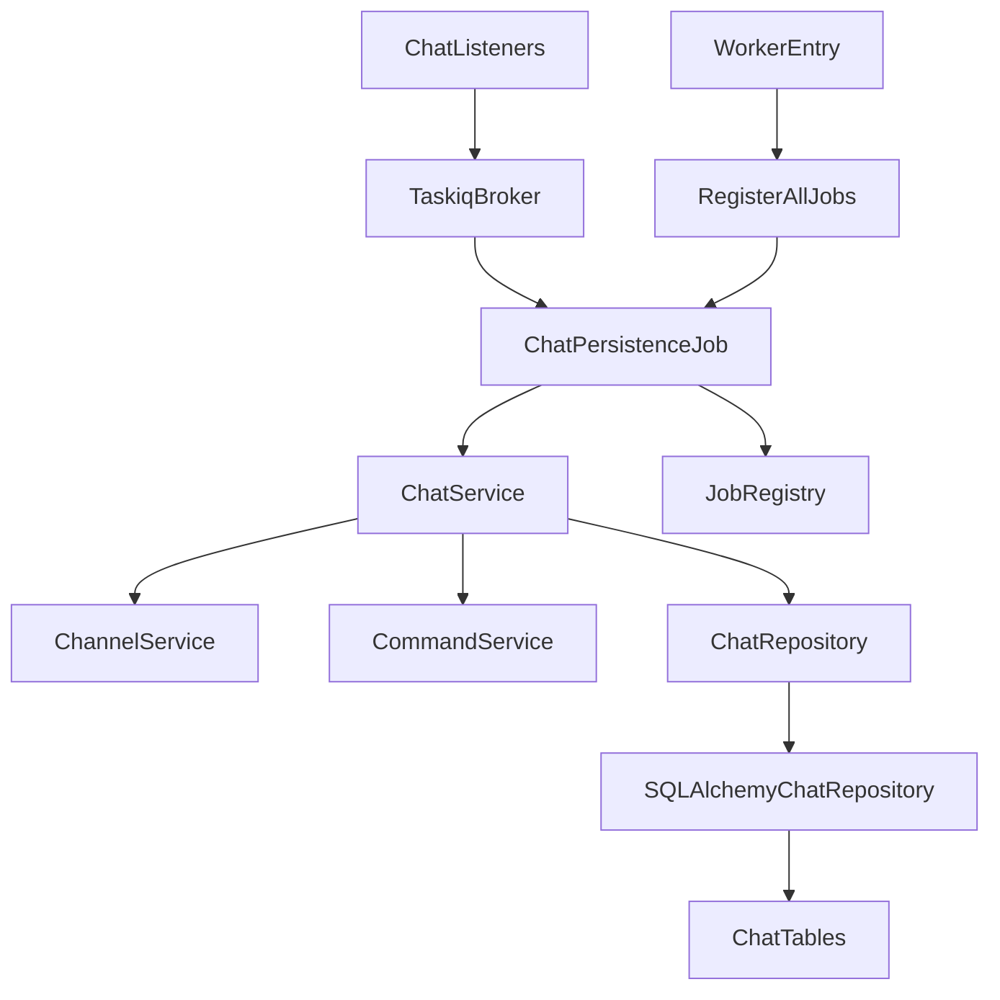
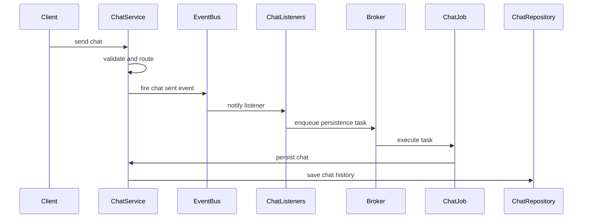
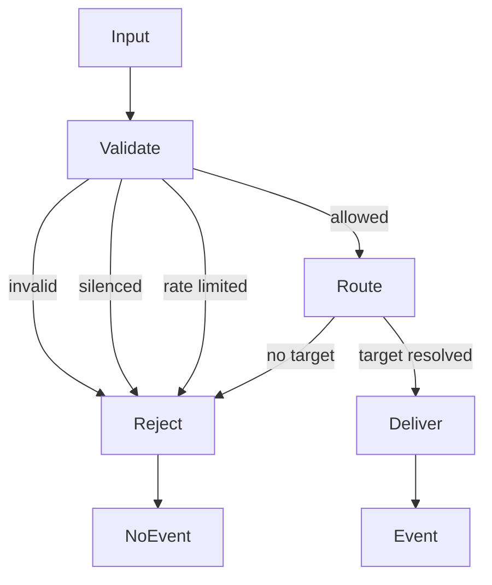
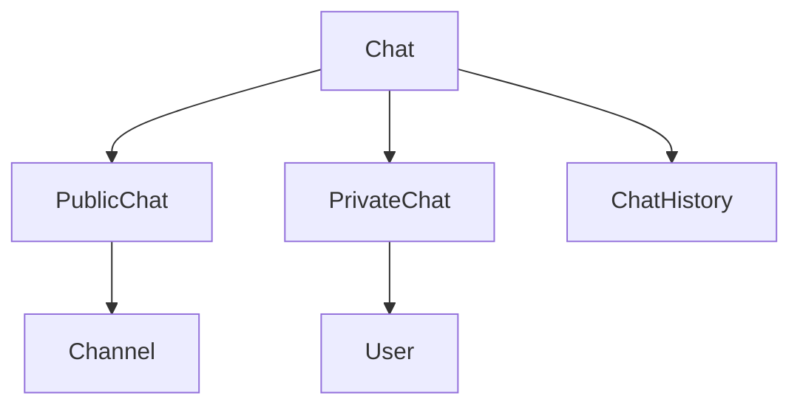

# Design Document

## Overview

**Purpose**: chat-job-refactor は、Chat persistence worker job の責務混在を解消し、queue adapter、Chat use-case、chat history 永続化、taskiq framework integration の境界を後続 job 実装の標準として固定する。

**Users**: athena 開発者と運用者は、この設計により chat 履歴化の振る舞いを検証しやすくし、worker job 失敗や layer violation を早期に検知できる。

**Impact**: 現在 `infrastructure/jobs/message_persistence.py` に混在している app 固有 job handler と ORM 永続化を分離し、`ChatService` を public chat / private chat の共通 use-case 境界として拡張する。

### Goals
- Chat を public/private を内包する上位概念として `ChatService` に集約する。
- worker job を queue payload adapter に限定する。
- SQLAlchemy ORM model 依存を repository 実装に閉じ込める。
- import-linter で `jobs` layer を検証可能にする。

### Non-Goals
- 新しい chat history API、WebUI、Lazer API、IRC/Bot API は実装しない。
- bancho packet format や EventBus の delivery semantics は変更しない。
- `ChannelService` と `CommandService` を `ChatService` に吸収しない。
- 今回の scope では chat history の idempotency key や deduplication schema は追加しない。

## Boundary Commitments

### This Spec Owns
- Chat persistence job の責務分離。
- `ChatService` による public/private chat の履歴化 use-case。
- `ChatRepository` 永続化契約。
- SQLAlchemy chat repository 実装。
- `jobs` layer と import-linter contract。
- job 未登録・実行状態欠落・保存失敗の観測可能性。

### Out of Boundary
- external client protocol adapter としての `transports` 変更。
- channel CRUD、membership、ACL、rate limit の business rule 変更。
- command 実行 semantics の変更。
- chat history retrieval API。
- worker queue の delivery guarantee 変更。

### Allowed Dependencies
- `osu_server.jobs` may import `osu_server.services`, `osu_server.repositories.interfaces`, `osu_server.infrastructure.jobs.registry`, and shared/domain types.
- `osu_server.services` may import repository interfaces and infrastructure interfaces already allowed by the current architecture.
- `osu_server.repositories.sqlalchemy` may import SQLAlchemy ORM models and infrastructure database primitives.
- `osu_server.infrastructure.jobs.registry` must not import app-specific jobs, services, repositories, or transports.
- `osu_server.jobs` and `osu_server.transports` must not import each other.

### Revalidation Triggers
- Chat event payload shape changes.
- Chat persistence task names or queue payload order changes.
- ChatRepository method contract changes.
- ChatService absorbs or removes `PrivateMessageService`.
- Introduction of idempotency / retry deduplication requirements.
- import-linter layer ordering changes.

## Architecture

### Existing Architecture Analysis

Current `ChatService` already orchestrates channel/private message flow, silence check, rate limit, validation, command detection, and event firing. `PrivateMessageService` only resolves PM target existence and online status. `ChatListeners` converts domain events to taskiq job enqueue. The draft worker job currently imports SQLAlchemy ORM models from `infrastructure.jobs.message_persistence`, violating the layer contract and mixing job adapter, use-case, and persistence implementation.

### Architecture Pattern & Boundary Map

**Selected pattern**: layered adapter + repository port. `jobs` is a top-level queue adapter layer. `infrastructure.jobs.registry` remains a framework utility. `ChatService` owns chat use-cases and delegates persistence through `ChatRepository`.



**Boundary decisions**:
- Public/private is not a service split. It is a destination kind inside Chat.
- Channel and command remain separate collaborators because they represent different domain objects/capabilities.
- Worker job does not re-run delivery, ACL, membership, or command decisions.

### Technology Stack

| Layer | Choice / Version | Role in Feature | Notes |
|-------|------------------|-----------------|-------|
| Backend / Services | Python 3.14+ | ChatService and repository contracts | Existing stack |
| Data / Storage | SQLAlchemy 2.0 async | SQLAlchemyChatRepository | No new dependency |
| Messaging / Events | taskiq + taskiq-redis | worker queue execution | Existing stack |
| Infrastructure / Runtime | import-linter, basedpyright, ruff | boundary and quality gates | `jobs` layer added |

## File Structure Plan

### Directory Structure

```text
src/osu_server/
├── jobs/
│   ├── __init__.py                  # imports app-specific jobs and exposes register_all_jobs
│   └── chat_persistence.py          # taskiq queue adapter for chat persistence
├── infrastructure/
│   └── jobs/
│       ├── __init__.py              # registry exports only, no app-specific job import
│       └── registry.py              # JobRegistry and jobs singleton
├── repositories/
│   ├── interfaces/
│   │   └── chat_repository.py       # ChatRepository Protocol and persistence result types
│   └── sqlalchemy/
│       └── chat_repository.py       # SQLAlchemyChatRepository using ORM models
└── services/
    ├── chat_service.py              # add persistence use-case methods and ChatRepository dependency
    └── private_message_service.py   # retained as target resolver collaborator during transition
```

### Modified Files
- `src/osu_server/worker.py` — import `register_all_jobs` from `osu_server.jobs` and keep lifecycle focused on broker startup/shutdown.
- `src/osu_server/composition/service_registry.py` — register `ChatRepository` and inject it into `ChatService`.
- `src/osu_server/transports/bancho/listeners/chat.py` — log job-not-found as an observable operational failure.
- `pyproject.toml` — add `osu_server.jobs` to import-linter layers and add jobs/transports mutual forbidden contracts.
- `tests/unit/test_worker_jobs.py` — update imports and expectations to job adapter + ChatService + repository structure.
- `tests/unit/transports/bancho/test_chat_listeners.py` — verify job missing and enqueue behavior.
- `tests/unit/services/test_chat_service.py` or existing chat tests — verify successful/rejected chat event and persistence behavior.
- `tests/unit/repositories/test_sqlalchemy_chat_repository.py` — verify chat history persistence contract.

### Removed Files
- `src/osu_server/infrastructure/jobs/message_persistence.py` — app-specific job handler removed from infrastructure.
- `src/osu_server/composition/jobs/*` — any temporary composition job placement is removed.

## System Flows

### Successful chat persistence flow



### Rejected chat flow



Only `Event` leads to persistence enqueue. `NoEvent` must not enqueue or persist chat history.

## Requirements Traceability

| Requirement | Summary | Components | Interfaces | Flows |
|-------------|---------|------------|------------|-------|
| 1.1 | public/private as Chat subtypes | ChatService | ChatService methods | Successful chat persistence |
| 1.2 | destination kind distinction | ChatService, ChatRepository | ChatRepository methods | Successful chat persistence |
| 1.3 | private chat not separate delivery concept | ChatService, PrivateMessageService transition | ChatService methods | Successful chat persistence |
| 1.4 | channel collaborator | ChatService, ChannelService | ChannelService existing contract | Rejected chat flow |
| 1.5 | command collaborator | ChatService, CommandService | CommandService existing contract | Rejected chat flow |
| 2.1 | successful public chat persisted | ChatService, ChatPersistenceJob | Channel chat persistence | Successful chat persistence |
| 2.2 | successful private chat persisted | ChatService, ChatPersistenceJob | Private chat persistence | Successful chat persistence |
| 2.3 | invalid chat not persisted | ChatService | send result/event contract | Rejected chat flow |
| 2.4 | rejected chat not persisted | ChatService, ChannelService | send result/event contract | Rejected chat flow |
| 2.5 | command-only input not persisted as chat | ChatService, CommandService | command result contract | Rejected chat flow |
| 3.1 | job not registered observable | ChatListeners | logging contract | Successful chat persistence |
| 3.2 | missing runtime state observable | ChatPersistenceJob | job execution contract | Successful chat persistence |
| 3.3 | unresolved public chat observable | ChatService, ChatRepository | persistence result | Successful chat persistence |
| 3.4 | private persistence failure observable | ChatService, ChatRepository | persistence result | Successful chat persistence |
| 3.5 | delivery success distinct from persistence failure | ChatService, ChatPersistenceJob | logging contract | Successful chat persistence |
| 4.1 | job delegates to ChatService | ChatPersistenceJob, ChatService | job contract | Successful chat persistence |
| 4.2 | job does not rerun delivery policies | ChatPersistenceJob | job contract | Successful chat persistence |
| 4.3 | job has no persistence details | ChatPersistenceJob, ChatRepository | repository contract | Successful chat persistence |
| 4.4 | job adapter responsibility testable | ChatPersistenceJob | job contract | Successful chat persistence |
| 4.5 | standard for future jobs | jobs layer, import-linter | layer contract | N/A |
| 5.1 | public persistence independent of storage | ChatService, ChatRepository | ChatRepository | Successful chat persistence |
| 5.2 | private persistence independent of storage | ChatService, ChatRepository | ChatRepository | Successful chat persistence |
| 5.3 | unresolved channel as failure | ChatRepository, ChatService | persistence result | Successful chat persistence |
| 5.4 | save failure not success | ChatRepository, ChatService | persistence result | Successful chat persistence |
| 5.5 | both persistence contracts testable | ChatRepository tests | repository contract | N/A |
| 6.1 | no mixed framework/adapter/use-case/persistence | jobs layer, registry, service, repository | layer contract | N/A |
| 6.2 | jobs distinct from transports | import-linter | layer contract | N/A |
| 6.3 | framework utility distinct from app job | infrastructure.jobs.registry, jobs | registry contract | N/A |
| 6.4 | layer violations detected | pyproject import-linter | layer contract | N/A |
| 6.5 | future jobs follow same boundary | jobs layer standard | layer contract | N/A |

## Components and Interfaces

| Component | Domain/Layer | Intent | Req Coverage | Key Dependencies | Contracts |
|-----------|--------------|--------|--------------|------------------|-----------|
| ChatPersistenceJob | jobs | queue payload to ChatService adapter | 3, 4, 6 | ChatService P0, JobRegistry P0 | Batch |
| ChatService | services | chat lifecycle and persistence use-case | 1, 2, 3, 5 | ChatRepository P0, ChannelService P1, CommandService P1 | Service, Event |
| ChatRepository | repositories.interfaces | chat history persistence port | 5 | none | Service |
| SQLAlchemyChatRepository | repositories.sqlalchemy | chat history persistence implementation | 5 | ORM models P0, session_factory P0 | Service |
| JobRegistry | infrastructure.jobs | taskiq registration mechanism | 6 | taskiq AsyncBroker P0 | Batch |
| ChatListeners | transports.bancho.listeners | domain event to queue enqueue adapter | 2, 3 | AsyncBroker P0 | Event, Batch |

### jobs

#### ChatPersistenceJob

| Field | Detail |
|-------|--------|
| Intent | Execute taskiq chat persistence tasks and delegate use-case work to ChatService |
| Requirements | 3.2, 3.5, 4.1, 4.2, 4.3, 4.4, 6.1, 6.2, 6.5 |

**Responsibilities & Constraints**
- Accept taskiq payloads for `persist_channel_message` and `persist_private_message`.
- Build or resolve the worker-side ChatService from taskiq state.
- Delegate persistence to ChatService.
- Log missing runtime state as an operational error.
- Must not import SQLAlchemy ORM models.
- Must not call ChannelService/CommandService policy methods directly.

**Dependencies**
- Outbound: ChatService — persistence use-case (P0)
- Outbound: JobRegistry — decorator registration (P0)
- External: taskiq Context — worker runtime state (P0)

**Contracts**: Batch [x]

##### Batch / Job Contract
- Trigger: `ChannelMessageSent` / `PrivateMessageSent` listener enqueue.
- Input / validation:
  - `persist_channel_message(sender_id: int, channel_name: str, sender_name: str, content: str)`
  - `persist_private_message(sender_id: int, target_id: int, sender_name: str, target_name: str, content: str)`
- Output / destination: delegates to ChatService persistence method; no direct DB output.
- Idempotency & recovery: current scope does not add deduplication. Failures are observable and may be retried by queue behavior.

**Implementation Notes**
- Integration: import from `osu_server.infrastructure.jobs.registry` only for decorator registration.
- Validation: tests assert no repository SQLAlchemy model imports from `osu_server.jobs`.
- Risks: worker-side ChatService construction must mirror app-side DI enough to persist without pulling transports.

### services

#### ChatService

| Field | Detail |
|-------|--------|
| Intent | Own public/private chat lifecycle, including successful chat history persistence |
| Requirements | 1.1, 1.2, 1.3, 1.4, 1.5, 2.1, 2.2, 2.3, 2.4, 2.5, 3.3, 3.4, 3.5, 5.1, 5.2, 5.3, 5.4 |

**Responsibilities & Constraints**
- Treat public/private as destination kinds inside Chat.
- Preserve ChannelService and CommandService as collaborators.
- Fire persistence events only after successful delivery eligibility.
- Provide persistence use-case methods for channel/private chat history.
- Must not import SQLAlchemy ORM models.
- Must not become channel management or command execution owner.

**Dependencies**
- Outbound: ChatRepository — chat history persistence (P0)
- Outbound: ChannelService — channel delivery and membership checks (P1)
- Outbound: CommandService — command handling (P1)
- Outbound: EventBus — sent event publication (P1)

**Contracts**: Service [x] / Event [x]

##### Service Interface
```python
class ChatService:
    async def send_channel_message(
        self,
        sender_id: int,
        sender_name: str,
        channel_name: str,
        content: str,
        user_privileges: int = 0,
        user_role_ids: list[int] | None = None,
    ) -> ChannelMessageResult | None: ...

    async def send_private_message(
        self,
        sender_id: int,
        sender_name: str,
        target_name: str,
        content: str,
    ) -> PrivateMessageResult | None: ...

    async def persist_channel_message(
        self,
        *,
        sender_id: int,
        channel_name: str,
        content: str,
    ) -> ChatPersistenceResult: ...

    async def persist_private_message(
        self,
        *,
        sender_id: int,
        target_id: int,
        content: str,
    ) -> ChatPersistenceResult: ...
```
- Preconditions: send methods receive authenticated sender identity; persistence methods receive payload from previously emitted sent events.
- Postconditions: successful persistence returns success result; unresolved target or storage failure returns failure result and logs.
- Invariants: rejected delivery does not emit persistence event.

##### Event Contract
- Published events: `ChannelMessageSent`, `PrivateMessageSent` only for accepted chat.
- Subscribed events: none.
- Ordering / delivery guarantees: EventBus remains fire-and-forget; persistence failure does not retroactively fail delivery.

**Implementation Notes**
- Integration: constructor gains `chat_repository: ChatRepository`.
- Validation: rejected channel target must not fire `ChannelMessageSent`.
- Risks: existing behavior currently fires channel event even if delivery targets are `None`; implementation must correct this with tests.

### repositories

#### ChatRepository

| Field | Detail |
|-------|--------|
| Intent | Define chat history persistence without exposing storage implementation |
| Requirements | 5.1, 5.2, 5.3, 5.4, 5.5 |

**Responsibilities & Constraints**
- Save channel chat history by sender, channel name, and content.
- Save private chat history by sender, target, and content.
- Report unresolved channel as a typed failure result.
- Must not contain chat delivery, ACL, membership, rate limit, or command policy.

**Dependencies**
- Inbound: ChatService — persistence use-case (P0)

**Contracts**: Service [x]

##### Service Interface
```python
class ChatRepository(Protocol):
    async def save_channel_message(
        self,
        *,
        sender_id: int,
        channel_name: str,
        content: str,
    ) -> ChatPersistenceResult: ...

    async def save_private_message(
        self,
        *,
        sender_id: int,
        target_id: int,
        content: str,
    ) -> ChatPersistenceResult: ...
```
- Preconditions: inputs come from accepted chat events.
- Postconditions: success result means row committed; failure result means no silent success.
- Invariants: repository does not apply chat policy.

#### SQLAlchemyChatRepository

| Field | Detail |
|-------|--------|
| Intent | Persist chat history using existing SQLAlchemy channel/private message models |
| Requirements | 5.1, 5.2, 5.3, 5.4, 5.5 |

**Responsibilities & Constraints**
- Use existing `ChannelModel`, `ChannelMessageModel`, and `PrivateMessageModel`.
- Resolve `channel_name` to channel id for channel messages.
- Commit persistence transaction per repository method.
- Convert unresolved channel or DB error into `ChatPersistenceResult`.

**Dependencies**
- Outbound: SQLAlchemy async session factory — transaction scope (P0)
- Outbound: repository ORM models — persistence mapping (P0)

**Contracts**: Service [x]

### infrastructure

#### JobRegistry

| Field | Detail |
|-------|--------|
| Intent | Register coroutine functions with a taskiq broker without knowing app-specific jobs |
| Requirements | 6.1, 6.3, 6.4, 6.5 |

**Responsibilities & Constraints**
- Keep decorator registry framework-focused.
- Attach registered jobs to `AsyncBroker`.
- Must not import `osu_server.jobs`, `osu_server.services`, `osu_server.repositories`, or `osu_server.transports`.

**Contracts**: Batch [x]

### transports

#### ChatListeners

| Field | Detail |
|-------|--------|
| Intent | Convert chat sent domain events to persistence task enqueue |
| Requirements | 2.1, 2.2, 3.1 |

**Responsibilities & Constraints**
- Enqueue persistence jobs for sent events.
- Log missing task registration as operational failure.
- Must not perform persistence directly.
- Must not import `osu_server.jobs`.

**Contracts**: Event [x] / Batch [x]

## Data Models

### Domain Model



- Chat is the feature concept.
- PublicChat and PrivateChat are destination variants.
- ChatHistory is the persisted record of accepted chat.

### Logical Data Model

No new database tables are introduced. Existing tables remain authoritative:
- `channels`
- `channel_messages`
- `private_messages`

### Data Contracts & Integration

#### ChatPersistenceResult

```python
@dataclass(slots=True, frozen=True)
class ChatPersistenceResult:
    success: bool
    reason: ChatPersistenceFailureReason | None = None
```

`ChatPersistenceFailureReason` values:
- `channel_not_found`
- `storage_error`
- `runtime_unavailable`

## Error Handling

### Error Strategy

- Rejected chat delivery returns existing service result semantics and does not emit sent event.
- Job missing is logged by ChatListeners.
- Worker runtime state missing is logged by ChatPersistenceJob.
- Repository unresolved channel or DB failure returns failure result and is logged by ChatService/job.

### Monitoring

Structured log event names:
- `chat_persistence_task_not_registered`
- `chat_persistence_runtime_unavailable`
- `chat_persistence_channel_not_found`
- `chat_persistence_failed`
- `chat_persistence_succeeded`

## Testing Strategy

### Unit Tests
- `ChatService` rejects invalid/silenced/rate-limited/channel-denied chat without firing sent event (2.3, 2.4).
- `ChatService` persists channel/private chat through `ChatRepository` without SQLAlchemy model imports (5.1, 5.2).
- `ChatService` handles repository failure result without reporting success (3.3, 3.4, 5.4).
- `ChatPersistenceJob` delegates to ChatService and does not import SQLAlchemy models (4.1, 4.3, 4.4).
- `ChatListeners` logs missing task registration (3.1).

### Integration Tests
- SQLAlchemyChatRepository stores channel/private chat rows in existing tables (5.5).
- worker broker registers `persist_channel_message` and `persist_private_message` through top-level `jobs` package (6.3).
- `uv run lint-imports` keeps layer architecture with new `osu_server.jobs` layer (6.4).

### E2E Tests
- Existing bancho chat flow continues to deliver accepted channel/private messages and enqueue persistence tasks.
- Rejected channel/PM inputs do not create persistence jobs.

## Security Considerations

- No new external API or user-facing permission surface is introduced.
- Persistence methods trust payloads produced by accepted chat events; validation remains in send flow.
- Future direct job enqueue sources must be treated as boundary inputs and revalidated.

## Performance & Scalability

- Persistence remains asynchronous through taskiq and does not block chat delivery.
- Repository methods commit per message as current behavior does.
- High-volume deduplication or batching is out of scope and requires revalidation.
