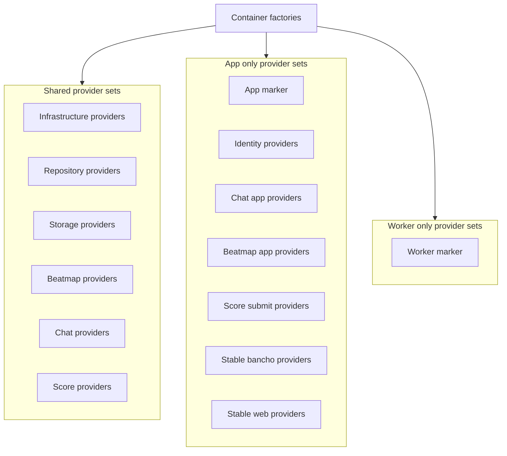
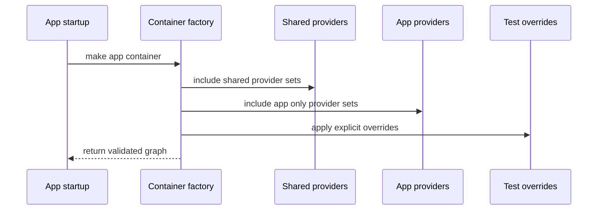
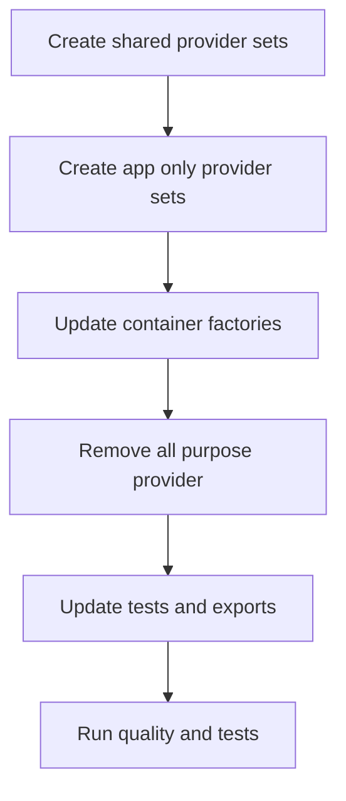

# Design Document

## Overview

この spec は、Athena の Dishka provider graph を `CommonProviderSet` と肥大化した `AppProviderSet` から、責務別 provider set の集合へ再編する。対象ユーザーは Athena の開発者・メンテナーであり、feature 追加時に必要な dependency wiring を短時間で見つけ、app/worker/test graph の互換性を保ったまま provider を変更できる状態を提供する。

この変更は runtime behavior を変更しない。Stable client endpoint、packet、legacy web response、worker task name、task payload は維持し、composition root 内の provider ownership と import locality だけを改善する。

### Goals

- `CommonProviderSet` を production wiring surface から撤去し、shared provider sets を責務別に分割する。
- `AppProviderSet` を app graph marker に縮小し、app-only workflow provider sets を stable transport/context 別に分割する。
- `make_app_container` と `make_worker_container` の public factory contract を維持する。
- provider replacement、startup failure、shutdown finalization、dependency boundary validation の既存契約を維持する。

### Non-Goals

- Dishka 以外の DI framework への移行。
- Domain、service、repository、transport、job の外部挙動変更。
- New runtime dependency の追加。
- Database schema、storage schema、task payload、HTTP API、stable packet contract の変更。
- Provider を `domain/*` や `infrastructure/*` の所有物として配置すること。

## Boundary Commitments

### This Spec Owns

- `src/osu_server/composition/providers/` 配下の production provider set 分割。
- App、worker、test container factory が合成する provider list。
- Provider replacement helper と in-memory runtime override が分割後も働くこと。
- Provider graph tests と production provider module validation の更新。

### Out of Boundary

- Use-case、repository、domain model、transport handler、job adapter の責務変更。
- Stable client login、polling、chat、registration、getscores、score submit の response shape 変更。
- Worker task name、payload shape、retry/idempotency policy の変更。
- import-linter contract の緩和。
- Project-wide config や dependency lock の変更。

### Allowed Dependencies

- `composition.providers.*` は composition root として concrete infrastructure、repository implementations、services、transports、jobs、Dishka を import できる。
- `domain.*`、`services.*`、`repositories.interfaces.*` は provider type、Dishka、composition module を import しない。
- Provider modules は sibling provider modules へ依存せず、cross-provider dependency は Dishka graph の type resolution で接続する。
- `container.py` だけが provider set の合成順と app/worker inclusion boundary を所有する。
- Tests may import provider modules to validate composition behavior and production module policy.

### Revalidation Triggers

- `make_app_container` または `make_worker_container` の signature 変更。
- App/worker の provider inclusion boundary 変更。
- Provider を `composition/providers/` 以外へ移す変更。
- Stable transport handler、worker task、managed runtime dependency の provider ownership 変更。
- Query repository、Unit of Work、session store、state store の provided type 変更。

## Architecture

### Existing Architecture Analysis

Current composition uses two large production provider sets:

- `CommonProviderSet`: config、DB engine、session factory、Valkey、broker、HTTP client、event bus、state stores、session store、Unit of Work、query repositories、storage service、beatmap use-cases、chat use-cases、score crypto、stable score submit mapper を同居させている。
- `AppProviderSet`: app marker に加えて identity/auth、chat app commands、beatmap mirror integration、stable bancho workflows、stable web legacy handlers、score submission workflow を同居させている。

The architecture contract already allows composition to import concrete implementations, but provider ownership must remain in `composition/providers/`. Therefore the design keeps construction ownership centralized in composition while splitting provider files by responsibility.

### Architecture Pattern & Boundary Map

**Selected pattern**: Hybrid composition provider sets.

Shared resources are split by layer-like responsibility because DB, Valkey, broker, storage backend, and repository implementations are app/worker shared. Feature and transport workflow providers are split by context or stable transport family because they change with feature work.



**Architecture Integration**

- Domain/feature boundaries: shared provider sets expose use-cases and repositories needed by both app and worker; app-only provider sets expose stable transport workflows and app-facing commands only.
- Existing patterns preserved: Dishka documented provider composition, class-level scope, `@provide` factories, generator finalization, explicit provider overrides for tests, startup failure on missing dependency.
- New components rationale: each new provider set owns one dependency category to prevent all new wiring from landing in one file.
- Steering compliance: provider construction remains in `composition/providers/`; domain/services/repository interfaces remain provider-independent.

### Technology Stack

| Layer | Choice / Version | Role in Feature | Notes |
|-------|------------------|-----------------|-------|
| Composition | Dishka 1.10.1 | Provider graph construction and APP scoped lifecycle | Existing dependency from lockfile, no new library |
| Runtime | starlette-dishka 1.0.2 and taskiq integration | App/worker container startup and finalization | Existing integration points remain |
| Validation | ruff, basedpyright, import-linter, pytest | Boundary and graph regression checks | Existing quality gates remain |

## File Structure Plan

### Directory Structure

```text
src/osu_server/composition/providers/
├── __init__.py              # Re-export public provider markers and container factories
├── app.py                   # AppProviderGraph and AppProviderSet marker only
├── beatmaps.py              # Shared beatmap policies, providers, queries, fetch use-cases
├── beatmaps_app.py          # App-only beatmap mirror service and enqueue integration
├── chat.py                  # Shared channel/message query and lightweight chat command use-cases
├── chat_app.py              # App-only send message use-cases and BanchoBot command service
├── container.py             # make_app_container and make_worker_container provider composition
├── identity.py              # App-only auth, permission, session authorization, online user providers
├── infrastructure.py        # Config, DB engine, Valkey, broker, HTTP client, state, security clients
├── repositories.py          # UnitOfWorkFactory and SQLAlchemy query repository providers
├── scores.py                # Shared score crypto and score listing query providers
├── score_submission.py      # App-only score authorization and process submission providers
├── stable_bancho.py         # Stable bancho workflows, handlers, dispatcher, listeners
├── stable_web_legacy.py     # Stable legacy web handlers, parsers, mappers
├── storage.py               # Blob storage service provider
├── test.py                  # TestProviderSet and in-memory runtime overrides
└── worker.py                # WorkerProviderGraph and WorkerProviderSet marker
```

### Modified Files

- `src/osu_server/composition/providers/common.py` - remove as production all-purpose provider after dependencies move to responsibility-specific provider sets.
- `src/osu_server/composition/providers/app.py` - shrink to `AppProviderGraph` marker and app provider marker only.
- `src/osu_server/composition/providers/container.py` - compose shared provider sets plus app-only or worker-only provider sets through `make_async_container`.
- `src/osu_server/composition/providers/__init__.py` - export new provider set names and remove `CommonProviderSet` from the supported surface.
- `src/osu_server/composition/providers/test.py` - keep provider replacement helpers; update in-memory overrides only where provided type ownership changes.
- `tests/unit/composition/test_common_provider_graph.py` - rename or restructure around shared provider graph expectations.
- `tests/unit/composition/test_provider_replacement.py` - update production module list and marker expectations.
- `tests/unit/composition/test_beatmap_mirror_composition.py` - import `enqueue_beatmap_fetch` from the new beatmap app provider module.
- `tests/unit/test_di_integration.py` - keep app container resolution coverage and update expected provider grouping names if needed.
- `tests/unit/transports/bancho/test_di_registration.py` - keep dispatcher singleton resolution coverage.
- `tests/integration/test_app_startup.py` - remains the lifecycle smoke validation target.

## System Flows



Worker startup follows the same flow but includes shared provider sets and `WorkerProviderSet` only. App-only stable transport providers are not included in the worker graph.

## Requirements Traceability

| Requirement | Summary | Components | Interfaces | Flows |
|-------------|---------|------------|------------|-------|
| 1.1 | Provider wiring stays composition-owned | All provider sets, Container Factory | Provider Set Contract | App startup flow |
| 1.2 | Domain/infrastructure-owned providers are boundary violations | File Structure Plan, Testing Strategy | import-linter contract | Validation |
| 1.3 | Domain/services/repository interfaces avoid Dishka | Boundary Commitments, Testing Strategy | Import boundary | Validation |
| 1.4 | Provider split introduces no import-linter violation | Testing Strategy | Quality gate | Validation |
| 2.1 | Feature area wiring is distinguishable | Beatmap, Chat, Identity, Score, Stable providers | Provider Set Contract | None |
| 2.2 | Shared dependencies are separate from app-only workflows | Shared provider sets, App-only provider sets | Container Factory | App and worker composition |
| 2.3 | Stable workflow dependency is separate from infrastructure/repositories | StableBanchoProviderSet, StableWebLegacyProviderSet | Provider Set Contract | App startup flow |
| 2.4 | New wiring no longer targets all-purpose providers | File Structure Plan, Container Factory | Provider Set Contract | Review validation |
| 3.1 | App graph resolves existing dependencies | Container Factory, App-only provider sets | `make_app_container` | App startup flow |
| 3.2 | Worker graph resolves existing dependencies | Container Factory, Shared provider sets | `make_worker_container` | Worker startup flow |
| 3.3 | Missing required dependency fails before serving or task execution | Dishka graph construction | Runtime lifecycle contract | App and worker startup |
| 3.4 | Test provider replacement still works | TestProviderSet | Provider override contract | Test graph composition |
| 4.1 | Managed dependencies keep lifetime behavior | InfrastructureProviderSet | APP scope providers | Startup and shutdown |
| 4.2 | Shutdown finalizes managed dependencies | InfrastructureProviderSet | Async iterator providers | Shutdown |
| 4.3 | Creation/finalization failure remains observable | Runtime lifecycle | Startup failure contract | Startup and shutdown |
| 4.4 | App and worker share consistent dependency lifecycle | Shared provider sets | APP scope contract | App and worker startup |
| 5.1 | Stable login behavior remains compatible | StableBanchoProviderSet, IdentityProviderSet | Transport handler graph | Login |
| 5.2 | Polling, chat, registration, getscores, score submit behavior remains compatible | StableBanchoProviderSet, StableWebLegacyProviderSet, ScoreSubmissionProviderSet | Transport handler graph | Stable flows |
| 5.3 | Worker task contract remains compatible | Shared provider sets, WorkerProviderSet | Worker graph contract | Worker task resolution |
| 5.4 | Public endpoint and task contracts do not change | Boundary Commitments | Public runtime contract | Validation |
| 6.1 | Quality validation passes | Testing Strategy | Quality gate | Validation |
| 6.2 | Relevant automated tests cover graph behavior | Testing Strategy | Test suite | Validation |
| 6.3 | Circular import and import-time failures are caught | Testing Strategy, Container Factory | Import and graph construction | Validation |
| 6.4 | New wiring is not centralized in old all-purpose provider | File Structure Plan, review checks | Provider Set Contract | Review validation |

## Components and Interfaces

| Component | Layer | Intent | Req Coverage | Key Dependencies | Contracts |
|-----------|-------|--------|--------------|------------------|-----------|
| Container Factory | Composition | Build app and worker containers from provider set groups | 1.1, 2.2, 3.1, 3.2, 3.4, 4.4 | Dishka P0, provider sets P0 | Service |
| InfrastructureProviderSet | Composition | Provide managed runtime infrastructure and state clients | 3.1, 3.2, 4.1, 4.2, 4.3, 4.4 | AppConfig P0, infrastructure adapters P0 | Service, State |
| RepositoryProviderSet | Composition | Provide Unit of Work factory and query repository implementations | 1.1, 2.2, 3.1, 3.2 | SQLAlchemy session factory P0 | Service |
| StorageProviderSet | Composition | Provide blob storage application service | 2.1, 3.1, 3.2 | BlobStorageBackend P0, UoW P0 | Service |
| BeatmapProviderSet | Composition | Provide shared beatmap policies, providers, queries, fetch use-cases | 2.1, 3.1, 3.2, 5.3 | Repositories P0, storage P0 | Service |
| ChatProviderSet | Composition | Provide shared channel/message queries and lightweight chat commands | 2.1, 3.1, 3.2, 5.3 | Repositories P0, state stores P0 | Service |
| ScoreProviderSet | Composition | Provide shared score crypto and beatmap score listing query | 2.1, 3.1, 3.2 | Repositories P0 | Service |
| IdentityProviderSet | Composition | Provide app-only auth, permissions, sessions, online user dependencies | 2.1, 3.1, 5.1, 5.2 | Repositories P0, session store P0, HIBP P1 | Service |
| ChatAppProviderSet | Composition | Provide app-only send message commands and BanchoBot command service | 2.1, 3.1, 5.2 | Chat shared providers P0, identity/session P0 | Service |
| BeatmapAppProviderSet | Composition | Provide app-only beatmap mirror service and enqueue integration | 2.1, 3.1, 5.2 | Beatmap shared providers P0, broker P0 | Service |
| ScoreSubmissionProviderSet | Composition | Provide app-only score authorization and submission processing workflow | 2.1, 3.1, 5.2 | Score shared P0, storage P0, beatmap app P0 | Service |
| StableBanchoProviderSet | Composition | Provide stable bancho endpoint workflows, handlers, dispatcher, listeners | 2.3, 3.1, 5.1, 5.2 | Identity P0, chat app P0, packet queue P0 | Service |
| StableWebLegacyProviderSet | Composition | Provide registration, getscores, score submit web legacy handlers and mappers | 2.3, 3.1, 5.2, 5.4 | Identity P0, score submission P0, score listing P0 | Service |
| AppProviderSet | Composition | Provide app graph marker only | 3.1, 3.4 | None | Service |
| WorkerProviderSet | Composition | Provide worker graph marker only | 3.2, 5.3 | None | Service |
| TestProviderSet | Composition Test | Provide explicit provider replacements for tests | 3.4, 6.2 | Dishka P0, typed fakes P0 | Service |

### Composition

#### Container Factory

| Field | Detail |
|-------|--------|
| Intent | App/worker container factories own provider set inclusion and override ordering |
| Requirements | 1.1, 2.2, 3.1, 3.2, 3.4, 4.4 |

**Responsibilities & Constraints**

- `make_app_container(config, overrides=())` includes shared provider sets, app marker, and app-only provider sets.
- `make_worker_container(config, overrides=())` includes shared provider sets and worker marker only.
- Overrides remain last in `make_async_container` so tests can replace production providers.
- Provider group helper functions are private to `container.py` unless task implementation needs test visibility.

**Contracts**: Service [x] / API [ ] / Event [ ] / Batch [ ] / State [ ]

##### Service Interface

```python
def make_app_container(
    config: AppConfig,
    overrides: Iterable[Provider] = (),
) -> AsyncContainer: ...

def make_worker_container(
    config: AppConfig,
    overrides: Iterable[Provider] = (),
) -> AsyncContainer: ...
```

- Preconditions: `config` is a fully validated `AppConfig`; overrides are explicit Dishka providers.
- Postconditions: returned container can resolve all app or worker runtime dependencies required by existing tests.
- Invariants: production provider functions do not branch on `config.environment == "test"`.

#### Provider Set Contract

| Field | Detail |
|-------|--------|
| Intent | Each provider set owns one dependency category and exposes typed Dishka providers |
| Requirements | 1.1, 2.1, 2.4, 6.4 |

**Responsibilities & Constraints**

- Provider classes subclass `dishka.Provider` and default to APP scope unless a future requirement proves request scope is needed.
- Provider classes set `scope = Scope.APP` when all factories in that provider are app-scoped; method-level scope is used only when a factory has a different lifetime.
- Cross-provider dependencies are declared as typed method parameters, not by importing sibling provider classes.
- Provider methods use `@provide` as the default registration style so each provided dependency is visible at the method definition.
- Programmatic `self.provide(..., provides=...)` registration is allowed only when Dishka cannot reliably infer the provided type, such as generic alias providers or runtime annotation edge cases.
- Any remaining programmatic registration must be local to one provider set and documented by the surrounding method/type name; broad all-purpose registration loops are out of boundary.

**Contracts**: Service [x] / API [ ] / Event [ ] / Batch [ ] / State [ ]

##### Service Interface

```python
class ExampleProviderSet(Provider):
    scope = Scope.APP

    @provide
    def dependency(self) -> Dependency: ...
```

- Preconditions: provided dependency types are unique within the composed app or worker graph unless an explicit override is used.
- Postconditions: provider set can be imported without importing unrelated feature contexts.
- Invariants: provider module lives under `osu_server.composition.providers`; decorator-first registration is used unless explicit `provides` is necessary.

### Shared Provider Sets

#### InfrastructureProviderSet

| Field | Detail |
|-------|--------|
| Intent | Provide app/worker shared infrastructure and managed runtime dependencies |
| Requirements | 3.1, 3.2, 4.1, 4.2, 4.3, 4.4 |

**Responsibilities & Constraints**

- Owns `AppConfig`, DB engine, session factory, Valkey client, taskiq broker, HTTP client, event bus, packet queue, channel state store, rate limiter, country resolver, HIBP client, blob storage backend, and session store providers.
- Preserves async iterator finalization for engine, Valkey, broker, and HTTP client.
- Calls job registration for the broker exactly where the current runtime graph expects task discovery.

**Contracts**: Service [x] / API [ ] / Event [ ] / Batch [ ] / State [x]

#### RepositoryProviderSet

| Field | Detail |
|-------|--------|
| Intent | Provide command Unit of Work factory and query repository implementations |
| Requirements | 1.1, 2.2, 3.1, 3.2 |

**Responsibilities & Constraints**

- Owns `UnitOfWorkFactory` and SQLAlchemy query repository providers for users, roles, channels, chat history, beatmaps, beatmap score listings, blobs, and scores.
- Does not provide domain services or transport mappers.
- Receives the session factory from `InfrastructureProviderSet`.

**Contracts**: Service [x] / API [ ] / Event [ ] / Batch [ ] / State [ ]

#### StorageProviderSet

| Field | Detail |
|-------|--------|
| Intent | Provide blob storage command service shared by app and worker use-cases |
| Requirements | 2.1, 3.1, 3.2 |

**Responsibilities & Constraints**

- Owns `BlobStorageService`.
- Depends on blob query repository, Unit of Work factory, blob backend, and config.
- Does not own backend construction; backend remains infrastructure.

**Contracts**: Service [x] / API [ ] / Event [ ] / Batch [ ] / State [ ]

#### BeatmapProviderSet

| Field | Detail |
|-------|--------|
| Intent | Provide shared beatmap policy, provider, query, and fetch dependencies |
| Requirements | 2.1, 3.1, 3.2, 5.3 |

**Responsibilities & Constraints**

- Owns beatmap freshness policy, metadata provider, file provider, eligibility service, resolve beatmap queries, fetch metadata command, and fetch file command.
- Keeps official/mirror metadata composition here because it is beatmap-specific construction, still owned by composition root.
- Does not own `BeatmapMirrorService`; that service enqueues worker tasks and is app-only.

**Contracts**: Service [x] / API [ ] / Event [ ] / Batch [ ] / State [ ]

#### ChatProviderSet

| Field | Detail |
|-------|--------|
| Intent | Provide shared channel and message read queries plus lightweight channel membership commands |
| Requirements | 2.1, 3.1, 3.2, 5.3 |

**Responsibilities & Constraints**

- Owns visible/autojoin channel queries, channel message delivery query, channel/private message history queries, join/leave channel use-cases, and persisted message use-cases.
- Depends on query repositories, state stores, and Unit of Work factory.
- Does not own BanchoBot command dispatch or send message commands because those are app-facing chat workflows.

**Contracts**: Service [x] / API [ ] / Event [ ] / Batch [ ] / State [ ]

#### ScoreProviderSet

| Field | Detail |
|-------|--------|
| Intent | Provide shared score helpers and score listing query |
| Requirements | 2.1, 3.1, 3.2 |

**Responsibilities & Constraints**

- Owns `ScoreCryptoService` and `BeatmapScoreListingQuery`.
- Does not own stable score form parsing or score submit handlers.
- Does not own score submission command workflow that depends on stable payload parsing.

**Contracts**: Service [x] / API [ ] / Event [ ] / Batch [ ] / State [ ]

### App-Only Provider Sets

#### IdentityProviderSet

| Field | Detail |
|-------|--------|
| Intent | Provide authentication, authorization, session authorization, and online user app dependencies |
| Requirements | 2.1, 3.1, 5.1, 5.2 |

**Responsibilities & Constraints**

- Owns BanchoBot system identity sync, password service, permission service, compute authorization queries, auth service, login/register commands, authorization refresh commands, online users service/query, and session credentials query.
- Keeps system user sync failure as startup-observable failure.
- Does not own stable login response construction.

**Contracts**: Service [x] / API [ ] / Event [ ] / Batch [ ] / State [ ]

#### ChatAppProviderSet

| Field | Detail |
|-------|--------|
| Intent | Provide app-facing chat send workflows and BanchoBot command service |
| Requirements | 2.1, 3.1, 5.2 |

**Responsibilities & Constraints**

- Owns private message target query, private message service, BanchoBot command service, send channel message use-case, and send private message use-case.
- Depends on shared chat query providers, identity/session dependencies, event bus, rate limiter, and config.

**Contracts**: Service [x] / API [ ] / Event [ ] / Batch [ ] / State [ ]

#### BeatmapAppProviderSet

| Field | Detail |
|-------|--------|
| Intent | Provide app-facing beatmap mirror resolution and refresh enqueue integration |
| Requirements | 2.1, 3.1, 5.2 |

**Responsibilities & Constraints**

- Owns `BeatmapMirrorService`.
- Owns `enqueue_beatmap_fetch` helper because it maps beatmap fetch targets to taskiq task names.
- Does not change existing task names or target payload values.

**Contracts**: Service [x] / API [ ] / Event [ ] / Batch [x] / State [ ]

##### Batch Contract

- Trigger: `BeatmapMirrorService` requests metadata or file refresh.
- Input / validation: `BeatmapFetchTarget.target_type` and `target_key` from domain beatmap values.
- Output / destination: taskiq task named `fetch_beatmap_metadata` or `fetch_beatmap_file`.
- Idempotency & recovery: unchanged from existing worker task behavior.

#### ScoreSubmissionProviderSet

| Field | Detail |
|-------|--------|
| Intent | Provide app-only score authorization and process submission workflow |
| Requirements | 2.1, 3.1, 5.2 |

**Responsibilities & Constraints**

- Owns score authorization service, submit score use-case, stable score payload parser, and process score submission use-case.
- Depends on shared score crypto, blob storage service, identity credentials, and beatmap mirror service.
- Does not own HTTP form mapper or web legacy handler.

**Contracts**: Service [x] / API [ ] / Event [ ] / Batch [ ] / State [ ]

#### StableBanchoProviderSet

| Field | Detail |
|-------|--------|
| Intent | Provide stable bancho login, polling, packet dispatcher, handlers, and event listeners |
| Requirements | 2.3, 3.1, 5.1, 5.2, 5.4 |

**Responsibilities & Constraints**

- Owns login response builder, login workflow, lifecycle handlers, chat handlers, app event listener registration marker, packet dispatcher, polling workflow, and bancho endpoint.
- Depends on identity, shared chat, chat app, packet queue, event bus, broker, channel state, and config.
- Does not own web legacy handlers.

**Contracts**: Service [x] / API [ ] / Event [x] / Batch [ ] / State [ ]

##### Event Contract

- Published events: unchanged; provider only wires listeners.
- Subscribed events: stable bancho listeners registered by `setup_listeners`.
- Ordering / delivery guarantees: unchanged from existing in-process event bus behavior.

#### StableWebLegacyProviderSet

| Field | Detail |
|-------|--------|
| Intent | Provide stable legacy web handlers, parsers, status mappers, and form mappers |
| Requirements | 2.3, 3.1, 5.2, 5.4 |

**Responsibilities & Constraints**

- Owns registration handler, getscores parser, getscores status mapper, getscores handler, stable score submit mapper, score submit handler.
- Keeps stable form parsing and response compatibility in stable transport wiring.
- Does not own score processing use-case construction.

**Contracts**: Service [x] / API [ ] / Event [ ] / Batch [ ] / State [ ]

## Data Models

No domain, logical, or physical data models change in this spec. Provider modularization changes only dependency construction.

## Error Handling

### Error Strategy

- Missing provider or dependency resolution failure remains a startup or task-resolution failure, not a partial runtime mode.
- Managed dependency creation and finalization keep the existing async iterator lifecycle behavior.
- Provider import failures and circular imports are treated as validation failures.

### Error Categories and Responses

- Composition errors: graph construction fails during app/worker startup or test container creation.
- Lifecycle errors: managed dependency finalization failure remains observable through existing runtime lifecycle logging.
- Boundary errors: import-linter reports dependency direction violations.

### Monitoring

No new monitoring sink is introduced. Existing startup/shutdown logging and test failures remain the observation mechanism for this refactor.

## Testing Strategy

### Unit Tests

- Update shared provider graph tests to resolve infrastructure, repository, storage, beatmap, chat, and score dependencies through the app container and worker container.
- Update app provider graph tests to resolve identity, chat app, beatmap app, score submission, stable bancho, and stable web legacy dependencies.
- Update provider replacement tests to scan all production provider modules for absence of `environment == "test"` branches.
- Add or update a provider module responsibility test that verifies `CommonProviderSet` is not exported as a supported production provider and `AppProviderSet` is marker-only.
- Keep beatmap enqueue tests and move imports to `beatmaps_app.py`.

### Integration Tests

- Keep Starlette startup tests verifying `app.state.dishka_container` and root/health request behavior.
- Keep taskiq/worker tests verifying `make_worker_container` is used and existing task names can resolve use-case dependencies.
- Keep DI integration tests verifying stable transport handlers resolve from the app container with in-memory provider overrides.

### E2E / Smoke

- Existing smoke paths remain sufficient for this refactor: stable root POST/GET, `/health`, and worker graph construction.
- No browser/UI E2E applies.

## Migration Strategy



- Phase one moves infrastructure, repository, storage, beatmap, chat, and score shared providers out of `common.py`.
- Phase two moves identity, app chat, app beatmap, score submission, stable bancho, and stable web legacy providers out of `app.py`.
- Phase three updates `container.py` to compose provider sets directly.
- Phase four removes the old production all-purpose provider surface.
- Phase five updates exports and tests.
- Phase six runs formatting, linting, type checking, dependency validation, and relevant tests.

## Security Considerations

- No auth policy, permission model, credential storage, or transport authentication behavior changes.
- HIBP client construction remains in infrastructure provider ownership and is only consumed by identity providers.
- Stable score submit parsing and crypto dependencies are rewired only at composition time.

## Performance & Scalability

- No runtime algorithm or storage access pattern changes.
- Provider set count increases, but graph construction remains startup-scoped. The expected runtime request path is unchanged.
- Startup graph validation remains the primary cost point and is acceptable because it replaces import hotspot risk with clearer composition boundaries.
