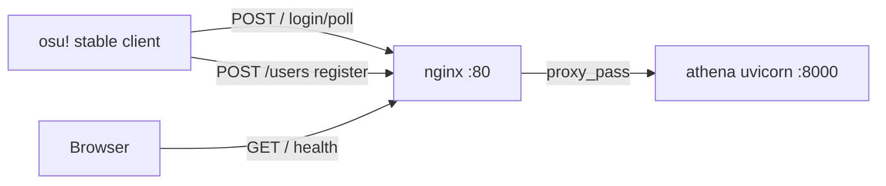
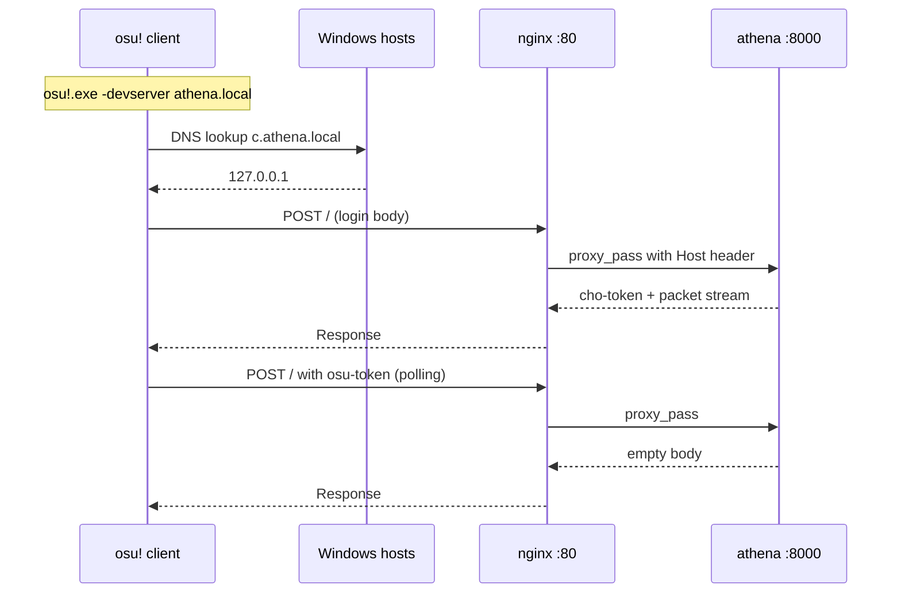

# Design Document: dev-proxy

## Overview

**Purpose**: osu! stable クライアントが `-devserver athena.local` でローカル開発サーバーに接続できるようにする nginx リバースプロキシ環境。

**Users**: athena 開発者（ローカルテスト）。

**Impact**: devenv up だけで stable クライアント接続テストが可能になる。

### Goals
- `devenv up` で nginx + athena が自動起動し、stable クライアントから接続可能
- 全 osu! サブドメインを単一 server ブロックで受け付け
- ブラウザでヘルスチェック確認可能

### Non-Goals
- 本番環境のデプロイ設定
- TLS 証明書の自動取得（Let's Encrypt）
- アバター/バナーサーバーの実装
- mitmproxy 統合

## Boundary Commitments

### This Spec Owns
- `nginx.dev.conf` の作成と管理
- devenv.nix への nginx プロセス追加
- `hosts.example` ファイル
- config.py の `domain` デフォルト値変更
- ヘルスチェックエンドポイント（GET / のレスポンス）
- HTTPS コメントアウト設定と mkcert パッケージ追加

### Out of Boundary
- athena の Host ベースルーティング（bancho-login spec で実装済み）
- TLS 証明書の自動取得・管理
- 本番用 nginx 設定
- WSL2 以外のプラットフォーム固有設定

### Allowed Dependencies
- nginx（nix パッケージ）
- mkcert（nix パッケージ、オプション）
- 既存の athena app（uvicorn :8000）
- 既存の devenv.nix プロセス管理

### Revalidation Triggers
- athena のリッスンポート変更
- 新しいサブドメインの追加（現在未定義のもの）
- devenv.nix のプロセス管理方式変更

## Architecture



### Technology Stack

| Layer | Choice | Role | Notes |
|-------|--------|------|-------|
| Reverse Proxy | nginx | ポート 80 → 8000 転送 | nix パッケージ |
| TLS (optional) | mkcert | ローカル証明書生成 | nix パッケージ、手動有効化 |
| Environment | devenv.nix | プロセス管理 | processes.nginx |
| Port Binding | sysctl | 非 root ポート 80 | `ip_unprivileged_port_start=80` |

## File Structure Plan

### New Files
```
nginx.dev.conf              # nginx リバースプロキシ設定
hosts.example               # Windows hosts ファイルのテンプレート
```

### Modified Files
- `devenv.nix` — `processes.nginx` 追加、mkcert パッケージ追加
- `src/osu_server/config.py` — `domain` デフォルトを `athena.local` に変更
- `src/osu_server/app.py` — ヘルスチェック GET / レスポンス追加（バージョン + コミットハッシュ）

## System Flows

### stable クライアント接続フロー



## Requirements Traceability

| Req | Summary | Components | Files |
|-----|---------|------------|-------|
| 1.1-1.6 | nginx リバースプロキシ | nginx.dev.conf | `nginx.dev.conf` |
| 2.1-2.4 | devenv 統合 | devenv.nix processes | `devenv.nix` |
| 3.1 | domain デフォルト | AppConfig | `config.py` |
| 3.2-3.3 | hosts.example | hosts テンプレート | `hosts.example` |
| 4.1-4.3 | ヘルスチェック | app.py GET / | `app.py` |
| 5.1-5.3 | HTTPS オプション | nginx.dev.conf + devenv | `nginx.dev.conf`, `devenv.nix` |

## Components and Interfaces

### nginx.dev.conf

| Field | Detail |
|-------|--------|
| Intent | 全 osu! サブドメインのリバースプロキシ設定 |
| Requirements | 1.1-1.6, 5.1 |

**Server Block 構成**:
- `listen 80`
- `server_name` に全サブドメイン列挙: `c.athena.local c1.athena.local ce.athena.local c4.athena.local c5.athena.local c6.athena.local osu.athena.local a.athena.local b.athena.local api.athena.local`
- `proxy_pass http://127.0.0.1:8000`
- `proxy_set_header Host $host` — Host ヘッダ保持
- `proxy_set_header X-Real-IP $remote_addr`
- `proxy_set_header X-Forwarded-For $proxy_add_x_forwarded_for`
- WebSocket 対応: `proxy_http_version 1.1`, `Upgrade $http_upgrade`, `Connection "upgrade"`
- HTTPS ブロック: コメントアウト状態、listen 443 ssl、証明書パス placeholder

### devenv.nix nginx プロセス

| Field | Detail |
|-------|--------|
| Intent | devenv up で nginx 自動起動 |
| Requirements | 2.1-2.4 |

**構成**:
```nix
processes.nginx = {
  exec = "sudo sysctl -w net.ipv4.ip_unprivileged_port_start=80 > /dev/null 2>&1; nginx -c ${toString ./.}/nginx.dev.conf -g 'daemon off; error_log /dev/stderr;'";
  after = [ "devenv:processes:app" ];
};
```

- `daemon off` でフォアグラウンド実行（devenv プロセス管理と整合）
- `after` で athena app プロセスの後に起動
- `error_log /dev/stderr` でログを devenv コンソールに出力
- mkcert を `packages` に追加

### ヘルスチェックエンドポイント

| Field | Detail |
|-------|--------|
| Intent | ブラウザで動作確認 |
| Requirements | 4.1-4.3 |

**実装**:
- `app.py` の `_bancho_endpoint` と `_registration_endpoint` の GET / で `_health_response()` を返す
- または `create_app()` で bancho_routes と web_routes の GET / に専用ヘルスハンドラを追加
- レスポンス: `athena v{version} ({commit_hash})\n`
- バージョン: `importlib.metadata.version("athena")`
- コミットハッシュ: 起動時に `subprocess.run(["git", "rev-parse", "--short", "HEAD"])` で1回取得。失敗時は `"unknown"`
- `app.state.version_info` に格納

### hosts.example

| Field | Detail |
|-------|--------|
| Intent | Windows hosts ファイルのテンプレート |
| Requirements | 3.2-3.3 |

**内容**:
```
# athena development server
# Copy these lines to C:\Windows\System32\drivers\etc\hosts
127.0.0.1 c.athena.local c1.athena.local ce.athena.local
127.0.0.1 c4.athena.local c5.athena.local c6.athena.local
127.0.0.1 osu.athena.local a.athena.local b.athena.local
127.0.0.1 api.athena.local

# HTTPS (optional):
# 1. Install mkcert: `mkcert -install`
# 2. Generate certs: `mkcert "*.athena.local"`
# 3. Uncomment HTTPS block in nginx.dev.conf
# 4. Update cert paths in nginx.dev.conf
```

## Error Handling

| Scenario | Response |
|----------|----------|
| athena 未起動 | nginx → 502 Bad Gateway |
| sysctl 失敗（sudo 拒否） | nginx 起動失敗。エラーログに表示 |
| 不明なサブドメイン | nginx の server_name に一致しない → デフォルトサーバーで 444 |

## Testing Strategy

### Smoke Tests
- `devenv up` 後に `curl http://c.athena.local/` が 200 + バージョン文字列を返すこと
- `curl http://osu.athena.local/` が 200 + バージョン文字列を返すこと
- `curl -X POST http://c.athena.local/` がログインレスポンス（パケットストリームまたはエラー）を返すこと

### Unit Tests
- ヘルスチェックレスポンスにバージョン番号が含まれること
- ヘルスチェックレスポンスにコミットハッシュ（または "unknown"）が含まれること
