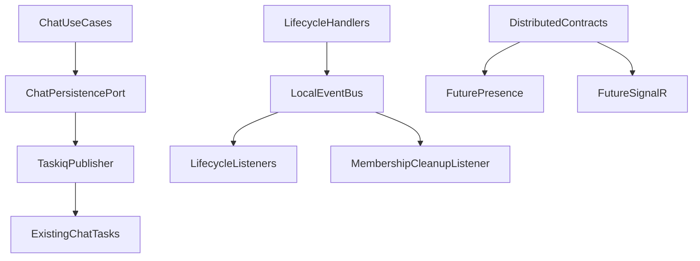
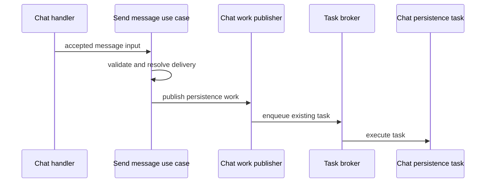
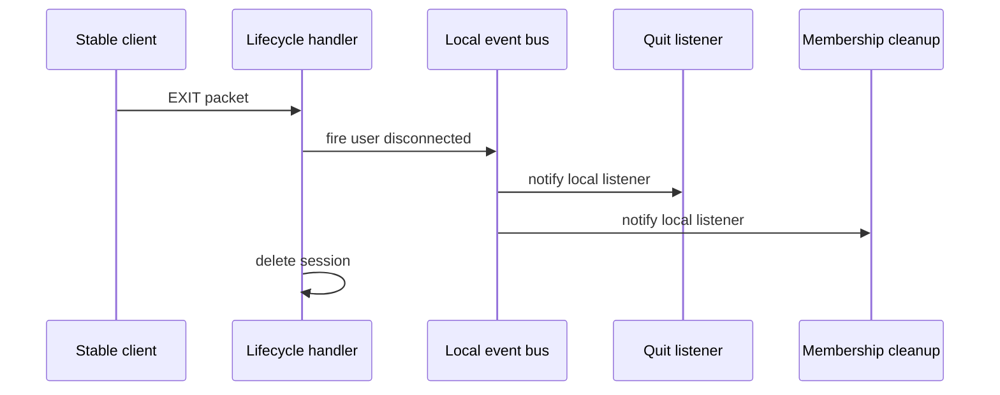
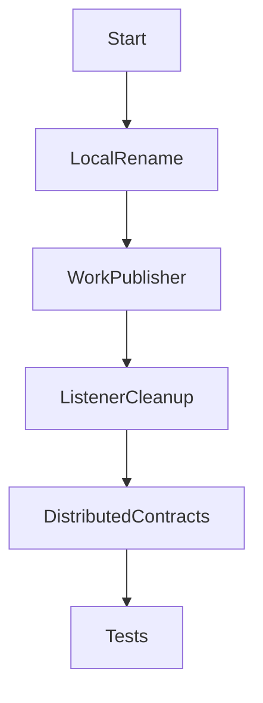

# Design Document

## Overview

この spec は、Athena の event-like workflow を Local Event、Distributed Event、Durable Work に分離し、水平スケーリング時に production-critical workflow が local-only notification を source of truth として扱われない状態を作る。対象ユーザーは Athena の開発者・運用者であり、複数 app replica、worker runtime、将来の SignalR / lazer broadcast を設計するときに通知保証を誤解しないことが目的である。

現在の `EventBus` は同一 process 内の handler 呼び出しとして動作しているが、chat persistence enqueue、disconnect broadcast、channel cleanup が同じ local event 経路に混在している。この設計では local-only behavior を `LocalEventBus` として明示し、chat persistence を `ChatPersistenceWorkPublisher` へ分離し、Distributed Event は envelope / mapper / publisher / subscriber の contract だけを導入する。

### Goals

- `EventBus` の曖昧な名前を撤去し、local-only fanout を `LocalEventBus` として明示する。
- Chat Persistence Work を Local Event listener side effect から切り離す。
- Distributed Event の envelope と mapper contract を定義し、将来の presence / SignalR / lazer broadcast に備える。
- Stable bancho chat、PONG / EXIT、USER_QUIT、既存 chat persistence task names と payload outcomes を維持する。

### Non-Goals

- Chat Persistence Work の DB-backed work item / state machine 実装。
- presence / channel membership の TTL または heartbeat 実装。
- Distributed Event の concrete transport、常駐 subscriber loop、Valkey Pub/Sub adapter 実装。
- SignalR / lazer broadcast の本体実装。
- production topology、Valkey HA、queue isolation の決定。
- import-linter や project-wide config の変更。

## Boundary Commitments

### This Spec Owns

- Local Event、Distributed Event、Durable Work の code-level boundary naming。
- `LocalEventBus` contract と in-memory implementation の既存 behavior 維持。
- `ChatPersistenceWorkPublisher` contract と、既存 taskiq task enqueue を包む transitional adapter。
- Distributed Event の envelope、primitive payload、mapper、publisher / subscriber port contract。
- Stable bancho local listener registration の整理。
- Boundary regression tests と existing behavior regression tests。

### Out of Boundary

- Chat Persistence Work の durable storage schema、repository、retry scanner、idempotency key 設計。
- Distributed Event の concrete network transport と subscriber runtime lifecycle。
- Disconnect Notification の runtime publication。
- Channel membership の最終回復保証。これは `presence-status` の TTL / heartbeat に委譲する。
- Worker task names、payload order、task execution semantics の変更。
- Stable packet format、legacy web endpoints、public API behavior の変更。

### Allowed Dependencies

- `services.commands.chat` は同じ package の `ChatPersistenceWorkPublisher` port に依存できる。
- `services.commands.chat` は taskiq、jobs、transports、composition、SQLAlchemy adapters、DB infrastructure に依存しない。
- `jobs` runtime adapter は existing taskiq broker surface と chat persistence publisher port に依存できる。
- `composition.providers.*` は concrete publisher adapter、broker、provider sets を wire できる。
- `transports.stable.bancho` は `LocalEventBus`、PacketQueue、ChannelStateStore、identity query use-cases を使える。
- `infrastructure.messaging` の Local Event / Distributed Event contracts は standard library types に閉じる。

### Revalidation Triggers

- `ChatPersistenceWorkPublisher` method signature、input fields、or failure behavior の変更。
- Existing `persist_channel_message` / `persist_private_message` task name または payload order の変更。
- `DistributedEventEnvelope` field set、event type naming、schema version policy の変更。
- `UserDisconnected` local event flow から stable USER_QUIT behavior への接続変更。
- Local Event と Durable Work の dependency direction を変える変更。
- Distributed Event を runtime publication へ昇格する変更。

## Architecture

### Existing Architecture Analysis

Current `EventBus` has one Protocol and one in-memory implementation under `infrastructure/messaging`. It is wired by `InfrastructureProviderSet` and consumed by chat send use-cases and stable bancho lifecycle handlers. `ChatListeners` subscribes to chat message events to enqueue persistence jobs and to `UserDisconnected` for channel cleanup. `LifecycleListeners` subscribes to `UserDisconnected` to enqueue `USER_QUIT` packets.

This architecture works in a single app process, but the name `EventBus` does not reveal that delivery is local-only. More importantly, accepted chat messages currently rely on a local event listener to start persistence work. That is the primary boundary violation for production readiness.

### Architecture Pattern & Boundary Map

Selected pattern: boundary split with transitional durable-work publisher.



**Architecture Integration**

- Domain/feature boundaries: accepted chat persistence is Durable Work; disconnect broadcast remains local best-effort in this spec; distributed notifications are contract-only.
- Existing patterns preserved: constructor injection, Dishka composition, taskiq job boundary, thin job adapters, in-memory tests.
- New components rationale: `ChatPersistenceWorkPublisher` gives Durable Work an explicit port; `DistributedEventEnvelope` prevents ad hoc payload contracts later.
- Steering compliance: services stay adapter-independent; production dependency direction remains composition -> adapters -> services -> repositories / domain / shared.

### Technology Stack

| Layer | Choice / Version | Role in Feature | Notes |
|-------|------------------|-----------------|-------|
| Runtime | Python >=3.14 | Dataclasses and Protocol contracts | Existing stack |
| Messaging / Events | Standard library dataclasses + Protocol | Local and distributed event contracts | No new dependency |
| Jobs | taskiq >=0.11, taskiq-redis >=1.0 | Existing chat persistence task enqueue | Task names unchanged |
| Composition | Dishka | Wiring LocalEventBus and ChatPersistenceWorkPublisher | Existing provider pattern |
| Validation | pytest, basedpyright, ruff, import-linter | Boundary and behavior regression checks | Existing gates |

## File Structure Plan

### Directory Structure

```text
src/osu_server/
├── infrastructure/
│   └── messaging/
│       ├── __init__.py                       # Export LocalEventBus and distributed contracts
│       ├── distributed.py                    # DistributedEventEnvelope, mapper, publisher, subscriber ports
│       ├── local.py                          # LocalEventBus Protocol
│       └── memory.py                         # InMemoryLocalEventBus implementation
├── jobs/
│   └── chat_persistence_publisher.py         # Transitional publisher that enqueues existing chat persistence tasks
├── services/
│   └── commands/
│       └── chat/
│           ├── __init__.py                   # Export chat persistence work contracts
│           ├── persistence_work.py           # ChatPersistenceWorkPublisher and work input dataclasses
│           ├── send_channel_message.py       # Publish channel persistence work directly
│           └── send_private_message.py       # Publish private persistence work directly
└── transports/
    └── stable/
        └── bancho/
            └── listeners/
                ├── __init__.py               # Register local lifecycle and membership listeners
                ├── chat.py                   # Keep only disconnect membership cleanup or rename during implementation
                └── lifecycle.py              # Keep USER_QUIT local listener behavior
```

### Modified Files

- `src/osu_server/infrastructure/messaging/interfaces.py` - remove or replace the ambiguous `EventBus` surface after callers migrate to `LocalEventBus`.
- `src/osu_server/domain/events/channels.py` - remove chat persistence event values if no non-persistence production use remains.
- `src/osu_server/domain/events/users.py` - keep `UserDisconnected` as local event input; do not make it durable.
- `src/osu_server/composition/providers/infrastructure.py` - provide `LocalEventBus` through `InMemoryLocalEventBus`.
- `src/osu_server/composition/providers/chat_app.py` - provide and inject `ChatPersistenceWorkPublisher` into chat send use-cases.
- `src/osu_server/composition/providers/stable_bancho.py` - depend on `LocalEventBus`; remove broker dependency from local listener setup if no longer needed there.
- `tests/unit/infrastructure/messaging/test_event_bus.py` - rename/rework as LocalEventBus behavior tests.
- `tests/unit/services/test_chat_service.py` - replace event capture assertions with ChatPersistenceWorkPublisher assertions.
- `tests/integration/test_chat_pipeline.py` - verify existing task enqueue via ChatPersistenceWorkPublisher.
- `tests/unit/transports/bancho/test_chat_listeners.py` - remove chat persistence listener tests; keep disconnect cleanup tests.
- `tests/integration/test_c2s_pipeline.py` and `tests/unit/test_lifecycle_handlers.py` - update naming while preserving EXIT / USER_QUIT behavior assertions.
- `tests/unit/composition/test_common_provider_graph.py` and `tests/unit/test_di_integration.py` - update dependency resolution expectations.

## System Flows

### Accepted Chat Persistence Work



Key decision: chat delivery response remains independent from persistence task execution. This spec changes the boundary name and injection path, not the worker task contract.

### Local Disconnect Behavior



Key decision: this remains local and best-effort. Disconnect Notification as a Distributed Event is contract-only here and becomes runtime behavior in a future spec.

## Requirements Traceability

| Requirement | Summary | Components | Interfaces | Flows |
|-------------|---------|------------|------------|-------|
| 1.1 | production-critical state changes are Durable Work | ChatPersistenceWorkPublisher | Chat Persistence Work Contract | Accepted Chat Persistence Work |
| 1.2 | runtime notification is Distributed Event | Distributed Event Contract | DistributedEventEnvelope | None |
| 1.3 | same-process fanout is Local Event | LocalEventBus | Local Event Contract | Local Disconnect Behavior |
| 1.4 | unclear workflow classification is documented | Boundary Regression Tests, docs | None | None |
| 1.5 | Local Event is not source of truth | ChatPersistenceWorkPublisher, tests | Chat Persistence Work Contract | Accepted Chat Persistence Work |
| 2.1 | local delivery is visibly local-only | LocalEventBus, InMemoryLocalEventBus | Local Event Contract | Local Disconnect Behavior |
| 2.2 | handler failure isolation remains | InMemoryLocalEventBus | Local Event Contract | Local Disconnect Behavior |
| 2.3 | Local Event not treated as cross-replica | LocalEventBus docs/tests | Local Event Contract | None |
| 2.4 | Local Event not used for chat persistence | Send chat use-cases, ChatPersistenceWorkPublisher | Chat Persistence Work Contract | Accepted Chat Persistence Work |
| 3.1 | accepted channel message creates work | SendChannelMessageUseCase | Chat Persistence Work Contract | Accepted Chat Persistence Work |
| 3.2 | accepted private message creates work | SendPrivateMessageUseCase | Chat Persistence Work Contract | Accepted Chat Persistence Work |
| 3.3 | rejected channel message creates no work | SendChannelMessageUseCase tests | Chat Persistence Work Contract | Accepted Chat Persistence Work |
| 3.4 | missing private target creates no work | SendPrivateMessageUseCase tests | Chat Persistence Work Contract | Accepted Chat Persistence Work |
| 3.5 | transitional behavior preserves responses/tasks | TaskiqChatPersistenceWorkPublisher | Batch Contract | Accepted Chat Persistence Work |
| 4.1 | envelope has identity/type/time/version/payload | DistributedEventEnvelope | Event Contract | None |
| 4.2 | payload uses explicit mapper | DistributedEventMapper | Event Contract | None |
| 4.3 | missed event not source of truth | DistributedEventPublisher docs/tests | Event Contract | None |
| 4.4 | publisher/subscriber contracts testable | DistributedEventPublisher, DistributedEventSubscriber | Event Contract | None |
| 4.5 | Distributed Event not chat work source | Boundary tests | Event and Batch Contracts | Accepted Chat Persistence Work |
| 5.1 | stable disconnect behavior unchanged | LifecycleHandlers, LifecycleListeners | Local Event Contract | Local Disconnect Behavior |
| 5.2 | Disconnect Notification classified distributed | Distributed Event Contract | Event Contract | None |
| 5.3 | missed notification not durable gap | Distributed Event Contract docs/tests | Event Contract | None |
| 5.4 | best-effort status documented | design/docs/tests | Event Contract | Local Disconnect Behavior |
| 5.5 | membership recovery not based on notification delivery | Membership cleanup listener docs/tests | Local Event Contract | Local Disconnect Behavior |
| 6.1 | chat packet delivery unchanged | ChatHandlers and send use-cases | Service Contract | Accepted Chat Persistence Work |
| 6.2 | PONG / EXIT unchanged | LifecycleHandlers | Local Event Contract | Local Disconnect Behavior |
| 6.3 | worker task names/payload unchanged | TaskiqChatPersistenceWorkPublisher, jobs | Batch Contract | Accepted Chat Persistence Work |
| 6.4 | boundary regression detectable | Boundary Regression Tests | Test Contract | None |
| 6.5 | automated boundary tests exist | Test suite | Test Contract | Both flows |

## Components and Interfaces

| Component | Domain / Layer | Intent | Req Coverage | Key Dependencies | Contracts |
|-----------|----------------|--------|--------------|------------------|-----------|
| LocalEventBus | Infrastructure messaging | Local-only event fanout contract | 1.3, 2.1, 2.2, 2.3, 5.1, 6.2 | Local handlers P0 | Service, Event |
| InMemoryLocalEventBus | Infrastructure messaging | Existing in-process implementation | 2.1, 2.2, 6.2 | Standard library P0 | Service, Event |
| Distributed Event Contract | Infrastructure messaging | Non-durable cross-runtime notification contract | 1.2, 4.1, 4.2, 4.3, 4.4, 5.2, 5.3 | Standard library P0 | Event |
| ChatPersistenceWorkPublisher | Chat command boundary | Durable Work publish boundary for accepted chat | 1.1, 2.4, 3.1, 3.2, 3.3, 3.4, 4.5 | Send use-cases P0 | Service, Batch |
| TaskiqChatPersistenceWorkPublisher | Jobs runtime adapter | Transitional enqueue adapter for existing tasks | 3.5, 6.3 | AsyncBroker P0 | Batch |
| Send Chat Use-cases | Services commands chat | Invoke Chat Persistence Work directly | 3.1, 3.2, 3.3, 3.4, 6.1 | ChatPersistenceWorkPublisher P0 | Service |
| Stable Local Listeners | Stable bancho transport | Keep local disconnect broadcast and cleanup | 5.1, 5.4, 5.5, 6.2 | LocalEventBus P0 | Event |
| Composition Wiring | Composition providers | Bind contracts to concrete implementations | 6.4, 6.5 | Dishka P0 | Service |
| Boundary Regression Tests | Tests | Detect Local/Distributed/Durable misuse | 1.4, 1.5, 4.5, 6.4, 6.5 | pytest P0 | Test |

### Infrastructure Messaging

#### LocalEventBus

| Field | Detail |
|-------|--------|
| Intent | Explicit local-only event bus contract |
| Requirements | 1.3, 2.1, 2.2, 2.3, 5.1, 6.2 |

**Responsibilities & Constraints**

- Owns local-only `fire` and `subscribe` semantics.
- Does not imply delivery across app replicas, worker process, or future realtime runtimes.
- Preserves handler exception isolation and registration-order invocation.
- Must not be used as the source of truth for Chat Persistence Work.

**Dependencies**

- Inbound: Stable lifecycle handler and listener setup - local disconnect behavior (P0)
- Outbound: Registered local handlers - synchronous local fanout (P0)

**Contracts**: Service [x] / API [ ] / Event [x] / Batch [ ] / State [ ]

##### Service Interface

```python
from collections.abc import Awaitable, Callable
from typing import Protocol, TypeVar, runtime_checkable

TEvent = TypeVar("TEvent", bound=object)

@runtime_checkable
class LocalEventBus(Protocol):
    async def fire(self, event: object) -> None: ...

    def subscribe(
        self,
        event_type: type[TEvent],
        handler: Callable[[TEvent], Awaitable[None]],
    ) -> None: ...
```

- Preconditions: handlers are async callables accepting the subscribed event type.
- Postconditions: all matching handlers are attempted in registration order.
- Invariants: handler failure is logged and does not stop later handlers.

##### Event Contract

- Published events: local-only Python objects.
- Subscribed events: handler registrations by concrete event type.
- Ordering / delivery guarantees: registration order within one process; no cross-process delivery.

**Implementation Notes**

- Integration: replace existing `EventBus` references with `LocalEventBus`.
- Validation: rename existing EventBus unit tests and add assertions that docs/names indicate local-only semantics.
- Risks: broad import updates across tests and providers.

#### Distributed Event Contract

| Field | Detail |
|-------|--------|
| Intent | Contract-only model for non-durable cross-runtime notifications |
| Requirements | 1.2, 4.1, 4.2, 4.3, 4.4, 5.2, 5.3 |

**Responsibilities & Constraints**

- Defines envelope fields and primitive payload constraints.
- Defines mapper and publisher/subscriber ports.
- Does not provide a concrete transport adapter or runtime subscriber loop.
- Does not store events as durable work or audit log.

**Dependencies**

- Inbound: Future presence / SignalR / lazer specs - contract reuse (P2)
- Outbound: Standard library dataclasses and datetime types (P0)

**Contracts**: Service [x] / API [ ] / Event [x] / Batch [ ] / State [ ]

##### Service Interface

```python
from collections.abc import Awaitable, Callable, Mapping
from dataclasses import dataclass
from datetime import datetime
from typing import Protocol, TypeVar

type JsonPrimitive = str | int | float | bool | None
type JsonValue = JsonPrimitive | list["JsonValue"] | dict[str, "JsonValue"]
type JsonObject = dict[str, JsonValue]

@dataclass(frozen=True, slots=True)
class DistributedEventEnvelope:
    event_id: str
    event_type: str
    occurred_at: datetime
    schema_version: int
    payload: JsonObject

TDistributedEvent = TypeVar("TDistributedEvent", bound=object)

class DistributedEventMapper(Protocol[TDistributedEvent]):
    event_type: str
    schema_version: int

    def to_payload(self, event: TDistributedEvent) -> JsonObject: ...

    def from_payload(self, payload: Mapping[str, JsonValue]) -> TDistributedEvent: ...

class DistributedEventPublisher(Protocol):
    async def publish(self, envelope: DistributedEventEnvelope) -> None: ...

class DistributedEventSubscriber(Protocol):
    def subscribe(
        self,
        event_type: str,
        handler: Callable[[DistributedEventEnvelope], Awaitable[None]],
    ) -> None: ...
```

- Preconditions: payload contains only JSON-like primitive values.
- Postconditions: envelope can be serialized by future transport adapters without domain dataclass introspection.
- Invariants: `schema_version` is positive; missed delivery is not a durable consistency failure.

##### Event Contract

- Published events: none by this spec at runtime.
- Subscribed events: none by this spec at runtime.
- Ordering / delivery guarantees: non-durable notification contract only; no persistence or replay guarantee.

**Implementation Notes**

- Integration: add contract and unit tests without adding Valkey Pub/Sub.
- Validation: test envelope construction, mapper round-trip, and primitive payload guardrails.
- Risks: future specs must not treat this as a durable message queue.

### Chat Durable Work Boundary

#### ChatPersistenceWorkPublisher

| Field | Detail |
|-------|--------|
| Intent | Boundary used by chat send use-cases to start Chat Persistence Work |
| Requirements | 1.1, 2.4, 3.1, 3.2, 3.3, 3.4, 4.5 |

**Responsibilities & Constraints**

- Owns the service-facing contract for channel and private message persistence work.
- Does not define DB-backed work-item storage in this spec.
- Does not expose taskiq or broker details to chat use-cases.
- Must not be implemented through Local Event listeners.

**Dependencies**

- Inbound: SendChannelMessageUseCase, SendPrivateMessageUseCase - work publication (P0)
- Outbound: Concrete publisher implementation - execution signal (P0)

**Contracts**: Service [x] / API [ ] / Event [ ] / Batch [x] / State [ ]

##### Service Interface

```python
from dataclasses import dataclass
from typing import Protocol

@dataclass(frozen=True, slots=True)
class ChannelMessagePersistenceWork:
    sender_id: int
    sender_name: str
    channel_name: str
    content: str

@dataclass(frozen=True, slots=True)
class PrivateMessagePersistenceWork:
    sender_id: int
    sender_name: str
    target_id: int
    target_name: str
    content: str

class ChatPersistenceWorkPublisher(Protocol):
    async def publish_channel_message(
        self,
        work: ChannelMessagePersistenceWork,
    ) -> None: ...

    async def publish_private_message(
        self,
        work: PrivateMessagePersistenceWork,
    ) -> None: ...
```

- Preconditions: work is created only after chat delivery is accepted.
- Postconditions: use-case has handed persistence work to the configured publisher.
- Invariants: rejected messages and missing private targets do not create work.

##### Batch / Job Contract

- Trigger: accepted channel or private chat message.
- Input / validation: sender and target identifiers, display names, destination, content.
- Output / destination: existing chat persistence task signal in transitional implementation.
- Idempotency & recovery: unchanged in this spec; DB-backed recovery belongs to `chat-persistence-durability`.

**Implementation Notes**

- Integration: update chat send use-cases to depend on this publisher instead of LocalEventBus.
- Validation: fake publisher tests should assert exact work inputs and no-work cases.
- Risks: transitional publisher still lacks durable source of truth until follow-up spec.

#### TaskiqChatPersistenceWorkPublisher

| Field | Detail |
|-------|--------|
| Intent | Transitional adapter from ChatPersistenceWorkPublisher to existing taskiq tasks |
| Requirements | 3.5, 6.3 |

**Responsibilities & Constraints**

- Maps channel work to `persist_channel_message`.
- Maps private work to `persist_private_message`.
- Preserves existing payload order.
- Logs unavailable task or enqueue failure without changing chat delivery response semantics.

**Dependencies**

- Inbound: Composition provider - concrete implementation binding (P0)
- Outbound: AsyncBroker - task lookup and enqueue (P0)
- Outbound: Existing chat persistence jobs - worker execution (P0)

**Contracts**: Service [x] / API [ ] / Event [ ] / Batch [x] / State [ ]

##### Batch / Job Contract

- Channel task: `persist_channel_message(sender_id, channel_name, sender_name, content)`.
- Private task: `persist_private_message(sender_id, target_id, sender_name, target_name, content)`.
- Missing task: log structured error and return.
- Enqueue exception: log structured error and return.

**Implementation Notes**

- Integration: this adapter lives in `jobs` because it adapts the taskiq runtime and may import the chat command port without violating the existing layer contract.
- Validation: use typed fake broker/task tests matching existing test style.
- Risks: swallowing enqueue failure preserves current behavior but is not production-final durability.

### Stable Bancho Local Listeners

#### Stable Local Listener Setup

| Field | Detail |
|-------|--------|
| Intent | Preserve local disconnect fanout without owning durable work |
| Requirements | 5.1, 5.4, 5.5, 6.2 |

**Responsibilities & Constraints**

- Registers local listeners for `UserDisconnected`.
- Keeps USER_QUIT packet enqueue behavior.
- Keeps best-effort channel membership cleanup.
- Does not subscribe to chat persistence work events.

**Dependencies**

- Inbound: StableBanchoProviderSet - app startup registration (P0)
- Outbound: LocalEventBus - local fanout (P0)
- Outbound: PacketQueue - USER_QUIT packet buffering (P0)
- Outbound: ChannelStateStore - best-effort membership cleanup (P1)

**Contracts**: Service [ ] / API [ ] / Event [x] / Batch [ ] / State [ ]

##### Event Contract

- Subscribed events: `UserDisconnected` local event.
- Published events: none.
- Ordering / delivery guarantees: local process registration order only.

**Implementation Notes**

- Integration: remove broker from listener setup when chat persistence subscriptions move out.
- Validation: existing C2S pipeline tests should continue to assert USER_QUIT and session deletion.
- Risks: test names and comments must stop implying distributed delivery.

### Composition and Validation

#### Composition Wiring

| Field | Detail |
|-------|--------|
| Intent | Bind new contracts without changing public factories |
| Requirements | 6.4, 6.5 |

**Responsibilities & Constraints**

- Keeps `make_app_container` and `make_worker_container` signatures unchanged.
- Provides `LocalEventBus` in shared infrastructure graph.
- Provides `ChatPersistenceWorkPublisher` in app-facing chat graph.
- Does not add production branching on test environment.

**Dependencies**

- Inbound: app and worker startup - container construction (P0)
- Outbound: existing provider sets - graph composition (P0)

**Contracts**: Service [x] / API [ ] / Event [ ] / Batch [ ] / State [ ]

**Implementation Notes**

- Integration: update provider replacement tests and dependency resolution tests.
- Validation: use explicit test overrides for LocalEventBus or publisher fakes.
- Risks: provider graph may expose stale `EventBus` imports if tests are not updated.

#### Boundary Regression Tests

| Field | Detail |
|-------|--------|
| Intent | Prevent regression to ambiguous EventBus usage |
| Requirements | 1.4, 1.5, 4.5, 6.4, 6.5 |

**Responsibilities & Constraints**

- Detect production imports of old `EventBus` names after migration.
- Detect chat send use-cases depending on LocalEventBus for persistence.
- Verify Distributed Event contract remains non-durable and primitive payload based.
- Avoid project-wide config changes unless separately approved.

**Dependencies**

- Inbound: pytest suite - regression validation (P0)
- Outbound: source AST or import inspection helpers - boundary checks (P1)

**Contracts**: Service [ ] / API [ ] / Event [ ] / Batch [ ] / State [ ]

**Implementation Notes**

- Integration: add tests near existing architecture and messaging tests.
- Validation: include both behavior tests and source-boundary tests.
- Risks: source inspection tests must avoid brittle line-number assumptions.

## Data Models

### Domain Model

- `UserDisconnected` remains a local event value for stable bancho lifecycle handling.
- `ChannelMessagePersistenceWork` and `PrivateMessagePersistenceWork` are Durable Work input values, not domain events.
- `DistributedEventEnvelope` is an integration contract, not an event store record.

### Logical Data Model

No persistent data model changes are introduced. Chat persistence work-item storage is deferred to `chat-persistence-durability`.

### Data Contracts & Integration

#### DistributedEventEnvelope

| Field | Type | Required | Meaning |
|-------|------|----------|---------|
| `event_id` | `str` | yes | Unique notification id for logs and subscriber-side de-duplication if needed |
| `event_type` | `str` | yes | Stable event contract name |
| `occurred_at` | `datetime` | yes | Event occurrence timestamp |
| `schema_version` | `int` | yes | Positive schema version |
| `payload` | `JsonObject` | yes | Primitive payload produced by a mapper |

#### Disconnect Notification Contract

This spec classifies Disconnect Notification as Distributed Event but does not publish it at runtime. Future specs should use an event type such as `user.disconnect.v1` or an equivalent stable name selected during their design phase.

## Error Handling

### Error Strategy

- LocalEventBus handler exceptions are logged and isolated, preserving existing behavior.
- ChatPersistenceWorkPublisher transitional enqueue failures are logged and do not change accepted chat delivery response.
- DistributedEventMapper validation errors are test failures or contract validation failures during mapper use, not runtime subscriber errors in this spec.

### Error Categories and Responses

- Local handler failure: log exception, continue remaining handlers.
- Missing chat persistence task: log structured error with task name and work identity, return.
- Chat persistence enqueue failure: log structured error, return.
- Invalid distributed payload: reject in contract tests or mapper validation.

### Monitoring

The design relies on structured logs for missing task and enqueue failure visibility. No new health endpoint is added.

## Testing Strategy

### Unit Tests

- `LocalEventBus` calls subscribed handlers in registration order and isolates handler exceptions.
- `DistributedEventEnvelope` rejects or prevents non-primitive payload shapes through mapper tests.
- `ChatPersistenceWorkPublisher` fake captures channel/private work inputs for accepted messages.
- Send channel message use-case publishes work only after successful delivery resolution.
- Send private message use-case publishes work only when target user exists.

### Integration Tests

- Chat pipeline enqueues existing `persist_channel_message` task with unchanged payload order.
- Private message pipeline enqueues existing `persist_private_message` task with unchanged payload order.
- Stable EXIT pipeline still deletes session and queues USER_QUIT for other online users.
- Composition container resolves `LocalEventBus`, `ChatPersistenceWorkPublisher`, and existing chat send use-cases.

### Architecture / Boundary Tests

- Production code no longer imports old `EventBus` names.
- Chat send use-case modules do not import LocalEventBus or domain chat persistence events.
- `ChatListeners` no longer subscribes to channel/private message persistence events.
- Distributed Event contracts are not used as Chat Persistence Work source of truth.

### Quality Gates

- `uv run pytest` for affected unit and integration tests.
- `uv run ruff check src tests`.
- `uv run basedpyright src tests` or project quality gate if the implementation touches shared typing broadly.
- `uv run lint-imports` or `./scripts/ci.sh quality` for final validation.

## Performance & Scalability

- LocalEventBus remains synchronous local fanout and should only carry non-critical in-process behavior.
- ChatPersistenceWorkPublisher adds one direct dependency call in send use-cases and preserves asynchronous worker execution.
- Distributed Event contracts intentionally avoid transport lifecycle and backpressure choices until a concrete subscriber exists.

## Migration Strategy



- Phase 1: introduce LocalEventBus naming and migrate call sites.
- Phase 2: introduce ChatPersistenceWorkPublisher and move chat persistence enqueue out of local listeners.
- Phase 3: remove obsolete channel/private message event subscriptions and stale tests.
- Phase 4: add Distributed Event contracts and contract tests.
- Phase 5: run targeted tests and quality gates.

No database migration is required.
