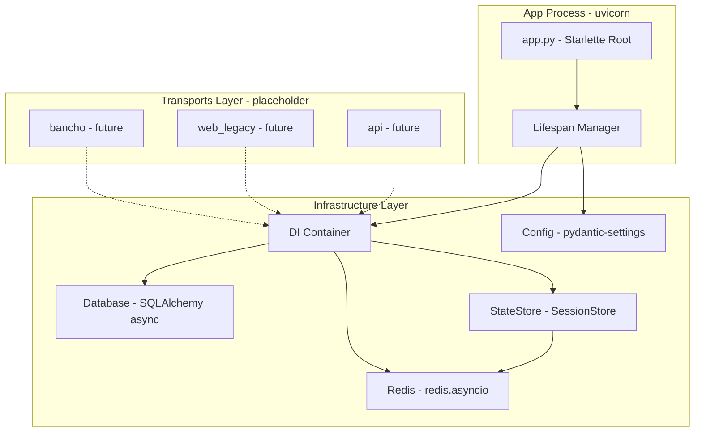
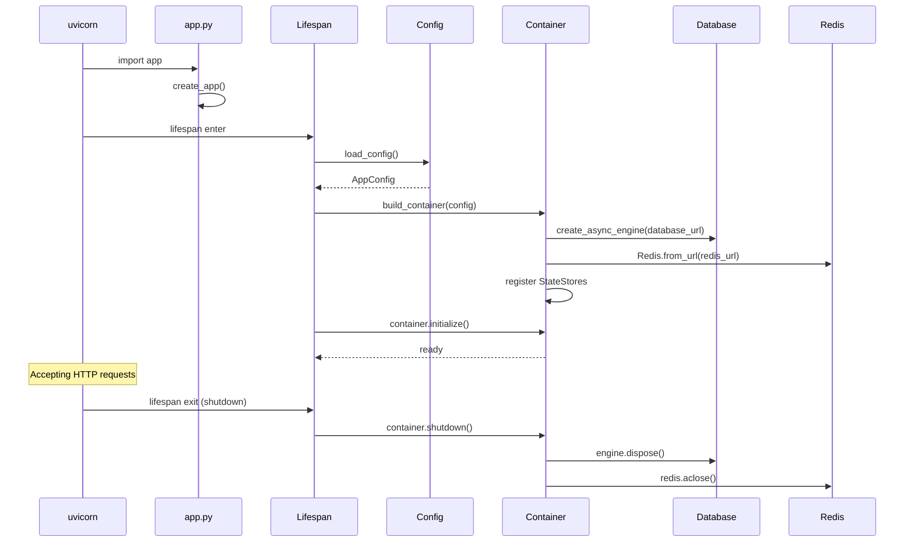

# Design Document: foundation

## Overview

**Purpose**: athena サーバーの全機能の土台となるプロジェクト骨格・設定管理・DI コンテナ・インフラ接続基盤・ステートストア抽象を提供する。

**Users**: 開発者が後続機能（bancho-protocol, bancho-login 等）を実装する際の基盤として使用する。

### Goals
- 単一コマンドで HTTP サーバーが起動する
- 環境変数から型安全に設定を読み込む
- DI コンテナで全コンポーネントを注入・差し替え可能にする
- DB / Redis への非同期接続をライフサイクル管理付きで提供する
- StateStore Protocol パターンを確立する（SessionStore を exemplar として）
- import-linter でレイヤー依存違反を CI 検出する
- TDD で開発できるテスト基盤を整える

### Non-Goals
- bancho バイナリプロトコル定義（bancho-protocol spec）
- 認証フロー・ユーザーモデル（bancho-login spec）
- EventBus / JobQueue 実装（後続 spec）
- worker プロセス（後続 spec）
- SessionStore 以外の StateStore 実装（後続 spec で追加）

## Boundary Commitments

### This Spec Owns
- プロジェクトディレクトリ構造と Python パッケージ初期化
- `app.py` — Starlette ルートアプリ組み立て、lifespan 管理
- `config.py` — pydantic-settings による設定管理
- DI コンテナ（Container クラス + build_container ファクトリ）
- DB 接続基盤（AsyncEngine 生成、AsyncSession ファクトリ、Alembic 初期設定）
- Redis 接続基盤（redis.asyncio クライアント生成・管理）
- StateStore Protocol パターン（SessionStore の Protocol + Redis + memory 実装）
- pyproject.toml の依存・ツール設定（ruff, basedpyright, import-linter）
- テスト基盤（conftest.py, フィクスチャ）

### Out of Boundary
- パケット定義・ディスパッチ機構（bancho-protocol）
- 認証ロジック・ユーザードメインモデル・UserRepository（bancho-login）
- EventBus / JobQueue Protocol と実装
- worker.py / ARQ 設定
- PresenceStore, ChannelStateStore, PacketQueue 等の追加 StateStore
- transports/ 配下の具体的ルート・ハンドラ

### Allowed Dependencies
- 外部: starlette, pydantic-settings, sqlalchemy[asyncio], asyncpg, alembic, redis[hiredis], argon2-cffi, ruff, basedpyright, import-linter, pytest, pytest-asyncio
- 内部: shared → infrastructure → repositories → domain → services → transports（上位→下位のみ）

### Revalidation Triggers
- DI Container の register/resolve インターフェース変更
- StateStore Protocol のメソッドシグネチャ変更
- config.py の設定フィールド追加・型変更
- レイヤー依存ルールの変更
- lifespan での初期化順序変更

## Architecture

### Architecture Pattern & Boundary Map



**Architecture Integration**:
- **Selected pattern**: モジュラモノリス（設計書準拠）。Protocol ベースの抽象 + 具象実装
- **Domain boundaries**: レイヤー別（transports / services / domain / repositories / infrastructure / shared）
- **New components**: DI Container, Config, DB engine, Redis client, SessionStore Protocol + 実装
- **Steering compliance**: import-linter でレイヤー違反自動検出

### Technology Stack

| Layer | Choice / Version | Role | Notes |
|-------|-----------------|------|-------|
| ASGI Server | uvicorn | HTTP サーバー | --reload で開発 |
| Web Framework | Starlette 1.0 | ルートアプリ、ルーティング | FastAPI は api transport でのみ使用 |
| Config | pydantic-settings 2.14 | 環境変数→型安全オブジェクト | |
| ORM | SQLAlchemy 2.0.49 async | DB 接続、セッション管理 | asyncpg ドライバ |
| Migration | Alembic 1.18 | スキーマバージョン管理 | |
| Redis | redis-py 7.1 + hiredis | 非同期 Redis 接続 | `redis.asyncio` |
| DI | 自前 Container | 依存性注入 | ~40行 |
| Lint/Format | ruff | リント + フォーマット | |
| Type Check | basedpyright (strict) | 型チェック | |
| Layer Rules | import-linter | 依存方向検証 | |
| Test | pytest + pytest-asyncio | テスト実行 | TDD |

## File Structure Plan

### Directory Structure

```
src/osu_server/
├── __init__.py
├── __main__.py              # python -m osu_server エントリ
├── app.py                   # Starlette root app + lifespan
├── config.py                # pydantic-settings AppConfig
├── transports/
│   ├── __init__.py
│   ├── bancho/
│   │   └── __init__.py      # placeholder
│   ├── web_legacy/
│   │   └── __init__.py      # placeholder
│   ├── api/
│   │   └── __init__.py      # placeholder
│   └── signalr/
│       └── __init__.py      # placeholder
├── services/
│   └── __init__.py          # placeholder
├── domain/
│   └── __init__.py          # placeholder
├── repositories/
│   ├── __init__.py
│   └── interfaces/
│       └── __init__.py      # placeholder
├── infrastructure/
│   ├── __init__.py
│   ├── database/
│   │   ├── __init__.py
│   │   ├── engine.py        # create_async_engine wrapper
│   │   └── session.py       # AsyncSession factory
│   ├── cache/
│   │   ├── __init__.py
│   │   └── redis_client.py  # Redis connection factory
│   ├── state/
│   │   ├── __init__.py
│   │   ├── interfaces/
│   │   │   ├── __init__.py
│   │   │   └── session_store.py  # SessionStore Protocol
│   │   ├── redis/
│   │   │   ├── __init__.py
│   │   │   └── session_store.py  # RedisSessionStore
│   │   └── memory/
│   │       ├── __init__.py
│   │       └── session_store.py  # InMemorySessionStore
│   └── di/
│       ├── __init__.py
│       ├── container.py      # Container class
│       └── providers.py      # build_container factory
└── shared/
    ├── __init__.py
    ├── errors.py             # base error types
    └── types.py              # UserId, Token etc type aliases
```

```
tests/
├── __init__.py
├── conftest.py               # shared fixtures (container, config, etc.)
├── unit/
│   ├── __init__.py
│   ├── infrastructure/
│   │   ├── __init__.py
│   │   ├── test_container.py
│   │   ├── test_config.py
│   │   └── state/
│   │       ├── __init__.py
│   │       └── test_session_store.py
│   └── shared/
│       └── __init__.py
└── integration/
    ├── __init__.py
    ├── test_database.py
    └── test_redis.py
```

### Modified Files
- `pyproject.toml` — 依存追加、ruff/basedpyright/import-linter/pytest 設定追加
- `devenv.nix` — 変更なし（既に設定済み）

## System Flows

### App Startup Lifecycle



## Requirements Traceability

| Requirement | Summary | Components | Interfaces | Flows |
|-------------|---------|------------|------------|-------|
| 1.1 | HTTP 受付開始 | app.py, Lifespan | — | Startup |
| 1.2 | ルートパス応答 | app.py | — | — |
| 1.3 | ホスト名ルーティング準備 | app.py (Mount) | — | — |
| 2.1 | 環境変数読み取り | Config | AppConfig | Startup |
| 2.2 | バリデーションエラー | Config | AppConfig | Startup |
| 2.3 | 型安全設定 | Config | AppConfig | — |
| 3.1 | DB 接続プール確立 | Database Engine | — | Startup |
| 3.2 | DB 接続クローズ | Database Engine | — | Startup |
| 3.3 | マイグレーション | Alembic 設定 | — | — |
| 3.4 | 非同期クエリ | Database Session | AsyncSession | — |
| 4.1 | Redis 接続確立 | Redis Client | — | Startup |
| 4.2 | Redis 接続クローズ | Redis Client | — | Startup |
| 4.3 | 非同期 Redis 操作 | Redis Client | redis.asyncio | — |
| 5.1 | DI 注入 | Container | register/resolve | — |
| 5.2 | テスト時差し替え | Container, Providers | — | — |
| 5.3 | 不足検出 | Container | resolve error | Startup |
| 6.1 | 抽象インターフェース | SessionStore Protocol | SessionStore | — |
| 6.2 | Redis 実装 | RedisSessionStore | SessionStore | — |
| 6.3 | Memory 実装 | InMemorySessionStore | SessionStore | — |
| 6.4 | 実装差し替え | Container, Providers | SessionStore | — |
| 7.1 | レイヤー依存ルール | pyproject.toml | — | — |
| 7.2 | 違反エラー報告 | import-linter | — | — |
| 7.3 | 成功報告 | import-linter | — | — |
| 8.1 | リント | pyproject.toml (ruff) | — | — |
| 8.2 | フォーマット | pyproject.toml (ruff) | — | — |
| 8.3 | 型チェック | pyproject.toml (basedpyright) | — | — |
| 9.1 | ディレクトリ構造 | File Structure | — | — |
| 9.2 | `__init__.py` | File Structure | — | — |
| 9.3 | 依存パッケージ宣言 | pyproject.toml | — | — |

## Components and Interfaces

| Component | Layer | Intent | Req Coverage | Key Dependencies | Contracts |
|-----------|-------|--------|--------------|------------------|-----------|
| AppConfig | Infrastructure | 環境変数→型安全設定 | 2.1-2.3 | pydantic-settings (P0) | — |
| Container | Infrastructure | 依存性注入 | 5.1-5.3 | — | Service |
| Database Engine | Infrastructure | DB 接続プール | 3.1-3.2, 3.4 | SQLAlchemy (P0), asyncpg (P0) | — |
| Database Session | Infrastructure | 非同期セッション | 3.4 | Database Engine (P0) | Service |
| Redis Client | Infrastructure | Redis 接続 | 4.1-4.3 | redis-py (P0) | — |
| SessionStore Protocol | Infrastructure | ステートストア抽象 | 6.1, 6.4 | — | Service |
| RedisSessionStore | Infrastructure | Redis 実装 | 6.2 | Redis Client (P0) | Service |
| InMemorySessionStore | Infrastructure | テスト用実装 | 6.3 | — | Service |
| Starlette App | Transport | HTTP エントリポイント | 1.1-1.3 | Starlette (P0), Container (P0) | — |

### Infrastructure Layer

#### AppConfig

| Field | Detail |
|-------|--------|
| Intent | 環境変数を型安全なオブジェクトとして提供 |
| Requirements | 2.1, 2.2, 2.3 |

**Responsibilities & Constraints**
- DATABASE_URL, REDIS_URL を必須フィールドとして定義
- 未設定・不正値でバリデーションエラーを raise
- 追加フィールド: ENVIRONMENT (default: "development"), SERVER_HOST, SERVER_PORT

**Contracts**: Service [x]

##### Service Interface
```python
# src/osu_server/config.py
from pydantic_settings import BaseSettings

class AppConfig(BaseSettings):
    database_url: str
    redis_url: str
    environment: str = "development"
    server_host: str = "0.0.0.0"
    server_port: int = 8000

    model_config = SettingsConfigDict(env_prefix="", env_file=".env")

def load_config() -> AppConfig:
    return AppConfig()
```

#### Container

| Field | Detail |
|-------|--------|
| Intent | コンポーネント登録・解決・ライフサイクル管理 |
| Requirements | 5.1, 5.2, 5.3 |

**Responsibilities & Constraints**
- `register` / `register_singleton` で factory 登録
- `resolve` で型ベースのインスタンス取得
- `initialize` で全 singleton の事前生成（起動時検証）
- `shutdown` で全リソースのクリーンアップ
- 未登録の型を resolve した場合は `KeyError` を raise

**Dependencies**
- Outbound: AppConfig — 設定値参照 (P0)

**Contracts**: Service [x]

##### Service Interface
```python
# src/osu_server/infrastructure/di/container.py
from typing import TypeVar, Callable, Awaitable

T = TypeVar("T")

class Container:
    def register(self, interface: type[T], factory: Callable[..., T | Awaitable[T]]) -> None: ...
    def register_singleton(self, interface: type[T], factory: Callable[..., T | Awaitable[T]]) -> None: ...
    async def resolve(self, interface: type[T]) -> T: ...
    async def initialize(self) -> None: ...
    async def shutdown(self) -> None: ...
```

```python
# src/osu_server/infrastructure/di/providers.py
from osu_server.config import AppConfig
from osu_server.infrastructure.di.container import Container

async def build_container(config: AppConfig) -> Container: ...
```
- Preconditions: AppConfig が有効な値を持つこと
- Postconditions: 全 singleton が initialize 後に resolve 可能

#### Database Engine & Session

| Field | Detail |
|-------|--------|
| Intent | SQLAlchemy async engine + session factory |
| Requirements | 3.1, 3.2, 3.4 |

**Responsibilities & Constraints**
- `create_async_engine` wrapper（connection pool 設定付き）
- `async_sessionmaker` による AsyncSession ファクトリ
- engine.dispose() で接続プールクリーンアップ

**Dependencies**
- External: SQLAlchemy (P0), asyncpg (P0)

**Contracts**: Service [x]

##### Service Interface
```python
# src/osu_server/infrastructure/database/engine.py
from sqlalchemy.ext.asyncio import AsyncEngine, create_async_engine

def create_engine(database_url: str) -> AsyncEngine: ...

# src/osu_server/infrastructure/database/session.py
from sqlalchemy.ext.asyncio import AsyncSession, async_sessionmaker

def create_session_factory(engine: AsyncEngine) -> async_sessionmaker[AsyncSession]: ...
```

#### Redis Client

| Field | Detail |
|-------|--------|
| Intent | Redis 非同期接続の生成・管理 |
| Requirements | 4.1, 4.2, 4.3 |

**Dependencies**
- External: redis-py + hiredis (P0)

**Contracts**: Service [x]

##### Service Interface
```python
# src/osu_server/infrastructure/cache/redis_client.py
from redis.asyncio import Redis

def create_redis_client(redis_url: str) -> Redis: ...
```

#### SessionStore Protocol + Implementations

| Field | Detail |
|-------|--------|
| Intent | セッション管理の抽象化。Redis 本番実装 + in-memory テスト実装 |
| Requirements | 6.1, 6.2, 6.3, 6.4 |

**Responsibilities & Constraints**
- Protocol でインターフェース定義（structural subtyping）
- Redis 実装: `session:{token}` に JSON 保存、TTL 付き
- Memory 実装: dict ベース、テスト用
- bancho-login spec で実際のセッションデータ構造を定義

**Dependencies**
- Inbound: Container — DI 経由で注入 (P0)
- Outbound (Redis impl): Redis Client (P0)

**Contracts**: Service [x] / State [x]

##### Service Interface
```python
# src/osu_server/infrastructure/state/interfaces/session_store.py
from typing import Protocol

class SessionStore(Protocol):
    async def create(self, user_id: int, token: str, data: dict) -> None: ...
    async def get(self, token: str) -> dict | None: ...
    async def get_by_user(self, user_id: int) -> dict | None: ...
    async def delete(self, token: str) -> None: ...
    async def exists(self, token: str) -> bool: ...
```

##### State Management
- **Redis key pattern**: `session:{token}` → JSON value, `user_session:{user_id}` → token string
- **TTL**: 設定可能（default: 3600s）
- **Concurrency**: Redis の原子操作で競合回避

**Implementation Notes**
- SessionStore の data は `dict` で定義。bancho-login spec で Session dataclass を導入し、型を具体化する
- in-memory 実装はスレッドセーフでなくてよい（テスト用 single-threaded）

### Transport Layer

#### Starlette App

| Field | Detail |
|-------|--------|
| Intent | HTTP エントリポイント、lifespan 管理、ルーティング |
| Requirements | 1.1, 1.2, 1.3 |

**Responsibilities & Constraints**
- `create_app()` で Starlette インスタンス生成
- lifespan で Container の initialize/shutdown を管理
- `app.state.container` / `app.state.config` で全 transport からアクセス可能
- ルートパス `POST /` に placeholder ルート（bancho-protocol spec で置換）
- `Mount` で将来の sub-app マウントポイントを準備

**Dependencies**
- Outbound: Container (P0), AppConfig (P0)
- External: Starlette (P0)

##### Service Interface
```python
# src/osu_server/app.py
from starlette.applications import Starlette

def create_app() -> Starlette: ...

app: Starlette  # uvicorn entry point
```

### Shared Layer

#### Types & Errors

| Field | Detail |
|-------|--------|
| Intent | プロジェクト全体で使う型エイリアスと基底エラー |
| Requirements | — (横断的) |

```python
# src/osu_server/shared/types.py
from typing import NewType

UserId = NewType("UserId", int)
Token = NewType("Token", str)

# src/osu_server/shared/errors.py
class AppError(Exception):
    """Base error for all application errors."""
    pass
```

## Error Handling

### Error Strategy
- **起動時**: Config バリデーションエラー → pydantic ValidationError、即座に終了
- **起動時**: DB/Redis 接続失敗 → ConnectionError、lifespan 内で捕捉しログ出力後終了
- **実行時**: DI resolve 失敗 → KeyError（未登録の型）
- **実行時**: StateStore 操作失敗 → Redis ConnectionError → 呼び出し元で処理

### Error Categories
- **Infrastructure errors**: DB/Redis 接続断 → lifespan で graceful shutdown
- **Configuration errors**: 必須環境変数未設定 → ValidationError で即終了
- **Programming errors**: 未登録型の resolve → KeyError（バグ、テストで検出）

## Testing Strategy

TDD（Red → Green → Refactor）で進める。各コンポーネントのテストを実装前に書く。

### Unit Tests
1. **test_container.py**: Container の register/resolve/singleton/initialize/shutdown。未登録型で KeyError
2. **test_config.py**: AppConfig の env var 読み取り、必須フィールド未設定で ValidationError
3. **test_session_store.py**: InMemorySessionStore で create/get/get_by_user/delete/exists。SessionStore Protocol 準拠確認

### Integration Tests
4. **test_database.py**: 実 DB への接続確立・クローズ、セッション取得、簡単なクエリ実行
5. **test_redis.py**: 実 Redis への接続確立・クローズ、基本操作（set/get/delete）

### E2E Tests
6. **test_app_startup.py**: `TestClient` で app 起動、ルートパスへのリクエストでレスポンス返却確認（Starlette TestClient は lifespan を自動管理）

## Security Considerations
- DB 接続文字列・Redis URL は環境変数経由。ソースコードにハードコードしない
- pyproject.toml に secrets は含めない
- argon2-cffi は依存に含めるが、foundation では使用しない（bancho-login spec で使用）
