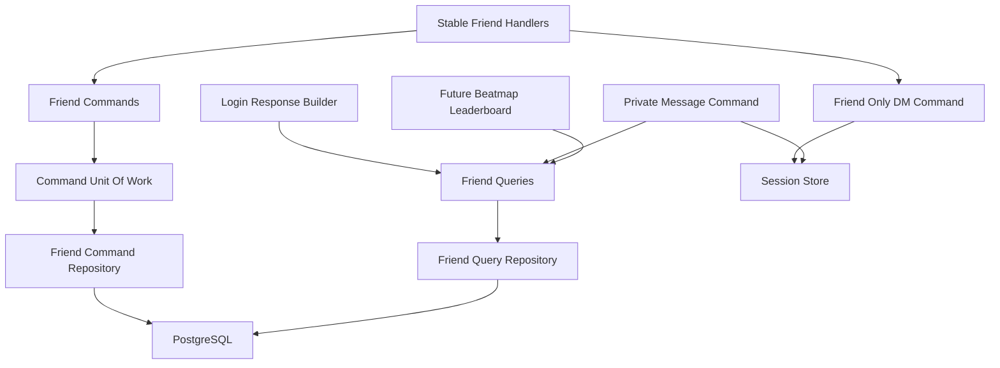
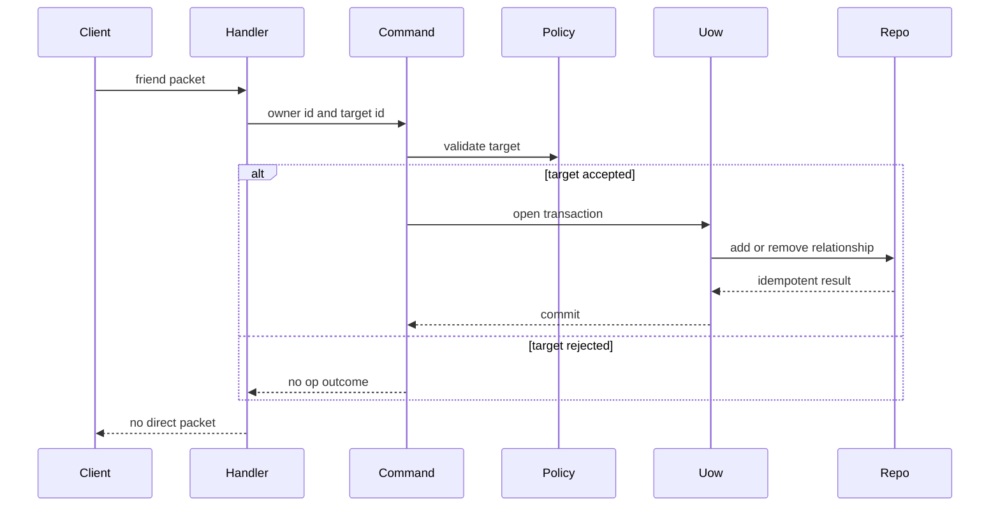
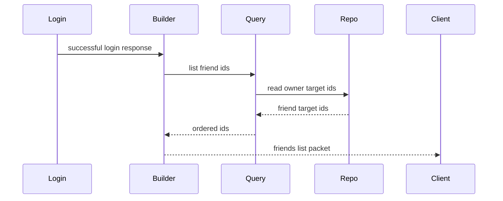
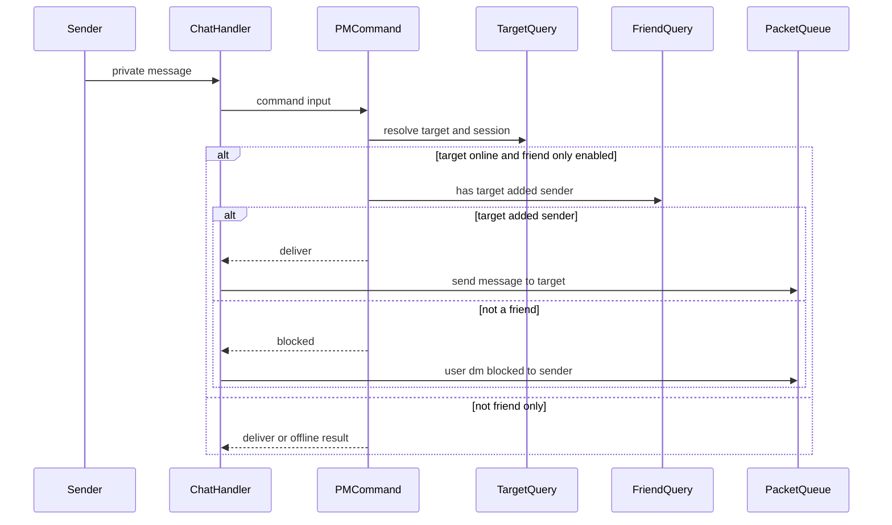
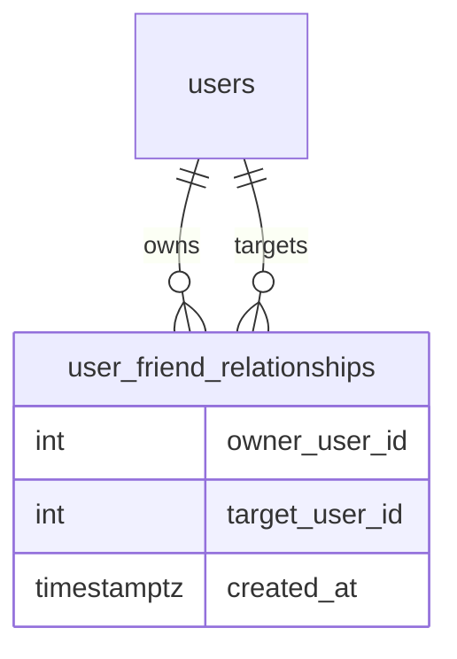

# Design Document

## Overview

friend-relationships は、stable client の friends list、friend add/remove、friend-only DM、将来の Friends leaderboard source を支える片方向の social graph を提供する。対象 user は stable client player であり、将来の first-party friend management surface と beatmap leaderboard query も同じ semantics を再利用する。

この設計は Friend Relationship を identity-owned durable state とし、Friend-Only DM を active session state として扱う。stable bancho handler は packet を command/query input に写すだけにし、DB access、SessionStore patch、PM privacy policy は use-case と repository 境界に置く。

### Goals

- 片方向 Friend Relationship を durable に保存し、offline target を含めて login friends list と Friends leaderboard source に使えるようにする。
- stable `ADD_FRIEND` / `REMOVE_FRIEND` を Bancho-compatible no-op semantics で処理する。
- `pm_private` と `CHANGE_FRIENDONLY_DMS` から active session の Friend-Only DM state を更新する。
- player-originated PM のみ friend-only policy で block し、system response は block しない。
- BanchoBot を明示追加可能だが自動追加しない friendable system user として扱う。

### Non-Goals

- mutual friend、friend request、approval workflow。
- Block Relationship。
- WebUI / public API の具体的な endpoint 実装。
- Beatmap Leaderboard の score row 生成。
- User Stats / User Ranking。
- account-level persistent DM privacy setting。

## Boundary Commitments

### This Spec Owns

- Friend Relationship の domain language、one-way invariant、friendable target policy。
- Friend Relationship の command-side mutation contract と query-side read contract。
- `user_friend_relationships` storage shape and migration。
- stable `ADD_FRIEND` / `REMOVE_FRIEND` / `CHANGE_FRIENDONLY_DMS` handling.
- successful login response に current friend target IDs を入れること。
- active session の `pm_private` update contract。
- player-originated PM に対する Friend-Only DM delivery rule。
- Friends leaderboard が参照する eligible friend target ID set の query contract。

### Out of Boundary

- BanchoBot online presence, bot status, and bot stats.
- channel membership and public chat behavior.
- score listing, personal best selection, leaderboard row sorting, and rank calculation.
- first-party WebUI/API route shape.
- persistent user settings for private messages.
- reverse relationship inference or mutual approval.
- block list, ignore list, moderation, or reporting features.

### Allowed Dependencies

- Domain identity values and system user identity values.
- Command Unit of Work and command repositories for durable friend mutations.
- Query repositories for login, PM policy checks, and leaderboard source reads.
- `SessionStore` for active `pm_private` state.
- Stable bancho protocol parser/builder helpers and `PacketQueue`.
- Existing chat command/query use-cases for PM target resolution and packet enqueue.
- Dishka provider sets for wiring app/test runtime dependencies.

Forbidden dependencies:

- Domain code must not import Starlette, Dishka, SQLAlchemy, Valkey, taskiq, or stable protocol types.
- Stable handlers must not import SQLAlchemy models, DB sessions, raw SQL, or concrete repositories.
- Query use-cases must not mutate durable friend state.
- Command repositories must not commit or rollback outside Unit of Work.
- Beatmap leaderboard query code must not reimplement friend relationship mutation or friendable target policy.

### Revalidation Triggers

- `FriendRelationshipCommandRepository` or `FriendRelationshipQueryRepository` method signatures change.
- `user_friend_relationships` key shape, cascade behavior, or uniqueness constraints change.
- `SessionStore.update_pm_private()` semantics change or persistent privacy settings are introduced.
- stable `ADD_FRIEND`, `REMOVE_FRIEND`, `CHANGE_FRIENDONLY_DMS`, `FRIENDS_LIST`, or `USER_DM_BLOCKED` wire shape changes.
- BanchoBot identity, system user catalog, or friendable system user policy changes.
- beatmap-leaderboards starts consuming Friends leaderboard filtering.
- first-party friend management API is added.

## Architecture

### Existing Architecture Analysis

Athena already separates stable packet adaptation, command/query use-cases, repository ports, SQLAlchemy adapters, memory adapters, and Dishka composition. Login response construction currently has a direct integration point for `friends_list([])`, and chat PM delivery already resolves a target via a query before the transport enqueues packets.

`SessionData.pm_private` exists and is created from login `ClientInfo.pm_private`, but the session store has no focused method to update this field after login. Stable packet IDs for friend add/remove and friend-only DM are already modeled, while handler registration for those packets is absent.

### Architecture Pattern & Boundary Map

Selected pattern: identity-owned social graph with command/query repository ports and thin stable adapters.



Key decisions:

- Durable Friend Relationship belongs to identity, not chat or scores.
- Stable handlers translate packet payloads to use-case inputs and ignore no-op outcomes.
- `SessionStore` owns only active session privacy state; durable friend state stays in PostgreSQL.
- Future leaderboard code consumes a query use-case returning friend target IDs.

### Technology Stack

| Layer | Choice / Version | Role in Feature | Notes |
| --- | --- | --- | --- |
| Domain / Services | Python 3.14 dataclasses and Protocols | Friend relationship models, command/query inputs, typed outcomes | No Pydantic in domain |
| Stable transport | Caterpillar-based packet parsing/building | `ADD_FRIEND`, `REMOVE_FRIEND`, `CHANGE_FRIENDONLY_DMS`, `USER_DM_BLOCKED` | Existing transport stack |
| Data / Storage | SQLAlchemy 2.0 async + PostgreSQL | `user_friend_relationships` table and query repository | New Alembic migration |
| Session state | Valkey via existing `SessionStore` | Active `pm_private` updates | No durable account setting |
| Composition | Dishka | Provider wiring for commands, queries, handlers, repositories | Existing provider pattern |
| Tests | pytest, pytest-asyncio | Unit, repository, protocol, integration coverage | Typed fakes/memory repos |

No new third-party dependency is introduced.

## File Structure Plan

### Directory Structure

```text
src/osu_server/
├── domain/
│   └── identity/
│       ├── friends.py
│       ├── sessions.py
│       └── system_users.py
├── services/
│   ├── commands/
│   │   ├── chat/
│   │   │   └── send_private_message.py
│   │   └── identity/
│   │       ├── __init__.py
│   │       └── friend_relationships.py
│   └── queries/
│       └── identity/
│           ├── __init__.py
│           └── friend_relationships.py
├── repositories/
│   ├── interfaces/
│   │   ├── session_store.py
│   │   ├── unit_of_work.py
│   │   ├── commands/friends.py
│   │   └── queries/friends.py
│   ├── sqlalchemy/
│   │   ├── commands/friends.py
│   │   ├── models/friend.py
│   │   ├── models/__init__.py
│   │   ├── queries/friends.py
│   │   └── unit_of_work.py
│   ├── memory/
│   │   ├── commands/friends.py
│   │   ├── commands/state.py
│   │   ├── queries/friends.py
│   │   ├── session_store.py
│   │   └── unit_of_work.py
│   └── valkey/
│       └── session_store.py
├── transports/
│   └── stable/bancho/
│       ├── handlers/friends.py
│       ├── handlers/chat.py
│       ├── protocol/s2c/chat.py
│       └── workflows/login_response_builder.py
└── composition/providers/
    ├── chat_app.py
    ├── identity.py
    ├── repositories.py
    ├── stable_bancho.py
    └── test.py

alembic/
└── versions/
    └── 20260617_0101_create_user_friend_relationships.py

tests/
├── unit/
│   ├── domain/test_friend_relationships.py
│   ├── infrastructure/state/test_session_store.py
│   ├── repositories/test_friend_relationship_repository_contract.py
│   ├── repositories/sqlalchemy/test_friend_relationship_repository.py
│   ├── services/commands/identity/test_friend_relationships.py
│   ├── services/queries/identity/test_friend_relationships.py
│   ├── services/commands/chat/test_send_private_message_friend_only.py
│   └── transports/bancho/
│       ├── protocol/test_s2c_chat.py
│       ├── test_friend_handlers.py
│       └── test_login_response_builder.py
└── integration/
    ├── test_valkey_session_store.py
    └── transports/bancho/test_friend_relationship_pipeline.py
```

### New Files

- `src/osu_server/domain/identity/friends.py` — Friend Relationship, friend mutation outcome, friendable system user catalog, and friend target policy.
- `src/osu_server/services/commands/identity/friend_relationships.py` — add/remove friend commands and update friend-only DM command.
- `src/osu_server/services/queries/identity/friend_relationships.py` — list friend IDs, check one-way relationship, and provide Friends leaderboard eligible IDs.
- `src/osu_server/repositories/interfaces/commands/friends.py` — command-side mutation and target existence contract.
- `src/osu_server/repositories/interfaces/queries/friends.py` — read-only friend lookup contract.
- `src/osu_server/repositories/sqlalchemy/models/friend.py` — `user_friend_relationships` ORM model.
- `src/osu_server/repositories/sqlalchemy/commands/friends.py` — UoW-owned SQLAlchemy mutation implementation.
- `src/osu_server/repositories/sqlalchemy/queries/friends.py` — read-only SQLAlchemy friend query implementation.
- `src/osu_server/repositories/memory/commands/friends.py` — in-memory command repository.
- `src/osu_server/repositories/memory/queries/friends.py` — in-memory query repository.
- `src/osu_server/transports/stable/bancho/handlers/friends.py` — stable friend and friend-only DM packet handlers.
- `alembic/versions/20260617_0101_create_user_friend_relationships.py` — friend relationship table migration.

### Modified Files

- `src/osu_server/domain/identity/sessions.py` — keep `pm_private` as active session field; no durable setting is added.
- `src/osu_server/domain/identity/system_users.py` — expose BanchoBot as friendable through the friendable system user catalog.
- `src/osu_server/repositories/interfaces/session_store.py` — add `update_pm_private(user_id, enabled) -> bool`.
- `src/osu_server/repositories/memory/session_store.py` — implement active session `pm_private` patch.
- `src/osu_server/repositories/valkey/session_store.py` — implement atomic active session `pm_private` patch with TTL preservation.
- `src/osu_server/repositories/interfaces/unit_of_work.py` — expose `friends: FriendRelationshipCommandRepository`.
- `src/osu_server/repositories/sqlalchemy/unit_of_work.py` — bind SQLAlchemy friend command repository.
- `src/osu_server/repositories/memory/unit_of_work.py` and `commands/state.py` — bind friend repository and transaction state.
- `src/osu_server/repositories/interfaces/commands/__init__.py`, `repositories/interfaces/queries/__init__.py`, memory/sqlalchemy package `__init__.py` files — export new repository contracts/implementations.
- `src/osu_server/composition/providers/repositories.py` — provide `FriendRelationshipQueryRepository`.
- `src/osu_server/composition/providers/identity.py` — provide friend command/query use-cases and friendable catalog.
- `src/osu_server/composition/providers/chat_app.py` — inject friend query use-case into PM command.
- `src/osu_server/composition/providers/stable_bancho.py` — register `FriendHandlers` and inject login friend query.
- `src/osu_server/composition/providers/test.py` — include memory repository/test override wiring.
- `src/osu_server/transports/stable/bancho/workflows/login_response_builder.py` — replace `friends_list([])` with query-backed IDs.
- `src/osu_server/transports/stable/bancho/protocol/s2c/chat.py` — add `user_dm_blocked(target: str)` builder.
- `src/osu_server/transports/stable/bancho/handlers/chat.py` — enqueue blocked packet when PM command returns blocked outcome.
- `src/osu_server/services/commands/chat/send_private_message.py` — evaluate friend-only policy before target delivery/persistence.
- `src/osu_server/domain/chat/__init__.py` — add `PrivateMessageDeliveryStatus` and expose blocked PM delivery status in `PrivateMessageResult`.

No changes:

- `pyproject.toml`, `uv.lock`, `.python-version`, `alembic.ini`, devenv/flake files.

## System Flows

### Friend Add And Remove



Stable handlers intentionally ignore mutation outcomes. The durable state and later login friends list are the observable result.

### Login Friends List



The query includes offline targets and does not auto-add BanchoBot.

### Friend-Only Private Message



System command responses are emitted to the invoking sender separately and do not use this player-originated target delivery gate.

## Requirements Traceability

| Requirement | Summary | Components | Interfaces | Flows |
| --- | --- | --- | --- | --- |
| 1.1 | one-way relationship | Friend domain, command repo | `FriendRelationship` | Friend Add And Remove |
| 1.2 | target online not required | command use-case, DB table | no `SessionStore` dependency for add/remove | Friend Add And Remove |
| 1.3 | add does not imply reverse | DB key owner/target | `list_friend_ids(owner)` | Login Friends List |
| 1.4 | mutual means two rows | DB table | composite primary key | Friend Add And Remove |
| 1.5 | target must be friendable | friendable policy | `FriendableSystemUserCatalog` | Friend Add And Remove |
| 2.1 | add existing target | add command | `add_relationship` | Friend Add And Remove |
| 2.2 | remove existing target | remove command | `remove_relationship` | Friend Add And Remove |
| 2.3 | add offline target | add command | no session lookup | Friend Add And Remove |
| 2.4 | unknown target no-op | target policy | typed no-op outcome | Friend Add And Remove |
| 2.5 | self-add no-op | target policy | typed no-op outcome | Friend Add And Remove |
| 2.6 | duplicate add idempotent | command repo | unique key / upsert | Friend Add And Remove |
| 2.7 | remove missing idempotent | command repo | delete count outcome | Friend Add And Remove |
| 2.8 | no stable response needed | stable handler | no enqueue on add/remove | Friend Add And Remove |
| 3.1 | login includes friend IDs | login builder, query | `ListFriendIdsQuery` | Login Friends List |
| 3.2 | empty list supported | query repo | empty tuple/list | Login Friends List |
| 3.3 | reverse not included | query repo | owner-filtered read | Login Friends List |
| 3.4 | offline target included | query repo | DB-only read | Login Friends List |
| 3.5 | no automatic BanchoBot | query, command | explicit row required | Login Friends List |
| 4.1 | BanchoBot explicitly addable | friendable catalog | BanchoBot identity | Friend Add And Remove |
| 4.2 | explicit BanchoBot appears | query repo | `list_friend_ids` | Login Friends List |
| 4.3 | implicit BanchoBot absent | login builder | no synthetic ID append | Login Friends List |
| 4.4 | nonfriendable system rejected | friendable policy | no-op outcome | Friend Add And Remove |
| 4.5 | no human session required | command use-case | no session lookup | Friend Add And Remove |
| 5.1 | login pm_private true | auth/session model | `SessionData.pm_private` | Friend-Only Private Message |
| 5.2 | login pm_private false | auth/session model | `SessionData.pm_private` | Friend-Only Private Message |
| 5.3 | change packet updates session | friend handler, command | `update_pm_private` | Friend-Only Private Message |
| 5.4 | no account-level state | boundary, data model | no user setting column | Friend-Only Private Message |
| 5.5 | relogin derives from client | auth service | login session creation | Friend-Only Private Message |
| 6.1 | disabled state does not block | PM command | privacy evaluator | Friend-Only Private Message |
| 6.2 | target added sender allows | PM command, friend query | `has_friend(target, sender)` | Friend-Only Private Message |
| 6.3 | target has not added sender blocks | PM command, friend query | blocked result | Friend-Only Private Message |
| 6.4 | blocked outcome to sender | chat handler, packet builder | `user_dm_blocked` | Friend-Only Private Message |
| 6.5 | player-originated only | PM command, chat handler | delivery source distinction | Friend-Only Private Message |
| 7.1 | BanchoBot command response not blocked | chat handler command responses | response enqueue path | Friend-Only Private Message |
| 7.2 | system notifications not blocked | boundary, future contract | system-originated source | none |
| 7.3 | player to BanchoBot command works | PM command, command service | bot target bypass | Friend-Only Private Message |
| 7.4 | system response separated | chat handler | command response packets | Friend-Only Private Message |
| 8.1 | leaderboard eligible set | friend query | `GetFriendEligibleUserIdsQuery` | Future Friends Leaderboard |
| 8.2 | no friends gives viewer-only set | friend query | viewer ID tuple | Future Friends Leaderboard |
| 8.3 | no score row generation | boundary | no score repository write/read rows | none |
| 8.4 | feature does not generate rows | boundary | query contract only | none |
| 8.5 | reverse friends not eligible | friend query | owner-filtered read | Login Friends List |
| 9.1 | no block relationship | boundary, data model | no block table | none |
| 9.2 | do not expose others list | login builder | owner-only query | Login Friends List |
| 9.3 | future surface same semantics | command use-cases | typed outcomes | Friend Add And Remove |
| 9.4 | no mutual approval | command policy | direct one-way insert | Friend Add And Remove |
| 9.5 | preserve PM except friend-only | PM command | scoped privacy gate | Friend-Only Private Message |

## Components and Interfaces

| Component | Domain / Layer | Intent | Req Coverage | Key Dependencies | Contracts |
| --- | --- | --- | --- | --- | --- |
| Friend domain language | Domain identity | Define one-way relationship and friendable target policy | 1.1-1.5, 4.1-4.5, 9.1, 9.4 | system user identity | State |
| Friend relationship commands | Command use-case | Add/remove friend rows with no-op semantics | 2.1-2.8, 4.1-4.5, 9.3, 9.4 | UnitOfWork | Service |
| Friend relationship queries | Query use-case | Read friend IDs, membership, leaderboard source set | 3.1-3.5, 6.2, 6.3, 8.1-8.5, 9.2 | friend query repo | Service |
| Friend repositories | Persistence | Store and read owner/target relationships | 1.1-1.4, 2.1-2.7, 3.1-3.4, 8.1-8.5 | SQLAlchemy, memory state | State |
| Friend-only session update | Session state | Patch active session `pm_private` | 5.1-5.5 | SessionStore | State, Service |
| Stable friend handlers | Stable transport | Adapt stable packets to commands | 2.1-2.8, 5.3, 6.4 | packet parser, commands | API |
| Login friends list integration | Stable transport | Emit query-backed `FRIENDS_LIST` | 3.1-3.5, 4.2, 4.3, 9.2 | friend query | API |
| PM privacy integration | Chat command/transport | Block player-originated PM delivery when target requires friends | 6.1-6.5, 7.1-7.4, 9.5 | target query, friend query, session store | Service, API |

### Domain / Identity

#### Friend Domain Language

| Field | Detail |
| --- | --- |
| Intent | Express one-way Friend Relationship and friendable target rules without transport or persistence dependencies. |
| Requirements | 1.1, 1.2, 1.3, 1.4, 1.5, 4.1, 4.4, 9.1, 9.4 |

**Responsibilities & Constraints**

- `FriendRelationship(owner_user_id, target_user_id)` represents one directed edge.
- `owner_user_id == target_user_id` is invalid at the policy level and defensively invalid at storage level.
- `FriendableSystemUserCatalog` initially contains BanchoBot as friendable.
- Human users are friendable when they exist and are not classified as nonfriendable system users.
- Domain code contains no SQLAlchemy, Valkey, Dishka, or stable protocol imports.

**Contracts**: Service [ ] / API [ ] / Event [ ] / Batch [ ] / State [x]

##### State Management

- State model: directed owner/target edge.
- Persistence & consistency: stored durably through command repository; read through query repository.
- Concurrency strategy: duplicate add is idempotent through composite uniqueness.

### Command Use-Cases

#### Friend Relationship Commands

| Field | Detail |
| --- | --- |
| Intent | Apply add/remove requests with Bancho-compatible no-op semantics. |
| Requirements | 2.1, 2.2, 2.3, 2.4, 2.5, 2.6, 2.7, 2.8, 4.1, 4.2, 4.4, 4.5, 9.3, 9.4 |

**Responsibilities & Constraints**

- Validate target existence and friendability before mutation.
- Add/remove relationships inside one Unit of Work transaction.
- Never depend on target online state.
- Return typed outcome for tests and future API surfaces; stable handlers ignore the outcome.
- Do not enqueue packets or expose stable response decisions.

**Dependencies**

- Inbound: `FriendHandlers`, future first-party API — send owner/target command input (P0).
- Outbound: `UnitOfWorkFactory` — transaction and command repositories (P0).
- Outbound: `FriendableSystemUserCatalog` — target policy (P0).

**Contracts**: Service [x] / API [ ] / Event [ ] / Batch [ ] / State [ ]

##### Service Interface

```python
@dataclass(frozen=True, slots=True)
class AddFriendCommand:
    owner_user_id: int
    target_user_id: int

@dataclass(frozen=True, slots=True)
class RemoveFriendCommand:
    owner_user_id: int
    target_user_id: int

class AddFriendUseCase(Protocol):
    async def execute(self, command: AddFriendCommand) -> FriendMutationOutcome: ...

class RemoveFriendUseCase(Protocol):
    async def execute(self, command: RemoveFriendCommand) -> FriendMutationOutcome: ...
```

- Preconditions: `owner_user_id` is the authenticated session user.
- Postconditions: add/remove either mutates one directed row or returns no-op outcome.
- Invariants: no self relationship, no reverse relationship side effects.

#### Friend-Only DM Session Command

| Field | Detail |
| --- | --- |
| Intent | Update active session Friend-Only DM state from stable packet input. |
| Requirements | 5.1, 5.2, 5.3, 5.4, 5.5 |

**Responsibilities & Constraints**

- Patch only `SessionData.pm_private`.
- Return missing-session outcome without creating session state.
- Keep account/user table unchanged.

**Dependencies**

- Inbound: `FriendHandlers` — stable boolean payload (P0).
- Outbound: `SessionStore` — active session patch (P0).

**Contracts**: Service [x] / API [ ] / Event [ ] / Batch [ ] / State [x]

##### Service Interface

```python
@dataclass(frozen=True, slots=True)
class UpdateFriendOnlyDmCommand:
    user_id: int
    enabled: bool

class UpdateFriendOnlyDmUseCase(Protocol):
    async def execute(self, command: UpdateFriendOnlyDmCommand) -> bool: ...
```

- Preconditions: packet payload has been parsed as a stable boolean.
- Postconditions: active session reflects the requested state when present.
- Invariants: no durable user privacy setting is written.

### Query Use-Cases

#### Friend Relationship Queries

| Field | Detail |
| --- | --- |
| Intent | Provide owner-scoped friend ID reads for login, PM policy, and future Friends leaderboard filtering. |
| Requirements | 3.1, 3.2, 3.3, 3.4, 3.5, 6.2, 6.3, 8.1, 8.2, 8.3, 8.4, 8.5, 9.2 |

**Responsibilities & Constraints**

- Return only relationships owned by the viewer/target user supplied by the caller.
- Include offline targets because the source is durable DB state.
- Never synthesize BanchoBot or reverse relationships.
- Do not read score rows or generate leaderboard entries.

**Dependencies**

- Inbound: `LoginResponseBuilder`, `SendPrivateMessageUseCase`, future beatmap leaderboard query (P0).
- Outbound: `FriendRelationshipQueryRepository` — owner-filtered reads (P0).

**Contracts**: Service [x] / API [ ] / Event [ ] / Batch [ ] / State [ ]

##### Service Interface

```python
@dataclass(frozen=True, slots=True)
class ListFriendIdsQueryInput:
    owner_user_id: int

@dataclass(frozen=True, slots=True)
class ListFriendIdsQueryResult:
    friend_user_ids: tuple[int, ...]

class ListFriendIdsQuery(Protocol):
    async def execute(self, input_data: ListFriendIdsQueryInput) -> ListFriendIdsQueryResult: ...

class CheckFriendRelationshipQuery(Protocol):
    async def execute(self, owner_user_id: int, target_user_id: int) -> bool: ...

class GetFriendEligibleUserIdsQuery(Protocol):
    async def execute(self, viewer_user_id: int) -> tuple[int, ...]: ...
```

- Preconditions: caller supplies authenticated owner/viewer identity.
- Postconditions: `ListFriendIdsQuery` returns only target IDs owned by that user for stable login.
- Postconditions: `GetFriendEligibleUserIdsQuery` returns the viewer ID plus target IDs owned by that user for Friends leaderboard filtering.
- Postconditions: when the viewer has no Friend Relationships, `GetFriendEligibleUserIdsQuery` returns a one-item tuple containing only the viewer ID.
- Invariants: reverse edges and mutual state are not inferred.

### Persistence

#### Friend Relationship Repositories

| Field | Detail |
| --- | --- |
| Intent | Persist and read directed friend relationships behind command/query ports. |
| Requirements | 1.1, 1.2, 1.3, 1.4, 2.1, 2.2, 2.3, 2.6, 2.7, 3.1, 3.4, 8.1, 8.5 |

**Responsibilities & Constraints**

- Command repository receives UoW-owned SQLAlchemy session and does not commit.
- Query repository uses short read-only sessions.
- Memory implementations mirror SQLAlchemy uniqueness and transaction behavior for tests.
- Target existence checks use the users table so offline users remain valid.

**Dependencies**

- Inbound: command/query use-cases (P0).
- Outbound: SQLAlchemy models or in-memory state (P0).

**Contracts**: Service [ ] / API [ ] / Event [ ] / Batch [ ] / State [x]

##### State Management

- State model: `owner_user_id -> target_user_id` directed edge.
- Persistence & consistency: composite primary key and foreign keys to `users.id`.
- Concurrency strategy: idempotent insert/delete and DB uniqueness.

### Stable Transport

#### Friend Handlers

| Field | Detail |
| --- | --- |
| Intent | Parse stable social packets and invoke use-cases without persistence knowledge. |
| Requirements | 2.1, 2.2, 2.8, 5.3 |

**Responsibilities & Constraints**

- `ADD_FRIEND` and `REMOVE_FRIEND` parse target user ID payloads and call command use-cases.
- `CHANGE_FRIENDONLY_DMS` parses boolean enabled payload and calls the session command.
- Malformed payloads are logged and dropped like other C2S handlers.
- No direct success/failure packet is enqueued for add/remove.

**Dependencies**

- Inbound: `PacketDispatcher` (P0).
- Outbound: friend add/remove use-cases, update friend-only DM use-case (P0).
- Outbound: `SessionStore` only if current handler pattern requires active session check (P1).

**Contracts**: Service [ ] / API [x] / Event [ ] / Batch [ ] / State [ ]

##### API Contract

| Packet | Payload | Use-case Input | Response |
| --- | --- | --- | --- |
| `ADD_FRIEND` | stable int32 user ID | `AddFriendCommand(owner, target)` | none |
| `REMOVE_FRIEND` | stable int32 user ID | `RemoveFriendCommand(owner, target)` | none |
| `CHANGE_FRIENDONLY_DMS` | stable boolean enabled | `UpdateFriendOnlyDmCommand(user, enabled)` | none |

#### Login Friends List Integration

| Field | Detail |
| --- | --- |
| Intent | Build `FRIENDS_LIST` from durable relationships during successful login. |
| Requirements | 3.1, 3.2, 3.3, 3.4, 3.5, 4.2, 4.3, 9.2 |

**Responsibilities & Constraints**

- Query current friend target IDs by logged-in user ID.
- Preserve existing packet order around `channel_info_complete`, `FRIENDS_LIST`, `silence_info`, and `user_presence_bundle`.
- Do not append BanchoBot unless explicitly present in query result.
- Keep BanchoBot presence roster independent from friends list.

**Contracts**: Service [ ] / API [x] / Event [ ] / Batch [ ] / State [ ]

##### API Contract

| Packet | Payload | Source |
| --- | --- | --- |
| `FRIENDS_LIST` | int32 list of friend target IDs | `ListFriendIdsQuery` |

### Chat Integration

#### PM Privacy Integration

| Field | Detail |
| --- | --- |
| Intent | Enforce target-side Friend-Only DM for player-originated PMs. |
| Requirements | 6.1, 6.2, 6.3, 6.4, 6.5, 7.1, 7.2, 7.3, 7.4, 9.5 |

**Responsibilities & Constraints**

- Resolve target existence and active session state before durable PM persistence.
- If target has active `pm_private=True`, allow only when target has added sender.
- Blocked PMs are not delivered to the target and are not persisted as accepted private chat history.
- Stable sender receives `USER_DM_BLOCKED`.
- Command/system responses to the invoking user bypass this player-originated delivery rule.
- Player messages to BanchoBot remain command-processable without requiring BanchoBot friendship.

**Dependencies**

- Inbound: `ChatHandlers` (P0).
- Outbound: `ResolvePrivateMessageTargetQuery`, `ListFriendIdsQuery` or `CheckFriendRelationshipQuery`, `SessionStore`, persistence publisher (P0).
- Outbound: stable `user_dm_blocked` packet builder from transport only (P0).

**Contracts**: Service [x] / API [x] / Event [ ] / Batch [ ] / State [ ]

##### Service Interface

```python
class PrivateMessageDeliveryStatus(StrEnum):
    DELIVERABLE = "deliverable"
    OFFLINE = "offline"
    TARGET_NOT_FOUND = "target_not_found"
    BLOCKED_BY_FRIEND_ONLY = "blocked_by_friend_only"
```

- Preconditions: sender is an authenticated player session.
- Postconditions: blocked player-originated PM has no target enqueue and no accepted-history persistence.
- Invariants: command responses and system-originated notifications are not evaluated as player-originated PMs.

##### API Contract

| Packet | Payload | Trigger |
| --- | --- | --- |
| `USER_DM_BLOCKED` | stable `Message` payload with empty sender/content, target name, and sender ID `0` | PM blocked by target Friend-Only DM |

Protocol tests lock the exact `USER_DM_BLOCKED` bytes before PM integration tests rely on the builder.

## Data Models

### Domain Model

- `FriendRelationship`: directed edge from `owner_user_id` to `target_user_id`.
- `FriendableSystemUserCatalog`: classifies configured system user IDs and which of those are friendable.
- `FriendMutationOutcome`: typed internal outcome for add/remove no-op and changed cases.
- `PrivateMessageDeliveryStatus`: typed chat outcome used by stable handler to select packet behavior.

Invariants:

- A user cannot be their own friend target.
- A reverse row is independent and never implied.
- BanchoBot is friendable only through explicit row creation.
- Friend-Only DM belongs to active `SessionData`, not `User`.

### Logical Data Model



### Physical Data Model

Relational table:

- `user_friend_relationships`
  - `owner_user_id integer not null references users(id) on delete cascade`
  - `target_user_id integer not null references users(id) on delete cascade`
  - `created_at timestamptz not null server_default now()`
  - primary key: `(owner_user_id, target_user_id)`
  - check constraint: `owner_user_id <> target_user_id`
  - index: `(target_user_id)` only if future reverse lookup becomes necessary; not required for this spec.

Consistency:

- Add is idempotent through insert-on-conflict/do-nothing or equivalent.
- Remove is idempotent through delete-by-key.
- Login and leaderboard reads order by `created_at, target_user_id` unless a client-observed order requirement is later discovered.

### Data Contracts & Integration

- Stable `FRIENDS_LIST` remains an int32 list packet.
- Stable `ADD_FRIEND` / `REMOVE_FRIEND` target IDs are transport inputs and do not cross into repository layer as packet structs.
- Future beatmap leaderboard uses self-inclusive `GetFriendEligibleUserIdsQuery(viewer_user_id)` and then applies score filtering in its own query boundary.

## Error Handling

- Unknown target, self-add, duplicate add, remove missing, and nonfriendable target return typed no-op outcomes.
- Stable add/remove handlers emit no direct response for either changed or no-op outcomes.
- Malformed stable packet payloads are logged and dropped without mutation.
- Missing active session during `CHANGE_FRIENDONLY_DMS` returns `False` from the command and does not create state.
- DB integrity errors during add are treated as idempotency/constraint signals only when they match the expected relationship uniqueness constraint; unexpected errors propagate.

## Security And Privacy

- A user can read only their own friends list through login and query-use-case consumers.
- No stable login behavior exposes another user's friends list.
- Friend-only DM checks use target-owned relationship direction: target must have added sender.
- The feature does not add block or moderation semantics.
- Packet logs must not include private message content beyond existing chat logging behavior.

## Performance And Scaling

- Login friends list read is a single owner-keyed query.
- PM friend-only check is only performed when the target is online and has `pm_private=True`.
- Friend add/remove writes one small row and is safe under duplicate retry.
- The table can support future leaderboard filtering by returning a compact target ID set; leaderboard row selection remains downstream.
- No Valkey friend graph cache is introduced in this spec.

## Testing Strategy

- Domain tests verify one-way invariants, self-target rejection, BanchoBot friendable policy, and nonfriendable system rejection.
- Command tests verify add/remove changed and no-op outcomes: unknown target, self-add, duplicate add, missing remove, offline target, explicit BanchoBot.
- Repository contract tests run against memory and SQLAlchemy implementations for add idempotency, remove idempotency, owner-filtered reads, and reverse-edge independence.
- Migration tests or SQLAlchemy repository tests verify composite primary key, foreign keys, and self-check constraint.
- SessionStore tests verify `update_pm_private` for memory and Valkey preserves other session fields and returns `False` for missing sessions.
- Login response builder tests verify `FRIENDS_LIST` includes explicit friend IDs, includes offline IDs, excludes reverse-only users, and does not synthesize BanchoBot.
- Stable handler tests verify `ADD_FRIEND`, `REMOVE_FRIEND`, and boolean `CHANGE_FRIENDONLY_DMS` payload adaptation.
- PM command tests verify disabled friend-only allows, target-added-sender allows, target-not-added-sender blocks, offline target does not require account-level privacy, and system command responses bypass blocking.
- Protocol tests verify `USER_DM_BLOCKED` packet ID and payload shape.
- Bancho pipeline integration tests verify add friend then relogin returns the target ID, remove then relogin omits it, and blocked PM enqueues the blocked packet to sender.

## Migration And Rollout

- Add the new table in one Alembic migration after the current head.
- Deploying the migration before code is safe because no existing code reads/writes the table.
- Existing users start with empty friend relationships.
- BanchoBot is not backfilled into any user's friend list.
- Rollback drops only `user_friend_relationships` and does not affect users, sessions, chat history, or score data.
