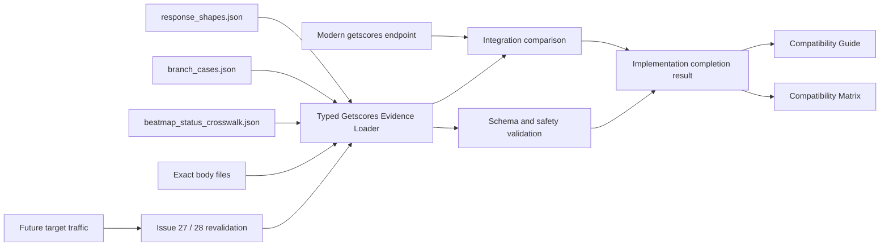
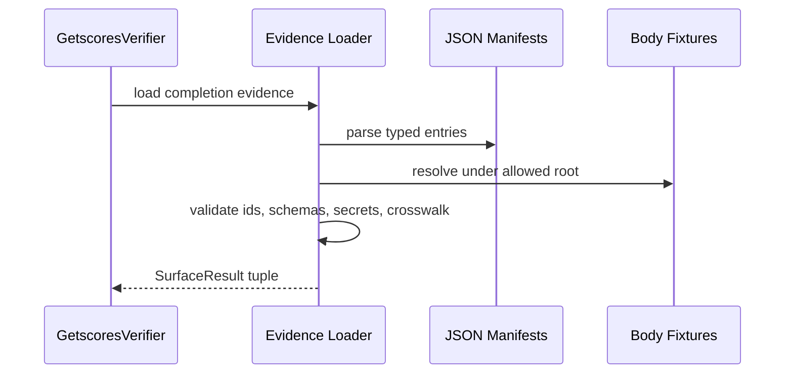
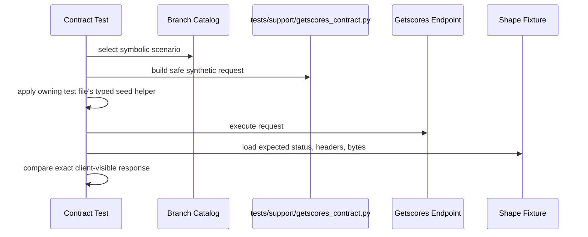

# Design Document

## Overview

Modern Getscores Implementation Completionは、modern `/web/osu-osz2-getscores.php` のAthena-owned behaviorを、distinct wire shape fixture、branch case catalog、Stable Beatmap Status Crosswalk、runtime comparison testで固定する設計である。

このspecは新しいleaderboard機能を作るものではない。既に存在するauth、beatmap resolution、category selection、Personal Best、leaderboard rows、malformed fallbackをclient-observable contractへ結合し、Guide / Matrixを実装実態へ同期する。Target Stable Client trafficによる最終互換確認はIssue #27 / #28へ残す。

### Goals

- Auth failure、unavailable、update available、header-only、Personal Best + leaderboard rowsの5 distinct wire shapeをexact bytesで固定する。
- Global、Local、Selected Mods、Friends、Country、song select、unsupported、malformed caseをshape idへ対応付ける。
- 全`BeatmapRankStatus`についてgetscoresとbeatmap infoのendpoint-specific status representationを記録する。
- Completion evidenceをtyped loader / validator、CLI verification、unit / integration testsでmechanically検証する。
- Compatibility Guide / Matrixを`Implemented`へ同期し、target traffic gapを別の未確認事項として維持する。
- Confirmed evidenceとruntimeが矛盾する場合だけ、one-branchの最小correctionを許可する。

### Non-Goals

- Target Stable Client trafficの取得またはFull Stable Compatibility認定。
- `/web/osu-getscores.php`から`/web/osu-getscores6.php`までのlegacy alias実装。
- Beatmap info endpoint実装または未確認wire statusの推測。
- Leaderboard projection redesign、RX / AP expansion、osu!direct。
- DB schema、migration、Valkey、taskiq、dependency、project-wide configの変更。
- Current runtime outputからのfixture自動生成。

## Boundary Commitments

### This Spec Owns

- Modern getscoresの5 distinct wire shape contract。
- Shape body bytes、HTTP status、relevant headers、terminal newline、PB / row-count semantics。
- Request selectionとexpected shapeを結ぶsanitized branch case catalog。
- Getscores Provisional Malformed Request Behaviorの明示とwarning category validation。
- Canonical `BeatmapRankStatus`からgetscores / beatmap infoへのevidence crosswalk。
- Completion evidenceのtyped loading、cross-reference validation、secret policy validation。
- Existing runtimeがcompletion fixtureと一致することを示すfocused tests。
- Stable verification catalogのstale getscores gap correction。
- Compatibility Guide / Matrixのimplementation completion同期。

### Out of Boundary

- Legacy getscores aliasesのroute、parser、formatter、response fixture。
- Beatmap info transport、service、repository、wire mapperの実装。
- Score / leaderboard read model、category query、friend graph、country modelの再設計。
- Relax / Autopilot leaderboard family。
- osu!direct search / download。
- Stable client capture、HAR、credential、raw username、captured raw queryのrepository保存。
- Confirmed evidenceがないsentinel、status value、fallback behaviorの変更。
- GitHub Issue #27 / #28のtraffic evidence作業そのもの。

### Allowed Dependencies

- `osu_server.domain.beatmaps.models.BeatmapRankStatus` - crosswalk canonical status vocabulary only。
- `osu_server.domain.scores.personal_best.LeaderboardCategory` - branch catalog expected domain category vocabulary only。
- `osu_server.domain.compatibility.stable.getscores.GetscoresParseWarning` - expected warning category vocabulary only。
- Existing getscores parser、status mapper、category mapper、exchange、formatter。
- Existing score / beatmap query use-cases and in-memory integration test composition。
- `src/athena_cli/stable_verification/` - completion evidence loading and verification。
- `tests/fixtures/stable_compatibility/getscores/` - evidence manifests。
- `tests/fixtures/web_legacy/getscores/` - exact response body fixtures。
- Existing getscores unit / integration tests。
- `docs/stable-compatibility-guide.md` and `docs/stable-compatibility-matrix.md`。
- `.kiro/specs/beatmap-info-endpoint/` - confirmed beatmap info evidence source only。
- Issue #12、Issue #27、Issue #28。

Dependency direction:

```text
fixture manifests -> athena_cli stable verification
athena_cli stable verification -> osu_server domain enums for typed evidence validation
tests -> athena_cli evidence + osu_server runtime
osu_server runtime -> domain / services / repositories
```

`osu_server`から`athena_cli`をimportしてはならない。Crosswalkはevidence artifactであり、runtime lookup sourceではない。

### Revalidation Triggers

- Target Stable Client trafficがprovisional malformed behaviorと矛盾する。
- Official fixtureまたはprotocol documentationが5 shapeのstatus、headers、body bytesを変更する。
- Getscores formatter、parser、category mapper、status mapper、query projectionが変更される。
- `BeatmapRankStatus`へvalueが追加、削除、renameされる。
- Beatmap info側の追加status evidenceが確定する。
- Existing response fixtureのbody bytesまたはterminal newlineが変更される。
- Stable verification catalog schemaまたは`SurfaceResult` contractが変更される。
- Supported stable client rangeまたはIssue #27 / #28のownershipが変更される。

## Architecture

### Existing Architecture Analysis

Current endpointはstable transport内でrequest adaptationとwire formattingを所有し、domain compatibility valueとquery serviceを利用する。Runtime branchは広く実装済みだが、evidenceが次の場所へ分散している。

- Status別body fixtures: `tests/fixtures/web_legacy/getscores/*.txt`
- Live target probe input: `tests/fixtures/stable_compatibility/getscores/probe_cases.json`
- Formatter / parser / mapper behavior: unit tests
- Auth、selection、PB / rows、unavailable / update behavior: integration tests
- Compatibility state: Guide / Matrix

Selected designはruntimeをmanifest-drivenに変更しない。Evidence manifestをouter verification layerへ追加し、testsがmanifestとruntimeを照合する。これによりcompatibility evidenceがproduction dependencyにならず、fixtureによるarchitecture inversionを避ける。

Existing `GetscoresVerifier`は正常なscore rowsをstaleな`KNOWN_GAP`として扱う。Completion implementationではnormal PB / leaderboard rowsを`PASS`へ変更し、catalogのmissing projection記述もtarget traffic gapへ置き換える。

### Architecture Pattern & Boundary Map

Selected pattern: typed evidence bundle with runtime comparison and documentation projection。



Key rules:

- Exact body fixtures are authored from confirmed evidence and reviewed, not generated from runtime snapshots。
- Branch catalog references shape ids; it does not duplicate bodies。
- Target probe cases remain separate and may contain query-construction fields not allowed in completion catalog。
- Crosswalk records endpoint-specific representations and never becomes a shared numeric mapper。
- Production correction is conditional on evidence authority, not on fixture/test preference。

### Technology Stack

| Layer | Choice | Role | Notes |
| --- | --- | --- | --- |
| Evidence schema | JSON | Shape、branch、status crosswalk manifests | Existing repository format |
| Exact body | Byte fixture files | Response body contract | Read with `Path.read_bytes()` |
| Typed model | Python `StrEnum` + `@dataclass(frozen=True, slots=True)` | No-`Any` parsed contracts | Japanese Google Style docstrings |
| Validation | Existing `SurfaceResult` / pytest | Schema、secret、cross-reference、runtime equality | No new dependency |
| Runtime | Existing Starlette response path | Contract under test | No default production change |
| Documentation | Markdown | Guide / Matrix completion state | Issue #27 / #28 handoff |

No database migration、dependency addition、project-wide configuration changeを導入しない。

## File Structure Plan

### Directory Structure

```text
.kiro/specs/getscores-implementation-completion/
├── requirements.md
├── research.md
├── design.md
└── spec.json
src/athena_cli/stable_verification/
├── catalog.py
├── getscores.py
└── getscores_evidence.py
tests/fixtures/stable_compatibility/getscores/
├── probe_cases.json
├── response_shapes.json
├── branch_cases.json
└── beatmap_status_crosswalk.json
tests/fixtures/web_legacy/getscores/
├── existing status fixtures...
└── completion/
    ├── auth_failure.body
    ├── unavailable.body
    ├── update_available.body
    ├── header_only.body
    └── header_with_rows.body
tests/support/
└── getscores_contract.py
tests/unit/athena_cli/stable_verification/
├── test_getscores.py
└── test_getscores_completion_evidence.py
tests/integration/
├── test_getscores_endpoint.py
├── test_getscores_unavailable_paths.py
├── test_getscores_status_fixtures.py
└── test_getscores_diagnostics.py
docs/
├── stable-compatibility-guide.md
└── stable-compatibility-matrix.md
```

### New Files

- `src/athena_cli/stable_verification/getscores_evidence.py` - completion evidenceのtyped model、loader、validator。
- `tests/fixtures/stable_compatibility/getscores/response_shapes.json` - 5 distinct wire shapeのmetadata contract。
- `tests/fixtures/stable_compatibility/getscores/branch_cases.json` - symbolic request / seed scenarioからshape idへのcatalog。
- `tests/fixtures/stable_compatibility/getscores/beatmap_status_crosswalk.json` - canonical statusとendpoint-specific representation。
- `tests/fixtures/web_legacy/getscores/completion/*.body` - runtime exact body bytes。Existing status fixturesは変更しない。
- `tests/support/getscores_contract.py` - symbolic branch profileからsafe synthetic query / expected fixtureを解決するtyped test helper。
- `tests/unit/athena_cli/stable_verification/test_getscores_completion_evidence.py` - schema、foreign key、secret policy、crosswalk completeness validation。

### Modified Files

- `src/athena_cli/stable_verification/getscores.py`
  - Completion evidence validationを`verify_fixtures()`へ合成する。
  - Valid PB / score rowsをstaleな`KNOWN_GAP`ではなく`PASS`として扱う。
- `src/athena_cli/stable_verification/catalog.py`
  - New evidence artifactsをcatalogへ追加する。
  - Missing leaderboard implementation gapを削除し、Issue #27 / #28所有のtarget traffic gapへ置換する。
- `tests/unit/athena_cli/stable_verification/test_getscores.py`
  - New mandatory validation resultsとnormal score-row `PASS` behaviorを固定する。
- `tests/integration/test_getscores_endpoint.py`
  - Header-only、PB + rows、category casesをexact shape fixtureへ照合する。
- `tests/integration/test_getscores_unavailable_paths.py`
  - Unavailable、update available、metadata / warmup failure invarianceをshape fixtureへ照合する。
- `tests/integration/test_getscores_status_fixtures.py`
  - Crosswalk completeness、mapper一致、local override、unsupported statusを検証する。
- `tests/integration/test_getscores_diagnostics.py`
  - Multiple warning category、provisional fallback、diagnostic redactionを検証する。
- `tests/unit/transports/web_legacy/test_getscores_formatter.py`
  - Pipe / CR / LFを含むsynthetic metadataとusernameのsanitized exact outputを固定する。
- `tests/unit/transports/web_legacy/test_getscores_category_mapper.py`
  - Request selectorとexpected domain categoryのclosed mappingをcatalog contractへ揃える。
- `tests/unit/transports/web_legacy/test_getscores_status_mapper.py`
  - `BeatmapRankStatus`、local override、crosswalk getscores valueの一致を固定する。
- `docs/stable-compatibility-guide.md`
  - Current branch、status mapping、provisional malformed behavior、target traffic gapを同期する。
- `docs/stable-compatibility-matrix.md`
  - Modern getscoresを`Implemented` / `required`へ更新し、traffic evidence gapを分離する。
- `.kiro/specs/getscores-implementation-completion/spec.json`
  - Design generation stateを記録する。

### Conditional Production Files

Current discoveryではproduction contradictionを確認していないため、default implementation taskは`src/osu_server/`を変更しない。

Confirmed higher-authority evidenceとの矛盾が実装中に判明した場合だけ、次のexact ownerへcorrectionを限定する。

- `src/osu_server/transports/stable/web_legacy/getscores.py` - branch response、HTTP metadata、body formatting。
- `src/osu_server/transports/stable/web_legacy/mappers/getscores.py` - statusまたはselection mapping。

Correction前にGitNexus impact analysisを再実行し、HIGH / CRITICAL riskなら編集前にユーザーへ警告する。Service / repository redesignが必要になる場合はIssue #12のscopeを超えるため、specを再承認する。

### Component Ownership By File

| File | Owned Component |
| --- | --- |
| `getscores_evidence.py` | Typed Evidence Bundle、Loader、Validator |
| `response_shapes.json` + completion body files | Getscores Wire Shape Fixture |
| `branch_cases.json` | Getscores Branch Case Catalog |
| `beatmap_status_crosswalk.json` | Stable Beatmap Status Crosswalk |
| `tests/support/getscores_contract.py` | Symbolic Scenario Query Builder and Fixture Resolver |
| `test_getscores_category_mapper.py` | Stable Selector to Domain Category Contract |
| `test_getscores_status_mapper.py` | Getscores Status Mapper Contract |
| Existing getscores tests | Runtime Contract Comparison、Malformed Diagnostic Validation |
| `getscores.py` + `catalog.py` | Stable Verification Completion Projection |
| Guide / Matrix | Compatibility Documentation Synchronization |
| `research.md` | Evidence Authority and Correction Decision Log |

## System Flows

### Completion evidence validation flow



### Runtime comparison flow



### Evidence-limited correction flow

1. Runtime-to-fixture mismatchを検出する。
2. Evidence authorityをTarget traffic、official fixture、protocol docs、reference consensus、single reference、Athena deterministic behaviorの順で評価する。
3. Athena-only assumptionならruntimeを変更せずevidence gapを記録する。
4. Higher-authority evidenceとの矛盾ならone branchだけをcorrectionする。
5. Exact fixtureとfocused regression testを同じchangeへ含める。
6. Guide / Matrixをvalidation resultへ同期する。

## Requirements Traceability

| Requirement | Summary | Components | Interfaces / Files | Flow |
| --- | --- | --- | --- | --- |
| 1.1 | Auth failure 401 + empty body | Wire Shape Fixture、Runtime Comparison | `auth_failure.body`、endpoint integration | Runtime comparison |
| 1.2 | Invalid identity/checksum/unavailable | Branch Catalog、Wire Shape Fixture | `unavailable.body`、unavailable integration | Runtime comparison |
| 1.3 | Filename match checksum update | Branch Catalog、Wire Shape Fixture | `update_available.body` | Runtime comparison |
| 1.4 | Header + PB + rows | Wire Shape Fixture、Runtime Comparison | `header_with_rows.body` | Runtime comparison |
| 1.5 | Header-only selections | Branch Catalog、Wire Shape Fixture | `header_only.body` | Runtime comparison |
| 1.6 | Preparation/warmup failure invariance | Runtime Comparison | unavailable/endpoint integration tests | Runtime comparison |
| 1.7 | No credentials/provenance in body | Evidence Validator、Security Tests | forbidden content policy | Evidence validation |
| 2.1 | Five distinct exact fixtures | Wire Shape Fixture | `response_shapes.json` + 5 bodies | Evidence validation |
| 2.2 | Status/headers/body/newline | Wire Shape Fixture | `GetscoresWireShapeFixture` | Evidence validation |
| 2.3 | Row count excludes PB | Wire Shape Validator | row count and PB invariants | Evidence validation |
| 2.4 | Exact score fields | Header-with-rows fixture | formatter and endpoint tests | Runtime comparison |
| 2.5 | Sanitized pipe/CR/LF | Formatter Contract | formatter test + row fixture | Runtime comparison |
| 2.6 | No category body duplication | Branch Catalog | shape id foreign key | Evidence validation |
| 2.7 | Endpoint matches all fixtures | Runtime Comparison | existing integration tests | Runtime comparison |
| 3.1 | Catalog covers selections | Branch Catalog、Symbolic Scenario Builder | `branch_cases.json`、`tests/support/getscores_contract.py` | Evidence validation |
| 3.2 | Local maps to Global scope | Branch Catalog、Category Mapper Contract | `test_getscores_category_mapper.py` | Runtime comparison |
| 3.3 | Selected Mods exact bitmask | Branch Catalog、Category Tests | semantic seed profiles | Runtime comparison |
| 3.4 | Friends directionality | Branch Catalog、Endpoint Tests | outbound friend scenario | Runtime comparison |
| 3.5 | Country and XX behavior | Branch Catalog、Endpoint Tests | country seed profiles | Runtime comparison |
| 3.6 | Song select/unsupported header-only | Branch Catalog | expected shape id | Runtime comparison |
| 3.7 | Every case references one shape | Evidence Validator、Symbolic Scenario Builder | shape foreign key and fixture resolver | Evidence validation |
| 3.8 | Parse-only/diagnostic invariance | Branch Catalog、Diagnostics Tests | semantic mutation profiles | Runtime comparison |
| 4.1 | All canonical statuses | Status Crosswalk | status set equality | Evidence validation |
| 4.2 | Getscores numeric mapping | Status Crosswalk、Status Mapper Contract | `test_getscores_status_mapper.py` | Runtime comparison |
| 4.3 | NotSubmitted/Unknown unavailable | Status Crosswalk、Endpoint Tests | unsupported representation | Runtime comparison |
| 4.4 | Local override before mapping | Status Mapper Contract | `test_getscores_status_mapper.py` | Runtime comparison |
| 4.5 | Beatmap info state explicit | Status Crosswalk | tagged endpoint representation | Evidence validation |
| 4.6 | Unconfirmed values not guessed | Evidence Validator | `wire_status=null` invariant | Evidence validation |
| 4.7 | Endpoint mappers remain separate | Boundary Contract | no shared numeric mapper | Design review |
| 5.1 | Malformed identity provisional unavailable | Branch Catalog、Diagnostics Tests | provisional unavailable cases | Runtime comparison |
| 5.2 | Optional malformed warnings/fallback | Branch Catalog、Symbolic Scenario Builder、Diagnostics Tests | warning category set | Runtime comparison |
| 5.3 | Multiple warning categories distinct | Symbolic Scenario Builder、Diagnostics Tests | captured structured log fields | Runtime comparison |
| 5.4 | Provisional label | Branch Catalog、Guide | evidence state enum | Evidence validation |
| 5.5 | No raw credentials/query values | Evidence Validator、Diagnostics Tests | forbidden keys and safe messages | Evidence validation |
| 5.6 | Future evidence wins | Correction Gate、Revalidation Trigger | research decision | Correction flow |
| 6.1 | Evidence authority order | Evidence Authority Log | `research.md` | Correction flow |
| 6.2 | Official fixture precedence | Evidence Authority Log | `research.md` | Correction flow |
| 6.3 | Minimal confirmed correction | Correction Gate | conditional production files | Correction flow |
| 6.4 | Athena-only assumption does not alter wire | Correction Gate | known-gap result | Correction flow |
| 6.5 | Correction adds fixture and regression | Correction Gate、Runtime Comparison | exact owner tests | Correction flow |
| 6.6 | No unrelated behavior | Boundary Contract、Diff Review | conditional file list | Design review |
| 7.1 | Matrix marks Implemented | Documentation Sync | Matrix modern getscores row | Documentation projection |
| 7.2 | Required classification retained | Documentation Sync | Matrix route classification | Documentation projection |
| 7.3 | Implementation/evidence/traffic separated | Documentation Sync | Guide / Matrix wording | Documentation projection |
| 7.4 | Guide matches contracts | Documentation Sync | Guide getscores section | Documentation projection |
| 7.5 | Issue 27/28 handoff | Documentation Sync | Guide / Matrix gap note | Documentation projection |
| 7.6 | No Full Compatibility claim | Documentation Sync | completion scope statement | Documentation projection |
| 7.7 | Remove stale projection gap | Verification Catalog、Documentation Sync | catalog + Matrix | Documentation projection |
| 7.8 | Issue 12 closure evidence | Documentation Sync | validation command/result note | Documentation projection |
| 8.1 | No legacy aliases | Boundary Contract | Out of Boundary | Design review |
| 8.2 | No beatmap info implementation | Boundary Contract | Out of Boundary | Design review |
| 8.3 | No projection redesign | Boundary Contract、Runtime Comparison | existing category behavior only | Design review |
| 8.4 | No RX/AP or osu!direct | Boundary Contract | Out of Boundary | Design review |
| 8.5 | Target traffic not completion gate | Documentation Sync | Issue 27/28 handoff | Documentation projection |
| 8.6 | No guessed values/behavior | Status Crosswalk、Correction Gate | unconfirmed/null invariant | Evidence validation |

## Components and Interfaces

| Component | Layer | Intent | Requirement Coverage | Dependencies | Contract |
| --- | --- | --- | --- | --- | --- |
| Getscores Completion Evidence | CLI verification | Load all manifests and body fixtures as one typed bundle | 2.1-2.7, 3.7, 4.1-4.7, 5.4-5.5 | JSON、byte fixtures、typed domain enums | Bundle / validation result |
| Getscores Wire Shape Fixture | Test evidence | Define exact client-visible responses without category duplication | 1.1-1.7, 2.1-2.7 | Body files | Shape contract |
| Getscores Branch Case Catalog | Test evidence | Map semantic request scenarios to shape ids | 1.2-1.5, 3.1-3.8, 5.1-5.4 | Shape ids、`LeaderboardCategory`、`GetscoresParseWarning` | Branch case contract |
| Symbolic Scenario Builder | Test support | Convert closed profiles into safe synthetic request values and body fixture references | 3.1-3.8, 5.1-5.3 | Branch catalog、body root | Test helper contract |
| Stable Beatmap Status Crosswalk | Compatibility evidence | Record canonical and endpoint-specific status representations | 4.1-4.7, 8.2, 8.6 | `BeatmapRankStatus` | Crosswalk contract |
| Runtime Contract Comparison | Tests | Prove endpoint outputs match evidence | 1.1-1.7, 2.7, 3.2-3.8, 4.2-4.4, 5.1-5.3 | Existing app/test graph | Exact response comparison |
| Evidence-Limited Correction Gate | Process | Prevent Athena-only assumptions from changing wire behavior | 5.6, 6.1-6.6, 8.6 | Research evidence | Correction decision |
| Compatibility Documentation Sync | Documentation | Project completion state without overstating target confirmation | 7.1-7.8, 8.5 | Validation results | Guide / Matrix projection |

### Getscores Completion Evidence

`getscores_evidence.py` is a deep module: callers receive one typed bundle and one validation operation, while JSON parsing、path safety、enum conversion、cross-reference checks remain internal。

```python
def load_getscores_completion_evidence(
    manifest_root: Path,
    body_root: Path,
) -> GetscoresCompletionEvidence: ...

def validate_getscores_completion_evidence(
    evidence: GetscoresCompletionEvidence,
) -> tuple[SurfaceResult, ...]: ...
```

Invariants:

- Raw JSON is accepted as `Mapping[str, object]`, then immediately converted to concrete dataclasses。
- `Any`、untyped mock、broad suppressionを使わない。
- Top-level manifestは次のschema idとsingle collection fieldだけを許可する。
  - `athena.stable_compatibility.getscores.response_shapes.v1` + `shapes`
  - `athena.stable_compatibility.getscores.branch_cases.v1` + `cases`
  - `athena.stable_compatibility.getscores.beatmap_status_crosswalk.v1` + `entries`
- Unknown schema version、unknown top-level field、non-list collectionをerrorにする。
- Duplicate ids、unknown shape id、unknown enum value、missing body、fixture-root escapeをerrorにする。
- Error messageはfile name、entry id、field nameだけを含み、raw valueを含めない。
- New public class / function / methodは日本語Google Style docstringを持つ。

### Getscores Wire Shape Fixture

Five shape ids:

1. `auth_failure`
2. `unavailable`
3. `update_available`
4. `header_only`
5. `header_with_rows`

Manifest contract:

```python
class GetscoresWireShapeId(StrEnum):
    AUTH_FAILURE = "auth_failure"
    UNAVAILABLE = "unavailable"
    UPDATE_AVAILABLE = "update_available"
    HEADER_ONLY = "header_only"
    HEADER_WITH_ROWS = "header_with_rows"

@dataclass(frozen=True, slots=True)
class GetscoresWireShapeFixture:
    shape_id: GetscoresWireShapeId
    http_status: int
    required_headers: Mapping[str, str]
    absent_headers: tuple[str, ...]
    body_file: Path
    terminal_lf_count: int
    personal_best_present: bool
    leaderboard_row_count: int
```

Validation rules:

- Body pathはcompletion body root内のrelative pathだけを許可する。
- `auth_failure`はempty body、401、`content-length: 0`、no text content-typeを要求する。
- `unavailable`は`content-length: 8`、`update_available`は`content-length: 7`、両方に`text/plain; charset=utf-8`と末尾LFなしを要求する。
- `header_only`は末尾連続LF数`3`、`header_with_rows`は`1`としてUTF-8 stable grammarを検証する。
- Header row countはleaderboard rowsだけを数え、PBを含めない。
- `header_with_rows` fixtureはscore id、username、score、combo、hit counts、miss、perfect、mods、user id、rank、timestamp、replay availabilityを固定する。
- Synthetic artist、title、usernameのpipe / CR / LF sanitationを同じexact bodyで検証する。

Starletteが追加するdate/server等はcontractへ含めない。`content-type`と`content-length`などclient-visibleでdeterministicなheader subsetだけを固定する。

### Getscores Branch Case Catalog

```python
class GetscoresIdentityProfile(StrEnum):
    AUTH_MISSING = "auth_missing"
    AUTH_INVALID = "auth_invalid"
    KNOWN_BEATMAP = "known_beatmap"
    MISSING_BEATMAP_IDENTITY = "missing_beatmap_identity"
    INVALID_CHECKSUM = "invalid_checksum"
    UNAVAILABLE_BEATMAP = "unavailable_beatmap"
    UPDATE_CANDIDATE = "update_candidate"

class GetscoresRequestSelector(StrEnum):
    GLOBAL_DOMAIN = "global_domain"
    LOCAL = "local"
    SELECTED_MODS = "selected_mods"
    FRIENDS = "friends"
    COUNTRY = "country"
    SONG_SELECT = "song_select"
    UNSUPPORTED_LEADERBOARD = "unsupported_leaderboard"
    UNSUPPORTED_PLAYSTYLE = "unsupported_playstyle"

class GetscoresSeedProfile(StrEnum):
    NONE = "none"
    RANKED_NO_SCORES = "ranked_no_scores"
    RANKED_WITH_ROWS = "ranked_with_rows"
    SELECTED_MODS_SUPPORTED = "selected_mods_supported"
    SELECTED_MODS_UNSUPPORTED = "selected_mods_unsupported"
    FRIENDS_DIRECTIONAL = "friends_directional"
    COUNTRY_MATCH = "country_match"
    COUNTRY_MISSING = "country_missing"
    COUNTRY_XX = "country_xx"
    UPDATE_CANDIDATE = "update_candidate"

class GetscoresMutationProfile(StrEnum):
    INVALID_MODE = "invalid_mode"
    INVALID_MODS = "invalid_mods"
    INVALID_LEADERBOARD_TYPE = "invalid_leaderboard_type"
    INVALID_LEADERBOARD_VERSION = "invalid_leaderboard_version"
    INVALID_SONG_SELECT_FLAG = "invalid_song_select_flag"
    INVALID_ANTI_CHEAT_SIGNAL = "invalid_anti_cheat_signal"
    INVALID_BEATMAPSET_ID_HINT = "invalid_beatmapset_id_hint"
    VALID_ANTI_CHEAT_SIGNAL = "valid_anti_cheat_signal"
    REQUEST_VERSION_VARIANT = "request_version_variant"

@dataclass(frozen=True, slots=True)
class GetscoresBranchCase:
    case_id: str
    identity_profile: GetscoresIdentityProfile
    request_selector: GetscoresRequestSelector
    expected_domain_category: LeaderboardCategory | None
    seed_profile: GetscoresSeedProfile
    mutation_profiles: tuple[GetscoresMutationProfile, ...]
    expected_shape_id: GetscoresWireShapeId
    expected_warning_categories: tuple[GetscoresParseWarning, ...]
    evidence_status: GetscoresEvidenceStatus
```

Rules:

- `request_selector`はStable raw selection meaning、`expected_domain_category`はAthena category meaningを表す。
- Globalはdomain scope、LocalはStable selectorとして明示的に分ける。
- Selected Modsはraw Stable bitmaskのexact matchを表し、unsupported bitmaskは`header_only`へmapする。
- Friendsはviewer自身とoutbound friendだけを候補にし、reverse-only relationshipを除外するprofileを持つ。
- Countryはviewer country matchと、missing / `XX`による`header_only` profileを持つ。
- Song selectとunsupported leaderboard selectorはGlobal fallbackではなく`header_only`へmapする。
- Mutation profileはsymbolic idであり、raw malformed query valueを含めない。
- `tests/support/getscores_contract.py`がclosed enumからsafe synthetic queryを生成する。Unknown profileをfallback処理しない。
- `mods`、`s`、`v`はselectionを変え得るためparse-onlyと分類しない。
- Parse-only / diagnostic invarianceは本当にselectionへ影響しないfieldだけへ限定する。
- Malformed identity / optional fieldは`provisional_athena_behavior`として明示する。

### Symbolic Scenario Builder

`tests/support/getscores_contract.py` owns deterministic translation from closed catalog profiles to safe synthetic query values。

```python
def build_getscores_contract_query(
    case: GetscoresBranchCase,
    base_query: Mapping[str, str],
) -> dict[str, str]: ...

def read_getscores_expected_body(
    evidence: GetscoresCompletionEvidence,
    shape_id: GetscoresWireShapeId,
) -> bytes: ...
```

Rules:

- Unknown enum、unknown shape、body-root escapeはimmediate failureで、fallbackしない。
- `base_query`とgenerated valuesはsynthetic test dataだけを使い、fixtureまたはdiagnosticへ保存しない。
- Database seed ownershipはexisting integration filesに残す: category / rowsは`test_getscores_endpoint.py`、unavailable / updateは`test_getscores_unavailable_paths.py`、malformed diagnosticsは`test_getscores_diagnostics.py`。
- Category mapper contractは`test_getscores_category_mapper.py`、status mapper contractは`test_getscores_status_mapper.py`が所有する。

### Stable Beatmap Status Crosswalk

```python
class StatusRepresentation(StrEnum):
    WIRE = "wire"
    UNAVAILABLE = "unavailable"
    UNSUPPORTED = "unsupported"
    UNCONFIRMED = "unconfirmed"

class EndpointEvidenceState(StrEnum):
    CONFIRMED = "confirmed"
    OFFICIAL_FIXTURE = "official_fixture"
    ATHENA_DETERMINISTIC = "athena_deterministic"
    UNCONFIRMED = "unconfirmed"

@dataclass(frozen=True, slots=True)
class EndpointStatusEvidence:
    representation: StatusRepresentation
    wire_status: int | None
    evidence_status: EndpointEvidenceState
    evidence_sources: tuple[str, ...]

@dataclass(frozen=True, slots=True)
class StableBeatmapStatusCrosswalkEntry:
    canonical_status: BeatmapRankStatus
    getscores: EndpointStatusEvidence
    beatmap_info: EndpointStatusEvidence
```

Rules:

- Crosswalk canonical status setは`BeatmapRankStatus` valuesと完全一致する。
- Getscores valuesはPending/WIP/Graveyard=`0`、Ranked=`2`、Approved=`3`、Qualified=`4`、Loved=`5`。
- NotSubmitted / Unknownはgetscores `UNAVAILABLE`で、wire statusを持たない。
- Beatmap info Ranked=`1`はofficial fixture evidenceとして記録する。
- Beatmap infoの未確認statusは`UNCONFIRMED` + `wire_status=null`を必須にする。
- Getscores mapperとfuture beatmap info mapperはcrosswalkからruntime lookupせず、endpoint-localのまま維持する。

### Runtime Contract Comparison

Existing integration test setupを再利用し、new monolithic test appを作らない。

- Endpoint tests: header-only、header-with-rows、category cases。
- Unavailable path tests: unavailable、update available、post-decision warmup failure invariance。
- Status fixture tests: crosswalk、effective local override、unsupported status。
- Diagnostics tests: each warning category、multiple warnings、safe structured logs、provisional fallback。
- Formatter tests: exact sanitization and all row fields。

Contract comparisonは次を同時にassertする。

1. HTTP status。
2. Required header subset and required absence。
3. Exact `response.content` bytes。
4. Terminal newline contract。
5. Parsed PB presence and leaderboard row count。

### Evidence-Limited Correction Gate

Correction approval conditions:

- Current behaviorがhigher-authority confirmed evidenceまたはcrosswalkと具体的に矛盾する。
- Contradictionがone response branchまたはone mapper ruleへ限定できる。
- Same changeにexact fixtureとfocused regression testを追加できる。
- Adjacent feature、legacy alias、projection redesignを含めない。

Conditionを満たさない場合はruntimeを変更せず、evidence gapとしてrecordする。

### Compatibility Documentation Sync

Matrix update contract:

- Route classification: `required`を維持。
- Implementation status: completion validation後に`Implemented`。
- Missing implementation、missing completion evidence、missing target traffic evidenceを別表現にする。
- Complete leaderboard projectionがmissingというstale statementを削除する。

Guide update contract:

- Five response branchesとstatus mappingをfixture名へ結び付ける。
- Malformed behaviorをprovisionalと明記する。
- Target Stable Client traffic gapをIssue #27 / #28へ引き継ぐ。
- `Implemented`をtarget-confirmedまたはFull Stable Compatibilityと表現しない。
- Issue #12 closure evidenceとして実行したvalidation commandと結果を記録する。

## Data Models

### Evidence bundle

```python
@dataclass(frozen=True, slots=True)
class GetscoresCompletionEvidence:
    response_shapes: tuple[GetscoresWireShapeFixture, ...]
    branch_cases: tuple[GetscoresBranchCase, ...]
    status_crosswalk: tuple[StableBeatmapStatusCrosswalkEntry, ...]
```

Indexesはloader内部で`dict[str, T]`へ構築し、duplicateをrejectした後、public bundleにはimmutable tupleを保持する。Body bytesはfixture pathからvalidation / testsが都度読む。Repositoryへcaptured raw requestを保持しない。

### Evidence state

```python
class GetscoresEvidenceStatus(StrEnum):
    CONFIRMED = "confirmed"
    ATHENA_DETERMINISTIC = "athena_deterministic"
    PROVISIONAL_ATHENA_BEHAVIOR = "provisional_athena_behavior"
    UNCONFIRMED = "unconfirmed"
```

`PROVISIONAL_ATHENA_BEHAVIOR`はregression contractには使えるが、Target Stable Client contractの根拠には使えない。

## Error Handling

### Fixture load errors

- Missing file、invalid JSON、non-object root、wrong field typeはmandatory validation failureにする。
- Unknown body pathまたはroot escapeはsecurity failureにする。
- Duplicate shape / case / status idはambiguous contractとしてfailureにする。
- Error messageは`file:entry:field:error_code`相当のsafe metadataだけを出す。

### Cross-reference errors

- Unknown `expected_shape_id`はfailure。
- Caseが複数shapeを指定するschemaはfailure。
- Required 5 shapeの欠落はfailure。
- `BeatmapRankStatus`とのset mismatchはfailure。
- `UNCONFIRMED`とnumeric wire statusの同時指定はfailure。

### Runtime mismatch

- HTTP、header、body、newline、PB / row semanticsのいずれかが異なればtest failure。
- Failure時にcredential、username、raw queryを表示しない。
- Mismatchから自動的にproduction correctionへ進まない。Evidence authority reviewを先に行う。

## Testing Strategy

### Typed evidence unit tests

- Valid bundle load and immutable typed values。
- Required 5 shape presence。
- Body path safety and missing body detection。
- Terminal newline validation for all shapes。
- Branch-to-shape foreign key and no duplicated body ownership。
- Symbolic branch profiles only; credential / username / raw captured query keys forbidden。
- All canonical statuses present exactly once。
- Beatmap info unconfirmed rows require null wire value。
- Safe diagnostic messages do not echo rejected values。

### Runtime unit tests

- Formatter exact body with sanitized artist、title、username。
- PB row and leaderboard row fields remain exact。
- Status mapper equals crosswalk getscores values。
- Existing normal score-row verifier result changes from`KNOWN_GAP` to`PASS`。
- Selection-changing fields are removed from parse-only invariance assumptions。

### Runtime integration tests

- Auth failure: 401、empty body、expected header absence。
- Unavailable: exact no-LF short body。
- Update available: exact no-LF short body。
- Header-only: empty PB / row sections and exact terminal newline。
- Header with rows: PB separate from row count and exact row bytes。
- Local -> Global、Selected Mods、Friends directionality、Country / XX、song select、unsupported selection。
- Malformed optional fields: warning category and deterministic fallback。
- Multiple malformed fields: distinct warning set。
- Metadata / warmup failure after branch selection does not change response。

### Documentation and boundary checks

- `rg`でmodern getscoresのstale `Partial` / missing projection statementsを確認する。
- Guide / MatrixにIssue #27 / #28 handoffとnon-target-confirmed statementがあることを確認する。
- `git diff --check` and final diff reviewでlegacy alias、beatmap info、RX/AP、osu!direct changeがないことを確認する。
- GitNexus `detect_changes(scope="compare", base_ref="main")`でexpected symbols / flowsだけが変わることを確認する。

### Required commands

Implementation completion前にtask worktreeの`nix develop`内で次を実行する。

```bash
nix develop --command uv run pytest \
  tests/unit/athena_cli/stable_verification/test_getscores.py \
  tests/unit/athena_cli/stable_verification/test_getscores_completion_evidence.py \
  tests/unit/transports/web_legacy/test_getscores_formatter.py \
  tests/unit/transports/web_legacy/test_getscores_status_mapper.py \
  tests/integration/test_getscores_endpoint.py \
  tests/integration/test_getscores_unavailable_paths.py \
  tests/integration/test_getscores_status_fixtures.py \
  tests/integration/test_getscores_diagnostics.py
nix develop --command ./scripts/ci.sh quality
nix develop --command ./scripts/ci.sh test
```

Commit前に`nix develop --command prek run --all-files`を実行する。

## Security Considerations

- Completion fixturesへcredential、password hash、raw username、captured raw query、HARを保存しない。
- Branch casesはsemantic profileだけを保存し、test codeがsafe synthetic valuesを生成する。
- Validatorはcredential-like key、raw-query-like capture field、path traversalをrejectする。
- Diagnostic failureはentry idとerror codeだけを返し、raw rejected valueをechoしない。
- Response fixtureはpublic client-visible bodyだけを含み、internal provenance、fetch source、verification stateを含めない。
- Existing secrets scanningとprek hooksを維持し、suppressionやconfig変更を行わない。

## Migration Strategy

1. Typed evidence moduleと3 manifests、5 body fixturesを追加する。
2. Evidence unit testsを先に通し、schemaとsecurity boundaryを固定する。
3. Existing runtime testsをshape / branch / crosswalkへ接続する。
4. Stable verifierのscore-row stale gapを`PASS`へ更新し、catalog gapをtraffic evidenceへ置換する。
5. Runtime mismatchがあればEvidence-Limited Correction Gateを適用する。Mismatchがなければproduction codeは変更しない。
6. Guide / Matrixをvalidation結果へ同期する。
7. Relevant tests、quality gate、full test gate、GitNexus change detectionを実行する。
8. Validation evidenceをIssue #12 closure basisとして記録する。

Rollbackはfixture / verification / documentation commitのrevertで完結する。DB、state、deployment migrationはない。
