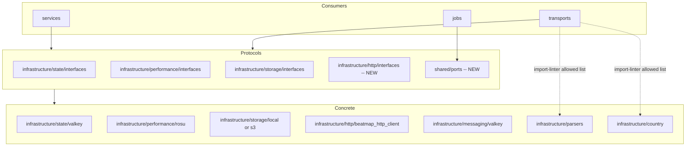

# Design Document: infrastructure-interface-relocation

## Overview

**Purpose**: infrastructure/ パッケージ内に散在する Protocol/interface の配置を整理し、AI エージェントと人間のメンテナがファイルパスから各 Protocol の層帰属を即座に判断できる構造にする。

**Users**: AI エージェント (Codex, Claude Code) および人間のメンテナが、コードナビゲーション時に依存グラフの意図を推測する負荷を削減する。

**Impact**: import path の変更のみ。ビジネスロジック、ランタイム動作、DI 構成の機能的変更はない。

### Goals

- Protocol/interface ファイルが具象実装と分離され、パスだけで判別可能
- import-linter 契約で Services/Transports から具象 infrastructure への依存を機械的に検出
- ドメイン横断 Protocol の配置場所に一貫したルールを確立

### Non-Goals

- ドメイン層 (domain/) の構造変更
- Services 間のクロスドメイン依存の解消
- パッケージ名変更 (osu_server → athena_server)
- Repository interface (repositories/interfaces/) の移動

## Boundary Commitments

### This Spec Owns

- infrastructure/ 内の Protocol/interface ファイルの配置ルール策定と実施
- 未分離モジュール (http, messaging) への interfaces サブモジュール新設
- leaderboard_rebuild_wake Protocol の shared/ports/ への移動
- import-linter 契約の追加 (具象 infrastructure 遮断)
- 消費側ファイルの import path 更新

### Out of Boundary

- domain/ 内部の構造変更
- repositories/interfaces/ の移動や再構成
- 新しい Protocol の設計 (既存 Protocol の移動のみ)
- composition/providers/ のビジネスロジック変更
- jobs/ の infrastructure/jobs/registry 依存 (taskiq フレームワーク固有で Protocol 化不適)

### Allowed Dependencies

- import-linter (既存ツール、pyproject.toml 設定のみ)
- basedpyright, ruff (既存静的解析)
- pytest (既存テスト)
- Dishka (既存 DI、provider 構成の import path 更新のみ)

### Revalidation Triggers

- infrastructure/ 内の新規 Protocol 追加時: 配置ルールに従っているか確認
- import-linter 契約の変更時: 既存契約との整合性確認
- shared/ports/ への新規ファイル追加時: ドメイン横断性の正当性確認

## Architecture

### Existing Architecture Analysis

現在の infrastructure/ は以下の3パターンが混在している:

| パターン | 例 | 状態 |
|---|---|---|
| interfaces サブモジュール分離済み | state/interfaces/, performance/interfaces.py, storage/interfaces.py | 良好 |
| Protocol が具象と同居 | messaging/local.py (LocalEventBus Protocol + 具象なし), security/hibp.py (HIBPClient Protocol) | 分離不要 (Protocol only) |
| 具象クラスのみ (Protocol なし) | http/beatmap_http_client.py, parsers/multipart_parser.py, country/codes.py | Protocol 化の検討対象 |

**重要な発見**: BeatmapHttpClient は httpx に直接依存する**具象クラス**であり、services/queries/beatmaps/mirror/ から参照されている。これは Protocol 化して interfaces に分離する必要がある。

### Architecture Pattern and Boundary Map

既存の水平レイヤードアーキテクチャをそのまま維持する。変更は Protocol の配置場所の統一のみ。



### Technology Stack

| Layer | Choice | Role | Notes |
|---|---|---|---|
| Static analysis | import-linter | 依存方向の機械的検証 | pyproject.toml に forbidden 契約を追加 |
| Type checking | basedpyright | Protocol 準拠の検証 | 既存設定のまま |
| Lint/Format | ruff | コードスタイル検証 | 既存設定のまま |

## File Structure Plan

### New Files

```
src/osu_server/
├── shared/
│   └── ports/                              # NEW: ドメイン横断 Protocol
│       ├── __init__.py
│       └── leaderboard_rebuild.py          # BeatmapLeaderboardRebuildWorkerWake + Noop
├── infrastructure/
│   └── http/
│       └── interfaces.py                   # NEW: BeatmapHttpClient Protocol + HttpFetchResult
```

### Modified Files

| File | Change |
|---|---|
| `shared/ports/__init__.py` | 新設。BeatmapLeaderboardRebuildWorkerWake を re-export |
| `shared/ports/leaderboard_rebuild.py` | 新設。services/commands/leaderboard_rebuild_wake.py の内容を移動 |
| `infrastructure/http/interfaces.py` | 新設。BeatmapHttpClient Protocol と HttpFetchResult dataclass を定義 |
| `infrastructure/http/beatmap_http_client.py` | 具象クラスが interfaces.py の Protocol を実装する形に変更 |
| `infrastructure/http/__init__.py` | interfaces.py からの re-export を追加 |
| `services/commands/leaderboard_rebuild_wake.py` | 削除。shared/ports/ に移動 |
| `services/commands/beatmaps/fetch.py` | import path を shared.ports に変更 |
| `services/commands/identity/change_role.py` | import path を shared.ports に変更 |
| `services/commands/scores/leaderboards/__init__.py` | import path を shared.ports に変更 |
| `services/queries/beatmaps/mirror/file_provider_service.py` | import path を infrastructure.http.interfaces に変更 |
| `services/queries/beatmaps/mirror/metadata_provider_service.py` | import path を infrastructure.http.interfaces に変更 |
| `composition/providers/beatmaps.py` | import path を shared.ports に変更 |
| `composition/providers/identity.py` | import path を shared.ports に変更 |
| `composition/providers/scores.py` | import path を shared.ports に変更 |
| `pyproject.toml` | import-linter 契約追加 (ユーザー承認後) |

### Unchanged (import path 変更不要)

以下の Protocol は既に interfaces サブモジュールに分離済みで、消費側の import path も正しいため変更しない:

- `infrastructure/state/interfaces/` (ChannelStateStore, PacketQueue, RateLimiter, PerformanceCompletionSignal)
- `infrastructure/performance/interfaces.py` (PerformanceCalculator)
- `infrastructure/storage/interfaces.py` (StagedBlobWrite, BlobStorageBackend)
- `infrastructure/security/hibp.py` (HIBPClient -- Protocol only ファイル、分離不要)
- `infrastructure/messaging/local.py` (LocalEventBus -- Protocol only ファイル、分離不要)
- `infrastructure/country/interfaces.py` (CountryResolver -- 既に分離済み)

## System Flows

本 spec はランタイムフローの変更を含まないため省略。

## Requirements Traceability

| Requirement | Summary | Components | Files |
|---|---|---|---|
| 1.1 | パスから層帰属を判断可能 | shared/ports/, infrastructure/*/interfaces | 全 Protocol ファイル |
| 1.2 | Protocol と具象の分離 | infrastructure/http/interfaces.py | http/interfaces.py, http/beatmap_http_client.py |
| 1.3 | Noop との同居許容 | shared/ports/leaderboard_rebuild.py | leaderboard_rebuild.py |
| 2.1 | Services が具象 infra を直接 import しない | import-linter forbidden 契約 | pyproject.toml |
| 2.2 | Protocol 経由の依存表現 | infrastructure/http/interfaces.py | services/queries/beatmaps/mirror/*.py |
| 2.3 | import-linter による検出 | import-linter forbidden 契約 | pyproject.toml |
| 3.1 | Transports が Protocol 経由優先 | 既存 state/interfaces/ | 変更なし (既にパス) |
| 3.2 | 具象ユーティリティの許可宣言 | import-linter allowed list | pyproject.toml |
| 3.3 | 許可リスト外の新規依存検出 | import-linter forbidden 契約 | pyproject.toml |
| 4.1 | ドメイン横断 Protocol の共有配置 | shared/ports/ | shared/ports/leaderboard_rebuild.py |
| 4.2 | 同一配置規則への追従 | shared/ports/ ディレクトリ規約 | CLAUDE.md / architecture.md 更新 |
| 4.3 | import-linter による保護 | import-linter forbidden 契約 | pyproject.toml |
| 5.1 | 新規契約の追加 | import-linter forbidden 契約 | pyproject.toml |
| 5.2 | 全規則遵守時に Exit Code 0 | import-linter | CI 検証 |
| 5.3 | 違反時に非ゼロ Exit Code | import-linter | CI 検証 |
| 5.4 | 既存 13 契約の維持 | import-linter | CI 検証 |
| 6.1 | pytest パス | テスト | 全テスト |
| 6.2 | 静的解析パス | basedpyright, ruff | 全ソース |
| 6.3 | Dishka 依存解決グラフの維持 | composition/providers/ | import path 更新のみ |
| 6.4 | ビジネスロジック変更なし | 全ファイル | import path のみ |

## Components and Interfaces

| Component | Layer | Intent | Req Coverage | Key Dependencies |
|---|---|---|---|---|
| shared/ports | shared | ドメイン横断 Protocol の配置先 | 4.1, 4.2, 4.3 | なし |
| infrastructure/http/interfaces | infrastructure | BeatmapHttpClient Protocol 定義 | 1.2, 2.1, 2.2 | domain/beatmaps (BeatmapSourceError) |
| import-linter 契約 | config | 具象 infra 遮断の機械的検証 | 2.3, 3.2, 3.3, 5.1-5.4 | pyproject.toml |

### shared Layer

#### shared/ports/leaderboard_rebuild.py

| Field | Detail |
|---|---|
| Intent | 複数ドメインから参照されるリーダーボード再構築の Protocol を共有層に配置 |
| Requirements | 4.1, 4.2, 4.3 |

**Responsibilities and Constraints**
- BeatmapLeaderboardRebuildWorkerWake Protocol の定義
- NoopBeatmapLeaderboardRebuildWorkerWake の提供 (テスト/DI 用デフォルト)
- services/commands/leaderboard_rebuild_wake.py からの 1:1 移動。ロジック変更なし

**Contracts**: Service [x]

```python
class BeatmapLeaderboardRebuildWorkerWake(Protocol):
    async def wake_user_rebuild(self, *, user_id: int, reason: str) -> None: ...
    async def wake_beatmapset_rebuild(self, *, beatmapset_id: int, reason: str) -> None: ...
```

### infrastructure Layer

#### infrastructure/http/interfaces.py

| Field | Detail |
|---|---|
| Intent | BeatmapHttpClient の Protocol 定義を具象 httpx 実装から分離 |
| Requirements | 1.2, 2.1, 2.2 |

**Responsibilities and Constraints**
- BeatmapHttpClient Protocol と HttpFetchResult dataclass を定義
- httpx への依存を含まない (Protocol 定義のみ)
- is_permanent_error 関数は具象側 (beatmap_http_client.py) に残す

**Contracts**: Service [x]

```python
@dataclass(slots=True)
class HttpFetchResult:
    content: bytes
    filename: str | None

class BeatmapHttpClient(Protocol):
    async def fetch_beatmap_file(self, beatmap_id: int) -> HttpFetchResult | BeatmapSourceError: ...
    async def fetch_beatmap_info(self, params: Mapping[str, str]) -> httpx.Response | BeatmapSourceError: ...
```

**Implementation Notes**
- fetch_beatmap_info の戻り値型に httpx.Response が含まれる場合、Protocol が httpx に依存する。design phase で確認が必要。実際の戻り値を確認し、ドメイン型への変換が適切か判断する

### Configuration

#### import-linter 契約追加

| Field | Detail |
|---|---|
| Intent | Services/Transports から infrastructure 具象実装への新規依存を機械的に検出 |
| Requirements | 2.3, 3.2, 3.3, 5.1-5.4 |

**追加する契約**:

```toml
[[tool.importlinter.contracts]]
name = "Services don't import concrete infrastructure backends"
type = "forbidden"
source_modules = ["osu_server.services"]
forbidden_modules = [
    "osu_server.infrastructure.http.beatmap_http_client",
    "osu_server.infrastructure.state.valkey",
    "osu_server.infrastructure.state.memory",
    "osu_server.infrastructure.storage.local",
    "osu_server.infrastructure.storage.s3",
    "osu_server.infrastructure.performance.rosu",
    "osu_server.infrastructure.messaging.valkey",
]

[[tool.importlinter.contracts]]
name = "Cross-domain protocols live in shared ports"
type = "forbidden"
source_modules = [
    "osu_server.services.commands.identity",
    "osu_server.services.commands.beatmaps",
    "osu_server.services.commands.scores",
]
forbidden_modules = [
    "osu_server.services.commands.leaderboard_rebuild_wake",
]
```

**Implementation Notes**
- 契約名の具象バックエンドモジュール一覧は、実際に存在するモジュールパスを確認して設定する
- pyproject.toml の編集はユーザー承認後に実施 (Configuration File Policy)
- Transports の具象ユーティリティ (parsers, country/codes) は既存の許可構造で管理し、新規 forbidden 契約の対象外とする

## Error Handling

本 spec はランタイムの error flow を変更しない。変更に伴うエラーは全て静的解析 (basedpyright, import-linter) で compile-time に検出される。

## Testing Strategy

### Unit Tests
- import-linter が新規契約を含めて全パスすること (`uv run lint-imports`)
- basedpyright が全ファイルでパスすること
- ruff check / ruff format --check が全パスすること

### Integration Tests
- 既存テスト (pytest tests/) が import path 変更後もすべてパスすること
- Dishka provider 構成が変更前と同一のグラフを構築すること (既存テストで検証)

### E2E Tests
- `./scripts/ci.sh quality` が Exit Code 0 を返すこと
- `./scripts/ci.sh test` が Exit Code 0 を返すこと
