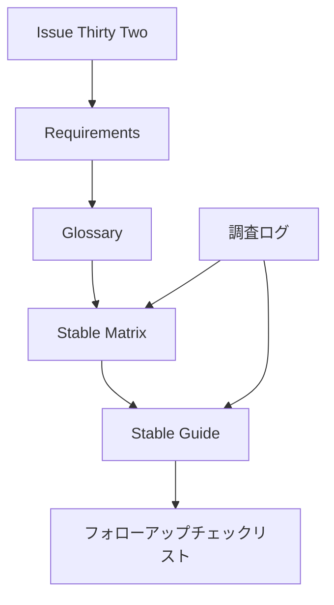
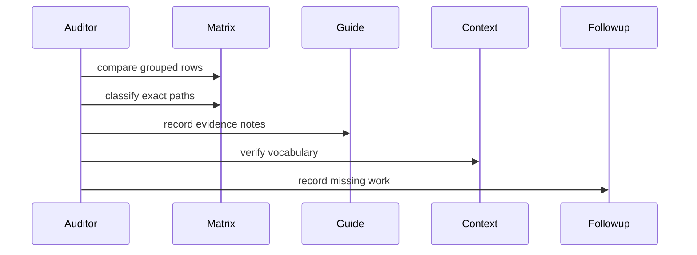

# 設計書

## 概要

Legacy Web Endpoint Inventory Audit は、現行 osu!stable client を主対象とする legacy web-family endpoint の監査結果を既存 docs に反映する。成果は runtime route の追加ではなく、`docs/stable-compatibility-matrix.md` と `docs/stable-compatibility-guide.md` を、次の実装・検証 task が推測なしで読める状態にすることである。

この設計は matrix を classification と exact path traceability の source of truth、guide を endpoint family evidence detail の置き場として扱う。`CONTEXT.md` の legacy web classification vocabulary を採用し、`candidate` を監査後の最終分類に残さない。

### 目標

- Legacy web-family endpoints を固定語彙で分類する。
- Endpoint family と exact path の両方から evidence status を追跡できるようにする。
- Matrix と guide に監査結果、未解決 evidence gaps、follow-up checklist を反映する。

### 対象外

- Route implementation、handler、mapper、formatter、repository の追加。
- Golden fixture file の作成。
- Real-client traffic capture の実施。
- Release / static / media / download route inventory の本体監査。

## 境界コミットメント

### この spec が扱うこと

- Legacy `/web/*.php` endpoint と `/rating/ingame-rate*.php` の audit classification。
- Classification vocabulary の docs 適用。
- Endpoint family evidence note の required fields。
- Matrix の grouped row と exact path row の traceability。
- Guide の endpoint family evidence gap と follow-up checklist。
- Missing implementation、missing fixture、missing traffic evidence の follow-up recording。

### 境界外

- Stable web legacy runtime routes の追加や変更。
- 既存 `src/osu_server/transports/stable/web_legacy/*` behavior の変更。
- Fixture extraction や captured traffic artifact の作成。
- Static/media/download/update/release route policy の本体分類。
- Beatmap submission workflow の実装。これは P0 core login/play 後の deferred scope とする。

### 参照してよい依存

- `docs/stable-compatibility-matrix.md` の Source-Of-Truth Policy、Stable HTTP Endpoint Coverage、Reference Route Inventory。
- `docs/stable-compatibility-guide.md` の Legacy Web Endpoints と endpoint family sections。
- `CONTEXT.md` の `Legacy Web Endpoint Inventory Classification` glossary。
- GitHub Issue #32 の acceptance criteria。
- `src/osu_server/composition/application.py` の既存 runtime route list。implementation status evidence としてのみ参照する。

### 再検証トリガー

- 現行 osu!stable client traffic で新しい legacy web route 呼び出しが確認された。
- Reference implementation audit で old getscores / submit alias の response variant が特定された。
- `/web/osu-getseasonal.php` 以外の title/menu/seasonal routes の current client traffic が確認された。
- Beatmap submission workflow が P0 後の active roadmap item になった。
- Matrix の status labels または reference source policy が変更された。

## アーキテクチャ

### 既存アーキテクチャ分析

Athena の current runtime route registration は `src/osu_server/composition/application.py` に集約されている。現時点で `osu.$DOMAIN` に登録されている legacy web routes は registration、`/web/bancho_connect.php`、`/web/osu-osz2-getscores.php`、`/web/osu-submit-modular-selector.php` に限られる。

Stable compatibility docs は runtime implementation と reference inventory を分けている。`docs/stable-compatibility-matrix.md` は canonical inventory と status tracking を担い、`docs/stable-compatibility-guide.md` は endpoint family の request / response detail を担う。この spec はこの既存分担を維持する。

### アーキテクチャパターンと境界マップ

採用パターン: documentation inventory split。Matrix は classification と exact path traceability を扱い、guide は detailed evidence notes を扱う。Research log は design rationale を記録する。



主要判断:

- `candidate` は監査前の source status としてのみ扱い、最終 audit classification には使わない。
- `required` は real behavior が必要な状態を示し、`compatibility no-op` は route / response contract が必要だが dynamic behavior は不要な状態を示す。
- 古い stable client aliases は alias-specific variants が判明するまで `needs reference evidence` に残す。

### 技術スタック

| 層 | 選択 / version | この feature での役割 | 備考 |
|-------|------------------|-----------------|-------|
| ドキュメント | Markdown | Matrix、guide、spec、research の更新 | 既存 repository docs format |
| Runtime | 既存 Starlette app | 実装済み route status の evidence source | Runtime changes なし |
| 検証 | Markdown review と任意の docs grep | Requirement coverage と traceability を確認 | Docs tooling を追加しない限り pytest は不要 |

新しい依存は導入しない。

## ファイル構成計画

### ディレクトリ構成

```text
docs/
├── stable-compatibility-matrix.md
└── stable-compatibility-guide.md

.kiro/specs/legacy-web-endpoint-inventory-audit/
├── requirements.md
├── research.md
└── design.md

CONTEXT.md
```

### 変更対象ファイル

- `docs/stable-compatibility-matrix.md`: Stable HTTP Endpoint Coverage に audit classification を追加し、Reference Route Inventory に exact path traceability を反映する。
- `docs/stable-compatibility-guide.md`: endpoint family evidence notes、未解決 evidence gaps、follow-up checklist entries を追加または更新する。
- `CONTEXT.md`: classification glossary は既に存在する。後続 review で vocabulary drift が見つかった場合のみ変更する。
- `.kiro/specs/legacy-web-endpoint-inventory-audit/research.md`: discovery findings、design decisions、risks を記録する。
- `.kiro/specs/legacy-web-endpoint-inventory-audit/design.md`: audit design と task boundaries を定義する。

### コンポーネントとファイル対応

| コンポーネント | 主なファイル |
|-----------|---------------|
| Audit Scope Index | `docs/stable-compatibility-matrix.md`, `docs/stable-compatibility-guide.md` |
| Classification Contract | `CONTEXT.md`, `docs/stable-compatibility-matrix.md` |
| Evidence Note Template | `docs/stable-compatibility-guide.md` |
| Evidence Source Register | `docs/stable-compatibility-matrix.md`, `docs/stable-compatibility-guide.md` |
| Target Client Policy | `CONTEXT.md`, `docs/stable-compatibility-guide.md` |
| Legacy Alias Tracker | `docs/stable-compatibility-matrix.md`, `docs/stable-compatibility-guide.md` |
| Deferred Scope Tracker | `docs/stable-compatibility-matrix.md`, `docs/stable-compatibility-guide.md` |
| Out-of-scope Tracker | `docs/stable-compatibility-matrix.md` |
| Compatibility No-op Tracker | `docs/stable-compatibility-matrix.md`, `docs/stable-compatibility-guide.md` |
| Matrix Classification Surface | `docs/stable-compatibility-matrix.md` |
| Exact Path Traceability Surface | `docs/stable-compatibility-matrix.md` |
| Guide Evidence Surface | `docs/stable-compatibility-guide.md` |
| フォローアップチェックリスト | `docs/stable-compatibility-guide.md`, `docs/stable-compatibility-matrix.md` |
| Audit-only Boundary Guard | `.kiro/specs/legacy-web-endpoint-inventory-audit/design.md`, `.kiro/specs/legacy-web-endpoint-inventory-audit/requirements.md` |

### 明示的に変更しないファイル

- `src/osu_server/composition/application.py`: current implemented route status の read-only evidence として扱う。
- `src/osu_server/transports/stable/web_legacy/*`: この spec では handler、parser、mapper、formatter を変更しない。
- `tests/**`: この spec では runtime test や fixture を作成しない。

## システムフロー

### 監査ドキュメントフロー



フロー判断:

- すべての endpoint family に visible audit state を持たせるため、matrix update を guide detail より先に扱う。
- classification が request / response evidence や unresolved gaps に依存する場合、guide detail を必須とする。
- フォローアップ項目は missing implementation、fixtures、traffic evidence を記録するだけで、その work を完了扱いしない。

## 要件トレーサビリティ

| 要件 | 要約 | コンポーネント | インターフェース | フロー |
|-------------|---------|------------|------------|-------|
| 1.1 | `/web/*.php` endpoint coverage | Audit Scope Index | Matrix grouped rows | Audit Documentation Flow |
| 1.2 | Rating aliases included | Audit Scope Index | Matrix exact path rows | Audit Documentation Flow |
| 1.3 | Matrix sections compared | Matrix Classification Surface | Matrix grouped and exact path rows | Audit Documentation Flow |
| 1.4 | Adjacent route overlap recorded only as context | Audit Scope Index | Guide notes | Audit Documentation Flow |
| 2.1 | Fixed classification vocabulary | Classification Contract | Glossary and matrix classification field | Audit Documentation Flow |
| 2.2 | `candidate` not final | Classification Contract | Matrix classification field | Audit Documentation Flow |
| 2.3 | Real behavior maps to `required` | Classification Contract | Matrix classification field | Audit Documentation Flow |
| 2.4 | static route contract は `compatibility no-op` に対応する | Classification Contract | Matrix classification field | Audit Documentation Flow |
| 2.5 | missing evidence は `needs reference evidence` に対応する | Classification Contract | Matrix classification field | Audit Documentation Flow |
| 3.1 | Auth method evidence | Evidence Note Template | Guide evidence note | Audit Documentation Flow |
| 3.2 | Required params evidence | Evidence Note Template | Guide evidence note | Audit Documentation Flow |
| 3.3 | Success response evidence | Evidence Note Template | Guide evidence note | Audit Documentation Flow |
| 3.4 | Auth failure evidence | Evidence Note Template | Guide evidence note | Audit Documentation Flow |
| 3.5 | Not-found evidence | Evidence Note Template | Guide evidence note | Audit Documentation Flow |
| 3.6 | Malformed request evidence | Evidence Note Template | Guide evidence note | Audit Documentation Flow |
| 4.1 | Classification evidence source | Evidence Source Register | Matrix or guide evidence source note | Audit Documentation Flow |
| 4.2 | `needs reference evidence`解除根拠 | Evidence Source Register | Guide evidence source note | Audit Documentation Flow |
| 4.3 | Unknown response cannot be no-op | Classification Contract | Matrix classification field | Audit Documentation Flow |
| 4.4 | Reference-only route cannot be P0 required | Classification Contract | Matrix classification field | Audit Documentation Flow |
| 5.1 | Current client is primary target | Target Client Policy | Guide policy note | Audit Documentation Flow |
| 5.2 | Old getscores aliases require evidence | Legacy Alias Tracker | Exact path rows | Audit Documentation Flow |
| 5.3 | Old submit aliases require evidence | Legacy Alias Tracker | Exact path rows | Audit Documentation Flow |
| 5.4 | Best effort support note | Legacy Alias Tracker | Matrix and guide notes | Audit Documentation Flow |
| 6.1 | Beatmap submission is deferred | Deferred Scope Tracker | Matrix classification field | Audit Documentation Flow |
| 6.2 | Coins can be out of scope | Out-of-scope Tracker | Matrix classification field | Audit Documentation Flow |
| 6.3 | Benchmark can be out of scope | Out-of-scope Tracker | Matrix classification field | Audit Documentation Flow |
| 6.4 | Deferred and out-of-scope reasons | Deferred Scope Tracker, Out-of-scope Tracker | Matrix and guide notes | Audit Documentation Flow |
| 7.1 | Seasonal current client evidence | Compatibility No-op Tracker | Guide evidence note | Audit Documentation Flow |
| 7.2 | Seasonal initial no-op behavior | Compatibility No-op Tracker | Matrix and guide notes | Audit Documentation Flow |
| 7.3 | Title/menu needs evidence | Compatibility No-op Tracker | Matrix classification field | Audit Documentation Flow |
| 7.4 | Social/status confirmed no-op only with shape | Compatibility No-op Tracker | Guide evidence note | Audit Documentation Flow |
| 8.1 | Family-level classification | Matrix Classification Surface | Grouped rows | Audit Documentation Flow |
| 8.2 | Exact path traceability | Exact Path Traceability Surface | Reference Route Inventory | Audit Documentation Flow |
| 8.3 | Per-path variants preserved | Exact Path Traceability Surface | Exact path notes | Audit Documentation Flow |
| 8.4 | Grouped-to-exact mapping | Exact Path Traceability Surface | Matrix row cross-reference | Audit Documentation Flow |
| 9.1 | Stable HTTP Endpoint Coverage updated | Matrix Classification Surface | Matrix grouped rows | Audit Documentation Flow |
| 9.2 | Reference Route Inventory updated | Exact Path Traceability Surface | Matrix exact path rows | Audit Documentation Flow |
| 9.3 | Guide evidence gaps recorded | Guide Evidence Surface | Guide sections | Audit Documentation Flow |
| 9.4 | Matrix/guide contradictions marked | Evidence Source Register | Unresolved evidence gap note | Audit Documentation Flow |
| 10.1 | route implementation completion を要求しない | 監査専用境界ガード | ファイル構成計画 | 監査ドキュメントフロー |
| 10.2 | fixture creation を要求しない | 監査専用境界ガード | ファイル構成計画 | 監査ドキュメントフロー |
| 10.3 | traffic capture execution を要求しない | 監査専用境界ガード | ファイル構成計画 | 監査ドキュメントフロー |
| 10.4 | missing implementation は follow-up として扱う | フォローアップチェックリスト | Guide checklist | Audit Documentation Flow |
| 10.5 | missing evidence は follow-up として扱う | フォローアップチェックリスト | Guide checklist | Audit Documentation Flow |

## コンポーネントとインターフェース

| コンポーネント | ドメイン / 層 | 意図 | 要件カバレッジ | 主な依存 | 契約 |
|-----------|--------------|--------|--------------|------------------|-----------|
| Audit Scope Index | Documentation | この audit に属する endpoint rows を定義する | 1.1, 1.2, 1.3, 1.4 | Matrix P0, Guide P1 | State |
| Classification Contract | Documentation | 5つの final audit classifications を適用する | 2.1, 2.2, 2.3, 2.4, 2.5, 4.3, 4.4 | CONTEXT P0, Matrix P0 | State |
| Evidence Note Template | Documentation | request / response evidence fields を標準化する | 3.1, 3.2, 3.3, 3.4, 3.5, 3.6 | Guide P0 | State |
| Evidence Source Register | Documentation | evidence sources と unresolved gaps を記録する | 4.1, 4.2, 9.4 | Matrix P1, Guide P0 | State |
| Target Client Policy | Documentation | current stable client と older alias support を分離する | 5.1 | CONTEXT P0, Guide P1 | State |
| Legacy Alias Tracker | Documentation | old getscores / submit aliases を追跡する | 5.2, 5.3, 5.4 | Matrix P0, Guide P1 | State |
| Deferred Scope Tracker | Documentation | future work を P0 scope から分離する | 6.1, 6.4 | Matrix P0, Roadmap P1 | State |
| Out-of-scope Tracker | Documentation | product-scope exclusions を記録する | 6.2, 6.3, 6.4 | Matrix P0 | State |
| Compatibility No-op Tracker | Documentation | confirmed static / sentinel compatibility routes を追跡する | 7.1, 7.2, 7.3, 7.4 | Matrix P0, Guide P0 | State |
| Matrix Classification Surface | Documentation | grouped family classification を保持する | 8.1, 9.1 | Matrix P0 | State |
| Exact Path Traceability Surface | Documentation | per-route traceability と variants を保持する | 8.2, 8.3, 8.4, 9.2 | Matrix P0 | State |
| Guide Evidence Surface | Documentation | endpoint family details と gaps を保持する | 9.3 | Guide P0 | State |
| フォローアップチェックリスト | Documentation | missing implementation、fixtures、traffic evidence を記録する | 10.4, 10.5 | Guide P0, Matrix P1 | State |
| 監査専用境界ガード | Documentation | runtime implementation がこの spec に入らないようにする | 10.1, 10.2, 10.3 | 要件 P0, ファイル構成計画 P0 | State |

### ドキュメント層

#### 監査スコープ索引

| 項目 | 詳細 |
|-------|--------|
| 意図 | Issue #32 が扱う endpoint rows を定義する |
| 要件 | 1.1, 1.2, 1.3, 1.4 |

**責務と制約**
- legacy `/web/*.php` rows と rating aliases を含める。
- release、static、media、download、update route body audit は除外する。
- route が legacy web family の近くに現れる場合は adjacent context として残す。

**依存関係**
- Inbound: Requirements - scope definition (P0)
- Outbound: `docs/stable-compatibility-matrix.md` - grouped and exact route rows (P0)
- Outbound: `docs/stable-compatibility-guide.md` - family context (P1)

**契約**: Service [ ] / API [ ] / Event [ ] / Batch [ ] / State [x]

##### 状態管理

- 状態モデル: endpoint family、exact path、inclusion status、adjacent note。
- 永続化と一貫性: Markdown docs を durable state とする。
- 並行更新方針: family ごとの matrix edits は同時に1 task が owner になる。

**実装メモ**
- 統合: Stable HTTP Endpoint Coverage から開始し、Reference Route Inventory と照合する。
- 検証: すべての in-scope grouped row が classification または evidence gap を持つ。
- リスク: overlap rows が unrelated release/static scope を audit に引き込む可能性がある。

#### 分類契約

| 項目 | 詳細 |
|-------|--------|
| 意図 | final audit classification vocabulary を適用する |
| 要件 | 2.1, 2.2, 2.3, 2.4, 2.5, 4.3, 4.4 |

**責務と制約**
- `required`、`compatibility no-op`、`deferred`、`out of scope`、`needs reference evidence` だけを使う。
- `candidate` は pre-audit input status としてのみ扱う。
- `compatibility no-op` にする前に confirmed response shape を要求する。
- route が reference-only の場合、P0 `required` にする前に current client evidence を要求する。

**依存関係**
- Inbound: `CONTEXT.md` glossary - vocabulary source (P0)
- Outbound: `docs/stable-compatibility-matrix.md` - classification storage (P0)

**契約**: Service [ ] / API [ ] / Event [ ] / Batch [ ] / State [x]

##### 状態管理

- 状態モデル: final classification、reason、evidence source。
- 永続化と一貫性: Matrix row に final `Candidate` を残さない。
- 並行更新方針: classification changes と reason text を一緒に review する。

**実装メモ**
- 統合: glossary terms を正確に使う。
- 検証: 完了後に in-scope audited rows の残存 `Candidate` を grep する。
- リスク: `required` と `compatibility no-op` はどちらも client-visible なので、reason text で差を明確にする。

#### Evidence note template

| 項目 | 詳細 |
|-------|--------|
| 意図 | endpoint family evidence notes を標準化する |
| 要件 | 3.1, 3.2, 3.3, 3.4, 3.5, 3.6 |

**責務と制約**
- auth method、required request params、success response、auth failure response、domain/data-not-found response、malformed request response を記録する。
- 各 field は confirmed、unconfirmed、out of scope のいずれかで示す。
- success-only evidence だけで implementation-ready と扱わない。

**依存関係**
- Outbound: `docs/stable-compatibility-guide.md` - family evidence sections (P0)

**契約**: Service [ ] / API [ ] / Event [ ] / Batch [ ] / State [x]

##### 状態管理

- 状態モデル: 6つの required fields を持つ endpoint family evidence note。
- 永続化と一貫性: Guide section を detailed evidence の authoritative source とする。
- 並行更新方針: family evidence notes は related matrix classifications と一緒に更新する。

**実装メモ**
- 統合: family が多くの exact paths を持つ場合は compact tables を追加する。
- 検証: 更新したすべての family に required evidence field が現れる。
- リスク: 長い response examples は guide を肥大化させるため、可能なら要約し fixtures または follow-up notes へリンクする。

#### Matrix と Guide の surface

| 項目 | 詳細 |
|-------|--------|
| 意図 | 監査結果を既存 compatibility docs に保存する |
| 要件 | 4.1, 4.2, 5.1, 5.2, 5.3, 5.4, 6.1, 6.2, 6.3, 6.4, 7.1, 7.2, 7.3, 7.4, 8.1, 8.2, 8.3, 8.4, 9.1, 9.2, 9.3, 9.4, 10.4, 10.5 |

**責務と制約**
- Matrix grouped rows は family classification と concise reason を要約する。
- Reference Route Inventory exact path rows は variant-specific status を保持する。
- Guide は detailed evidence gaps と follow-up checklists を記録する。
- Missing implementation、missing fixture、missing traffic evidence は別々の outcome として残す。

**依存関係**
- Inbound: Classification Contract - allowed classification states (P0)
- Inbound: Evidence Note Template - required evidence shape (P0)
- Outbound: Future implementation issues - checklist を使うが、この spec では扱わない (P2)

**契約**: Service [ ] / API [ ] / Event [ ] / Batch [ ] / State [x]

##### 状態管理

- 状態モデル: grouped family classification、exact path classification、evidence source、unresolved gap、follow-up action。
- 永続化と一貫性: Matrix と guide は同じ family names と route paths を相互参照する。
- 並行更新方針: 同じ endpoint family への parallel edits を避ける。

**実装メモ**
- 統合: matrix は簡潔に保ち、guide は詳細を持たせる。
- 検証: route family と exact path で requirement traceability を確認できる。
- リスク: cross-doc drift。両 docs に明示的な family names と paths を置く。

#### 監査専用境界ガード

| 項目 | 詳細 |
|-------|--------|
| 意図 | この spec を docs audit に留める |
| 要件 | 10.1, 10.2, 10.3 |

**責務と制約**
- runtime source files を modified file plan に入れない。
- fixture files を作成しない。
- real-client traffic capture を completion evidence として実行しない。

**依存関係**
- Inbound: Requirements boundary context - audit-only scope (P0)
- Outbound: Task generation - この spec 内の implementation tasks を防ぐ (P0)

**契約**: Service [ ] / API [ ] / Event [ ] / Batch [ ] / State [x]

##### 状態管理

- 状態モデル: file structure plan と follow-up checklist。
- 永続化と一貫性: runtime changes は follow-up issues に属する。
- 並行更新方針: implementation が必要になった場合は新しい spec または issue に分離する。

**実装メモ**
- 統合: docs-only tasks を使う。
- 検証: この spec の `git diff --name-only` に `src/` や `tests/` が含まれないことを確認する。
- リスク: compatibility no-op endpoints は route stubs を誘発しやすいので、follow-up implementation work として残す。

## データモデル

### Documentation data model

| 項目 | 意味 | 場所 |
|-------|---------|----------|
| Endpoint family | getscores、submit、ratings、seasonal などの grouped legacy web behavior | Matrix grouped rows と guide headings |
| Exact path | 具体的な method / path route entry | Reference Route Inventory |
| Classification | 5つの final audit classes のいずれか | Matrix grouped row または exact row |
| Evidence source | Traffic、protocol docs、reference implementation、Athena fixture/test、または unresolved | Matrix note または guide evidence note |
| Evidence fields | auth、params、success、auth failure、not found、malformed request | Guide evidence note |
| フォローアップ項目 | Missing implementation、fixture、traffic evidence | Guide checklist または matrix note |

Database、API schema、runtime state model は導入しない。

## 検証戦略

- Documentation review で、すべての in-scope route が final classification または `needs reference evidence` を持つことを確認する。
- Matrix review で、audited rows が final classification として `Candidate` を保持していないことを確認する。
- Guide review で、更新した各 endpoint family に auth method、required params、success response、auth failure response、domain/data-not-found response、malformed request response が含まれることを確認する。
- Diff review で、この spec が `src/` と `tests/` を変更していないことを確認する。
- フォローアップチェックリスト review で、missing implementation、fixture、traffic evidence が audit によって complete 扱いされていないことを確認する。

## 未解決事項とリスク

- Old getscores と submit aliases は `needs reference evidence` を解除する前に route-specific fixtures が必要になる可能性がある。
- `/web/osu-getseasonal.php` は current client traffic evidence を持つが、exact minimal JSON shape は implementation 前に fixture-backed evidence として残す必要がある。
- Title/menu endpoints は current client traffic が後で確認された場合、`needs reference evidence` から `compatibility no-op` へ移動できる可能性がある。
- Beatmap submission は意図的に deferred とするが、future support では implementation 前にこの audit を再確認する。
