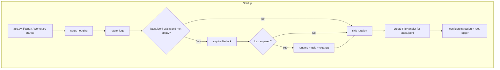
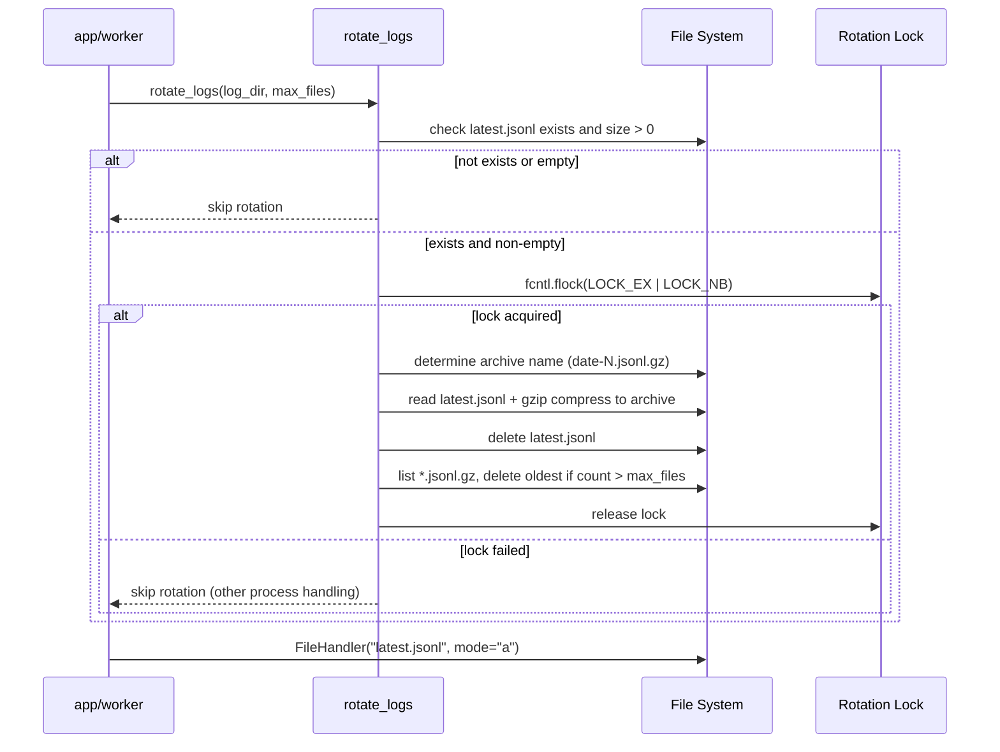
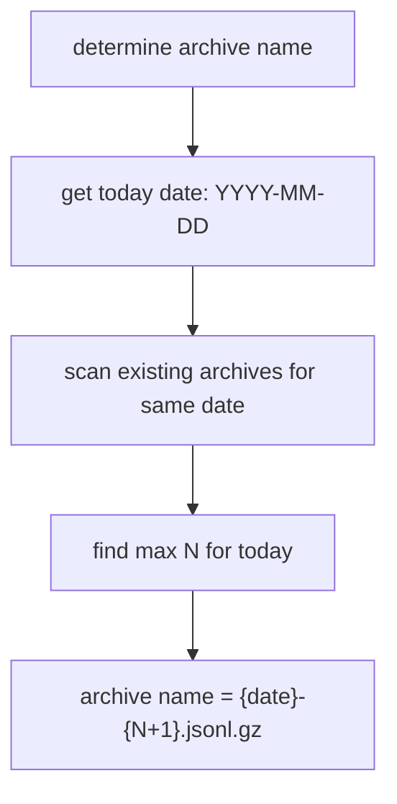

# Technical Design: log-rotation

## Overview
**Purpose**: athena サーバーのログファイルシステムに Minecraft 方式の起動時ローテーションを導入する。`latest.jsonl` を常に現在セッションのログとして保持し、過去ログを日付ベースの gzip 圧縮アーカイブとして管理する。

**Users**: サーバー運用者・開発者がトラブルシュートや運用監視のためにログを参照する。

**Impact**: 既存の `setup_logging` 関数にローテーション前処理を追加し、config フィールドを再設計する。`log_json_enabled` / `log_json_path` を廃止し、`log_dir` / `log_max_files` に置き換える。

### Goals
- 起動のたびにログファイルが自動的にアーカイブされ、latest.jsonl が常に現在セッションのみを含む
- 過去ログが gzip 圧縮されてストレージ効率が向上する
- 保持件数制御でログディレクトリの肥大化を防ぐ
- app / worker 両プロセスが同一ファイルに統合ログを出力する

### Non-Goals
- コンソール (stderr) 出力のローテーション
- 稼働中 (サイズ/時間ベース) のローテーション
- ログの集約・転送 (外部サービス連携)
- ログの検索・クエリ機能

## Boundary Commitments

### This Spec Owns
- `rotate_logs()` 関数: 起動時のアーカイブ・圧縮・クリーンアップ
- config フィールドの再設計: `log_dir`, `log_max_files` の追加、`log_json_enabled` / `log_json_path` の廃止
- `setup_logging()` の改修: ローテーション呼び出し統合、FileHandler のパス変更
- worker プロセスへの `setup_logging()` 呼び出し追加

### Out of Boundary
- structlog のプロセッサチェーンやフォーマッタの変更 (既存のまま維持)
- uvicorn ハンドラオーバーライドのロジック変更
- `mask_sensitive_fields` プロセッサの変更
- console handler の変更

### Allowed Dependencies
- Python stdlib: `gzip`, `fcntl`, `pathlib`, `logging`, `warnings`, `datetime`
- structlog (既存依存、変更なし)
- `osu_server.config.AppConfig` (TYPE_CHECKING のみ、既存パターン維持)

### Revalidation Triggers
- `log_dir` / `log_max_files` のデフォルト値変更
- アーカイブファイル命名規則の変更
- ローテーション呼び出しタイミングの変更 (起動時 -> 稼働中)

## Architecture

### Existing Architecture Analysis
現在の構成:
- `setup_logging(config)` が console handler + optional JSON file handler を作成
- JSON file handler は `config.log_json_enabled=True` の場合のみ有効
- `FileHandler(mode="a")` で `logs/athena.jsonl` に追記
- app プロセスのみ `setup_logging` を呼び出し、worker は未設定
- エラー時は `warnings.warn` で警告して続行

変更後の構成:
- `rotate_logs(log_dir, max_files)` を `setup_logging` の冒頭で実行
- JSON file handler は常に有効 (`log_json_enabled` 廃止)
- `FileHandler(mode="a")` で `{log_dir}/latest.jsonl` に書き込み
- app / worker 両プロセスが `setup_logging` を呼び出し
- ローテーション時はファイルロックで排他制御

### Architecture Pattern & Boundary Map



### Technology Stack

| Layer | Choice / Version | Role in Feature | Notes |
|-------|------------------|-----------------|-------|
| Backend | Python 3.14+ stdlib | gzip 圧縮、ファイルロック (fcntl)、パス操作 | 新規外部依存なし |
| Infrastructure | structlog (既存) | ProcessorFormatter / JSONRenderer | 変更なし |
| Infrastructure | logging stdlib (既存) | FileHandler | パス変更のみ |

## File Structure Plan

### Modified Files
- `src/osu_server/infrastructure/logging.py` -- `rotate_logs()` 関数追加、`setup_logging()` 改修 (ローテーション呼び出し統合、FileHandler パス変更、常時有効化)
- `src/osu_server/config.py` -- `log_json_enabled` / `log_json_path` を `log_dir` / `log_max_files` に置き換え
- `src/osu_server/worker.py` -- `setup_logging(config)` 呼び出し追加

### New Files
- `tests/unit/test_log_rotation.py` -- `rotate_logs()` のユニットテスト

## System Flows

### 起動時ローテーションフロー



### アーカイブ命名フロー



## Requirements Traceability

| Requirement | Summary | Components | Interfaces | Flows |
|-------------|---------|------------|------------|-------|
| 1.1 | 起動時に既存 latest.jsonl をアーカイブ・gzip 圧縮 | rotate_logs | rotate_logs(log_dir, max_files) | 起動時ローテーションフロー |
| 1.2 | ローテーション後に新しい latest.jsonl で書き込み開始 | setup_logging | FileHandler 作成 | 起動時ローテーションフロー |
| 1.3 | latest.jsonl が不在/空ならローテーションスキップ | rotate_logs | 存在・サイズチェック | 起動時ローテーションフロー |
| 2.1 | アーカイブを {date}-{N}.jsonl.gz で命名 | rotate_logs | _determine_archive_name | アーカイブ命名フロー |
| 2.2 | アーカイブを同ディレクトリに配置 | rotate_logs | Path 操作 | -- |
| 2.3 | 同日複数再起動で連番インクリメント | rotate_logs | _determine_archive_name | アーカイブ命名フロー |
| 3.1 | 保持件数超過で古いアーカイブ削除 | rotate_logs | _cleanup_old_archives | 起動時ローテーションフロー |
| 3.2 | デフォルト保持件数 30 件 | AppConfig | log_max_files=30 | -- |
| 3.3 | 保持件数を設定で変更可能 | AppConfig | log_max_files | -- |
| 4.1 | JSONL ファイルログ常時有効 | setup_logging | FileHandler 常時作成 | -- |
| 4.2 | ログディレクトリをデフォルト logs で設定変更可能 | AppConfig | log_dir="logs" | -- |
| 5.1 | 複数プロセスから同じ latest.jsonl への同時書き込み | setup_logging | FileHandler(mode="a") | -- |
| 5.2 | ファイルロックで排他ローテーション | rotate_logs | fcntl.flock(LOCK_EX, LOCK_NB) | 起動時ローテーションフロー |
| 5.3 | ロック取得失敗時はスキップして書き込み開始 | rotate_logs | BlockingIOError catch | 起動時ローテーションフロー |
| 6.1 | ディレクトリ作成失敗時は警告して続行 | setup_logging | warnings.warn | -- |
| 6.2 | アーカイブ失敗時は警告してスキップ | rotate_logs | OSError catch + warnings.warn | -- |
| 6.3 | 削除失敗時は警告して続行 | rotate_logs | OSError catch + warnings.warn | -- |
| 7.1 | log_dir 設定提供 | AppConfig | log_dir: str = "logs" | -- |
| 7.2 | log_max_files 設定提供 | AppConfig | log_max_files: int = 30 | -- |
| 7.3 | 旧設定フィールドの廃止 | AppConfig | log_json_enabled / log_json_path 削除 | -- |

## Components and Interfaces

| Component | Domain/Layer | Intent | Req Coverage | Key Dependencies | Contracts |
|-----------|--------------|--------|--------------|------------------|-----------|
| rotate_logs | Infrastructure / Logging | 起動時にログファイルのアーカイブ・圧縮・クリーンアップを実行 | 1.1-1.3, 2.1-2.3, 3.1, 5.2-5.3, 6.2-6.3 | pathlib, gzip, fcntl (P0) | Service |
| setup_logging (改修) | Infrastructure / Logging | structlog + stdlib の初期化、ローテーション統合 | 1.2, 4.1, 5.1, 6.1 | rotate_logs (P0), structlog (P0) | Service |
| AppConfig (改修) | Config | ログ関連設定フィールドの提供 | 3.2-3.3, 4.2, 7.1-7.3 | pydantic-settings (P0) | State |

### Infrastructure / Logging

#### rotate_logs

| Field | Detail |
|-------|--------|
| Intent | 起動時にログファイルのアーカイブ・圧縮・クリーンアップを実行する |
| Requirements | 1.1, 1.2, 1.3, 2.1, 2.2, 2.3, 3.1, 5.2, 5.3, 6.2, 6.3 |

**Responsibilities & Constraints**
- `latest.jsonl` の存在・サイズチェック (不在/空ならスキップ)
- ファイルロック (`fcntl.flock`) による排他ローテーション
- 日付ベースのアーカイブ命名 (`{YYYY-MM-DD}-{N}.jsonl.gz`)
- gzip 圧縮によるアーカイブ作成
- 古いアーカイブの削除 (最大保持件数超過時)
- 全てのファイル操作エラーを `warnings.warn` で警告して続行

**Dependencies**
- External: `pathlib.Path` -- ファイルパス操作 (P0)
- External: `gzip` -- 圧縮 (P0)
- External: `fcntl` -- ファイルロック (P0)
- External: `datetime` -- 日付取得 (P0)

**Contracts**: Service [x]

##### Service Interface
```python
def rotate_logs(log_dir: Path, max_files: int) -> None:
    """起動時にログファイルをアーカイブし、古いアーカイブを削除する。

    1. latest.jsonl が存在し非空なら、ファイルロック取得を試みる
    2. ロック取得成功: latest.jsonl を {date}-{N}.jsonl.gz にアーカイブ
    3. アーカイブ数が max_files を超えたら古い順に削除
    4. ロック取得失敗 or ファイル不在/空: スキップ
    5. 全ての OSError は warnings.warn で警告して続行
    """
    ...
```
- Preconditions: `log_dir` はディレクトリパス、`max_files >= 0`
- Postconditions: `latest.jsonl` が存在しないか空の状態になる (成功時)。アーカイブ数 <= `max_files`
- Invariants: 他プロセスのログ書き込みをブロックしない

**Implementation Notes**
- ローテーションの詳細ステップ:
  1. `log_dir / "latest.jsonl"` の存在・サイズチェック
  2. `log_dir / ".rotation.lock"` でファイルロック取得 (`LOCK_EX | LOCK_NB`)
  3. アーカイブ名決定: 既存の `{today}-*.jsonl.gz` をスキャンして最大 N を取得、N+1 で命名
  4. `latest.jsonl` を読み取り、`gzip.open(archive_path, "wb")` で圧縮書き込み
  5. `latest.jsonl` を削除 (`Path.unlink()`)
  6. `*.jsonl.gz` を mtime でソートし、`max_files` を超える分を古い順に削除
  7. ロック解放
- Risks: 大きな latest.jsonl (数百MB) の gzip 圧縮は起動を数秒遅延させるが、実運用ではローテーション頻度から見て許容範囲

#### setup_logging (改修)

| Field | Detail |
|-------|--------|
| Intent | structlog + stdlib の初期化。ローテーション呼び出しを統合 |
| Requirements | 1.2, 4.1, 5.1, 6.1 |

**Responsibilities & Constraints**
- `rotate_logs()` を呼び出してからハンドラを作成
- JSON file handler を常に作成 (`log_json_enabled` チェック廃止)
- `{log_dir}/latest.jsonl` を FileHandler のパスとして使用
- ディレクトリ作成失敗時は `warnings.warn` で警告してコンソールのみ
- shared_processors、structlog.configure、uvicorn handler override は変更なし

**Dependencies**
- Inbound: app.py lifespan, worker.py startup -- 初期化呼び出し (P0)
- Outbound: rotate_logs -- ローテーション実行 (P0)

**Contracts**: Service [x]

##### Service Interface
```python
def setup_logging(config: AppConfig) -> None:
    """structlog + stdlib ロギングを初期化する。

    変更点:
    - rotate_logs(Path(config.log_dir), config.log_max_files) を冒頭で呼び出し
    - JSON file handler を常に作成 (log_json_enabled チェック廃止)
    - FileHandler のパスを config.log_dir / "latest.jsonl" に変更
    """
    ...
```

### Config

#### AppConfig (改修)

| Field | Detail |
|-------|--------|
| Intent | ログ関連設定フィールドの再設計 |
| Requirements | 3.2, 3.3, 4.2, 7.1, 7.2, 7.3 |

**State Management**

変更前:
```python
log_level: str = "INFO"
log_json_enabled: bool = False
log_json_path: str = "logs/athena.jsonl"
```

変更後:
```python
log_level: str = "INFO"       # 変更なし
log_dir: str = "logs"         # 新規: ログ出力先ディレクトリ (env: LOG_DIR)
log_max_files: int = 30       # 新規: アーカイブ最大保持件数 (env: LOG_MAX_FILES)
```

**Implementation Notes**
- `log_max_files` に `@field_validator` を追加: 0 以上の整数であることを検証
- `log_json_enabled` / `log_json_path` フィールドを削除
- 既存の `_normalize_log_level` バリデータは変更なし

## Error Handling

### Error Strategy
既存の graceful degradation パターンを維持する。全てのファイル操作エラーは `warnings.warn` で stderr に警告し、サーバー起動を妨げない。

### Error Categories and Responses
| Error | Category | Response |
|-------|----------|----------|
| ディレクトリ作成失敗 | OSError | 警告出力、コンソールログのみで続行 |
| ファイルロック取得失敗 | BlockingIOError | ローテーションスキップ (正常動作) |
| アーカイブ (リネーム/圧縮) 失敗 | OSError | 警告出力、ローテーションスキップ、既存ファイルに追記 |
| 古いアーカイブ削除失敗 | OSError | 警告出力、残りの処理を続行 |
| FileHandler 作成失敗 | OSError | 警告出力、コンソールログのみで続行 |

## Testing Strategy

### Unit Tests (`tests/unit/test_log_rotation.py`)
- `rotate_logs` が非空の `latest.jsonl` をアーカイブし、gzip 圧縮されたファイルを生成することを検証 (1.1)
- `rotate_logs` が空 / 不在の `latest.jsonl` でスキップすることを検証 (1.3)
- アーカイブ名が `{date}-{N}.jsonl.gz` 形式で、同日の連番が正しくインクリメントされることを検証 (2.1, 2.3)
- `max_files` 超過時に古いアーカイブが削除されることを検証 (3.1)
- ファイル操作エラー時に `warnings.warn` が呼ばれ、例外が伝播しないことを検証 (6.2, 6.3)

### Integration Tests
- `setup_logging` が `rotate_logs` を呼び出し、`latest.jsonl` に FileHandler が設定されることを検証 (1.2, 4.1)
- config に `log_dir` / `log_max_files` を設定して `setup_logging` が正しく動作することを検証 (7.1, 7.2)

### E2E Tests
- app プロセスの起動 -> 停止 -> 再起動で、前回の latest.jsonl がアーカイブされ、新しい latest.jsonl にログが書かれることを検証 (1.1, 1.2)
