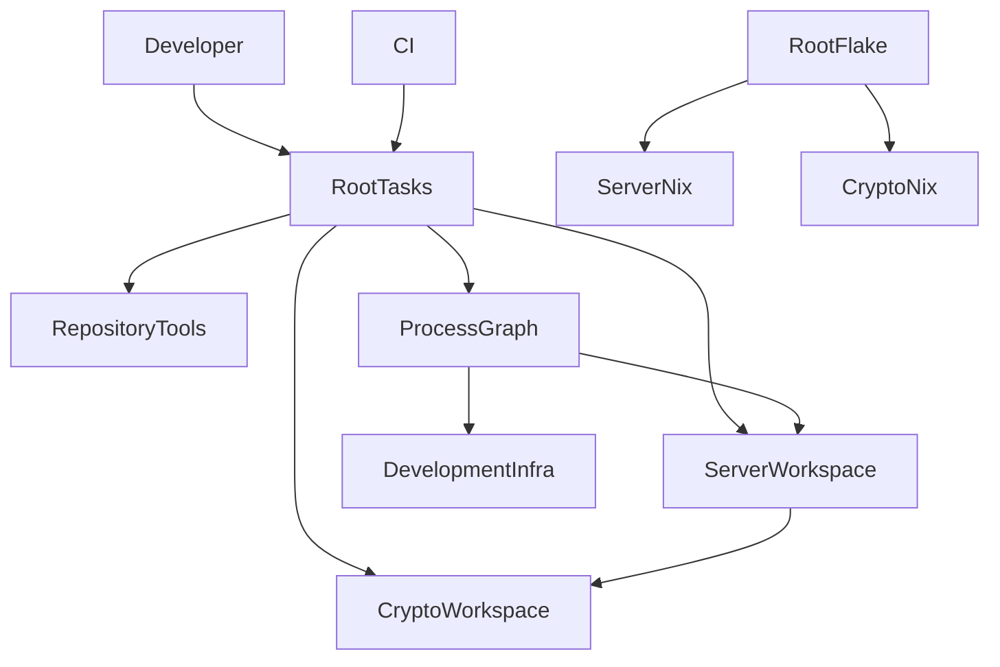
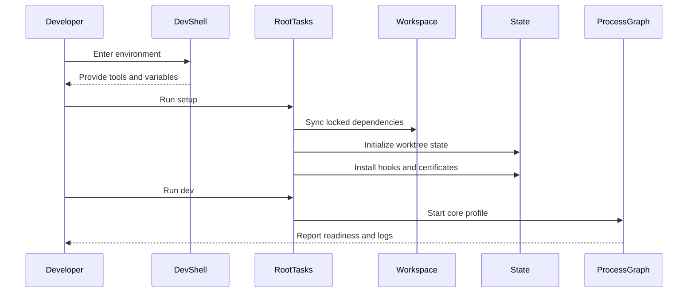
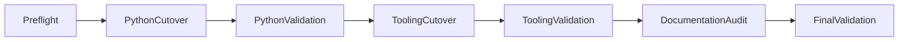

# Design Document

## Overview

Athena repositoryを、root orchestrationとproduct-owned workspaceを分離したmonorepoへ切り替える。初回cutoverは`apps/athena_server`と`packages/athena_crypto`だけをmemberとし、runtime namespace、CLI、worker task、database migration、Stable/Lazer/API behaviorを変更しない。

開発者とCIはrootの単一task interfaceを使用する。Nixはtoolchainとreproducible check environment、uvはPython workspaceと単一lock、process-composeはprocess lifecycle、各workspace manifestはruntime/build metadataを所有する。Mutable stateとmachine固有設定は各linked worktreeの`.state`と`.venv`へ閉じ込める。

### Goals

- Server、worker、CLI、cryptoのrelease/build/test ownershipを物理配置と一致させる。
- Clean checkout、linked worktree、CIで同じvalidation contractを利用可能にする。
- Root dependency lock、task、Nix、process graph、documentation policyを単一source of truthにする。
- 旧path、重複lock、暗黙setup、legacy script、stale docs/backlogを安全に除去する。

### Non-Goals

- `apps/athena_web`、pnpm files、Web process、Web用Nix module、`tests/system`の作成。
- Next.js source layout、UI component system、apex Web catch-all routingの有効化。
- PP計算library、managed runtime、native binary、language binding方式の決定。
- Runtime domain、protocol、API、database schema、Alembic revision内容の変更。

## Boundary Commitments

### This Spec Owns

- `apps/athena_server`、`packages/athena_crypto`、root orchestration、repository tools、development infrastructureのphysical ownership cutover。
- Root uv workspace、単一`uv.lock`、root Just interface、root Flake composition、root process graph、CI invocation contract。
- Server/CLI configのserver-project-root基準env-file resolution。
- Test、type stub、Alembic、docs、Gitlint、Kiro lifecycle、TODO/stale-path auditの移管とcleanup。
- Initial migration completionを判定するvalidation checkpoint。

### Out of Boundary

- Runtime featureまたはwire contractの意味変更。
- Frontend workspace bootstrapとWeb ingress activation。
- New shared runtime package、CLI-only distribution、workspace別Flake/lock/Just entrypoint。
- Official PP calculator bindingのarchitecture。
- Completed Kiro specに記録されたpre-migration historical evidenceの無差別な書換え。

### Allowed Dependencies

- Root orchestrationはworkspace manifest、Nix module、process graph、repository toolsをinvokeできるが、runtime packageとしてimportされない。
- `apps/athena_server`は`packages/athena_crypto`へ依存できる。
- `athena_cli`は`osu_server`のapplication/composition/config interfaceを利用できる。`osu_server`から`athena_cli`への依存は禁止する。
- CIはnative tool setupとservice containerの後にroot Just recipeをinvokeする。CI固有workflowへquality/test semanticsを複製しない。
- Root Flakeはworkspace `default.nix`をimportする。Workspace moduleは独立Flakeまたはlockを持たない。
- Process graphはroot Just/uv workspace command、PostgreSQL、Valkey、Nginx、optional cloudflaredを利用するが、Nix evaluationから生成しない。

### Revalidation Triggers

- `osu_server`、`athena_cli`、`athena_crypto` namespace、console command、worker broker/task名の変更。
- Root single-lock strategyまたはserver/crypto distribution boundaryの変更。
- CLI-only release、2つ目のPython product、frontend workspace、cross-workspace system testの追加。
- Development process prerequisite、ingress host/path、worktree state locationの変更。
- Kiro spec authority/lifecycleまたはcurrent-vs-historical documentation policyの変更。
- Root task recipe名またはlocal/CI parity boundaryの変更。

## Architecture

### Existing Architecture Analysis

- Root `pyproject.toml`がserver/CLI distribution、runtime dependency、all development policyを混在所有する。
- `athena-crypto`は独立build artifactだがmember lockを持ち、root test/type gateから漏れる。
- `flake.nix` shellHookがsync、state、hooks、certificate/trust setupを暗黙実行し、一部failureを無視する。
- `scripts/ci.sh`、`scripts/dev-tasks.sh`、GitHub Actionsがvalidation/task semanticsを分散所有する。
- `process-compose.yml`のreadiness、database initialization、ordered shutdownは維持すべき既存contractである。
- Config、fixture/catalog、allowlist、docs、Kiro specにroot-relative pathが埋め込まれている。

### Architecture Pattern & Boundary Map



**Architecture Integration**:

- Selected pattern: Product-boundary monorepo with orchestration-only root。
- Domain/feature boundaries: Server product、crypto artifact、repository tools、development infraを別ownerにし、rootはinvoke/policyだけを持つ。
- Existing patterns preserved: Python namespace、modular monolith layer rules、CLI/server dependency direction、process readiness/shutdown、Alembic history。
- New components rationale: Root Just interfaceとworkspace Nix modulesは分散したtask/environment ownershipを統合するために追加する。
- Steering compliance: Test/docstring/import rulesを弱めず、worktree/PR workflowとchild AGENTS差分方針を維持する。

依存方向は次で固定する。

```text
CI and Developer -> Root Tasks -> Workspace Commands and Process Graph
Root Flake -> Workspace Nix Modules
athena_cli -> osu_server -> athena_crypto
osu_server -X-> athena_cli
```

### Technology Stack

| Layer | Choice / Version | Role in Feature | Notes |
|-------|------------------|-----------------|-------|
| Python workspace | Python 3.14+ / uv lock-resolved | Root workspace、single lock、server/crypto dependency resolution | Rootはnon-package |
| Server build | Hatchling / existing lock constraint | `osu_server`と`athena_cli`のsingle distribution | Console commandを維持 |
| Crypto build | Rust 2021 / PyO3 0.29 / Maturin >=1,<2 | `athena_crypto` native extensionとtype artifact | Independent wheel test |
| Task interface | Just from pinned development toolchain | Local/CI共通の公開recipe | Root entrypointのみ |
| Environment | Nix Flake pinned by `flake.lock` | Toolchain、dev shell、build/check composition | Shell entryはside-effect-free |
| Process lifecycle | process-compose schema 0.5 | Readiness、dependency、shutdown、logs | Root YAMLが正本 |
| Local ingress | Nginx、mkcert、optional cloudflared from pinned toolchain | Named HTTPS local profileとtunnel profile | Generated stateは`.state` |
| CI | GitHub Actions | Native setup/cache/service + Just recipes + Nix check | No local credential generation |

新規runtime dependencyは追加しない。Justはdevelopment toolchainへ追加するが、application distributionには含めない。

## File Structure Plan

### Directory Structure

```text
athena/
├── apps/
│   └── athena_server/
│       ├── src/
│       │   ├── osu_server/
│       │   └── athena_cli/
│       ├── tests/
│       ├── typings/
│       ├── alembic/
│       ├── docs/
│       ├── alembic.ini
│       ├── pyproject.toml
│       ├── default.nix
│       ├── .env.example
│       ├── AGENTS.md
│       └── README.md
├── packages/
│   └── athena_crypto/
│       ├── src/
│       ├── tests/
│       ├── typings/athena_crypto/
│       ├── Cargo.toml
│       ├── pyproject.toml
│       ├── default.nix
│       ├── AGENTS.md
│       └── README.md
├── tools/
│   └── gitlint/
│       ├── rules/
│       └── tests/
├── infra/
│   └── development/
│       ├── nginx/
│       ├── cloudflared/
│       └── hosts.example
├── docs/
│   ├── adr/
│   └── research/
├── scripts/
│   └── agent-worktree.sh
├── .github/workflows/ci.yml
├── .kiro/specs/README.md
├── .env.example
├── .envrc
├── .gitignore
├── .gitlint
├── .gitleaks.toml
├── .worktreeinclude
├── AGENTS.md
├── CLAUDE.md
├── README.md
├── flake.nix
├── flake.lock
├── justfile
├── process-compose.yml
├── pyproject.toml
└── uv.lock
```

`apps/athena_web`、root JavaScript manifests/lock、Web `default.nix`、`tests/system`は作成しない。`docs/research/tanstack-start-vs-nextjs-reputation-2026-07-30.md`はfrontend workspace作成までrootに残す。

### Created or Rehomed Files

- `apps/athena_server/src/` — Existing `src/osu_server`と`src/athena_cli`のphysical owner。
- `apps/athena_server/tests/` — Existing server/worker/CLI unit、integration、e2e、fixtures、factories、support。
- `apps/athena_server/alembic.ini`と`alembic/` — Existing revision historyとmigration runtime。
- `apps/athena_server/typings/` — Server/test-only third-party stubs。
- `apps/athena_server/docs/` — Architecture、Stable compatibility guide/matrix、server operations。
- `apps/athena_server/pyproject.toml` — Distribution、runtime dependency、console script、build、import-linter。
- `apps/athena_server/default.nix` — Server-specific tools、build、checks。
- `apps/athena_server/.env.example` — Server runtime configuration example。
- `apps/athena_server/README.md`、`AGENTS.md` — Server runbookとroot規約との差分。
- `packages/athena_crypto/` — Existing `athena-crypto` source/test/manifestsのrenamed owner。
- `packages/athena_crypto/typings/athena_crypto/` — Package-owned public stub source。Wheel inclusionはbuild contractで検証する。
- `packages/athena_crypto/default.nix` — Crypto Rust/Python build/check module。
- `packages/athena_crypto/README.md`、`AGENTS.md` — Crypto-specific build/test/FFI guidance。
- `tools/gitlint/rules/`、`tools/gitlint/tests/` — Existing custom ruleとtest。
- `infra/development/nginx/` — Tracked Nginx source template。
- `infra/development/cloudflared/` — Tracked tunnel example/template。Credentialは含めない。
- `.kiro/specs/README.md` — Spec authority、lifecycle、historical path policy。
- `justfile` — Repository唯一のpublic task interface。

### Modified Root Files

- `pyproject.toml` — `tool.uv.package = false`、workspace members、repository-wide Ruff/interrogate/basedpyright/pytest policy。
- `uv.lock` — Server/crypto membersを解決する唯一のPython lock。
- `flake.nix` — Workspace `default.nix` composition、side-effect-free shell、flake checks。
- `process-compose.yml` — New workspace paths、per-worktree state、core/optional process selectionに対応。
- `.github/workflows/ci.yml` — Native setup後にJust recipeを実行し、Nix checkを独立job化。
- `.gitlint` — `tools/gitlint/rules`を参照。
- `.gitignore`、`.worktreeinclude` — `.state` ownershipと新template/config pathへ更新。
- `.gitleaks.toml` — Moved source/test path allowlistを更新。
- `.env.example` — Cross-workspace orchestration valueだけを記載。
- `.envrc` — Root Flake entryだけを提供し、setupを実行しない。
- `README.md`、`AGENTS.md`、`CLAUDE.md` — Root overview/policyとper-worktree stateへ更新。
- `.kiro/steering/tech.md`、`.kiro/steering/roadmap.md` — Canonical task/pathとspec statusを更新。
- Stable fixture/catalog/validation files — Moved source/test pathとdisplayed evidence pathを更新。

### Removed After Capability Transfer

- `scripts/ci.sh`、`scripts/dev-tasks.sh`。
- `athena-crypto/uv.lock`と旧`athena-crypto/` path。
- Root `src/`、`tests/`、`typings/`、`alembic/`、`alembic.ini`。
- Root `certs/`、`cloudflared/`、`nginx.dev.conf*`、`hosts.example`。
- `gitlint_rules/`。
- `TODO.md`。

## System Flows

### Explicit setup and development flow



Shell entry does not invoke setup. `dev` runs a preflight and fails with an actionable `setup` instruction when required state is missing. `dev-tunnel` performs the same core preflight plus tunnel-specific validation.

### Migration checkpoints



Each validation checkpoint is a rollback boundary. Old and new canonical paths do not coexist beyond the active boundary.

## Requirements Traceability

| Requirement | Summary | Components | Interfaces | Flows |
|-------------|---------|------------|------------|-------|
| 1.1, 1.2, 1.3, 1.4, 1.5, 1.6, 1.7 | Runtime/CLI/migration compatibility | Server Workspace, Validation Policy | Runtime Entrypoints, CLI Contract, Migration Contract | Migration checkpoints |
| 2.1, 2.2, 2.3, 2.4, 2.5, 2.6, 2.7 | Product/package ownership | Workspace Manifests, Server Workspace, Crypto Workspace | Build Contracts, Type Artifact Contract | Migration checkpoints |
| 3.1, 3.2, 3.3, 3.4, 3.5, 3.6 | Dependency/setup consistency | Workspace Manifests, Nix Composition, Root Task Gateway | Locked Sync, Setup Contract | Explicit setup flow |
| 4.1, 4.2, 4.3, 4.4, 4.5 | Root task interface | Root Task Gateway, Validation Policy | Public Recipe Contract | Explicit setup flow |
| 5.1, 5.2, 5.3, 5.4, 5.5, 5.6 | Worktree isolation | Nix Composition, Server Workspace, Development Infra | State Layout, Config Path Contract | Explicit setup flow |
| 6.1, 6.2, 6.3, 6.4, 6.5, 6.6 | Full quality/test coverage | Validation Policy, Workspace Manifests | Quality Contract, Test Contract | Migration checkpoints |
| 7.1, 7.2, 7.3, 7.4, 7.5, 7.6 | Local/tunnel ingress and lifecycle | Process Graph, Development Infra, Root Task Gateway | Dev Profile Contract | Explicit setup flow |
| 8.1, 8.2, 8.3, 8.4, 8.5, 8.6 | CI parity | CI Workflow, Validation Policy, Root Task Gateway | CI Job Contract | Migration checkpoints |
| 9.1, 9.2, 9.3, 9.4, 9.5, 9.6, 9.7 | Documentation/spec lifecycle | Documentation Governance, Cutover Audit | Authority Contract, Stale Path Audit | Migration checkpoints |
| 10.1, 10.2, 10.3, 10.4, 10.5, 10.6, 10.7 | Safe cutover and exclusions | Cutover Audit, all workspace components | Boundary Validation Contract | Migration checkpoints |

## Components and Interfaces

| Component | Domain/Layer | Intent | Req Coverage | Key Dependencies | Contracts |
|-----------|--------------|--------|--------------|------------------|-----------|
| Workspace Manifests | Build/Packaging | Root policyとproduct build metadataを分離する | 2.1-2.7, 3.1-3.4, 6.3 | uv, Hatchling, Maturin P0 | Batch, State |
| Server Workspace | Product | App、worker、CLI、migration、tests、docsを所有する | 1.1-1.7, 2.1-2.2, 2.5-2.6, 5.3, 6.2, 6.6 | Crypto Workspace P0 | Service, Batch, State |
| Crypto Workspace | Package | Native extensionとpublic typingを所有する | 2.3, 2.7, 6.1-6.3 | Maturin, Rust P0 | Batch |
| Root Task Gateway | Tooling | Local/CIのsingle public command contractを提供する | 3.4-3.6, 4.1-4.5, 7.1-7.3, 8.1 | Workspace commands, Process Graph P0 | Batch |
| Nix Composition | Environment | Side-effect-free shellとworkspace checksを合成する | 3.5-3.6, 5.1-5.2, 8.2, 8.5 | Workspace Nix modules P0 | State, Batch |
| Process Graph | Runtime Tooling | Core process readiness/shutdownとoptional tunnelを管理する | 7.1-7.6 | Server Workspace, Development Infra P0 | State, Batch |
| Development Infra | Infrastructure | Tracked ingress templateとgenerated stateを分離する | 5.1-5.6, 7.1-7.6, 10.4 | Nginx, mkcert, cloudflared P1 | State |
| Validation Policy | Quality/CI | 全workspaceのquality/test/build/migration contractを検証する | 1.1-1.6, 6.1-6.6, 8.1-8.6, 10.7 | Root Task Gateway P0 | Batch |
| Documentation Governance | Documentation | README、AGENTS、ADR、Kiro authorityを整合させる | 9.1-9.6 | Workspace owners P1 | State |
| Cutover Audit | Migration | Old/new path、stale reference、scope exclusionを検査する | 9.7, 10.1-10.7 | All components P0 | Batch |
| CI Workflow | CI | Native setupからcanonical recipeとNix checkを実行する | 8.1-8.6 | Root Task Gateway, services P0 | Batch |

### Build and Packaging

#### Workspace Manifests

| Field | Detail |
|-------|--------|
| Intent | Root orchestration policyとworkspace distribution metadataを分離する |
| Requirements | 2.1-2.7, 3.1-3.4, 6.3 |

**Responsibilities & Constraints**

- Root manifestはnon-package uv workspace、single lock、repository-wide development policyだけを所有する。
- Server manifestはdistribution name/version、runtime dependencies、console script、Hatchling config、import-linterを所有する。
- Crypto manifestはMaturin/PyO3 buildとpackage-owned typing sourceを所有する。
- Member lockfileとworkspace-specific dependency resolutionを禁止する。

**Dependencies**

- Inbound: Root Task Gateway — sync/build/test invocation P0。
- Outbound: uv/Hatchling/Maturin — resolution and build P0。
- External: Locked tool versions — reproducibility P0。

**Contracts**: Batch [x] / State [x]

##### Batch Contracts

| Operation | Preconditions | Success | Failure |
|-----------|---------------|---------|---------|
| Locked sync | Root lockと全member manifestが存在 | 全initial memberを同じenvironmentへ同期 | Lock drift/member omissionをnon-zeroで報告 |
| Server build | Locked sync済み | `osu_server`、`athena_cli`、`athena` entrypointを含むartifact | Missing namespace/entrypointで失敗 |
| Crypto build | Rust/Python toolchain利用可能 | `athena_crypto` extensionとpublic type artifactを含むwheel | Wheel contents/type import不一致で失敗 |

**Implementation Notes**

- Integration: Server source/CLIのphysical move、server distribution manifest、root non-package workspace、single lock regeneration、およびcanonical root gateを阻害するruntime/test/tooling consumer更新は同じatomic cutoverで行う。どれか一つだけを完了taskとして扱わない。残余consumerの全量auditとhistorical exception分類はTask 2.5で扱う。
- Validation: Clean locked sync、wheel contents、installed import/entrypoint smoke test。
- Risks: Root/member dependency groupの重複はroot policyかruntime ownerの一方へ寄せる。

#### Server Workspace

| Field | Detail |
|-------|--------|
| Intent | Server productのsource、CLI、tests、migration、stubs、docs、configをcolocateする |
| Requirements | 1.1-1.7, 2.1-2.2, 2.5-2.6, 5.3, 6.2, 6.6 |

**Responsibilities & Constraints**

- Physical moveはPython namespaceを変更しない。
- `athena_cli -> osu_server`だけを許可し、逆方向をimport-linterで禁止する。
- Supported environmentのtyped nameはserver config boundaryが所有し、CLIは同じ型とvalidationを再利用する。
- Alembic revision filesとheadをbyte/identifier semanticの変更なしで移す。
- Config env-file baseをserver project rootへ固定し、environment variable precedenceを維持する。
- Server-only stubs/docs/testsはこのworkspaceに閉じる。

**Dependencies**

- Inbound: Root Task Gateway、Process Graph、CI Workflow P0。
- Outbound: Crypto Workspace P0。
- External: PostgreSQL、Valkey、existing runtime dependencies P0。

**Contracts**: Service [x] / Batch [x] / State [x]

##### Service Interface

```python
def server_project_root() -> Path: ...
def environment_file_path(environment: EnvironmentName) -> Path: ...
```

- Preconditions: `environment`は既存supported environment setに属する。
- Postconditions: Source checkoutでは`apps/athena_server/.env.<environment>`を返す。
- Invariants: Process environmentはenv fileより優先され、CWDは結果へ影響しない。

##### Batch Contracts

- App: `python -m osu_server`。
- Worker: `taskiq worker osu_server.worker:broker`。
- CLI: `athena`と既存command family。
- Migration: Server-owned Alembic configからexisting headへupgrade。

**Implementation Notes**

- Integration: Fixture/catalogに表示されるsource/test pathも同じcutoverで更新する。
- Validation: Arbitrary-CWD config test、CLI regression、app/worker smoke、Alembic current/head comparison。
- Risks: Installed wheelでenv fileが存在しない場合もenvironment-only startupを阻害しない。

#### Crypto Workspace

| Field | Detail |
|-------|--------|
| Intent | Native crypto artifact、tests、typing、Rust/Python buildを1 ownerにする |
| Requirements | 2.3, 2.7, 6.1-6.3 |

**Responsibilities & Constraints**

- Distribution/import/module nameを維持する。
- Python testとRust buildをroot gateから必ず実行する。
- Public stubをpackage sourceとして所有し、built artifactに同梱する。

**Dependencies**

- Inbound: Server Workspace、Root Task Gateway P0。
- External: Rust 2021、PyO3 0.29、Maturin >=1,<2 P0。

**Contracts**: Batch [x]

**Implementation Notes**

- Integration: Package rename後もeditable workspace dependencyが同じmoduleを解決する。
- Validation: Python tests、wheel build、wheel contents、isolated type-aware import。
- Risks: Maturinのtyping inclusion configurationはlocked toolchainで実artifactを検査する。

### Development Tooling

#### Root Task Gateway

| Field | Detail |
|-------|--------|
| Intent | Repository利用者とCIにsingle public task contractを提供する |
| Requirements | 3.4-3.6, 4.1-4.5, 7.1-7.3, 8.1 |

**Responsibilities & Constraints**

- Development、quality、test、build、CIのcommand catalogはroot `justfile`だけに置く。`scripts/agent-worktree.sh`はgeneral task catalogではなくspecialized worktree lifecycle toolとして維持する。
- Recipeはuv、Cargo/Maturin、Athena CLI、process-composeへ薄く委譲する。
- Workspace manifestのscriptと同じlogicを二重実装しない。
- Setup failureを無視せず、devはsetupを暗黙実行しない。

**Dependencies**

- Inbound: Developer、CI Workflow P0。
- Outbound: Workspace Manifests、Nix Composition、Process Graph、Validation Policy P0。

**Contracts**: Batch [x]

##### Public Recipe Contract

| Recipe | Responsibility | Failure Contract |
|--------|----------------|------------------|
| `setup` | Locked sync、worktree state、hooks、local certificate/trust setup | Missing tool/state operationをnon-zeroで報告 |
| `tunnel-setup` | Cloudflare account/credential固有setup | Core setupを変更せずtunnel failureを報告 |
| `dev` | Core process profileのpreflightと起動 | Setup不足時に`setup`を案内 |
| `dev-tunnel` | Core profile + optional tunnel | Tunnel不足時に`tunnel-setup`を案内 |
| `quality` / `docstrings` / `test` / `build` | Repository-wide validation | Failed workspace/checkを区別して伝播 |
| `db-migrate` / `db-test-create` / `db-test-migrate` / `db-test-run` | Server migration/test DB workflow | CLI/Alembic/subprocess exit codeを伝播 |
| `ci` | Local aggregate gate | Independent recipeのfailureを保持 |
| `audit-monorepo` | Old path、scope exclusion、ownership consistency audit | Stale normative referenceまたはunexpected artifactで失敗 |

**Implementation Notes**

- Integration: Existing `scripts/ci.sh`/`dev-tasks.sh` capability matrixをrecipeへ移してから削除する。
- Validation: `just --list`相当のdiscoverability、recipe exit propagation、clean/dirty setup idempotency。
- Risks: Complex shell logicが必要ならroot-owned helperへ分離できるが、command catalogはJustに維持する。

#### Nix Composition

| Field | Detail |
|-------|--------|
| Intent | Root Flakeからworkspace toolchain/build/checkを合成し、worktree-safe shellを提供する |
| Requirements | 3.5-3.6, 5.1-5.2, 8.2, 8.5 |

**Responsibilities & Constraints**

- Root `flake.nix`と`flake.lock`だけをNix entrypoint/lockにする。
- Server/crypto `default.nix`はrootからimportされるmoduleであり独立projectではない。
- Shell entryはdirectory作成、sync、hook install、certificate生成、trust changeを行わない。
- Worktree rootを解決し、`.state`と`.venv`のpath environmentだけを提供する。

**Dependencies**

- Inbound: Developer、CI Nix job P0。
- Outbound: Server/crypto Nix modules P0。
- External: Pinned nixpkgs and hook tooling P0。

**Contracts**: State [x] / Batch [x]

**Implementation Notes**

- Integration: Existing hook checksをflake checkとして維持し、installationだけをexplicit setupへ移す。
- Validation: `nix develop`前後のworktree diff、2 worktree path comparison、`nix flake check`。
- Risks: Hook tooling APIの利用方法はcurrent locked inputで検証し、shellHook side effectを再導入しない。

#### Process Graph and Development Infra

| Field | Detail |
|-------|--------|
| Intent | Core process lifecycleとtracked/generated ingress stateを分離する |
| Requirements | 5.1-5.6, 7.1-7.6, 10.4 |

**Responsibilities & Constraints**

- Root `process-compose.yml`がreadiness、dependency、shutdown、logsの唯一のgraphを所有する。
- Core graphはPostgreSQL、database init、Valkey、app、worker、Nginxを含む。
- Cloudflaredはoptional profileとして同じNginx routingへ接続する。
- Nginx/Cloudflare/hostsはtracked template、certificate/actual config/credentialは`.state`に置く。
- Frontend processとapex Web catch-allは追加しない。

**Dependencies**

- Inbound: Root Task Gateway P0。
- Outbound: Server Workspace、PostgreSQL、Valkey、Nginx P0、cloudflared P1。

**Contracts**: State [x] / Batch [x]

##### State Management

- `.state/postgres`、`.state/valkey`、`.state/nginx`、`.state/certs`、`.state/cloudflared`はworktree-local。
- `.venv`もworktree-local。Shared package cacheだけはmachine-globalでよい。
- `.worktreeinclude`はuser-authored server env fileだけを対象にし、`.state`、certificate、actual tunnel credentialを別worktreeへcopyしない。
- Missing tunnel stateはcore graph availabilityへ影響しない。

**Implementation Notes**

- Integration: Existing readiness probesとordered shutdownを保持し、workspace-relative commandだけ更新する。
- Validation: Credentialなしcore startup、readiness、shutdown order、named HTTPS health、optional tunnel preflight。
- Risks: Host port collisionは既存operational concernとして明示errorにし、別worktree state共有で回避しない。

### Validation and Governance

#### Validation Policy and CI Workflow

| Field | Detail |
|-------|--------|
| Intent | 全workspaceとruntime compatibilityをlocal/CIで同じ意味で検証する |
| Requirements | 1.1-1.6, 6.1-6.6, 8.1-8.6, 10.7 |

**Responsibilities & Constraints**

- Root policyはtracked first-party Python全体のRuff/interrogateと、explicit workspaceのtype/test/buildを扱う。
- Server import-linterはserver manifestから実行する。
- Root test contractはserver、crypto、tools/gitlintを明示し、future `tests/system`を想定して空memberを作らない。
- CI quality/test/build/migration/Nix jobはfailureを区別し、同じJust recipeをinvokeする。
- CIはcertificate、Cloudflare credential、Git hook、trust-storeを生成しない。

**Dependencies**

- Inbound: Root Task Gateway、CI Workflow P0。
- Outbound: Workspace commands、PostgreSQL/Valkey service containers P0。

**Contracts**: Batch [x]

##### CI Job Contract

| Job | Inputs | Validation | Output |
|-----|--------|------------|--------|
| Quality | Root lock and source | Root quality/docstrings/type/import contract | Distinct status |
| Test | PostgreSQL/Valkey + locked environment | Migration head + all workspace tests | Distinct status |
| Migration | PostgreSQL + server workspace | Existing revision chainをheadまで適用しcurrent/headを照合 | Distinct status |
| Build | Locked Python/Rust environment | Server and crypto artifacts + wheel contents | Distinct status |
| Nix | Flake files | Evaluation, shells, workspace build/check | Distinct status |
| Audit | Repository tree | Old paths, unexpected frontend, docs/task/layout alignment | Distinct status |

**Implementation Notes**

- Integration: Current CLI/test behavior tests move without semantic rewrite。
- Validation: App/worker/CLI smoke、Alembic head、full gates、artifact inspection。
- Risks: Historical Kiro path is not treated as normative stale path unless lifecycle policy marks the spec active/current。

#### Documentation Governance and Cutover Audit

| Field | Detail |
|-------|--------|
| Intent | Current authorityとhistorical evidenceを区別し、安全なcleanup completionを判定する |
| Requirements | 9.1-9.7, 10.1-10.7 |

**Responsibilities & Constraints**

- Root README/AGENTSはrepository overview/common rules、child filesはworkspace runbook/deltaを所有する。
- ADRはroot single sequence、server architecture/protocol/operationsはserver docsへ移す。
- Kiro READMEはcode/test、ADR、feature specのauthorityとlifecycleを定義する。
- Active/current normative referencesは新pathへ更新する。Completed historical snapshotの旧pathは明示policy下で保持できる。
- TODOはdurable item移管後に削除する。
- Auditはold canonical directory、member lock、legacy script、unexpected frontend/system-test artifactを拒否する。

**Dependencies**

- Inbound: All workspace owners P0。
- Outbound: Root Task Gateway audit recipe P0。

**Contracts**: State [x] / Batch [x]

**Implementation Notes**

- Integration: Docs move後にrelative linkとsource evidence pathを検証する。
- Validation: Targeted stale-path scan、Markdown link audit、Kiro phase/task evidence audit、TODO reconciliation record。
- Risks: Historical evidenceとstale instructionを混同しないよう、authority ruleを先に作成する。

## Error Handling

### Error Strategy

- Environment entryはmutable operationを行わないため、toolchain evaluation failureだけを即時報告する。
- Explicit setup、task、build、migration、auditはfailureを無視せずnon-zeroを伝播する。
- Optional tunnel failureはcore dev profileへ伝播させない。`dev-tunnel`だけを失敗させる。
- Migration checkpoint failure時は次boundaryへ進まず、現在boundaryのmove/config changeをrollback対象として扱う。

### Error Categories and Responses

| Category | Example | Response |
|----------|---------|----------|
| Prerequisite | setup前の`dev`、missing tool | Required recipe/toolを示してfail |
| Lock/manifest | lock drift、member omission | Sync/buildをfailし対象artifactを表示 |
| Runtime compatibility | import/entrypoint/task/migration mismatch | Checkpointをfailしcutoverを停止 |
| State isolation | State pathが別worktreeを指す | Fail without fallback |
| Optional ingress | Cloudflare credential missing | Core profileを維持しtunnel recipeだけfail |
| Documentation | Normative stale path、broken link、TODO未移管 | Auditをfailまたはmigration incompleteと報告 |

### Monitoring

- Development process observabilityはprocess-compose readiness、exit status、ordered logsを維持する。
- CIはquality、test、build、migration、Nix、auditを別statusとして公開する。
- 本specはapplication runtime logging schemaを変更しない。

## Security Considerations

- Cloudflare credential、local certificate private key、actual proxy configuration、`.env.*` secretは`.state`またはgitignored server-local fileへ置き、tracked templateと分離する。
- OS trust store変更とGit hook installationは明示的`setup`だけが実行し、shell entryやCIは実行しない。
- CIはproduction secret、Cloudflare account、local certificateを必要とせず、test-only service credentialをjob scopeへ限定する。
- Worktree state resolutionはprimary checkoutや別worktreeへfallbackしない。誤ったpathは安全にfailする。

## Testing Strategy

### Unit Tests

- `osu_server.config`のserver project root/env-file resolutionがarbitrary CWDで同じpathを返し、environment variable precedenceを維持する。
- CLI command catalog、supported environment、production confirmation、subprocess exit propagationを移動後も検証する。
- Gitlint rule/testが`tools/gitlint`からloadされ、root `.gitlint`と一致する。
- Repository policy testがworkspace/test path listからserver、crypto、toolsのomissionを検出する。

### Integration Tests

- Clean checkout相当でroot locked syncを行い、member lockなしでserver/cryptoを解決する。
- Server artifactをinstallして`osu_server`、`athena_cli`、`athena`をsmoke testする。
- Crypto artifactをbuild/installし、`athena_crypto` import、existing crypto behavior、public typing artifactを検証する。
- Existing Alembic revision IDs/headを比較し、server-owned configからtest DBへupgradeする。
- Root quality/test recipesがserver、crypto、tools testsをすべて実行する。

### Development Workflow Tests

- `nix develop`前後でrepository/worktree stateに変更がないことを検証する。
- 2 linked worktreeでresolved `.state`、`.venv`、certificate/config pathが異なることを検証する。
- `setup`を2回実行して同じ利用可能状態へ収束し、failureをsilent ignoreしないことを検証する。
- Credentialなしでcore dev profileがreadyになり、tunnel profileだけがactionable failureを返すことを検証する。
- Process graphがdatabase/Valkey readiness後にapp/workerを開始し、逆順にgraceful shutdownすることを検証する。

### Compatibility and Migration Validation

- Stable/Lazer/API focused regression suitesとworker task testsをPython cutover checkpointで実行する。
- Stable fixture/catalogのsource/test pathとreporting outcomeを新配置へ更新して検証する。
- Old root directories、member lock、legacy scripts、root generated infra pathが残っていないことを監査する。
- `apps/athena_web`、JavaScript workspace files、Web process、`tests/system`が作成されていないことを監査する。
- Root/child README、AGENTS、CLAUDE、steering、Kiro lifecycle、ADR linksの整合性を検証する。

## Migration Strategy

### Boundary 1: Python workspace cutover

Boundary 1開始時のpreflight baselineは、Python workspace cutover前のruntime、migration、validation、cleanup inventoryを固定する機械検証対象である。generated certificate、実tunnel config、secret値は記録しない。`--alembic-current`は到達可能な`DATABASE_URL`と、recorded migration headが適用済みの対象databaseを必要とする。`DATABASE_URL`が未設定または未到達、あるいはcurrent revisionがheadと異なる場合、checkerはnon-zeroで終了する。Task 4.4でlifecycleを分類するまでは、`monorepo-migration`以外のhistorical Kiro specをhistoryとして扱い、active normative stale-path failureにはしない。

1. Preflight inventoryとしてruntime entrypoint、CLI command、Alembic head、test path、stale path listをsnapshotする。
2. Cryptoを`packages/athena_crypto`へ移し、package ownerからbuild、wheel artifact、isolated consumerを検証する。
3. Server source/CLIとserver distribution metadataを`apps/athena_server`へ移し、root/member manifestsのnon-package workspace化とsingle lock切替、およびcanonical root gateを阻害するruntime/test/tooling consumer更新を同じatomic cutoverで行う。root distributionまたは同名distributionを残さない。
4. Server-owned test、Alembic、typings、docsと残余path consumerをownerへ移し、config/env pathとhistorical exception auditを更新する。
5. Locked sync、artifact build、imports、CLI、Alembic、quality/test/compatibility gateを実行する。

Rollback trigger: Namespace/entrypoint、Alembic head、runtime focused test、server/crypto buildのいずれかが一致しない場合。

### Boundary 2: Tooling and development infrastructure

1. Root Flakeとserver/crypto `default.nix`へ分割し、shell side effectを除去する。
2. Root Just recipesへlegacy script capabilityを移管する。
3. Process graph、tracked infra template、per-worktree state、local/tunnel profileを切り替える。
4. CIをJust recipeと独立Nix jobへ更新し、Gitlint toolingを移動する。
5. Setup idempotency、2-worktree isolation、process lifecycle、full CI-equivalent gateを実行する。

Rollback trigger: Shell entryがstateを変更する、core devがcredentialを要求する、legacy capabilityまたはCI coverageが失われる場合。

### Boundary 3: Documentation and backlog audit

1. Root/child README、AGENTS、CLAUDE、server docs、steering、Kiro lifecycleを新ownershipへ更新する。
2. Normative/active pathを更新し、completed historical path policyを適用する。
3. TODOをroadmap/specへ照合して削除する。
4. Legacy scripts、old directories、root generated template、stale normative referencesを削除する。
5. `audit-monorepo`、Markdown link audit、quality/test/build/Nix gate、final diff reviewを実行する。

Rollback trigger: Durable backlog loss、broken authority chain、stale canonical instruction、guide/validation/layout disagreementが残る場合。

### Completion Criteria

- Requirements traceabilityの全contractがvalidation evidenceを持つ。
- Root task interface以外にpublic command catalogが残っていない。
- Server/crypto/toolsの全testとquality/buildがroot/CIから実行される。
- Initial migration exclusion artifactが存在しない。
- Repository guide、validation rule、package layout、public task interfaceが同じownership boundaryを示す。
