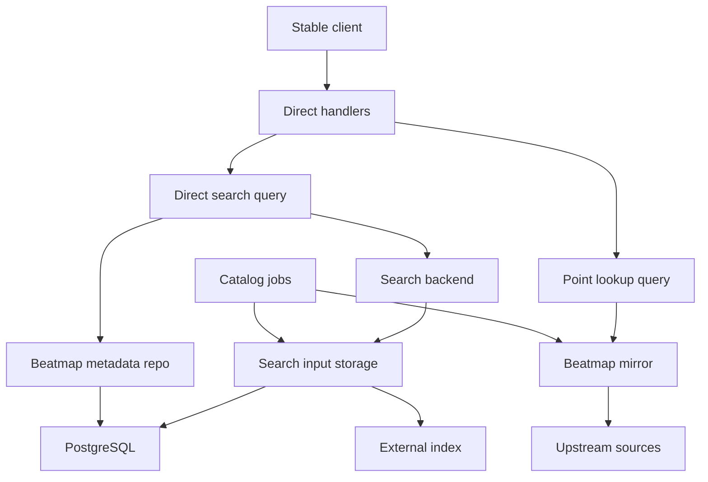
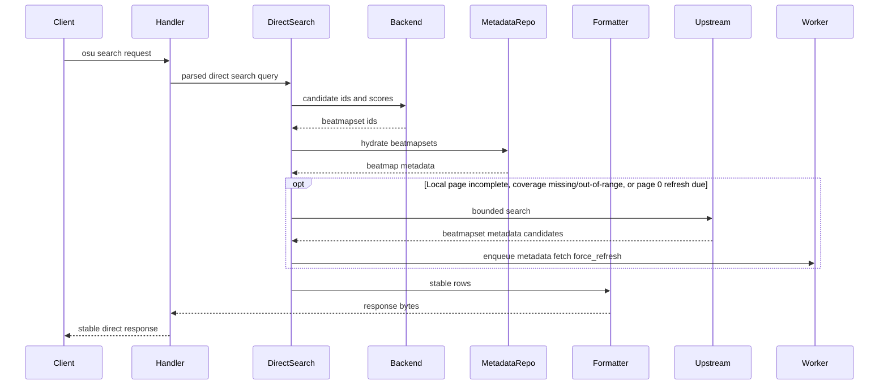
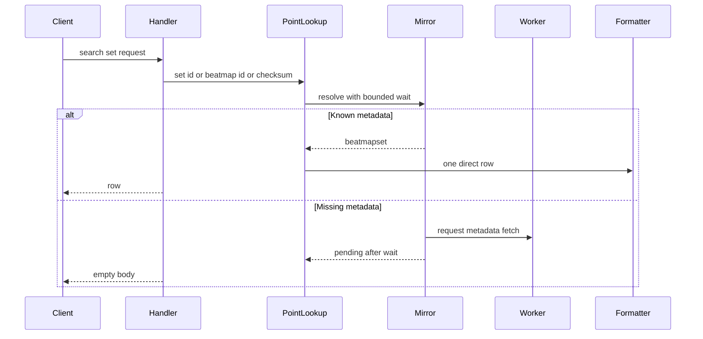
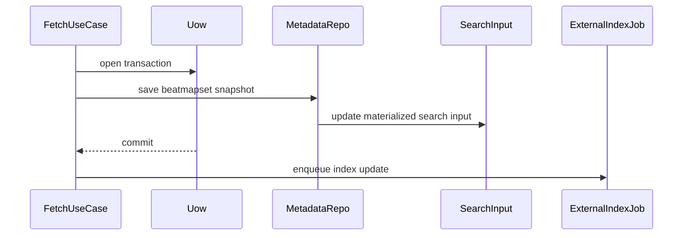
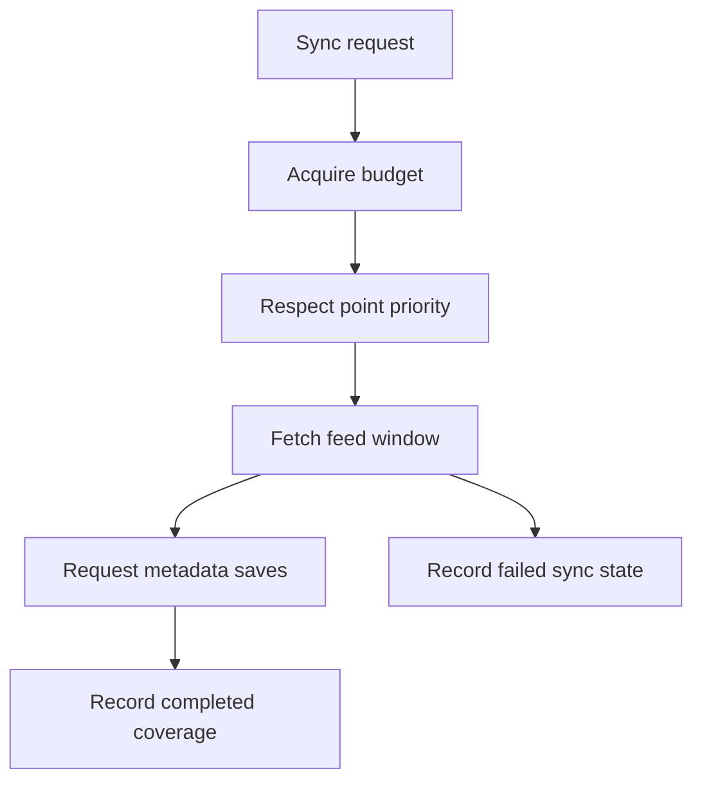
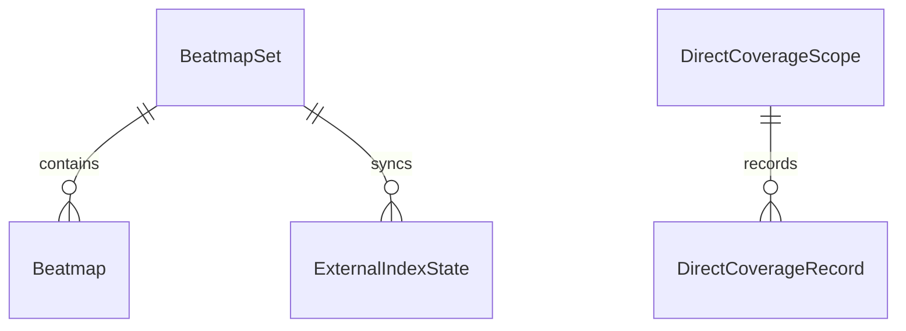
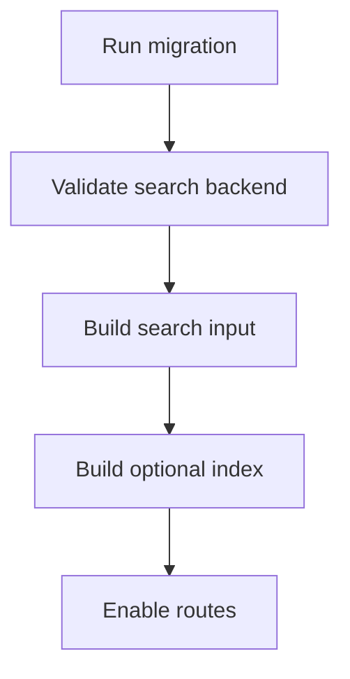

# Design Document

## Overview

osu-direct adds stable osu!direct search and beatmapset pickup on top of the existing Beatmap Mirror metadata cache. Stable clients use `/web/osu-search.php` for catalog search and `/web/osu-search-set.php` for single beatmapset pickup. Athena hydrates local results from saved beatmapset metadata and can merge bounded upstream search candidates when local coverage is incomplete or page 0 needs freshness.

The design adds beatmapset-owned materialized search input, ParadeDB and `tsvector` PostgreSQL search, optional Meilisearch indexing/search, coverage tracking for catalog sync, and stable response mappers. Beatmap Mirror remains the source of truth for metadata and file state. `.osz` downloads, rating, playcount ranking, WebUI, and supporter entitlement billing are explicitly deferred.

### Goals

- Serve stable-compatible osu!direct search and point lookup responses.
- Track catalog feed and id range coverage without claiming false completeness.
- Keep PostgreSQL metadata as the source of truth while using search indexes only for candidate ranking.
- Prioritize point lookup over background catalog crawl under shared upstream limits.
- Make materialized search input and external index rebuilds recoverable.

### Non-Goals

- `.osz` package download implementation or cache management.
- Rating collection, Top Rated ranking, or Most Played ranking.
- Stable getscores, score submission, PP, leaderboard, or `.osu` file warmup behavior changes.
- Admin/WebUI management surfaces.
- AR/OD/CS/HP/BPM/length filter support in stable osu!direct search.

## Boundary Commitments

### This Spec Owns

- Stable osu!direct access policy for search and point lookup.
- Stable `/web/osu-search.php` and `/web/osu-search-set.php` handler behavior.
- Direct search request parsing, result formatting, delimiter sanitation, and special query handling.
- Beatmapset materialized search input and its consistency with Beatmap Mirror metadata saves.
- ParadeDB, Meilisearch, and PostgreSQL `tsvector` search backend contracts.
- Search field declarations shared by SQL and external backends.
- Catalog coverage records for feed windows and explicit beatmapset id range crawl chunks.
- Catalog sync and point lookup work priority rules.
- Materialized search input and external index rebuild use-cases.

### Out of Boundary

- Beatmap Mirror provider selection, metadata source priority, `.osu` file attachment, and file warmup jobs.
- `.osz` package downloads and archive extraction.
- Score processing, getscores responses, leaderboard rows, PP, user stats, and rank changes.
- BanchoBot now-playing command rendering, WebUI, public API, and admin API surfaces.
- Supporter entitlement billing or grant logic.
- Rating and direct playcount ranking.

### Allowed Dependencies

- Beatmap Mirror domain models, command repositories, query repositories, and metadata fetch jobs.
- `RequestBeatmapFileWarmupUseCase` only as an adjacent future consumer, not as a search prerequisite.
- Stable web legacy transport routing and Dishka provider graph.
- SQLAlchemy async repositories and Alembic migrations.
- PostgreSQL with the ParadeDB `pg_search` extension for the preferred search backend.
- PostgreSQL built-in `tsvector` full-text search for deployments where `pg_search` is unavailable.
- `meilisearch-python-sdk` for Meilisearch index synchronization and optional search backend access.
- taskiq workers for catalog sync, external index updates, and rebuild work.
- AppConfig for access policy, backend selection, sync intervals, upstream budget, wait timeout, and optional Meilisearch connection settings.

### Revalidation Triggers

- Stable direct row field order, count sentinel, authentication behavior, or empty response behavior changes.
- Beatmap Mirror `BeatmapSet`, `Beatmap`, fetch target, or metadata save contracts change.
- Materialized search input fields, searchable/filterable/sortable field declarations, or ParadeDB BM25 index definition change.
- Meilisearch index document shape or index settings change.
- Catalog coverage semantics change from observed feed range to guaranteed range or vice versa.
- Point lookup wait timeout or background fetch behavior changes.
- Rating, playcount ranking, or `.osz` download support becomes in-scope.

## Architecture

### Existing Architecture Analysis

Athena already has `domain/beatmaps`, command-side metadata fetch use-cases, query repositories, SQLAlchemy models for `beatmapsets` and `beatmaps`, stable web legacy handlers, taskiq beatmap fetch jobs, and file warmup orchestration. The missing pieces for osu!direct are search-oriented materialized input/indexing, stable direct wire formatting, coverage tracking, and catalog sync work.

The stable web legacy transport is rooted in `transports/stable/web_legacy` and registered through `composition/application.py`, `composition/endpoints.py`, `composition/lifespan.py`, and `composition/providers/stable_web_legacy.py`. New osu!direct handlers follow that pattern. They do not access SQLAlchemy models, DB sessions, or external indexes directly.

### Architecture Pattern & Boundary Map

Selected pattern: **metadata source of truth + materialized search input + candidate backend + stable formatter**.



Key decisions:

- Search backends return `beatmapset_id` and rank score only.
- Stable response hydration always reads saved Beatmap Mirror metadata.
- `beatmapsets.direct_search_text` is materialized index input, not a second catalog source of truth.
- Automatic backend selection validates ParadeDB first, then configured Meilisearch, and fixes the process to PostgreSQL `tsvector` only when higher-quality backends are unavailable.
- Explicit ParadeDB configuration fails startup when `pg_search` is not installed, not created, or missing required index fields.
- Explicit Meilisearch configuration fails startup when the external index backend is not configured or Meilisearch is unavailable.
- Materialized search input updates happen in the same DB transaction as metadata saves.
- Meilisearch indexing happens after commit and may lag without corrupting SQL search.
- Point lookup may wait up to five seconds for missing metadata. Search listing may wait up to the configured upstream search budget for hybrid result supplementation.

### Dependency Direction

Allowed dependency direction for new implementation:

```text
domain/beatmaps -> repositories.interfaces -> services.commands and services.queries -> transports/jobs -> composition
```

Infrastructure adapters implement repository or backend Protocols. Stable transport mappers format wire responses but do not own search rules. Jobs adapt primitive task payloads into command/query inputs and do not contain business rules.

### Technology Stack

| Layer | Choice / Version | Role in Feature | Notes |
| --- | --- | --- | --- |
| Backend / Services | Python 3.14 dataclasses and Protocols | typed request/result models and use-case boundaries | Existing stack |
| Transport | Starlette stable web legacy | `/web/osu-search.php` and `/web/osu-search-set.php` routes | Stable wire compatibility |
| Data / Storage | SQLAlchemy 2 async + PostgreSQL | metadata hydration, search input, coverage, index state | Existing persistence stack |
| Data / Search | ParadeDB `pg_search` | preferred BM25 search backend | Runtime extension prerequisite when selected explicitly |
| Data / Search Fallback | PostgreSQL `tsvector` | extension-free full-text fallback | Lower ranking quality; no extra migration |
| Optional Search | Meilisearch via `meilisearch-python-sdk` | optional external index synchronization and search backend | Requires Meilisearch URL when selected or enabled |
| Jobs | taskiq + taskiq-redis | catalog sync, external index updates, rebuild work | Existing worker model |
| Configuration | pydantic-settings `AppConfig` | backend selection, access policy, sync intervals, waits, budgets | Startup validation required |
| Observability | structlog | catalog, search input, backend, and lookup diagnostics | No credentials or raw password logs |

## File Structure Plan

### Directory Structure

```text
apps/athena_server/src/osu_server/
├── domain/
│   ├── beatmaps/
│   │   ├── __init__.py
│   │   ├── models.py
│   │   └── direct.py
│   └── compatibility/
│       └── stable/
│           ├── __init__.py
│           └── direct.py
├── services/
│   ├── commands/
│   │   └── beatmaps/
│   │       ├── __init__.py
│   │       ├── direct_catalog_sync.py
│   │       ├── direct_indexing.py
│   │       └── fetch.py
│   └── queries/
│       └── beatmaps/
│           ├── direct_search.py
│           └── mirror/
├── repositories/
│   ├── interfaces/
│   │   ├── commands/
│   │   │   └── beatmaps.py
│   │   └── queries/
│   │       ├── beatmaps.py
│   │       └── direct_search.py
│   ├── memory/
│   │   ├── commands/
│   │   │   ├── beatmaps.py
│   │   │   └── state.py
│   │   └── queries/
│   │       └── direct_search.py
│   └── sqlalchemy/
│       ├── commands/
│       │   └── beatmaps.py
│       ├── models/
│       │   └── beatmap.py
│       └── queries/
│           └── direct_search.py
├── infrastructure/
│   └── search/
│       ├── __init__.py
│       ├── direct_index_definition.py
│       └── meilisearch_direct.py
├── transports/
│   └── stable/
│       └── web_legacy/
│           ├── direct.py
│           └── mappers/
│               └── direct.py
├── jobs/
│   └── osu_direct.py
├── composition/
│   ├── application.py
│   ├── endpoints.py
│   ├── lifespan.py
│   └── providers/
│       ├── beatmaps_app.py
│       ├── beatmaps_worker.py
│       └── stable_web_legacy.py
└── config.py

apps/athena_server/alembic/versions/
└── <revision>_add_osu_direct_search.py

apps/athena_server/tests/
├── unit/
│   ├── domain/beatmaps/test_direct.py
│   ├── services/commands/beatmaps/test_direct_catalog_sync.py
│   ├── services/commands/beatmaps/test_direct_indexing.py
│   ├── services/queries/beatmaps/test_direct_search.py
│   └── transports/stable/web_legacy/test_direct.py
├── integration/
│   ├── repositories/sqlalchemy/test_direct_search_repository.py
│   └── transports/stable/web_legacy/test_osu_direct_routes.py
└── e2e/
    └── test_osu_direct_stable_contract.py
```

### New Files

- `domain/beatmaps/direct.py` - search document, coverage, sync scope, backend result, rebuild target, access policy, and direct query value objects.
- `domain/compatibility/stable/direct.py` - stable-only direct response constants, status mapping, count sentinel, special query names, and row field semantics.
- `services/commands/beatmaps/direct_catalog_sync.py` - catalog feed and id range sync command use-cases with priority and coverage recording.
- `services/commands/beatmaps/direct_indexing.py` - materialized search input rebuild and external index update/rebuild use-cases.
- `services/queries/beatmaps/direct_search.py` - stable direct search and point lookup query use-cases.
- `repositories/interfaces/queries/direct_search.py` - read-only search backend Protocols.
- `repositories/memory/queries/direct_search.py` - in-memory search repository for unit tests.
- `repositories/sqlalchemy/queries/direct_search.py` - ParadeDB-backed SQL search and metadata hydration queries.
- `infrastructure/search/direct_index_definition.py` - shared searchable/filterable/sortable/displayed field declaration.
- `repositories/sqlalchemy/queries/direct_search.py` - PostgreSQL search backend validation helpers, ParadeDB query builder, and `tsvector` fallback.
- `infrastructure/search/meilisearch_direct.py` - optional Meilisearch settings, document sync, and search adapter using `meilisearch-python-sdk`.
- `transports/stable/web_legacy/direct.py` - stable HTTP handlers for osu!direct search and point lookup.
- `transports/stable/web_legacy/mappers/direct.py` - query parsers and stable row formatter.
- `jobs/osu_direct.py` - taskiq adapters for catalog sync, external index update, and rebuild.

### Modified Files

- `config.py` - add osu!direct access policy, backend selection, point lookup wait, sync intervals, upstream budget, ParadeDB extension validation switch, and optional Meilisearch settings.
- `domain/beatmaps/__init__.py` and `domain/compatibility/stable/__init__.py` - export new direct value objects where local package export patterns require it.
- `repositories/interfaces/commands/beatmaps.py` - extend command repository with search input and coverage mutation methods used in the metadata save transaction.
- `repositories/sqlalchemy/commands/beatmaps.py` - update materialized search input in the same transaction as beatmapset snapshot save.
- `repositories/memory/commands/state.py` and `repositories/memory/commands/beatmaps.py` - add in-memory search input, coverage, and index state for tests.
- `repositories/sqlalchemy/models/beatmap.py` - add osu!direct search input columns to `beatmapsets`, plus ORM models for coverage records and external index state.
- `composition/application.py` - add stable web routes for `/web/osu-search.php` and `/web/osu-search-set.php`.
- `composition/endpoints.py` - add endpoint adapters that dispatch to DI-resolved direct handlers.
- `composition/lifespan.py` - resolve direct handlers and attach them to app state.
- `composition/providers/beatmaps_app.py` and `composition/providers/beatmaps_worker.py` - provide direct search, sync, indexing, and rebuild use-cases.
- `composition/providers/stable_web_legacy.py` - provide direct parsers, formatter, and handlers.
- `jobs/__init__.py` - import `jobs/osu_direct.py` for task registration.
- Alembic migration - add `beatmapsets` search input columns, coverage and index state tables, and optional ParadeDB BM25 index.

## System Flows

### Stable Search Request



Search uses local indexed candidates first. When local results are incomplete, explicit id-range coverage is missing or out-of-range, or page 0 is past the configured refresh interval, it calls configured upstream search providers with a bounded wait and merges usable candidates into the response. External candidates are also enqueued for force-refresh metadata fetch so later searches can hydrate them locally.

### Point Lookup Request



The default wait is five seconds. The background fetch remains eligible to complete after the stable response is sent.

### Metadata Save and Search Input Update



Materialized search input consistency is part of the metadata save transaction. External index consistency is asynchronous and recoverable.

### Catalog Coverage Sync



Only completed feed windows or id chunks become coverage. Failed windows and chunks remain visible as failures, not covered ranges.

## Requirements Traceability

| Requirement | Summary | Components | Interfaces | Flows |
| --- | --- | --- | --- | --- |
| 1.1, 1.2, 1.3, 1.4, 1.5 | access policy and auth behavior | Direct access policy, stable handlers | handler auth contract | Stable Search Request, Point Lookup Request |
| 2.1, 2.2, 2.3, 2.4, 2.5, 2.6 | catalog and coverage state | Catalog sync, coverage repository | coverage records | Catalog Coverage Sync |
| 3.1, 3.2, 3.3, 3.4, 3.5, 3.6 | sync intervals, budget, priority | Catalog sync commands, worker jobs | sync job payloads, budget policy | Catalog Coverage Sync |
| 4.1, 4.2, 4.3, 4.4, 4.5, 4.6 | stable search inputs and special queries | Direct search query, stable parser | search query contract | Stable Search Request |
| 5.1, 5.2, 5.3, 5.4, 5.5, 5.6 | stable row formatting | Direct response formatter | stable row bytes | Stable Search Request, Point Lookup Request |
| 6.1, 6.2, 6.3, 6.4, 6.5, 6.6 | backend selection and hydration | Search backend Protocols, ParadeDB, Meilisearch | candidate ids plus score | Stable Search Request |
| 7.1, 7.2, 7.3, 7.4, 7.5, 7.6 | field declaration | Direct index definition | index settings | Metadata Save and Search Input Update |
| 8.1, 8.2, 8.3, 8.4, 8.5 | search input consistency | command repository, input builder | metadata save transaction | Metadata Save and Search Input Update |
| 9.1, 9.2, 9.3, 9.4, 9.5 | external index recovery | indexing use-case, rebuild job | index state records | Metadata Save and Search Input Update |
| 10.1, 10.2, 10.3, 10.4, 10.5, 10.6, 10.7 | point lookup behavior | point lookup query, Beatmap Mirror integration | lookup target contract | Point Lookup Request |
| 11.1, 11.2, 11.3, 11.4, 11.5 | tombstone handling | search input builder, point lookup | inactive metadata state | Point Lookup Request, Metadata Save and Search Input Update |
| 12.1, 12.2, 12.3, 12.4, 12.5 | deferred download and ranking scope | boundary policy, special query handling | fallback sort contract | Stable Search Request |

## Components and Interfaces

| Component | Domain or Layer | Intent | Requirement Coverage | Key Dependencies | Contracts |
| --- | --- | --- | --- | --- | --- |
| Direct domain values | Domain | Defines search queries, external index documents, coverage, backend result values | 2, 3, 6, 7, 8, 9, 10, 11 | Beatmap domain P0 | Service, State |
| Stable direct compatibility | Domain compatibility | Encodes stable direct row and special query semantics | 4, 5, 12 | Direct domain values P0 | Service |
| Search input storage | Persistence command and query | Maintains `beatmapsets` materialized search input and coverage state | 2, 7, 8, 9, 11 | Beatmap metadata tables P0 | State |
| ParadeDB search backend | Query infrastructure | Preferred BM25 search backend returning candidate ids and scores | 4, 6, 7 | Search input P0 | Service |
| Meilisearch index backend | Infrastructure adapter | Optional external index update and search adapter | 6, 7, 9 | Search input P1 | Service, Batch |
| Direct search query | Query service | Executes stable search and hydrates final metadata | 1, 4, 5, 6, 7, 11, 12 | Search backend P0, Beatmap query repo P0 | Service |
| Point lookup query | Query service | Resolves single set by set id, beatmap id, checksum, or link | 1, 5, 10, 11, 12 | Beatmap Mirror P0 | Service |
| Catalog sync commands | Command service | Fetches feed windows and id ranges under shared budget | 2, 3, 10, 11 | Beatmap Mirror P0, jobs P0 | Batch |
| Indexing commands | Command service | Updates external index and rebuilds search input/index state | 8, 9 | Search input P0, Meilisearch P1 | Batch |
| Stable direct transport | Transport | Parses stable direct requests and returns stable bytes | 1, 4, 5, 10, 12 | Direct search P0, point lookup P0 | API |

### Domain and Compatibility

#### Direct Domain Values

| Field | Detail |
| --- | --- |
| Intent | Provide typed direct search, point lookup, external index document, coverage, backend, and rebuild values. |
| Requirements | 2.1, 2.2, 2.3, 2.6, 3.1, 3.2, 6.3, 7.1, 7.2, 7.3, 7.4, 8.4, 10.4, 11.1 |

Responsibilities and constraints:

- `DirectSearchRequest` contains authenticated user identity, query text, direct status filter, mode filter, page, and requested listing type.
- `BeatmapSetSearchDocument` is a set-centered DTO rebuilt from `beatmapsets` and child `beatmaps` for external indexing and version comparison. It is not stored in a separate table and does not contain stable response rows.
- `DirectCoverageRecord` distinguishes feed windows from explicit id range chunks.
- `DirectSearchCandidate` carries `beatmapset_id` and `score`.
- Values are standard frozen dataclasses or enums and do not import infrastructure.

#### Stable Direct Compatibility

| Field | Detail |
| --- | --- |
| Intent | Centralize stable-specific direct response constants and special query semantics. |
| Requirements | 4.3, 4.4, 4.5, 5.1, 5.2, 5.3, 5.5, 12.3, 12.4, 12.5 |

Responsibilities and constraints:

- `Newest`, `Top Rated`, and `Most Played` are recognized before text search.
- `Top Rated` and `Most Played` use fallback ordering and are documented as unimplemented ranking sources.
- Count sentinel uses the researched stable-compatible `101` behavior when 100 returned results imply another page.
- The formatter removes pipe and newline delimiters from upstream text fields.

### Persistence and Search

#### Search Input Storage

| Field | Detail |
| --- | --- |
| Intent | Store beatmapset-owned materialized search input, coverage records, and external index state. |
| Requirements | 2.1, 2.2, 2.3, 2.4, 2.5, 2.6, 7.1, 8.1, 8.2, 8.3, 8.4, 8.5, 9.3, 9.5, 11.1, 11.4, 11.5 |

Contracts: State

- Command repository methods:
  - `save_beatmapset_snapshot(snapshot)` updates `beatmapsets.direct_search_text` in the same Unit of Work as metadata save.
  - `record_feed_coverage(record)` and `record_id_range_coverage(record)` only after successful completion.
  - `record_index_state(state)` for external index success and failure.
- Query repository methods:
  - `get_search_document(beatmapset_id)` and `list_search_documents()` rebuild DTOs from `beatmapsets` and child `beatmaps` for external indexing.
  - `get_coverage(scope)` for operator diagnostics and sync planning.

Preconditions:

- Metadata save has produced a complete `BeatmapSet` with child beatmaps.
- Inactive/tombstone states are explicit.

Postconditions:

- SQL search sees committed metadata and materialized search input together.
- Materialized search input never becomes the stable response source of truth.

#### ParadeDB Search Backend

| Field | Detail |
| --- | --- |
| Intent | Execute BM25 search inside PostgreSQL and return ranked beatmapset candidates. |
| Requirements | 4.1, 4.2, 4.5, 6.1, 6.3, 6.4, 6.5, 7.1, 7.2, 7.3, 7.4, 7.5 |

Contracts: Service

Service interface:

```python
class DirectSearchBackend(Protocol):
    async def search(self, request: DirectSearchRequest) -> DirectSearchBackendResult:
        ...
```

Constraints:

- Startup validates that ParadeDB search is configured and the required extension/index are available when this backend is selected.
- Query results contain `beatmapset_id` and score only.
- Filtering uses declared status, mode, and beatmapset id fields.
- Sorting supports relevance, `last_update DESC`, and `beatmapset_id DESC`.

#### Meilisearch Index Backend

| Field | Detail |
| --- | --- |
| Intent | Maintain and optionally query an external search index without becoming source of truth. |
| Requirements | 6.2, 6.3, 6.4, 6.6, 7.1, 7.5, 7.6, 9.1, 9.2, 9.3, 9.4, 9.5 |

Contracts: Service, Batch

- Index settings use the shared field declaration:
  - searchable: artist, title, creator, source, tags, difficulty names, unicode artist, unicode title.
  - filterable: status, modes, beatmapset id, active flag.
  - sortable: last update, beatmapset id.
  - displayed: beatmapset id and optional diagnostic version only.
- External index update jobs run after DB commit.
- External index synchronization failure records retryable state and falls back to PostgreSQL search unless Meilisearch search is explicitly selected.
- Adapter uses `meilisearch-python-sdk` for settings, document updates, health checks, and search.

### Use-Cases and Jobs

#### Direct Search Query

| Field | Detail |
| --- | --- |
| Intent | Search candidate ids, hydrate metadata, and return stable direct rows. |
| Requirements | 1.1, 1.2, 1.4, 1.5, 4.1, 4.2, 4.3, 4.4, 4.5, 4.6, 5.1, 5.3, 5.4, 5.5, 5.6, 6.4, 11.2, 12.3, 12.4, 12.5 |

Contracts: Service

Preconditions:

- Caller has already parsed stable query parameters and authenticated user credentials.
- Access policy has allowed osu!direct for the user.

Postconditions:

- Returns stable-compatible bytes or an access/authentication failure.
- Uses configured upstream search providers for local misses, incomplete pages, coverage gaps, and page 0 refreshes within the bounded wait.

#### Point Lookup Query

| Field | Detail |
| --- | --- |
| Intent | Resolve a single beatmapset for stable pickup and future now-playing or link entrances. |
| Requirements | 1.1, 1.2, 1.4, 5.2, 5.3, 5.4, 5.5, 10.1, 10.2, 10.3, 10.4, 10.5, 10.6, 10.7, 11.3, 11.4, 12.2 |

Contracts: Service

Inputs:

- `beatmapset_id`, `beatmap_id`, `checksum_md5`, or normalized beatmap link target.

Behavior:

- Uses Beatmap Mirror cache-first resolution.
- Requests metadata fetch when missing.
- Waits up to configured timeout, default five seconds.
- Returns empty stable body when unresolved, inactive, deleted, not submitted, or incomplete.

#### Catalog Sync Commands

| Field | Detail |
| --- | --- |
| Intent | Populate catalog metadata from feed windows and explicit id range chunks. |
| Requirements | 2.2, 2.3, 2.4, 2.5, 2.6, 3.1, 3.2, 3.3, 3.4, 3.5, 3.6, 10.5, 11.1 |

Contracts: Batch

- Feed sync records observed ranges and source cursor/page markers.
- Id range crawl records completed chunks as stronger coverage.
- Status-specific intervals are configurable and default to the same value for every status.
- Shared budget prioritizes point lookup work over catalog crawl.

#### Indexing Commands

| Field | Detail |
| --- | --- |
| Intent | Keep external indexes synchronized and provide rebuild recovery. |
| Requirements | 7.5, 8.1, 8.5, 9.1, 9.2, 9.3, 9.4, 9.5 |

Contracts: Batch

- `update_external_index(beatmapset_id)` rebuilds the committed search document DTO and writes the external index document.
- `rebuild_search_projection()` rebuilds materialized search input from Beatmap Mirror metadata.
- `rebuild_external_index()` rebuilds external index documents from committed metadata.
- Rebuilds are operator-triggered CLI/admin jobs, not app startup work.

### Stable Transport

#### Stable Direct Handlers and Formatter

| Field | Detail |
| --- | --- |
| Intent | Adapt stable HTTP query parameters to direct use-cases and build stable bytes. |
| Requirements | 1.1, 1.2, 1.3, 1.4, 2.6, 4.1, 4.2, 4.3, 4.4, 4.5, 5.1, 5.2, 5.3, 5.4, 5.5, 5.6, 10.1, 10.2, 10.3, 10.6, 11.3, 12.1, 12.2 |

Contracts: API

| Method | Endpoint | Request | Response | Errors |
| --- | --- | --- | --- | --- |
| GET | `/web/osu-search.php` | `u`, `h`, `r`, `q`, `m`, `p` | count line and rows | stable auth/access failure |
| GET | `/web/osu-search-set.php` | `u`, `h`, one of `s`, `b`, `c` | one row or empty body | stable auth/access failure |

Implementation constraints:

- Handler authenticates before search or lookup.
- Handler returns empty body for unresolved point lookup.
- Handler does not expose coverage or source diagnostics in the stable body.
- Handler registers under the existing `osu.$DOMAIN` web legacy host route.

## Data Models

### Domain Model



Business invariants:

- Search input belongs to one beatmapset row and is rebuilt from source metadata.
- Search input is eligible only when the beatmapset is usable and has at least one child beatmap.
- Stable response hydration reads `BeatmapSet` and child `Beatmap` records, never external index documents.
- Coverage records are append/update operational state, not user-visible catalog truth.

### Physical Data Model

#### `beatmapsets` osu!direct search columns

| Column | Type | Notes |
| --- | --- | --- |
| `source` | text not null | source/search text field from upstream when available, empty string otherwise |
| `tags` | text not null | space-separated upstream tags when available, empty string otherwise |
| `direct_search_text` | text not null | materialized ParadeDB/tsvector input built from artist, title, creator, source, tags, unicode fields, and child difficulty names |
| `search_document_version` | integer not null | incremented when the reconstructed search document changes |
| `search_document_updated_at` | timestamptz not null | search input update time |

Indexes:

- Existing primary key on `beatmapsets.id`.
- ParadeDB BM25 index over `id` and `direct_search_text`.
- B-tree fallback index for `official_status`, `search_document_updated_at`, and `id`.
- Mode filters and difficulty names are derived from related `beatmaps`; no separate 1:1 duplicate search table is created.

#### `beatmap_direct_coverage`

| Column | Type | Notes |
| --- | --- | --- |
| `id` | bigint primary key | surrogate id |
| `coverage_kind` | enum | `feed_window` or `id_range` |
| `source` | text not null | upstream source identifier |
| `status_scope` | enum/text constraint | status scope for sync |
| `sort_key` | text not null | feed sort or id crawl |
| `window_key` | text not null | cursor/page/window identifier, empty for id chunks |
| `from_beatmapset_id` | integer null | observed or crawled range start |
| `to_beatmapset_id` | integer null | observed or crawled range end |
| `cursor` | text null | upstream cursor when available |
| `completed_at` | timestamptz null | set only when coverage is complete |
| `failed_at` | timestamptz null | failure visibility |
| `failure_reason` | text null | sanitized operational reason |

Unique scope:

- `(coverage_kind, source, status_scope, sort_key, window_key, from_beatmapset_id, to_beatmapset_id)` with non-null sentinel values where needed. Do not encode semantic "all" with nullable columns.

#### `beatmap_direct_external_index_state`

| Column | Type | Notes |
| --- | --- | --- |
| `backend` | enum/text constraint | `meilisearch` initially |
| `beatmapset_id` | integer | document identity |
| `document_version` | integer | search document version attempted |
| `status` | enum/text constraint | pending, succeeded, failed |
| `last_attempted_at` | timestamptz null | retry diagnostics |
| `last_succeeded_at` | timestamptz null | freshness diagnostics |
| `failure_reason` | text null | sanitized failure reason |

## Error Handling

### Error Strategy

- Authentication failures follow existing stable auth behavior.
- Access denied returns stable-compatible direct denial behavior without catalog leakage.
- Search backend configuration failure is a startup/configuration error for the explicitly configured backend.
- Optional external index synchronization failure is degraded to PostgreSQL search with recorded index state unless Meilisearch search is explicitly selected.
- Point lookup timeout returns stable-compatible empty body and does not cancel background fetch eligibility.
- Tombstoned and incomplete sets return empty point lookup and are omitted from search.

### Monitoring

Structured events:

- `osu_direct_search_requested`
- `osu_direct_search_backend_fallback`
- `osu_direct_search_backend_selected`
- `osu_direct_point_lookup_pending`
- `osu_direct_point_lookup_timeout`
- `osu_direct_catalog_sync_completed`
- `osu_direct_catalog_sync_failed`
- `osu_direct_search_input_updated`
- `osu_direct_external_index_failed`
- `osu_direct_rebuild_completed`

Logs must not include raw passwords, session hashes, API credentials, or full upstream response bodies.

## Testing Strategy

### Unit Tests

- Access policy accepts authenticated default, denies disabled policy, and reserves supporter-entitlement denial.
- Login response adds the Supporter bit for authenticated stable supporter features without changing presence rank or server-side privileges.
- Stable direct parser recognizes `Newest`, `Top Rated`, and `Most Played` without passing them as literal query text.
- Stable formatter sanitizes delimiter characters and omits incomplete beatmapsets.
- Search input builder enables usable sets and disables inactive, deleted, not submitted, or childless sets.
- Point lookup maps set id, beatmap id, checksum, and normalized link targets to Beatmap Mirror requests.

### Integration Tests

- SQLAlchemy metadata save updates `beatmapsets` search input columns in the same Unit of Work.
- ParadeDB, Meilisearch, and `tsvector` backends return candidate ids and scores and hydrate final rows from metadata.
- Optional Meilisearch indexing failure leaves PostgreSQL search available and records failure state.
- Coverage records mark only completed feed windows and id chunks as covered.
- Rebuild command reconstructs materialized search input and external index state from stored metadata.

### Stable Contract Tests

- `GET /web/osu-search.php` returns count line plus stable rows for authenticated users.
- `GET /web/osu-search-set.php?s=<id>` returns one stable row for known complete set.
- `GET /web/osu-search-set.php?b=<id>` and `?c=<md5>` resolve the owning set.
- Point lookup miss returns `200` empty body after bounded wait.
- `Top Rated` and `Most Played` fallback ordering does not break stable response shape.

### Performance and Recovery Tests

- Search listing performs bounded upstream search for local misses and coverage gaps, then enqueues metadata fetch for returned external candidates.
- Point lookup priority is honored over low-priority catalog crawl work.
- Rebuild jobs are idempotent and do not run during app startup.
- External index lag does not change hydrated stable response data.

## Security Considerations

- Access policy is evaluated after authentication and before search execution.
- Stable auth credentials remain parsed by existing stable web legacy authentication boundaries.
- Optional external index documents should contain only searchable public metadata and internal document version, not credentials or user data.
- Operator diagnostics sanitize upstream failure messages before persistence.

## Performance & Scalability

- Search listing is local-first and only waits on configured upstream search providers up to the bounded search wait.
- Point lookup defaults to a five-second bounded wait and then returns empty body.
- ParadeDB is preferred for search quality; app startup validates required extension/index state when selected.
- Meilisearch is optional, can be selected as a search backend when configured, and can be rebuilt from PostgreSQL state.
- Catalog crawl uses shared upstream budget and lower priority than point lookup.
- Search input updates are transactional with metadata save, so write path cost is accepted in exchange for SQL search consistency.

## Migration Strategy



Rollout order:

1. Add `beatmapsets` search input columns, state tables, and optional ParadeDB index.
2. Enable materialized search input update on metadata save.
3. Run search input rebuild from existing beatmap metadata.
4. Validate configured search backend.
5. Enable stable routes and optional Meilisearch index/search.

Rollback:

- Disable osu!direct access policy first.
- Keep `beatmapsets` search input columns during rollback unless migration rollback is explicitly requested.
- Optional external index can be rebuilt from PostgreSQL after rollback/roll-forward.

## Supporting References

- `research.md` records CheeseGull, LETS, bancho.py, deck, osuBasil, neomod, official osu! API, ParadeDB, and Meilisearch findings.
- `beatmap-mirror` spec remains authoritative for metadata fetch, source priority, file state, and `.osu` attachment behavior.
