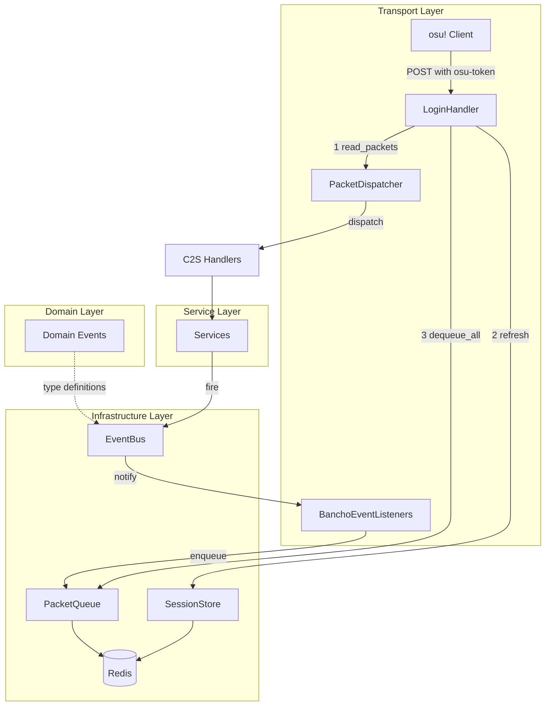
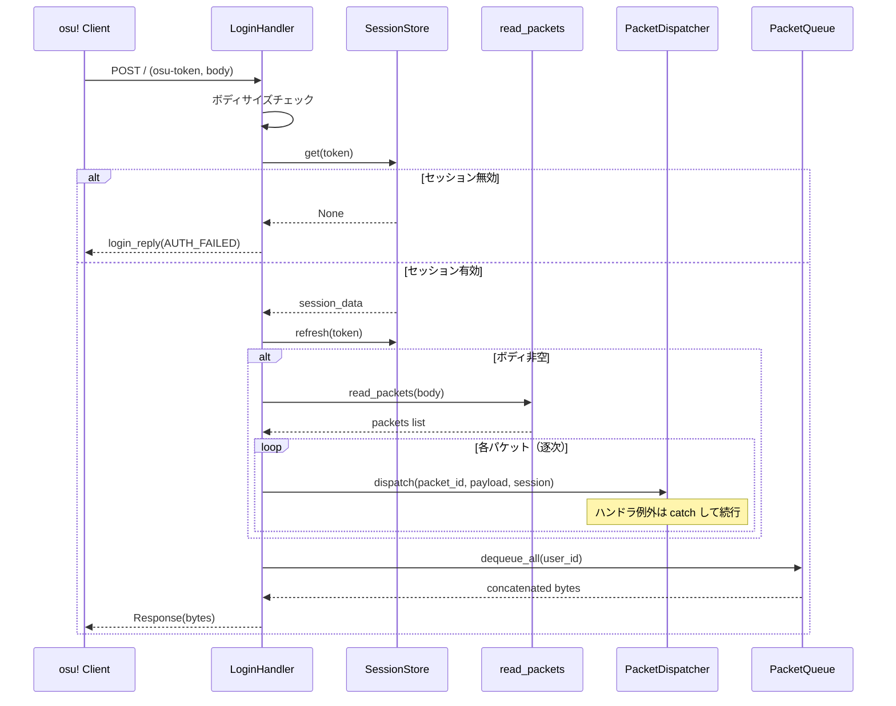
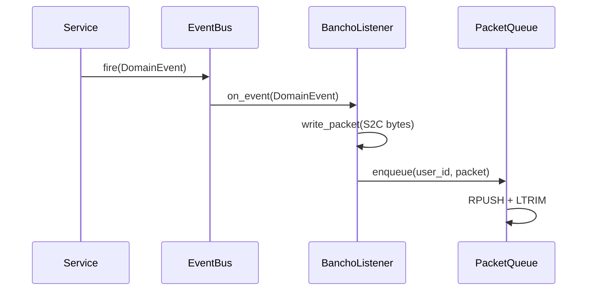

# Design Document: packet-polling

## Overview

**Purpose**: osu! stable クライアントのログイン後ポーリングパイプラインを実装し、双方向パケット通信（C2S 受信→ディスパッチ→ S2C drain→レスポンス返却）と S2C パケットキューの基盤を提供する。

**Users**: osu! stable クライアント（ログイン済みユーザー）がポーリングで S2C パケットを受信し、C2S パケットを送信する。サーバー運用者がポーリングパイプラインの動作を監視する。

**Impact**: 既存の `LoginHandler._handle_polling()` を拡張し、空レスポンスの代わりにキューに溜まった S2C パケットを返却する。セッション TTL を 3600秒→300秒に短縮する。

### Goals
- C2S パケットの受信・パース・逐次ディスパッチパイプラインの構築
- ユーザーごとの S2C パケットキュー（Redis List + Lua 原子操作）の実装
- EventBus 基盤の構築とイベント駆動配信パターンの確立
- セッション TTL の最適化（300秒）とキューとの連動

### Non-Goals
- 個別 C2S ハンドラの実装（c2s-handlers スペック）
- tourney クライアントのマルチセッション対応
- PING パケットの定期生成（バックグラウンドタスク）
- Redis Pub/Sub ベースの EventBus（マルチプロセス対応は別スペック）

## Boundary Commitments

### This Spec Owns
- `PacketQueue` インターフェースと Redis/InMemory 実装
- ポーリングハンドラの C2S→S2C パイプライン全体
- `EventBus` インターフェースと InMemory 実装
- ドメインイベントの基盤構造（`domain/events/`）
- リスナー登録パターン（`transports/bancho/listeners/`）
- セッション TTL の 300秒への変更
- リクエストボディサイズ制限

### Out of Boundary
- 個別 C2S パケットハンドラの中身（c2s-handlers スペック）
- 個別ドメインイベントの定義（各機能スペックで定義）
- 個別 BanchoEventListener の実装（各機能スペックで実装）
- Redis Pub/Sub ベースの EventBus 実装（マルチプロセス対応時）
- tourney マルチセッション対応
- PacketDispatcher のハンドラ型変更（クラス DI 化は c2s-handlers で実施）

### Allowed Dependencies
- `infrastructure/state/interfaces/session_store.py` — セッション検証・リフレッシュ
- `transports/bancho/protocol/reader.py` — `read_packets()` による C2S パケット解析
- `transports/bancho/protocol/enums.py` — `ClientPacketID` 列挙型
- `transports/bancho/dispatch.py` — `PacketDispatcher` によるハンドラディスパッチ
- `transports/bancho/protocol/s2c/login.py` — `login_reply()` による認証失敗レスポンス
- `infrastructure/di/` — DI コンテナによる依存解決
- `redis-py` — Redis クライアント（既存依存）

### Revalidation Triggers
- `PacketQueue` インターフェースの変更（メソッドシグネチャ、キー設計）
- `EventBus` のイベント購読 API の変更
- セッション TTL の変更
- ポーリングハンドラの処理順序の変更

## Architecture

### Existing Architecture Analysis
- `LoginHandler` は `__call__` で osu-token の有無を判定し、`_handle_login` / `_handle_polling` に分岐する既存パターン
- `_handle_polling` は現在セッション検証 + TTL リフレッシュのみ（空レスポンス返却）
- `read_packets()` は Caterpillar ベースで C2S バイナリストリームを `list[tuple[ClientPacketID, bytes]]` に変換済み
- `PacketDispatcher` はモジュールレベルのシングルトンで、デコレータによるハンドラ登録パターン
- `SessionStore` は Protocol + InMemory/Redis の3層構成で、Lua スクリプトによる原子操作パターンが確立済み

### Architecture Pattern & Boundary Map



**Architecture Integration**:
- **パターン**: 既存のレイヤードアーキテクチャ（Transport → Service → Domain → Infrastructure）に準拠
- **新規コンポーネント**: PacketQueue（SessionStore と同一パターン）、EventBus（Infrastructure 層）
- **既存パターン保持**: Protocol + InMemory/Redis の3層構成、Lua による原子操作、DI コンテナ登録

### Technology Stack

| Layer | Choice | Role | Notes |
|-------|--------|------|-------|
| Transport | Starlette | HTTP ハンドリング | 既存。LoginHandler 拡張 |
| Protocol | Caterpillar | C2S パケット解析 | 既存。`read_packets()` 再利用 |
| State | Redis List + Lua | S2C パケットキュー | 新規。SessionStore と同一パターン |
| Messaging | EventBus (in-memory) | イベント駆動配信 | 新規。~40行の軽量実装 |
| Infrastructure | redis-py | Redis クライアント | 既存依存 |

## File Structure Plan

### Directory Structure
```
src/osu_server/
├── domain/
│   └── events/
│       ├── __init__.py            # Event base, EventBus Protocol
│       └── base.py                # Event 基底クラス（dataclass）
├── infrastructure/
│   ├── state/
│   │   ├── interfaces/
│   │   │   └── packet_queue.py    # PacketQueue Protocol
│   │   ├── memory/
│   │   │   └── packet_queue.py    # InMemoryPacketQueue
│   │   └── redis/
│   │       └── packet_queue.py    # RedisPacketQueue（Lua スクリプト）
│   └── messaging/
│       ├── __init__.py
│       ├── interfaces.py          # EventBus Protocol
│       └── memory.py              # InMemoryEventBus
├── transports/
│   └── bancho/
│       └── listeners/
│           └── __init__.py        # リスナー登録パターンの基盤
└── config.py                      # SESSION_TTL, PACKET_QUEUE_MAX_SIZE 定数追加
```

### Modified Files
- `transports/bancho/handlers/login.py` — `_handle_polling` を拡張: C2S パース→ディスパッチ→S2C drain→レスポンス
- `infrastructure/di/providers.py` — PacketQueue と EventBus の DI 登録
- `infrastructure/state/redis/session_store.py` — TTL デフォルト値を 300秒に変更
- `config.py` — `session_ttl`, `packet_queue_max_size`, `max_request_body_size` フィールド追加

## System Flows

### ポーリングリクエストの処理フロー



### S2C パケットエンキューフロー（イベント駆動）



## Requirements Traceability

| Requirement | Summary | Components | Interfaces | Flows |
|-------------|---------|------------|------------|-------|
| 1.1 | S2C パケット返却 | LoginHandler, PacketQueue | PacketQueue.dequeue_all | ポーリングフロー |
| 1.2 | 空キューで空レスポンス | LoginHandler, PacketQueue | PacketQueue.dequeue_all | ポーリングフロー |
| 1.3 | 同時ポーリングで二重配信防止 | RedisPacketQueue | Lua スクリプト | — |
| 2.1 | C2S パケット逐次ディスパッチ | LoginHandler, PacketDispatcher | read_packets, dispatch | ポーリングフロー |
| 2.2 | 空ボディで C2S スキップ | LoginHandler | — | ポーリングフロー |
| 2.3 | 未登録パケットのスキップ | PacketDispatcher | dispatch | ポーリングフロー |
| 2.4 | C2S 処理後に S2C drain | LoginHandler | — | ポーリングフロー |
| 3.1 | ヘッダ破損で解析中止 | LoginHandler | read_packets | ポーリングフロー |
| 3.2 | ハンドラ例外でログ記録・続行 | LoginHandler, PacketDispatcher | dispatch | ポーリングフロー |
| 3.3 | ペイロードサイズ不一致で中止 | read_packets | — | ポーリングフロー |
| 3.4 | ボディサイズ上限超過で拒否 | LoginHandler | — | ポーリングフロー |
| 4.1 | ユーザーごとのキュー、複数同時投入 | PacketQueue | enqueue | エンキューフロー |
| 4.2 | 上限超過で古いパケット切り捨て | RedisPacketQueue | RPUSH + LTRIM | — |
| 4.3 | セッション不在時にパケット破棄 | PacketQueue | enqueue | — |
| 5.1 | ポーリング成功で TTL 300秒リフレッシュ | LoginHandler, SessionStore | refresh | ポーリングフロー |
| 5.2 | TTL 切れでセッション+キュークリーンアップ | Redis TTL | — | — |
| 5.3 | キュー TTL とセッション TTL の連動 | RedisPacketQueue, LoginHandler | refresh, dequeue_all | ポーリングフロー |
| 6.1 | 無効トークンで認証失敗レスポンス | LoginHandler, SessionStore | get | ポーリングフロー |
| 6.2 | トークンなしでログインフロー | LoginHandler | — | 既存フロー |
| 7.1 | イベントから S2C パケット投入 | EventBus, BanchoListener, PacketQueue | fire, enqueue | エンキューフロー |
| 8.1 | ポーリング統計のログ記録 | LoginHandler | — | ポーリングフロー |
| 8.2 | エラー詳細のログ記録 | LoginHandler | — | ポーリングフロー |
| 8.3 | 未登録パケットのデバッグログ | PacketDispatcher | — | ポーリングフロー |

## Components and Interfaces

| Component | Layer | Intent | Req Coverage | Key Dependencies | Contracts |
|-----------|-------|--------|--------------|------------------|-----------|
| PacketQueue | Infrastructure/State | ユーザーごとの S2C パケットキュー管理 | 1.1-1.3, 4.1-4.3, 5.2-5.3 | Redis (P0) | Service, State |
| LoginHandler (拡張) | Transport | ポーリングパイプライン全体 | 1.1-1.3, 2.1-2.4, 3.1-3.4, 5.1, 6.1-6.2, 8.1-8.2 | PacketQueue (P0), SessionStore (P0), PacketDispatcher (P0) | Service |
| EventBus | Infrastructure/Messaging | イベント駆動の疎結合配信 | 7.1 | なし | Service, Event |
| BanchoListenerBase | Transport/Listeners | EventBus リスナーのパターン基盤 | 7.1 | EventBus (P0), PacketQueue (P0) | Event |

### Infrastructure / State

#### PacketQueue

| Field | Detail |
|-------|--------|
| Intent | ユーザーごとの S2C パケットキューの投入・全件取り出し・サイズ制限・TTL 管理 |
| Requirements | 1.1, 1.2, 1.3, 4.1, 4.2, 4.3, 5.2, 5.3 |

**Responsibilities & Constraints**
- ユーザーごとに独立したキューを管理（キー: `packet_queue:{user_id}`）
- enqueue 時にサイズ上限（4096）を超えた古いパケットを切り捨て
- dequeue_all 時に全パケットを原子的に取り出し（Lua スクリプト）
- キューの TTL はセッション TTL（300秒）と連動

**Dependencies**
- Outbound: Redis — パケットデータの永続化 (P0)
- Outbound: SessionStore — セッション存在確認（enqueue 時、P1）

**Contracts**: Service [x] / State [x]

##### Service Interface

```python
class PacketQueue(Protocol):
    async def enqueue(self, user_id: int, *data: bytes) -> None:
        """S2C パケット（ビルド済み bytes）をキューに追加する。

        各引数が独立した1パケット。複数指定時は原子的に一括投入される。
        セッションが存在しない場合、パケットは破棄される。
        キューがサイズ上限を超えた場合、最も古いパケットから切り捨てる。
        """

    async def dequeue_all(self, user_id: int) -> bytes:
        """全パケットを drain し、連結した bytes を返す。キューは空になる。

        キューが空の場合は b"" を返す。
        同時呼び出し時、各呼び出しは排他的にパケットを取得する（二重配信なし）。
        """

    async def refresh_ttl(self, user_id: int, ttl: int) -> None:
        """キューの TTL をリフレッシュする。セッション TTL と連動して呼び出す。"""
```

##### State Management
- **Redis キー**: `packet_queue:{user_id}` (List 型)
- **TTL**: 300秒（セッションと連動）
- **サイズ上限**: 4096パケット（RPUSH 後に LTRIM で制限）
- **原子操作**: Lua スクリプトで LRANGE + DEL を一括実行

**Lua スクリプト — dequeue_all**:
```lua
-- KEYS[1] = packet_queue:{user_id}
local packets = redis.call('LRANGE', KEYS[1], 0, -1)
if #packets > 0 then
    redis.call('DEL', KEYS[1])
end
return packets
```

**Lua スクリプト — enqueue (with LTRIM)**:
```lua
-- KEYS[1] = packet_queue:{user_id}
-- ARGV[1..N] = packet bytes
-- ARGV[N+1] = max_size
-- ARGV[N+2] = ttl
for i = 1, #ARGV - 2 do
    redis.call('RPUSH', KEYS[1], ARGV[i])
end
local max_size = tonumber(ARGV[#ARGV - 1])
redis.call('LTRIM', KEYS[1], -max_size, -1)
redis.call('EXPIRE', KEYS[1], tonumber(ARGV[#ARGV]))
```

**Implementation Notes**
- InMemoryPacketQueue はテスト用。`dict[int, list[bytes]]` で実装
- Redis 実装は SessionStore の Lua パターンを踏襲
- `enqueue` の `*data` が空の場合は no-op（早期 return）

---

### Infrastructure / Messaging

#### EventBus

| Field | Detail |
|-------|--------|
| Intent | ドメインイベントの発行と購読を仲介する疎結合メッセージングバス |
| Requirements | 7.1 |

**Responsibilities & Constraints**
- 型安全なイベント発行（`fire(event)`）と購読（`subscribe(event_type, handler)`）
- 購読ハンドラは非同期（`async def`）
- 同一イベント型に複数ハンドラを登録可能
- ハンドラ実行は逐次（順序保証）
- ハンドラの例外は EventBus が catch してログ記録（fire-and-forget）

**Dependencies**
- なし（InMemory 実装は外部依存ゼロ）

**Contracts**: Service [x] / Event [x]

##### Service Interface

```python
class EventBus(Protocol):
    async def fire(self, event: object) -> None:
        """イベントを発行し、登録済みハンドラを逐次呼び出す。

        ハンドラの例外は catch してログに記録し、後続ハンドラの実行を継続する。
        """

    def subscribe(self, event_type: type, handler: Callable[..., Awaitable[None]]) -> None:
        """指定したイベント型のハンドラを登録する。

        同一イベント型に複数ハンドラを登録可能。呼び出し順序は登録順。
        """
```

##### Event Contract
- **Published events**: 本スペックではイベント型の定義のみ（具体的なイベントは各機能スペックで定義）
- **Subscribed events**: BanchoEventListeners が各イベント型を購読
- **Ordering / delivery**: 登録順に逐次実行。fire-and-forget（失敗しても再送なし）

**Implementation Notes**
- InMemoryEventBus は `dict[type, list[handler]]` で実装（~40行）
- Redis Pub/Sub 版はワーカープロセス連携時に追加（別スペック）

---

### Transport / Bancho

#### LoginHandler（ポーリング拡張）

| Field | Detail |
|-------|--------|
| Intent | `_handle_polling` を拡張し、C2S→S2C の双方向パイプラインを実装 |
| Requirements | 1.1-1.3, 2.1-2.4, 3.1-3.4, 5.1, 6.1-6.2, 8.1-8.2 |

**Responsibilities & Constraints**
- ボディサイズ制限の検証
- セッション検証と TTL リフレッシュ
- C2S パケットのパースと逐次ディスパッチ
- S2C パケットキューの drain とレスポンス構築
- 全処理の構造化ログ記録

**Dependencies**
- Inbound: osu! Client — HTTP リクエスト (P0)
- Outbound: SessionStore — セッション検証・リフレッシュ (P0)
- Outbound: PacketQueue — S2C パケット drain + TTL リフレッシュ (P0)
- Outbound: PacketDispatcher — C2S パケットディスパッチ (P0)
- Outbound: read_packets — C2S バイナリ解析 (P0)

**Contracts**: Service [x]

##### Service Interface

```python
async def _handle_polling(self, request: Request) -> Response:
    """ポーリングリクエストの処理パイプライン。

    処理順序:
    1. ボディサイズチェック（上限超過で拒否）
    2. セッション検証（無効なら AUTH_FAILED）
    3. セッション TTL リフレッシュ
    4. C2S パケットのパースと逐次ディスパッチ（ボディ非空時）
    5. S2C パケットキューの drain
    6. パケットキュー TTL リフレッシュ
    7. レスポンス返却（連結 bytes）
    """
```

**Implementation Notes**
- `LoginHandler.__init__` に `PacketQueue` と `PacketDispatcher` の依存を追加
- `read_packets` の `PacketReadError` を catch して残パケットをスキップ（Req 3.1, 3.3）
- 各ハンドラの例外を `try/except` で catch して structured log 記録・続行（Req 3.2）
- ポーリング統計ログ: `c2s_count`, `s2c_count`, `elapsed_ms`（Req 8.1）

---

#### BanchoListenerBase

| Field | Detail |
|-------|--------|
| Intent | EventBus リスナーの共通パターンを提供。具体的なリスナーは各機能スペックで実装 |
| Requirements | 7.1 |

**Responsibilities & Constraints**
- EventBus へのリスナー登録パターンの確立
- PacketQueue への S2C パケット投入の共通フロー
- 具体的なイベント型→S2C パケット変換は各リスナーの責務

**Dependencies**
- Inbound: EventBus — イベント通知 (P0)
- Outbound: PacketQueue — S2C パケット投入 (P0)

**Implementation Notes**
- `transports/bancho/listeners/__init__.py` にリスナー登録の `setup_listeners(eventbus, packet_queue)` 関数を定義
- 各リスナークラスは `__init__(self, packet_queue: PacketQueue)` でキューを受け取る
- 具体的なリスナー実装（BanchoChatListener 等）は c2s-handlers 以降のスペックで追加

## Data Models

### Key-Value Store (Redis)

**パケットキュー**:
| Key Pattern | Type | Value | TTL |
|-------------|------|-------|-----|
| `packet_queue:{user_id}` | List | S2C パケット bytes の配列 | 300秒（セッション連動） |

**既存キー（変更あり）**:
| Key Pattern | Type | 変更点 |
|-------------|------|--------|
| `session:{token}` | String | TTL: 3600秒 → 300秒 |
| `user_session:{user_id}` | String | TTL: 3600秒 → 300秒 |

### Domain Events

```python
@dataclass(slots=True)
class Event:
    """ドメインイベントの基底クラス。全イベントはこれを継承する。"""
    pass
```

具体的なイベント型（`ChatMessageSent`, `UserPresenceUpdated` 等）は各機能スペックで `domain/events/` 配下に定義する。

## Error Handling

### Error Strategy
- **境界防御**: ボディサイズ上限でメモリ枯渇を防止
- **部分実行**: ヘッダ破損で後続パケットをスキップするが、処理済みパケットの結果は保持
- **障害隔離**: ハンドラ例外は個別に catch し、他のパケット処理に影響させない
- **fire-and-forget**: EventBus のリスナー例外は catch してログ記録のみ

### Error Categories and Responses

| Error | Category | Response | Log Level |
|-------|----------|----------|-----------|
| ボディサイズ超過 | 入力検証 | 空レスポンス（パケット処理なし） | warning |
| トークン無効/期限切れ | 認証 | `login_reply(AUTH_FAILED)` | warning |
| C2S ヘッダ破損 | プロトコル | 処理済み分 + S2C drain の結果を返却 | error |
| C2S ペイロードサイズ不一致 | プロトコル | 同上 | error |
| C2S ハンドラ例外 | ハンドラ | 例外をスキップして後続パケット処理を継続 | error |
| EventBus リスナー例外 | リスナー | 例外をスキップして後続リスナー実行を継続 | error |

### Monitoring
- ポーリング統計: `polling_complete` イベントに `c2s_count`, `s2c_count`, `elapsed_ms` を付与
- エラー詳細: `c2s_parse_error`, `c2s_handler_error` イベントに `packet_id`, `payload_size`, `exc_info` を付与
- 未登録パケット: `c2s_unhandled` イベント（既存の PacketDispatcher ログを活用）

## Testing Strategy

### Unit Tests
1. **RedisPacketQueue.enqueue**: 単一・複数パケット投入、サイズ上限での LTRIM、TTL 設定の検証
2. **RedisPacketQueue.dequeue_all**: 全パケット取得と連結、空キューで `b""` 返却、原子性（並行 drain で二重配信なし）
3. **InMemoryPacketQueue**: 全メソッドの基本動作（テストダブルとしての正確性）
4. **InMemoryEventBus**: fire/subscribe の基本動作、ハンドラ例外の隔離、登録順の逐次実行
5. **read_packets エラーハンドリング**: ヘッダ破損時の PacketReadError、ペイロードサイズ不一致

### Integration Tests
1. **ポーリングパイプライン全体**: 有効トークンで C2S パケット送信 → ハンドラ実行 → S2C パケット返却の E2E フロー
2. **セッション TTL リフレッシュ**: ポーリング成功時にセッションとキューの両方の TTL がリセットされること
3. **無効トークンの拒否**: 期限切れ/不正トークンで AUTH_FAILED が返却されること
4. **ボディサイズ上限**: 上限超過リクエストでパケット処理がスキップされること
5. **C2S エラー耐性**: ヘッダ破損パケット後の正常なハンドラ実行スキップ + S2C drain 動作

### Performance
1. **PacketQueue throughput**: 1000パケット enqueue + dequeue_all のレイテンシが 10ms 以下
2. **並行ポーリング**: 同一ユーザーへの並行リクエストで二重配信が発生しないこと
3. **大量パケットの LTRIM**: 4096超のパケット投入時の LTRIM 動作確認
