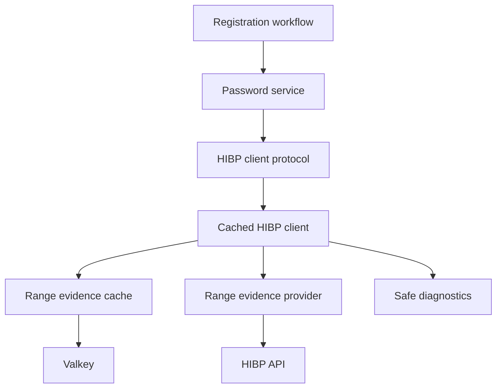
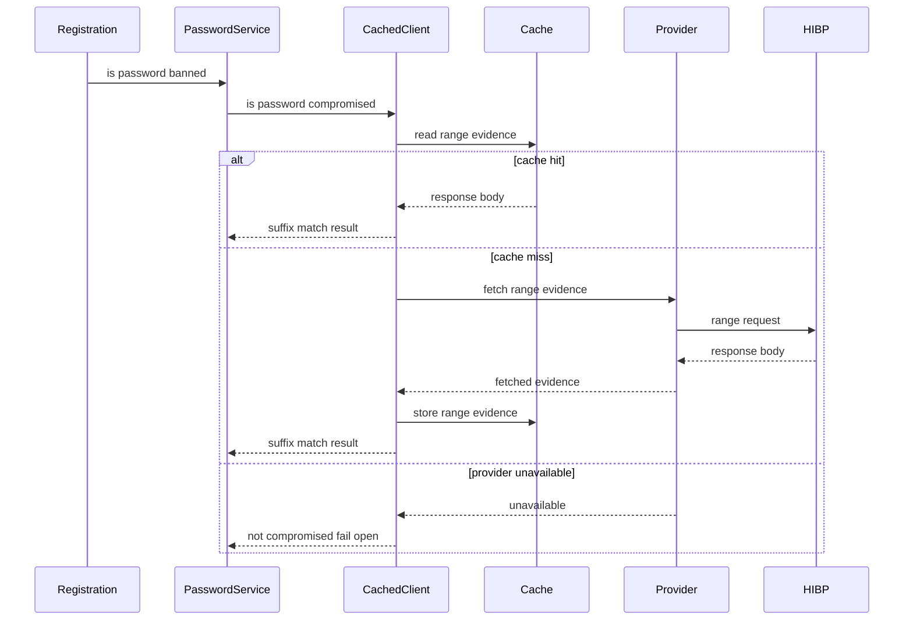

# Design Document

## Overview

password-safety-check-cache は、公開 registration の Password Safety Check を同期ガードのまま維持しながら、HIBP range evidence の再利用と短い外部待機上限により登録レスポンスを安定させる。対象 user は登録利用者であり、operator は安全な diagnostics から cache hit、timeout、fail-open を観測する。

この設計は、`PasswordService` から見える `HIBPClient` contract を変えず、HIBP range fetch、range body cache、fail-open diagnostics を infrastructure 境界に閉じ込める。dev CLI の Administrative Password Reset は外部 evidence 依存にしない。

### Goals

- 公開 registration の Password Safety Check を account creation 前の同期ガードとして維持する。
- HIBP range evidence を 24時間 freshness で再利用し、cache hit 時に外部 provider 待ちを避ける。
- cache miss 時の外部 provider 待機を HIBP 専用 1.0秒 timeout に制限する。
- HIBP/cache unavailable 時は external compromised-password check のみ fail-open し、operator-visible diagnostics を残す。
- Password-derived data を log、worker payload、diagnostics に露出しない。

### Non-Goals

- Worker-side post-registration password audit。
- Self-Service Password Change API / WebUI の concrete public interface。
- Administrative Password Reset / dev CLI rename。
- 同一 prefix request の distributed lock または singleflight。
- HIBP 以外の compromised-password provider 追加。

## Boundary Commitments

### This Spec Owns

- `HIBPClient` の production 実装を cache-aware にする infrastructure behavior。
- HIBP range evidence の cache read/write contract、24時間 TTL、cache failure semantics。
- HIBP range provider の 1.0秒 timeout と HTTP failure classification。
- Password Safety Check diagnostics の safe category と sensitive-field defense-in-depth。
- app runtime provider で cached HIBP implementation を構成すること。
- registration / validation-only registration が同じ Password Safety Check semantics を維持すること。

### Out of Boundary

- `PasswordService` の public method contract 変更。
- registration handler response shape の変更。
- worker jobs、taskiq payload、post-registration audit。
- dev CLI Administrative Password Reset を HIBP/cache availability に依存させること。
- current-password proof を含む Self-Service Password Change use-case の実装。
- HIBP range request coalescing、distributed lock、rate-limit backoff policy。

### Allowed Dependencies

- `PasswordService` は既存通り `HIBPClient` Protocol にだけ依存する。
- `CachedHIBPClient` は infrastructure 内で `HIBPRangeProvider`、`HIBPRangeCache`、`structlog`、standard `hashlib` に依存できる。
- `HTTPHIBPRangeProvider` は existing `httpx` 0.28.1 `AsyncClient` に依存できる。
- `HTTPHIBPRangeProvider` は HIBP API contract として fixed `User-Agent` request header を送信できる。
- `ValkeyHIBPRangeCache` は existing `valkey-glide` 2.4.0 `GlideClient` と `ExpirySet` に依存できる。
- composition provider は `AppConfig`、`httpx.AsyncClient`、`GlideClient` から production `HIBPClient` を構成できる。
- Tests は typed fake/stub を使い、`AsyncMock` を使わない。

Forbidden dependencies:

- Domain code must not import HIBP, Valkey, httpx, taskiq, Dishka, or SQLAlchemy.
- Jobs must not participate in Password Safety Check decisions for this feature.
- Repositories must not perform HIBP HTTP calls or own HIBP cache behavior.
- Diagnostics must not include password text, SHA-1 prefix, SHA-1 suffix, HIBP response body, or cached verdict.

### Revalidation Triggers

- `HIBPClient.is_password_compromised()` signature or return semantics change.
- Registration starts exposing provider timeout/failure details to users.
- A public Self-Service Password Change API is added.
- Administrative Password Reset becomes exposed through a production admin API.
- HIBP range cache key/value shape, TTL, or fail-open semantics change.
- HIBP range request header contract changes.
- Taskiq/job payloads are proposed for password safety decisions.
- `httpx` or `valkey-glide` major version changes alter verified method signatures.

## Architecture

### Existing Architecture Analysis

Athena already performs registration validation in `AuthService.register()` before durable user creation. `PasswordService.is_password_banned()` checks custom banned passwords first, then calls `HIBPClient`. This preserves the synchronous gate required by 1.1 through 1.6.

The missing behavior is below the `HIBPClient` boundary: current `HTTPHIBPClient` performs direct HTTP fetch and suffix matching with no cache, no explicit per-HIBP timeout, and only coarse HTTP fail-open behavior. Existing Valkey usage shows focused adapters with key helpers and TTL-bearing state, but there is no generic cache abstraction to reuse.

### Architecture Pattern & Boundary Map

Selected pattern: **cached infrastructure facade behind a stable service-facing Protocol**.



Key decisions:

- `PasswordService` and registration command flow do not learn about cache, HIBP prefix, provider timeout, or Valkey.
- `CachedHIBPClient` owns the password-to-SHA1 split in request-local memory and never stores suffix or final safe verdict.
- `HTTPHIBPRangeProvider` fetches only range response bodies for SHA-1 prefixes and classifies timeout vs unavailable.
- `ValkeyHIBPRangeCache` stores successful range response bodies by prefix key with 24 hour TTL.

### Technology Stack

| Layer | Choice / Version | Role in Feature | Notes |
| --- | --- | --- | --- |
| Backend / Services | Python 3.14 dataclasses and Protocols | Preserve typed identity service contracts | No Pydantic in domain |
| Configuration | pydantic-settings existing `AppConfig` | HIBP timeout and range cache TTL defaults | Config edit required |
| HTTP | `httpx` 0.28.1 | HIBP range provider | `AsyncClient.get(timeout=...)`; fixed `User-Agent` header required by HIBP |
| Cache / State | `valkey-glide` 2.4.0 | 24h range response cache | `set(..., expiry=ExpirySet(...))` verified locally |
| Composition | Dishka provider graph | Wire cached HIBP production dependency | Test override remains `HIBPClient` |
| Observability | structlog existing pipeline | Safe outcome diagnostics | No password-derived fields |

No new third-party dependency is introduced.

## File Structure Plan

### Directory Structure

```text
src/osu_server/
├── config.py
├── domain/
│   └── identity/
│       └── passwords.py
├── services/
│   ├── commands/
│   │   └── identity/
│   │       ├── auth_service.py
│   │       └── change_password.py
│   └── queries/
│       └── identity/
│           └── password_service.py
├── infrastructure/
│   ├── cache/
│   │   └── hibp_range_cache.py
│   ├── logging.py
│   └── security/
│       └── hibp.py
└── composition/
    ├── management.py
    └── providers/
        └── infrastructure.py

tests/
├── factories/
│   └── config.py
└── unit/
    ├── infrastructure/
    │   ├── cache/
    │   │   └── test_hibp_range_cache.py
    │   ├── test_config.py
    │   ├── test_hibp.py
    │   └── test_logging.py
    ├── composition/
    │   └── test_common_provider_graph.py
    └── services/
        └── test_auth_service.py
```

### New Files

- `src/osu_server/infrastructure/cache/hibp_range_cache.py` — `ValkeyHIBPRangeCache` and `HIBPRangeCache` implementation boundary; owns key format, text encoding/decoding, 24h TTL storage call, and cache unavailable statuses.
- `tests/unit/infrastructure/cache/test_hibp_range_cache.py` — verifies cache hit, miss, set-with-expiry, decode, and unavailable behavior using typed fakes.

### Modified Files

- `src/osu_server/infrastructure/security/hibp.py` — define or preserve `HIBPClient`, add `CachedHIBPClient`, `HIBPRangeProvider`, `HTTPHIBPRangeProvider`, and typed cache/fetch result values.
- `src/osu_server/composition/providers/infrastructure.py` — `InfrastructureProviderSet` provides `HIBPRangeCache`, `HTTPHIBPRangeProvider`, and cached production `HIBPClient` from `AppConfig`, `httpx.AsyncClient`, and `GlideClient`.
- `src/osu_server/config.py` — `AppConfig` adds `hibp_timeout_seconds: float = 1.0` and `hibp_range_cache_ttl_seconds: int = 86_400` with range validation that preserves the required upper bounds.
- `src/osu_server/infrastructure/logging.py` — `SafeDiagnostics` defense-in-depth: add sensitive key masks for SHA-1 and HIBP response field names.
- `tests/factories/config.py` — add typed factory parameters for the new config values.
- `tests/unit/infrastructure/test_config.py` — verify defaults and reject non-positive or above-cap HIBP timeout/cache TTL values.
- `tests/unit/infrastructure/test_hibp.py` — refocus tests on cache hit, cache miss, fetch timeout/unavailable, suffix matching, current evidence despite cache write failure, and safe diagnostics.
- `tests/unit/infrastructure/test_logging.py` — verify new sensitive keys are masked.
- `tests/unit/composition/test_common_provider_graph.py` — verify app provider graph resolves production cached HIBP dependencies and test override remains simple.
- `tests/unit/services/test_auth_service.py` — add validation-only registration coverage for Password Safety Check where useful; existing banned password tests remain.

### Referenced Existing Files

- `src/osu_server/services/queries/identity/password_service.py` — `PasswordService` remains the service-facing Password Safety Check boundary and is not made cache-aware.
- `src/osu_server/services/commands/identity/auth_service.py` — `AuthService` remains the synchronous registration caller and keeps validation-only behavior aligned with account-creating registration.
- `src/osu_server/domain/identity/passwords.py` — existing local password policy remains fail-closed and is not moved into HIBP/cache infrastructure.
- `src/osu_server/services/commands/identity/change_password.py` — existing change-password use-case is adjacent context only; a public Self-Service Password Change API remains out of boundary.
- `src/osu_server/composition/management.py` — Administrative Password Reset/dev tooling remains external-evidence-free through `PasswordService(hibp_client=None, ...)`.

## System Flows

### Registration Password Safety Check



Flow decisions:

- Cache read failure falls through to provider fetch within the same 1.0 second HIBP wait cap.
- Cache write failure does not discard current fetched evidence.
- Provider timeout/unavailable returns external false only for the compromised-password portion; local policy and custom banned list remain mandatory.

## Requirements Traceability

| Requirement | Summary | Components | Interfaces | Flows |
| --- | --- | --- | --- | --- |
| 1.1 | registration waits for Password Safety Check | `AuthService`, `PasswordService`, `CachedHIBPClient` | `HIBPClient` | Registration Password Safety Check |
| 1.2 | local policy rejects | `AuthService`, domain password policy | existing registration result | Registration Password Safety Check |
| 1.3 | custom banned list rejects | `PasswordService` | existing `is_password_banned()` | Registration Password Safety Check |
| 1.4 | compromised evidence rejects | `CachedHIBPClient`, `PasswordService` | `HIBPClient` | Registration Password Safety Check |
| 1.5 | validation-only uses same outcome | `AuthService`, `PasswordService` | registration command input | Registration Password Safety Check |
| 1.6 | no worker audit source of truth | Boundary commitments | no job contract | none |
| 2.1 | fresh evidence avoids provider wait | `CachedHIBPClient`, `ValkeyHIBPRangeCache` | `HIBPRangeCache` | Registration Password Safety Check |
| 2.2 | evidence fresh for max 24h | `ValkeyHIBPRangeCache`, `AppConfig` | cache TTL setting | Registration Password Safety Check |
| 2.3 | stale evidence not used as fresh | `ValkeyHIBPRangeCache` | Valkey TTL expiry | Registration Password Safety Check |
| 2.4 | provider wait cap 1.0s | `HTTPHIBPRangeProvider`, `AppConfig` | `HIBPRangeProvider` | Registration Password Safety Check |
| 2.5 | safe evidence allows remaining rules | `CachedHIBPClient`, `PasswordService` | `HIBPClient` | Registration Password Safety Check |
| 3.1 | provider unavailable fail-open | `HTTPHIBPRangeProvider`, `CachedHIBPClient` | fetch status | Registration Password Safety Check |
| 3.2 | cache read unavailable then provider attempt | `CachedHIBPClient`, `ValkeyHIBPRangeCache` | cache read status | Registration Password Safety Check |
| 3.3 | cache write unavailable still uses evidence | `CachedHIBPClient`, `ValkeyHIBPRangeCache` | cache store status | Registration Password Safety Check |
| 3.4 | cache and provider unavailable allow local-pass registration | `CachedHIBPClient`, `PasswordService` | `HIBPClient` false fail-open | Registration Password Safety Check |
| 3.5 | fail-open operator visibility | `CachedHIBPClient` diagnostics | structlog event categories | Registration Password Safety Check |
| 4.1 | self-service requires current password | Boundary commitments | future self-service contract | none |
| 4.2 | self-service uses Password Safety Check | Boundary commitments, `PasswordService` | `HIBPClient` | none |
| 4.3 | admin reset current proof not required | `composition/management.py` unchanged | dev CLI management path | none |
| 4.4 | admin reset external evidence not required | `composition/management.py` unchanged | `hibp_client=None` | none |
| 4.5 | no dev tooling rename | File Structure Plan | no CLI contract change | none |
| 5.1 | diagnostics categories | `CachedHIBPClient` | structlog event categories | Registration Password Safety Check |
| 5.2 | diagnostics omit derived data | `CachedHIBPClient`, logging mask | safe fields only | Registration Password Safety Check |
| 5.3 | no worker payload material | Boundary commitments | no job contract | none |
| 5.4 | compromised rejection hides evidence details | `AuthService`, `PasswordService` | existing validation error | Registration Password Safety Check |
| 5.5 | fail-open hides provider details from user | `CachedHIBPClient`, `AuthService` | existing success response | Registration Password Safety Check |

## Components and Interfaces

| Component | Domain / Layer | Intent | Req Coverage | Key Dependencies | Contracts |
| --- | --- | --- | --- | --- | --- |
| `PasswordService` | services / identity | Preserve password policy, custom banned list, and service-facing HIBP call | 1.1, 1.3, 1.4, 2.5, 4.2 | `HIBPClient` P0 | Service |
| `CachedHIBPClient` | infrastructure / security | Resolve compromised-password verdict from cache or provider with fail-open semantics | 1.4, 2.1, 2.5, 3.1, 3.2, 3.3, 3.4, 3.5, 5.1, 5.2 | `HIBPRangeCache` P0, `HIBPRangeProvider` P0 | Service |
| `HTTPHIBPRangeProvider` | infrastructure / security | Fetch HIBP range response body with 1.0s HIBP timeout | 2.4, 3.1 | `httpx.AsyncClient` P0 | Service |
| `ValkeyHIBPRangeCache` | infrastructure / cache | Store and read HIBP range bodies with 24h TTL | 2.1, 2.2, 2.3, 3.2, 3.3 | `GlideClient` P0 | State |
| `InfrastructureProviderSet` | composition | Wire production cached HIBP graph | 2.1, 2.2, 2.4 | `AppConfig` P0, runtime clients P0 | Service |
| `AppConfig` | configuration | Own operator-tunable HIBP timeout and TTL defaults | 2.2, 2.4 | pydantic-settings P0 | State |
| `SafeDiagnostics` | infrastructure / logging | Emit categories without password-derived values | 3.5, 5.1, 5.2, 5.4, 5.5 | structlog P0 | Event |

### Identity Service Layer

#### `PasswordService`

| Field | Detail |
| --- | --- |
| Intent | Keep Password Safety Check orchestration at the existing password service boundary |
| Requirements | 1.1, 1.3, 1.4, 2.5, 4.2 |

**Responsibilities & Constraints**

- Continue checking custom banned-password list before calling HIBP.
- Continue returning `True` only when password is banned by local list or HIBP verdict.
- Does not know cache state, SHA-1 prefix/suffix, Valkey, HTTP timeout, or diagnostics categories.

**Dependencies**

- Outbound: `HIBPClient` — compromised-password evidence verdict (P0).
- Outbound: domain password policy — format validation stays in existing domain policy (P0).

**Contracts**: Service [x] / API [ ] / Event [ ] / Batch [ ] / State [ ]

##### Service Interface

```python
class PasswordService:
    async def is_password_banned(self, password: str) -> bool: ...
```

- Preconditions: `password` is the plaintext candidate password received by registration or future self-service password change.
- Postconditions: returns `True` for custom-list hit or compromised evidence match.
- Invariants: custom list is checked before HIBP; no password-derived data is logged by this method beyond existing safe source categories.

### Infrastructure Security Layer

#### `CachedHIBPClient`

| Field | Detail |
| --- | --- |
| Intent | Implement `HIBPClient` with cache-first range evidence resolution |
| Requirements | 1.4, 2.1, 2.5, 3.1, 3.2, 3.3, 3.4, 3.5, 5.1, 5.2 |

**Responsibilities & Constraints**

- Compute SHA-1 prefix/suffix in request-local memory only.
- Read range body from cache first.
- Fetch from provider only on cache miss or cache read unavailable.
- Store only successful provider response bodies.
- Use current fetched evidence even if cache write fails.
- Return `False` on provider timeout/unavailable after local checks have passed, implementing fail-open.
- Log only safe outcome categories.

**Dependencies**

- Inbound: `PasswordService` through `HIBPClient` Protocol (P0).
- Outbound: `HIBPRangeCache` — range evidence cache (P0).
- Outbound: `HIBPRangeProvider` — external range fetch (P0).
- External: `hashlib` — SHA-1 derivation (P0).
- External: structlog — safe diagnostics (P1).

**Contracts**: Service [x] / API [ ] / Event [ ] / Batch [ ] / State [ ]

##### Service Interface

```python
class HIBPClient(Protocol):
    async def is_password_compromised(self, password: str) -> bool: ...

class CachedHIBPClient:
    def __init__(
        self,
        *,
        range_cache: HIBPRangeCache,
        range_provider: HIBPRangeProvider,
        cache_ttl_seconds: int,
    ) -> None: ...

    async def is_password_compromised(self, password: str) -> bool: ...
```

- Preconditions: `cache_ttl_seconds > 0`; `password` is never logged.
- Postconditions: returns `True` only when available range evidence contains the suffix.
- Invariants: prefix, suffix, response body, and safe verdict are never logged; no worker payload is created.

#### `HTTPHIBPRangeProvider`

| Field | Detail |
| --- | --- |
| Intent | Fetch HIBP range evidence body with a HIBP-specific timeout |
| Requirements | 2.4, 3.1 |

**Responsibilities & Constraints**

- Fetch `https://api.pwnedpasswords.com/range/{prefix}` with per-request timeout.
- Send a fixed `User-Agent` request header on every HIBP range request.
- Return typed status for fetched, timeout, and unavailable.
- Never perform suffix matching or cache storage.

**Dependencies**

- Inbound: `CachedHIBPClient` (P0).
- Outbound: `httpx.AsyncClient` — HTTP request execution (P0).
- External: HIBP Pwned Passwords range API — compromised-password evidence source (P0).

**Contracts**: Service [x] / API [ ] / Event [ ] / Batch [ ] / State [ ]

##### Service Interface

```python
class HIBPRangeFetchStatus(StrEnum):
    FETCHED = "fetched"
    TIMEOUT = "timeout"
    UNAVAILABLE = "unavailable"

@dataclass(slots=True, frozen=True)
class HIBPRangeFetchResult:
    status: HIBPRangeFetchStatus
    body: str | None = None

class HIBPRangeProvider(Protocol):
    async def fetch_range(self, prefix: str) -> HIBPRangeFetchResult: ...
```

- Preconditions: `prefix` is a five-character uppercase SHA-1 prefix produced by `CachedHIBPClient`.
- Postconditions: `FETCHED` includes response body; failure statuses include no body.
- Invariants: no prefix logging; no suffix awareness; request headers contain no password-derived data.

### Infrastructure Cache Layer

#### `ValkeyHIBPRangeCache`

| Field | Detail |
| --- | --- |
| Intent | Store successful HIBP range response bodies by prefix with TTL |
| Requirements | 2.1, 2.2, 2.3, 3.2, 3.3 |

**Responsibilities & Constraints**

- Own key format `hibp:range:{prefix}`.
- Return cache hit/miss/unavailable status without raising to callers for normal fail-open paths.
- Store response body with `ExpirySet(ExpiryType.SEC, ttl_seconds)`.
- Decode bytes from Valkey as UTF-8 text.
- Never log keys or values.

**Dependencies**

- Inbound: `CachedHIBPClient` (P0).
- Outbound: `GlideClient` — Valkey read/write (P0).
- External: `valkey-glide` `ExpirySet` / `ExpiryType.SEC` — TTL set operation (P0).

**Contracts**: Service [ ] / API [ ] / Event [ ] / Batch [ ] / State [x]

##### State Management

```python
class HIBPRangeCacheReadStatus(StrEnum):
    HIT = "hit"
    MISS = "miss"
    UNAVAILABLE = "unavailable"

@dataclass(slots=True, frozen=True)
class HIBPRangeCacheReadResult:
    status: HIBPRangeCacheReadStatus
    body: str | None = None

class HIBPRangeCacheStoreStatus(StrEnum):
    STORED = "stored"
    UNAVAILABLE = "unavailable"

class HIBPRangeCache(Protocol):
    async def read_range(self, prefix: str) -> HIBPRangeCacheReadResult: ...
    async def store_range(
        self,
        prefix: str,
        body: str,
        ttl_seconds: int,
    ) -> HIBPRangeCacheStoreStatus: ...
```

- State model: key-value string where key is `hibp:range:{prefix}` and value is HIBP range response text.
- Persistence & consistency: best-effort cache only; Valkey is not source of truth for password safety.
- Concurrency strategy: no distributed lock in this spec; concurrent misses may fetch the same range.

### Runtime Composition Layer

#### `InfrastructureProviderSet`

| Field | Detail |
| --- | --- |
| Intent | Build cached HIBP production dependency graph |
| Requirements | 2.1, 2.2, 2.4, 3.2, 3.3 |

**Responsibilities & Constraints**

- Provide `HIBPRangeCache` from app-scope `GlideClient`.
- Provide `HIBPRangeProvider` from app-scope `httpx.AsyncClient` and `AppConfig.hibp_timeout_seconds`.
- Provide `HIBPClient` as `CachedHIBPClient`.
- Preserve `make_in_memory_runtime_provider_set()` override behavior by keeping the service-facing replacement at `HIBPClient`.

**Dependencies**

- Inbound: Dishka app/worker containers (P0).
- Outbound: `AppConfig`, `GlideClient`, `httpx.AsyncClient` (P0).

**Contracts**: Service [x] / API [ ] / Event [ ] / Batch [ ] / State [ ]

### Configuration

#### `AppConfig`

| Field | Detail |
| --- | --- |
| Intent | Expose operational defaults for HIBP wait cap and evidence freshness |
| Requirements | 2.2, 2.4 |

**State Management**

- `hibp_timeout_seconds: float = 1.0`
- `hibp_range_cache_ttl_seconds: int = 86_400`
- `hibp_timeout_seconds` must satisfy `0 < value <= 1.0`.
- `hibp_range_cache_ttl_seconds` must satisfy `0 < value <= 86_400`.
- These fields are operationally tunable only within the requirement caps; longer external waits or freshness windows require requirements/design revalidation.

Implementation changes to `AppConfig` are project-wide config changes and must be reviewed as such during implementation.

### Observability

#### `SafeDiagnostics`

| Field | Detail |
| --- | --- |
| Intent | Make cache/fail-open behavior operator-visible without exposing derived secrets |
| Requirements | 3.5, 5.1, 5.2, 5.4, 5.5 |

**Event Contract**

- Event name: `password_safety_evidence_check`
- Allowed fields:
  - `status`: `cache_hit`, `cache_miss`, `fetched`, `timeout`, `unavailable`, `cache_read_unavailable`, `cache_write_unavailable`, `fail_open`
  - `source`: `cache`, `hibp`, `local`
  - `log_level`: existing structlog processor output
- Forbidden fields:
  - `password`, `password_hash`, `password_md5`
  - `sha1`, `sha1_prefix`, `sha1_suffix`
  - `hibp_response`, `hibp_response_body`, `hibp_range_body`
  - `cache_key`, `verdict`

The user-facing registration result remains unchanged. Provider failure details are operator diagnostics only.

## Data Models

### Domain Model

No domain model changes are introduced. `Password Safety Check`, `Self-Service Password Change`, and `Administrative Password Reset` are glossary concepts only for this feature.

### Logical Data Model

- HIBP range evidence is ephemeral cache data.
- It is not command/query persistence and is not part of user identity state.
- Cache miss or cache outage must not mutate user data.

### Physical Data Model

Key-value cache:

| Field | Value |
| --- | --- |
| Key pattern | `hibp:range:{prefix}` |
| Value | HIBP range response body text |
| TTL | `hibp_range_cache_ttl_seconds`, default `86_400` |
| Owner | `ValkeyHIBPRangeCache` |
| Source of truth | No. HIBP remains external evidence source |

The key includes the SHA-1 prefix required by the HIBP k-anonymity range API. The key must not be logged or surfaced in diagnostics.

## Error Handling

### Error Strategy

- Local password policy and custom banned list remain fail-closed.
- Cache read failure: log safe diagnostic, attempt external fetch.
- External timeout: log safe diagnostic, fail open for external compromised-password evidence.
- External unavailable or non-success HTTP: log safe diagnostic, fail open for external compromised-password evidence.
- Cache write failure after fetched evidence: log safe diagnostic, use current fetched evidence for the current decision.
- Unexpected cache/provider exceptions: convert to unavailable status at infrastructure boundary and fail open.

### Error Categories and Responses

| Category | User-visible response | Operator diagnostic | Requirement |
| --- | --- | --- | --- |
| Local policy violation | Password validation error | existing validation context | 1.2 |
| Custom banned password | Password validation error | `password_banned source=custom_list` | 1.3 |
| Compromised evidence match | Password validation error | `password_banned source=hibp` plus safe evidence status | 1.4, 5.4 |
| Cache unavailable | No response change | `password_safety_evidence_check status=cache_read_unavailable` | 3.2, 5.1 |
| Provider timeout | No response change if local checks pass | `password_safety_evidence_check status=timeout` and `fail_open` | 2.4, 3.1, 5.5 |
| Provider unavailable | No response change if local checks pass | `password_safety_evidence_check status=unavailable` and `fail_open` | 3.1, 3.4 |

### Monitoring

No metrics system is added in this spec. Structured logs are the operator-observable surface. Future metrics can derive counters from the safe status categories without adding password-derived labels.

## Testing Strategy

### Unit Tests

- `CachedHIBPClient` cache hit: verifies cached body is used, provider is not called, and suffix match controls the verdict (`2.1`, `1.4`).
- `CachedHIBPClient` cache miss: verifies provider fetch is attempted, successful body is stored with TTL, and safe evidence allows the caller to continue when suffix is absent (`2.2`, `2.5`).
- `CachedHIBPClient` provider timeout/unavailable: verifies fail-open false return and safe diagnostics without prefix/suffix/body (`2.4`, `3.1`, `3.4`, `5.1`, `5.2`).
- `CachedHIBPClient` cache read/write unavailable: verifies read failure falls through to provider and write failure still uses current evidence (`3.2`, `3.3`).
- `HTTPHIBPRangeProvider` request contract: verifies the HIBP request uses the configured 1.0 second timeout and sends the fixed `User-Agent` header (`2.4`, `3.1`).
- `ValkeyHIBPRangeCache` typed fake tests: verify `get`, `set`, `ExpirySet(ExpiryType.SEC, ttl)`, UTF-8 decode, miss, and unavailable statuses (`2.1`, `2.2`, `2.3`).
- `AppConfig` tests: verify default `1.0` / `86_400` values and reject non-positive or above-cap values (`2.2`, `2.4`).
- `mask_sensitive_fields` tests: verify SHA-1 and HIBP body field names are masked if accidentally logged (`5.2`).

### Integration Tests

- Provider graph resolves cached production `HIBPClient` with `HIBPRangeCache` and `HIBPRangeProvider`, while explicit test override can replace `HIBPClient` without constructing production HIBP behavior (`2.1`, `2.4`).
- Registration validation-only mode uses the same `PasswordService.is_password_banned()` outcome as account-creating registration (`1.5`).
- Existing registration rejection for compromised password still returns password validation error without evidence details (`1.4`, `5.4`).

### E2E Tests

No new e2e test is required. The critical user-visible registration behavior is already covered by registration/unit/integration flow tests, and this feature changes infrastructure latency behavior rather than response shape.

### Performance / Load

- Unit-level timing should assert timeout parameter is passed to `HTTPHIBPRangeProvider`; tests should not sleep for 1.0 seconds.
- Unit-level request contract tests should assert the fixed `User-Agent` header is present without requiring a network call.
- No singleflight load test is required because request coalescing is out of boundary.

## Security Considerations

- Plaintext password exists only in the existing request-local registration/password-service path.
- SHA-1 prefix and suffix are derived in request-local memory inside `CachedHIBPClient`.
- Only HIBP range response body is cached; plaintext password, full SHA-1, suffix, and per-password verdict are not cached.
- Worker payloads are not used for this feature.
- Logs must use category-only diagnostics and must not include prefix, suffix, response body, cache key, or verdict.

## Performance & Scalability

- Cache hit path avoids external HIBP wait and uses one Valkey read.
- Cache miss path performs at most one external HIBP request with a 1.0 second per-request timeout.
- Valkey cache TTL defaults to 24 hours and naturally evicts stale evidence.
- Concurrent cache misses may duplicate HIBP requests. This is accepted for initial scope to avoid distributed lock complexity.
- Valkey outage degrades to direct HIBP fetch and then fail-open if HIBP is unavailable.

## Migration Strategy

No database migration is required.

Rollout is additive:

1. Add config defaults and validation.
2. Add cache/provider/client infrastructure with tests.
3. Wire production provider graph.
4. Verify existing registration behavior and diagnostics.

Rollback is straightforward: composition can return a non-cached HIBP implementation or test override while leaving registration and user data unchanged. Any existing Valkey `hibp:range:*` keys expire automatically.
