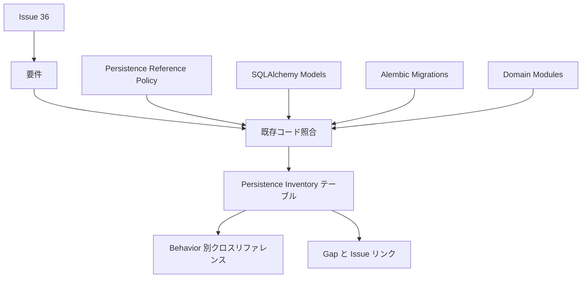
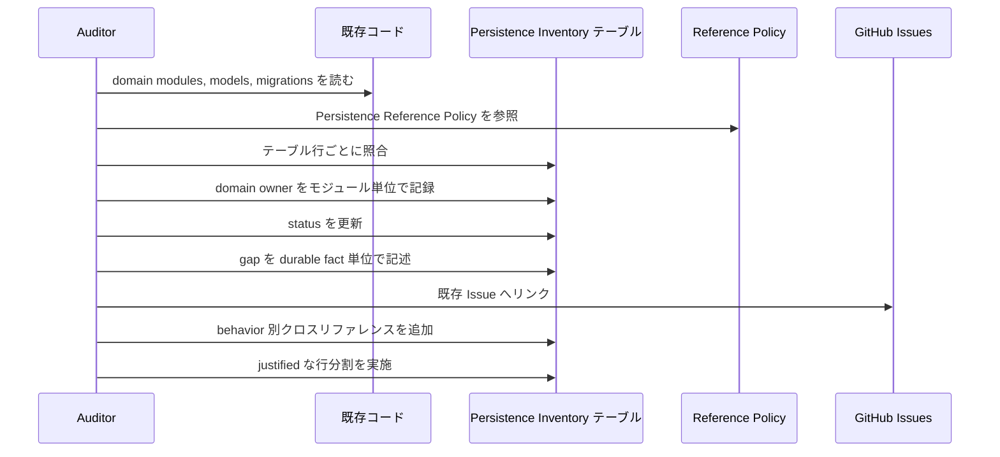

# 設計書

## 概要

Persistence Inventory Audit は、`docs/stable-compatibility-matrix.md` の Persistence Inventory Coverage テーブル全行を既存 Athena コードと照合し、domain owner をモジュール単位で確定、gap を durable fact 単位で記述、behavior 別クロスリファレンスを追加する。成果は runtime コードの追加ではなく、後続の fixture 抽出 (#17) と実装 Issue (#18-#30) が推測なしで着手できる状態にすることである。

この設計は matrix を owner / status / gap の source of truth、guide の Persistence Reference Policy を discovery evidence source として扱う。

### 目標

- Persistence Inventory テーブル全行の domain owner をモジュール単位で確定する。
- gap を durable fact 単位で記述し、既存 Issue へリンクまたは新規 child work として特定する。
- behavior 別クロスリファレンスセクションを追加する。
- justified な行分割を実施する。

### 対象外

- テーブル / migration の新規作成。
- reference schema のコピーまたは Athena スキーマテンプレートとしての利用。
- runtime behavior の実装。
- 新規 GitHub Issue の作成。

## 境界コミットメント

### この spec が扱うこと

- Persistence Inventory Coverage テーブルの全行 status / domain owner / gap 更新。
- Domain owner のモジュール単位確定 (既存 module) と「domain 名: 責務」形式の仮割り当て (未実装領域)。
- Behavior 別クロスリファレンスセクションの追加。
- Dual-owner 行の分割 (User stats/rankings の分割、Replays/media metadata の分割検討)。
- Durable fact 単位の gap 記述と既存 Issue (#17-#30) へのリンク。
- Volatile / durable 境界の注記。

### 境界外

- `src/` 配下のコード変更。
- `tests/` 配下のテスト追加。
- alembic migration の作成。
- 新規 GitHub Issue の作成。Issue 作成は監査結果を元に別途実施する。

### 参照してよい依存

- `docs/stable-compatibility-matrix.md` の Persistence Inventory Coverage テーブル。
- `docs/stable-compatibility-guide.md` の Persistence Reference Policy テーブルと Implementation Flow By Boundary。
- `src/osu_server/domain/` のモジュール構造。evidence source として read-only 参照する。
- `src/osu_server/repositories/sqlalchemy/models/` の既存モデル。evidence source として read-only 参照する。
- `alembic/versions/` の既存 migration。evidence source として read-only 参照する。
- 完了済みの兄弟監査 (#32-#35) の分類結果。
- GitHub Issue #17-#30 の acceptance criteria。リンク先として参照する。
- Reference implementations (bancho.py, lets, pep.py, deck, titanic)。discovery evidence としてのみ参照する。

### 再検証トリガー

- 新しい alembic migration が追加され、durable data のカバレッジが変わった。
- `src/osu_server/domain/` のモジュール構造が再編された。
- roadmap.md の spec 割り当てが変更された。
- reference 実装で comment target type が beatmap 以外にも使われることが確認された。

## アーキテクチャ

### 既存アーキテクチャ分析

Athena の永続化資産は以下の構造を持つ:

- **Domain modules**: `identity/` (users, roles, friends, sessions, authentication, authorization), `chat/` (channels, commands, policies), `beatmaps/` (models, eligibility), `scores/` (score, leaderboards, personal_best, submission, performance), `storage/` (blobs)
- **SQLAlchemy models**: user, role, channel, blob, beatmap, beatmap_leaderboard, score, score_performance, personal_best, friend
- **Migration**: 12本 (20260522 - 20260618)

Persistence Inventory テーブルの13行に対して、6行が Partial (既存コードで一部カバー)、7行が Missing (既存コードなし) である。

### アーキテクチャパターンと境界マップ

採用パターン: documentation inventory audit。Matrix は owner / status / gap の source of truth、guide は reference policy の evidence source。



主要判断:

- Domain owner はモジュール単位で記録する。既存 module がある場合はファイルパス (例: `identity/friends.py`)、ない場合は「domain 名: 責務」形式 (例: `integrity: client hash validation`)。
- Volatile state (session tokens, packet queues, online presence, match state) と durable fact を明示的に区別する。
- Read model (leaderboard projection, stats projection) は行を分割せず、gap 列に `read model rebuilt from [source]` と注記する。
- Dual-owner 行は primary owner が異なる場合のみ分割する。

### 技術スタック

| 層 | 選択 / version | この feature での役割 | 備考 |
|-------|------------------|-----------------|-------|
| ドキュメント | Markdown | Matrix テーブル、behavior クロスリファレンスの更新 | 既存 repository docs format |
| Evidence source | 既存 SQLAlchemy models, alembic migrations, domain modules | Status と owner の照合根拠 | Read-only 参照のみ |
| 検証 | Markdown review と docs grep | Requirement coverage と traceability を確認 | Runtime tests 不要 |

新しい依存は導入しない。

## ファイル構成計画

### ディレクトリ構成

```text
docs/
├── stable-compatibility-matrix.md
└── stable-compatibility-guide.md

.kiro/specs/persistence-inventory-audit/
├── brief.md
├── requirements.md
├── research.md
└── design.md
```

### 変更対象ファイル

- `docs/stable-compatibility-matrix.md`: Persistence Inventory Coverage テーブルの全行を更新し、behavior 別クロスリファレンスセクションを追加する。
- `.kiro/specs/persistence-inventory-audit/research.md`: discovery findings と design decisions を記録する。

### 明示的に変更しないファイル

- `src/osu_server/**`: 既存コードは evidence source として read-only 参照する。
- `tests/**`: この spec ではテストを作成しない。
- `alembic/**`: この spec では migration を作成しない。
- `docs/stable-compatibility-guide.md`: Persistence Reference Policy は既に十分な内容がある。矛盾が見つかった場合のみ unresolved evidence gap として matrix 側に記録する。

### コンポーネントとファイル対応

| コンポーネント | 主なファイル |
|-----------|---------------|
| テーブル行更新 | `docs/stable-compatibility-matrix.md` |
| Behavior クロスリファレンス | `docs/stable-compatibility-matrix.md` |
| Gap-to-Issue リンク | `docs/stable-compatibility-matrix.md` |
| 行分割 | `docs/stable-compatibility-matrix.md` |
| 調査ログ | `.kiro/specs/persistence-inventory-audit/research.md` |

## システムフロー

### 監査ドキュメントフロー



フロー判断:

- テーブル行の照合は domain area 順に行い、行ごとに既存コードの evidence を確認してから owner / status / gap を更新する。
- 行分割は全行の照合が完了してから判断する。照合途中で分割すると dual-owner の見落としが生じる。
- Behavior クロスリファレンスは全行の owner / gap 確定後に追加する。

## 要件トレーサビリティ

| 要件 | 要約 | コンポーネント | フロー |
|------|------|------------|-------|
| 1.1 | 全行を監査対象とする | テーブル行更新 | 監査ドキュメントフロー |
| 1.2 | Reference Policy との照合 | テーブル行更新 | 監査ドキュメントフロー |
| 1.3 | 差分を evidence gap として記録 | テーブル行更新 | 監査ドキュメントフロー |
| 1.4 | 未記載の durable data を新行候補として記録 | 行分割 | 監査ドキュメントフロー |
| 2.1 | 既存 module はモジュール単位で owner 記録 | テーブル行更新 | 監査ドキュメントフロー |
| 2.2 | 未実装領域は「domain 名: 責務」形式で仮 owner | テーブル行更新 | 監査ドキュメントフロー |
| 2.3 | 仮 owner にファイル名を確定しない | テーブル行更新 | 監査ドキュメントフロー |
| 2.4 | 複数 domain にまたがる場合 primary と依存先を区別 | テーブル行更新 | 監査ドキュメントフロー |
| 3.1 | 既存コードと照合してから status 更新 | テーブル行更新 | 監査ドキュメントフロー |
| 3.2 | 一部カバーは Partial、gap 列にカバー内外を区別 | テーブル行更新 | 監査ドキュメントフロー |
| 3.3 | カバーなしは Missing | テーブル行更新 | 監査ドキュメントフロー |
| 3.4 | 全カバーは Implemented | テーブル行更新 | 監査ドキュメントフロー |
| 3.5 | Partial→Implemented 変更には全 fact カバレッジ根拠 | テーブル行更新 | 監査ドキュメントフロー |
| 4.1 | gap に不足 durable fact を個別列挙 | Gap-to-Issue リンク | 監査ドキュメントフロー |
| 4.2 | fact に必要な stable behavior を併記 | Gap-to-Issue リンク | 監査ドキュメントフロー |
| 4.3 | 既存 Issue にリンク | Gap-to-Issue リンク | 監査ドキュメントフロー |
| 4.4 | 既存 Issue 外は新規 child work として記述 | Gap-to-Issue リンク | 監査ドキュメントフロー |
| 4.5 | durable と volatile の区別を明示 | テーブル行更新 | 監査ドキュメントフロー |
| 4.6 | 高頻度 durable fact に永続化方針注記 | テーブル行更新 | 監査ドキュメントフロー |
| 5.1 | behavior 別クロスリファレンスセクション追加 | Behavior クロスリファレンス | 監査ドキュメントフロー |
| 5.2 | login, score submit 等を最低限含む | Behavior クロスリファレンス | 監査ドキュメントフロー |
| 5.3 | 各 behavior に依存する durable data 領域を列挙 | Behavior クロスリファレンス | 監査ドキュメントフロー |
| 5.4 | cross-domain 依存を明示 | Behavior クロスリファレンス | 監査ドキュメントフロー |
| 6.1 | primary owner が異なる行を分割候補として評価 | 行分割 | 監査ドキュメントフロー |
| 6.2 | 分割理由を記録 | 行分割 | 監査ドキュメントフロー |
| 6.3 | 兄弟監査の Area 名との互換性確認 | 行分割 | 監査ドキュメントフロー |
| 6.4 | read model / aggregate で owner が異なっても gap 列に注記 | テーブル行更新 | 監査ドキュメントフロー |
| 7.1 | evidence source は既存コードまたは roadmap | テーブル行更新 | 監査ドキュメントフロー |
| 7.2 | status の evidence は migration, models, repositories | テーブル行更新 | 監査ドキュメントフロー |
| 7.3 | reference schema は discovery evidence のみ | テーブル行更新 | 監査ドキュメントフロー |
| 7.4 | 曖昧な帰属は reference 検証後に確定 | テーブル行更新 | 監査ドキュメントフロー |
| 8.1 | テーブルに owner / gap / status 更新を反映 | テーブル行更新 | 監査ドキュメントフロー |
| 8.2 | 分割後の行を反映 | 行分割 | 監査ドキュメントフロー |
| 8.3 | behavior クロスリファレンスを追加 | Behavior クロスリファレンス | 監査ドキュメントフロー |
| 8.4 | matrix/guide 矛盾は unresolved gap として示す | テーブル行更新 | 監査ドキュメントフロー |
| 9.1 | テーブル/migration 作成を要求しない | 監査専用境界 | - |
| 9.2 | reference schema コピーを要求しない | 監査専用境界 | - |
| 9.3 | GitHub Issue 作成を要求しない | 監査専用境界 | - |
| 9.4 | missing は gap/follow-up として記録 | Gap-to-Issue リンク | 監査ドキュメントフロー |
| 9.5 | 新規 child work は概要記述のみ | Gap-to-Issue リンク | 監査ドキュメントフロー |

## コンポーネントとインターフェース

| コンポーネント | ドメイン / 層 | 意図 | 要件カバレッジ | 主な依存 | 契約 |
|-----------|--------------|--------|--------------|------------------|-----------:|
| テーブル行更新 | Documentation | 全行の owner / status / gap を更新する | 1.1-1.4, 2.1-2.4, 3.1-3.5, 4.5, 4.6, 6.4, 7.1-7.4, 8.1, 8.4 | 既存コード (P0), Reference Policy (P1) | State |
| Behavior クロスリファレンス | Documentation | behavior 別に durable data 依存を横断表示する | 5.1-5.4, 8.3 | テーブル行更新 (P0) | State |
| Gap-to-Issue リンク | Documentation | gap を durable fact 単位で記述し既存 Issue にリンクする | 4.1-4.4, 9.4, 9.5 | テーブル行更新 (P0), GitHub Issues (P1) | State |
| 行分割 | Documentation | dual-owner 行を justified に分割する | 1.4, 6.1-6.3, 8.2 | テーブル行更新 (P0) | State |
| 監査専用境界 | Documentation | この spec を docs audit に留める | 9.1-9.3 | 要件 (P0) | State |

全コンポーネントが Documentation 層のみであり、runtime コードを変更しない。コンポーネント間の依存方向は テーブル行更新 → 行分割 → Gap-to-Issue リンク → Behavior クロスリファレンス の順序で、並行更新は発生しない。

## データモデル

### Documentation data model

| 項目 | 意味 | 場所 |
|-------|---------|----------|
| Area | durable data の領域名 | テーブル行ヘッダ |
| Domain owner | 責任モジュール (既存) または仮 owner (未実装) | テーブル Domain owner 列 |
| Durable data to audit | 監査対象の durable fact 一覧 | テーブル列 |
| Primary consumers | この data を消費する stable behavior + cross-domain 依存 | テーブル列 |
| Current gap | カバー外 fact、volatile/durable 注記、read model 注記、Issue リンク | テーブル列 |
| Status | Implemented / Partial / Missing | テーブル列 |
| Behavior group | login, score submit 等の behavior 名 | クロスリファレンスセクション |
| Dependent areas | behavior が依存する Area 一覧 | クロスリファレンスセクション |

Database、API schema、runtime state model は導入しない。

## 検証戦略

- Documentation review で、全テーブル行に domain owner (モジュール単位または仮 owner) が記録されていることを確認する。
- Documentation review で、全テーブル行の status が既存コードと照合された根拠を持つことを確認する。
- Documentation review で、Partial / Missing 行の gap 列に durable fact 単位の記述があることを確認する。
- Documentation review で、behavior 別クロスリファレンスが login, score submit, getscores, replay download, static/media, moderation, multiplayer を含むことを確認する。
- Diff review で、この spec が `src/` と `tests/` と `alembic/` を変更していないことを確認する。

## 未解決事項とリスク

- Comment target type の帰属は reference 実装 (bancho.py, lets) で target パラメータを検証してから確定する。stable client scope で beatmap 以外の target が確認された場合、ratings/comments/favourites 行の owner を `domain/beatmaps` から独立 aggregate に変更する必要がある。
- Replays/media metadata 行は `domain/scores` (replay) と `domain/storage` (blob metadata) にまたがるが、blob が汎用 storage として全メディアの metadata を持つ設計であれば分割せず gap 列に注記で済む可能性がある。全行照合後に判断する。
- User stats/rankings 行は roadmap で別 spec (user-stats, user-ranking) になっており、primary owner が異なるため分割候補だが、既存コードに rankings module がまだないため、分割後の rankings 行は全 fact が Missing になる。
