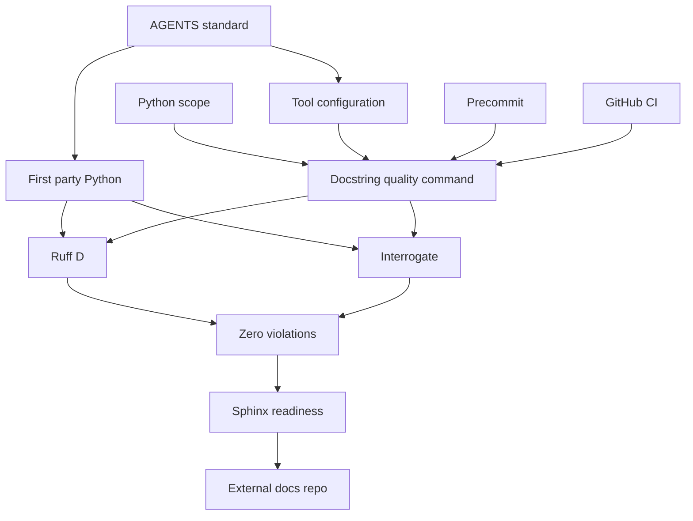
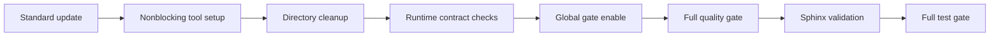

# Design Document

## Overview

本featureは、Athenaのfirst-party Python全体へ日本語Google Style docstringを整備し、
public/privateを問わない完全性とsection内容の整合を継続的な品質ゲートへ組み込む。
`AGENTS.md`を品質基準の正本とし、Ruff `D`と`interrogate`がそれぞれGoogle Styleの形式と
全definitionの完全性を検証する。Args/Returns/Yieldsなどの型と意味の正しさは、canonical standard、
directory taskの手動review、Sphinx/Napoleon readiness PoCで確認する。

設計時点の対象は追跡される839件のfirst-party `.py`であり、実装中に追加するPython fileも
同じscope contractへ含める。既存の実行時責務やlayer構造は変更せず、docstring、
docstring型整合に必要な最小signature annotation、開発時quality infrastructureだけを変更する。
Typer helpと既存`__doc__` assertionはdocstringがruntime-observableであるため、明示的な
互換性contractとして保護する。

### Goals

- 全対象module/class/function/methodに日本語Google Style docstringを設ける。
- private、nested、dunder、test、fixtureを含むdocstring completenessを100%にする。
- Ruff `D`違反を0件、`interrogate` coverageを100%にし、baselineやignoreなしで将来の後退を拒否する。
- ローカル、pre-commit、CIが同じuv lock済みtoolchainと対象scopeを使う。
- 別repositoryからSphinx/NapoleonでAPI referenceを生成できるsource品質を持つ。

### Non-Goals

- docstring整備を理由とするbusiness logic、API、packet、DB schemaの変更。
- third-party `.pyi`、生成物、非`.py` template、Python以外の文書への同一規則の適用。
- Ruff preview `DOC`規則の有効化。
- docstring本文の自然言語上の正しさを完全自動判定する仕組み。
- Sphinx site、恒久config、theme、generated artifact、deployment workflowのAthena内所有。
- 既存194件のpyright suppressionと2件のtype ignoreを解消する型品質refactor。

## Boundary Commitments

### This Spec Owns

- `AGENTS.md`に記載するPython docstringのcanonical standard。
- first-party Python scopeと、対象となるdefinition分類。
- Ruff `D`と`interrogate`の設定とdev dependency。
- `./scripts/ci.sh docstrings`および既存`quality`へのdocstring gate統合。
- 全対象Python定義のdocstring整備とruntime-observable docstringの互換性保護。
- 別documentation repositoryへ渡すSphinx/Napoleon readiness contractと一時PoC evidence。

### Out of Boundary

- `typings/`配下のthird-party `.pyi`。
- `.venv/`、build artifact、cache、generated source、`alembic/script.py.mako`。
- docstring整備と無関係なruntime refactor、public contract変更、test expectation変更。
- Ruff `DOC`、`darglint`、baseline、per-file docstring ignore、広範な`noqa`。
- Python以外のcomment、README本文、protocol documentを網羅的に書き直す作業。
- Sphinx config、API page selection、theme、HTML/PDF、hosting、release lifecycle。
- BasedPyright suppressionの原因分析、stub/fake/protocol整備、既存抑制の削除。
- `typing.Annotated` metadataをraw type stringとして比較するpydoclint gate。公式に基底型比較を
  支持するrelease/configが確認されるまで、このfeatureのquality gateへ含めない。

### Allowed Dependencies

- Python 3.14+と既存のuv/Nix development environment。
- uv lock済みRuff。設計時点のuv lockは0.15.13である。
- dev-only dependencyとして`interrogate 1.7.0`。
- project dependencyへ追加しない一時PoC toolとしてSphinx 9.1.0。
- 既存の`./scripts/ci.sh`、Nix生成pre-commit、GitHub Actions quality job。
- runtime contract検証に既存pytest/Typer testing infrastructure。

Production packageからdocstring toolをimportしてはならない。依存方向は次の順序に限定する。

```text
AGENTS standard and scope -> pyproject tool configuration -> scripts quality command
scripts quality command -> pre-commit and GitHub CI
first-party Python source -> Ruff and interrogate input
```

### Revalidation Triggers

- Python、Ruff、`interrogate`のversion変更。
- `typing.Annotated` metadataを基底型として比較できるpydoclint公式release/configの登場。
- external documentation repositoryが使用するSphinx/Napoleonのversionまたは設定変更。
- first-party Python root、file extension、generated/third-party ownershipの変更。
- `AGENTS.md`のdocstring section、Google Style section contract、coverage thresholdの変更。
- Typer、FastAPI、Pydanticなど`__doc__`をuser-visible metadataへ利用するsurfaceの追加・変更。
- CI/pre-commitの実行entryまたはuv/Nix tool ownershipの変更。

## Architecture

### Existing Architecture Analysis

Athenaは`pyproject.toml`のRuff設定、`scripts/ci.sh quality`、Nix生成pre-commit、
GitHub Actions quality jobを既に持つ。CIのRuff対象は`src/ tests/`だけで、pre-commitは変更された
全PythonをNix Ruff 0.15.17で検査する。uv lock済みRuff 0.15.13との現行結果は一致したが、
versionとscopeのownershipは分岐している。

Ruff `D`は公開定義の形式と欠落を検査できるが、通常のprivate/nested定義を網羅しない。
PoCでは`interrogate`が10,617定義を認識し、現状37.4% coverageを報告した。
`pydoclint`は全839 fileをPython 3.14.4で走査できたが、Typerの`Annotated` metadata内の
ASCII `:`をGoogle Args parserが型区切りとして扱う。基底domain型を記述するcanonical standardと
runtime不変制約を同時に満たす公式設定がないため、採用しない。詳細な一次情報とPoCは`research.md`に
記録し、`Attributes:`を含む意味・型の正しさはcanonical standardとreviewで保証する。

### Toolchain Compatibility Decision

`pydoclint`はRuffと重複しない内容整合signalを提供するが、AthenaのTyper `Annotated` annotationを
runtime不変のまま検証できない。production表現をparser都合で変えず、Ruff `D`と`interrogate`を
quality gateとして採用する。pydoclintを再導入する条件は、公式version/configが`Annotated` metadataを
除外して基底domain型を比較し、`research.md`のfixtureでDOC103/DOC105/DOC110を出さないことである。

### Architecture Pattern & Boundary Map

選択するpatternは既存quality pipelineを拡張するlayered validationである。独自AST checkerは
追加せず、各toolが重複しないsignalを担当する。



Key decisions:

- `AGENTS.md`が意味上の正本で、tool configは検査可能な部分を機械化する。
- `interrogate`は`sphinx` coverage semanticsを使い、classと`__init__`を別々に数える。
  Google Styleの形式はRuff、意味と型の妥当性はcanonical standardとreviewが担当する。
- first-party file inventoryとtool invocationは`scripts/ci.sh`へ集約し、Git index上の
  tracked `.py`から動的に収集する。
- global gateは全directory cleanup統合後に有効化し、途中baselineは作らない。
- Sphinx build surfaceは別repositoryが所有し、Athenaはwarning-freeな一時Napoleon/autodoc PoCだけを
  completion evidenceとして残す。

### Technology Stack

| Layer | Choice / Version | Role in Feature | Notes |
| --- | --- | --- | --- |
| Language | Python 3.14+ | docstring対象とtool runtime | PoCは3.14.4で実施 |
| Format lint | Ruff 0.15.13 current uv lock | `D`とGoogle convention | pre-commitもuv entryへ統一 |
| Completeness | interrogate 1.7.0 | privateを含む100% coverage | `sphinx` coverage semantics |
| Deferred content lint | pydoclint | `Annotated`基底型比較の公式対応があるまで不採用 | 詳細PoCと再評価条件は`research.md` |
| Orchestration | Bash、Git、`scripts/ci.sh` | scopeと実行順序の正本 | `quality`、`docstrings`、`python-files`を提供 |
| Validation | pytest、prek、GitHub Actions | configとruntime contractの回帰検証 | production dependencyなし |
| Readiness PoC | Sphinx 9.1.0 transient | Napoleon/autodoc compatibility | project dependency/configは追加しない |

## File Structure Plan

### Directory Structure

```text
AGENTS.md                                      # canonical docstring standard
README.md                                      # local quality command案内
docs/architecture.md                           # quality gate構成の同期
.kiro/steering/tech.md                         # docstring toolchainの技術選定
pyproject.toml                                 # Ruff Dとinterrogateの設定・dev dependency宣言
uv.lock                                        # dev tool dependency lock
scripts/ci.sh                                  # Git inventoryとquality/docstrings/python-files command
flake.nix                                      # uv based Ruff entryとdocstring pre-commit hook
.pre-commit-config.yaml                        # flake.nixから再生成されるhook artifact
src/
├── athena_cli/                                # CLIを含む全module/class/function/method
└── osu_server/                                # 全layerのPython定義
tests/
├── unit/test_docstring_quality_configuration.py # tool configと禁止設定の回帰test
├── integration/athena_cli/test_cli_help.py    # Typer help互換性contract
├── unit/infrastructure/messaging/test_event_bus.py
├── unit/infrastructure/messaging/test_distributed.py
└── ...                                       # 全test/fixture/helper定義
alembic/versions/                              # migration moduleとupgrade/downgrade
gitlint_rules/                                 # project-owned gitlint rules
athena-crypto/tests/                           # Python test definition
.agents/skills/api-design-principles/assets/rest-api-template.py
.agents/skills/prompt-engineering-patterns/scripts/optimize-prompt.py
```

`src/`と`tests/`はdirectory ownership単位で分割し、同一fileを複数taskが編集しない。
`pyproject.toml`、`uv.lock`、`scripts/ci.sh`、`flake.nix`、`AGENTS.md`はtooling taskの
単一ownerとする。

### Component to File Mapping

| Component | Owned files |
| --- | --- |
| DocumentationStandard | `AGENTS.md`、`README.md`、`docs/architecture.md`、`.kiro/steering/tech.md` |
| DocstringToolchain | `pyproject.toml`、`uv.lock`、`tests/unit/test_docstring_quality_configuration.py` |
| DocstringGate | `scripts/ci.sh`、`flake.nix`、generated `.pre-commit-config.yaml`、unchanged `.github/workflows/ci.yml` entry |
| DocstringCorpus | `src/`、`tests/`、`alembic/`、`gitlint_rules/`、`athena-crypto/tests/`、`.agents/` |
| RuntimeContractSafeguards | `src/athena_cli/`、`tests/integration/athena_cli/test_cli_help.py`、既存`__doc__` contract tests |
| SphinxReadinessContract | `AGENTS.md`、`.kiro/specs/python-docstring-quality/research.md`、`.kiro/specs/python-docstring-quality/design.md` |

### Modified Files

- `AGENTS.md` - privateを含む必須範囲、section syntax、constructor例外、`Notes:`、
  ASCII終端、実行commandを明文化する。
- `README.md`、`docs/architecture.md`、`.kiro/steering/tech.md` - quality gateのtool構成と
  実行方法を同期する。
- `pyproject.toml`、`uv.lock` - Ruff `D`/Google conventionとinterrogateを固定する。
- `scripts/ci.sh` - first-party `.py` inventory、`docstrings`/`python-files` command、
  既存qualityへの統合を所有する。
- `flake.nix` - Ruffを`uv run`へ統一し、full docstring gate hookを追加する。
- `.pre-commit-config.yaml` - `flake.nix`から再生成する。直接編集しない。
- 上記Python directory/file - definitionの責務を読んだ日本語Google Style docstringへ整備する。
  canonical standardに必要な未注釈signatureだけprecise annotationを補う。

### New Files

- `tests/unit/test_docstring_quality_configuration.py` - config、100% threshold、private設定、
  baseline/ignore禁止、scope contractを検査する。

`.github/workflows/ci.yml`は変更しない。既存の`./scripts/ci.sh quality`呼出しが新gateを継承する。

## System Flows

### Implementation and Gate Activation



Tooling setupではdependencyと設定を追加するが、未整備領域を遮断するglobal hookはまだ有効化しない。
各cleanup taskは所有pathに対してRuff `D`と`interrogate`を実行し、統合後のfinal taskだけがglobal `D` select、
pre-commit、CI quality統合を有効化する。

## Requirements Traceability

| Requirement | Summary | Components | Interfaces | Flows |
| --- | --- | --- | --- | --- |
| 1.1 | Ruff `D`とGoogle convention | DocstringToolchain、DocstringGate | Tool configuration、Batch | Gate activation |
| 1.2 | 既存lint維持 | DocstringToolchain、DocstringGate | Tool configuration | Full quality |
| 1.3 | convention競合の明示 | DocumentationStandard、DocstringToolchain | Tool configuration | Gate activation |
| 1.4 | 引数記載検査 | DocstringToolchain | Ruff `D417`、canonical review | Full quality |
| 2.1 | 全definitionの日本語docstring | DocumentationStandard、DocstringCorpus | Standard、Scope | Directory cleanup |
| 2.2 | Google sectionsと型・意味 | DocumentationStandard、DocstringCorpus | Standard、directory review | Directory cleanup |
| 2.3 | `None`と制約の説明 | DocumentationStandard、DocstringToolchain、DocstringCorpus | Standard、Content lint | Directory cleanup |
| 2.4 | ASCII punctuation | DocumentationStandard、DocstringToolchain | Standard、Ruff `D415` | Directory cleanup |
| 3.1 | 0違反とprivate完全性 | DocstringToolchain、DocstringGate、DocstringCorpus | Batch、Scope | Full quality |
| 3.2 | 新規違反拒否 | DocstringGate | Batch | Precommit and CI |
| 3.3 | ignore/baseline禁止 | DocumentationStandard、DocstringToolchain、DocstringGate | Configuration test | Gate activation |
| 3.4 | runtime挙動不変 | DocstringCorpus、RuntimeContractSafeguards | Compatibility tests | Runtime checks |
| 4.1 | Python 3.14 PoC | DocstringToolchain | Tool evaluation record | Tool setup |
| 4.2 | Ruffと非重複の役割 | DocstringToolchain | Tool configuration | Full quality |
| 4.3 | preview/保守終了tool拒否 | DocstringToolchain | Adoption decision | Tool setup |
| 4.4 | coverage scopeとthreshold | DocstringToolchain、DocstringGate | Scope、Batch | Full quality |
| 5.1 | 規約と実行方法同期 | DocumentationStandard、DocstringGate | Standard、Batch | Gate activation |
| 5.2 | `AGENTS.md`を正本化 | DocumentationStandard | Standard | Standard update |
| 5.3 | 具体的な記述基準 | DocumentationStandard | Standard examples | Standard update |
| 6.1 | Napoleon supported sections | DocumentationStandard、SphinxReadinessContract | Standard、Handoff | Sphinx PoC |
| 6.2 | warning-free generation PoC | SphinxReadinessContract | Batch | Sphinx PoC |
| 6.3 | docs repository分離 | SphinxReadinessContract | Boundary | External handoff |
| 6.4 | external config/import前提 | SphinxReadinessContract | Handoff | External handoff |

## Components and Interfaces

| Component | Domain / Layer | Intent | Req Coverage | Key Dependencies | Contracts |
| --- | --- | --- | --- | --- | --- |
| DocumentationStandard | Project documentation | docstring意味規約の正本 | 1.3, 2.1-2.4, 3.3, 5.1-5.3 | Google Style P0 | State |
| DocstringToolchain | Development tooling | 形式と完全性の機械検査を定義 | 1.1-1.4, 3.1-3.3, 4.1-4.4 | uv lock P0 | Batch |
| DocstringGate | Quality infrastructure | scopeと実行entryを統一 | 1.1, 1.2, 3.1-3.3, 4.4, 5.1 | Toolchain P0 | Batch |
| DocstringCorpus | First-party Python | 全definitionを規約へ適合 | 2.1-2.4, 3.1, 3.4 | Standard P0、Gate P1 | State |
| RuntimeContractSafeguards | CLI and introspection | user-visible差分を防止 | 3.4 | Typer P0、pytest P0 | Batch |
| SphinxReadinessContract | Documentation handoff | 別repoから生成可能なcontractを定義 | 6.1-6.4 | Sphinx P1、Standard P0 | Batch |

### Project Documentation

#### DocumentationStandard

| Field | Detail |
| --- | --- |
| Intent | `AGENTS.md`を人間とagentが共有するcanonical docstring contractにする |
| Requirements | 1.3, 2.1, 2.2, 2.3, 2.4, 3.3, 5.1, 5.2, 5.3 |

**Responsibilities & Constraints**

- moduleと全class/function/methodへdocstringを必須化する。visibility、nesting、decorator、
  test codeを除外理由にしない。
- 日本語のsummaryと必要なdetailを記載し、外部仕様名とcontract phraseだけ原文を許可する。
- `Args:`は`name (type): meaning`、`Returns:`/`Yields:`は`type: meaning`とする。
- 戻り値なしは`None`の意味を記載する。`__init__`だけはreturn valueを持たないため
  `Returns:`を置かない。
- callerが扱うべき直接送出または意図的伝播exceptionだけを`Raises:`へ記載する。
  exceptionがない場合はsectionを省略する。
- class body attributeとdataclass fieldはpublic/privateとも`Attributes:`へ記載する。
  propertyは各getter/setter methodで記載する。
- test function/methodは検証するcontract、前提条件、期待するobservable outcomeを説明し、
  test名の言い換えだけで終わらせない。fixture、fake、helperも利用目的と制約を説明する。
- 制約、前提条件、non-obvious invariantは`Notes:`へ記載し、custom `Constraints:`を使わない。
- summaryはASCIIの`.`, `?`, `!`で終え、既存ASCII punctuation規約を守る。
- `AGENTS.md`へfunction、`None` return、class `Attributes:`、`__init__`、private/test definitionの
  compactなcanonical examplesを載せる。

**Dependencies**

- External: Google Style semantics - section構造の基準 (P0)
- Outbound: DocstringToolchain - 機械化可能な規則 (P0)
- Outbound: DocstringCorpus - 全sourceの記述基準 (P0)

**Contracts**: State [x]

##### State Management

- State model: `AGENTS.md`のPython Docstring Language sectionが唯一のnormative textである。
- Persistence & consistency: README、architecture、steeringは実行方法とtool roleを参照し、
  意味規則を複製しない。
- Concurrency strategy: tooling ownerだけがcanonical sectionを変更し、cleanup taskは参照専用とする。

### Development Tooling

#### DocstringToolchain

| Field | Detail |
| --- | --- |
| Intent | 形式と完全性を非重複toolで検証する |
| Requirements | 1.1, 1.2, 1.3, 1.4, 3.1, 3.2, 3.3, 4.1, 4.2, 4.3, 4.4 |

**Responsibilities & Constraints**

- Ruffは既存selectを維持したまま`D`とGoogle conventionを追加する。`D417`を有効にする。
- Google conventionが標準で除外する`D203`、`D204`、`D213`、`D215`、`D400`、`D401`、
  `D404`、`D406`、`D407`、`D408`、`D409`、`D413`はGoogle Style非対象として明示する。
  追加ignoreで規則を緩和しない。
- `interrogate`は100%未満をfailureにし、module、init、magic、nested class/function、overload、
  private、semiprivate、propertyをignoreしない。
- Args/Returns/Yields/Raises/Attributesの型と意味は`AGENTS.md`を正本とする。directory taskの
  implementation reviewは、型注釈、実装、call site、relevant testを照合してこの規約を確認する。
- `pydoclint`は`Annotated` metadataを基底型として比較する公式対応が確認できるまでdependency、
  config、gateへ含めない。`noqa`、baseline、per-file ignore、runtime metadataの書換えを代替にしない。
- baseline、generated baseline、tool-level broad exclude、docstring `noqa`を使わない。

| Tool | Required configuration |
| --- | --- |
| Ruff | `D` selected、`lint.pydocstyle.convention = "google"`、追加docstring ignoreなし |
| interrogate | `fail-under = 100`、`style = "sphinx"`、init/module/magic/nested/overload/private/semiprivate/propertyをignoreしない |

**Dependencies**

- External: Ruff uv lock version - basic format and presence lint (P0)
- External: interrogate 1.7.0 - completeness (P0)
- Inbound: DocumentationStandard - semantic source of truth (P0)
- Outbound: DocstringGate - executable checks (P0)

**Contracts**: Batch [x]

##### Batch Contract

- Trigger: `./scripts/ci.sh quality`または`./scripts/ci.sh docstrings`。
- Input / validation: Git indexにあるtracked `.py`を受け取る。
  inventoryが空、またはGit repository外ならgate errorとする。
- Output / destination: Ruffとinterrogateがともに成功した場合exit 0。違反、parse failure、tool failureはnon-zero。
- Idempotency & recovery: read-only。修正後に同じcommandを再実行して0件を確認する。

**Implementation Notes**

- Integration: dev dependency追加と削除はdesign承認をexplicit dependency approvalとして扱う。
- Validation: Python 3.14.4 fixtureとfull-scope scanを実装時にも再実行する。pydoclint再評価は
  `Annotated` metadata fixtureを公式candidate versionで通してから行う。
- Risks: tool updateでdefinition classificationが変わった場合はversion固定のまま差分を調査する。

#### DocstringGate

| Field | Detail |
| --- | --- |
| Intent | first-party scopeとlocal/pre-commit/CI entryを一つに統一する |
| Requirements | 1.1, 1.2, 3.1, 3.2, 3.3, 4.4, 5.1 |

**Responsibilities & Constraints**

- FirstPartyPythonScopeを`scripts/ci.sh`のGit inventoryで所有する。
  `git ls-files --cached -- '*.py'`相当のNUL-safe収集を使い、staging済みのnew rootやnew test fileも
  自動的に対象へ加える。
- `quality`は全scopeのRuff format/lintと既存quality checksを実行する。docstring gate統合後はRuff `D`と
  `interrogate`を追加する。
- `docstrings`はRuff `D`と`interrogate`だけを実行する。
- `python-files`は全toolが受け取るinventoryを1 path 1行で出力し、scope auditを可能にする。
- 既存`fix`も同じinventoryへRuff format/check fixを適用し、対象scopeを`quality`と一致させる。
- RuffとinterrogateへはNUL-safeなbounded batchでinventoryを渡し、全pathを一つのargvへ展開しない。
- pre-commit Ruff entryを`uv run ruff`へ統一し、first-party Python変更時にfull docstring gateを
  呼び出す。`typings/`変更はdocstring gateを起動しない。
- CI workflowは既存`quality` entryを維持する。

**Dependencies**

- Inbound: DocstringToolchain - tool and configuration (P0)
- Inbound: Git worktree inventory - scan targets (P0)
- Outbound: Nix generated pre-commit - local enforcement (P0)
- Outbound: GitHub Actions - remote enforcement (P0)

**Contracts**: Batch [x]

##### Batch Contract

- Trigger: manual command、`prek run --all-files`、GitHub Actions quality job。
- Input / validation: 設計時点の839件と実装中に追加されるstaged first-party `.py`。
  `.pyi`、ignored artifact、generated cacheはinventoryへ入らない。
- Output / destination: contributor terminalとCI logへtool-native violationを出力する。
- Idempotency & recovery: gate自体はsourceを変更しない。Ruff fixは既存`fix` commandだけが所有する。

### Source Corpus

#### DocstringCorpus

| Field | Detail |
| --- | --- |
| Intent | 現行baseline 10,617 definitionと新規definitionをcanonical standardへ移行する |
| Requirements | 2.1, 2.2, 2.3, 2.4, 3.1, 3.4 |

**Responsibilities & Constraints**

- 各docstringは対象definitionのimplementation、call sites、testsを読んで責務を記述する。
- 英語docstringは日本語化するが、wire field、error code、引用contract phraseは保持する。
- `Args:`/`Returns:`/`Yields:`/`Raises:`/`Attributes:`/`Notes:`をsignatureと実装に合わせる。
- 現行auditの型なしargument 4件とreturn annotationなし41件には、canonical standardとSphinx signature
  品質に必要なprecise annotationを追加する。
- 上記signature annotation以外のstatement、annotation、decorator order、constant、control flowを
  変更せず、新しいtyping suppressionを追加しない。
- 自動formatterによるdocstring周辺の機械的整形以外のruntime diffを混在させない。

**Dependencies**

- Inbound: DocumentationStandard - authoring rules (P0)
- Inbound: DocstringGate - acceptance checks (P1)
- Outbound: RuntimeContractSafeguards - observable consumers (P0)

**Contracts**: State [x]

##### State Management

- State model: target definitionごとにexactly one docstringを持ち、tool violationsが0である。
- Persistence & consistency: Git sourceだけを変更し、runtime storageやmigration stateを変更しない。
- Concurrency strategy: directory/file ownerを一つに固定し、tooling fileはcleanup taskから除外する。

### Runtime Compatibility

#### RuntimeContractSafeguards

| Field | Detail |
| --- | --- |
| Intent | `__doc__`由来のuser-visible/introspection behaviorを維持する |
| Requirements | 3.4 |

**Responsibilities & Constraints**

- Typer commandがimplicit function docstringをhelpへ採用しないよう、現行helpをdecorator metadataへ
  明示する。従来descriptionなしのcommandは`help=""`で固定する。
- Typer/FastAPI/Pydanticなどsignature annotationをruntime利用するsurfaceでは、annotation補完前後の
  observable metadata/behaviorを保護する。
- rootとsubcommandのhelp contract testでcommand listingとdescriptionを保護する。
- `LocalEventBus`と`DistributedEventEnvelope`の既存英語contract phraseをdocstring内に保持する。
- future FastAPI/Pydantic metadata surfaceが追加された場合はRevalidation Triggersへ従う。

**Dependencies**

- Inbound: DocstringCorpus - updated docstrings (P0)
- External: Typer help generation - observable metadata (P0)
- External: pytest - regression checks (P0)

**Contracts**: Batch [x]

##### Batch Contract

- Trigger: relevant pytest、full test gate。
- Input / validation: updated CLI command metadataとcontract-bearing classes。
- Output / destination: help/introspection差分がなければ成功し、差分があればtest failure。
- Idempotency & recovery: expected outputは既存behaviorを固定し、docstring都合で更新しない。

### Documentation Handoff

#### SphinxReadinessContract

| Field | Detail |
| --- | --- |
| Intent | Athenaを変更せず別repositoryからAPI referenceを生成できる前提を定義する |
| Requirements | 6.1, 6.2, 6.3, 6.4 |

**Responsibilities & Constraints**

- canonical sectionsをNapoleon supported setの`Args:`、`Attributes:`、`Returns:`、`Yields:`、
  `Raises:`、`Examples:`、`Notes:`に限定する。
- external docs repositoryの最小extension contractは`sphinx.ext.autodoc`、
  `sphinx.ext.napoleon`、必要に応じて`sphinx.ext.autosummary`とする。
- `napoleon_google_docstring = True`、`napoleon_numpy_docstring = False`とし、private、`__init__`、
  dunderを生成する場合は対応するinclude optionを有効にする。
- Sphinx autodocはmoduleをimportするため、external docs repositoryがAthenaとdependencyをinstallし、
  environmentとdocument対象moduleを所有する。
- Athena repositoryへSphinx dependency、`conf.py`、RST stub、theme、generated outputを追加しない。

**Dependencies**

- Inbound: DocumentationStandard - Napoleon compatible source format (P0)
- External: Sphinx 9.1.0 transient PoC - compatibility evidence (P1)
- Outbound: External documentation repository - generation and publication owner (P0)

**Contracts**: Batch [x]

##### Batch Contract

- Trigger: implementation final validationまたはexternal docs repositoryのintegration検証。
- Input / validation: canonical examplesと、Athenaの代表的なimport-safe module群。
- Output / destination: `sphinx-build -W -b html`がwarning 0で成功するPoC evidence。
- Idempotency & recovery: temporary source/build directoryだけを使用し、Athena worktreeへ生成物を残さない。

**Implementation Notes**

- Integration: current PoCはPython 3.14.4、Sphinx 9.1.0、private/init/special有効で成功済み。
- Validation: final corpusからarchitecture layer横断のrepresentative modulesを選び再実行する。
- Risks: import side effectやruntime setting不足はdocstring parse errorと区別し、external docs側の
  module selection/environment contractとして記録する。

## Error Handling

### Error Strategy

- Tool install/resolve failure、invalid config、source parse failureはgate failureとして即時終了する。
- Ruff違反はfile/line/rule code、`interrogate`はcoverageとmissing countをそのまま報告する。
- coverageが100%未満でもbaselineへ退避しない。missing definitionを修正して再実行する。
- tool false positiveを疑う場合はPoC fixtureと公式contractを確認し、設定またはtool採用判断を
  designへ戻す。個別ignoreで回避しない。
- Sphinx PoCのwarningはfailureとする。module import failureはdocstring warningと分離し、
  external docs repositoryへ必要なinstall/environment/module selectionを明示する。

### Monitoring

Production monitoringは不要である。GitHub Actionsのquality logとpre-commit exit codeが
operational signalとなる。

## Testing Strategy

### Unit Tests

- `test_docstring_quality_configuration.py`がRuff selectに`D`、Google convention、`D417`を確認する。
- 同testが`interrogate`の100% thresholdと全ignore無効を確認する。
- 同testがpydoclint dependency/config/baselineが不在で、Ruff/interrogateの設定が唯一のgate設定で
  あることを確認する。
- 同testが`./scripts/ci.sh python-files`の出力をGit inventoryと比較し、tracked `.py`を収集して
  `.pyi`とignored artifactを除外することを確認する。

### Integration Tests

- `./scripts/ci.sh docstrings`が全tracked first-party `.py`でRuff `D` 0件、coverage 100%を返す。
- `./scripts/ci.sh quality`が既存Ruff規則、format、basedpyright、import-linterを含め成功する。
- `prek run --all-files`がuv lock版Ruffとfull docstring gateで成功する。
- Typer root/subcommand helpがdocstring追加前のdescription contractを維持する。
- EventBus/DistributedEventEnvelopeの既存`__doc__` phrase assertionsが成功する。
- Sphinx 9.1.0 temporary environmentでNapoleon/autodoc representative buildを`-W`付きで実行し、
  warning 0で成功する。

### End-to-End Regression

- `./scripts/ci.sh test`を実行し、docstring追加がapp、worker、CLI、migration testのbehaviorを
  変更していないことを確認する。
- 最終diff reviewでdocstring以外のruntime statement差分を検出する。
- 最終diff reviewで新しい`pyright: ignore`または`type: ignore`が追加されていないことを確認する。

### Performance

- cached Python 3.14 PoCのfull scanは`interrogate`約4.9秒である。
- Python変更時だけpre-commit full scanを行う。実装後の合計時間が大幅に増えてもscopeやthresholdを
  緩和せず、tool profilingとinvocation overheadを調査する。

## Migration Strategy

1. `AGENTS.md`、tool dependency、tool config、scope contract、configuration testを追加する。
   この段階ではglobal `D`/hookを有効化しない。
2. directory ownershipごとにdocstringを整備し、各taskは所有pathのRuff `D`、`interrogate 100%`、
   relevant testsとcanonical standardに対するdirectory reviewを通す。
3. CLI help metadataとruntime contract testsを固定する。
4. 全task統合後、Ruff global `D`、`scripts/ci.sh quality/docstrings`、pre-commitを有効化する。
5. temporary Sphinx/Napoleon buildを実行し、外部docs repository向けreadiness evidenceを記録する。
6. full quality、full test、final diff reviewを通過してからPRをreadyにする。

Rollback時はtool gateのactivation commitを戻せるが、完成済み日本語docstringをbaselineへ戻さない。
dependency incompatibilityが実装時に再現した場合は、同じ役割の自作checkerへ即置換せず設計を
再検証する。

## Security Considerations

追加dependencyはdev-onlyでproduction runtimeへimportしない。docstringへcredential、raw token、
secret fixture値、内部運用情報を新たに記載しない。既存secret scanningとcode reviewを維持する。
