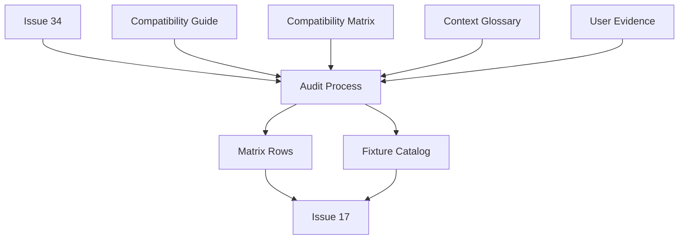
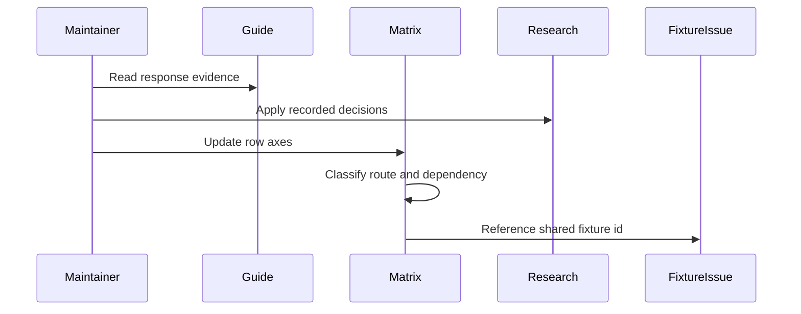

# Design Document

## Overview

Release/update route policy inventory audit は、Athena の stable compatibility docs に残る release/update 系 route を、実装状況ではなく互換分類、運用依存、evidence、fixture handoff の観点で監査する documentation design である。

利用者は stable compatibility 保守者、#17 fixture 抽出担当者、将来の release/update route 実装者、運用判断を行う operator である。この spec は runtime behavior を変更せず、`docs/stable-compatibility-matrix.md` を主出力として、初期 no-update policy と proxy / hosted artifact decision の境界を読める状態にする。

### Goals

- `/web/check-updates.php` と release manifest / root alias route の no-update contract を確定する。
- Release file、filter、localization route を初期実装既定値から外し、必要な運用判断を明示する。
- Matrix row が互換分類、運用依存、evidence source、fixture requirement を一貫して示すようにする。
- #17 が response shape ごとの fixture identifier を再判断せず参照できるようにする。

### Non-Goals

- Stable release/update route の runtime 実装。
- ppy への proxy 実装。
- Release artifact hosting、artifact storage、release file serving の設計。
- Golden fixture file の作成。
- Traffic capture、client probe、external updater behavior の追加検証。
- DB schema、Valkey state、taskiq job、dependency、project-wide config の変更。

## Boundary Commitments

### This Spec Owns

- Release/update route audit の分類語彙を stable compatibility docs で使える形に固定すること。
- `/web/check-updates.php` の no-update response shape、evidence source、proxy operational dependency、fixture identifier。
- `/release/update*`、`/release/patches.php`、root `/update*`、root `/patches.php` aliases の no-update response shape、operational dependency、fixture identifiers。
- `/release/<filename>`、`/release/filter.txt`、`/release/Localisation/<filename>`、`/release/<language>/<filename>` の deferred classification と operational dependency。
- #17 に渡す response-shape-based fixture catalog。

### Out of Boundary

- Runtime route handler、transport mapper、storage adapter、HTTP client、proxy configuration の実装。
- Hosted updater、artifact repository、release manifest generator の設計。
- Fixture file placement、fixture extraction command、fixture validation tests。
- Sibling stable compatibility inventory rows for Bancho packets、legacy web endpoints、static/media、persistence facts。
- GitHub Project field updates or issue body edits。

### Allowed Dependencies

- GitHub Issue #34 — authoritative scope and acceptance criteria。
- GitHub Issue #16 — parent compatibility inventory context only。
- GitHub Issue #17 — downstream fixture extraction consumer only。
- `docs/stable-compatibility-guide.md` — update/release endpoint response shape and reference behavior source。
- `docs/stable-compatibility-matrix.md` — primary audit output。
- `CONTEXT.md` — stable compatibility route classification, operational dependency, and fixture requirement glossary。
- User-confirmed current osu!stable `--devserver` update-check behavior — evidence note, not runtime contract。

### Revalidation Triggers

- GitHub Issue #34 acceptance criteria changes。
- #17 changes its expected fixture naming or handoff format。
- `docs/stable-compatibility-guide.md` update/release response shapes change。
- Supported stable client range changes or real-client traffic proves different Athena-observable update behavior。
- Athena intentionally decides to proxy ppy update resources or host stable update artifacts。
- Matrix schema changes in a way that removes room for classification, operational dependency, evidence, or fixture requirement.

## Architecture

### Existing Architecture Analysis

Athena already keeps stable compatibility planning in `docs/stable-compatibility-matrix.md`, while `docs/stable-compatibility-guide.md` carries reference request / response shape details. `CONTEXT.md` holds implementation-independent glossary terms. The design preserves that separation:

- The matrix remains the row-level source of truth.
- The guide remains the detailed evidence source and is not duplicated as a second row inventory.
- The glossary defines classification language, not route-specific policy.
- `research.md` records why a response shape or dependency classification was chosen.

### Architecture Pattern & Boundary Map

Selected pattern: matrix-first documentation audit with separate classification axes.



Key decisions:

- Route compatibility classification, operational dependency, and fixture requirement are separate axes.
- `proxy-decision-required` and `hosted-artifact-decision-required` do not mean initial implementation ownership.
- Shared no-update response shapes produce shared fixture identifiers.
- If evidence is insufficient, a row stays `needs-reference`; the design does not invent client behavior.

### Technology Stack

| Layer | Choice / Version | Role in Feature | Notes |
| --- | --- | --- | --- |
| Documentation | Markdown | Matrix, research, design, and glossary changes | Existing repo format |
| Source control | Git | Reviewable docs/spec diff | No generated artifacts |
| Validation | `git diff --check`, targeted `rg`, manual Markdown review | Verify docs consistency and traceability | No runtime tests required |
| Runtime | Existing Athena stable transport | Out of boundary | Evidence only if later task inspects code |

No new libraries, migrations, runtime services, or project-wide configuration are introduced.

## File Structure Plan

### Directory Structure

```text
.kiro/
└── specs/
    └── release-update-route-policy-inventory-audit/
        ├── requirements.md
        ├── research.md
        ├── design.md
        └── spec.json
docs/
├── stable-compatibility-matrix.md
└── stable-compatibility-guide.md
CONTEXT.md
```

### New Files

- `.kiro/specs/release-update-route-policy-inventory-audit/design.md` — boundary commitments, documentation contracts, traceability, and validation strategy for the audit.

### Modified Files

- `.kiro/specs/release-update-route-policy-inventory-audit/spec.json` — requirements approval and design generation metadata.
- `.kiro/specs/release-update-route-policy-inventory-audit/research.md` — discovery findings, synthesis decisions, and audit rationale.
- `CONTEXT.md` — glossary for `Stable Compatibility Route Classification`, `Stable Operational Dependency`, and `Stable Fixture Requirement`.
- `docs/stable-compatibility-matrix.md` — primary implementation target for later tasks. It receives row classifications, operational dependencies, evidence source notes, and fixture identifiers.
- `docs/stable-compatibility-guide.md` — conditional implementation target. Update only if the audit finds a confirmed guide inconsistency; otherwise use it as an evidence source.

### Component Ownership By File

- `CONTEXT.md` — Route Classification Glossary.
- `docs/stable-compatibility-matrix.md` — Release Update Matrix Rows, Operational Dependency Matrix, Fixture Handoff Catalog, Deferred Route Decision Notes.
- `docs/stable-compatibility-guide.md` — Evidence Consistency Notes source and conditional correction target.
- `.kiro/specs/release-update-route-policy-inventory-audit/research.md` — Discovery Log, Synthesis Decisions, Risk Notes.
- `.kiro/specs/release-update-route-policy-inventory-audit/design.md` — Design Contract, Traceability Map, Validation Strategy.

No changes:

- `src/`
- `tests/`
- `pyproject.toml`
- `uv.lock`
- `.kiro/steering/`
- Runtime configuration files

## System Flows



Flow decisions:

- Guide evidence informs the matrix but does not replace row-level classification.
- Research decisions prevent route-by-route re-litigation during implementation tasks.
- Fixture handoff is identifier-based, not file-content generation.

## Requirements Traceability

| Requirement | Summary | Components | Interfaces | Flows |
| --- | --- | --- | --- | --- |
| 1.1 | `/web/check-updates.php` classification | Release Update Matrix Rows | Audit Row Contract | Audit Flow |
| 1.2 | `/web/check-updates.php` response shape | Release Update Matrix Rows | Response Shape Contract | Audit Flow |
| 1.3 | `/web/check-updates.php` evidence source | Evidence Consistency Notes | Evidence Source Contract | Audit Flow |
| 1.4 | Proxy is operational dependency | Operational Dependency Matrix | Operational Dependency Contract | Audit Flow |
| 1.5 | Check-updates fixture identifier | Fixture Handoff Catalog | Fixture Handoff Contract | Audit Flow |
| 2.1 | `/release/update` and `/update` no-update | Release Update Matrix Rows | Response Shape Contract | Audit Flow |
| 2.2 | `/release/update.php` and `/update.php` no-update | Release Update Matrix Rows | Response Shape Contract | Audit Flow |
| 2.3 | `/release/update2.php` and `/update2.php` no-update | Release Update Matrix Rows | Response Shape Contract | Audit Flow |
| 2.4 | `/release/patches.php` and `/patches.php` no-update | Release Update Matrix Rows | Response Shape Contract | Audit Flow |
| 2.5 | Manifest route operational dependency is none | Operational Dependency Matrix | Operational Dependency Contract | Audit Flow |
| 2.6 | Hosted update behavior outside no-update policy | Deferred Route Decision Notes | Boundary Contract | Audit Flow |
| 3.1 | `/release/<filename>` deferred hosted artifact dependency | Deferred Route Decision Notes | Operational Dependency Contract | Audit Flow |
| 3.2 | `/release/filter.txt` deferred proxy dependency | Deferred Route Decision Notes | Operational Dependency Contract | Audit Flow |
| 3.3 | `/release/Localisation/<filename>` deferred proxy dependency | Deferred Route Decision Notes | Operational Dependency Contract | Audit Flow |
| 3.4 | `/release/<language>/<filename>` deferred hosted artifact dependency | Deferred Route Decision Notes | Operational Dependency Contract | Audit Flow |
| 3.5 | File/proxy routes are not required no-update | Deferred Route Decision Notes | Boundary Contract | Audit Flow |
| 3.6 | Deferred file-like routes are not initial defaults | Deferred Route Decision Notes | Boundary Contract | Audit Flow |
| 4.1 | Matrix row axes recorded | Operational Dependency Matrix | Audit Row Contract | Audit Flow |
| 4.2 | Shared fixtures by response shape | Fixture Handoff Catalog | Fixture Handoff Contract | Audit Flow |
| 4.3 | Check-updates fixture reference | Fixture Handoff Catalog | Fixture Handoff Contract | Audit Flow |
| 4.4 | Manifest fixture references | Fixture Handoff Catalog | Fixture Handoff Contract | Audit Flow |
| 4.5 | Deferred fixture requirement | Fixture Handoff Catalog | Fixture Handoff Contract | Audit Flow |
| 4.6 | Insufficient evidence remains needs-reference | Evidence Consistency Notes | Evidence Source Contract | Audit Flow |

## Components and Interfaces

| Component | Domain / Layer | Intent | Req Coverage | Key Dependencies | Contracts |
| --- | --- | --- | --- | --- | --- |
| Route Classification Glossary | Documentation | Keep classification terms stable and implementation-independent | 4.1, 4.6 | `CONTEXT.md` | Glossary |
| Release Update Matrix Rows | Documentation | Record route classification and selected response shape | 1.1-1.3, 2.1-2.4, 4.1 | Matrix, guide, research | Audit Row |
| Operational Dependency Matrix | Documentation | Separate proxy/hosting decisions from route compatibility | 1.4, 2.5, 3.1-3.4, 4.1 | Matrix, research | Operational Dependency |
| Fixture Handoff Catalog | Documentation | Map response shapes to #17 fixture identifiers | 1.5, 4.2-4.5 | Matrix, #17 | Fixture Handoff |
| Deferred Route Decision Notes | Documentation | Explain why file-like routes are deferred, not no-update | 2.6, 3.1-3.6 | Guide, matrix | Boundary |
| Evidence Consistency Notes | Documentation | Preserve source evidence and needs-reference behavior | 1.3, 4.6 | Guide, user evidence | Evidence Source |

### Documentation Components

#### Route Classification Glossary

| Field | Detail |
| --- | --- |
| Intent | Define shared terms before matrix rows use them |
| Requirements | 4.1, 4.6 |

**Responsibilities & Constraints**

- Define stable compatibility route classification as separate from implementation priority.
- Define stable operational dependency as separate from route compatibility.
- Define stable fixture requirement as separate from runtime test coverage.
- Stay implementation-independent; no route-specific decision belongs in `CONTEXT.md`.

**Dependencies**

- Inbound: Design and research decisions — term meanings (P0)
- Outbound: Matrix rows — shared terminology (P0)

**Contracts**: Glossary contract.

**Implementation Notes**

- Add terms only when they remain valid beyond this one route family.
- Do not place response shapes, fixture identifiers, or route names in glossary entries.

#### Release Update Matrix Rows

| Field | Detail |
| --- | --- |
| Intent | Make each release/update row auditable without reading the whole guide |
| Requirements | 1.1, 1.2, 1.3, 2.1, 2.2, 2.3, 2.4, 4.1 |

**Responsibilities & Constraints**

- Record route path or route family.
- Record stable compatibility route classification.
- Record chosen response shape for no-update rows.
- Record evidence source names and important comparisons.
- Preserve existing implementation status until runtime work changes it.

**Dependencies**

- Inbound: `docs/stable-compatibility-guide.md` — response shapes and reference implementations (P0)
- Inbound: `research.md` — user-confirmed `--devserver` evidence and selected policy (P0)
- Outbound: `docs/stable-compatibility-matrix.md` — row updates (P0)

**Contracts**: Audit row contract.

##### Audit Row Contract

Each affected matrix row must expose:

- `route`: exact path or route family.
- `stable_compatibility_route_classification`: `required-no-update`, `deferred`, `needs-reference`, or other glossary-compatible value.
- `response_shape`: selected response shape for no-update rows, or `deferred` when not selected.
- `evidence_source`: source names such as `deck`, `bancho.py`, `lets`, user-confirmed `--devserver`.
- `stable_operational_dependency`: `none`, `proxy-decision-required`, or `hosted-artifact-decision-required`.
- `stable_fixture_requirement`: fixture identifier, `deferred`, or `not-required`.

**Implementation Notes**

- Prefer compact table columns if Markdown rendering remains readable.
- If table width becomes too high, use structured row notes while preserving the same fields.

#### Operational Dependency Matrix

| Field | Detail |
| --- | --- |
| Intent | Prevent proxying or artifact hosting from becoming an implicit default |
| Requirements | 1.4, 2.5, 3.1, 3.2, 3.3, 3.4, 4.1 |

**Responsibilities & Constraints**

- Mark no-update manifest routes as `none`.
- Mark ppy proxy candidates as `proxy-decision-required`.
- Mark artifact byte serving candidates as `hosted-artifact-decision-required`.
- Do not treat an operational dependency as implementation approval.

**Dependencies**

- Inbound: `research.md` — separation of route classification and operational dependency (P0)
- Outbound: Matrix rows — dependency axis (P0)

**Contracts**: Operational dependency contract.

##### Operational Dependency Contract

Allowed values for this spec:

- `none`: route can be audited under initial no-update policy without external proxy or hosted artifacts.
- `proxy-decision-required`: route would depend on external proxying if implemented.
- `hosted-artifact-decision-required`: route would depend on Athena hosting release artifacts if implemented.

**Implementation Notes**

- If a route appears to require both proxy and hosting, mark it `needs-reference` until evidence clarifies the intended behavior.

#### Fixture Handoff Catalog

| Field | Detail |
| --- | --- |
| Intent | Hand #17 a response-shape-based fixture list |
| Requirements | 1.5, 4.2, 4.3, 4.4, 4.5 |

**Responsibilities & Constraints**

- Define one fixture identifier per distinct no-update response shape.
- Let multiple routes reference the same fixture identifier.
- Mark deferred file/proxy routes as fixture requirement `deferred`.
- Do not create fixture files in this spec.

**Dependencies**

- Inbound: Route response shape decisions — fixture grouping input (P0)
- Outbound: GitHub Issue #17 — downstream fixture extraction (P1)

**Contracts**: Fixture handoff contract.

##### Fixture Handoff Contract

| Fixture Identifier | Routes | Response Shape | Requirement |
| --- | --- | --- | --- |
| `check_updates_no_update_json_array` | `/web/check-updates.php` | `[]` | 1.5, 4.3 |
| `release_update_empty` | `/release/update`, `/update` | empty body | 4.4 |
| `release_update_php_zero` | `/release/update.php`, `/update.php` | `0` | 4.4 |
| `release_update2_empty` | `/release/update2.php`, `/update2.php` | empty body | 4.4 |
| `release_patches_empty` | `/release/patches.php`, `/patches.php` | empty body | 4.4 |

**Implementation Notes**

- Matrix rows must reference fixture identifiers by exact string.
- Deferred routes must not invent placeholder fixture identifiers.

#### Deferred Route Decision Notes

| Field | Detail |
| --- | --- |
| Intent | Keep file-like release routes out of initial no-update implementation defaults |
| Requirements | 2.6, 3.1, 3.2, 3.3, 3.4, 3.5, 3.6 |

**Responsibilities & Constraints**

- Explain why file-serving and proxy routes are different from manifest no-update routes.
- Record operational dependency for each deferred route family.
- State that deferred status is an explicit policy decision, not an omission.

**Dependencies**

- Inbound: Guide endpoint table — file/proxy behavior evidence (P0)
- Outbound: Matrix rows — deferred policy notes (P0)

**Contracts**: Boundary contract.

**Implementation Notes**

- Use concise row notes rather than long prose sections when possible.
- If a later operational decision approves proxying or hosting, that change revalidates this spec.

#### Evidence Consistency Notes

| Field | Detail |
| --- | --- |
| Intent | Keep evidence explicit and prevent guessed compatibility contracts |
| Requirements | 1.3, 4.6 |

**Responsibilities & Constraints**

- Name evidence sources used for each selected response shape.
- Preserve comparison between `deck` `[]` and `bancho.py` empty body for `/web/check-updates.php`.
- Include user-confirmed current osu!stable `--devserver` behavior as evidence, while marking it as not yet a captured fixture.
- Mark rows `needs-reference` when evidence cannot support a selected contract.

**Dependencies**

- Inbound: Guide and research evidence — selected sources (P0)
- Outbound: Matrix evidence notes — reviewer-visible source trail (P0)

**Contracts**: Evidence source contract.

**Implementation Notes**

- Do not include raw traffic captures, credentials, or private client logs in matrix notes.
- If future captured evidence contradicts current notes, update research and matrix together.

## Data Models

No runtime data model changes are introduced. The feature defines documentation data contracts only:

- Audit row fields: route, classification, response shape, evidence source, operational dependency, fixture requirement.
- Fixture catalog entries: identifier, routes, response shape, requirement references.
- Deferred route notes: route family, reason, operational dependency, revalidation trigger.

No database schema, cache key, message payload, or domain aggregate changes are part of this spec.

## Error Handling

### Error Strategy

Documentation ambiguity is handled by refusing to invent a contract:

- Unknown route behavior -> mark `needs-reference`.
- Conflicting evidence -> record contradiction in evidence notes and research.
- Deferred operational dependency -> mark route `deferred` and record the dependency type.
- Unreadable matrix shape -> prefer structured row notes over forcing overly wide Markdown tables.

### Monitoring

No runtime monitoring is required. Reviewers validate the documentation diff and targeted search results.

## Testing Strategy

### Documentation Validation

- Verify `/web/check-updates.php` is classified as `required-no-update`, records `[]`, names evidence sources, and references `check_updates_no_update_json_array`. Covers 1.1-1.5.
- Verify `/release/update`, `/release/update.php`, `/release/update2.php`, `/release/patches.php`, and root aliases are classified as `required-no-update` with the selected response shapes and operational dependency `none`. Covers 2.1-2.5.
- Verify file-like release routes are classified as `deferred` with the correct operational dependency and not marked `required-no-update`. Covers 3.1-3.6.
- Verify each affected matrix row exposes classification, operational dependency, evidence source, and fixture requirement. Covers 4.1.
- Verify shared fixture identifiers are reused by response shape and deferred routes use fixture requirement `deferred`. Covers 4.2-4.5.
- Verify any unsupported or uncertain route remains `needs-reference` instead of receiving a guessed response shape. Covers 4.6.

### Boundary Validation

- Confirm no `src/`, `tests/fixtures/`, migration, dependency, or runtime configuration files are modified.
- Confirm no release/update route implementation is introduced.
- Confirm `CONTEXT.md` remains glossary-only and does not contain route-specific response shapes.

### Mechanical Checks

- Run `git diff --check`.
- Run targeted `rg` checks for fixture identifiers and operational dependency values after matrix updates.
- Review modified Markdown table rendering manually.

## Security Considerations

This audit does not process credentials, session tokens, replay payloads, or raw traffic captures. If later evidence uses client traffic, documentation must reference redacted capture names only and must not include credentials, tokens, request cookies, or private client logs.

## Migration Strategy

No runtime migration is needed. The rollout is documentation-only:

1. Confirm glossary terms are present.
2. Update release/update matrix rows with classification axes.
3. Add fixture handoff identifiers for no-update response shapes.
4. Mark deferred file/proxy routes with operational dependency.
5. Run documentation checks and review the final diff.
