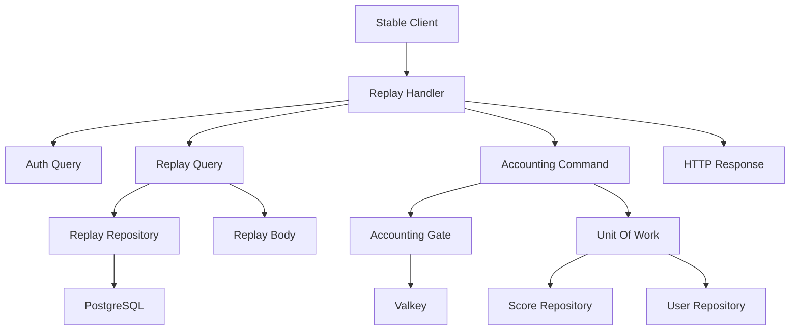
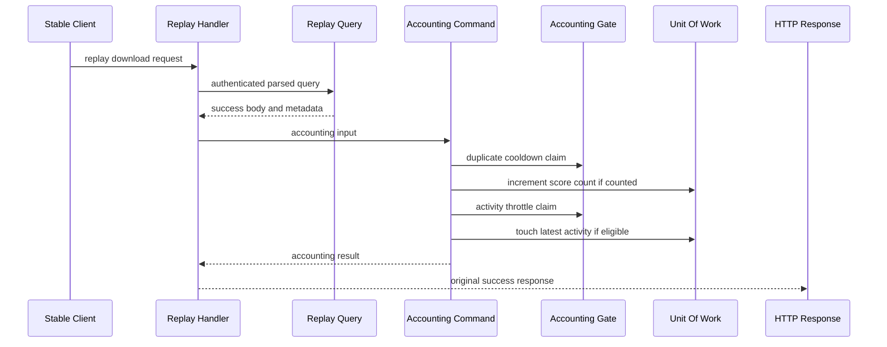
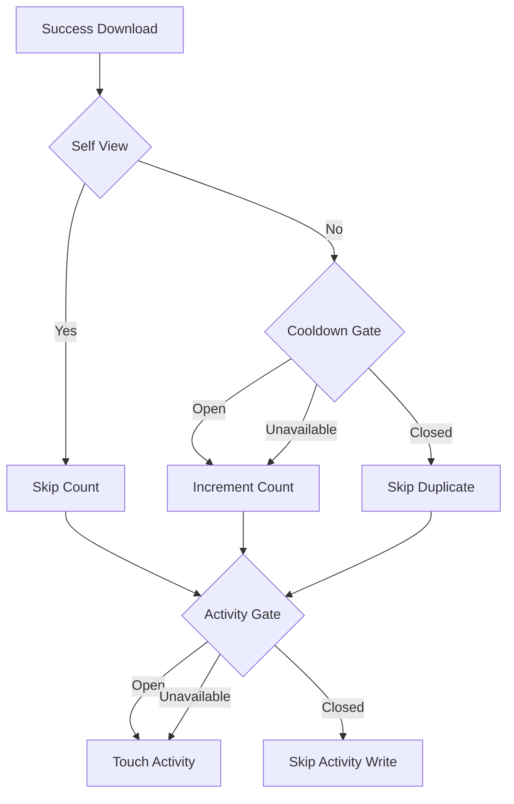
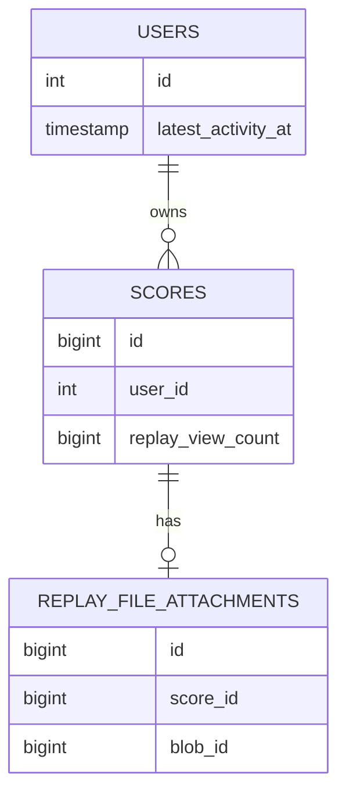
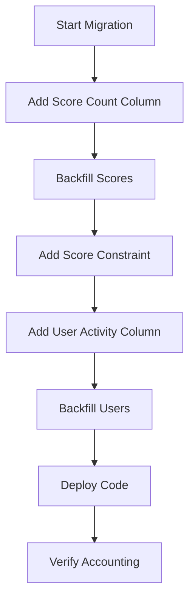

# Design Document

## Overview

`replay-download-accounting` は、Stable client の `GET /web/osu-getreplay.php` が replay download success response を返せることが確定した後に、score-scoped Replay View Count と viewer user の latest activity を best-effort で更新する。Client-visible response は Issue #36 / PR #40 の contract を維持し、accounting metadata や failure detail は response に出さない。

この design は既存 `replay-download-response` の query-only path を維持し、success branch から得た accounting metadata を command use-case に渡す。Replay View Count は score row の durable projection とし、duplicate cooldown と latest activity throttle は Valkey backed temporary marker と memory adapter で扱う。

### Goals

- Successful authenticated replay download の後だけ accounting を評価する。
- Replay View Count を score-scoped non-null projection として保存し、self-view と duplicate cooldown を除外する。
- Successful replay download を viewer latest activity として扱い、5分 throttle で durable writes を間引く。
- Accounting failure が replay download response bytes、status、headers を変えないことを保証する。
- Failure branch、raw query values、credential values、raw replay payload、local artifact path を accounting logs や response に漏らさない。

### Non-Goals

- Stable client が replay playback を開始した事実の検出。
- Durable per-download accounting event history。
- `/web/replays/<id>` alias。
- Replay download request parsing、auth、lookup、storage body strategy、response status/header/body の変更。
- User total replay views の source of truth。
- Anti-cheat、replay frame validation、score submission replay repair。

## Boundary Commitments

### This Spec Owns

- Replay download success branch から accounting command を呼ぶ orchestration。
- `ReplayDownloadAccountingMetadata` の query result contract。
- `ReplayDownloadAccountingUseCase` とその input/result vocabulary。
- Score row の `replay_view_count` durable projection。
- User row の `latest_activity_at` durable metadata。
- Duplicate view cooldown と activity throttle の temporary gate port。
- Valkey and memory gate adapters。
- Accounting operation failure の sanitized operator observability。
- #36 response contract を守る regression verification。

### Out of Boundary

- Replay download の client-visible response contract の再設計。
- Stable playback signal の探索または導入。
- Durable replay download event/audit table。
- User-scoped replay view source of truth。
- Public API、Web App、lazer API での Replay View Count 表示。
- `/web/replays/<id>` route registration。
- Auth/session/token/IP を使った duplicate identity policy。

### Allowed Dependencies

- `ReplayDownloadQuery` and `ReplayDownloadQueryResult` for success body and accounting metadata。
- `SessionCredentialsQueryUseCase` for stable legacy authentication。
- `UnitOfWorkFactory` for score/user command repository operations。
- `ReplayDownloadAccountingGate` for temporary Valkey or memory marker claims。
- SQLAlchemy 2.0 async and Alembic for schema and command repository persistence。
- Valkey GLIDE `Script` and `invoke_script` for atomic one-shot marker claims。
- `structlog` for sanitized operator diagnostics。

### Revalidation Triggers

- Target Stable Client traffic confirms a replay playback signal separate from replay download.
- Issue #36 replay download response bytes、status、headers、or success branch semantics change。
- Score visibility, replay availability, or storage-missing branch classification changes。
- Replay View Count source of truth moves away from `scores.replay_view_count`。
- Temporary cooldown/throttle marker retention changes from Valkey TTL best-effort to durable guarantee。
- Future user-stats work needs user total replay views with semantics different from sum of score-scoped Replay View Count。

## Architecture

### Existing Architecture Analysis

Stable legacy replay download currently follows a thin transport plus query-use-case pattern:

- `StableReplayDownloadExchange.respond()` owns auth, parse, query call, and HTTP response formatting.
- `ReplayDownloadQuery` owns read-only score/replay/blob branch classification.
- `ReplayDownloadQueryRepository` returns replay attachment metadata but not accounting metadata.
- Existing tests assert the query use-case does not mutate replay view or latest activity.
- Command-side persistence is already available through `UnitOfWork`, which exposes `scores` and `users`.

The design preserves this split. The query path gains success metadata only; all mutation policy lives in a new command use-case.

### Architecture Pattern & Boundary Map

Selected pattern: query success metadata plus dedicated command accounting.



Architecture integration:

- Runtime adapter remains responsible for HTTP input/output and best-effort command invocation.
- Query use-case remains read-only and returns hidden accounting metadata only for success.
- Command use-case owns self-view, duplicate cooldown, latest activity throttle, failure isolation, and logs.
- Repositories own durable mutation; state adapters own temporary marker key design.
- Dependency direction stays `transport -> query/command use-cases -> repository/state ports -> infrastructure adapters`.

### Technology Stack

| Layer | Choice / Version | Role in Feature | Notes |
| --- | --- | --- | --- |
| Backend / Transport | Starlette | Existing `/web/osu-getreplay.php` handler and response mapping | No route contract change |
| Backend / Services | Python 3.14 dataclasses and Protocols | Command/query inputs, results, and ports | Domain code stays Pydantic-free |
| Data / Storage | SQLAlchemy 2.0 async, PostgreSQL, Alembic | Score count and latest activity persistence | Adds one migration |
| Infrastructure / Runtime | Valkey GLIDE >= 2.1 | Temporary cooldown/throttle markers | Uses existing `Script` pattern |
| Observability | structlog >= 25.5.0 | Sanitized operation failure logs | No raw payload/query/credential fields |
| Tests | pytest, pytest-asyncio | Command, repository, state adapter, transport regression tests | No new dependency |

## File Structure Plan

### Directory Structure

```text
src/osu_server/
├── services/
│   ├── commands/scores/
│   │   ├── replay_download_accounting.py
│   │   └── __init__.py
│   └── queries/scores/
│       ├── replay_download.py
│       └── __init__.py
├── infrastructure/state/
│   ├── interfaces/replay_download_accounting.py
│   ├── memory/replay_download_accounting.py
│   └── valkey/replay_download_accounting.py
├── repositories/
│   ├── interfaces/commands/
│   │   ├── scores.py
│   │   └── users.py
│   ├── interfaces/queries/replay_download.py
│   ├── sqlalchemy/
│   │   ├── commands/scores.py
│   │   ├── commands/users.py
│   │   ├── models/score.py
│   │   ├── models/user.py
│   │   └── queries/replay_download.py
│   └── memory/commands/
│       ├── scores.py
│       ├── users.py
│       └── state.py
├── transports/stable/web_legacy/
│   └── replay_download.py
└── composition/providers/
    ├── infrastructure.py
    ├── scores.py
    ├── stable_web_legacy.py
    └── test.py

alembic/versions/
└── 20260707_0100_add_replay_download_accounting.py

tests/
├── unit/services/commands/scores/test_replay_download_accounting.py
├── unit/infrastructure/state/test_replay_download_accounting_gate.py
├── unit/transports/web_legacy/test_replay_download_handler_accounting.py
├── unit/repositories/test_score_replay_view_count_contract.py
├── unit/repositories/test_user_latest_activity_contract.py
├── unit/repositories/sqlalchemy/test_score_replay_view_count_repository.py
├── unit/repositories/sqlalchemy/test_user_latest_activity_repository.py
└── integration/transports/web_legacy/test_replay_download_accounting_endpoint.py
```

### Modified Files

- `src/osu_server/services/queries/scores/replay_download.py` - add success-only accounting metadata to `ReplayDownloadQueryResult`.
- `src/osu_server/repositories/interfaces/queries/replay_download.py` - add `score_id` and `score_owner_user_id` to available replay candidate.
- `src/osu_server/repositories/sqlalchemy/queries/replay_download.py` - select and map `ScoreModel.user_id` for success metadata.
- `src/osu_server/repositories/memory/queries/replay_download.py` - mirror success metadata in memory query adapter.
- `src/osu_server/transports/stable/web_legacy/replay_download.py` - call accounting command after success result and before response construction.
- `src/osu_server/services/commands/scores/__init__.py` - export replay download accounting command types.
- `src/osu_server/domain/scores/score.py` - add `replay_view_count` with default `0` and non-negative validation.
- `src/osu_server/domain/identity/users.py` - add `latest_activity_at`.
- `src/osu_server/repositories/sqlalchemy/queries/_shared.py` - map new score/user fields to domain objects.
- `src/osu_server/repositories/sqlalchemy/commands/scores.py` - add atomic Replay View Count increment and create/read mapping.
- `src/osu_server/repositories/sqlalchemy/commands/users.py` - add latest activity touch and user mapping.
- `src/osu_server/repositories/memory/unit_of_work.py` - ensure new in-memory score/user state commits.
- `src/osu_server/composition/providers/scores.py` - provide `ReplayDownloadAccountingUseCase`.
- `src/osu_server/composition/providers/infrastructure.py` - provide Valkey-backed `ReplayDownloadAccountingGate`.
- `src/osu_server/composition/providers/stable_web_legacy.py` - inject accounting command into `ReplayDownloadHandler`.
- `src/osu_server/composition/providers/test.py` - replace gate with in-memory adapter for tests.

## System Flows

### Successful Replay Download Accounting



The handler catches command exceptions and still returns the original success response. The command catches operation-level failures where possible so failures are distinguishable by operation.

### Accounting Branch Flow



Gate unavailable branches are best-effort: they may over-count duplicate downloads or write activity more often, but they never fail the replay download response.

## Requirements Traceability

| Requirement | Summary | Components | Interfaces | Flows |
| --- | --- | --- | --- | --- |
| 1.1 | Evaluate accounting after success body is known | Replay Handler, Replay Query Metadata, Accounting Command | `ReplayDownloadQueryResult`, `ReplayDownloadAccountingInput` | Successful Replay Download Accounting |
| 1.2 | Auth failure does not update | Replay Handler | auth early return, no command call | Successful Replay Download Accounting |
| 1.3 | Missing/hidden/storage/malformed branches do not update | Replay Handler, Replay Query Result | branch gate before command call | Successful Replay Download Accounting |
| 1.4 | Preserve #36 response status/headers/body | Replay Handler | response formatter unchanged | Successful Replay Download Accounting |
| 1.5 | Accounting failure does not fail response and is observable | Accounting Command, Replay Handler, structlog | result outcomes, sanitized logs | Successful Replay Download Accounting |
| 1.6 | Do not expose accounting metadata or failure details | Replay Handler, Accounting Metadata | metadata not mapped to response | Successful Replay Download Accounting |
| 2.1 | Counted download increments score count | Accounting Command, Score Repository | `increment_replay_view_count` | Accounting Branch Flow |
| 2.2 | Replay View Count is score-scoped | Score Model, Score Domain | `scores.replay_view_count` | Accounting Branch Flow |
| 2.3 | Existing scores expose zero when no count | Alembic Migration, Score Model | non-null default and backfill | Migration Strategy |
| 2.4 | New scores start at zero | Score Repository, Score Model | create mapping default | Migration Strategy |
| 2.5 | Replay View Count is not null | Score Model, Migration | non-null column and domain validation | Migration Strategy |
| 2.6 | No durable per-download event history | Data Model Boundary | no event table | Accounting Branch Flow |
| 2.7 | Future user totals derive from score counts | Score Projection Boundary | score-scoped source of truth | Data Models |
| 3.1 | Self-view does not increment | Accounting Command | owner/viewer comparison | Accounting Branch Flow |
| 3.2 | Non-owner no cooldown increments | Accounting Command, Gate, Score Repository | cooldown claim true | Accounting Branch Flow |
| 3.3 | Duplicate same viewer/score within 24h suppresses count | Accounting Gate, Accounting Command | cooldown claim false | Accounting Branch Flow |
| 3.4 | Different score has independent cooldown | Accounting Gate | key includes score id | Accounting Branch Flow |
| 3.5 | Different viewer has independent cooldown | Accounting Gate | key includes viewer id | Accounting Branch Flow |
| 3.6 | Cooldown window is 24h | Accounting Command, Gate | fixed ttl 86400 | Accounting Branch Flow |
| 3.7 | Cooldown loss/unavailable preserves download success | Accounting Command, Replay Handler | gate failure open and logged | Accounting Branch Flow |
| 3.8 | Duplicate identity excludes IP/session/raw query | Accounting Input, Gate | viewer user id and score id only | Accounting Branch Flow |
| 4.1 | Successful download eligible for latest activity | Accounting Command, User Repository | `touch_latest_activity` | Accounting Branch Flow |
| 4.2 | Self-view eligible for latest activity | Accounting Command | activity branch independent of count | Accounting Branch Flow |
| 4.3 | Duplicate cooldown hit eligible for latest activity | Accounting Command | activity branch runs after duplicate skip | Accounting Branch Flow |
| 4.4 | Throttle avoids durable write per download | Accounting Gate, User Repository | activity claim false | Accounting Branch Flow |
| 4.5 | Activity throttle window is 5m | Accounting Command, Gate | fixed ttl 300 | Accounting Branch Flow |
| 4.6 | Throttle loss/unavailable preserves download success | Accounting Command, Replay Handler | gate failure open and logged | Accounting Branch Flow |
| 4.7 | Latest activity is metadata not audit log | User Model, Data Boundary | `users.latest_activity_at`, no event table | Data Models |
| 5.1 | Treat download as consumption signal not playback | Accounting Command, Domain Vocabulary | input naming and docs | Boundary Commitments |
| 5.2 | No durable event history | Data Model Boundary | no event table | Data Models |
| 5.3 | No alias behavior | Replay Handler | no route changes | Boundary Commitments |
| 5.4 | No parsing/auth/lookup/storage/response strategy changes | Replay Handler, Replay Query | metadata-only query extension | Boundary Commitments |
| 5.5 | Playback signal requires policy revalidation | Revalidation Triggers | documented trigger | Boundary Commitments |
| 5.6 | Future user stats aggregate from score count | Data Model Boundary | score-scoped source | Data Models |
| 6.1 | Verify non-owner increments once | Command Tests, Repository Tests | command result and DB count | Testing Strategy |
| 6.2 | Verify self-view no increment | Command Tests | self-view outcome | Testing Strategy |
| 6.3 | Verify duplicate cooldown suppression | Gate Tests, Command Tests | cooldown closed outcome | Testing Strategy |
| 6.4 | Verify activity eligibility on success/self/duplicate | Command Tests | activity outcome | Testing Strategy |
| 6.5 | Verify activity throttle write suppression | Gate Tests, Command Tests | throttle closed outcome | Testing Strategy |
| 6.6 | Verify failure branches do not update | Handler and endpoint tests | no command call | Testing Strategy |
| 6.7 | Verify accounting success/failure does not change response | Handler and endpoint tests | response comparison | Testing Strategy |
| 6.8 | Verify failures distinguish operations without sensitive data | Command Tests, Log Tests | sanitized structlog fields | Testing Strategy |

## Components and Interfaces

| Component | Domain/Layer | Intent | Req Coverage | Key Dependencies | Contracts |
| --- | --- | --- | --- | --- | --- |
| Replay Download Metadata Extension | Query | Provide success-only accounting metadata | 1.1, 1.6, 3.8, 5.4 | Replay repository P0 | Service |
| ReplayDownloadAccountingUseCase | Command | Apply count and activity policy | 1.1, 1.5, 2.1, 3.1, 3.2, 3.3, 3.4, 3.5, 3.6, 3.7, 3.8, 4.1, 4.2, 4.3, 4.4, 4.5, 4.6, 4.7 | Gate P0, UoW P0 | Service |
| ReplayDownloadAccountingGate | State | Claim cooldown and throttle markers | 3.3, 3.4, 3.5, 3.6, 3.7, 4.4, 4.5, 4.6 | Valkey P0 | State |
| Score Replay View Persistence | Repository | Store and increment score-scoped count | 2.1, 2.2, 2.3, 2.4, 2.5, 2.6, 2.7 | SQLAlchemy P0 | Service |
| User Latest Activity Persistence | Repository | Store throttled viewer latest activity | 4.1, 4.2, 4.3, 4.4, 4.5, 4.6, 4.7 | SQLAlchemy P0 | Service |
| Stable Replay Handler Hook | Transport | Invoke accounting without changing response | 1.1, 1.2, 1.3, 1.4, 1.5, 1.6, 5.3, 5.4, 6.6, 6.7 | Query P0, Command P1 | Service |

### Query Layer

#### Replay Download Metadata Extension

| Field | Detail |
| --- | --- |
| Intent | Success replay download result carries score identity needed for accounting |
| Requirements | 1.1, 1.6, 3.8, 5.4 |

**Responsibilities & Constraints**

- Add `ReplayDownloadAccountingMetadata(score_id: int, score_owner_user_id: int)`.
- Attach metadata only to `ReplayDownloadQueryResult` with `ReplayDownloadBranch.SUCCESS`.
- Keep metadata out of HTTP response and logs by default.
- Avoid transport-side DB lookup for score owner.

**Dependencies**

- Inbound: Stable Replay Handler - consumes success metadata (P0)
- Outbound: ReplayDownloadQueryRepository - supplies available replay candidate metadata (P0)
- External: None

**Contracts**: Service [x] / API [ ] / Event [ ] / Batch [ ] / State [ ]

##### Service Interface

```python
@dataclass(slots=True, frozen=True)
class ReplayDownloadAccountingMetadata:
    score_id: int
    score_owner_user_id: int

@dataclass(slots=True, frozen=True)
class ReplayDownloadQueryResult:
    branch: ReplayDownloadBranch
    response_body: ReplayDownloadResponseBody | None = None
    accounting_metadata: ReplayDownloadAccountingMetadata | None = None
```

- Preconditions: Metadata is present only when branch is `SUCCESS`.
- Postconditions: Non-success results never contain metadata.
- Invariants: Metadata contains only identifiers, never query values, credentials, payload bytes, or storage paths.

### Command Layer

#### ReplayDownloadAccountingUseCase

| Field | Detail |
| --- | --- |
| Intent | Execute best-effort replay download accounting policy |
| Requirements | 1.1, 1.5, 2.1, 3.1, 3.2, 3.3, 3.4, 3.5, 3.6, 3.7, 3.8, 4.1, 4.2, 4.3, 4.4, 4.5, 4.6, 4.7, 5.1, 5.2, 6.1, 6.2, 6.3, 6.4, 6.5, 6.8 |

**Responsibilities & Constraints**

- Receive minimal input: `score_id`, `score_owner_user_id`, `viewer_user_id`, `occurred_at`.
- Skip count for self-view.
- Claim 24h duplicate cooldown for non-owner count candidates.
- Increment score replay view count only when count is accepted.
- Claim 5m latest activity throttle for every successful replay download.
- Touch latest activity for self-view and duplicate cooldown hit when throttle allows.
- Isolate count and activity durable writes in separate operation boundaries.
- Return operation outcomes for tests and local observability.
- Never raise operation-level failure to transport when the failure can be captured and logged.

**Dependencies**

- Inbound: Stable Replay Handler Hook - invokes after success result (P0)
- Outbound: ReplayDownloadAccountingGate - cooldown/throttle claims (P0)
- Outbound: UnitOfWorkFactory - durable score/user operations (P0)
- External: structlog - sanitized diagnostics (P1)

**Contracts**: Service [x] / API [ ] / Event [ ] / Batch [ ] / State [ ]

##### Service Interface

```python
@dataclass(slots=True, frozen=True)
class ReplayDownloadAccountingInput:
    score_id: int
    score_owner_user_id: int
    viewer_user_id: int
    occurred_at: datetime

class ReplayViewAccountingOutcome(StrEnum):
    INCREMENTED = "incremented"
    SKIPPED_SELF_VIEW = "skipped_self_view"
    SKIPPED_DUPLICATE = "skipped_duplicate"
    FAILED = "failed"

class LatestActivityAccountingOutcome(StrEnum):
    TOUCHED = "touched"
    THROTTLED = "throttled"
    FAILED = "failed"

@dataclass(slots=True, frozen=True)
class ReplayDownloadAccountingResult:
    replay_view_outcome: ReplayViewAccountingOutcome
    latest_activity_outcome: LatestActivityAccountingOutcome

class ReplayDownloadAccountingUseCase:
    async def execute(
        self,
        input_data: ReplayDownloadAccountingInput,
    ) -> ReplayDownloadAccountingResult: ...
```

- Preconditions: ids are positive integers; `occurred_at` is timezone-aware.
- Postconditions: Success response ownership remains outside this use-case.
- Invariants: Count and activity operation failures are distinguishable.

**Implementation Notes**

- Integration: Handler wraps `execute` in a broad best-effort guard.
- Validation: Unit tests cover self-view, duplicate hit, gate unavailable, DB failure after marker, and activity throttle.
- Risks: Gate-open on Valkey failure may over-count; accepted by requirement 3.7 and 4.6.

### State Layer

#### ReplayDownloadAccountingGate

| Field | Detail |
| --- | --- |
| Intent | Provide temporary first-claim markers for replay accounting |
| Requirements | 3.3, 3.4, 3.5, 3.6, 3.7, 3.8, 4.4, 4.5, 4.6 |

**Responsibilities & Constraints**

- Own Valkey key patterns for replay duplicate cooldown and activity throttle.
- Use viewer user id plus score id for duplicate cooldown identity.
- Use viewer user id for activity throttle identity.
- Use fixed TTL values supplied by command: 86400 seconds and 300 seconds.
- Return `True` for first claim and `False` for existing marker.
- Do not use IP address, session token, raw query values, or credential values.

**Dependencies**

- Inbound: ReplayDownloadAccountingUseCase - claims markers (P0)
- Outbound: Valkey GLIDE - production marker storage (P0)
- Outbound: In-memory state - tests and in-memory runtime (P1)

**Contracts**: Service [ ] / API [ ] / Event [ ] / Batch [ ] / State [x]

##### State Management

- State model:
  - `replay_download_accounting:view:{viewer_user_id}:score:{score_id}` -> marker with 24h TTL.
  - `replay_download_accounting:activity:{viewer_user_id}` -> marker with 5m TTL.
- Persistence & consistency:
  - Valkey TTL markers are temporary and not durable source of truth.
  - Marker loss permits duplicate count or extra activity write.
- Concurrency strategy:
  - Valkey adapter uses Lua script with `SET ... NX EX ...` and returns a boolean claim result.
  - In-memory adapter stores expiration timestamps and prunes expired entries on claim.

### Repository Layer

#### Score Replay View Persistence

| Field | Detail |
| --- | --- |
| Intent | Store Replay View Count as score-scoped durable projection |
| Requirements | 2.1, 2.2, 2.3, 2.4, 2.5, 2.6, 2.7, 6.1, 6.2, 6.3 |

**Responsibilities & Constraints**

- Add `replay_view_count` to score domain and SQLAlchemy model.
- Backfill existing scores to `0` and disallow null values.
- Enforce non-negative value through domain validation and DB check constraint.
- Provide atomic increment by score id.
- Return whether the target score existed for observability.

**Dependencies**

- Inbound: ReplayDownloadAccountingUseCase - increments count (P0)
- Outbound: SQLAlchemy command session - performs update (P0)
- External: PostgreSQL - durable storage (P0)

**Contracts**: Service [x] / API [ ] / Event [ ] / Batch [ ] / State [ ]

##### Service Interface

```python
class ScoreCommandRepository(Protocol):
    async def increment_replay_view_count(self, score_id: int) -> bool: ...
```

- Preconditions: `score_id` is positive.
- Postconditions: Existing score count increases by exactly one per successful call.
- Invariants: Count never becomes negative and is never null.

#### User Latest Activity Persistence

| Field | Detail |
| --- | --- |
| Intent | Store viewer latest activity timestamp as durable user metadata |
| Requirements | 4.1, 4.2, 4.3, 4.4, 4.5, 4.6, 4.7, 6.4, 6.5 |

**Responsibilities & Constraints**

- Add `latest_activity_at` to user domain and SQLAlchemy model.
- Backfill existing users from `created_at`.
- Provide touch method by user id and timestamp.
- Return whether the user existed for observability.
- Treat this value as metadata, not per-download audit history.

**Dependencies**

- Inbound: ReplayDownloadAccountingUseCase - touches activity (P0)
- Outbound: SQLAlchemy command session - performs update (P0)
- External: PostgreSQL - durable storage (P0)

**Contracts**: Service [x] / API [ ] / Event [ ] / Batch [ ] / State [ ]

##### Service Interface

```python
class UserCommandRepository(Protocol):
    async def touch_latest_activity(self, user_id: int, occurred_at: datetime) -> bool: ...
```

- Preconditions: `occurred_at` is timezone-aware.
- Postconditions: Existing user's `latest_activity_at` is set to the provided timestamp.
- Invariants: No per-download activity rows are created.

### Transport Layer

#### Stable Replay Handler Hook

| Field | Detail |
| --- | --- |
| Intent | Invoke accounting after success without changing response contract |
| Requirements | 1.1, 1.2, 1.3, 1.4, 1.5, 1.6, 5.3, 5.4, 6.6, 6.7 |

**Responsibilities & Constraints**

- Call accounting only when replay query result is success and has response body plus metadata.
- Build command input from authenticated viewer id and query metadata.
- Use current UTC time for `occurred_at`.
- Catch all accounting exceptions and log sanitized failure.
- Return the same response body, status, and headers as #36.

**Dependencies**

- Inbound: Starlette route delegate - existing handler call (P0)
- Outbound: SessionCredentialsQueryUseCase - auth (P0)
- Outbound: ReplayDownloadQuery - response result (P0)
- Outbound: ReplayDownloadAccountingUseCase - best-effort side effect (P1)

**Contracts**: Service [x] / API [ ] / Event [ ] / Batch [ ] / State [ ]

##### Service Interface

```python
class ReplayDownloadHandler:
    async def __call__(self, request: Request) -> Response: ...
```

- Preconditions: Request query params are passed through existing parser/auth.
- Postconditions: Accounting is never client-visible.
- Invariants: Auth failure and non-success branches do not call accounting.

## Data Models

### Domain Model

- `ReplayDownloadAccountingInput` is a command input, not a durable event.
- `Replay View Count` is owned by `Score` and stored on the score row.
- `Replay Download Activity Touch` is owned by user metadata and stored on the user row.
- `ReplayDownloadAccountingGate` state is temporary and not authoritative.

Business invariants:

- `Score.replay_view_count >= 0`.
- New scores start with `replay_view_count == 0`.
- `User.latest_activity_at` is timezone-aware and non-null.
- Self-view never increments Replay View Count.
- Latest activity eligibility is independent of count outcome.

### Logical Data Model



Consistency & integrity:

- Score count increment uses one command UoW transaction.
- Latest activity touch uses a separate command UoW transaction.
- Duplicate cooldown marker is claimed before count increment.
- Activity throttle marker is claimed before activity touch.
- If durable write fails after marker claim, the undercount or missed retry is accepted.

### Physical Data Model

Relational changes:

- `scores.replay_view_count BIGINT NOT NULL DEFAULT 0`.
- `ck_scores_replay_view_count_non_negative CHECK (replay_view_count >= 0)`.
- `users.latest_activity_at TIMESTAMP WITH TIME ZONE NOT NULL`.
- Existing `scores` rows are backfilled to `0`.
- Existing `users` rows are backfilled from `created_at`.
- No per-download event table is created.
- No additional index is required for initial #37 because updates target primary keys.

Key-value changes:

- `replay_download_accounting:view:{viewer_user_id}:score:{score_id}` stores a marker value with 86400 second TTL.
- `replay_download_accounting:activity:{viewer_user_id}` stores a marker value with 300 second TTL.
- Key names are adapter-owned and never built by transport or command callers.

### Data Contracts & Integration

No public API response schema changes are introduced. Internal command/query contracts are:

- Query success metadata: `score_id`, `score_owner_user_id`.
- Accounting input: `score_id`, `score_owner_user_id`, `viewer_user_id`, `occurred_at`.
- Accounting result: replay view outcome and latest activity outcome.

## Error Handling

### Error Strategy

- Auth failure, malformed request, hidden score, missing replay, storage missing, unavailable replay branch: no accounting command call.
- Gate claim failure: log sanitized gate failure, treat gate as open, continue durable operation when applicable.
- Score count increment failure: log `replay_download_accounting_replay_view_failed`, continue latest activity operation.
- Latest activity touch failure: log `replay_download_accounting_latest_activity_failed`, keep response success.
- Unhandled accounting command exception at transport boundary: log `replay_download_accounting_failed`, return original success response.

### Monitoring

Structured log fields are restricted to:

- `operation`: `replay_view_count`, `latest_activity`, `cooldown_gate`, `activity_gate`, or `accounting_command`.
- `score_id`
- `viewer_user_id`
- `score_owner_user_id`
- `outcome`
- `exception_type`

Forbidden log and response fields:

- Raw replay payload bytes.
- Raw query values.
- Username/password/password hash/session token.
- Blob storage key or local filesystem path.
- Full SQL parameters or local artifact paths.

## Testing Strategy

### Unit Tests

- `ReplayDownloadAccountingUseCase` increments count for non-owner success with open cooldown and returns `INCREMENTED` plus `TOUCHED` for open activity gate, covering 2.1, 3.2, 4.1, 6.1.
- `ReplayDownloadAccountingUseCase` skips count for self-view while still touching latest activity, covering 3.1, 4.2, 6.2, 6.4.
- `ReplayDownloadAccountingUseCase` skips count for duplicate cooldown hit and still evaluates activity, covering 3.3, 4.3, 6.3, 6.4.
- `ReplayDownloadAccountingUseCase` suppresses durable activity write when throttle marker exists, covering 4.4, 4.5, 6.5.
- Operation failure tests verify count and activity failures are distinguishable and sanitized, covering 1.5 and 6.8.
- `ReplayDownloadQueryResult` validation rejects success without metadata/body and rejects metadata on non-success, covering 1.1 and 1.6.
- `ReplayDownloadAccountingGate` memory adapter tests verify independent viewer/score cooldown and viewer-only activity throttle, covering 3.4, 3.5, 4.5.

### Repository Tests

- Score repository contract tests verify new scores have `replay_view_count == 0`, existing reads return non-null count, and increment increases by exactly one.
- SQLAlchemy score repository tests verify atomic update by primary key and false return for missing score.
- User repository contract tests verify `latest_activity_at` is stored and touch updates only the target user.
- SQLAlchemy migration tests or integration smoke checks verify non-null/default/check constraints for new columns.

### Transport And Integration Tests

- Handler tests verify auth failure and non-success branches do not call accounting, covering 1.2, 1.3, 6.6.
- Handler tests verify accounting success does not change #36 success body/status/headers, covering 1.4 and 6.7.
- Handler tests verify accounting exception does not change #36 success body/status/headers and logs sanitized failure, covering 1.5, 1.6, 6.7, 6.8.
- Endpoint integration test seeds two users and one replay, downloads as non-owner, and verifies score count increments once and viewer latest activity updates.
- Endpoint integration test downloads twice within cooldown and verifies count remains one while latest activity throttle prevents a second durable write.

### Performance and Load

- Gate claim and primary-key update are O(1) operations per successful replay download.
- Duplicate downloads within cooldown avoid repeat count writes.
- Activity throttle limits durable user activity writes to at most one per viewer per 5 minutes under successful replay download traffic.

## Security Considerations

- Duplicate identity is authenticated `viewer_user_id` plus `score_id`; IP address, session token, and raw query values are excluded.
- Accounting metadata is internal only and not serialized to the client.
- Logs use numeric ids and operation labels only.
- Auth failure never reaches parser branch details or accounting.
- Accounting side effects do not grant authorization and must not be used as evidence of actual replay playback.

## Performance & Scalability

- The design adds at most two Valkey script calls and two primary-key database writes per successful download.
- Self-view avoids count gate and count DB write.
- Duplicate cooldown suppresses repeated score count writes for the same viewer/score pair for 24 hours.
- Activity throttle suppresses repeated user activity writes for 5 minutes per viewer.
- Valkey outage degrades to possible over-count or extra activity write, but does not fail replay downloads.
- No new DB index is required for initial #37 because updates target primary keys.

## Migration Strategy



Migration decisions:

- Add `scores.replay_view_count` with server default `0`, nullable false, and non-negative check.
- Add `users.latest_activity_at`, backfill from `created_at`, then enforce nullable false.
- Downgrade removes new constraints and columns.
- No data migration for per-download history exists because no event table is created.

Validation checkpoints:

- Existing score reads return `0` instead of null.
- New score creation persists `0`.
- Existing user reads have `latest_activity_at == created_at` after backfill.
- Replay download response regression tests pass before enabling tasks beyond migration.
