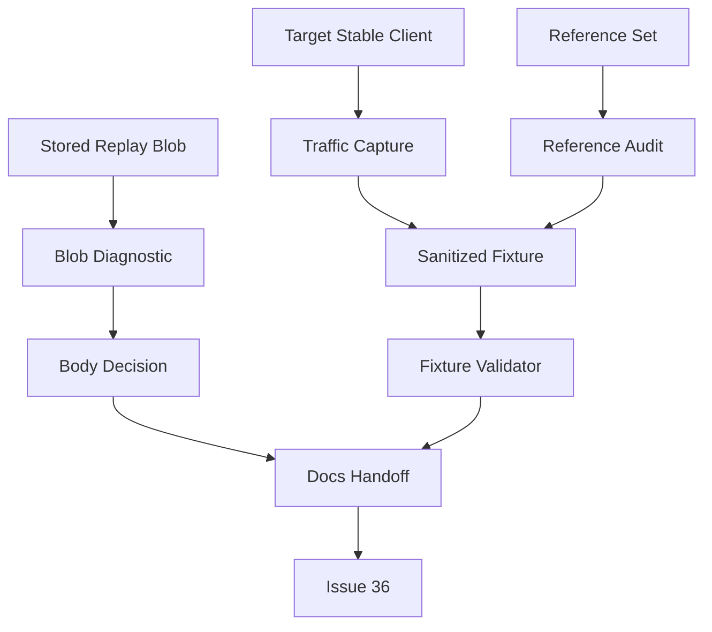
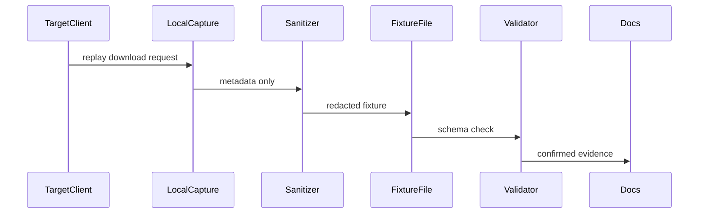
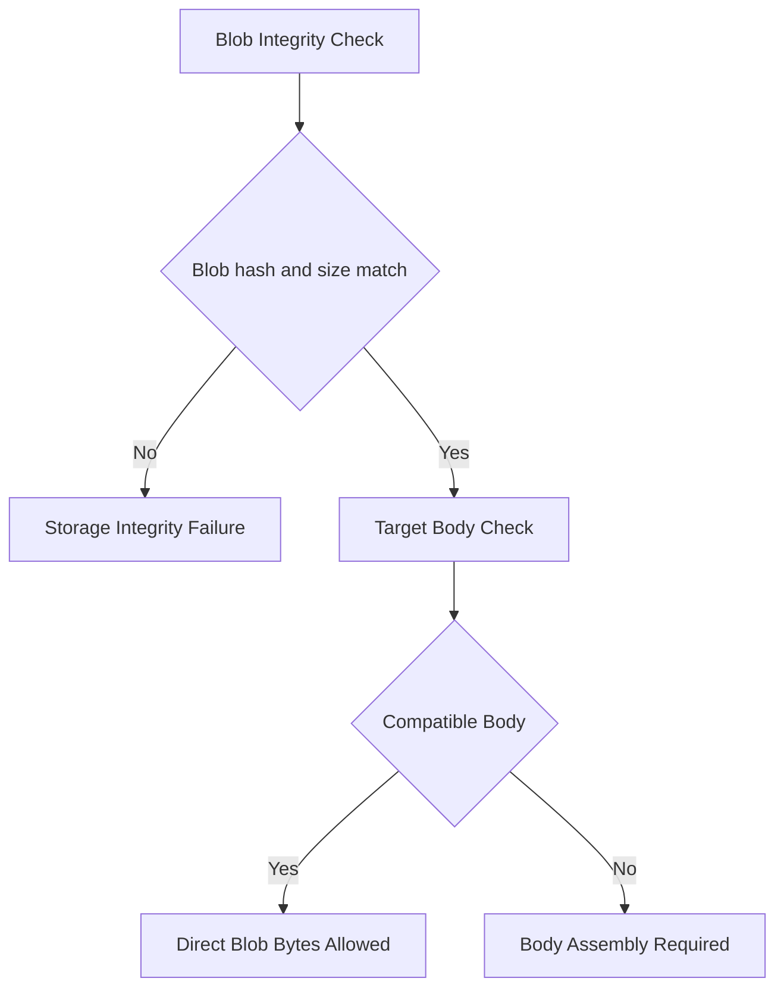

# Design Document

## Overview

Replay Download Contract は、Stable replay download を実装する前に route、auth、request、response、success body、missing branches、alias 方針を evidence-backed に固定するための evidence workflow である。主な利用者は stable compatibility 保守者、次の実装エージェント、レビュー担当者である。

この spec は production endpoint を実装しない。既存の stable verification tooling と docs を拡張し、#36 が「何を実装すべきか」と「何が未確認なら止まるべきか」を読める状態にする。

### Goals

- `/web/osu-getreplay.php` の route/auth/request/response contract を Target Stable Client traffic と reference evidence で固定する。
- Replay Download Response Body が raw blob bytes で足りるか、target-client-compatible body assembly が必要かを決める。
- OSS repository に安全な sanitized fixture と docs evidence を残す。
- #36 と #37 の境界を分け、view count / latest activity を #35 / #36 に混ぜない。

### Non-Goals

- replay download endpoint の route 実装。
- replay view count、latest activity、cooldown policy の実装。
- score submission replay persistence の修正。
- raw traffic capture、raw replay bytes、complete `.osr` bytes の commit。
- anti-cheat、replay validation、spectator replay frame parsing。

## Boundary Commitments

### This Spec Owns

- Replay Download Contract Evidence Gate。
- Replay Download Traffic Capture の sanitized metadata schema。
- Replay Download Sanitized Fixture の validation。
- `bancho.py`、`deck`、`lets` の reference audit summary。
- Replay Blob Integrity Check と Replay Download Body Assembly Decision。
- `docs/stable-compatibility-guide.md` と `docs/stable-compatibility-matrix.md` の replay download evidence 更新。

### Out of Boundary

- Runtime route registration and request handling for `/web/osu-getreplay.php`。
- `/web/replays/<id>` alias implementation。
- Score visibility query implementation for download endpoint。
- Replay view count / latest activity update。
- Durable replay storage model changes。
- Raw capture retention policy outside local temporary diagnostics。

### Allowed Dependencies

- Existing `athena_cli.stable_verification` models, reporting, and fixture verification patterns。
- Existing score submission replay persistence behavior as an observed input, not as a design constraint to change.
- Existing blob storage read API for local diagnostic implementation.
- Stable compatibility docs and GitHub issue links as evidence destinations.
- External reference implementations `bancho.py`、`deck`、`lets` as audited sources, not as unreviewed source of truth.

### Revalidation Triggers

- Target stable client build changes.
- Captured route path, auth fields, or query key set changes.
- Reference implementations disagree with selected response contract.
- Score submission replay storage starts storing a different replay payload shape.
- #36 decides to implement body assembly differently from the decision recorded by this spec.

## Architecture

### Existing Architecture Analysis

Athena already has stable verification tooling under `src/athena_cli/stable_verification/` with evidence models, result reporting, and fixture-based verification. Score submit fixtures already store sanitized request metadata under `tests/fixtures/stable_compatibility/score_submit/`.

Replay persistence currently stores multipart replay bytes as blob content. The storage layer preserves bytes and validates SHA-256 / byte size, but it does not construct a replay download response body. 本家 Bancho capture では `/web/osu-getreplay.php` の 200 body が complete `.osr` ではなく LZMA-compressed replay payload として観測された。Therefore #35 must separate storage integrity from target-client-compatible download body compatibility.

### Architecture Pattern & Boundary Map

Selected pattern: evidence workflow extension. The design extends CLI/test verification boundaries and docs, while leaving production transport and query implementation to #36.



Key decisions:

- Target traffic owns route/auth truth.
- Reference audit can confirm response branches but cannot make a reference-only route required for the current target client.
- Blob diagnostic answers storage integrity only; target-client-compatible body evidence decides replay download success semantics.

### Technology Stack

| Layer | Choice / Version | Role in Feature | Notes |
| --- | --- | --- | --- |
| CLI / Verification | Existing Typer `athena dev stable-verify` tooling | Fixture validation and report-safe diagnostics | No new dependency |
| Test Fixtures | JSON under `tests/fixtures/stable_compatibility/replay_download/` | Sanitized evidence records | No raw replay bytes |
| Docs | Markdown guide and matrix | Human-readable evidence handoff | Source of truth for #36 readiness |
| Storage Diagnostic | Existing blob query/read APIs | Hash / size / existence comparison | No mutation |

## File Structure Plan

### Directory Structure

```text
.kiro/specs/replay-download-contract/
├── spec.json
├── requirements.md
├── research.md
├── design.md
└── tasks.md

tests/fixtures/stable_compatibility/replay_download/
├── target_client_request_metadata.json
├── target_client_response_metadata.json
├── reference_responses.json
└── body_assembly_decision.json

src/athena_cli/stable_verification/
├── models.py
├── catalog.py
└── replay_download.py

tests/unit/athena_cli/stable_verification/
└── test_replay_download.py
```

### Modified Files

- `CONTEXT.md` — replay download evidence terminology and domain glossary.
- `docs/stable-compatibility-guide.md` — Replay Download evidence note, sanitized fixture pointers, body assembly decision.
- `docs/stable-compatibility-matrix.md` — replay download row classification, evidence source, blocker state.
- `src/athena_cli/stable_verification/models.py` — add replay download surface, fixture models, and diagnostic result models.
- `src/athena_cli/stable_verification/catalog.py` — register replay download evidence entries and gaps.
- `src/athena_cli/commands/dev.py` — expose replay download verification if stable verification runner needs an executor.
- `tests/unit/athena_cli/stable_verification/test_replay_download.py` — validate fixture schema, redaction, body decision, and diagnostic output.

## System Flows

### Evidence Capture Flow



The raw capture remains local-only. The repository receives only sanitized metadata and docs updates.

### Body Decision Flow



## Requirements Traceability

| Requirement | Summary | Components | Interfaces | Flows |
| --- | --- | --- | --- | --- |
| 1.1 | capture metadata | Traffic Capture Fixture | JSON fixture | Evidence Capture Flow |
| 1.2 | route/auth traffic required | Evidence Gate | fixture validator | Evidence Capture Flow |
| 1.3 | missing route/auth blocks #36 | Docs Handoff | matrix note | Evidence Capture Flow |
| 1.4 | auth behavior evidence | Reference Audit | reference response fixture | Evidence Capture Flow |
| 1.5 | unresolved auth blocks #36 | Docs Handoff | issue handoff | Evidence Capture Flow |
| 2.1 | success response metadata | Response Fixture | JSON fixture | Evidence Capture Flow |
| 2.2 | missing/hidden/storage branches | Reference Audit | reference response fixture | Evidence Capture Flow |
| 2.3 | malformed branches | Reference Audit | response branch table | Evidence Capture Flow |
| 2.4 | unresolved branch handling | Docs Handoff | blocker list | Evidence Capture Flow |
| 2.5 | response body vs blob | Body Decision | body decision fixture | Body Decision Flow |
| 3.1 | target-client-compatible body | Body Decision | body compatibility result | Body Decision Flow |
| 3.2 | raw blob not assumed | Body Decision | decision fixture | Body Decision Flow |
| 3.3 | assembly required flag | Body Decision | handoff field | Body Decision Flow |
| 3.4 | raw artifact local-only | Fixture Redaction | validator | Evidence Capture Flow |
| 4.1 | reference set | Reference Audit | audit table | Evidence Capture Flow |
| 4.2 | `bancho.py` role | Reference Audit | audit table | Evidence Capture Flow |
| 4.3 | `deck` role | Reference Audit | audit table | Evidence Capture Flow |
| 4.4 | `lets` role | Reference Audit | audit table | Evidence Capture Flow |
| 4.5 | disagreement handling | Evidence Gate | decision record | Evidence Capture Flow |
| 5.1 | sanitized fixture only | Fixture Redaction | JSON fixture | Evidence Capture Flow |
| 5.2 | forbidden raw values | Fixture Validator | tests | Evidence Capture Flow |
| 5.3 | auth redaction | Fixture Validator | tests | Evidence Capture Flow |
| 5.4 | safe body metadata | Fixture Validator | tests | Evidence Capture Flow |
| 5.5 | local raw capture only | Fixture Redaction | docs note | Evidence Capture Flow |
| 6.1 | blob diagnostic checks | Blob Diagnostic | diagnostic output | Body Decision Flow |
| 6.2 | storage failure classification | Blob Diagnostic | diagnostic result | Body Decision Flow |
| 6.3 | format mismatch classification | Blob Diagnostic | diagnostic result | Body Decision Flow |
| 6.4 | no raw output | Blob Diagnostic | tests | Body Decision Flow |
| 6.5 | direct vs assembly decision | Body Decision | decision fixture | Body Decision Flow |
| 7.1 | primary route classification | Evidence Gate | docs row | Evidence Capture Flow |
| 7.2 | alias decision | Reference Audit | docs row | Evidence Capture Flow |
| 7.3 | reference-only alias not required | Evidence Gate | matrix note | Evidence Capture Flow |
| 7.4 | alias variant separation | Reference Audit | fixture schema | Evidence Capture Flow |
| 8.1 | guide update | Docs Handoff | markdown | Evidence Capture Flow |
| 8.2 | matrix update | Docs Handoff | markdown | Evidence Capture Flow |
| 8.3 | blocker documentation | Docs Handoff | markdown / issue text | Evidence Capture Flow |
| 8.4 | implementation-ready handoff | Docs Handoff | markdown / issue text | Evidence Capture Flow |
| 8.5 | #37 boundary | Docs Handoff | boundary note | Evidence Capture Flow |

## Components and Interfaces

| Component | Domain/Layer | Intent | Req Coverage | Key Dependencies | Contracts |
| --- | --- | --- | --- | --- | --- |
| Evidence Gate | Verification | Decide whether #36 is implementation-ready | 1.2-1.5, 2.4, 4.5, 7.1-7.3 | Traffic Fixture P0, Reference Audit P1 | State |
| Traffic Capture Fixture | Verification | Store target client route/auth metadata safely | 1.1-1.3, 5.1-5.5 | Target capture P0 | State |
| Reference Audit | Verification | Summarize `bancho.py` / `deck` / `lets` findings | 2.2-2.3, 4.1-4.5, 7.2-7.4 | Reference sources P1 | State |
| Body Decision | Verification | Decide direct blob bytes vs target body assembly | 2.5, 3.1-3.4, 6.5 | Blob Diagnostic P0 | State |
| Blob Diagnostic | CLI / Verification | Check blob hash/size/existence without raw output | 6.1-6.4 | Blob storage read P1 | Service |
| Fixture Validator | Tests | Enforce schema and redaction | 5.1-5.4, 6.4 | JSON fixtures P0 | Service |
| Docs Handoff | Documentation | Reflect confirmed contract and blockers | 8.1-8.5 | All evidence P0 | State |

### Verification Layer

#### Evidence Gate

| Field | Detail |
| --- | --- |
| Intent | #36 が implementation-ready かを evidence status から判断する |
| Requirements | 1.2, 1.3, 1.5, 2.4, 4.5, 7.1, 7.3 |

**Responsibilities & Constraints**

- Route path、method、query key set、auth field presence は target traffic evidence 必須。
- Response branches は target traffic または reference evidence を許可する。
- Unresolved branch は `unconfirmed` として docs に残し、実装 ready と扱わない。
- Reference-only alias は current target-client required route に昇格しない。

**Contracts**: Service [ ] / API [ ] / Event [ ] / Batch [ ] / State [x]

##### State Contract

- `implementation_ready`: boolean。
- `blockers`: unresolved route/auth/response/body fields。
- `primary_route`: confirmed route path or `未確認`。
- `alias_policy`: required / deferred / candidate-only / `未確認`。

#### Traffic Capture Fixture

| Field | Detail |
| --- | --- |
| Intent | Target Stable Client traffic から sanitized metadata だけを保存する |
| Requirements | 1.1, 1.2, 5.1-5.5 |

**Responsibilities & Constraints**

- Target client family と build / `osuver` observation status は必須。Exact build や `osuver` が request に現れない場合は `not_observed` と note を残す。
- Query values、credential values、raw replay bytes は保存しない。
- Auth は field name または redacted category のみ保存する。

**Contracts**: Service [ ] / API [ ] / Event [ ] / Batch [ ] / State [x]

##### State Contract

```json
{
  "target_client_family": "osu_stable",
  "target_build_observed": false,
  "target_build": null,
  "target_build_note": "not present in replay download request",
  "osuver_observed": false,
  "osuver": null,
  "osuver_note": "not present in replay download request",
  "user_agent": "osu!",
  "captured_at": "2026-07-03T00:00:00Z",
  "workflow_entrance": "replay_download",
  "method": "GET",
  "path": "/web/osu-getreplay.php",
  "query_keys": ["c", "h", "m", "u"],
  "auth_fields": [
    {"name": "h", "category": "redacted_auth_proof"},
    {"name": "u", "category": "redacted_user_identity"}
  ],
  "raw_values_committed": false
}
```

#### Reference Audit

| Field | Detail |
| --- | --- |
| Intent | `bancho.py` / `deck` / `lets` の role-specific evidence を残す |
| Requirements | 2.2, 2.3, 4.1-4.5, 7.2-7.4 |

**Responsibilities & Constraints**

- `bancho.py`: stable baseline comparison。
- `deck`: missing / hidden / storage-missing comparison。
- `lets`: `/web/replays/<id>` alias comparison。
- Disagreement は resolved / unresolved を明示する。

**Contracts**: Service [ ] / API [ ] / Event [ ] / Batch [ ] / State [x]

##### State Contract

- `source`: `bancho.py` / `deck` / `lets`。
- `branch`: success / missing / hidden / storage_missing / malformed / auth_failure / alias。
- `status`: confirmed / unresolved / out_of_scope。
- `response_summary`: status, header keys, body kind, no raw body。

#### Body Decision

| Field | Detail |
| --- | --- |
| Intent | Replay Download Response Body の組み立て要否を決める |
| Requirements | 2.5, 3.1-3.4, 6.5 |

**Responsibilities & Constraints**

- Storage blob の integrity が保たれていても target-client-compatible body validation failure なら direct bytes を有効扱いしない。
- Raw `.osr` bytes は repo に保存しない。
- Decision は #36 handoff に明記する。

**Contracts**: Service [ ] / API [ ] / Event [ ] / Batch [ ] / State [x]

##### State Contract

- `blob_integrity`: pass / fail / unavailable。
- `target_body_compatible`: pass / fail / local_only_unverified。
- `download_body_strategy`: direct_blob_bytes / assemble_download_body / blocked。
- `evidence`: sanitized fixture paths and reference notes。

#### Blob Diagnostic

| Field | Detail |
| --- | --- |
| Intent | 保存済み Replay blob の metadata と storage bytes を安全に照合する |
| Requirements | 6.1-6.4 |

**Responsibilities & Constraints**

- Input は score id または replay attachment id。
- Output は existence、hash match、size match、classification だけ。
- Raw replay bytes、credential-like values は出力しない。
- Read-only diagnostic として実装する。

**Contracts**: Service [x] / API [ ] / Event [ ] / Batch [ ] / State [ ]

##### Service Interface

```python
@dataclass(frozen=True, slots=True)
class ReplayBlobDiagnosticInput:
    score_id: int

@dataclass(frozen=True, slots=True)
class ReplayBlobDiagnosticResult:
    score_found: bool
    replay_attachment_found: bool
    blob_found: bool
    storage_object_found: bool
    metadata_sha256: str | None
    observed_sha256: str | None
    metadata_byte_size: int | None
    observed_byte_size: int | None
    classification: Literal[
        "integrity_pass",
        "storage_integrity_failure",
        "missing_score",
        "missing_replay",
        "missing_blob_metadata",
        "missing_storage_object",
    ]
```

- Preconditions: development / test environment only.
- Postconditions: no mutation; no raw bytes in returned model or text report.
- Invariants: checksum comparison uses SHA-256 over storage bytes.

#### Fixture Validator

| Field | Detail |
| --- | --- |
| Intent | Replay download fixtures が schema と redaction policy を満たすことを検証する |
| Requirements | 5.1-5.4, 6.4 |

**Contracts**: Service [x] / API [ ] / Event [ ] / Batch [ ] / State [ ]

##### Service Interface

```python
def load_replay_download_fixtures(root: Path) -> ReplayDownloadEvidenceBundle: ...
def validate_replay_download_fixtures(bundle: ReplayDownloadEvidenceBundle) -> tuple[SurfaceResult, ...]: ...
```

- Preconditions: fixture files are UTF-8 JSON.
- Postconditions: forbidden raw fields fail validation.
- Invariants: validator never reads local raw capture artifacts.

### Documentation Layer

#### Docs Handoff

| Field | Detail |
| --- | --- |
| Intent | #36 に渡す confirmed contract と blocker を docs へ反映する |
| Requirements | 8.1-8.5 |

**Responsibilities & Constraints**

- Guide evidence note と matrix rows の両方を更新する。
- #36 ready / blocked の判断理由を exact blocker で示す。
- #37 の view count / latest activity は out-of-boundary として明示する。

**Contracts**: Service [ ] / API [ ] / Event [ ] / Batch [ ] / State [x]

## Data Models

### Domain Model

This spec adds evidence and diagnostic terminology, not gameplay domain entities. The important domain distinction is:

- `Replay`: score-attached replay data stored as blob-backed evidence.
- `Replay Download Response Body`: target-client-compatible replay download response bytes.
- `Replay Blob Integrity Check`: storage correctness, not client-readability proof.

### Logical Data Model

No durable production data model is introduced. Repository-managed files are JSON fixtures and markdown evidence.

### Data Contracts & Integration

#### Replay Download Sanitized Fixture

Required fields:

- `target_client_family`
- `target_build_observed`
- `target_build`
- `target_build_note`
- `osuver_observed`
- `osuver`
- `osuver_note`
- `user_agent`
- `captured_at`
- `workflow_entrance`
- `method`
- `path`
- `query_keys`
- `auth_fields`
- `response_status`
- `response_header_keys_observed`
- `complete_response_header_key_set_observed`
- `body_kind`
- `body_byte_size`
- `safe_body_sha256`
- `raw_values_committed`

Forbidden content:

- password
- password hash value
- session token
- raw query values
- raw replay bytes
- complete `.osr` bytes
- HAR archive

## Error Handling

### Error Strategy

- Missing target traffic route/auth evidence blocks #36.
- Unresolved response branches remain `unconfirmed` and are not silently converted into defaults.
- Fixture redaction failure is a test failure.
- Blob diagnostic storage mismatch is not treated as download body format mismatch.

### Error Categories and Responses

- **Evidence gap**: docs record blocker and #36 remains blocked.
- **Fixture schema failure**: unit tests fail and fixture must be repaired.
- **Secret leakage risk**: fixture validator fails before docs handoff.
- **Storage integrity failure**: diagnostic output classifies storage failure and does not proceed to body assembly decision.

## Testing Strategy

### Unit Tests

- Fixture loader rejects missing target build metadata.
- Fixture validator rejects credential-like keys and raw replay / `.osr` body fields.
- Reference response fixture parser preserves branch names and source roles.
- Body decision classifies direct bytes vs assembly required from diagnostic + body compatibility metadata.
- Blob diagnostic result formatting never includes raw bytes.

### Integration / Documentation Tests

- Stable verification catalog includes replay download as known gap / evidence surface.
- Docs mention sanitized fixture paths and no raw artifacts.
- Matrix row and guide evidence note agree on ready / blocked state.

### Manual Verification

- Target Stable Client traffic capture is performed locally and converted to sanitized fixture.
- Raw capture is deleted or kept outside repository paths after sanitization.
- Target body compatibility is checked locally with target client or approved parser, and only metadata is committed.

## Security Considerations

- This spec handles credential-bearing traffic and replay payloads. All committed artifacts must be sanitized.
- `SecretProbeInput`-style repr redaction remains a baseline; fixture validator provides repository-level protection.
- Raw replay bytes are sensitive enough to exclude from OSS fixtures because they can encode user gameplay and may be large binary artifacts.

## Performance & Scalability

No production path is added. Fixture validation and blob diagnostic are development/test tools. Blob diagnostic may read one replay blob at a time and should not scan storage globally.
