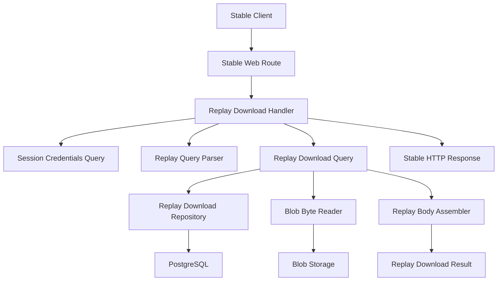
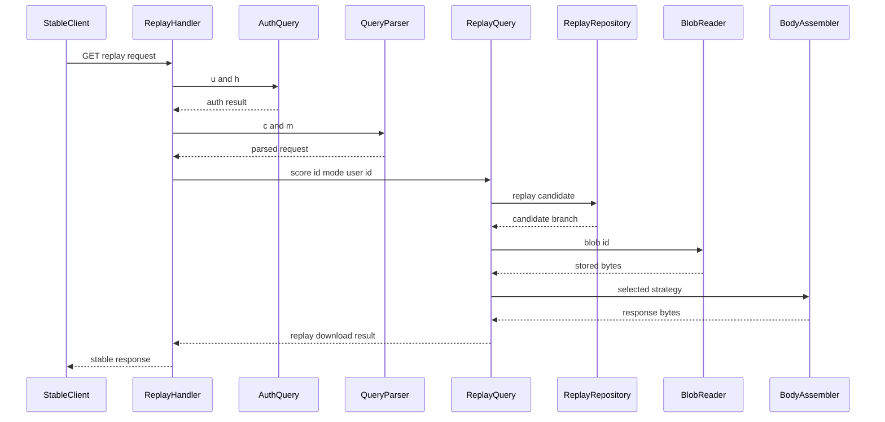
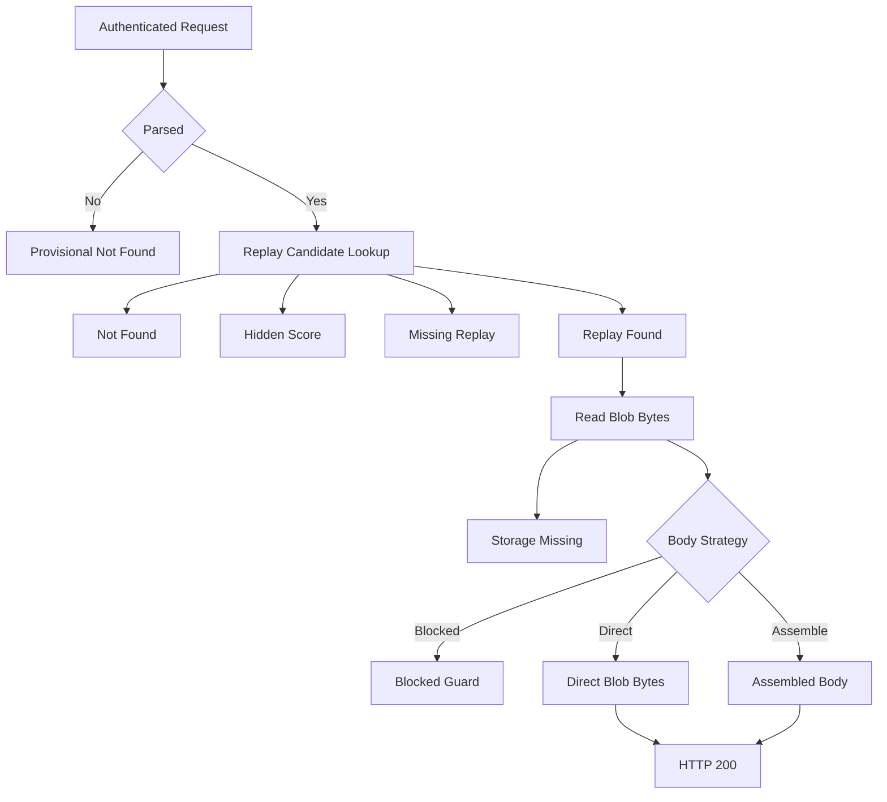

# Design Document

## Overview

`replay-download-response` は Issue #36 の runtime implementation design である。Stable client が `GET /web/osu-getreplay.php` から replay download response を取得できるようにし、保存済み Replay blob と client-visible download body の違いを明示的に扱う。

この spec は `replay-download-contract` の evidence を入力にして、primary route、auth mapping、score/replay/blob lookup、success body strategy gate、failure response mapping を実装可能な境界へ落とす。Success body は `target_body_validation_requires_local_raw_blob_artifact` が解消されるまで HTTP 200 を返さない。

### Goals

- `GET /web/osu-getreplay.php` を Stable web legacy endpoint として登録する。
- Confirmed query keys `c`, `h`, `m`, `u` を既存 legacy auth と replay download query boundary に接続する。
- Replay download success body strategy を `direct_blob_bytes`、`assemble_download_body`、または `blocked` として明示する。
- Auth failure、hidden score、storage-missing replay、missing replay provisional fallback を client-visible response に安全に写像する。
- Raw replay bytes、complete `.osr`、raw query values、credential values、local artifact paths を repository と client-visible response から排除する。

### Non-Goals

- `/web/replays/<id>` alias implementation。
- Replay view count、latest activity、self-view、duplicate-view cooldown。
- Score submission replay persistence repair。ただし body strategy 診断で保存破損が証明された場合は別 work item に切り出す。
- Anti-cheat、replay validation policy、spectator replay frame parsing。
- Missing/malformed `c` / `m` と unknown query field behavior の target-confirmed 化。

## Boundary Commitments

### This Spec Owns

- Primary route `GET /web/osu-getreplay.php` の Starlette route registration と DI handler wiring。
- Stable query parser for confirmed keys `c`, `h`, `m`, `u`。
- `u` / `h` から `SessionCredentialsQueryInput` への auth mapping。
- Replay download query use-case for score visibility, replay attachment, blob availability, body strategy, and response branch classification。
- Replay-download-specific query repository port and SQLAlchemy / in-memory adapters。
- Stable-only response branch and body strategy vocabulary。
- HTTP response mapping for success, auth failure, hidden score, storage-missing replay, missing replay provisional fallback, and malformed request fallback。
- Focused tests and verification hooks for all in-scope branches.

### Out of Boundary

- `/web/replays/<id>` route and alias response shape。
- Replay view count and latest activity mutation. These belong to Issue #37。
- Score submission upload path changes unless local validation proves stored replay bytes are corrupt。
- Raw capture, raw replay bytes, complete `.osr`, password values, password hashes, raw query values, or local artifact paths in committed files。
- Target-confirmed malformed request behavior. This spec only defines safe fallback behavior.

### Allowed Dependencies

- `replay-download-contract` fixtures and docs as evidence inputs.
- `SessionCredentialsQueryUseCase` for Stable legacy authentication.
- Query repository interfaces and SQLAlchemy / in-memory query adapters.
- A read-only blob byte reader protocol backed by existing blob storage read behavior.
- Python standard library `lzma` if `assemble_download_body` is selected and validation confirms that transformation.
- Starlette `Response` only inside stable web legacy transport.
- Structlog for sanitized branch diagnostics.

### Revalidation Triggers

- Target Stable Client traffic observes a different route, method, query key set, or auth field set.
- Body strategy changes between `blocked`, `direct_blob_bytes`, and `assemble_download_body`.
- Target or reference evidence proves a different missing replay response.
- Content-Type or Content-Disposition contract changes.
- Score/replay visibility policy changes or #37 proves replay view updates affect response status, headers, or body.
- Storage read ownership moves from current blob storage service to a separate query storage service.

## Architecture

### Existing Architecture Analysis

Stable web legacy endpoints currently register routes in `composition/application.py`, delegate through `composition/endpoints.py`, eagerly resolve handlers in `composition/lifespan.py`, and construct handler dependencies in `composition/providers/stable_web_legacy.py`. `GetscoresHandler` authenticates with `SessionCredentialsQueryUseCase`, parses Stable query fields locally, calls query services, and formats Starlette responses without exposing persistence internals.

Replay attachments already exist in `replay_file_attachments` through `ReplayModel`, but current query repositories only expose replay presence for getscores display. Replay download needs a dedicated read model because it must classify score visibility, missing replay, replay metadata presence, and storage-missing body reads without importing SQLAlchemy into transport.

### Architecture Pattern & Boundary Map

Selected pattern: query-side compatibility workflow behind a thin Stable web legacy adapter.



Architecture integration:

- Runtime adapter owns HTTP query adaptation and response formatting only.
- Query use-case owns read-only branch classification and body production.
- Repository owns SQLAlchemy joins and read model projection.
- Blob reader owns byte retrieval through storage abstractions.
- Stable compatibility domain owns branch and body strategy names.
- No new external dependency is introduced.

### Technology Stack

| Layer | Choice / Version | Role in Feature | Notes |
| --- | --- | --- | --- |
| Backend / Transport | Starlette | `GET /web/osu-getreplay.php` route and `Response` formatting | Existing stable web legacy stack |
| Backend / DI | Dishka | Handler, query, repository, and blob reader wiring | Existing provider pattern |
| Services | Python 3.14+ dataclasses and Protocols | Query input/result and read-only protocols | Domain code remains Pydantic-free |
| Data / Storage | SQLAlchemy 2.0 async, PostgreSQL, blob storage backend | Score/replay metadata read and byte retrieval | No schema migration expected |
| Verification | pytest, basedpyright, ruff, import-linter | Branch, parser, repository, type, and boundary validation | Existing project gates |

## File Structure Plan

### Directory Structure

```text
src/osu_server/
├── domain/compatibility/stable/
│   └── replay_download.py
├── services/queries/
│   ├── scores/
│   │   ├── replay_download.py
│   │   └── __init__.py
│   └── storage/
│       ├── blob_bytes.py
│       └── __init__.py
├── repositories/
│   ├── interfaces/queries/
│   │   ├── replay_download.py
│   │   └── __init__.py
│   ├── sqlalchemy/queries/
│   │   ├── replay_download.py
│   │   └── __init__.py
│   └── memory/queries/
│       ├── replay_download.py
│       └── __init__.py
├── transports/stable/web_legacy/
│   ├── replay_download.py
│   └── mappers/
│       ├── replay_download.py
│       └── __init__.py
└── composition/
    ├── application.py
    ├── endpoints.py
    ├── lifespan.py
    └── providers/
        ├── repository_adapters.py
        ├── repositories.py
        └── stable_web_legacy.py
```

### Modified Files

- `src/osu_server/domain/compatibility/stable/__init__.py` - export stable replay download branch/body vocabulary if local package exports are used.
- `src/osu_server/services/queries/scores/__init__.py` - export `ReplayDownloadQueryUseCase` and related dataclasses.
- `src/osu_server/services/queries/storage/__init__.py` - export `BlobByteReader`.
- `src/osu_server/repositories/interfaces/queries/__init__.py` - export `ReplayDownloadQueryRepository` and read model types.
- `src/osu_server/repositories/sqlalchemy/queries/__init__.py` - export SQLAlchemy replay download repository.
- `src/osu_server/repositories/memory/queries/__init__.py` - export in-memory replay download repository.
- `src/osu_server/composition/providers/repository_adapters.py` - add SQLAlchemy and in-memory adapter factory bindings.
- `src/osu_server/composition/providers/repositories.py` - provide `ReplayDownloadQueryRepository`.
- `src/osu_server/composition/providers/stable_web_legacy.py` - provide parser, query use-case, body assembler, blob reader binding, and handler.
- `src/osu_server/composition/endpoints.py` - add `replay_download_endpoint` delegate.
- `src/osu_server/composition/application.py` - register `GET /web/osu-getreplay.php` under `osu.$domain` web routes and local `/web` fallback when appropriate.
- `src/osu_server/composition/lifespan.py` - eagerly resolve and store `ReplayDownloadHandler`.
- `tests/unit/transports/web_legacy/test_replay_download_query_parser.py` - parser coverage for confirmed keys and malformed fallback labeling.
- `tests/unit/transports/web_legacy/test_replay_download_handler.py` - auth and response branch formatting.
- `tests/unit/services/queries/scores/test_replay_download.py` - use-case branch and body strategy tests.
- `tests/unit/repositories/test_replay_download_query_repository_contract.py` - repository contract tests over typed fake data.
- `tests/unit/repositories/sqlalchemy/test_replay_download_query_repository.py` - SQLAlchemy statement and mapping behavior.
- `tests/integration/transports/web_legacy/test_replay_download_endpoint.py` - route registration and end-to-end branch smoke tests with sanitized inputs.

## System Flows

### Request Flow



Auth failure stops before request parsing details are logged. Invalid `c` / `m` values use a safe fallback branch after auth and are not target-confirmed.

### Branch Flow



`StrategyBlocked` must not return HTTP 200 and must keep Issue #36 incomplete until local validation selects a non-blocked strategy.

## Requirements Traceability

| Requirement | Summary | Components | Interfaces | Flows |
| --- | --- | --- | --- | --- |
| 1.1 | primary route handled | Replay Download Handler, Application Routes | `GET /web/osu-getreplay.php` | Request Flow |
| 1.2 | confirmed keys parsed | Replay Download Query Parser | `c`, `h`, `m`, `u` query contract | Request Flow |
| 1.3 | alias out of scope | Boundary Commitments, Application Routes | no `/web/replays/<id>` registration | Branch Flow |
| 1.4 | malformed fallback labeled | Query Parser, Handler | provisional malformed fallback result | Branch Flow |
| 2.1 | body blocker resolved before success complete | Body Strategy Gate, Body Assembler | `ReplayDownloadBodyStrategy` | Branch Flow |
| 2.2 | direct blob when validated | Body Assembler, Blob Byte Reader | `direct_blob_bytes` strategy | Request Flow |
| 2.3 | assembled body when required | Body Assembler | `assemble_download_body` strategy | Request Flow |
| 2.4 | unsafe validation blocks success | Body Strategy Gate | `blocked` guard | Branch Flow |
| 2.5 | body distinct from stored blob | Stable Replay Download Compatibility | response body value object | Request Flow |
| 3.1 | visible replay returns 200 bytes | Replay Download Query, Handler | success result and HTTP 200 | Request Flow |
| 3.2 | success headers included | Handler response formatter | Content-Type and Content-Disposition | Request Flow |
| 3.3 | no diagnostic or secret exposure | Handler, Query, Body Assembler | sanitized logs and response | Request Flow |
| 3.4 | no dependency on #37 state | Query Use-case boundary | no mutation contract | Branch Flow |
| 4.1 | auth failure 401 empty | Handler and Auth Query | 401 empty body | Request Flow |
| 4.2 | hidden score 404 | Query and Handler | hidden score branch | Branch Flow |
| 4.3 | storage-missing 404 | Blob Reader, Query, Handler | storage missing branch | Branch Flow |
| 4.4 | missing replay provisional 404 | Query and Handler | `provisional_missing_replay` branch | Branch Flow |
| 4.5 | unavailable causes not leaked | Handler response formatter | shared 404 empty mapping | Branch Flow |
| 5.1 | repository-safe verification | Tests and fixtures | metadata-only policy | Branch Flow |
| 5.2 | local artifacts metadata-only | Body Strategy Gate | sanitized decision state | Branch Flow |
| 5.3 | invalid secret-like output rejected | Tests and review hooks | redaction assertions | Request Flow |
| 5.4 | no secrets in client response | Handler response formatter | response body/header restrictions | Request Flow |
| 6.1 | strategy and evidence state identified | Body Strategy Gate, research.md | strategy enum and evidence refs | Branch Flow |
| 6.2 | focused verification required | Test Plan | parser/auth/branch/body tests | Request Flow |
| 6.3 | unconfirmed branches labeled | Query Parser, Query Result | provisional/blocked/out-of-scope labels | Branch Flow |
| 6.4 | #37 outside readiness | Boundary Commitments | no view update dependency | Branch Flow |

## Components and Interfaces

| Component | Domain/Layer | Intent | Req Coverage | Key Dependencies | Contracts |
| --- | --- | --- | --- | --- | --- |
| Stable Replay Download Compatibility | Domain compatibility | Name branch, body strategy, and response body concepts | 2.1-2.5, 4.4, 6.1, 6.3 | None | State |
| Replay Download Query Parser | Stable transport mapper | Parse `c`, `m`, `u`, `h` without raw value logging | 1.2, 1.4, 5.4, 6.3 | Stable contract fixtures P1 | Service |
| Replay Download Handler | Stable transport | Authenticate, delegate query, format HTTP response | 1.1, 3.1-3.4, 4.1-4.5, 5.4 | Auth Query P0, Replay Query P0 | API |
| Replay Download Query Use-case | Query service | Resolve replay download branch and target body bytes | 2.1-2.5, 3.1, 3.3, 3.4, 4.2-4.5, 6.1-6.4 | Repository P0, Blob Reader P0 | Service |
| Replay Download Query Repository | Query repository | Project score, owner visibility, replay attachment, and blob ids | 3.1, 4.2-4.5 | SQLAlchemy or memory state P0 | Service |
| Blob Byte Reader | Query storage protocol | Read stored blob bytes by id without exposing backend details | 2.2, 2.3, 4.3 | Existing blob storage P0 | Service |
| Replay Download Body Assembler | Query service | Convert stored replay bytes into selected client-visible body | 2.1-2.5, 3.1-3.3, 6.1 | Blob Reader P0, strategy decision P0 | Service |
| Composition Wiring | Composition | Register route, providers, app.state delegates, startup validation | 1.1, 6.2 | Dishka P0, Starlette P0 | State |

### Domain Compatibility

#### Stable Replay Download Compatibility

| Field | Detail |
| --- | --- |
| Intent | Stable-only branch and body strategy vocabularyを transport-neutral に表現する |
| Requirements | 2.1, 2.2, 2.3, 2.4, 2.5, 4.4, 6.1, 6.3 |

**Responsibilities & Constraints**

- Branch names: `success`, `auth_failure`, `hidden_score`, `storage_missing`, `missing_replay_provisional`, `malformed_request_provisional`, `body_strategy_blocked`。
- Body strategies: `blocked`, `direct_blob_bytes`, `assemble_download_body`。
- `ReplayDownloadResponseBody` は stored Replay blob object と同一視しない。
- Domain compatibility module must not import Starlette, SQLAlchemy, Valkey, taskiq, storage backend, services, or transports.

**Contracts**: Service [ ] / API [ ] / Event [ ] / Batch [ ] / State [x]

##### State Management

- State model: dataclass/enums for branch, body strategy, and sanitized evidence labels.
- Persistence & consistency: no persistence.
- Concurrency strategy: immutable values only.

**Implementation Notes**

- Integration: Use from query service and stable web mapper only.
- Validation: Unit tests assert enum values match contract fixture labels.
- Risks: Do not add response header formatting here because that belongs to transport.

### Stable Transport

#### Replay Download Query Parser

| Field | Detail |
| --- | --- |
| Intent | Stable query keysを typed requestへ変換し、不明/不正値を provisional fallback として分類する |
| Requirements | 1.2, 1.4, 5.4, 6.3 |

**Responsibilities & Constraints**

- `c` is parsed as score id.
- `m` is parsed as stable ruleset id and must map to `Ruleset`.
- `u` and `h` are passed only to auth mapping, not to logs or result repr.
- Unknown query fields are ignored for confirmed request construction but may emit sanitized warning metadata.
- Missing/malformed `c` or `m` returns a parser result that is safe to map to provisional 404 empty fallback after auth.

**Dependencies**

- Inbound: Replay Download Handler - parser invocation (P0)
- Outbound: Stable Replay Download Compatibility - provisional branch labels (P1)
- External: none

**Contracts**: Service [x] / API [ ] / Event [ ] / Batch [ ] / State [ ]

##### Service Interface

```python
class ReplayDownloadQueryParser:
    def parse(self, query: Mapping[str, str]) -> ReplayDownloadParseResult: ...
```

- Preconditions: `query` is a Starlette-compatible immutable or plain mapping.
- Postconditions: raw query values are not retained in error objects or repr.
- Invariants: invalid request results are marked provisional, not target-confirmed.

**Implementation Notes**

- Integration: Place in `transports/stable/web_legacy/mappers/replay_download.py`.
- Validation: Parser tests cover valid keys, missing `c`, malformed `c`, missing `m`, malformed `m`, and unknown extra field.
- Risks: Do not log `u`, `h`, or raw query strings.

#### Replay Download Handler

| Field | Detail |
| --- | --- |
| Intent | HTTP requestを auth/parser/query boundary に接続し、Stable responseへ変換する |
| Requirements | 1.1, 1.2, 1.4, 3.1, 3.2, 3.3, 3.4, 4.1, 4.2, 4.3, 4.4, 4.5, 5.4 |

**Responsibilities & Constraints**

- Authenticate using `SessionCredentialsQueryInput(username=query.get("u"), password_md5=query.get("h"))`.
- Return HTTP 401 with empty body on auth failure.
- Delegate parsed request and authenticated user id to `ReplayDownloadQueryUseCase`.
- Format success as HTTP 200 with target-client-compatible bytes.
- Use `Content-Type: zip` for success unless body strategy validation records a more precise safe value.
- Include `Content-Disposition` with a deterministic non-secret filename. Exact filename value is not target-confirmed.
- Map hidden score, storage-missing replay, missing replay provisional, malformed request provisional, and body strategy blocked to empty 404 responses unless a later contract changes that mapping.
- Never expose score visibility cause, storage key, raw query values, credential values, diagnostic metadata, or local artifact paths in the response.

**Dependencies**

- Inbound: Starlette route delegate - handler call (P0)
- Outbound: SessionCredentialsQueryUseCase - auth (P0)
- Outbound: Replay Download Query Parser - parse (P0)
- Outbound: Replay Download Query Use-case - branch resolution (P0)
- External: Starlette Response - HTTP formatting (P0)

**Contracts**: Service [ ] / API [x] / Event [ ] / Batch [ ] / State [ ]

##### API Contract

| Method | Endpoint | Request | Response | Errors |
| --- | --- | --- | --- | --- |
| GET | `/web/osu-getreplay.php` | query keys `c`, `h`, `m`, `u` | 200 `zip` body with `content-disposition` when success strategy is non-blocked | 401 empty auth failure, 404 empty unavailable/provisional/blocked |

**Implementation Notes**

- Integration: Follow `GetscoresHandler` structure with `StableReplayDownloadExchange` plus `ReplayDownloadHandler` wrapper if useful.
- Validation: Handler tests assert branch statuses, empty bodies, header keys, and no raw credentials in logs or responses.
- Risks: A blocked body strategy must never return HTTP 200.

### Query Services

#### Replay Download Query Use-case

| Field | Detail |
| --- | --- |
| Intent | Replay download の read-only workflow と branch classification を所有する |
| Requirements | 2.1, 2.2, 2.3, 2.4, 2.5, 3.1, 3.3, 3.4, 4.2, 4.3, 4.4, 4.5, 6.1, 6.2, 6.3, 6.4 |

**Responsibilities & Constraints**

- Accept typed input: authenticated user id, score id, stable ruleset.
- Ask repository for score/replay candidate.
- Classify not found, hidden score, missing replay, replay attachment available, and metadata unavailable.
- Read blob bytes through `BlobByteReader` only after repository reports an available replay attachment.
- Invoke body assembler with selected body strategy.
- Convert storage read failures into `storage_missing`.
- Keep the workflow read-only and do not update replay views or latest activity.

**Dependencies**

- Inbound: Replay Download Handler - query execution (P0)
- Outbound: Replay Download Query Repository - candidate read (P0)
- Outbound: Blob Byte Reader - bytes read (P0)
- Outbound: Replay Download Body Assembler - response body build (P0)
- Outbound: Stable Replay Download Compatibility - branch and strategy values (P1)

**Contracts**: Service [x] / API [ ] / Event [ ] / Batch [ ] / State [ ]

##### Service Interface

```python
@dataclass(slots=True, frozen=True)
class ReplayDownloadQueryInput:
    authenticated_user_id: int
    score_id: int
    ruleset: Ruleset

class ReplayDownloadQuery:
    async def execute(
        self,
        input_data: ReplayDownloadQueryInput,
    ) -> ReplayDownloadQueryResult: ...
```

- Preconditions: auth already succeeded and request parse already succeeded.
- Postconditions: result contains a branch and either response bytes for success or no client-visible details for failures.
- Invariants: no mutation, no raw credential fields, no storage backend keys.

**Implementation Notes**

- Integration: Place in `services/queries/scores/replay_download.py`.
- Validation: Tests cover each repository branch, blob read unavailable, strategy blocked, direct bytes, and assemble path.
- Risks: Do not treat `missing_replay_provisional` as confirmed target behavior in result names, logs, or tests.

#### Replay Download Body Assembler

| Field | Detail |
| --- | --- |
| Intent | Stored replay bytesから client-visible Replay Download Response Body を作る |
| Requirements | 2.1, 2.2, 2.3, 2.4, 2.5, 3.1, 3.3, 6.1 |

**Responsibilities & Constraints**

- For `blocked`, return a blocked result and no bytes.
- For `direct_blob_bytes`, return stored bytes exactly as read only when local validation selected that strategy.
- For `assemble_download_body`, build the target-compatible LZMA replay payload using the local validation decision.
- Do not infer replay format from filename extension or manual `.osr` rename behavior.
- Do not emit raw replay bytes, hashes, or local parser output into logs or committed fixtures.

**Dependencies**

- Inbound: Replay Download Query Use-case - body build (P0)
- Outbound: Stable Replay Download Compatibility - body strategy (P0)
- External: Python standard library `lzma` when assembly is selected and validated (P1)

**Contracts**: Service [x] / API [ ] / Event [ ] / Batch [ ] / State [ ]

##### Service Interface

```python
class ReplayDownloadBodyAssembler:
    def build(
        self,
        input_data: ReplayDownloadBodyBuildInput,
    ) -> ReplayDownloadBodyBuildResult: ...
```

- Preconditions: stored bytes were read from the replay blob id linked to the target score.
- Postconditions: success result contains target-client-compatible response bytes.
- Invariants: blocked strategy cannot produce bytes.

**Implementation Notes**

- Integration: May live in the same query module initially if it remains cohesive.
- Validation: Tests use tiny synthetic bytes and sanitized strategy values, not real replay payloads.
- Risks: `assemble_download_body` must remain unimplemented or guarded until local evidence identifies the exact source shape.

#### Blob Byte Reader

| Field | Detail |
| --- | --- |
| Intent | Query workflowへ blob byte read だけを公開する |
| Requirements | 2.2, 2.3, 4.3 |

**Responsibilities & Constraints**

- Expose `read_bytes(blob_id)` only.
- Hide blob storage backend, storage key, and blob metadata internals.
- Convert missing metadata or backend content into a typed unavailable error consumed by replay download query.

**Dependencies**

- Inbound: Replay Download Query Use-case - read request (P0)
- Outbound: Existing blob storage read implementation - byte retrieval (P0)

**Contracts**: Service [x] / API [ ] / Event [ ] / Batch [ ] / State [ ]

##### Service Interface

```python
class BlobByteReader(Protocol):
    async def read_bytes(self, blob_id: int) -> bytes: ...
```

- Preconditions: `blob_id` came from query repository replay attachment.
- Postconditions: returns bytes or raises typed unavailable error.
- Invariants: does not expose storage key or local filesystem path.

**Implementation Notes**

- Integration: Define protocol under `services/queries/storage/blob_bytes.py`; bind existing blob storage service in composition.
- Validation: Query tests use typed stub implementation.
- Risks: Do not import command storage module from query code.

### Repository Layer

#### Replay Download Query Repository

| Field | Detail |
| --- | --- |
| Intent | Score/replay/blob identifiers and visibility inputsを read model として投影する |
| Requirements | 3.1, 4.2, 4.3, 4.4, 4.5, 6.2 |

**Responsibilities & Constraints**

- Read score by id and stable ruleset.
- Determine replay-download visibility using current score eligibility and owner visibility policy.
- Return replay attachment blob id, attachment checksum, and attachment byte size when available.
- Distinguish missing score, hidden score, missing replay, and replay available.
- Avoid storage backend reads; object existence is handled by blob reader.

**Dependencies**

- Inbound: Replay Download Query Use-case - candidate lookup (P0)
- Outbound: SQLAlchemy models or in-memory state - read projection (P0)
- Outbound: Stable visibility policy - hidden classification (P1)

**Contracts**: Service [x] / API [ ] / Event [ ] / Batch [ ] / State [ ]

##### Service Interface

```python
class ReplayDownloadQueryRepository(Protocol):
    async def get_candidate(
        self,
        query: ReplayDownloadCandidateQuery,
    ) -> ReplayDownloadCandidate: ...
```

- Preconditions: score id and ruleset are parsed.
- Postconditions: result is one of missing, hidden, missing replay, or available.
- Invariants: repository returns metadata only and never raw replay bytes.

**Implementation Notes**

- Integration: SQLAlchemy implementation should use short query sessions like existing query repositories.
- Validation: Contract test covers SQLAlchemy and in-memory implementations where practical.
- Risks: Visibility policy may need revalidation if Stable replay download allows owner-only downloads for hidden scores.

### Composition

#### Composition Wiring

| Field | Detail |
| --- | --- |
| Intent | Replay download runtime dependenciesを app startup 前に解決できるようにする |
| Requirements | 1.1, 6.2 |

**Responsibilities & Constraints**

- Register `Route("/web/osu-getreplay.php", endpoint=replay_download_endpoint, methods=["GET"])` in `osu.$domain` web routes.
- Add local development fallback route under `/web` only if consistent with existing exact path behavior.
- Store `ReplayDownloadHandler` on `app.state`.
- Eagerly resolve `ReplayDownloadHandler` during lifespan validation.
- Provide SQLAlchemy and in-memory repository bindings.

**Dependencies**

- Inbound: Starlette app factory - route registration (P0)
- Outbound: Dishka provider graph - handler resolution (P0)

**Contracts**: Service [ ] / API [ ] / Event [ ] / Batch [ ] / State [x]

##### State Management

- State model: `app.state.replay_download_handler`.
- Persistence & consistency: no durable state.
- Concurrency strategy: APP-scope handler dependencies as existing stable web handlers.

**Implementation Notes**

- Integration: Mirror existing getscores route/delegate/provider/lifespan pattern.
- Validation: Composition tests assert app startup resolves the new handler.
- Risks: Missing eager resolution could hide provider errors until first client request.

## Data Models

### Domain Model

- `ReplayDownloadBodyStrategy`: stable compatibility enum for `blocked`, `direct_blob_bytes`, `assemble_download_body`.
- `ReplayDownloadBranch`: stable compatibility enum for success and failure/provisional branches.
- `ReplayDownloadQueryInput`: query-layer dataclass with authenticated user id, score id, and ruleset.
- `ReplayDownloadQueryResult`: query-layer dataclass with branch, optional bytes, optional content metadata, and sanitized evidence label.
- `ReplayDownloadCandidate`: repository read model with candidate kind and optional replay attachment metadata.

### Logical Data Model

Existing durable entities are reused:

- `scores`: source score identity, owner, ruleset, pass/eligibility fields.
- `replay_file_attachments`: source replay attachment for score id and blob id.
- `blobs`: metadata for storage object read by blob storage.
- `roles` / `user_roles`: visibility inputs when repository needs owner leaderboard visibility.

No new table or migration is expected for Issue #36.

### Physical Data Model

No schema changes are planned. SQLAlchemy query repository may rely on existing indexes:

- `idx_replay_file_attachments_score_id`
- `idx_replay_file_attachments_blob_id`
- `scores.id` primary key

## Error Handling

- Auth failure: 401 with empty body.
- Hidden score: 404 with empty body, no visibility details.
- Storage metadata or backend object unavailable: 404 with empty body.
- Missing replay: 404 empty provisional fallback, logged with provisional label.
- Missing/malformed `c` or `m`: 404 empty provisional fallback after successful auth.
- Body strategy blocked: 404 empty guard response, logged as implementation blocker, and not considered Issue #36 complete.
- Unexpected exceptions: existing request logging and app error handling apply; do not add branch-specific raw details.

## Security and Privacy

- Never commit raw replay bytes, complete `.osr`, raw traffic captures, password values, password hashes, raw query values, credential values, or safe replay hashes that fingerprint a user replay.
- Never include `u`, `h`, raw query values, blob storage keys, local paths, raw diagnostic metadata, or visibility causes in HTTP responses.
- Logs may include sanitized branch name, score id, authenticated user id, and strategy label. Logs must not include credential values or raw replay payloads.
- Tests must include at least one assertion that response/log-facing objects do not retain raw credential fields.

## Performance

- Replay body read is a single blob read after lightweight score/replay lookup.
- `read_bytes` is acceptable for replay files at current Stable replay sizes, but the design keeps `BlobByteReader` narrow so a streaming response can replace it if size or memory pressure requires it.
- Repository lookup should use a bounded query by primary score id and indexed replay attachment score id.

## Testing Strategy

- Parser unit tests:
  - valid `c`, `h`, `m`, `u` parse succeeds.
  - missing/malformed `c` and `m` return provisional fallback errors.
  - unknown extra fields do not become target-confirmed behavior.
- Handler unit tests:
  - auth failure returns 401 empty body.
  - hidden score returns 404 empty body.
  - storage-missing returns 404 empty body.
  - missing replay returns 404 empty body with provisional label.
  - success returns 200, `Content-Type: zip`, `Content-Disposition`, and body bytes only when strategy is non-blocked.
  - blocked strategy cannot return 200.
- Query use-case unit tests:
  - missing score, hidden score, missing replay, storage unavailable, direct bytes, assemble body, and blocked strategy branches.
  - no mutation calls for replay views or latest activity.
- Repository tests:
  - SQLAlchemy query maps replay attachment to blob id.
  - hidden score classification uses stable visibility policy.
  - repository does not read raw blob bytes.
- Integration tests:
  - `GET /web/osu-getreplay.php` is routed under stable web app.
  - sanitized auth failure and one unavailable replay branch work through app wiring.
- Quality checks:
  - relevant pytest files.
  - `ruff`, `basedpyright`, and import-linter through project quality gate when implementation touches provider/repository boundaries.
