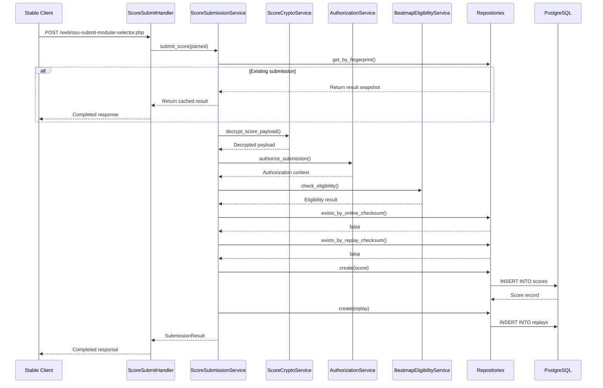

# 技術設計書: Score Ingestion (Wave 1)

**Feature**: score-ingestion
**Wave**: 1 of 4
**Status**: Design Draft
**Last Updated**: 2026-06-11

## 概要

Wave 1では、osu! stable clientからのscore submit requestを受け付け、validation、保存、replay保存までを実装します。PP計算、leaderboard更新、user stats更新は後続waveに委譲します。

**目標**: Stable clientが `/web/osu-submit-modular-selector.php` 経由でscoreを送信し、completed responseを受け取れる状態にする。

**ユーザー**: osu! stable clientを使用するプレイヤー。Play終了後、clientが自動的にscoreをsubmitし、結果を受け取る。

**影響**: 既存システムへの影響なし（新規feature）。Beatmap mirror、blob storage、active session store、legacy auth serviceへの依存を追加。

### 目標

- Multipart form dataを正しくparseし、duplicate `score` fieldを区別できる
- Rijndael-256でencryptされたpayloadをdecryptできる（PyO3 + Rust `simple-rijndael`）
- Password + active session + payload identityでauthorizationできる
- Hit counts整合性とruleset-specific validationができる
- Online checksum、replay checksum、submission fingerprintで重複を検出できる
- Passed/failedの両方のscoreを保存できる
- Replay blobをstorage backendに保存できる
- Idempotent retry handlingができる
- Completed/terminal reject/retryable responseを返せる

### 非目標

- PP calculation（Wave 2）
- Beatmap leaderboard projection（Wave 3）
- User stats projection（Wave 3）
- User ranking projection（Wave 4）
- Relax/Autopilot playstyle（将来feature）
- Anti-cheat detection（replay checksum uniquenessのみ実装）

## 境界定義

### Wave 1が所有するもの

- `/web/osu-submit-modular-selector.php` endpoint（transport層）
- Score submission受付、parsing、decryption、validation
- Score record persistence（passed/failed両方）
- Replay blob persistence
- Submission fingerprint管理とidempotent retry handling
- Uniqueness enforcement（online checksum、replay checksum、submission fingerprint）
- Authorization（password + active session + payload identity match）
- Completed response生成（PP値なし、chart placeholder）

### 依存する外部コンポーネント

| Dependency | Purpose | Interface | Criticality |
|------------|---------|-----------|-------------|
| beatmap-mirror | Beatmap metadata、eligibility判定 | `get_beatmap(beatmap_id)` | P0 |
| blob-storage | Replay binary保存 | `store(key, data)` | P0 |
| Active session store (Valkey) | Session存在確認 | `GET bancho:session:{user_id}` | P0 |
| Legacy auth service | Password検証 | `verify_password(user_id, password_md5)` | P0 |
| PostgreSQL + SQLAlchemy | Score永続化 | Repository interfaces | P0 |

### 後続Waveに委譲するもの

- **Wave 2**: PP計算、star rating計算、performance provenance
- **Wave 3**: Beatmap leaderboard projection、user stats集計
- **Wave 4**: Global/country rank時系列履歴

### 再検証トリガー

以下の変更が発生した場合、このspecを再検証する:

- Beatmap mirror APIの変更（metadata取得方法、eligibility判定ロジック）
- Blob storage interfaceの変更（保存方法、key生成ルール）
- Session store schemaの変更（active session判定条件）
- Stableプロトコル仕様の変更（multipart format、encryption algorithm、payload format）

## アーキテクチャ

### アーキテクチャパターン

Athenaの既存レイヤー構造に従い、以下のパターンを採用:

```
Transport → Services → Domain → Repositories → Infrastructure
```

**統合方針**:
- 既存のRepository patternを継承（Protocol + SQLAlchemy + memory実装）
- 既存のDI containerを使用
- 既存のapp/worker分離を尊重（Wave 1ではappのみ使用）

**新規コンポーネント理由**:
- **ScoreSubmissionService**: Score submission use-caseのorchestration
- **ScoreCryptoService**: Rijndael-256 decryption（既存crypto層に追加）
- **MultipartParser**: osu!特有のmultipart format handling

### テクノロジースタック

| Layer | Choice / Version | Role in Feature |
|-------|------------------|-----------------|
| Backend | Python 3.14+ / Starlette | Transport層（`/web/osu-submit-modular-selector.php`） |
| Crypto | Rust `simple-rijndael` 0.3+ / PyO3 / maturin | Rijndael-256 decryption |
| Data | PostgreSQL + SQLAlchemy 2.0 async + Alembic | Score/Submission/Replay永続化 |
| Cache | Valkey (valkey-glide) | Active session確認 |

**新規依存**:
- `simple-rijndael` (Rust): Rijndael-CBC implementation（osu!専用、Pure-Peace作）
- `maturin`: PyO3 build tool

## ファイル構造計画

### 新規作成ファイル

```
src/osu_server/
├── transports/web_legacy/routes/
│   └── score_submit.py                    # POST endpoint handler
├── services/
│   └── score_submission_service.py        # Use-case orchestration
├── domain/score/
│   ├── score.py                           # Score dataclass
│   ├── submission.py                      # ScoreSubmission dataclass
│   ├── replay.py                          # Replay dataclass
│   ├── payload_parser.py                  # Colon-separated parser
│   └── validator.py                       # Hit counts validation
├── repositories/
│   ├── interfaces/
│   │   ├── score_repository.py            # Protocol
│   │   ├── submission_repository.py       # Protocol
│   │   └── replay_repository.py           # Protocol
│   ├── sqlalchemy/
│   │   ├── score_repository.py            # SQLAlchemy実装
│   │   ├── submission_repository.py
│   │   └── replay_repository.py
│   └── memory/
│       ├── score_repository.py            # Test用in-memory実装
│       ├── submission_repository.py
│       └── replay_repository.py
├── infrastructure/
│   ├── crypto/
│   │   └── score_crypto.py                # ScoreCryptoService
│   ├── parsers/
│   │   └── multipart_parser.py            # MultipartParser
│   ├── auth/
│   │   └── score_authorization.py         # ScoreAuthorizationService
│   └── beatmap/
│       └── eligibility_service.py         # BeatmapEligibilityService

athena-crypto/                             # Rust workspace（新規作成）
├── Cargo.toml
├── pyproject.toml                         # maturin config
└── src/
    └── lib.rs                             # PyO3 bindings

alembic/versions/
└── xxxx_add_score_submission_tables.py    # Migration
```

## システムフロー

### Score Submission Flow



## 要件トレーサビリティ

| Requirement | Component | Interface |
|-------------|-----------|-----------|
| 1.1-1.4 | ScoreSubmitHandler | POST endpoint |
| 2.1-2.5 | MultipartParser | `parse()` |
| 3.1-3.5 | ScoreCryptoService | `decrypt_score_payload()` |
| 4.1-4.5 | ScoreAuthorizationService | `authorize_submission()` |
| 5.1-5.5 | ScoreValidator, ScorePayloadParser | `validate_hit_counts()`, `parse()` |
| 6.1-6.4 | ScoreSubmissionService + Repositories | Uniqueness checks |
| 7.1-7.5 | ScoreSubmissionService + Repositories | Persistence |
| 8.1-8.5 | BeatmapEligibilityService | `check_eligibility()` |
| 9.1-9.4 | ScoreSubmissionService + Repository | Fingerprint handling |
| 10.1-10.5 | ScoreSubmitHandler | Response generation |
| 11.1-11.5 | ScoreSubmissionService | Security logging |
| 12.1-12.4 | ScoreSubmissionService + Repositories | Failed play handling |

## コンポーネント & インターフェース

### Transport Layer

#### ScoreSubmitHandler

| Field | Detail |
|-------|--------|
| Intent | `/web/osu-submit-modular-selector.php` POST requestを処理 |
| Requirements | 1.1, 2.1-2.5, 10.1-10.5 |

**責務**:
- Multipart request受信
- MultipartParserに委譲
- ScoreSubmissionServiceを呼び出し
- Response生成

**依存**:
- Outbound: MultipartParser (P0)
- Outbound: ScoreSubmissionService (P0)

**Contracts**: API [✓]

##### API Contract

```python
async def handle_score_submit(request: Request) -> Response:
    """
    POST /web/osu-submit-modular-selector.php

    Headers:
        Content-Type: multipart/form-data

    Response:
        - Completed: "beatmapId:beatmapSetId:beatmapPlaycount:3\nchart..."
        - Terminal reject: "error: no"
    """
```

### Infrastructure Layer

#### MultipartParser

| Field | Detail |
|-------|--------|
| Intent | osu! multipart request parsing（duplicate field handling） |
| Requirements | 2.1-2.5 |

**責務**:
- Multipart form dataをparse
- Duplicate `score` fieldを区別（1st=payload、2nd=replay）
- Size limit validation

**Contracts**: Service [✓]

##### Service Interface

```python
@dataclass(frozen=True, slots=True)
class ParsedSubmission:
    encrypted_payload: bytes
    iv: bytes
    replay_data: bytes | None
    password_md5: str
    client_hash: str
    fail_time_ms: int | None
    osu_version: str
    submission_metadata: dict[str, str]

def parse(body: bytes, content_type: str) -> ParsedSubmission:
    """
    Preconditions: body size <= configured limit
    Postconditions: Returns ParsedSubmission with all required fields
    Errors: ParseError if format invalid or size exceeded
    """
```

#### ScoreCryptoService

| Field | Detail |
|-------|--------|
| Intent | Rijndael-256 decryption（PyO3 + Rust `simple-rijndael`） |
| Requirements | 3.1-3.5 |

**責務**:
- Key selection（osuverベース）
- Rijndael-256 decryption
- Checksum validation

**依存**:
- External: `athena_crypto` Rust module (P0)

**Contracts**: Service [✓]

##### Service Interface

```python
@dataclass(frozen=True, slots=True)
class DecryptedPayload:
    plaintext: str
    checksum_valid: bool

def decrypt_score_payload(
    encrypted: bytes,
    iv: bytes,
    osu_version: str | None
) -> DecryptedPayload:
    """
    Preconditions: encrypted and iv are valid byte arrays
    Postconditions: Returns decrypted plaintext with checksum status
    Errors: DecryptionError if decryption fails
    """
```

**実装ノート**:
- ADR 0001参照: `simple-rijndael` crate使用
- Key format: `"osu!-scoreburgr---------{osuver}"` or legacy key

#### ScoreAuthorizationService

| Field | Detail |
|-------|--------|
| Intent | Password + session + payload identity authorization |
| Requirements | 4.1-4.5 |

**責務**:
- Password検証（legacy auth service）
- Active session確認（Valkey）
- Payload identity match確認

**依存**:
- External: Legacy auth service (P0)
- External: Valkey session store (P0)

**Contracts**: Service [✓]

##### Service Interface

```python
@dataclass(frozen=True, slots=True)
class AuthorizationContext:
    user_id: int
    username: str
    session_valid: bool
    password_valid: bool
    payload_identity_match: bool

async def authorize_submission(
    password_md5: str,
    payload_username: str,
    payload_user_id: int
) -> AuthorizationContext:
    """
    Preconditions: password_md5 is valid MD5 hash
    Postconditions: Returns authorization result with all checks
    Invariants: No raw credentials logged
    """
```

#### BeatmapEligibilityService

| Field | Detail |
|-------|--------|
| Intent | Beatmap eligibility判定（Ranked/Approved/Loved/Qualified） |
| Requirements | 8.1-8.5 |

**責務**:
- Beatmap metadata取得
- Status check

**依存**:
- External: Beatmap mirror service (P0)

**Contracts**: Service [✓]

##### Service Interface

```python
async def check_eligibility(beatmap_id: int) -> EligibilityResult:
    """
    Preconditions: beatmap_id > 0
    Postconditions: Returns eligibility status
    Errors: BeatmapNotFoundError if beatmap not in mirror
    """
```

### Domain Layer

#### ScorePayloadParser

| Field | Detail |
|-------|--------|
| Intent | Colon-separated payload parsing |
| Requirements | 5.1-5.5 |

**責務**:
- Colon-separated dataをparse
- Field型変換

**Contracts**: Service [✓]

##### Service Interface

```python
@dataclass(frozen=True, slots=True)
class ParsedScore:
    user_id: int
    username: str
    beatmap_checksum: str
    online_checksum: str
    ruleset: Ruleset
    mods: int
    n300: int
    n100: int
    n50: int
    geki: int
    katu: int
    miss: int
    score: int
    max_combo: int
    perfect: bool
    passed: bool

def parse(plaintext: str) -> ParsedScore:
    """
    Preconditions: plaintext is valid colon-separated data
    Postconditions: Returns ParsedScore with all fields
    Errors: ParseError if format invalid
    """
```

#### ScoreValidator

| Field | Detail |
|-------|--------|
| Intent | Hit counts整合性とruleset-specific validation |
| Requirements | 5.1-5.5 |

**責務**:
- Ruleset-specific hit counts validation
- Accuracy計算
- Grade計算

**Contracts**: Service [✓]

##### Service Interface

```python
def validate_hit_counts(score: ParsedScore) -> ValidationResult:
    """
    Preconditions: score has valid hit counts
    Postconditions: Returns validation result with accuracy/grade
    Invariants: Server-calculated values authoritative
    """
```

### Service Layer

#### ScoreSubmissionService

| Field | Detail |
|-------|--------|
| Intent | Score submission use-case orchestration |
| Requirements | All (1-12) |

**責務**:
- Submission fingerprint生成
- Idempotent retry handling
- Orchestrate: decrypt → parse → authorize → validate → persist
- Response生成

**依存**:
- Outbound: ScoreCryptoService (P0)
- Outbound: ScoreAuthorizationService (P0)
- Outbound: BeatmapEligibilityService (P0)
- Outbound: ScoreValidator (P0)
- Outbound: ScorePayloadParser (P0)
- Outbound: Repositories (P0)

**Contracts**: Service [✓]

##### Service Interface

```python
async def submit_score(parsed: ParsedSubmission) -> SubmissionResult:
    """
    Preconditions: parsed is valid ParsedSubmission
    Postconditions: Score persisted or terminal reject reason returned
    Invariants: Idempotent for same submission fingerprint

    Flow:
    1. Generate submission fingerprint
    2. Check existing submission
    3. Decrypt payload
    4. Parse payload
    5. Authorize
    6. Check beatmap eligibility
    7. Validate hit counts
    8. Check uniqueness (online checksum, replay checksum)
    9. Persist score + replay
    10. Return result
    """
```

### Repository Layer

#### ScoreRepository

| Field | Detail |
|-------|--------|
| Intent | Score persistence abstraction |
| Requirements | 6.1, 7.1-7.5 |

**Contracts**: Service [✓]

##### Service Interface

```python
class ScoreRepository(Protocol):
    async def create(score: Score) -> Score: ...
    async def exists_by_online_checksum(checksum: str) -> bool: ...
    async def get_by_id(score_id: int) -> Score | None: ...
```

#### ScoreSubmissionRepository

| Field | Detail |
|-------|--------|
| Intent | Submission state persistence（idempotency） |
| Requirements | 6.3, 9.1-9.4 |

**Contracts**: Service [✓]

##### Service Interface

```python
class ScoreSubmissionRepository(Protocol):
    async def create(submission: ScoreSubmission) -> ScoreSubmission: ...
    async def get_by_fingerprint(fingerprint: str) -> ScoreSubmission | None: ...
    async def update_state(submission_id: int, state: str) -> None: ...
```

#### ReplayRepository

| Field | Detail |
|-------|--------|
| Intent | Replay persistence abstraction |
| Requirements | 6.2, 7.3-7.4 |

**Contracts**: Service [✓]

##### Service Interface

```python
class ReplayRepository(Protocol):
    async def create(replay: Replay) -> Replay: ...
    async def exists_by_checksum(checksum: str) -> bool: ...
```

## データモデル

### Domain Model

#### Score

```python
@dataclass(slots=True)
class Score:
    id: int | None
    user_id: int
    beatmap_id: int
    beatmap_checksum: str
    online_checksum: str  # Global unique
    ruleset: Ruleset
    playstyle: Playstyle  # Wave 1: vanilla only
    mods: int
    n300: int
    n100: int
    n50: int
    geki: int
    katu: int
    miss: int
    score: int
    max_combo: int
    accuracy: float
    grade: Grade
    passed: bool
    perfect: bool
    client_version: str
    submitted_at: datetime
```

#### ScoreSubmission

```python
@dataclass(slots=True)
class ScoreSubmission:
    id: int | None
    fingerprint: str  # Global unique
    user_id: int
    beatmap_checksum: str
    submitted_at: datetime
    state: str  # "received" | "processing" | "completed" | "terminal_rejected"
    result_snapshot: dict[str, Any] | None
```

#### Replay

```python
@dataclass(slots=True)
class Replay:
    id: int | None
    score_id: int
    blob_key: str
    checksum_sha256: str  # Global unique
    byte_size: int
```

### Physical Data Model

#### scores table

```sql
CREATE TABLE scores (
    id BIGSERIAL PRIMARY KEY,
    user_id INTEGER NOT NULL,
    beatmap_id INTEGER NOT NULL,
    beatmap_checksum VARCHAR(32) NOT NULL,
    online_checksum VARCHAR(32) NOT NULL UNIQUE,
    ruleset SMALLINT NOT NULL,
    playstyle SMALLINT NOT NULL,
    mods INTEGER NOT NULL,
    n300 INTEGER NOT NULL,
    n100 INTEGER NOT NULL,
    n50 INTEGER NOT NULL,
    geki INTEGER NOT NULL,
    katu INTEGER NOT NULL,
    miss INTEGER NOT NULL,
    score INTEGER NOT NULL,
    max_combo INTEGER NOT NULL,
    accuracy REAL NOT NULL,
    grade VARCHAR(2) NOT NULL,
    passed BOOLEAN NOT NULL,
    perfect BOOLEAN NOT NULL,
    client_version VARCHAR(32) NOT NULL,
    submitted_at TIMESTAMP WITH TIME ZONE NOT NULL,

    INDEX idx_scores_user_beatmap (user_id, beatmap_id),
    INDEX idx_scores_beatmap_ruleset (beatmap_id, ruleset, playstyle)
);
```

#### score_submissions table

```sql
CREATE TABLE score_submissions (
    id BIGSERIAL PRIMARY KEY,
    fingerprint VARCHAR(64) NOT NULL UNIQUE,
    user_id INTEGER NOT NULL,
    beatmap_checksum VARCHAR(32) NOT NULL,
    submitted_at TIMESTAMP WITH TIME ZONE NOT NULL,
    state VARCHAR(32) NOT NULL,
    result_snapshot JSONB,

    INDEX idx_submissions_user (user_id),
    INDEX idx_submissions_submitted_at (submitted_at)
);
```

#### replays table

```sql
CREATE TABLE replays (
    id BIGSERIAL PRIMARY KEY,
    score_id BIGINT NOT NULL REFERENCES scores(id),
    blob_key VARCHAR(255) NOT NULL,
    checksum_sha256 VARCHAR(64) NOT NULL UNIQUE,
    byte_size INTEGER NOT NULL,
    created_at TIMESTAMP WITH TIME ZONE NOT NULL,

    INDEX idx_replays_score (score_id)
);
```

## テスト戦略

### TDD Approach

Wave 1では厳格なTDDを採用。In-memory repositoriesでDB依存を排除。

### Unit Tests

#### Infrastructure
- `test_multipart_parser.py`: Duplicate field handling (2.1-2.5)
- `test_score_crypto_service.py`: Decryption + key selection (3.1-3.5)
- `test_score_authorization_service.py`: Authorization checks (4.1-4.5)
- `test_beatmap_eligibility_service.py`: Eligibility判定 (8.1-8.5)

#### Domain
- `test_score_payload_parser.py`: Colon-separated parsing
- `test_score_validator.py`: Hit counts validation (5.1-5.5)

#### Service
- `test_score_submission_service.py`: Use-case orchestration（全requirement）

### Integration Tests

Real SQLAlchemy + PostgreSQL testcontainers使用:
- `test_score_submission_integration.py`: E2E flow
- Database unique constraint violations
- Concurrent submission handling

### E2E Tests

- `test_score_submit_endpoint.py`: POST endpoint with real multipart data

## セキュリティ考慮事項

### 機密情報の取り扱い

- **Password-md5**: Logに出力しない。SHA-256 hashのみ記録
- **Encrypted payload**: Logに出力しない
- **Opaque fields**: SHA-256 hashのみ記録

### Failure Category Logging

Terminal reject時のcategory:
- `transport_validation_failure`
- `crypto_validation_failure`
- `authorization_failure`
- `uniqueness_violation`
- `beatmap_ineligibility`
- `score_validation_failure`

## パフォーマンス考慮事項

Wave 1では最適化せず、測定可能にする:
- Endpoint latency metrics (P50, P95, P99)
- Database query latency
- Decrypt operation latency

## 実装順序

### Phase 1: Foundation (TDD)
1. Domain layer (dataclass, validator, parser)
2. Repository interfaces + in-memory implementations

### Phase 2: Infrastructure (TDD)
1. PyO3 crypto module (Rust)
2. Infrastructure services + unit tests

### Phase 3: Service (TDD)
1. ScoreSubmissionService + unit tests

### Phase 4: Persistence
1. SQLAlchemy models + Alembic migration
2. SQLAlchemy repository implementations

### Phase 5: Transport
1. ScoreSubmitHandler
2. E2E tests
