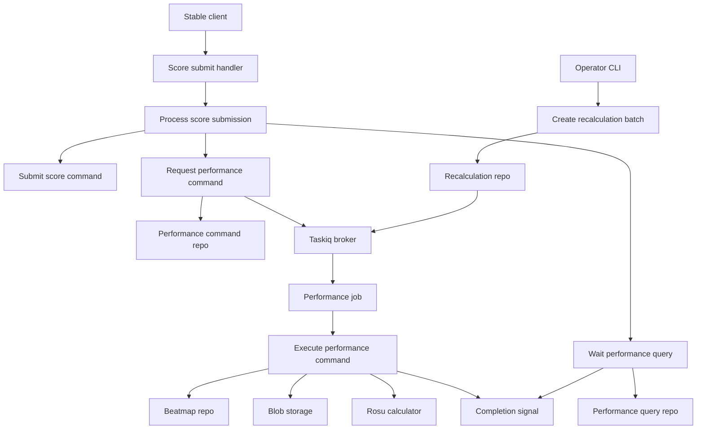
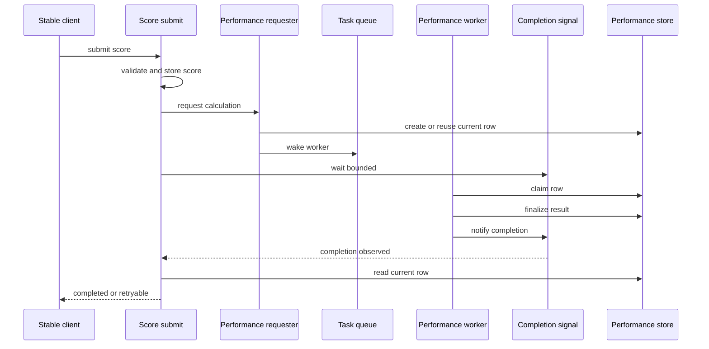
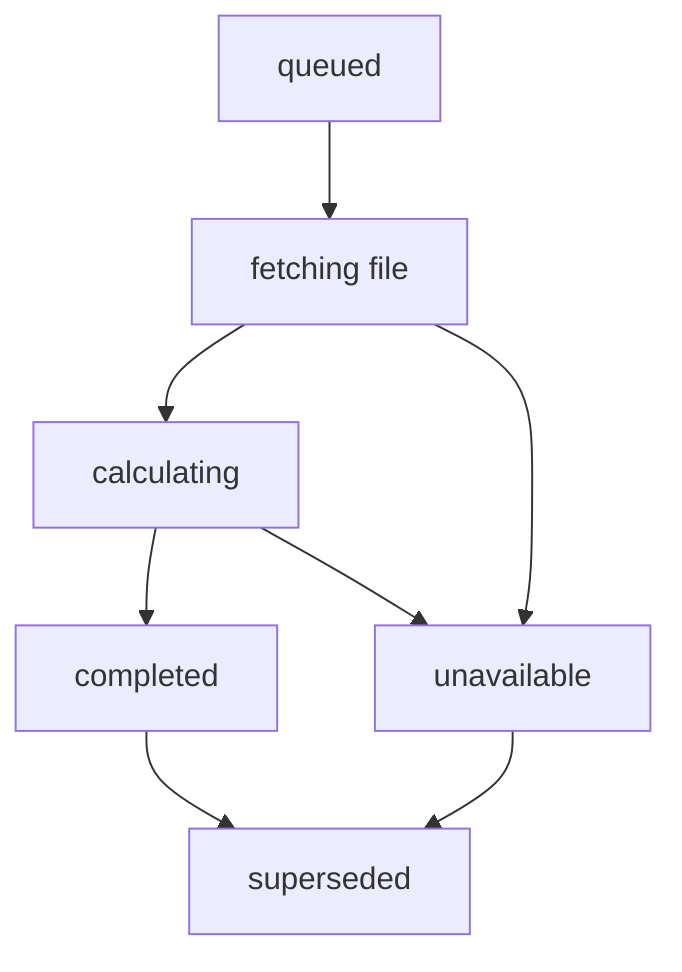
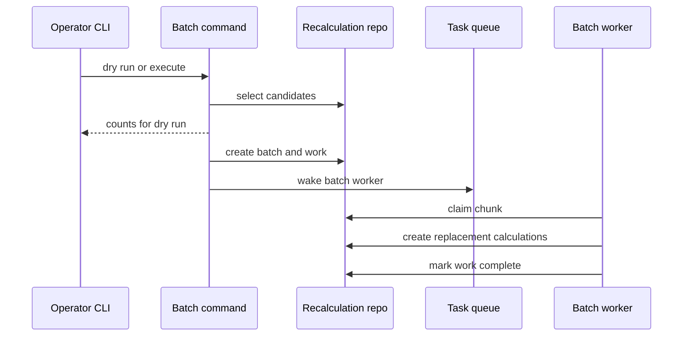
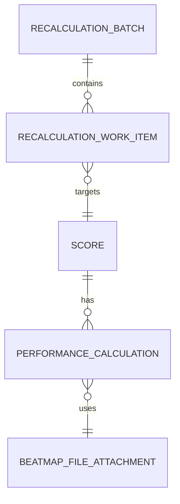

# Design Document

## Overview

score-pp-calculation は、score-ingestion が保存した Score に ranked PP と star rating を付与し、stable submit response と将来の leaderboard / stats が参照する canonical performance value を提供する。Score は gameplay result の source of truth のまま維持し、PP は Performance Calculation が所有する。

対象ユーザーは stable client player と operator である。Player は submit 直後または retry 時に bounded wait の範囲で PP を受け取り、operator は CLI から未計算、stale、calculator/profile mismatch の再計算 work を durable に作成する。

### Goals

- Ranked / Approved の passed score に ranked PP と star rating を計算する。
- stable submit response が completed / retryable / unavailable を既存互換の response 形状で返す。
- Performance Calculation の current / historical / provenance を永続化する。
- calculator version と Formula Profile の変更に対する durable PP Recalculation を提供する。

### Non-Goals

- Loved / Qualified / failed score の PP 計算。
- beatmap leaderboard projection、user stats、user rank projection の更新。
- replay parsing による PP 計算または anti-cheat verification。
- WebUI / admin API による再計算操作。
- Relax / Autopilot score の実計算。

## Boundary Commitments

### This Spec Owns

- `score_performance_calculations` を canonical PP / star rating / provenance store として定義する。
- Score から Performance Calculation を要求し、worker が `.osu` file と server-validated Score から PP を計算する flow。
- stable submit response の PP 合成、bounded wait、retryable timeout、unavailable 時の `pp:0` 出力。
- Performance Completion Signal の contract。signal は待機最適化であり、PP の source of truth ではない。
- PP Recalculation candidate selection、durable batch、work item、worker chunk processing。
- Formula Profile を playstyle scope で扱う policy と provenance mismatch 検出。

### Out of Boundary

- Score gameplay validation、authorization、online checksum / replay checksum duplicate rejection。
- Beatmap metadata / `.osu` file fetch の正規取得処理。既存 beatmap-mirror に依存する。
- Blob content storage の実装。既存 blob-storage に依存する。
- Leaderboard、personal best、user stats、user rank projection。
- Loved PP、Relax PP、Autopilot PP、replay-derived PP。
- 管理 WebUI、first-party admin API、operator authentication model。

### Allowed Dependencies

- Domain: `domain/scores`, `domain/beatmaps`, `domain/storage` の value object と enum。
- Command side: `UnitOfWorkFactory` と command repository interfaces。
- Query side: score / beatmap / blob / performance query repository interfaces。
- Infrastructure: taskiq broker for wake-up, Valkey client for completion signal, blob storage service for `.osu` bytes, `rosu-pp-py` through an infrastructure adapter only.
- Composition: Dishka providers wire app / worker / CLI-adjacent command entrypoints.

Forbidden dependencies:

- Domain must not import `rosu-pp-py`, SQLAlchemy, taskiq, Valkey, Starlette, Typer, or Dishka.
- Jobs must not import SQLAlchemy models or repositories.
- Stable transport must not import calculator or persistence adapters.
- CLI must not calculate PP inline.

### Revalidation Triggers

- `SubmissionResult` response contract changes.
- `score_performance_calculations` current-row semantics or provenance fields change.
- Formula Profile key format or active-profile source changes.
- Performance job task names or payload fields change.
- Completion signal delivery semantics change from optimization to source-of-truth behavior.
- Future leaderboard/stats specs start copying PP into read models.

## Architecture

### Existing Architecture Analysis

Athena already uses a layered modular monolith with command/query use-cases, Unit of Work command persistence, SQLAlchemy query repositories, taskiq job adapters, and Dishka composition. Existing score-ingestion owns submit parsing, authorization, validation, durable Score creation, replay attachment, fingerprint idempotency, and terminal duplicate rejection. This design preserves those ownership boundaries and adds PP behavior after an accepted Score is known.

Beatmap-mirror already exposes `.osu` file attachment metadata and can enqueue file fetch. Blob-storage can read a blob body by id. Worker jobs already follow a thin adapter pattern, resolving use-cases from taskiq state and failing observably when runtime dependencies are missing.

### Architecture Pattern & Boundary Map

Selected pattern: Hybrid hexagonal subsystem. Existing score submit is extended only to request and read performance state; the performance subsystem owns calculation, provenance, current/historical records, and recalculation work.



Key decisions:

- DB rows are authoritative for Performance Calculation and recalculation work.
- Taskiq and completion signals are wake-up / wait optimizations.
- Current PP is read from `score_performance_calculations`, not from `scores` or `score_submissions.result_snapshot`.
- `rosu-pp-py` is isolated behind `RosuPerformanceCalculator`.

### Technology Stack

| Layer | Choice / Version | Role in Feature | Notes |
| --- | --- | --- | --- |
| CLI | Typer `>=0.26.7` | PP recalculation operator entrypoint | Existing CLI stack |
| Backend / Services | Python 3.14 dataclasses and Protocols | Command/query use-cases and typed boundaries | No Pydantic in domain |
| Data / Storage | PostgreSQL via SQLAlchemy 2.0 async | Performance and recalculation persistence | Alembic migration required |
| Messaging / Events | taskiq + taskiq-redis | Wake worker processing | Queue is not source of truth |
| Runtime Signal | Valkey via `valkey-glide` | Completion wait optimization | DB re-read is mandatory |
| Calculator | `rosu-pp-py` 4.0.2 | PP and star rating calculation | Requires dependency approval before implementation |

## File Structure Plan

### Directory Structure

```text
src/
├── osu_server/
│   ├── domain/
│   │   └── scores/
│   │       ├── performance.py
│   │       └── performance_recalculation.py
│   ├── services/
│   │   ├── commands/
│   │   │   └── scores/
│   │   │       └── performance/
│   │   │           ├── __init__.py
│   │   │           ├── beatmap_file_provider.py
│   │   │           ├── request_calculation.py
│   │   │           ├── execute_calculation.py
│   │   │           ├── create_recalculation_batch.py
│   │   │           └── process_recalculation_batch.py
│   │   └── queries/
│   │       └── scores/
│   │           ├── performance.py
│   │           └── performance_recalculation.py
│   ├── repositories/
│   │   ├── interfaces/
│   │   │   ├── commands/
│   │   │   │   └── score_performance.py
│   │   │   └── queries/
│   │   │       └── score_performance.py
│   │   ├── sqlalchemy/
│   │   │   ├── commands/
│   │   │   │   └── score_performance.py
│   │   │   ├── queries/
│   │   │   │   └── score_performance.py
│   │   │   └── models/
│   │   │       └── score_performance.py
│   │   └── memory/
│   │       ├── commands/
│   │       │   └── score_performance.py
│   │       └── queries/
│   │           └── score_performance.py
│   ├── infrastructure/
│   │   └── performance/
│   │       ├── __init__.py
│   │       ├── rosu_calculator.py
│   │       └── completion_signal.py
│   ├── jobs/
│   │   └── score_performance.py
│   └── composition/
│       └── providers/
│           ├── performance.py
│           ├── performance_app.py
│           └── performance_worker.py
└── athena_cli/
    └── commands/
        └── pp.py

alembic/
└── versions/
    └── <timestamp>_add_score_performance_calculations.py
```

### Modified Files

- `src/osu_server/domain/scores/__init__.py` — export performance domain types.
- `src/osu_server/services/commands/scores/process_submission.py` — request performance after accepted score and build PP-aware `SubmissionResult`.
- `src/osu_server/services/commands/scores/__init__.py` — export PP-aware result fields and performance command use-cases.
- `src/osu_server/transports/stable/web_legacy/mappers/score_submit.py` — format `pp` from stable-safe integer value.
- `src/osu_server/repositories/interfaces/unit_of_work.py` — expose performance command repository.
- `src/osu_server/repositories/sqlalchemy/unit_of_work.py` — bind SQLAlchemy performance command repository.
- `src/osu_server/repositories/sqlalchemy/models/__init__.py` — register new ORM models for Alembic.
- `src/osu_server/repositories/memory/commands/state.py` — add in-memory performance and recalculation state.
- `src/osu_server/jobs/__init__.py` — include `osu_server.jobs.score_performance` in job module registration.
- `src/osu_server/worker.py` — resolve performance worker use-cases into taskiq state.
- `src/osu_server/composition/providers/container.py` — add performance provider sets to app and worker containers.
- `src/osu_server/composition/providers/repositories.py` — provide performance query repository.
- `src/osu_server/config.py` — add bounded wait, Formula Profile, chunk, claim timeout settings after explicit config-change approval.
- `src/athena_cli/main.py` — register `pp` command group.
- Tests under `tests/unit`, `tests/integration`, and `tests/e2e` mirror the changed boundaries.

## System Flows

### Stable Submit With Bounded Wait



Timeout behavior: when signal wait expires, submit performs one final current-state read. If the row remains `queued`, `fetching_file`, or `calculating`, stable response is `error: yes`.

### Performance State Flow



Initial calculation may be current while pending. Replacement calculation for a profile/version/file mismatch is not current until finalization. Finalization switches current in one transaction.

### Durable Recalculation Flow



If wake-up is lost, pending or stale work remains discoverable by a later worker wake or operator re-run.

## Requirements Traceability

| Requirement | Summary | Components | Interfaces | Flows |
| --- | --- | --- | --- | --- |
| 1.1, 1.2, 1.3, 1.4, 1.5 | Ranked / Approved passed scores only are PP scoped; accepted Score is not rejected by PP state. | `PerformanceEligibilityPolicy`, `RequestPerformanceCalculationUseCase` | Service, State | Stable Submit |
| 2.1, 2.2, 2.3, 2.4, 2.5, 2.6 | Calculator uses server Score plus `.osu`; replay is optional; missing file remains pending or unavailable. | `ExecutePerformanceCalculationUseCase`, `PerformanceBeatmapFileProvider`, `RosuPerformanceCalculator` | Service, State | Performance State |
| 3.1, 3.2, 3.3, 3.4, 3.5, 3.6, 3.7 | Submit requests PP, waits bounded, returns PP, retryable, or accepted `pp:0`. | `ProcessScoreSubmissionUseCase`, `PerformanceResponseQuery`, stable mapper | Service, State | Stable Submit |
| 4.1, 4.2, 4.3, 4.4, 4.5 | State model distinguishes pending, completed, unavailable, superseded. | `PerformanceCalculation`, repositories | State | Performance State |
| 5.1, 5.2, 5.3, 5.4, 5.5 | One current row per score and provenance is preserved. | `ScorePerformanceCommandRepository`, `ScorePerformanceQueryRepository` | State | Performance State |
| 6.1, 6.2, 6.3, 6.4, 6.5 | Completion signal optimizes wait, DB re-read remains authoritative. | `PerformanceCompletionSignal`, `PerformanceResponseQuery` | Event, Service | Stable Submit |
| 7.1, 7.2, 7.3, 7.4, 7.5 | Existing submit retry and duplicate rejection are preserved. | `SubmitScoreUseCase`, `ProcessScoreSubmissionUseCase`, stable mapper | Service | Stable Submit |
| 8.1, 8.2, 8.3, 8.4, 8.5 | Duplicate calculation requests converge idempotently. | `RequestPerformanceCalculationUseCase`, `ExecutePerformanceCalculationUseCase`, repository constraints | Service, State | Performance State |
| 9.1, 9.2, 9.3, 9.4, 9.5, 9.6 | Recalculation candidates include uncalculated, stale, mismatch, explicit unavailable. | `RecalculationCandidateQuery`, `CreateRecalculationBatchUseCase` | Service, Batch | Durable Recalculation |
| 10.1, 10.2, 10.3, 10.4, 10.5, 10.6, 10.7 | CLI dry-run and execute create durable work without inline calculation. | `athena_cli.commands.pp`, `CreateRecalculationBatchUseCase` | API, Batch | Durable Recalculation |
| 11.1, 11.2, 11.3, 11.4, 11.5, 11.6 | Batch and work items survive worker and signal failure. | `PerformanceRecalculationBatch`, `ProcessRecalculationBatchUseCase` | Batch, State | Durable Recalculation |
| 12.1, 12.2, 12.3, 12.4, 12.5 | Formula Profile is playstyle scoped and converges without user flags. | `FormulaProfilePolicy`, recalculation candidate query, current replacement | Service, State | Durable Recalculation |
| 13.1, 13.2, 13.3, 13.4 | PP precision is preserved and stable response rounds or emits `0`. | `PerformanceCalculation`, stable mapper | Service | Stable Submit |
| 14.1, 14.2, 14.3, 14.4, 14.5 | Approved calculator is isolated and versioned. | `RosuPerformanceCalculator`, provenance model, candidate query | Service | Performance State |
| 15.1, 15.2, 15.3, 15.4, 15.5 | Wave 2 excludes projections, replay parsing, Loved PP, RX/AP PP. | Boundary commitments, eligibility policy, file plan exclusions | Service, State | All flows |

## Components and Interfaces

| Component | Domain / Layer | Intent | Req Coverage | Key Dependencies | Contracts |
| --- | --- | --- | --- | --- | --- |
| `PerformanceCalculation` | Domain | PP result, state, provenance, current flag | 4.1, 5.1, 13.1 | Score identity P0 | State |
| `PerformanceEligibilityPolicy` | Domain | Decide Wave 2 ranked PP scope | 1.1, 1.4, 9.6, 15.4 | Score and beatmap status P0 | Service |
| `FormulaProfilePolicy` | Domain | Resolve active profile by playstyle | 9.4, 12.1, 12.5 | Profile mapping P0 | Service |
| `RequestPerformanceCalculationUseCase` | Command | Create or reuse calculation request | 3.1, 8.1, 8.5 | UoW P0, broker P1 | Service |
| `ExecutePerformanceCalculationUseCase` | Command | Worker calculation and finalization | 2.1, 2.6, 14.4 | UoW P0, blob P0, calculator P0 | Service, State |
| `PerformanceBeatmapFileProvider` | Command helper | Resolve PP-ready `.osu` attachment and bytes | 2.2, 2.5, 2.6, 5.2 | beatmap mirror P0, blob-storage P0 | Service |
| `PerformanceResponseQuery` | Query | Wait and build stable PP response data | 3.2, 6.1, 13.2 | signal P1, query repo P0 | Service, Event |
| `CreateRecalculationBatchUseCase` | Command | Dry-run or create durable work | 10.1, 11.1, 12.2 | candidate query P0, UoW P0 | Service, Batch |
| `ProcessRecalculationBatchUseCase` | Command | Claim and process work chunks | 11.3, 11.4, 11.5 | UoW P0, request use-case P0 | Batch |
| `RosuPerformanceCalculator` | Infrastructure | Wrap `rosu-pp-py` | 14.1, 14.3 | `rosu-pp-py` P0 | Service |
| `PerformanceCompletionSignal` | Infrastructure | Notify and wait completion | 6.1, 6.5 | Valkey P1 | Event |
| `ScorePerformanceCommandRepository` | Repository | Mutate calculation and batch rows | 5.1, 8.3, 11.4 | SQLAlchemy or memory P0 | State |
| `ScorePerformanceQueryRepository` | Repository | Read current PP and select candidates | 5.4, 9.1, 10.1 | SQLAlchemy or memory P0 | State |
| `score_performance` jobs | Runtime | taskiq adapters for calculation and batch wake-up | 8.4, 11.5 | taskiq state P0 | Batch |
| `pp` CLI command | CLI | Operator dry-run and execution entrypoint | 10.1, 10.7 | command use-case P0 | API |

### Domain Layer

#### PerformanceCalculation

| Field | Detail |
| --- | --- |
| Intent | Represent one PP calculation attempt or result for a Score |
| Requirements | 4.1, 4.2, 4.3, 4.4, 4.5, 5.1, 5.2, 5.3, 5.4, 5.5, 13.1 |

**Responsibilities & Constraints**

- Holds state, PP, star rating, provenance, current marker, unavailable reason, and timestamps.
- Preserves historical rows when superseded.
- Uses `Decimal` for PP and star rating in domain and persistence mappings.
- Does not store gameplay data duplicated from Score.

**Contracts**: Service [ ] / API [ ] / Event [ ] / Batch [ ] / State [x]

##### State Management

- Pending states: `queued`, `fetching_file`, `calculating`.
- Terminal visible states: `completed`, `unavailable`.
- Historical state: `superseded`.
- At most one current calculation per score.
- Stable response reads only the current calculation.

#### PerformanceEligibilityPolicy

| Field | Detail |
| --- | --- |
| Intent | Decide whether a Score enters Wave 2 ranked PP scope |
| Requirements | 1.1, 1.2, 1.3, 1.4, 1.5, 9.6, 15.4, 15.5 |

**Responsibilities & Constraints**

- Eligible when Score is passed, playstyle is vanilla, and beatmap status is Ranked or Approved.
- Loved, Qualified, failed, Relax, and Autopilot scores do not create Performance Calculation rows in Wave 2.
- Out-of-scope scores still return accepted completed stable responses with `pp:0`.

**Contracts**: Service [x] / API [ ] / Event [ ] / Batch [ ] / State [ ]

##### Service Interface

```python
class PerformanceEligibilityPolicy(Protocol):
    def evaluate(self, score: Score) -> PerformanceEligibilityDecision: ...
```

#### FormulaProfilePolicy

| Field | Detail |
| --- | --- |
| Intent | Resolve active Formula Profile by playstyle |
| Requirements | 9.4, 12.1, 12.2, 12.3, 12.4, 12.5 |

**Responsibilities & Constraints**

- Returns exactly one active Formula Profile per playstyle.
- Does not accept user flags or user subsets as profile inputs.
- For Wave 2, vanilla profile is active for calculation; relax and autopilot profiles may exist as disabled policy values for provenance consistency.

**Contracts**: Service [x] / API [ ] / Event [ ] / Batch [ ] / State [ ]

##### Service Interface

```python
class FormulaProfilePolicy(Protocol):
    def active_profile_for(self, playstyle: Playstyle) -> FormulaProfile: ...
```

### Command and Query Use-Cases

#### RequestPerformanceCalculationUseCase

| Field | Detail |
| --- | --- |
| Intent | Idempotently create or reuse a calculation request for one score |
| Requirements | 3.1, 8.1, 8.2, 8.3, 8.4, 8.5 |

**Responsibilities & Constraints**

- Opens a UoW for durable score lookup, eligibility check, and performance row mutation.
- If current completed/unavailable row matches active provenance, returns no-op.
- If matching pending row exists, returns pending and wakes worker without creating a duplicate row.
- If provenance is stale or mismatched, creates replacement work without overwriting current PP directly.
- Enqueues taskiq wake-up after durable work exists.

**Dependencies**

- Inbound: `ProcessScoreSubmissionUseCase`, `ProcessRecalculationBatchUseCase` — request calculation (P0).
- Outbound: `ScorePerformanceCommandRepository`, `FormulaProfilePolicy` — durable state and active profile (P0).
- Outbound: taskiq broker enqueue function — worker wake-up (P1).

**Contracts**: Service [x] / API [ ] / Event [ ] / Batch [ ] / State [x]

##### Service Interface

```python
class RequestPerformanceCalculationUseCase:
    async def execute(
        self, command: RequestPerformanceCalculationCommand
    ) -> RequestPerformanceCalculationResult: ...
```

Preconditions:

- `score_id` identifies an accepted Score.
- Caller does not require PP calculation for out-of-scope scores.

Postconditions:

- Eligible scores have an existing or newly created Performance Calculation row.
- Duplicate requests do not create conflicting current rows.

#### ExecutePerformanceCalculationUseCase

| Field | Detail |
| --- | --- |
| Intent | Worker-side `.osu` fetch, calculation, and finalization |
| Requirements | 2.1, 2.2, 2.3, 2.4, 2.5, 2.6, 4.2, 4.3, 4.4, 14.1, 14.3, 14.4, 14.5 |

**Responsibilities & Constraints**

- Claims one pending calculation row.
- Ensures `.osu` file attachment is available for the score beatmap.
- Reads `.osu` bytes through blob-storage.
- Calls the calculator adapter with server-validated Score data.
- Marks completed with PP, stars, calculator version, Formula Profile, beatmap file attachment identity, and timestamp.
- Marks unavailable only for durable input or calculator failures that cannot be resolved by retrying.
- Publishes completion signal after terminal state commit.

**Contracts**: Service [x] / API [ ] / Event [x] / Batch [ ] / State [x]

##### Service Interface

```python
class ExecutePerformanceCalculationUseCase:
    async def execute(
        self, command: ExecutePerformanceCalculationCommand
    ) -> ExecutePerformanceCalculationResult: ...
```

##### Event Contract

- Published event: `performance_completed`.
- Payload: `score_id`, `calculation_id`, `state`.
- Delivery guarantee: best effort.
- Consumer rule: consumers always re-read current Performance Calculation.

#### PerformanceBeatmapFileProvider

| Field | Detail |
| --- | --- |
| Intent | Provide a PP-ready `.osu` file attachment and file bytes for one score beatmap |
| Requirements | 2.2, 2.5, 2.6, 5.2 |

**Responsibilities & Constraints**

- Calls the existing beatmap-mirror boundary with `require_osu_file=True` for the score beatmap.
- Treats missing or still-fetching file state as retryable pending input for the calculation worker.
- Reads `.osu` bytes through blob-storage only after a `BeatmapFileAttachment` is available.
- Returns the attachment identity and checksum so completed calculations can record provenance.
- Converts permanently failed or unusable file states into operator-visible unavailable reasons.
- Does not fetch from external mirrors directly and does not parse replay bytes.

**Contracts**: Service [x] / API [ ] / Event [ ] / Batch [ ] / State [ ]

##### Service Interface

```python
class PerformanceBeatmapFileProvider(Protocol):
    async def provide(
        self, query: PerformanceBeatmapFileQuery
    ) -> PerformanceBeatmapFileResult: ...
```

Postconditions:

- A ready result includes `.osu` bytes plus `BeatmapFileAttachment` id/checksum provenance.
- A pending result leaves the Performance Calculation in `fetching_file` or `queued`.
- An unavailable result can be finalized as `unavailable` with a reason safe for operator logs.

#### PerformanceResponseQuery

| Field | Detail |
| --- | --- |
| Intent | Build PP-aware submit response data from current performance |
| Requirements | 3.2, 3.3, 3.4, 3.5, 3.6, 3.7, 6.1, 6.2, 6.3, 6.4, 6.5, 13.2, 13.3, 13.4 |

**Responsibilities & Constraints**

- Waits up to configured bounded wait seconds for completion signal.
- Performs DB re-read after signal and once more before timeout response.
- Returns stable-safe PP integer only when current state is `completed`.
- Returns accepted `pp:0` for unavailable and out-of-scope.
- Returns retryable state for pending.
- Does not expose unavailable reason or calculator diagnostics to stable mapper.

**Contracts**: Service [x] / API [ ] / Event [x] / Batch [ ] / State [ ]

##### Service Interface

```python
class PerformanceResponseQuery:
    async def wait_for_submit_response(
        self, query: PerformanceSubmitResponseQuery
    ) -> PerformanceSubmitResponse: ...
```

#### CreateRecalculationBatchUseCase

| Field | Detail |
| --- | --- |
| Intent | Select candidates and optionally create durable recalculation work |
| Requirements | 9.1, 9.2, 9.3, 9.4, 9.5, 9.6, 10.1, 10.2, 10.3, 10.4, 10.5, 10.6, 10.7, 11.1, 11.2, 12.2 |

**Responsibilities & Constraints**

- Supports dry-run counts and reason breakdown without mutation.
- Supports filters: score id, beatmap id, user id, ruleset, limit.
- Requires explicit full-scope flag when no narrow filter is present.
- Requires explicit include-unavailable option to select unavailable current rows.
- Creates batch and work items in one durable transaction for execution mode.
- Wakes worker after durable work is committed.

**Contracts**: Service [x] / API [ ] / Event [ ] / Batch [x] / State [ ]

##### Batch Contract

- Trigger: `athena pp recalculate`.
- Input validation: filter set, `--all`, `--include-unavailable`, optional `--limit`.
- Output: dry-run summary or batch id and candidate counts.
- Idempotency: repeated execution creates a new operator batch; duplicate work safety is enforced by calculation request idempotency.

#### ProcessRecalculationBatchUseCase

| Field | Detail |
| --- | --- |
| Intent | Process durable recalculation work in bounded chunks |
| Requirements | 11.3, 11.4, 11.5, 11.6, 12.3, 12.4 |

**Responsibilities & Constraints**

- Claims pending or stale work items up to configured chunk size.
- Creates replacement calculations through `RequestPerformanceCalculationUseCase`.
- Does not remove old current PP while replacement is pending.
- Marks work complete only after replacement finalization reaches completed or unavailable.
- Makes stale claimed work eligible for retry after claim timeout.

**Contracts**: Service [x] / API [ ] / Event [ ] / Batch [x] / State [x]

### Infrastructure Adapters

#### RosuPerformanceCalculator

| Field | Detail |
| --- | --- |
| Intent | Calculate PP and stars through `rosu-pp-py` |
| Requirements | 2.1, 2.2, 14.1, 14.3, 14.4, 14.5, 15.3 |

**Responsibilities & Constraints**

- Imports `rosu_pp_py` only inside infrastructure adapter.
- Accepts Athena-owned calculation input dataclasses.
- Uses `.osu` bytes and server Score fields; never requires replay bytes.
- Records calculator version from installed package metadata.
- Converts parser/calculator failures into typed unavailable reasons.
- Uses `Beatmap.is_suspicious()` as a guard that marks calculation unavailable with an operator-visible reason.

**Contracts**: Service [x] / API [ ] / Event [ ] / Batch [ ] / State [ ]

##### Service Interface

```python
class PerformanceCalculator(Protocol):
    def calculator_version(self) -> str: ...
    def calculate(self, input_data: PerformanceCalculatorInput) -> PerformanceCalculatorResult: ...
```

#### PerformanceCompletionSignal

| Field | Detail |
| --- | --- |
| Intent | Notify app waiters when a score's performance terminal state is reached |
| Requirements | 6.1, 6.2, 6.3, 6.4, 6.5 |

**Responsibilities & Constraints**

- Does not carry PP values.
- Does not replace DB reads.
- Missing, delayed, or lost signal only leads to final DB check and possible retryable response.
- Has in-memory test implementation and Valkey production implementation.

**Contracts**: Service [ ] / API [ ] / Event [x] / Batch [ ] / State [ ]

##### Event Contract

- Channel key: score-scoped performance completion.
- Payload: score id, calculation id, terminal state.
- Ordering: no strict ordering guarantee.
- Consumer rule: ignore payload contents except as wake-up hint, then re-read DB.

### Runtime Adapters

#### score_performance jobs

| Field | Detail |
| --- | --- |
| Intent | taskiq adapters for calculation and batch processing |
| Requirements | 8.4, 10.2, 11.3, 11.4, 11.5 |

**Responsibilities & Constraints**

- Task names remain stable after introduced.
- Payloads are primitive ids only.
- Jobs resolve use-cases from taskiq state.
- Runtime missing dependency raises and logs `runtime_unavailable`.
- No SQLAlchemy, Valkey, calculator, or repository construction inside job adapter.

**Contracts**: Service [ ] / API [ ] / Event [ ] / Batch [x] / State [ ]

##### Batch / Job Contract

- `calculate_score_performance(score_id: int, calculation_id: int)`.
- `process_performance_recalculation_batch(batch_id: int)`.
- Duplicate execution is allowed; use-cases enforce idempotency.

#### pp CLI command

| Field | Detail |
| --- | --- |
| Intent | Operator entrypoint for PP recalculation |
| Requirements | 10.1, 10.2, 10.3, 10.4, 10.5, 10.6, 10.7 |

**Responsibilities & Constraints**

- Command group under `athena pp`.
- `recalculate` supports dry-run by default or explicit execution flag.
- Displays candidate counts and reason breakdown.
- Never imports `rosu_pp_py` and never calculates PP.
- Uses production command/query use-cases through composition, not raw SQL.

**Contracts**: Service [ ] / API [x] / Event [ ] / Batch [x] / State [ ]

##### API Contract

| Command | Options | Output | Errors |
| --- | --- | --- | --- |
| `athena pp recalculate` | `--score-id`, `--beatmap-id`, `--user-id`, `--ruleset`, `--limit`, `--all`, `--include-unavailable`, `--execute`, `--env` | dry-run summary or batch id | invalid filter, missing full-scope flag, runtime failure |

## Data Models

### Domain Model



Aggregates:

- Score remains the gameplay aggregate.
- Performance Calculation is a score-owned derived record with independent lifecycle.
- Recalculation Batch is the aggregate for operator-created large work.

Value objects:

- `PerformanceProvenance`: calculator name/version, Formula Profile, beatmap file attachment id/checksum.
- `FormulaProfile`: playstyle-scoped profile key.
- `PerformanceUnavailableReason`: operator-visible reason code.

### Logical Data Model

`PerformanceCalculation`

- `id`: repository-assigned id.
- `score_id`: target Score id.
- `state`: state enum.
- `is_current`: true for current row.
- `pp`: nullable Decimal, set only when completed.
- `star_rating`: nullable Decimal, set only when completed.
- `calculator_name`: `rosu-pp-py`.
- `calculator_version`: installed package version.
- `formula_profile`: active profile key.
- `beatmap_file_attachment_id`: nullable until file is available.
- `beatmap_file_checksum_md5`: nullable until file is available.
- `unavailable_reason`: nullable operator-visible code.
- `claim_owner`, `claim_expires_at`, `attempt_count`: worker claim fields.
- `created_at`, `updated_at`, `calculated_at`.

`PerformanceRecalculationBatch`

- `id`, `status`, `filters`, `reason_counts`, `target_calculator_version`, `target_formula_profile`, `candidate_count`, `completed_count`, `unavailable_count`, `created_at`, `updated_at`.

`PerformanceRecalculationWorkItem`

- `id`, `batch_id`, `score_id`, `reason`, `state`, `calculation_id`, `claim_owner`, `claim_expires_at`, `attempt_count`, `last_error`, timestamps.

### Physical Data Model

#### `score_performance_calculations`

- Primary key: `id BIGINT`.
- Foreign keys:
  - `score_id -> scores.id`.
  - `beatmap_file_attachment_id -> beatmap_file_attachments.id`, nullable.
- Constraints:
  - `state` limited to known values.
  - `pp` and `star_rating` are nullable unless state is `completed`.
  - `unavailable_reason` is present when state is `unavailable`.
  - PostgreSQL partial unique index: one `is_current=true` row per `score_id`.
- Indexes:
  - `(score_id, is_current)`.
  - `(state, claim_expires_at)`.
  - `(calculator_version, formula_profile)`.
  - `(beatmap_file_attachment_id)`.

#### `performance_recalculation_batches`

- Primary key: `id BIGINT`.
- `filters` and `reason_counts` use JSONB for operator-visible selection evidence.
- Indexes: `status`, `created_at`.

#### `performance_recalculation_work_items`

- Primary key: `id BIGINT`.
- Foreign keys: `batch_id -> performance_recalculation_batches.id`, `score_id -> scores.id`, `calculation_id -> score_performance_calculations.id`.
- Indexes:
  - `(batch_id, state)`.
  - `(state, claim_expires_at)`.
  - `(score_id, reason)`.

### Data Contracts & Integration

- Stable response data adds an internal `stable_pp: int | None` to `SubmissionResult`.
- `stable_pp=None` maps to `pp:0`.
- `stable_pp` is calculated by query/use-case layer and formatted by mapper only.
- Recalculation CLI output is text, not a stable API contract.

## Error Handling

### Error Strategy

- Pending `.osu` file or pending calculation: keep accepted Score and return retryable stable response during submit.
- Permanent `.osu` file or calculator input failure: mark Performance Calculation unavailable and return accepted completed response with `pp:0`.
- Duplicate claim conflict: release/no-op and allow retry without unavailable transition.
- Missing runtime dependency in job: log and raise so task failure is observable.
- CLI invalid filter: exit with user-facing error and no durable work.

### Error Categories and Responses

| Category | Internal Handling | Stable Response | Operator Visibility |
| --- | --- | --- | --- |
| Out of scope | no performance row | completed `pp:0` | none required |
| Pending | current pending row | `error: yes` | state visible in DB/CLI |
| Completed | current completed row | completed rounded PP | provenance visible |
| Unavailable | current unavailable row | completed `pp:0` | unavailable reason visible |
| Duplicate request | no-op or retry | state-dependent | logs at debug/info |

### Monitoring

- Structured logs:
  - `score_performance_requested`
  - `score_performance_claimed`
  - `score_performance_completed`
  - `score_performance_unavailable`
  - `score_performance_wait_timeout`
  - `performance_recalculation_batch_created`
  - `performance_recalculation_work_claimed`
- Logs must include score id, calculation id, state, reason, calculator version, formula profile, and batch id when applicable.
- Logs must not include `.osu` body, replay bytes, password hashes, or stable response internals beyond safe ids.

## Testing Strategy

### Unit Tests

- Eligibility policy covers Ranked / Approved passed, Loved, Qualified, failed, Relax, and Autopilot decisions for 1.1-1.5 and 15.4-15.5.
- Performance state model enforces pending/completed/unavailable/superseded invariants for 4.1-4.5.
- Request use-case deduplicates completed, pending, claim-conflict, and stale provenance scenarios for 8.1-8.5.
- Response query returns completed PP, retryable timeout, unavailable `pp:0`, and out-of-scope `pp:0` for 3.2-3.7 and 6.1-6.5.
- Stable mapper rounds PP to stable integer and suppresses diagnostics for 13.2-13.4.

### Integration Tests

- SQLAlchemy repository enforces one current calculation per score and preserves historical superseded rows for 5.1-5.4.
- Alembic migration creates performance and recalculation tables, constraints, and indexes for 5.2, 11.1-11.2.
- Worker job delegates to use-case, logs runtime unavailable, and allows duplicate execution no-op for 8.4 and 11.5.
- Recalculation batch dry-run and execute produce reason breakdown and durable work items for 9.1-9.5 and 10.1-10.6.
- Blob-backed `.osu` read plus calculator fake finalizes PP without replay data for 2.1-2.4.

### E2E Tests

- Stable submit for Ranked passed score returns completed response with PP when worker finishes inside bounded wait.
- Stable submit returns `error: yes` when performance remains pending through bounded wait, then returns completed PP on retry after worker completion.
- Stable submit returns completed `pp:0` after unavailable calculation.
- Duplicate submission fingerprint returns existing accepted Score and current performance without creating duplicate performance rows.
- CLI execute creates a recalculation batch and worker processes work after a profile mismatch.

### Performance and Load Tests

- Multiple workers claiming the same calculation converge to one current result.
- Recalculation batch processes large candidate sets in bounded chunks without loading all scores into memory.
- Lost completion signal still produces correct final DB read or retryable timeout.
- Bounded wait defaults remain within the 5-10 second requirement window.

## Security Considerations

- PP calculation uses server-validated Score data and trusted `.osu` blob attachment metadata; replay bytes are not parsed.
- Calculator errors and unavailable reasons are operator-visible only and never emitted to stable clients.
- CLI is local operator tooling and does not introduce a network-facing admin surface.
- Logs avoid sensitive raw payloads and binary content.
- Dependency addition for `rosu-pp-py` requires explicit approval and review of binary wheel provenance.

## Performance & Scalability

- Initial submit uses bounded wait of 5-10 seconds and returns retryable response instead of holding indefinitely.
- Completion signal reduces DB polling but does not affect correctness.
- Worker calculation is idempotent and safe for multiple worker processes.
- Recalculation uses durable work items and chunked claims to avoid queue-only loss and large memory spikes.
- PP/stars are stored once per current calculation and can later be copied into leaderboard/stats projections without recalculation.

## Migration and Rollout

- Add tables and repository implementations before enabling submit integration.
- Keep existing stable submit `pp:0` behavior until PerformanceResponseQuery is wired.
- Introduce worker jobs before app starts enqueueing calculation requests.
- CLI execution mode should be available only after worker processing and batch recovery tests pass.
- Existing scores can be backfilled through `athena pp recalculate --all --execute`; `--limit` remains optional for partial operation.

## Open Questions and Implementation Follow-up

- Confirm `rosu-pp-py` installation and wheel availability in the project environment before dependency approval.
- Confirm exact `valkey-glide` pub/sub API for `PerformanceCompletionSignal`; if unsuitable, implement signal as a small polling-backed adapter first while preserving the same interface.
- Define concrete default Formula Profile keys during implementation. The keys must be stable strings and playstyle scoped.
- Replacement finalization includes completed and unavailable terminal states. If a replacement becomes unavailable, it supersedes the old current row and becomes the current unavailable evidence.
