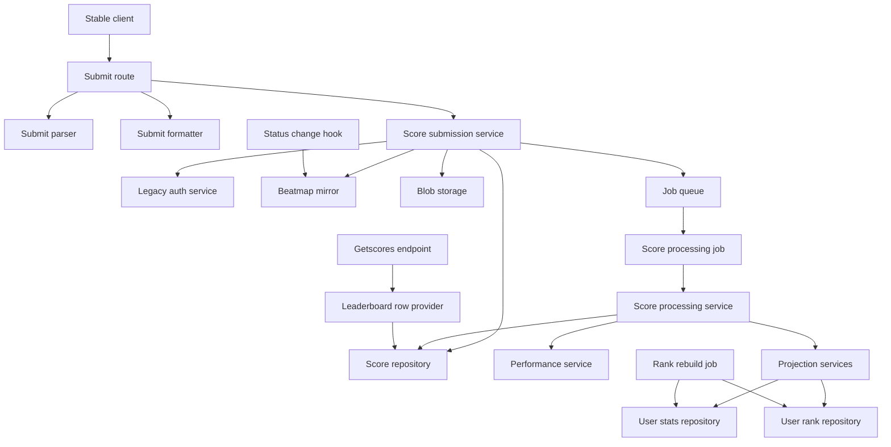
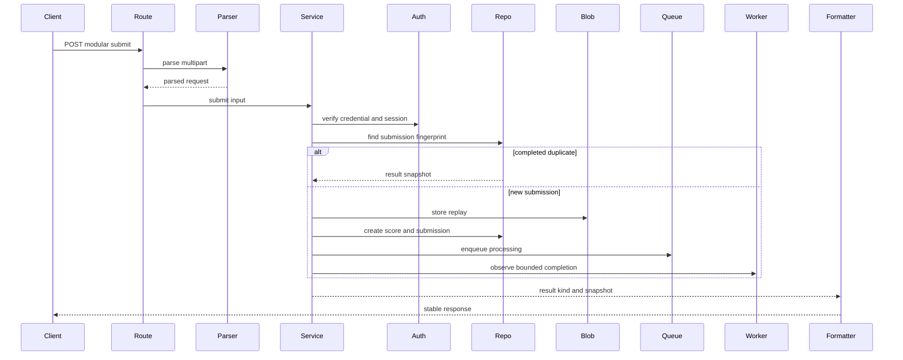
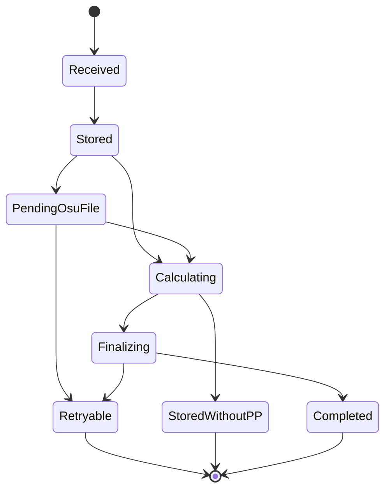
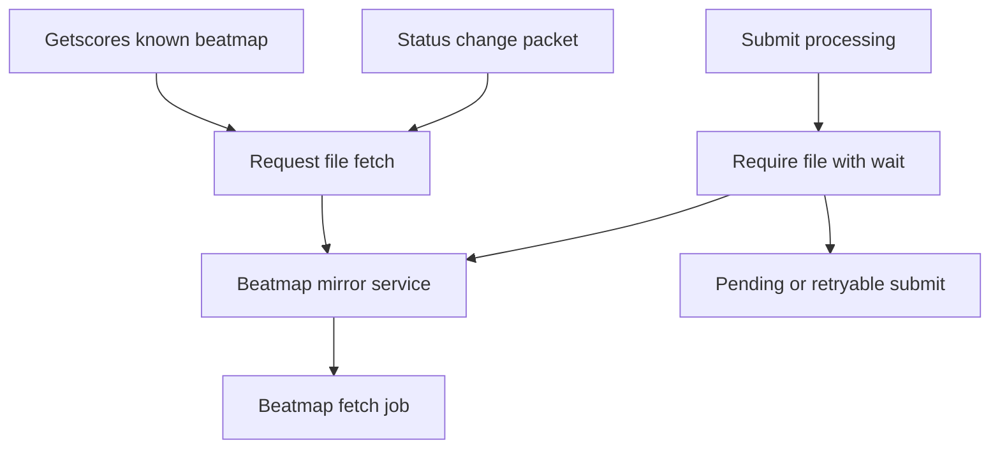
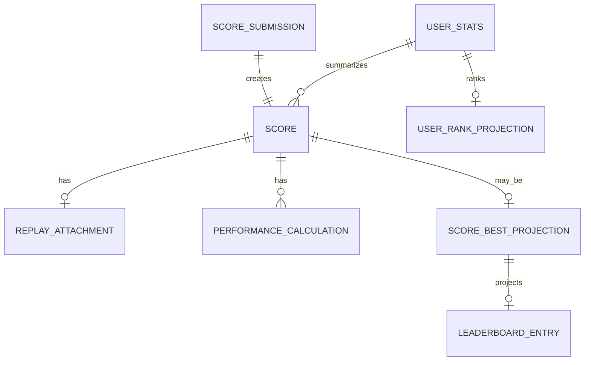

# Design Document

## Overview

この feature は osu! stable client から送られる `POST /web/osu-submit-modular-selector.php` を受け付け、認証済み gameplay result、failed play、replay、PP 計算結果、beatmap leaderboard、user stats、Web ranking 用 user rank projection に反映する score submission pipeline を Athena に追加する。

対象 user は stable client player と operator である。player には play result の保存、retry 時の一貫した応答、song select leaderboard 表示を提供し、operator には credential-safe な診断、pending/retry/recalculation state、projection rebuild 可能な data model を提供する。

### Goals

- stable modular submit request を互換的に parse、authorize、dedupe、store する。
- replay blob、score record、submission state、PP provenance、best score、leaderboard、user stats を明確な境界で更新する。
- stable login と Web ranking が読む global/country rank snapshot を提供する。
- PP 計算と projection 更新を worker に分離し、stable client には bounded wait 内で completed、accepted-pending、retryable、terminal reject response を返す。
- getscores score rows と personal score state を提供する。

### Non-Goals

- Relax / Autopilot の実 scoring、detection、leaderboard 表示。
- anti-cheat 判定、replay frame validation、cheat investigation workflow。
- replay download endpoint、legacy non-modular submit endpoint、proactive S2C notification。
- Friends leaderboard filtering、Web-only Loved PP/rank、Web ranking API/UI、manual recalculation UI/CLI。

## Boundary Commitments

### This Spec Owns

- `POST /web/osu-submit-modular-selector.php` の stable modular submit transport。
- duplicate `score` multipart handling、AES decode、score payload parse、field redaction policy。
- score submit authorization contract: password-md5、active bancho session、decrypted payload identity consistency。
- score submission idempotency、canonical fingerprint、processing state、result snapshot。
- score/replay/performance/best/leaderboard/user stats domain model と repository contract。
- `user_stats` から生成される global/country user rank projection と Web ranking 用 read model contract。rank projection は `playstyle` 軸で vanilla/RX/AP rank を分離できる。
- score effect policy: Ranked/Approved、Loved、Qualified、unsubmitted status、failed play の projection eligibility。
- score processing worker job、PP calculation orchestration、projection finalization。
- getscores score row provider と personal best/current score exposure。
- getscores、STATUS_CHANGE、submit fallback からの `.osu` file availability request。

### Out of Boundary

- beatmap metadata ownership、effective status calculation、`.osu` file body storage policy。
- blob storage backend internals and lifecycle cleanup。
- full presence-status implementation and RX/AP detection。
- anti-cheat, replay frame semantic validation, replay download。
- social graph and Friends leaderboard filtering。
- formula migration UI, admin recalculation command, Loved web rankings。
- Web ranking API endpoint、pagination response、Web UI rendering。
- legacy `/web/osu-submit-modular.php` and older non-modular endpoints。

### Allowed Dependencies

- `BeatmapMirrorService` for beatmap resolution, effective status, `.osu` file fetch request.
- `BlobStorageService` for replay body persistence.
- active bancho session state and legacy password verification service.
- SQLAlchemy async repositories behind Protocol interfaces.
- taskiq worker runtime for `ProcessScoreSubmissionJob`.
- `rosu-pp-py` behind `PerformanceService` in worker process.
- existing web legacy getscores parser/formatter and Starlette route composition.
- structlog diagnostics and `AppConfig` safety limits/timeouts.

### Revalidation Triggers

- stable submit request field semantics or AES key selection changes.
- getscores score row response format or PP display compatibility changes.
- beatmap mirror status/eligibility semantics changes, especially Loved and Qualified.
- user stats packet field contract changes.
- Web ranking API が必要とする rank projection field changes.
- PP calculator dependency/version/profile changes.
- score table axes, submission fingerprint, or projection table ownership changes.
- presence-status taking over STATUS_CHANGE prefetch ownership.

## Architecture

### Existing Architecture Analysis

Athena already separates transports, services, domain dataclasses, repository Protocols, SQLAlchemy implementations, blob storage, taskiq jobs, and worker composition. `web_legacy/getscores.py` currently returns header-only responses and `LegacyGetscoresService` resolves beatmap metadata with `require_osu_file=False`. `BeatmapMirrorService` and `beatmap_fetch` jobs already provide idempotent metadata/file fetch behavior. User stats are emitted through bancho S2C `user_stats` packet fields, but persistence for mode/category stats is not present.

This design follows the existing dependency direction: transports parse wire data, services own use cases, domain models carry invariants, repositories persist state, infrastructure provides storage/runtime, and jobs run heavy work. Services and jobs do not import SQLAlchemy models or raw DB sessions.

### Architecture Pattern & Boundary Map

Selected pattern: service plus worker pipeline with repository-backed idempotency and projections.



Architecture decisions:

- Request decode and stable response formatting remain in `transports/web_legacy`.
- `ScoreSubmissionService` owns authorization, validation staging, replay persistence, idempotency, enqueue, bounded wait, and result kind selection.
- `ScoreProcessingService` owns PP calculation, best replacement, leaderboard projection, user stats projection, and result snapshot finalization.
- `UserRankProjectionService` owns bulk global/country rank snapshot rebuild from `user_stats`; submit finalization can mark rank projections stale without updating every affected user.
- `ScoreEffectPolicy` maps beatmap effective status plus pass/fail to effects. Ranked/Approved grant ranked PP/stats; Loved and Qualified are leaderboard-only; Pending/WIP/Graveyard/NotSubmitted/Unknown are stored as non-leaderboard; failed scores are never PP/best/leaderboard eligible.
- Failed or exited play duration is derived from `ft` milliseconds when the value passes sanity limits; `x` is stored as the exit/quit classification signal, not as a duration.
- `.osu` availability is requested at three points: getscores prefetch, STATUS_CHANGE prefetch, submit fallback.

### Dependency Direction

```text
domain -> repositories.interfaces -> services -> transports/jobs/composition
```

SQLAlchemy model modules are imported only by SQLAlchemy repository and Alembic discovery paths. `PerformanceService` is a service boundary that hides `rosu-pp-py`; transport and repositories do not depend on calculator APIs.

### Technology Stack

| Layer | Choice / Version | Role in Feature | Notes |
|-------|------------------|-----------------|-------|
| Transport | Starlette + python-multipart | stable submit and getscores HTTP parsing | duplicate field preservation required |
| Backend / Services | Python 3.14+ dataclasses and Protocols | score domain, input objects, use cases | no Pydantic in domain |
| Data / Storage | SQLAlchemy 2 async + PostgreSQL | score/submission/projection/stats persistence | Alembic migration required |
| Binary Storage | existing `blob-storage` | replay body storage | metadata remains in score tables |
| Messaging / Jobs | taskiq + taskiq-redis | async PP/projection processing | app waits bounded time |
| PP Calculation | `rosu-pp-py` 4.0.2 candidate | PP/stars for all vanilla rulesets | worker-only dependency |
| Observability | structlog | redacted diagnostics and processing states | no raw credentials |

## File Structure Plan

### Directory Structure

```text
src/osu_server/
├── domain/
│   ├── score.py
│   ├── score_submission.py
│   ├── user_stats.py
│   └── user_rank.py
├── services/
│   ├── score_submission_service.py
│   ├── score_processing_service.py
│   ├── score_effect_policy.py
│   ├── score_validation_service.py
│   ├── performance_service.py
│   ├── beatmap_leaderboard_service.py
│   ├── user_stats_service.py
│   └── user_rank_projection_service.py
├── transports/
│   ├── web_legacy/
│   │   ├── score_submission.py
│   │   ├── score_submission_parser.py
│   │   ├── score_submission_formatter.py
│   │   └── getscores.py
│   └── bancho/
│       └── handlers/
│           └── status.py
├── repositories/
│   ├── interfaces/
│   │   ├── score_repository.py
│   │   ├── user_stats_repository.py
│   │   └── user_rank_repository.py
│   ├── memory/
│   │   ├── score_repository.py
│   │   ├── user_stats_repository.py
│   │   └── user_rank_repository.py
│   └── sqlalchemy/
│       ├── score_repository.py
│       ├── user_stats_repository.py
│       ├── user_rank_repository.py
│       └── models/
│           ├── score.py
│           ├── user_stats.py
│           └── user_rank.py
├── jobs/
│   ├── score_processing.py
│   └── user_rank_rebuild.py
└── composition/
    ├── service_registry.py
    └── worker_runtime.py

alembic/versions/
└── 20260609_0201_create_score_submission_tables.py

tests/
├── unit/
│   ├── services/
│   │   ├── test_score_submission_service.py
│   │   ├── test_score_processing_service.py
│   │   ├── test_score_effect_policy.py
│   │   ├── test_score_validation_service.py
│   │   ├── test_user_stats_service.py
│   │   └── test_user_rank_projection_service.py
│   └── transports/web_legacy/
│       ├── test_score_submission_parser.py
│       └── test_score_submission_formatter.py
└── integration/
    ├── test_score_submission_endpoint.py
    └── test_getscores_score_rows.py
```

### Modified Files

- `pyproject.toml` — add `rosu-pp-py` after dependency verification.
- `src/osu_server/config.py` — add submit body/replay limits, bounded wait, processing timeout, replay retention policy, PP calculator profile fields.
- `src/osu_server/app.py` or composition route assembly — register `POST /web/osu-submit-modular-selector.php` under osu web host.
- `src/osu_server/transports/web_legacy/getscores.py` — include score rows and personal score state through `BeatmapLeaderboardService`.
- `src/osu_server/services/legacy_getscores_service.py` — request non-blocking `.osu` prefetch when a known beatmap resolves.
- `src/osu_server/transports/bancho/handlers/status.py` — consume STATUS_CHANGE beatmap id/checksum only for `.osu` prefetch; full presence ownership remains out of boundary.
- `src/osu_server/transports/bancho/protocol/s2c/login.py` consumers — read persisted user stats and rank projection for subsequent user_stats packets.
- `src/osu_server/worker.py` — register score processing runtime and task module.
- `src/osu_server/repositories/sqlalchemy/models/__init__.py` — include score and user stats models for Alembic.
- `src/osu_server/repositories/interfaces/__init__.py`, `memory/__init__.py` — export new repository Protocols/implementations where consistent.

## System Flows

### Submit Request Lifecycle



The service never keeps a DB transaction open while waiting for worker completion. Bounded wait observes persisted state.

### Worker Processing State



`StoredWithoutPP` is valid for otherwise accepted scores when PP calculation is temporarily unavailable or non-PP-eligible. Failed and non-leaderboard scores bypass best/leaderboard/rank projection.

### `.osu` File Availability



getscores and STATUS_CHANGE do not delay user-facing responses for file fetch. submit waits only within the configured response budget.

## Requirements Traceability

| Requirement | Summary | Components | Interfaces | Flows |
|-------------|---------|------------|------------|-------|
| 1.1, 1.2, 1.5 | endpoint scope and no legacy fallback | Submit route, Formatter | API | Submit Request Lifecycle |
| 1.3, 1.4 | vanilla rulesets and reserved playstyle axis | Score domain, ScoreEffectPolicy | State | Worker Processing State |
| 2.1, 2.2 | observed multipart fields and duplicate score handling | SubmitParser | API | Submit Request Lifecycle |
| 2.3, 2.5, 2.6 | required fields, limits, malformed diagnostics | SubmitParser, SubmitService | API, Logging | Submit Request Lifecycle |
| 2.4, 15.3, 15.4, 15.5 | opaque field storage and redaction | SubmitParser, ScoreSubmission domain | State, Logging | Submit Request Lifecycle |
| 3.1, 3.2, 3.3, 3.4 | password/session/payload authorization | SubmitService, LegacyAuthService | Service | Submit Request Lifecycle |
| 3.5, 3.6, 15.1 | auth failure disclosure and secret logging | Formatter, SubmitService | API, Logging | Submit Request Lifecycle |
| 4.1, 4.3, 4.4, 4.6 | valid gameplay score persistence | ScoreRepository, Score domain | State | Submit Request Lifecycle |
| 4.2, 13.2 | replay persistence | BlobStorageService, ReplayAttachment | State | Submit Request Lifecycle |
| 4.5, 13.1, 13.3, 13.4, 13.5, 13.6 | failed/exited play storage, playtime, and exclusion | ScoreEffectPolicy, ScoreProcessingService | State | Worker Processing State |
| 5.1, 5.2, 5.3, 5.4, 5.5 | idempotent retry and snapshots | ScoreSubmissionService, ScoreRepository | State, API | Submit Request Lifecycle |
| 6.1, 6.2, 6.3, 6.4, 6.5 | bounded result kinds | SubmitService, Formatter, ScoreJob | API, Batch, Logging | Submit Request Lifecycle |
| 7.1, 7.2, 7.3, 7.4, 7.5, 7.6 | beatmap status and eligibility | ScoreEffectPolicy, Projection services | State | Worker Processing State |
| 8.1, 8.2, 8.3, 8.4, 8.5 | validation, accuracy, grade | ScoreValidationService, Score domain | Service, Logging | Worker Processing State |
| 9.1, 9.2, 9.3, 9.4, 9.5 | PP calculation and provenance | PerformanceService, PerformanceCalculation | Service, State | Worker Processing State |
| 10.1, 10.2, 10.3 | leaderboard rows and personal state | BeatmapLeaderboardService, Getscores | Service, API | Getscores integration |
| 10.4, 10.5 | PP display compatibility | Getscores formatter, PerformanceCalculation | API | Getscores integration |
| 10.6, 10.7 | friends unsupported and country filtering | BeatmapLeaderboardService | Service | Getscores integration |
| 11.1, 11.2, 11.3, 11.4, 11.5 | best score projection and rebuild | ScoreProcessingService, ScoreBestProjection | State | Worker Processing State |
| 12.1, 12.2, 12.3, 13.4, 13.5 | activity stats and failed play rules | UserStatsService, UserStatsRepository | State | Worker Processing State |
| 12.4, 12.5, 12.7 | ranked stats and reserved axes | UserStatsService, UserRankProjectionService, ScoreEffectPolicy | State | Worker Processing State |
| 12.6 | subsequent user_stats packets | UserStatsRepository, UserRankRepository, bancho stats sender | Service | None |
| 14.1, 14.2, 14.3, 14.4, 14.5 | `.osu` availability | Getscores, Status hook, SubmitService, BeatmapMirror | Service, Batch | `.osu` File Availability |
| 15.2 | failure category observability | SubmitService, ScoreProcessingService | Logging | Submit Request Lifecycle |
| 16.1, 16.2, 16.3, 16.4, 16.5 | compatibility evidence and fixtures | Research log, Parser tests, Formatter tests | Test | None |

## Components and Interfaces

| Component | Domain/Layer | Intent | Req Coverage | Key Dependencies | Contracts |
|-----------|--------------|--------|--------------|------------------|-----------|
| SubmitParser | Transport | stable modular multipart を typed input に変換する | 2.1, 2.2, 2.3, 2.5 | Starlette form data | API |
| SubmitFormatter | Transport | stable-compatible result body を生成する | 3.5, 6.1, 6.2, 6.3, 6.4 | result snapshot | API |
| ScoreSubmissionService | Service | authorization、dedupe、replay保存、enqueue、bounded wait | 3.1, 4.1, 5.1, 6.1 | auth, repo, blob, queue | Service |
| ScoreProcessingService | Service/Worker | score finalization、PP、projection 更新 | 7.1, 9.1, 11.1, 12.4 | repo, performance, stats | Service, Batch |
| ScoreValidationService | Service | hit counts、accuracy、grade、ruleset consistency を server-side に検証する | 8.1, 8.2, 8.3, 8.4, 8.5 | score domain | Service |
| ScoreEffectPolicy | Domain/Service | beatmap status と pass/fail から effects を決定する | 7.1, 7.2, 7.3, 7.4, 13.3 | beatmap domain | Service |
| PerformanceService | Service | `.osu` file と score から PP/stars を計算する | 9.1, 9.2, 9.4 | rosu-pp-py, blob, beatmap | Service |
| BeatmapLeaderboardService | Service | getscores score rows と personal state を提供する | 10.1, 10.2, 10.3, 10.7 | score repo | Service |
| UserStatsService | Service | activity stats と ranked stats を更新する | 12.1, 12.4, 12.7 | stats repo, score repo | Service |
| UserRankProjectionService | Service/Worker | Web ranking と login packet 用 rank snapshot を rebuild する | 12.4, 12.6, 12.7 | stats repo, rank repo | Service, Batch |
| ScoreRepository | Repository | scores/submissions/replay/performance/projection persistence | 4.1, 5.5, 11.5 | PostgreSQL | State |
| UserStatsRepository | Repository | per user/ruleset/playstyle/category stats persistence | 12.6, 12.7 | PostgreSQL | State |
| UserRankRepository | Repository | global/country rank projection persistence | 12.4, 12.6, 12.7 | PostgreSQL | State |

### Transport Layer

#### SubmitParser

| Field | Detail |
|-------|--------|
| Intent | multipart field order を保ったまま stable submit request を decode する |
| Requirements | 2.1, 2.2, 2.3, 2.4, 2.5, 2.6, 16.4 |

**Responsibilities & Constraints**
- duplicate `score` part を exact count と order で検証する。
- score payload、replay payload、credential、opaque fields を分離する。
- `pass`、raw token、raw encrypted body を operator logs に出さない。
- request limits は `AppConfig` から読む。

**Service Interface**
```python
class StableSubmitParser(Protocol):
    async def parse(self, request: Request) -> StableSubmitParseResult: ...
```

Preconditions: request body size is bounded by app middleware or parser config.
Postconditions: result contains either typed parsed input or terminal parse error with redacted diagnostics.

#### SubmitFormatter

| Field | Detail |
|-------|--------|
| Intent | internal result kind から stable-compatible text response を生成する |
| Requirements | 3.5, 6.1, 6.2, 6.3, 6.4, 10.4, 10.5, 15.5 |

**API Contract**

| Result kind | Client response | Notes |
|-------------|-----------------|-------|
| completed | chart response from snapshot | includes online score id and rank fields where compatible |
| accepted_pending | retry-compatible pending response | no internal ids exposed |
| retryable_failure | retry-compatible error response | used for temporary dependencies |
| terminal_reject | terminal error response | used for auth, malformed, unsupported, terminal validation |

### Service Layer

#### ScoreSubmissionService

| Field | Detail |
|-------|--------|
| Intent | submit use case の synchronous boundary を所有する |
| Requirements | 3.1, 3.2, 3.3, 3.4, 4.1, 4.2, 5.1, 6.1, 14.3 |

**Responsibilities & Constraints**
- password-md5 credential と active session を検証する。
- decrypted payload identity と authenticated user を一致させる。
- canonical fingerprint で duplicate submission を検出する。
- replay は terminal reject 前に保存しない。
- score record と submission record の作成は repository transaction に委譲する。
- worker completion は bounded wait で state を観測するだけで、transaction は保持しない。

**Service Interface**
```python
class ScoreSubmissionUseCase(Protocol):
    async def submit(self, input: StableScoreSubmissionInput) -> ScoreSubmissionOutcome: ...
```

Preconditions: input has parsed multipart fields and redaction policy applied.
Postconditions: valid new submission has one score record, at most one replay attachment, one submission state, and one queued job.

#### ScoreProcessingService

| Field | Detail |
|-------|--------|
| Intent | stored submission を final score effects に反映する |
| Requirements | 7.1, 8.2, 8.3, 9.1, 11.1, 12.4, 14.5 |

**Batch / Job Contract**
- Trigger: `ProcessScoreSubmissionJob(submission_id)`.
- Input validation: submission exists, state is processable, score exists, fingerprint is stable.
- Idempotency: completed submissions are no-op; retryable state can be reprocessed.
- Processing order: server-side score validation runs before PP calculation and projection updates.
- Output: score validation result, score processing state, performance calculation, best/leaderboard/stats projections, result snapshot.
- Recovery: temporary dependency failures become retryable; terminal score validation failures become terminal snapshot.

#### ScoreValidationService

| Field | Detail |
|-------|--------|
| Intent | stable client 由来の score payload を server-side に再検証する |
| Requirements | 8.1, 8.2, 8.3, 8.4, 8.5 |

**Responsibilities & Constraints**
- ruleset-specific hit counts と max combo の整合性を検証する。
- accuracy と grade を trusted hit counts から server-side に再計算する。
- client supplied accuracy / grade と server calculated values の差分を diagnostics として保存する。
- replay や `.osu` が不足して完全検証できない場合は、理由を分類して leaderboards / PP に反映しない。
- malformed or internally inconsistent score は terminal validation failure として result snapshot に保存する。

**Service Interface**
```python
class ScoreValidator(Protocol):
    async def validate(self, input: ScoreValidationInput) -> ScoreValidationResult: ...
```

Preconditions: input references a parsed score payload and stored score row.
Postconditions: result contains server-calculated accuracy, grade, validation flags, diagnostics, and visibility eligibility for downstream effects.

#### ScoreEffectPolicy

| Beatmap effective status | Passed score effects | Failed score effects |
|--------------------------|----------------------|----------------------|
| Ranked, Approved | PP, ranked stats, global rank, country rank, best, leaderboard | store only, activity stats if reliable |
| Loved | leaderboard, best within Loved category | store only, activity stats if reliable |
| Qualified | leaderboard, best within Qualified category, no ranked PP | store only, activity stats if reliable |
| Pending, WIP, Graveyard, NotSubmitted, Unknown | store only, no leaderboard, no ranked PP | store only, activity stats if reliable |

Status at submission is preserved on `scores`. Current projections are rebuilt from current effective status when status changes.

#### PerformanceService

| Field | Detail |
|-------|--------|
| Intent | stable score と matching `.osu` file から PP/stars を計算する |
| Requirements | 9.1, 9.2, 9.3, 9.4, 9.5 |

**Service Interface**
```python
class PerformanceCalculator(Protocol):
    async def calculate(self, input: PerformanceCalculationInput) -> PerformanceCalculationResult: ...
```

Preconditions: input references a stored score and a matching `.osu` file attachment.
Postconditions: result includes pp, stars, calculator name/version, formula profile, `.osu` attachment id, calculated_at, and failure category when unavailable.

### Repository Layer

#### ScoreRepository

| Field | Detail |
|-------|--------|
| Intent | score submission aggregate と projections を永続化する |
| Requirements | 4.1, 4.3, 4.4, 5.1, 5.5, 11.5 |

**State Management**
- `score_submissions.fingerprint` is unique.
- `scores.online_checksum` or parsed score checksum is unique when compatibility evidence provides it.
- finalization updates score processing state, best projection, leaderboard projection, user stats snapshot pointer, and result snapshot in one short transaction.
- projection rebuild methods operate by ruleset/playstyle/category and beatmap current eligibility.
- failed/exited playtime uses `ft // 1000` only when `ft` is non-negative and within configured sanity bounds relative to beatmap length; otherwise duration is stored as unavailable.

#### UserStatsRepository

| Field | Detail |
|-------|--------|
| Intent | rank projection の canonical source になる mode/category stats を保存する |
| Requirements | 12.1, 12.4, 12.6, 12.7 |

**State Management**
- primary key is `(user_id, ruleset, playstyle, category)`.
- stores play_count, play_time, total_score, ranked_score, weighted_pp, accuracy, grade counts, hit totals, country.
- Loved leaderboard-only score does not update game-visible ranked stats.

#### UserRankRepository

| Field | Detail |
|-------|--------|
| Intent | stable login と Web ranking が読む rank snapshot を永続化する |
| Requirements | 12.4, 12.6, 12.7 |

**State Management**
- primary key is `(user_id, ruleset, playstyle, category)`.
- stores `global_rank`, `country_rank`, `pp`, `ranked_score`, `country`, `generated_at`.
- rank rows are derived from `user_stats`; `user_stats` remains canonical.
- `playstyle` is the global rank mod-mode axis: vanilla, reserved relax, reserved autopilot. It is not a score mod combination such as HD or DT.
- rebuild uses PostgreSQL window functions and bulk upsert/swap, not per-submit cascading rank updates.
- stale or missing projection can fall back to indexed `COUNT(*) + 1` for the requested user.

## Data Models

### Domain Model



Core value objects:

- `Ruleset`: `osu`, `taiko`, `catch`, `mania`.
- `Playstyle`: `vanilla`, reserved `relax`, reserved `autopilot`.
- `ScoreCategory`: `ranked`, `loved`, `qualified`, `unranked`.
- `ScoreStatus`: `failed`, `submitted`, `best`.
- `SubmissionState`: `received`, `processing`, `completed`, `retryable`, `terminal_rejected`.
- `SubmissionResultKind`: `completed`, `accepted_pending`, `retryable_failure`, `terminal_reject`.

### Physical Data Model

Tables added by this feature:

- `scores`
  - `id BIGINT PK`
  - `user_id BIGINT FK users`
  - `beatmap_id BIGINT NULL FK beatmaps`
  - `beatmap_checksum CHAR(32) NOT NULL`
  - `ruleset SMALLINT NOT NULL`
  - `playstyle SMALLINT NOT NULL DEFAULT 0`
  - `category SMALLINT NOT NULL`
  - `score BIGINT NOT NULL`
  - `max_combo INTEGER NOT NULL`
  - `mods INTEGER NOT NULL`
  - `n300 INTEGER NOT NULL`, `n100 INTEGER NOT NULL`, `n50 INTEGER NOT NULL`, `nmiss INTEGER NOT NULL`, `ngeki INTEGER NOT NULL`, `nkatu INTEGER NOT NULL`
  - `accuracy NUMERIC(7,4) NOT NULL`
  - `grade VARCHAR(2) NOT NULL`
  - `passed BOOLEAN NOT NULL`
  - `perfect BOOLEAN NOT NULL`
  - `status SMALLINT NOT NULL`
  - `effective_beatmap_status_at_submission SMALLINT NOT NULL`
  - `client_version VARCHAR(32) NULL`, `client_flags INTEGER NULL`
  - `play_time_seconds INTEGER NULL`, `play_time_source VARCHAR(32) NULL` (`ft` for reliable failed/exited plays, beatmap length or score time for passed plays when available)
  - `submitted_at TIMESTAMPTZ NOT NULL`
  - indexes: `(beatmap_checksum, ruleset, playstyle, category, score DESC)`, `(user_id, ruleset, playstyle, category)`, unique nullable checksum where available.

- `score_submissions`
  - `id BIGINT PK`
  - `score_id BIGINT NULL FK scores`
  - `user_id BIGINT NOT NULL`
  - `fingerprint CHAR(64) NOT NULL UNIQUE`
  - `state SMALLINT NOT NULL`
  - `request_field_hashes JSONB NOT NULL`
  - `result_snapshot JSONB NULL`
  - `failure_category VARCHAR(64) NULL`
  - `created_at`, `updated_at`, `completed_at`

- `score_replay_attachments`
  - `score_id BIGINT PK FK scores`
  - `blob_key VARCHAR NOT NULL`
  - `byte_size INTEGER NOT NULL`
  - `sha256 CHAR(64) NOT NULL`
  - `stored_at TIMESTAMPTZ NOT NULL`

- `score_performance_calculations`
  - `id BIGINT PK`
  - `score_id BIGINT FK scores`
  - `pp NUMERIC(10,4) NULL`
  - `stars NUMERIC(8,4) NULL`
  - `calculator_name VARCHAR(64) NOT NULL`
  - `calculator_version VARCHAR(32) NOT NULL`
  - `formula_profile VARCHAR(64) NOT NULL`
  - `beatmap_file_attachment_id BIGINT NULL`
  - `failure_category VARCHAR(64) NULL`
  - `calculated_at TIMESTAMPTZ NOT NULL`

- `score_best_projections`
  - unique `(user_id, beatmap_checksum, ruleset, playstyle, category)`
  - points to current best `score_id`.

- `beatmap_leaderboard_entries`
  - unique `(beatmap_checksum, ruleset, playstyle, category, user_id)`
  - stores `score_id`, `score`, `pp`, `country`, `submitted_at`; beatmap row rank is computed from ordered rows at read time.

- `user_stats`
  - primary key `(user_id, ruleset, playstyle, category)`
  - stores play count/time, total score, ranked score, weighted pp, accuracy, grade counts, hit totals, country, updated_at.

- `user_rank_projections`
  - primary key `(user_id, ruleset, playstyle, category)`
  - `global_rank INTEGER NOT NULL`
  - `country_rank INTEGER NULL`
  - `pp NUMERIC(10,4) NOT NULL`
  - `ranked_score BIGINT NOT NULL`
  - `country CHAR(2) NOT NULL`
  - `generated_at TIMESTAMPTZ NOT NULL`
  - indexes: `(ruleset, playstyle, category, global_rank)`, `(ruleset, playstyle, category, country, country_rank)`.

## Error Handling

- Parse/auth errors are terminal reject and create no leaderboard-visible score.
- replay/blob failure before score persistence is retryable if storage dependency is temporary; otherwise terminal reject without raw diagnostics in client response.
- missing `.osu` for PP-eligible score becomes pending/retryable and preserves reprocessing ability.
- PP calculation failure stores score without ranked PP and records provenance/failure category.
- projection finalization failure leaves submission retryable; duplicate retry does not create a second score.

## Security and Privacy

- Raw `pass`, raw token, raw decrypted payload, raw encrypted payload, and raw replay bytes are never logged.
- `request_field_hashes` may store SHA-256 hashes of opaque fields for audit and dedupe support.
- replay blob keys are internal and not exposed in stable responses.
- authorization failure responses do not disclose beatmap status, leaderboard placement, PP, or dependency diagnostics.
- multipart part count, text size, replay size, and total body size are configurable limits.

## Performance and Operations

- app process target: parse/auth/store/enqueue and bounded wait only.
- default submit bounded wait is configuration-driven; initial target is approximately 10 seconds.
- worker finalization uses one short transaction and no long `.osu` fetch or PP calculation inside that transaction.
- leaderboard getscores queries use projection tables sorted by score descending.
- Web ranking and stable login rank reads use `user_rank_projections`; if missing or stale, the service may compute a single-user fallback rank with indexed `COUNT(*) + 1`.
- rank projection rebuild uses window functions over `user_stats` and runs asynchronously after score processing or on a periodic worker schedule.
- metrics/log dimensions: result kind, failure category, ruleset, category, beatmap status, pending age, PP calculator version.

## Testing Strategy

- Parser fixtures cover duplicate `score`, missing required fields, optional opaque fields, oversize text/replay/body, AES key selection with and without `osuver`.
- Authorization tests cover wrong password, missing active session, mismatched decrypted username, token-only request, and no diagnostic disclosure.
- Service tests cover new submission, duplicate completed, duplicate pending, malformed terminal reject, replay persistence, and bounded wait timeout.
- Worker tests cover Ranked/Approved PP/stats, Loved leaderboard-only, Qualified leaderboard-only, unranked store-only, failed play exclusion, exited playtime from `ft`, PP failure stored-without-PP.
- Rank projection tests cover global rank, country rank, tie-break ordering, stale projection fallback, and bulk rebuild idempotency.
- Getscores integration tests cover score descending rows, personal best row, PP display disabled/enabled fixture behavior, Country filtering where supported, Friends unsupported behavior.
- Repository tests cover uniqueness constraints, projection replacement, status-change rebuild, user_stats per ruleset/playstyle/category, and user_rank_projections bulk upsert.

## Migration and Rollout

1. Add schema and in-memory repositories before enabling route.
2. Add parser/formatter fixture tests before route registration.
3. Enable submit route with processing feature flag or configuration gate.
4. Enable worker job and projection updates after replay/blob persistence is verified.
5. Extend getscores to show rows after projection data is populated.
6. Backfill or initialize `user_stats` rows for existing users as zero values.
7. Run initial `user_rank_projections` rebuild before exposing Web ranking reads.
