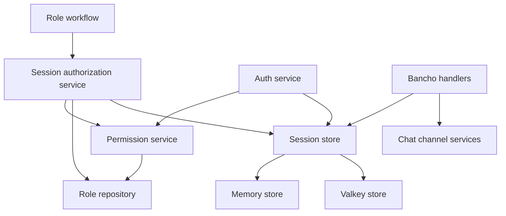
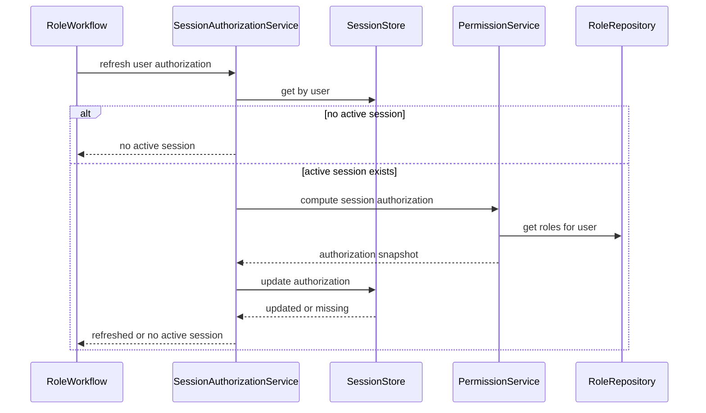
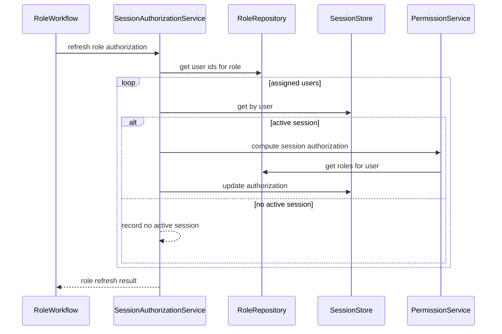
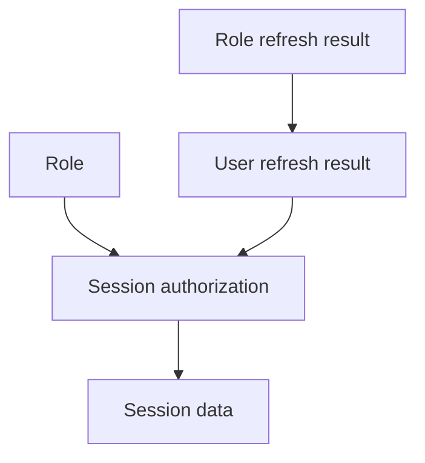
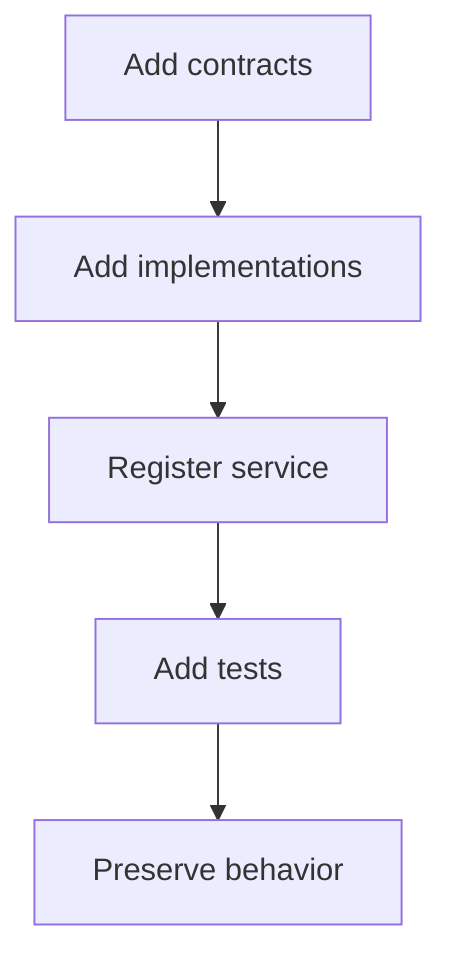

# Design Document

## Overview

この feature は、ログイン済みユーザーの `SessionData` に保存された authorization snapshot を、現在の role assignment / role permissions から再計算して active session へ同期する。管理者が role を付与・剥奪した場合や role permissions を更新した場合でも、stable bancho の次回 authorization-sensitive action は再ログインなしで最新状態を使う。

実装は既存の service / repository / session store 境界を拡張する。新しい public UI や admin command は作らず、将来の role 更新 workflow が呼び出す app-level service と、session store の authorization-only update contract を定義する。

### Goals

- active session の `privileges` / `role_ids` を現在の role-derived authorization に同期する。
- session token、client metadata、logged-in state を保持したまま authorization だけを更新する。
- direct role assignment change と role permissions update の両方から再利用できる service contract を提供する。
- login authorization と refresh authorization の計算を同じ source of truth に揃える。
- no active session / refreshed / failed の outcome を呼び出し元 workflow が判別できるようにする。

### Non-Goals

- admin command、WebUI 管理画面、role CRUD API の実装。
- ban / restrict / force logout の session invalidation 実装。
- stable bancho wire protocol の変更や login 初期 packet stream の再送。
- lazer / REST API / SignalR / web legacy の authorization refresh integration。
- role assignment / role permissions の永続化 mutation contract の全面設計。

## Boundary Commitments

### This Spec Owns

- `SessionAuthorizationService` による active session authorization refresh の orchestration。
- `SessionStore.update_authorization()` contract と memory / Valkey 実装。
- `PermissionService.compute_session_authorization()` による `privileges` と `role_ids` の一貫した snapshot 生成。
- `RoleRepository.get_user_ids_for_role()` による role permissions update の affected user discovery。
- `AuthService` の login authorization calculation を refresh と同じ snapshot contract に合わせること。
- refresh outcome の domain model と、service / store / Bancho-facing validation。

### Out of Boundary

- role assignment の付与・剥奪そのものを永続化する workflow。
- role permissions を更新する admin workflow。
- admin command / WebUI / REST endpoint から refresh service を呼ぶ UI-facing implementation。
- `delete_by_user()` を使う ban / restrict / force logout の session invalidation。
- client に permission update packet を push する wire-level UX。
- active session ではない user の session 作成や login bypass。

### Allowed Dependencies

- `services` は `domain` models と `repositories.interfaces` に依存できる。
- `repositories.memory` と `repositories.valkey` は `SessionStore` contract を実装する。
- `repositories.sqlalchemy` は `RoleRepository` read contract を実装する。
- `composition.service_registry` は新 service を DI container に登録できる。
- `transports.bancho` は既存どおり `SessionStore` から action-time session data を読む。
- 新しい外部ライブラリ、framework、database schema migration は導入しない。

### Revalidation Triggers

- `SessionData` の authorization fields、serialization shape、または token mapping の変更。
- `SessionStore` protocol の lifecycle method semantics の変更。
- `RoleRepository.get_roles_for_user()` の ordering または role membership semantics の変更。
- `PermissionService` の permission OR calculation または client flag mapping の変更。
- Bancho C2S handlers が action-time `SessionStore.get_by_user()` を使わず authorization を cache する変更。
- session invalidation workflow が `delete_by_user()` 以外の session deletion semantics を導入する変更。

## Architecture

### Existing Architecture Analysis

- Login 時は `AuthService._do_login()` が roles と permissions を計算し、`SessionData.privileges` / `SessionData.role_ids` を `SessionStore.create()` で保存する。
- Polling 時は `PollingWorkflow` が token から session を取得して user_id を決め、C2S dispatch 後に queue を drain する。
- Chat / channel handlers は各 C2S action で `SessionStore.get_by_user(user_id)` を読み、`ChannelService` と `ChatService` に `privileges` / `role_ids` を渡す。
- Lifecycle EXIT と session invalidation は `SessionStore.delete_by_user()` を使うため、authorization refresh とは別境界として維持できる。

### Architecture Pattern & Boundary Map

Selected pattern は既存 modular monolith の service orchestration extension。新しい top-level application layer は作らず、service layer に app-level use case を追加し、repository interfaces と state store ports を最小拡張する。



**Architecture Integration**:
- Selected pattern: direct service call with repository / state ports。refresh outcome が必要なため EventBus ではなく synchronous service contract を採用する。
- Domain/feature boundaries: role mutation は upstream workflow、authorization refresh は this spec、session invalidation は lifecycle / moderation workflow。
- Existing patterns preserved: dataclass domain models、Protocol repository、InMemory test double、Valkey volatile state、composition root registration。
- New components rationale: `SessionAuthorizationService` は role update 後の active session sync use case を担う唯一の orchestration boundary。
- Steering compliance: Services → Domain / Repositories interfaces、Transports → Services / Repositories の既存依存方向を維持する。

### Technology Stack

| Layer | Choice / Version | Role in Feature | Notes |
|-------|------------------|-----------------|-------|
| Backend / Services | Python 3.14+ | service orchestration and domain dataclasses | 既存 stack、追加 dependency なし |
| Data / Storage | SQLAlchemy 2.0 async | role assigned user lookup | schema migration なし |
| State | Valkey via valkey-glide | active session authorization patch | existing volatile session store を拡張 |
| Tests | pytest + pytest-asyncio | unit / integration / bancho-facing verification | InMemory implementations を優先 |
| Quality | basedpyright strict + ruff | type safety and linting | Protocol signatures を明示 |

## File Structure Plan

### Directory Structure

```text
src/osu_server/
├── domain/
│   ├── session_authorization.py       # SessionAuthorization value object and refresh result models
│   └── session.py                     # Existing SessionData persisted session model remains the storage shape
├── services/
│   ├── session_authorization_service.py # App-level refresh orchestration use case
│   ├── permission_service.py          # Adds session authorization snapshot calculation
│   └── auth_service.py                # Uses shared snapshot calculation during login
├── repositories/
│   ├── interfaces/
│   │   ├── session_store.py           # Adds update_authorization contract
│   │   └── role_repository.py         # Adds get_user_ids_for_role contract
│   ├── memory/
│   │   ├── session_store.py           # InMemory authorization-only update
│   │   └── role_repository.py         # InMemory assigned user lookup and test mutation helpers if needed
│   ├── valkey/
│   │   └── session_store.py           # Atomic Valkey authorization-only update script
│   └── sqlalchemy/
│       └── role_repository.py         # SQLAlchemy assigned user lookup
├── composition/
│   └── service_registry.py            # Registers SessionAuthorizationService
└── transports/
    └── bancho/
        └── handlers/chat.py           # Existing action-time authorization read remains the Bancho integration point

tests/
├── unit/
│   ├── domain/test_session_authorization.py
│   ├── infrastructure/state/test_session_store.py
│   ├── repositories/test_role_repository.py
│   ├── services/test_permission_service.py
│   ├── services/test_session_authorization_service.py
│   ├── services/test_auth_service.py
│   ├── composition/test_service_registry.py
│   └── transports/bancho/test_chat_handlers.py
└── integration/
    ├── test_valkey_session_store.py
    ├── test_chat_e2e.py
    └── test_polling_e2e.py
```

### Modified Files

- `src/osu_server/domain/session_authorization.py` — new immutable models for authorization snapshot and refresh outcomes.
- `src/osu_server/repositories/interfaces/session_store.py` — adds `update_authorization(user_id, authorization) -> bool`.
- `src/osu_server/repositories/memory/session_store.py` — updates only `privileges` / `role_ids` while preserving token mapping and other `SessionData` fields.
- `src/osu_server/repositories/valkey/session_store.py` — adds atomic update script that patches JSON fields for current `user_session:{user_id}` token.
- `src/osu_server/repositories/interfaces/role_repository.py` — adds `get_user_ids_for_role(role_id) -> list[int]` with deterministic ordering.
- `src/osu_server/repositories/memory/role_repository.py` — implements assigned user lookup; may expose test-only mutation helpers outside the Protocol.
- `src/osu_server/repositories/sqlalchemy/role_repository.py` — queries `user_roles` by `role_id` and returns user IDs.
- `src/osu_server/services/permission_service.py` — adds `compute_session_authorization(user_id)` as the shared authorization snapshot source.
- `src/osu_server/services/auth_service.py` — uses `compute_session_authorization()` for login session and response construction.
- `src/osu_server/services/session_authorization_service.py` — new use-case service for per-user and per-role refresh.
- `src/osu_server/composition/service_registry.py` — registers `SessionAuthorizationService` using existing `PermissionService`, `RoleRepository`, and `SessionStore`.
- `tests/unit/domain/test_session_authorization.py` — validates refresh status and snapshot domain model behavior.
- `tests/unit/infrastructure/state/test_session_store.py` — validates InMemory `update_authorization()` contract.
- `tests/integration/test_valkey_session_store.py` — validates Valkey `update_authorization()` contract and token preservation.
- `tests/unit/repositories/test_role_repository.py` — validates `get_user_ids_for_role()`.
- `tests/unit/services/test_permission_service.py` — validates shared snapshot calculation.
- `tests/unit/services/test_session_authorization_service.py` — validates refresh outcomes and failure preservation.
- `tests/unit/services/test_auth_service.py` — validates login uses the shared snapshot calculation.
- `tests/unit/composition/test_service_registry.py` — validates DI can resolve `SessionAuthorizationService`.
- `tests/unit/transports/bancho/test_chat_handlers.py` — preserves proof that handlers pass session authorization to service calls.
- `tests/integration/test_chat_e2e.py` / `tests/integration/test_polling_e2e.py` — add bancho-facing refreshed authorization coverage for subsequent actions.

## System Flows

### Direct user authorization refresh



Key decision: role-derived authorization is computed only after active session existence is confirmed. This avoids turning offline users into failure cases and prevents session creation.

### Role permissions update refresh



Key decision: role update refresh starts from assigned users rather than scanning all sessions, so unaffected active users are not touched.

## Requirements Traceability

| Requirement | Summary | Components | Interfaces | Flows |
|-------------|---------|------------|------------|-------|
| 1.1 | role grant refreshes active session | SessionAuthorizationService, PermissionService, SessionStore | `refresh_user_authorization`, `compute_session_authorization`, `update_authorization` | Direct user refresh |
| 1.2 | role revoke refreshes active session | SessionAuthorizationService, PermissionService, SessionStore | `refresh_user_authorization`, `compute_session_authorization`, `update_authorization` | Direct user refresh |
| 1.3 | unchanged effective role state stays equivalent | SessionAuthorizationService, PermissionService | `refresh_user_authorization`, `compute_session_authorization` | Direct user refresh |
| 1.4 | no active session returns no active and creates nothing | SessionAuthorizationService, SessionStore | `get_by_user`, `refresh_user_authorization` | Direct user refresh |
| 1.5 | refreshed permissions derive from current roles | PermissionService, RoleRepository | `compute_session_authorization`, `get_roles_for_user` | Direct user refresh |
| 2.1 | role permission change refreshes assigned active users | SessionAuthorizationService, RoleRepository | `refresh_role_authorization`, `get_user_ids_for_role` | Role permissions update refresh |
| 2.2 | multiple affected sessions are refreshed | SessionAuthorizationService, SessionStore | `refresh_role_authorization`, `update_authorization` | Role permissions update refresh |
| 2.3 | unaffected active users are not altered | SessionAuthorizationService, RoleRepository | `get_user_ids_for_role` | Role permissions update refresh |
| 2.4 | no active assigned users creates no sessions | SessionAuthorizationService, SessionStore | `refresh_role_authorization`, `get_by_user` | Role permissions update refresh |
| 2.5 | removed permission stops subsequent protected actions | SessionStore, BanchoHandlers, ChannelService | `update_authorization`, existing C2S action authorization | Direct user refresh |
| 3.1 | newly granted access works without re-login | SessionStore, BanchoHandlers, ChannelService | `update_authorization`, `get_by_user` | Direct user refresh |
| 3.2 | removed access is denied without re-login | SessionStore, BanchoHandlers, ChannelService | `update_authorization`, `get_by_user` | Direct user refresh |
| 3.3 | polling-dispatched C2S uses latest session authorization | PollingWorkflow, BanchoHandlers, SessionStore | existing dispatch, `get_by_user` | Direct user refresh |
| 3.4 | same session token remains valid | SessionStore, PollingWorkflow | `update_authorization`, `refresh` | Direct user refresh |
| 3.5 | channel ACL uses refreshed permissions and roles | ChatHandlers, ChannelService, SessionStore | existing channel action contracts | Direct user refresh |
| 4.1 | successful refresh preserves logged-in state | SessionStore | `update_authorization` | Direct user refresh |
| 4.2 | permission changes do not delete session | SessionAuthorizationService, SessionStore | `refresh_user_authorization`, `update_authorization` | Direct user refresh |
| 4.3 | ban restrict force logout remain invalidation | LifecycleHandlers, SessionStore | `delete_by_user` remains separate | None |
| 4.4 | role changes are not auth failures | SessionAuthorizationService, PollingWorkflow | refresh result model, existing token validation | Direct user refresh |
| 4.5 | offline login uses current role state | AuthService, PermissionService | `compute_session_authorization` | None |
| 5.1 | role membership and permission flags share one snapshot | PermissionService, SessionAuthorization | `compute_session_authorization` | Direct user refresh |
| 5.2 | role lookup failure preserves existing session and reports failed | SessionAuthorizationService, SessionStore | `refresh_user_authorization`, `UserAuthorizationRefreshResult` | Direct user refresh |
| 5.3 | repeated refresh is idempotent and creates no duplicate sessions | SessionAuthorizationService, SessionStore | `update_authorization`, `get_all_user_ids` validation | Direct user refresh |
| 5.4 | latest completed refresh defines subsequent decisions | SessionAuthorizationService, SessionStore | `update_authorization` atomicity | Direct user refresh |
| 5.5 | outcomes distinguish refreshed no active failed | SessionAuthorizationService, SessionAuthorization domain models | result dataclasses | Direct user refresh |
| 6.1 | direct grants and revocations are covered | Unit tests | service and store tests | Direct user refresh |
| 6.2 | role permissions update coverage includes affected and unaffected users | Unit tests | role refresh tests | Role permissions update refresh |
| 6.3 | no active session refresh creates no session | Unit and integration tests | service and store tests | Direct user refresh |
| 6.4 | refresh preserves login while invalidation stays separate | Unit and integration tests | `update_authorization`, `delete_by_user` tests | Direct user refresh |
| 6.5 | bancho-facing subsequent actions use refreshed auth | Integration tests | polling and chat E2E | Direct user refresh |
| 6.6 | existing login session polling channel coverage is preserved | Regression suite | existing tests plus added tests | None |

## Components and Interfaces

| Component | Domain / Layer | Intent | Req Coverage | Key Dependencies | Contracts |
|-----------|----------------|--------|--------------|------------------|-----------|
| SessionAuthorization | Domain | Immutable authorization snapshot and refresh result model | 5.1, 5.5 | Privileges P0 | Value object |
| SessionAuthorizationService | Services | Refresh active session authorization for a user or role | 1.1-1.5, 2.1-2.5, 4.1-4.4, 5.2-5.5 | SessionStore P0, PermissionService P0, RoleRepository P0 | Service |
| PermissionService | Services | Compute current role-derived authorization snapshot | 1.5, 4.5, 5.1 | RoleRepository P0 | Service |
| SessionStore | Repositories interface | Persist authorization-only updates to active sessions | 1.1-1.4, 3.1-3.5, 4.1-4.2, 5.3-5.4 | SessionAuthorization P0 | State |
| RoleRepository | Repositories interface | Provide role membership and affected users | 1.5, 2.1-2.4 | RoleModel P0, UserRoleModel P0 | Service |
| AuthService | Services | Use shared authorization snapshot at login | 4.5, 6.6 | PermissionService P0, SessionStore P0 | Service |
| BanchoHandlers | Transport | Continue action-time session authorization reads | 2.5, 3.1-3.5, 6.5 | SessionStore P0, ChatService P0, ChannelService P0 | Integration |

### Domain Layer

#### SessionAuthorization

| Field | Detail |
|-------|--------|
| Intent | Current role-derived authorization snapshot and refresh outcome types |
| Requirements | 5.1, 5.5 |

**Responsibilities & Constraints**
- Represents `privileges` and `role_ids` as one immutable snapshot.
- Keeps `role_ids` tuple-normalized to match `SessionData` storage behavior.
- Represents refresh outcomes without relying on booleans whose meaning is ambiguous.

**Dependencies**
- Outbound: `Privileges` — typed permission flags (P0)

**Contracts**: Service [ ] / API [ ] / Event [ ] / Batch [ ] / State [x]

##### State Model

```python
@dataclass(slots=True, frozen=True)
class SessionAuthorization:
    privileges: Privileges
    role_ids: tuple[int, ...] = ()

class AuthorizationRefreshStatus(StrEnum):
    REFRESHED = "refreshed"
    NO_ACTIVE_SESSION = "no_active_session"
    FAILED = "failed"

@dataclass(slots=True, frozen=True)
class UserAuthorizationRefreshResult:
    user_id: int
    status: AuthorizationRefreshStatus
    authorization: SessionAuthorization | None = None

@dataclass(slots=True, frozen=True)
class RoleAuthorizationRefreshResult:
    role_id: int
    user_results: tuple[UserAuthorizationRefreshResult, ...]
```

- Preconditions: `privileges` is a `Privileges` value; `role_ids` are domain role identifiers.
- Postconditions: `role_ids` are immutable tuple values.
- Invariants: `authorization` is present only when status is `REFRESHED`.

### Service Layer

#### SessionAuthorizationService

| Field | Detail |
|-------|--------|
| Intent | Apply current authorization snapshots to active sessions without changing session lifecycle |
| Requirements | 1.1-1.5, 2.1-2.5, 4.1-4.4, 5.2-5.5 |

**Responsibilities & Constraints**
- Checks active session existence before computing role authorization.
- Computes current authorization through `PermissionService`.
- Applies authorization-only update through `SessionStore`.
- Converts no active session, compute failure, and update failure into explicit result statuses.
- Does not create, delete, or replace sessions.

**Dependencies**
- Outbound: `SessionStore` — active session lookup and authorization update (P0)
- Outbound: `PermissionService` — current authorization snapshot (P0)
- Outbound: `RoleRepository` — assigned users for role update refresh (P0)

**Contracts**: Service [x] / API [ ] / Event [ ] / Batch [ ] / State [ ]

##### Service Interface

```python
class SessionAuthorizationService:
    async def refresh_user_authorization(
        self,
        user_id: int,
    ) -> UserAuthorizationRefreshResult: ...

    async def refresh_role_authorization(
        self,
        role_id: int,
    ) -> RoleAuthorizationRefreshResult: ...
```

- Preconditions:
  - Role mutation has already been committed by the calling workflow.
  - `user_id` and `role_id` are trusted internal identifiers.
- Postconditions:
  - Active session authorization matches current role-derived authorization when status is `REFRESHED`.
  - No session exists or is created when status is `NO_ACTIVE_SESSION`.
  - Existing session authorization remains unchanged when status is `FAILED` before store update.
- Invariants:
  - Refresh never calls `SessionStore.create()` or `SessionStore.delete_by_user()`.
  - Per-role refresh only iterates users returned by `RoleRepository.get_user_ids_for_role()`.

**Implementation Notes**
- Integration: role assignment / permissions workflows call this service after role state mutation.
- Validation: unit tests cover no-active, refreshed, failed, repeated refresh, and role-wide refresh results.
- Risks: if callers forget to invoke refresh after role mutation, active sessions remain stale. That caller integration is outside this spec and must be validated by future admin specs.

#### PermissionService

| Field | Detail |
|-------|--------|
| Intent | Produce a single current authorization snapshot from roles |
| Requirements | 1.5, 4.5, 5.1 |

**Responsibilities & Constraints**
- Loads current roles for a user once.
- Builds both `Privileges` OR result and `role_ids` tuple from the same ordered role list.
- Keeps existing `compute_permissions()` and `to_client_flags()` behavior compatible.

**Dependencies**
- Outbound: `RoleRepository.get_roles_for_user()` — current roles sorted by position (P0)

**Contracts**: Service [x] / API [ ] / Event [ ] / Batch [ ] / State [ ]

##### Service Interface

```python
class PermissionService:
    async def compute_session_authorization(
        self,
        user_id: int,
    ) -> SessionAuthorization: ...
```

- Preconditions: `user_id` is an internal user identifier.
- Postconditions: returned `privileges` is the OR of all current role permissions; returned `role_ids` follows the repository role order.
- Invariants: no roles returns `Privileges.NONE` and an empty `role_ids` tuple.

#### AuthService

| Field | Detail |
|-------|--------|
| Intent | Keep login authorization snapshot aligned with refresh authorization snapshot |
| Requirements | 4.5, 6.6 |

**Responsibilities & Constraints**
- Uses `PermissionService.compute_session_authorization()` during successful login.
- Stores `int(authorization.privileges)` and `authorization.role_ids` into `SessionData`.
- Returns `LoginResponse.privileges` and `LoginResponse.role_ids` from the same snapshot.

**Dependencies**
- Outbound: `PermissionService` — session authorization snapshot (P0)
- Outbound: `SessionStore` — session creation (P0)

**Contracts**: Service [x] / API [ ] / Event [ ] / Batch [ ] / State [ ]

##### Service Interface

Existing `login()` public contract remains unchanged. Internal implementation changes only the source of `privileges` / `role_ids`.

### Repository and State Layer

#### SessionStore

| Field | Detail |
|-------|--------|
| Intent | Update active session authorization fields atomically without changing session lifecycle |
| Requirements | 1.1-1.4, 3.1-3.5, 4.1-4.2, 5.3-5.4 |

**Responsibilities & Constraints**
- Adds authorization-only update contract to the existing session CRUD port.
- Preserves token, user mapping, username, country, client metadata, PM privacy, silence state, and active login state.
- Returns `False` when no active session exists for the user.
- Does not create duplicate sessions.

**Dependencies**
- Inbound: `SessionAuthorizationService` — refresh use case (P0)
- Inbound: `AuthService` and Bancho workflows — existing create / get / refresh / delete contracts (P0)
- Outbound: `SessionAuthorization` — updated fields (P0)

**Contracts**: Service [ ] / API [ ] / Event [ ] / Batch [ ] / State [x]

##### State Management

```python
class SessionStore(Protocol):
    async def update_authorization(
        self,
        user_id: int,
        authorization: SessionAuthorization,
    ) -> bool: ...
```

- Preconditions: `authorization` is computed from current role state.
- Postconditions when returning `True`:
  - `SessionData.privileges == int(authorization.privileges)`.
  - `SessionData.role_ids == authorization.role_ids`.
  - token lookup and user lookup still return the same active session identity.
- Postconditions when returning `False`:
  - no session is created.
- Concurrency strategy:
  - InMemory updates the stored `SessionData` object by replacing only authorization fields.
  - Valkey uses one Lua script to read current token, read session JSON, patch fields, and write with the existing remaining TTL.

#### RoleRepository

| Field | Detail |
|-------|--------|
| Intent | Provide role membership and affected users for authorization refresh |
| Requirements | 1.5, 2.1-2.4 |

**Responsibilities & Constraints**
- Keeps existing role read / assignment behavior.
- Adds assigned user lookup for a role.
- Does not own role mutation workflows beyond existing contracts.

**Dependencies**
- Inbound: `PermissionService` — user roles (P0)
- Inbound: `SessionAuthorizationService` — affected users for role update (P0)
- Outbound: SQLAlchemy `roles` / `user_roles` models for production implementation (P0)

**Contracts**: Service [x] / API [ ] / Event [ ] / Batch [ ] / State [ ]

##### Service Interface

```python
class RoleRepository(Protocol):
    async def get_user_ids_for_role(self, role_id: int) -> list[int]: ...
```

- Preconditions: `role_id` is an internal role identifier.
- Postconditions: returns user IDs assigned to the role; returns empty list when no assignments exist.
- Invariants: returned user IDs are deterministic, sorted ascending.

### Transport Integration

#### BanchoHandlers

| Field | Detail |
|-------|--------|
| Intent | Continue using action-time session authorization for C2S behavior |
| Requirements | 2.5, 3.1-3.5, 6.5 |

**Responsibilities & Constraints**
- No new transport contract is introduced.
- Existing handlers continue to call `SessionStore.get_by_user(user_id)` for authorization-sensitive actions.
- Tests must protect against caching stale authorization inside handlers or polling workflow.

**Dependencies**
- Outbound: `SessionStore` — action-time session data (P0)
- Outbound: `ChatService` / `ChannelService` — authorization checks (P0)

**Contracts**: Service [ ] / API [ ] / Event [ ] / Batch [ ] / State [ ]

**Implementation Notes**
- Integration: refresh is visible to Bancho because the next handler invocation reads updated session data.
- Validation: bancho-facing integration tests update session authorization between requests and verify subsequent channel ACL behavior.
- Risks: future handler refactors must not snapshot authorization at login or polling entry.

## Data Models

### Domain Model



- `Role` remains the source of permissions and membership.
- `SessionAuthorization` is a transient value object created from current roles.
- `SessionData` remains the persisted active session shape.
- Refresh result models are service outputs, not persisted entities.

### Logical Data Model

**Structure Definition**:
- `SessionAuthorization.privileges`: `Privileges`, OR of current role permissions.
- `SessionAuthorization.role_ids`: `tuple[int, ...]`, current role IDs in repository order.
- `SessionData.privileges`: `int`, persisted representation used by existing Bancho authorization checks.
- `SessionData.role_ids`: `tuple[int, ...]`, persisted role membership snapshot.
- `RoleAuthorizationRefreshResult.user_results`: one result per assigned user returned by `RoleRepository.get_user_ids_for_role()`.

**Consistency & Integrity**:
- `privileges` and `role_ids` are generated from the same role list.
- `update_authorization()` changes only authorization fields; all other session fields are preserved.
- `refresh_user_authorization()` treats role computation failure as failure before state mutation.
- `refresh_role_authorization()` does not touch users outside the role assignment list.

### Physical Data Model

No relational schema migration is required.

**Valkey Session Value**:
- Existing key pattern remains `session:{token}` and `user_session:{user_id}`.
- Existing JSON fields remain unchanged.
- `update_authorization()` patches `privileges` and `role_ids` in the existing JSON object.
- The current remaining TTL is preserved rather than reset as a new login.

### Data Contracts & Integration

**Service Data Transfer**:
- `SessionAuthorizationService.refresh_user_authorization()` returns a `UserAuthorizationRefreshResult`.
- `SessionAuthorizationService.refresh_role_authorization()` returns a `RoleAuthorizationRefreshResult` containing per-user outcomes.
- Admin-facing workflows can map `REFRESHED`, `NO_ACTIVE_SESSION`, and `FAILED` to their own user-visible messages later.

## Error Handling

### Error Strategy

- No active session is a normal outcome, not an error.
- Role lookup / permission computation failures are reported as `FAILED` and preserve existing session authorization.
- Store update returning missing session due to concurrent logout is reported as `NO_ACTIVE_SESSION`.
- Store infrastructure exceptions are logged and reported as `FAILED` when the service can catch them without hiding test failures.

### Error Categories and Responses

| Category | Trigger | Response | Session Effect |
|----------|---------|----------|----------------|
| No active session | `get_by_user(user_id)` returns `None` | Return `NO_ACTIVE_SESSION` | No session created |
| Concurrent logout | `update_authorization()` returns `False` | Return `NO_ACTIVE_SESSION` | No session recreated |
| Role compute failure | `compute_session_authorization()` raises | Return `FAILED` | Existing session preserved |
| Store update failure | `update_authorization()` raises | Return `FAILED` and log | Atomic implementation prevents partial update |

### Monitoring

- `SessionAuthorizationService` logs refresh attempts and outcomes with `user_id`, `role_id` when applicable, and status.
- Failure logs distinguish role computation failure from store update failure.
- Logs must not include tokens, password material, or raw client hashes.

## Testing Strategy

### Unit Tests

- `tests/unit/domain/test_session_authorization.py`: status enum values, immutable `SessionAuthorization`, tuple normalization if implemented in `__post_init__`.
- `tests/unit/infrastructure/state/test_session_store.py`: `update_authorization()` updates only `privileges` / `role_ids`, returns `False` for offline user, preserves token lookup, does not affect other users, repeated update is idempotent.
- `tests/unit/repositories/test_role_repository.py`: `get_user_ids_for_role()` returns assigned users sorted ascending and excludes unrelated role assignments.
- `tests/unit/services/test_permission_service.py`: `compute_session_authorization()` returns role IDs and OR permissions from the same role list, including no-role behavior.
- `tests/unit/services/test_session_authorization_service.py`: direct user refresh for grant/revoke states, no active session, compute failure preservation, concurrent missing session, role-wide affected / unaffected / offline outcomes.
- `tests/unit/services/test_auth_service.py`: successful login stores `SessionData` and `LoginResponse` authorization from the shared snapshot.
- `tests/unit/composition/test_service_registry.py`: DI resolves `SessionAuthorizationService` with production and test registrations.

### Integration Tests

- `tests/integration/test_valkey_session_store.py`: Valkey `update_authorization()` patches existing session JSON, preserves user-to-token mapping, preserves existing non-authorization fields, returns `False` when user mapping is absent.
- `tests/integration/test_chat_e2e.py`: channel action denied before refresh, allowed after role grant refresh without new login, denied after permission removal refresh without new login.
- `tests/integration/test_polling_e2e.py`: same `osu-token` remains valid across authorization refresh and subsequent C2S handling uses refreshed authorization.

### Regression Tests

- Existing login flow tests continue to pass, proving initial session creation and login permissions packet behavior remain compatible.
- Existing session deletion / lifecycle tests continue to pass, proving `delete_by_user()` invalidation remains separate from authorization refresh.
- Existing channel authorization tests continue to pass, proving ACL semantics are unchanged apart from refreshed input data.

### Performance and Load

- Unit tests cover role-wide refresh with multiple assigned users.
- No load benchmark is required for this spec because role updates are admin-triggered and not per-polling operations.

## Security Considerations

- Refresh computes authorization from current role repository state, never from stale session values.
- Refresh does not bypass authentication: the session must already exist.
- Refresh does not expose or log session tokens.
- Failure preserves current session authorization rather than applying partial or unknown permissions.
- Admin caller authorization is outside this spec; future admin workflows must authorize the caller before invoking refresh.

## Performance & Scalability

- Per-user refresh performs one active session check, one role snapshot calculation, and one session update.
- Per-role refresh enumerates assigned users for the role and refreshes each user independently.
- The design avoids scanning all active sessions for role permissions update.
- Valkey update is constant-time for one active user and uses one atomic script invocation.

## Migration Strategy

No persistent data migration is required.



- Existing sessions remain readable because `SessionData` storage shape is unchanged.
- New `update_authorization()` only affects sessions when explicitly called.
- Rollback removes refresh calls and leaves existing login / polling / invalidation behavior intact.
