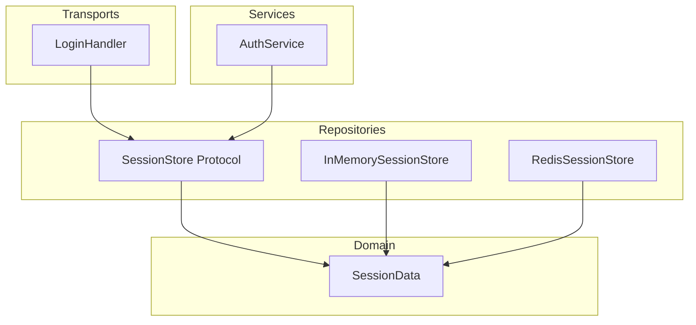

# Design Document: session-store-typing

## Overview

**Purpose**: SessionStore の Protocol インターフェースと実装を型付き `SessionData` dataclass ベースに変更し、利用側の型安全性を確保する。

**Users**: athena 開発者が SessionStore を通じてセッションデータにアクセスする際、`# pyright: ignore` なしで型安全なフィールドアクセスが可能になる。

**Impact**: SessionStore Protocol の配置を `infrastructure/state/` から `repositories/` に移動し、型シグネチャを `dict[str, object]` から `SessionData` に変更する。既存の振る舞いは維持される。

### Goals
- `SessionStore.get()` / `get_by_user()` が `SessionData | None` を返す
- `SessionStore.create()` が `SessionData` を受け取る
- Redis 実装の `_INTERNAL_USER_ID_KEY` ハックを廃止
- 利用側から `# pyright: ignore[reportArgumentType]` を排除
- import-linter レイヤー契約に準拠

### Non-Goals
- `SessionData` のフィールド追加・変更
- TTL 設計の変更
- SessionStore への新メソッド追加
- `refresh()`, `delete()`, `exists()` のシグネチャ変更

## Boundary Commitments

### This Spec Owns
- `SessionStore` Protocol の型シグネチャ変更（`create`, `get`, `get_by_user`）
- Protocol と実装2つ（InMemory / Redis）のレイヤー移動
- Redis 実装の `_INTERNAL_USER_ID_KEY` 除去と Lua スクリプト更新
- 利用側（`AuthService`, `LoginHandler`, `app.py`, `providers.py`）のインポートパスと型キャスト更新
- 既存テストの移行

### Out of Boundary
- `domain/session.py` の `SessionData` dataclass 定義の変更
- `PacketQueue` や `EventBus` 等、SessionStore 以外の Protocol
- セッション TTL やライフサイクルのロジック変更
- `refresh()`, `delete()`, `exists()` の引数・戻り値の変更

### Allowed Dependencies
- `osu_server.domain.session.SessionData` — Protocol の型アノテーション（repositories → domain は import-linter 許可済み）
- `redis.asyncio.Redis` — Redis 実装の内部依存
- `json` stdlib — Redis 実装のシリアライズ/デシリアライズ
- `dataclasses.asdict` — Redis / InMemory 実装内部の変換

### Revalidation Triggers
- `SessionData` のフィールド追加・削除・型変更
- `SessionStore` Protocol へのメソッド追加
- import-linter の layers 定義変更

## Architecture

### Existing Architecture Analysis

現在の SessionStore は `infrastructure/state/` に配置されている:

```
infrastructure/state/
├── interfaces/session_store.py   ← Protocol（dict ベース）
├── memory/session_store.py       ← InMemory 実装
└── redis/session_store.py        ← Redis 実装（_user_id ハック有り）
```

import-linter の layer 定義では `infrastructure` は `domain` より下位にあり、`infrastructure → domain` のインポートは禁止。このため Protocol の型に `SessionData`（domain 層）を使用できない。

一方 `repositories/` は `domain` より上位で、`repositories → domain` は許可済み:

```
layers = [transports, services, repositories, domain, infrastructure, shared]
                                     ↑ repositories は domain より上位
```

### Architecture Pattern & Boundary Map



**Architecture Integration**:
- **Selected pattern**: 既存の Protocol + 実装分離パターンを維持（UserRepository / RoleRepository と同一）
- **Domain boundaries**: SessionStore Protocol が `SessionData` を型として参照するが、ドメインロジックは持たない
- **Existing patterns preserved**: 環境別の DI 切り替え（test → InMemory, else → Redis）
- **Dependency direction**: Repositories → Domain（下方向、import-linter 準拠）

### Technology Stack

| Layer | Choice | Role in Feature | Notes |
|-------|--------|-----------------|-------|
| Domain | `SessionData` dataclass | 型定義 | 変更なし |
| Repositories | Protocol + InMemory + Redis 実装 | インターフェース + 全実装 | 移動 + 型変更 + Lua 更新 |

## File Structure Plan

### Directory Structure

```
src/osu_server/
├── domain/
│   └── session.py                              # 変更なし（SessionData 定義）
├── repositories/
│   ├── interfaces/
│   │   └── session_store.py                    # 移動元: infrastructure/state/interfaces/
│   ├── memory/
│   │   └── session_store.py                    # 移動元: infrastructure/state/memory/
│   └── redis/                                  # 新規ディレクトリ
│       └── session_store.py                    # 移動元: infrastructure/state/redis/
└── infrastructure/
    └── state/
        ├── interfaces/session_store.py         # 削除
        ├── memory/session_store.py             # 削除
        └── redis/session_store.py              # 削除
```

### Modified Files

- `src/osu_server/repositories/interfaces/session_store.py` — Protocol の型を `dict[str, object]` → `SessionData` に変更
- `src/osu_server/repositories/memory/session_store.py` — 内部ストレージを `SessionData` ベースに変更
- `src/osu_server/repositories/redis/session_store.py` — `_INTERNAL_USER_ID_KEY` 廃止、`SessionData(**json.loads())` で復元、Lua スクリプト更新
- `src/osu_server/infrastructure/di/providers.py` — SessionStore の import パス更新
- `src/osu_server/app.py` — SessionStore の import パス更新
- `src/osu_server/services/auth_service.py` — `asdict(session_data)` 除去、`SessionData` を直接渡す、import パス更新
- `src/osu_server/transports/bancho/handlers/login.py` — `int(session["user_id"])` → `session.user_id`、`pyright: ignore` 除去、import パス更新
- `tests/unit/infrastructure/state/test_session_store.py` — import パス更新 + 型変更に対応
- `tests/integration/test_redis_session_store.py` — import パス更新 + 型変更に対応

## System Flows

シンプルな型変更リファクタリングのため、フローの変更はない。既存のセッション作成→取得→利用フローの型シグネチャが変わるだけ。

## Requirements Traceability

| Requirement | Summary | Components | Files |
|-------------|---------|------------|-------|
| 1.1–1.5 | get / get_by_user → SessionData 返却 | SessionStore Protocol, InMemory, Redis | session_store.py ×3 |
| 2.1–2.3 | create → SessionData 入力 | SessionStore Protocol, InMemory, Redis, AuthService | session_store.py ×3, auth_service.py |
| 3.1–3.3 | _INTERNAL_USER_ID_KEY 廃止 | RedisSessionStore | redis/session_store.py |
| 4.1–4.4 | レイヤー移動 | 全 SessionStore ファイル | session_store.py ×3（移動） |
| 5.1–5.3 | pyright: ignore 排除 | LoginHandler, 利用側全般 | login.py, auth_service.py |
| 6.1–6.3 | 既存動作の維持 | テストスイート全体 | test_*.py |

## Components and Interfaces

| Component | Layer | Intent | Req Coverage | Key Dependencies | Contracts |
|-----------|-------|--------|--------------|------------------|-----------|
| SessionStore Protocol | Repositories | セッション CRUD の抽象インターフェース | 1, 2, 4 | SessionData (P0) | Service |
| InMemorySessionStore | Repositories | テスト用の dict ベース実装 | 1, 2, 6 | SessionData (P0) | Service |
| RedisSessionStore | Repositories | 本番用の Redis ベース実装 | 1, 2, 3, 6 | SessionData (P0), Redis (P0) | Service, State |

### Repositories Layer

#### SessionStore Protocol

| Field | Detail |
|-------|--------|
| Intent | セッションの CRUD 操作を抽象化する Protocol |
| Requirements | 1.1–1.5, 2.1–2.3, 4.1–4.2 |

**Responsibilities & Constraints**
- `create`, `get`, `get_by_user`, `delete`, `exists`, `refresh` の6メソッドを定義
- `create` と `get` / `get_by_user` の型を `SessionData` に変更
- `delete`, `exists`, `refresh` は変更なし

**Contracts**: Service [x]

##### Service Interface

```python
from osu_server.domain.session import SessionData

@runtime_checkable
class SessionStore(Protocol):
    async def create(self, user_id: int, token: str, data: SessionData) -> None: ...
    async def get(self, token: str) -> SessionData | None: ...
    async def get_by_user(self, user_id: int) -> SessionData | None: ...
    async def delete(self, token: str) -> None: ...
    async def exists(self, token: str) -> bool: ...
    async def refresh(self, token: str) -> bool: ...
```

- Preconditions: `user_id` > 0, `token` は非空文字列
- Postconditions: `get()` は `create()` 時に渡した `SessionData` と同一フィールド値を返す
- Invariants: 同一 user_id に対して最大1セッション

#### InMemorySessionStore

| Field | Detail |
|-------|--------|
| Intent | テスト環境用の辞書ベース SessionStore 実装 |
| Requirements | 1.1–1.5, 2.1–2.3, 6.1–6.3 |

**Responsibilities & Constraints**
- 内部ストレージを `dict[str, SessionData]` に変更（`_by_token`）
- `create()` は `SessionData` をそのまま保存
- `get()` / `get_by_user()` は `SessionData` のコピーを返す（`dataclasses.replace()` 使用）

**Implementation Notes**
- `dict(data)` によるコピーは不要になる（`SessionData` は `slots=True` のため dict ではない）
- コピー戦略: `dataclasses.replace(data)` でシャローコピー（全フィールドがプリミティブなので十分）

#### RedisSessionStore

| Field | Detail |
|-------|--------|
| Intent | 本番環境用の Redis ベース SessionStore 実装 |
| Requirements | 1.1–1.5, 2.1–2.3, 3.1–3.3, 6.1–6.3 |

**Responsibilities & Constraints**
- `create()`: `asdict(data)` で JSON シリアライズ。`_user_id` 内部キーを追加せず `data.user_id` を使用
- `get()` / `get_by_user()`: `json.loads()` → `SessionData(**d)` で復元
- Lua スクリプト: `_user_id` 参照を `user_id` に変更

**Contracts**: Service [x] / State [x]

##### State Management
- **Key patterns**:
  - `{prefix}session:{token}` → JSON（`SessionData` の全フィールド）
  - `{prefix}user_session:{user_id}` → token 文字列
- **変更点**: JSON に `_user_id` が含まれなくなるが、`user_id` フィールドは `SessionData` に含まれているため逆引きに使用可能
- **Lua スクリプト更新**: `ARGV` の内部キーフィールド名参照を `user_id` に変更

**Implementation Notes**
- `_INTERNAL_USER_ID_KEY` 定数とそれに関連する `pop()` / 追加処理を全て削除
- `get()` の戻り値から内部キーを除去する処理が不要になる

## Data Models

### Domain Model

`SessionData`（変更なし、参照のみ）:

```python
@dataclass(slots=True)
class SessionData:
    user_id: int
    username: str
    privileges: int
    country: str
    osu_version: str
    utc_offset: int
    display_city: bool
    client_hashes: str
    pm_private: bool
```

全フィールドが JSON プリミティブ型（`int`, `str`, `bool`）であるため、`json.dumps(asdict(data))` ↔ `SessionData(**json.loads(raw))` の双方向変換が無変換で成立する。

### Physical Data Model

Redis キー構造の変更:

| Key | Before | After |
|-----|--------|-------|
| `session:{token}` | `{"user_id": 1, "username": "...", ..., "_user_id": 1}` | `{"user_id": 1, "username": "...", ...}` |
| `user_session:{user_id}` | 変更なし | 変更なし |

`_user_id` 内部キーが消え、`user_id` は `SessionData` の正規フィールドとして存在。

## Error Handling

型変更に伴う新規エラーパスはない。既存のエラーハンドリング（セッション未発見 → `None` 返却、Redis 接続エラー → 例外伝播）はそのまま維持。

`SessionData(**json.loads(raw))` で予期しないキーがあった場合は `TypeError` が発生するが、これはデータ破損を示すため例外伝播が適切。

## Testing Strategy

### Unit Tests
- SessionStore Protocol の型変更後に InMemorySessionStore が `SessionData` を正しく保存・返却する
- `create()` → `get()` で同一フィールド値の `SessionData` が返る
- `get_by_user()` で同一フィールド値の `SessionData` が返る
- `get()` の戻り値が元オブジェクトのコピーであること（mutation isolation）

### Integration Tests
- RedisSessionStore が `SessionData` を JSON 経由で正しくラウンドトリップする
- `_user_id` 内部キーが JSON に含まれないこと
- 既存の全テストケース（overwrite、TTL refresh、delete）がパスする

### Type Safety Tests
- `basedpyright` が SessionStore 関連ファイルで型エラーを報告しないこと
- `import-linter` がレイヤー違反を報告しないこと
