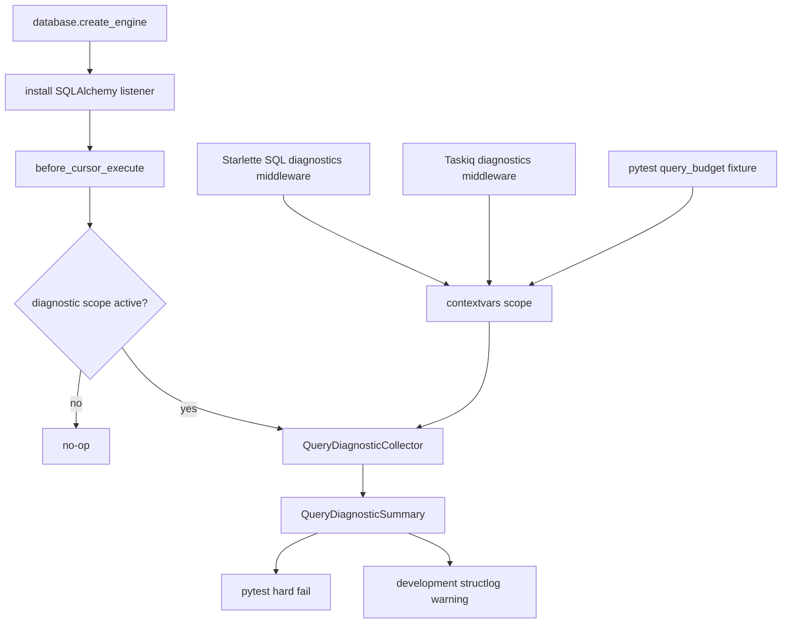
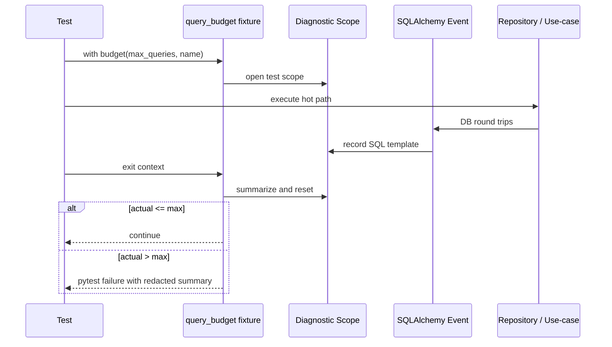
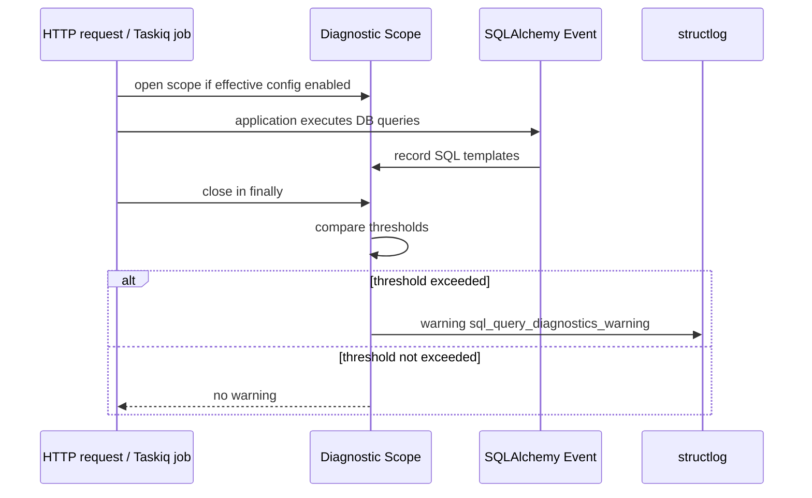

# Design Document

## Overview

この feature は Athena の SQL 発行数を test と development runtime の両方で検知する。SQLAlchemy event から cursor execute を共通 collector に記録し、pytest は明示 budget 超過を hard fail、Starlette request と Taskiq job は development 環境で warning log を出す。

対象ユーザーは Athena を実装・運用する開発者である。SQL 最適化そのものではなく、replay download、score submission、worker job などの hot path が気づかないうちに query 数を増やすことを防ぐ。

### Goals

- SQL 発行数の測定 semantics を test と runtime で統一する。
- Integration test の opt-in budget で regression を CI / local test から検知する。
- Development runtime の HTTP request / Taskiq job で Rails Bullet 的な warning を出す。
- SQL params や credential / blob / replay payload を出さない。

### Non-Goals

- SQL query の最適化や repository rewrite をこの spec で実施しない。
- 外部 profiler、dashboard、OpenTelemetry、metrics exporter は追加しない。
- Production runtime warning は初期実装では有効化しない。
- ORM relationship lazy-load の完全な N+1 判定は扱わない。

## Boundary Commitments

### This Spec Owns

- SQLAlchemy cursor execute event を記録する query diagnostics collector。
- contextvars による diagnostic scope lifecycle。
- pytest query budget fixture と failure summary。
- Starlette request / Taskiq job の development warning scope。
- AppConfig の runtime diagnostics 設定。
- Redacted normalized SQL template prefix と fingerprint の出力 contract。

### Out of Boundary

- repository / service の query rewrite。
- DB schema migration。
- Production observability pipeline。
- OpenTelemetry instrumentation。
- Stable / lazer protocol behavior。
- `relationship()` lazy-load detector。

### Allowed Dependencies

- Python standard library: `contextvars`, `dataclasses`, `hashlib`, `re`, `contextlib`, `weakref`。
- Existing dependencies: SQLAlchemy async engine/event system, Starlette middleware, Taskiq broker integration, structlog, pytest.
- Existing AppConfig and Dishka provider graph.

### Revalidation Triggers

- SQLAlchemy engine creation path or async engine version changes.
- Taskiq middleware API changes.
- Request middleware order changes that affect Dishka/request logging.
- Config environment semantics changes.
- Production observability requirements requiring metrics/tracing export.

## Architecture

### Existing Architecture Analysis

- DB engine creation is centralized in `src/osu_server/infrastructure/database/engine.py`.
- App and worker both receive `AsyncEngine` through `InfrastructureProviderSet`.
- Starlette middleware is composed in `src/osu_server/composition/application.py`.
- Taskiq worker setup is centralized in `src/osu_server/worker.py` and `src/osu_server/composition/taskiq_integration.py`.
- Global pytest fixtures live in `tests/conftest.py`.
- Services, transports, and jobs must not import SQLAlchemy sessions, models, or low-level DB infrastructure just to support diagnostics.

### Architecture Pattern & Boundary Map

Selected pattern: event-source collector with scoped consumers. SQLAlchemy event instrumentation records into the currently active diagnostic scope only. Consumers decide what to do with the summary at scope exit.



### Technology Stack

| Layer | Choice / Version | Role in Feature | Notes |
| --- | --- | --- | --- |
| Backend / Services | Python 3.14+ | collector, context manager, tests | No domain dependency |
| Runtime | Starlette | request diagnostic scope | Composition-owned middleware |
| Jobs | Taskiq | job diagnostic scope | Broker/integration-owned wrapper |
| Data / Storage | SQLAlchemy 2 async | cursor execute event source | Attach to sync engine behind AsyncEngine |
| Observability | structlog | development warning output | No params |
| Tests | pytest + pytest-asyncio | hard-fail budget and focused tests | Opt-in fixture |

## File Structure Plan

### Directory Structure

```text
src/osu_server/
├── infrastructure/
│   └── database/
│       ├── engine.py                     # install diagnostics on created async engines
│       └── query_diagnostics.py          # collector, scope, SQL normalization, event listener
└── composition/
    ├── application.py                    # add SQL diagnostics middleware with config
    ├── middleware.py                     # HTTP request diagnostics middleware or exports
    └── taskiq_integration.py             # Taskiq diagnostics middleware/wrapper

tests/
├── conftest.py                           # query_budget fixture
├── unit/
│   ├── infrastructure/
│   │   └── test_query_diagnostics.py     # collector, normalization, redaction, listener tests
│   └── composition/
│       └── test_query_diagnostics.py     # HTTP/Taskiq warning behavior
└── integration/
    ├── test_sqlalchemy_replay_download_query_repository.py
    └── test_score_submission_integration.py
```

### Modified Files

- `src/osu_server/config.py` - Add query diagnostics settings and validation.
- `src/osu_server/infrastructure/database/engine.py` - Install event listener on each created engine.
- `src/osu_server/composition/application.py` - Wire HTTP diagnostics middleware with AppConfig-derived behavior.
- `src/osu_server/composition/middleware.py` - Add or export request scope middleware while preserving existing request logging.
- `src/osu_server/composition/taskiq_integration.py` - Install job diagnostic scope once per broker.
- `src/osu_server/worker.py` - Pass worker config to Taskiq diagnostics integration if needed.
- `tests/conftest.py` - Add opt-in query budget fixture.
- Selected integration tests - Wrap only measured hot path sections, not setup/cleanup.

## System Flows

### Test Budget Flow



### Development Runtime Warning Flow



## Requirements Traceability

| Requirement | Summary | Components | Interfaces | Flows |
| --- | --- | --- | --- | --- |
| 1.1 | Cursor execute count | SQLAlchemy listener, collector | `install_query_diagnostics` | Test/runtime |
| 1.2 | SQL normalization without params | collector | `QueryDiagnosticRecord` | Test/runtime |
| 1.3 | duplicate threshold | collector summary | `QueryDiagnosticSummary` | Test/runtime |
| 1.4 | no active scope no accumulation | contextvars scope | `current_query_diagnostic_scope` | Test/runtime |
| 1.5 | total round trips | SQLAlchemy listener | cursor event | Test/runtime |
| 2.1 | test hard fail | pytest fixture | `query_budget` | Test budget |
| 2.2 | failure summary | pytest fixture, summary formatter | assertion message | Test budget |
| 2.3 | opt-in only | pytest fixture | context manager | Test budget |
| 2.4 | hot path budgets | selected integration tests | `query_budget` | Test budget |
| 2.5 | DB skip safety | integration fixture wrapping | pytest skip preserved | Test budget |
| 3.1 | HTTP development scope | Starlette middleware | AppConfig | Runtime warning |
| 3.2 | HTTP warning | middleware + logger | `sql_query_diagnostics_warning` | Runtime warning |
| 3.3 | Taskiq development scope | Taskiq integration | AppConfig | Runtime warning |
| 3.4 | Taskiq warning | Taskiq middleware/wrapper | `sql_query_diagnostics_warning` | Runtime warning |
| 3.5 | disabled outside dev | AppConfig effective enable | config fields | Runtime warning |
| 4.1 | no params | collector | summary fields | All |
| 4.2 | no secrets / payloads | summary formatter | redacted output | All |
| 4.3 | prefix + fingerprint | collector summary | redacted SQL template | All |
| 4.4 | logging does not mask app errors | scope close safeguards | `finally` behavior | Runtime warning |
| 4.5 | production disabled default | AppConfig | effective enabled state | Runtime warning |
| 5.1 | config settings | AppConfig | settings fields / validation | Runtime warning |
| 5.2 | layer boundaries | infrastructure + composition | file placement | All |
| 5.3 | no service/transport leakage | no imports across boundaries | import-linter / review | All |
| 5.4 | exporter independence | local collector | replaceable component | Future |
| 5.5 | positive thresholds | AppConfig validators | validation error | Config |

## Components and Interfaces

### Infrastructure

#### Query Diagnostics Collector

| Field | Detail |
| --- | --- |
| Intent | Active scope 内の SQL cursor execute を記録して summary を作る |
| Requirements | 1.1, 1.2, 1.3, 1.4, 1.5, 4.1, 4.2, 4.3, 5.4 |

**Responsibilities & Constraints**

- Contextvar に保持された active scope にだけ SQL event を記録する。
- SQL params は受け取っても保存しない。
- SQL text は whitespace collapse し、prefix と fingerprint だけを summary に出す。
- Duplicate は normalized SQL template を key にして集計する。
- Event listener は idempotent に install する。

**Service Interface**

```python
@dataclass(slots=True, frozen=True)
class QueryDiagnosticSummary:
    scope_kind: str
    scope_name: str
    total_queries: int
    duplicate_queries: tuple[DuplicateQuerySummary, ...]

def install_query_diagnostics(engine: AsyncEngine) -> None: ...

@contextmanager
def query_diagnostic_scope(
    *,
    scope_kind: str,
    scope_name: str,
    duplicate_threshold: int,
) -> Iterator[QueryDiagnosticCollector]: ...
```

Preconditions:

- `duplicate_threshold` は 1 以上。
- Engine は SQLAlchemy `AsyncEngine`。

Postconditions:

- Scope exit 後は contextvar token が reset される。
- No active scope の SQL event は記録されない。

#### SQL Diagnostics Runtime Warning

| Field | Detail |
| --- | --- |
| Intent | Summary が threshold を超えた場合だけ development warning を出す |
| Requirements | 3.1, 3.2, 3.3, 3.4, 3.5, 4.4, 4.5, 5.1 |

**Responsibilities & Constraints**

- AppConfig の effective enabled state、max queries、duplicate threshold を使う。
- Logger event name は `sql_query_diagnostics_warning`。
- Warning fields は `scope_kind`, `scope_name`, `total_queries`, `max_queries`, `duplicates` を基本にする。
- Warning emission failure は suppress し、request/job の結果を変えない。

### Composition

#### Starlette SQL Query Diagnostics Middleware

| Field | Detail |
| --- | --- |
| Intent | HTTP request ごとに diagnostic scope を開閉する |
| Requirements | 3.1, 3.2, 3.5, 4.4, 5.2, 5.3 |

**Responsibilities & Constraints**

- `scope_kind="http_request"`、`scope_name="<METHOD> <path>"` を使う。
- `RequestLoggingMiddleware` の既存 `http_request` event とは別 event として warning を出す。
- `/health` の warning suppression は既存 request log と合わせるか、threshold 未満なら自然に出ない状態にする。

#### Taskiq SQL Query Diagnostics Integration

| Field | Detail |
| --- | --- |
| Intent | Taskiq job ごとに diagnostic scope を開閉する |
| Requirements | 3.3, 3.4, 3.5, 4.4, 5.2, 5.3 |

**Responsibilities & Constraints**

- `scope_kind="taskiq_job"`、`scope_name` は task name を使う。
- Broker に重複 install しない。
- Job adapter 関数には診断責務を追加しない。
- Taskiq middleware API が型安全に扱えない場合は、最小 wrapper と局所的な理由コメントで対応する。

### Tests

#### Query Budget Fixture

| Field | Detail |
| --- | --- |
| Intent | Test hot path の query count を hard fail する |
| Requirements | 2.1, 2.2, 2.3, 2.4, 2.5 |

**Service Interface**

```python
class QueryBudget(Protocol):
    def __call__(self, *, max_queries: int, name: str) -> ContextManager[None]: ...
```

**Responsibilities & Constraints**

- Fixture を使用した test だけ budget を適用する。
- Failure message に params や raw values を含めない。
- Setup/cleanup は budget scope の外側に置けるようにする。
- Baseline 測定後に small margin を入れた budget を設定する。

## Data Models

Persistent data model changes are not required.

### In-Memory Diagnostic Models

```python
@dataclass(slots=True, frozen=True)
class DuplicateQuerySummary:
    fingerprint: str
    count: int
    sql_prefix: str

@dataclass(slots=True, frozen=True)
class QueryDiagnosticSummary:
    scope_kind: str
    scope_name: str
    total_queries: int
    duplicate_queries: tuple[DuplicateQuerySummary, ...]
```

## Error Handling

### Error Strategy

- SQLAlchemy event handler must be defensive and avoid raising into DB execution.
- Scope close must reset contextvars in `finally`.
- Runtime warning emission must not mask the request/job outcome.
- Test budget failure is intentional and should raise pytest assertion/failure with a redacted summary.
- Config validation errors should fail startup/config load for invalid positive thresholds.

### Monitoring

- Development warnings use `structlog` event `sql_query_diagnostics_warning`.
- The event does not include SQL params.
- Production runtime warning is disabled by default.

## Testing Strategy

### Unit Tests

- SQL normalization collapses whitespace, preserves placeholders, and does not include params.
- Duplicate summary groups identical normalized templates and returns stable fingerprints.
- Event listener records cursor executions only inside active scope.
- Scope reset prevents query leakage between two scopes.
- AppConfig effective enabled behavior defaults to development and validates thresholds.

### Composition Tests

- HTTP middleware emits warning in development when max query threshold is exceeded.
- HTTP middleware emits no warning when disabled or environment is not development.
- Taskiq diagnostics integration emits warning for a SQL-emitting job scope in development.
- Taskiq diagnostics integration does not add duplicate middleware/wrappers when setup runs twice.

### Integration Tests

- Replay download query repository hot path uses an explicit query budget.
- Score submission integration hot path uses explicit query budgets around the submission path, not setup/cleanup.
- Database unavailable skips remain skips.

### Quality Checks

- `uv run pytest` targeted unit/integration tests for diagnostics.
- `uv run ruff check` / `uv run basedpyright` for touched files.
- `./scripts/ci.sh quality` before final PR readiness if runtime and test changes are broad.

## Security Considerations

- SQL params are never stored in collector records.
- Warning and test failure output include normalized SQL prefix and fingerprint only.
- Scope names must avoid raw query strings; HTTP scope uses method + path, not full URL.
- Blob storage paths, replay payloads, credential values, password hashes, emails, and raw user input must not appear in diagnostic output.

## Performance & Scalability

- Event listener does a no-op when no diagnostic scope is active.
- Active scope collection stores normalized SQL templates and counts for a single request/job/test scope only.
- The feature is not a production profiler. Production metrics/tracing should be designed separately if needed.
