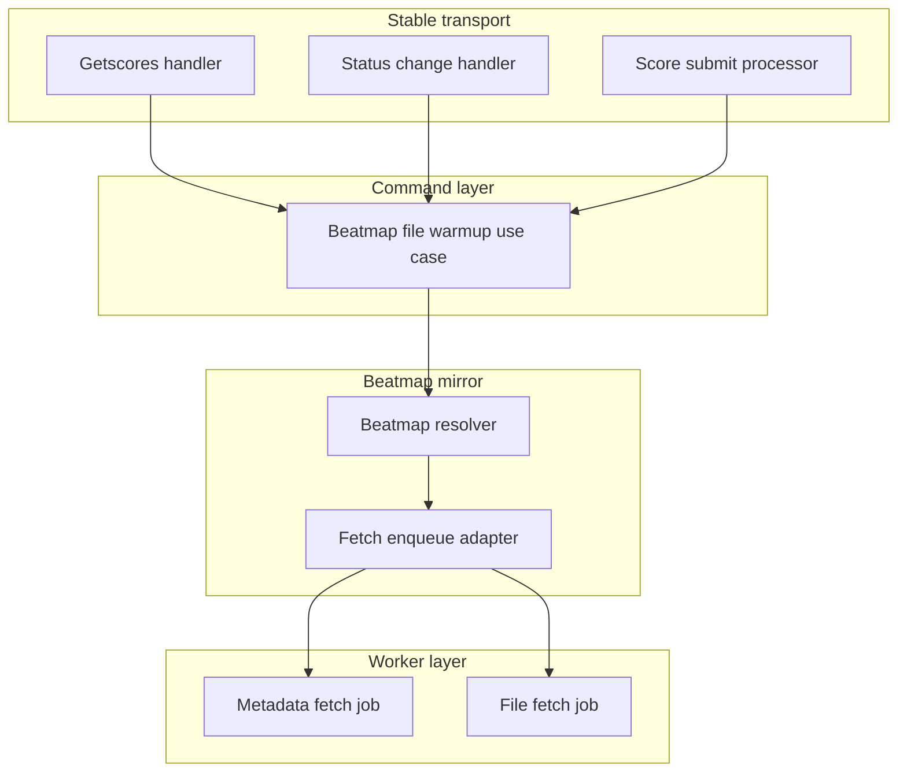
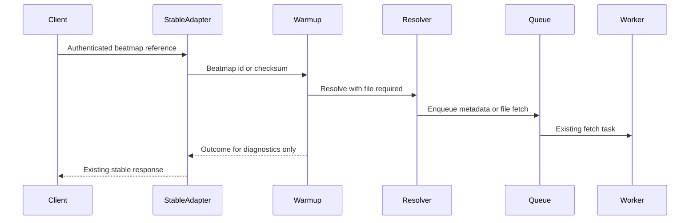
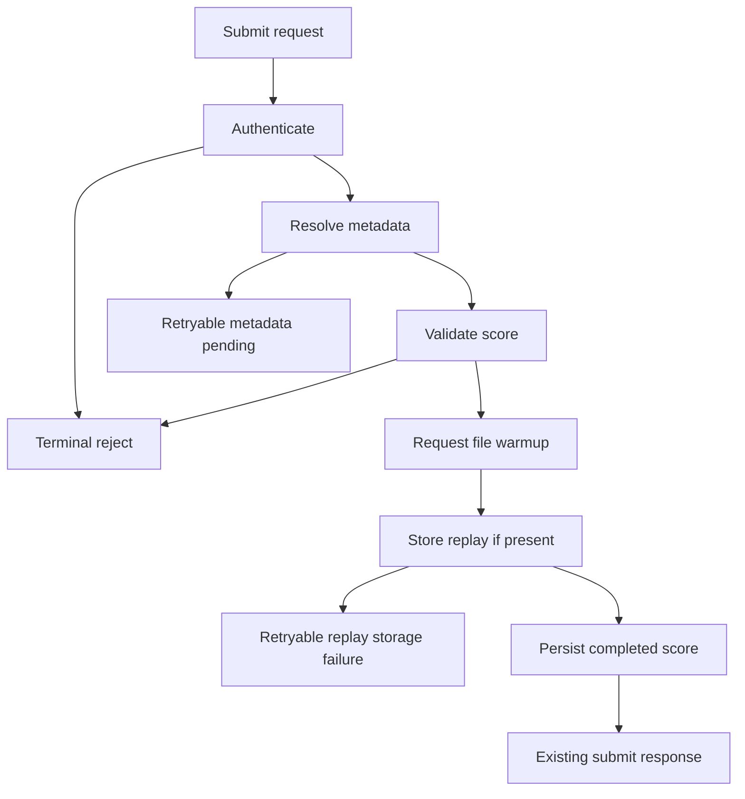

# Design Document

## Overview

stable-beatmap-file-warmup は、stable client が beatmap を参照する既存 flow に Beatmap File Warmup の副作用を追加し、後続の score submission と Performance Calculation が `.osu` file availability 待ちになりにくい状態を作ります。対象 user は stable client player と operator です。

この設計は、既存の stable response body、packet dispatch、score submission outcome を変えずに、認証済みの `getscores`、`STATUS_CHANGE`、score submit fallback から既存 beatmap-mirror の file fetch queue へ接続します。PP 計算、leaderboard、score state、beatmap provider 実装、blob storage backend は所有しません。

### Goals

- stable の 3 入口から認証済み beatmap reference を non-blocking に Beatmap File Warmup へ変換する。
- warmup の requested / already available / skipped / failed を operator-visible diagnostics に残す。
- stable client に見える response body、packet behavior、score submission idempotency を維持する。

### Non-Goals

- PP、star rating、leaderboard、user stats、rank projection の計算または更新。
- beatmap metadata provider、`.osu` file provider、blob storage backend、worker task 名の変更。
- stable response body への warmup state 追加。
- lazer、WebUI、admin API からの warmup 操作。
- `STATUS_CHANGE` による presence broadcast や online status projection の実装。

## Boundary Commitments

### This Spec Owns

- stable `GET /web/osu-osz2-getscores.php`、stable `STATUS_CHANGE` packet、stable score submit fallback からの Beatmap File Warmup request orchestration。
- `RequestBeatmapFileWarmupUseCase` の typed input / result contract。
- warmup entrance、beatmap identity、outcome、skip/failure reason の structured diagnostics。
- stable transport integration が warmup failure を client-visible failure に変換しないための compatibility contract。

### Out of Boundary

- Beatmap File の実取得、検証、blob attachment 永続化。これは既存 beatmap-mirror と `fetch_beatmap_file` worker が所有します。
- beatmap metadata resolution の provider choice、HTTP client、mirror fallback policy。
- score acceptance、duplicate online checksum、duplicate replay checksum、leaderboard projection、Performance Calculation readiness の source of truth。
- presence-status domain の durable state、status broadcast、online user projection。

### Allowed Dependencies

- `RequestBeatmapFileWarmupUseCase` は beatmap context の command use-case として、`BeatmapFileWarmupResolver` Protocol 越しに `BeatmapMirrorService` 相当の resolver を利用できます。
- stable web legacy handler と bancho handler は transport adapter として warmup use-case を呼び出せます。
- score submission command は terminal validation 通過後かつ replay blob storage 前の fallback preparation として warmup use-case を呼び出せます。
- composition provider は Dishka で concrete dependencies を接続します。
- worker queue は既存 `fetch_beatmap_file` / `fetch_beatmap_metadata` task を利用し、新しい queue や task name は追加しません。

### Revalidation Triggers

- `BeatmapResolveOptions`, `BeatmapResolveResult`, `BeatmapFileState`, `BeatmapFetchState` の contract が変わる場合。
- `fetch_beatmap_file` task 名、target shape、idempotency semantics が変わる場合。
- getscores response format、score submit outcome mapping、duplicate replay / online checksum behavior が変わる場合。
- future `presence-status` が `STATUS_CHANGE` handler を所有する場合。
- score-pp-calculation が Beatmap File availability の source of truth を変更する場合。

## Architecture

### Existing Architecture Analysis

Athena は layered modular monolith と command/query split を採用しています。Beatmap File の取得は既に beatmap-mirror と worker job に分離され、app process は `BeatmapMirrorService` の enqueue callback から taskiq job を投入します。

現状の gap は file fetch capability ではなく、stable 入口からその capability を安全に呼び出す orchestration です。`BeatmapScoreListingQuery` は read-only query として設計されているため、getscores warmup は query use-case ではなく transport handler から command-style warmup use-case へ接続します。score submission は既に `BeatmapMirrorService` を resolver Protocol として利用しているため、fallback warmup も concrete repository へは依存しません。

### Architecture Pattern & Boundary Map

Selected pattern: **thin stable adapters + beatmap command use-case + existing async fetch queue**。



Key decisions:

- stable wire parsing remains in stable transport packages.
- Beatmap File Warmup orchestration is centralized in one use-case so diagnostics and skip semantics do not diverge by entrance.
- getscores and `STATUS_CHANGE` do not add synchronous wait. score submit keeps its existing metadata bounded wait and ignores file warmup result for score outcome.
- checksum-only unknown requests may enqueue metadata and return `metadata_pending`; file fetch starts only when a beatmap id is known.

### Technology Stack

| Layer | Choice / Version | Role in Feature | Notes |
| --- | --- | --- | --- |
| Backend / Services | Python 3.14 dataclasses and Protocols | typed warmup request/result and resolver boundary | No new dependency |
| Transport | Starlette stable web legacy, Caterpillar bancho packet types | existing getscores endpoint and `STATUS_CHANGE` decode | Response body and packet dispatch behavior remain compatible |
| Messaging / Jobs | taskiq + existing broker integration | reuse `fetch_beatmap_metadata` and `fetch_beatmap_file` jobs | No new task name |
| Data / Storage | Existing beatmap repositories and blob attachment tables | read current file state through resolver | No schema change |
| Observability | structlog existing pattern | warmup outcome diagnostics | Credentials and raw payloads are not logged |

## File Structure Plan

### Directory Structure

```text
src/osu_server/
├── services/
│   └── commands/
│       ├── beatmaps/
│       │   ├── __init__.py
│       │   └── file_warmup.py
│       └── scores/
│           └── process_submission.py
├── transports/
│   └── stable/
│       ├── bancho/
│       │   └── handlers/
│       │       ├── __init__.py
│       │       └── status.py
│       └── web_legacy/
│           └── getscores.py
└── composition/
    └── providers/
        ├── beatmaps_app.py
        ├── score_submission.py
        ├── stable_bancho.py
        └── stable_web_legacy.py

tests/
├── unit/
│   ├── services/
│   │   └── commands/
│   │       └── beatmaps/
│   │           └── test_file_warmup.py
│   └── transports/
│       └── bancho/
│           └── test_status_handlers.py
├── integration/
│   ├── test_getscores_diagnostics.py
│   └── transports/
│       └── web_legacy/
│           └── test_score_submit_e2e.py
└── e2e/
    └── test_beatmap_file_resolution.py
```

### New Files

- `src/osu_server/services/commands/beatmaps/file_warmup.py` — owns `RequestBeatmapFileWarmupUseCase`, input/result dataclasses, outcome enum, entrance enum, resolver Protocol, and diagnostics logging.
- `src/osu_server/transports/stable/bancho/handlers/status.py` — owns `STATUS_CHANGE` payload decode and maps `StatusUpdate` to warmup request without implementing presence state.
- `tests/unit/services/commands/beatmaps/test_file_warmup.py` — verifies identity validation, resolver option use, outcome mapping, exception-to-failure diagnostics, and no fetch for malformed identity.
- `tests/unit/transports/bancho/test_status_handlers.py` — verifies `STATUS_CHANGE` id/checksum/no-identity/decode-failure handling and no disconnect-causing exception.

### Modified Files

- `src/osu_server/services/commands/beatmaps/__init__.py` — exports warmup use-case contracts.
- `src/osu_server/services/commands/scores/process_submission.py` — accepts optional warmup dependency and invokes score submit fallback after score terminal validation succeeds and before replay blob storage or completed score mutation.
- `src/osu_server/composition/providers/beatmaps_app.py` — provides `RequestBeatmapFileWarmupUseCase` using app-side `BeatmapMirrorService`.
- `src/osu_server/composition/providers/score_submission.py` — injects warmup use-case into `ProcessScoreSubmissionUseCase`.
- `src/osu_server/composition/providers/stable_web_legacy.py` — injects warmup use-case into `GetscoresHandler`.
- `src/osu_server/transports/stable/web_legacy/getscores.py` — calls warmup after authentication and parse handling while preserving all existing response branches.
- `src/osu_server/composition/providers/stable_bancho.py` — provides `StatusChangeHandlers` and registers it with `PacketDispatcher`.
- `src/osu_server/transports/stable/bancho/handlers/__init__.py` — exports `StatusChangeHandlers`.
- `tests/unit/composition/test_common_provider_graph.py` and related DI tests — assert warmup use-case and status handler are resolved and registered.
- `tests/integration/test_getscores_diagnostics.py` — adds warmup diagnostics assertions and credential redaction checks.
- `tests/integration/test_getscores_endpoint.py` — verifies getscores response bodies stay unchanged while warmup is requested.
- `tests/unit/services/test_score_submission_service.py` — verifies fallback warmup does not alter accepted, retryable, terminal reject, duplicate online checksum, or duplicate replay checksum behavior.

## System Flows

### Stable Warmup Flow



Flow decisions:

- auth failure stops before warmup.
- malformed or missing identity returns a skip result and never enqueues fetch work.
- file availability does not become a client-visible state.

### Score Submit Fallback Placement



Warmup does not affect the selected score submission outcome. It runs after authentication, beatmap resolution, eligibility, empty replay, and hit validation pass, but before replay blob storage so retryable replay storage failures still get fallback preparation.

## Requirements Traceability

| Requirement | Summary | Components | Interfaces | Flows |
| --- | --- | --- | --- | --- |
| 1.1 | supported entrance references request warmup | `RequestBeatmapFileWarmupUseCase`, transport integrations | `BeatmapFileWarmupRequest` | Stable Warmup Flow |
| 1.2 | available file is successful no-op | `RequestBeatmapFileWarmupUseCase` | `BeatmapFileWarmupResult.already_available` | Stable Warmup Flow |
| 1.3 | repeated warmup converges | `RequestBeatmapFileWarmupUseCase`, existing fetch queue | resolver idempotency through existing fetch records | Stable Warmup Flow |
| 1.4 | unidentified beatmap skips without reject | `RequestBeatmapFileWarmupUseCase`, `StatusChangeHandlers`, `GetscoresHandler` | `skipped_no_identity` | Stable Warmup Flow |
| 1.5 | no PP, score, leaderboard, response state update | Boundary commitments, score fallback placement | no persistence contract | Score Submit Fallback Placement |
| 2.1 | authenticated getscores with identity requests warmup | `GetscoresHandler`, `RequestBeatmapFileWarmupUseCase` | parsed checksum or resolved header id | Stable Warmup Flow |
| 2.2 | auth failure does not warmup | `GetscoresHandler` | auth gate before warmup | Stable Warmup Flow |
| 2.3 | parse failure does not request fetch work | `GetscoresHandler`, `RequestBeatmapFileWarmupUseCase` | `skipped_malformed_identity` | Stable Warmup Flow |
| 2.4 | known-header response unchanged | `GetscoresHandler` | existing formatter contract | Stable Warmup Flow |
| 2.5 | unavailable and update response unchanged | `GetscoresHandler` | existing formatter contract | Stable Warmup Flow |
| 2.6 | warmup failure preserves getscores outcome | `GetscoresHandler`, `RequestBeatmapFileWarmupUseCase` | `failed` result logged only | Stable Warmup Flow |
| 3.1 | status with beatmap id requests warmup | `StatusChangeHandlers` | `BeatmapFileWarmupRequest.beatmap_id` | Stable Warmup Flow |
| 3.2 | status checksum fallback requests warmup when resolvable | `StatusChangeHandlers`, `RequestBeatmapFileWarmupUseCase` | `BeatmapFileWarmupRequest.checksum_md5` | Stable Warmup Flow |
| 3.3 | status without beatmap skips | `StatusChangeHandlers`, `RequestBeatmapFileWarmupUseCase` | `skipped_no_identity` | Stable Warmup Flow |
| 3.4 | repeated status does not conflict | `RequestBeatmapFileWarmupUseCase`, resolver idempotency | existing fetch pending behavior | Stable Warmup Flow |
| 3.5 | status warmup failure does not disconnect | `StatusChangeHandlers`, `PollingWorkflow` | handler catches decode and warmup failures | Stable Warmup Flow |
| 4.1 | score submit fallback requests missing file | `ProcessScoreSubmissionUseCase`, `RequestBeatmapFileWarmupUseCase` | resolved beatmap id input | Score Submit Fallback Placement |
| 4.2 | available file requires no extra fetch | `RequestBeatmapFileWarmupUseCase` | `already_available` | Score Submit Fallback Placement |
| 4.3 | terminal reject is not converted | `ProcessScoreSubmissionUseCase` | warmup result ignored for outcome | Score Submit Fallback Placement |
| 4.4 | accepted score is not rejected for pending file | `ProcessScoreSubmissionUseCase` | warmup result ignored for outcome | Score Submit Fallback Placement |
| 4.5 | fallback failure preserves score outcome and logs | `ProcessScoreSubmissionUseCase`, `RequestBeatmapFileWarmupUseCase` | `failed` result logged only | Score Submit Fallback Placement |
| 5.1 | unauthenticated entrance does not warmup | stable auth gates, polling session lookup | no warmup call without user id | Stable Warmup Flow |
| 5.2 | malformed identity does not fetch | `RequestBeatmapFileWarmupUseCase`, transport mappers | checksum and id validation | Stable Warmup Flow |
| 5.3 | repeated activity is idempotent | `RequestBeatmapFileWarmupUseCase`, fetch queue | existing pending fetch convergence | Stable Warmup Flow |
| 5.4 | failures do not leak secrets or raw payloads | diagnostics policy | sanitized log fields | Stable Warmup Flow |
| 5.5 | unauthenticated stable traffic cannot trigger warmup | stable auth gates | no unauthenticated service input | Stable Warmup Flow |
| 6.1 | getscores diagnostics expose entrance and identity | `RequestBeatmapFileWarmupUseCase`, `GetscoresHandler` | structured log event | Stable Warmup Flow |
| 6.2 | status diagnostics expose entrance and identity | `RequestBeatmapFileWarmupUseCase`, `StatusChangeHandlers` | structured log event | Stable Warmup Flow |
| 6.3 | score submit diagnostics expose entrance and identity | `RequestBeatmapFileWarmupUseCase`, `ProcessScoreSubmissionUseCase` | structured log event | Score Submit Fallback Placement |
| 6.4 | already available skip reason visible | `RequestBeatmapFileWarmupUseCase` | `already_available` log | Stable Warmup Flow |
| 6.5 | no usable identity skip reason visible | `RequestBeatmapFileWarmupUseCase` | `skipped_no_identity` log | Stable Warmup Flow |
| 6.6 | failure reason visible without response change | `RequestBeatmapFileWarmupUseCase`, transport integrations | `failed` log | Stable Warmup Flow |
| 7.1 | getscores auth parse status response preserved | `GetscoresHandler` | existing formatter contract | Stable Warmup Flow |
| 7.2 | packet parsing and dispatch preserved | `StatusChangeHandlers`, `PacketDispatcher` | handler registration only | Stable Warmup Flow |
| 7.3 | score idempotency and duplicate behavior preserved | `ProcessScoreSubmissionUseCase`, `SubmitScoreUseCase` | warmup outside durable duplicate checks | Score Submit Fallback Placement |
| 7.4 | warmup is not PP readiness source | Boundary commitments | no PP state contract | Stable Warmup Flow |
| 7.5 | stable bodies hide internal fetch state | transport integrations | response formatters unchanged | Stable Warmup Flow |

## Components and Interfaces

| Component | Domain / Layer | Intent | Req Coverage | Key Dependencies | Contracts |
| --- | --- | --- | --- | --- | --- |
| `RequestBeatmapFileWarmupUseCase` | Beatmap command service | Normalize warmup requests and enqueue existing file preparation | 1.1, 1.2, 1.3, 1.4, 1.5, 5.2, 5.3, 5.4, 6.1, 6.2, 6.3, 6.4, 6.5, 6.6, 7.4 | `BeatmapFileWarmupResolver` P0 | Service |
| `GetscoresHandler` integration | stable web legacy transport | Add warmup side effect without changing response branches | 2.1, 2.2, 2.3, 2.4, 2.5, 2.6, 5.1, 5.5, 7.1, 7.5 | `RequestBeatmapFileWarmupUseCase` P0 | API |
| `StatusChangeHandlers` | stable bancho transport | Decode `STATUS_CHANGE` and request warmup | 3.1, 3.2, 3.3, 3.4, 3.5, 5.1, 5.5, 7.2 | `RequestBeatmapFileWarmupUseCase` P0 | Service |
| `ProcessScoreSubmissionUseCase` integration | score command service | Trigger final fallback warmup before replay storage and completed score persistence | 4.1, 4.2, 4.3, 4.4, 4.5, 7.3 | `RequestBeatmapFileWarmupUseCase` P1 | Service |
| Composition providers | composition layer | Wire warmup use-case and stable handler registrations | 7.1, 7.2, 7.3 | Dishka providers P0 | Runtime wiring |

### Beatmap Command Layer

#### RequestBeatmapFileWarmupUseCase

| Field | Detail |
| --- | --- |
| Intent | Convert authenticated beatmap references into idempotent Beatmap File preparation requests. |
| Requirements | 1.1, 1.2, 1.3, 1.4, 1.5, 5.2, 5.3, 5.4, 6.1, 6.2, 6.3, 6.4, 6.5, 6.6, 7.4 |

**Responsibilities & Constraints**

- Validate beatmap id and checksum identity before resolver calls.
- Prefer positive `beatmap_id` over checksum when both are present.
- Call resolver with `BeatmapResolveOptions(require_osu_file=True, wait_timeout_seconds=0)`.
- Map resolver result to operator-visible outcome.
- Catch resolver exceptions and return `failed` without raising to stable transports.
- Never calculate PP, mutate score state, update leaderboard, or expose state to stable response body.

**Dependencies**

- Inbound: stable transport handlers and score submission use-case — request warmup after authentication (P0).
- Outbound: `BeatmapFileWarmupResolver` — resolve beatmap and enqueue existing fetch work (P0).
- External: structlog — diagnostics only (P1).

**Contracts**: Service [x] / API [ ] / Event [ ] / Batch [ ] / State [ ]

##### Service Interface

```python
from dataclasses import dataclass
from enum import Enum
from typing import Protocol

class BeatmapFileWarmupEntrance(Enum):
    STABLE_GETSCORES = "stable_getscores"
    STABLE_STATUS_CHANGE = "stable_status_change"
    STABLE_SCORE_SUBMIT_FALLBACK = "stable_score_submit_fallback"

class BeatmapFileWarmupOutcome(Enum):
    REQUESTED = "requested"
    ALREADY_AVAILABLE = "already_available"
    METADATA_PENDING = "metadata_pending"
    SKIPPED_NO_IDENTITY = "skipped_no_identity"
    SKIPPED_MALFORMED_IDENTITY = "skipped_malformed_identity"
    FAILED = "failed"

@dataclass(slots=True, frozen=True)
class BeatmapFileWarmupRequest:
    entrance: BeatmapFileWarmupEntrance
    user_id: int
    beatmap_id: int | None = None
    checksum_md5: str | None = None

@dataclass(slots=True, frozen=True)
class BeatmapFileWarmupResult:
    outcome: BeatmapFileWarmupOutcome
    entrance: BeatmapFileWarmupEntrance
    user_id: int
    beatmap_id: int | None
    checksum_md5: str | None
    reason: str | None

class BeatmapFileWarmupResolver(Protocol):
    async def resolve_by_beatmap_id(
        self,
        beatmap_id: int,
        options: BeatmapResolveOptions | None = None,
    ) -> BeatmapResolveResult: ...

    async def resolve_by_checksum(
        self,
        checksum_md5: str,
        options: BeatmapResolveOptions | None = None,
    ) -> BeatmapResolveResult: ...
```

Preconditions:

- Caller has already authenticated the stable activity and supplies the authenticated `user_id`.
- Caller passes only sanitized identity fields. Raw packet bytes, credentials, and replay data are not part of this contract.

Postconditions:

- If identity is valid and file is unavailable, existing fetch enqueue path is requested.
- If file is available, no new file fetch is required and `already_available` is returned.
- If checksum resolves no beatmap immediately, metadata fetch may be pending and `metadata_pending` is returned.
- If resolver fails, `failed` is returned and the exception is logged without leaking raw payloads.

Invariants:

- The use-case owns diagnostics for warmup outcomes.
- The use-case does not own durable file fetch state; existing beatmap fetch records remain authoritative.

**Implementation Notes**

- Outcome mapping uses `BeatmapResolveResult.file_status`: `AVAILABLE` maps to `already_available`; `MISSING`, `PENDING_FETCH`, or `FAILED` with a known beatmap maps to `requested` because resolver has requested preparation when possible.
- `BeatmapResolveResult.beatmap is None` maps to `metadata_pending` for valid checksum/id resolution that cannot yet produce a file target.
- Repeated calls rely on existing fetch pending idempotency in beatmap repository and worker queue.

### Stable Transport Layer

#### GetscoresHandler Integration

| Field | Detail |
| --- | --- |
| Intent | Request warmup for authenticated parseable getscores activity while preserving existing stable response semantics. |
| Requirements | 2.1, 2.2, 2.3, 2.4, 2.5, 2.6, 5.1, 5.5, 7.1, 7.5 |

**Responsibilities & Constraints**

- Authenticate exactly as today before any warmup call.
- Parse query through existing `GetscoresQueryParser`.
- Preserve existing unavailable, update-available, and header response formatters.
- Prefer resolved outcome header beatmap id when available; otherwise pass parsed checksum to warmup use-case.
- Treat warmup result as diagnostics only.

**Dependencies**

- Inbound: Starlette route for `/web/osu-osz2-getscores.php` (P0).
- Outbound: `SessionCredentialsQueryUseCase`, `GetscoresQueryParser`, `BeatmapScoreListingQuery`, `GetscoresStatusMapper`, `RequestBeatmapFileWarmupUseCase` (P0).

**Contracts**: Service [ ] / API [x] / Event [ ] / Batch [ ] / State [ ]

##### API Contract

| Method | Endpoint | Request | Response | Errors |
| --- | --- | --- | --- | --- |
| GET | `/web/osu-osz2-getscores.php` | existing stable query params | existing stable text body | unchanged 401 on auth failure |

**Implementation Notes**

- Auth failure returns before warmup.
- Parse failure logs existing parse diagnostic and may record a warmup skip diagnostic without enqueueing work.
- Warmup failure cannot alter response branch selection.

#### StatusChangeHandlers

| Field | Detail |
| --- | --- |
| Intent | Decode stable `STATUS_CHANGE` payload and request warmup for beatmap id or checksum. |
| Requirements | 3.1, 3.2, 3.3, 3.4, 3.5, 5.1, 5.5, 7.2 |

**Responsibilities & Constraints**

- Register `@handles(ClientPacketID.STATUS_CHANGE)` in its own `HandlerGroup`.
- Decode payload as existing `StatusUpdate`.
- Use `beatmap_id > 0` first; otherwise use a 32 hex `beatmap_md5`.
- Skip if neither identity is usable.
- Catch decode and warmup failures so polling does not disconnect the client.
- Do not implement presence state or broadcast behavior.

**Dependencies**

- Inbound: `PacketDispatcher` dispatch from authenticated `PollingWorkflow` (P0).
- Outbound: `RequestBeatmapFileWarmupUseCase` (P0).
- External: Caterpillar `unpack` for `StatusUpdate` (P0).

**Contracts**: Service [x] / API [ ] / Event [ ] / Batch [ ] / State [ ]

##### Service Interface

```python
class StatusChangeHandlers(HandlerGroup):
    @handles(ClientPacketID.STATUS_CHANGE)
    async def handle_status_change(self, payload: bytes, user_id: int) -> None: ...
```

Preconditions:

- `PollingWorkflow` already resolved a valid session and supplies authenticated `user_id`.

Postconditions:

- Valid beatmap reference is submitted to warmup use-case.
- Invalid payload or missing identity produces diagnostics and no fetch work.

### Score Command Layer

#### ProcessScoreSubmissionUseCase Integration

| Field | Detail |
| --- | --- |
| Intent | Add final file warmup fallback without changing score submission outcome semantics. |
| Requirements | 4.1, 4.2, 4.3, 4.4, 4.5, 7.3 |

**Responsibilities & Constraints**

- Keep existing metadata bounded wait and retryable `beatmap_fetch_in_progress` behavior.
- Invoke warmup after authentication, beatmap resolution, eligibility, empty replay, and hit validation pass, but before replay blob storage and completed score persistence.
- Pass resolved beatmap id and parsed checksum to warmup.
- Ignore warmup result when choosing `SubmissionOutcome`.
- Preserve retryable replay blob storage failure behavior after warmup has already been requested.
- Preserve duplicate online checksum and duplicate replay checksum handling in `SubmitScoreUseCase`.

**Dependencies**

- Inbound: stable score submit transport (P0).
- Outbound: existing score dependencies and `RequestBeatmapFileWarmupUseCase` (P1).

**Contracts**: Service [x] / API [ ] / Event [ ] / Batch [ ] / State [ ]

##### Service Contract

- Trigger: score submission passes auth, beatmap resolution, eligibility, empty replay, and hit validation, before replay blob storage.
- Input: resolved beatmap id, parsed beatmap checksum, authenticated user id.
- Output: score submission result remains determined by existing score ingestion logic.
- Idempotency: warmup must not participate in replay blob storage, score persistence, or duplicate submission checks.

### Composition Layer

#### Provider Wiring

| Field | Detail |
| --- | --- |
| Intent | Make warmup dependencies explicit in app graph. |
| Requirements | 7.1, 7.2, 7.3 |

**Responsibilities & Constraints**

- `BeatmapAppProviderSet` constructs `RequestBeatmapFileWarmupUseCase` with `BeatmapMirrorService`.
- `StableWebLegacyProviderSet` injects warmup use-case into `GetscoresHandler`.
- `StableBanchoProviderSet` constructs and registers `StatusChangeHandlers`.
- `ScoreSubmissionProviderSet` injects warmup use-case into `ProcessScoreSubmissionUseCase`.
- Worker graph is unchanged.

**Contracts**: Service [ ] / API [ ] / Event [ ] / Batch [ ] / State [ ] / Runtime wiring [x]

## Data Models

### Domain Model

This feature adds no new durable domain aggregate. It adds command-layer value objects for warmup requests and results.

- `BeatmapFileWarmupRequest` is an authenticated activity request, not stored state.
- `BeatmapFileWarmupResult` is an operation outcome for diagnostics and tests, not client output.
- Existing `BeatmapFileState` remains authoritative for file availability.
- Existing fetch records and Beatmap File attachments remain owned by beatmap-mirror and blob-storage specs.

### Logical Data Model

No new database entity is introduced.

Warmup observes:

- `Beatmap.id`
- `Beatmap.checksum_md5`
- `Beatmap.file_state`
- existing fetch target state through resolver result

Warmup emits:

- structured logs with `entrance`, `user_id`, optional `beatmap_id`, checksum presence or sanitized checksum, `outcome`, and `reason`.

### Physical Data Model

No Alembic migration, table, index, partition, or storage backend change is required.

## Error Handling

### Error Strategy

- Invalid or missing identity returns skip outcome and never enqueues fetch.
- Resolver failure returns `failed` and logs exception class and sanitized reason.
- getscores and score submit integrations catch or ignore warmup failure result and preserve client-visible response.
- `STATUS_CHANGE` handler catches decode and warmup exceptions to avoid disconnecting the client.

### Error Categories and Responses

- User input errors: malformed checksum, non-positive beatmap id, undecodable packet payload. Response behavior is unchanged; diagnostics record skip/failure.
- System errors: resolver, broker enqueue, or downstream fetch preparation failure. Client response behavior is unchanged; diagnostics record `failed`.
- Business state: file already available or metadata pending. Client response behavior is unchanged; diagnostics record outcome.

### Monitoring

Primary log event: `beatmap_file_warmup`.

Required fields:

- `entrance`
- `outcome`
- `user_id`
- `beatmap_id` when known
- `checksum_md5` only when already accepted as normalized checksum by parser or protocol mapper
- `reason`

Forbidden fields:

- password md5, session token, raw query string, raw packet payload, decrypted score payload, replay bytes.

## Testing Strategy

### Unit Tests

- `RequestBeatmapFileWarmupUseCase` returns `already_available` and does not enqueue file fetch when resolver reports `BeatmapFileState.AVAILABLE` (1.2, 4.2, 6.4).
- `RequestBeatmapFileWarmupUseCase` validates positive beatmap id and 32 hex checksum, returning skip outcomes for malformed identity without resolver calls (1.4, 5.2, 6.5).
- `RequestBeatmapFileWarmupUseCase` passes `BeatmapResolveOptions(require_osu_file=True, wait_timeout_seconds=0)` to resolver and maps known unavailable file state to `requested` (1.1, 5.3).
- `StatusChangeHandlers` decodes id, checksum fallback, no identity, and malformed payload paths without raising to dispatcher (3.1, 3.2, 3.3, 3.5, 7.2).
- `ProcessScoreSubmissionUseCase` fallback runs before replay blob storage, ignores warmup failed/pending results, and preserves accepted, replay storage retryable, terminal reject, duplicate online checksum, and duplicate replay checksum outcomes (4.1, 4.3, 4.4, 4.5, 7.3).

### Integration Tests

- Authenticated getscores with known-header beatmap requests warmup and returns byte-for-byte existing header body (2.1, 2.4, 7.1, 7.5).
- getscores auth failure and parse failure do not enqueue fetch work; parse failure records skip diagnostics without credential leakage (2.2, 2.3, 5.1, 5.4, 5.5).
- getscores unavailable and update-available responses remain unchanged while valid identity warmup diagnostics are emitted (2.5, 2.6, 6.1).
- DI graph resolves `RequestBeatmapFileWarmupUseCase`, `GetscoresHandler`, `StatusChangeHandlers`, and `ProcessScoreSubmissionUseCase` with app providers (7.1, 7.2, 7.3).

### E2E Tests

- Beatmap file resolution path proves `require_osu_file=True` enqueues file fetch for known id and does not enqueue when file is already available (1.1, 1.2, 1.3).
- Stable polling with `STATUS_CHANGE` packet triggers warmup for authenticated session and leaves polling response behavior intact (3.1, 3.5, 7.2).
- Stable score submit accepted path triggers fallback warmup before replay blob storage and completed persistence, then returns existing submit response shape (4.1, 4.4, 7.3).

### Performance / Load

- Repeated `STATUS_CHANGE` for the same beatmap converges through existing fetch pending idempotency without creating conflicting outcomes (3.4, 5.3).
- getscores warmup uses no synchronous wait and must not add Beatmap File network latency to song select response (2.4, 2.5, 7.1).
- score submit keeps existing metadata bounded wait and does not add Beatmap File fetch wait to retryable or completed responses (4.4, 4.5).

## Security Considerations

- Warmup calls are made only after stable authentication gates. getscores auth failure returns before warmup, polling supplies only authenticated `user_id`, and score submit fallback runs only after score authorization succeeds (5.1, 5.5).
- Identity validation is strict: beatmap id must be positive; checksum must be normalized 32 hex. Malformed identity never reaches resolver (5.2).
- Logs must not contain credential values, raw packet bytes, raw query string, decrypted score payload, or replay data (5.4).
- This spec does not add public API, admin API, or unauthenticated endpoint surface.

## Performance & Scalability

- Warmup is asynchronous preparation. It requests existing metadata/file fetch jobs and never waits for file body download inside stable request handling.
- No new durable queue is introduced. Existing taskiq worker scaling and beatmap fetch idempotency remain the scaling mechanism.
- Repeated stable activity relies on existing fetch pending state to converge. If future production traffic shows excessive repeated status packets, a Valkey-backed debounce can be considered under a separate spec because it would introduce new state ownership.

## Migration Strategy

No schema or data migration is required.

Rollout order:

1. Add warmup use-case and unit tests.
2. Wire getscores integration and verify response compatibility.
3. Add `STATUS_CHANGE` handler and dispatcher registration.
4. Add score submit fallback and score outcome regression tests.
5. Run relevant unit/integration tests and quality gate before implementation completion.
