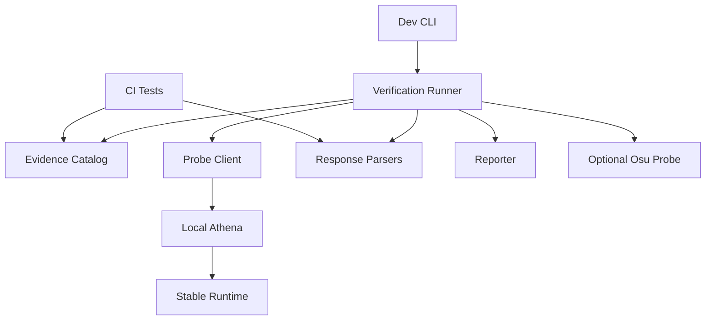
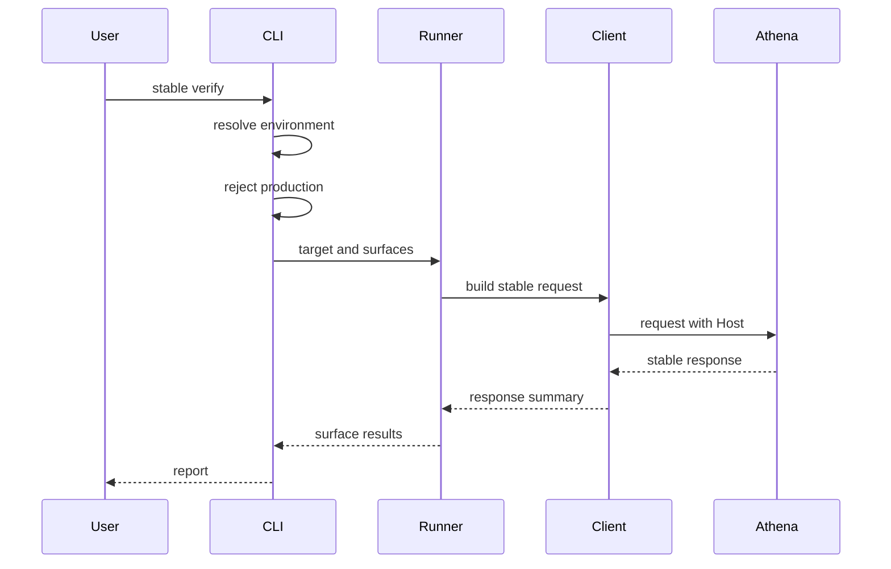
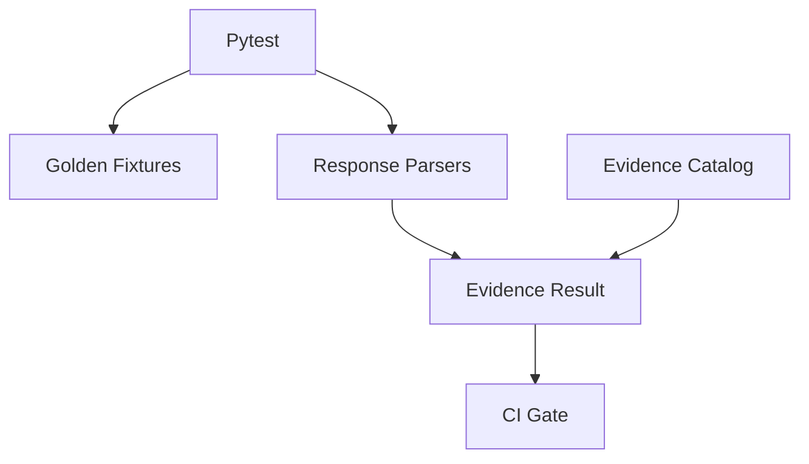

# Design Document

## Overview

Stable Compatibility Verification は、Athena の stable client 向け surface を実装者と AI エージェントが同じ基準で確認できる dev verification tooling である。既存 stable runtime の handler や service を置き換えず、request / response contract を外側から観測し、surface ごとの evidence と gap を報告する。

利用者は開発者、保守者、AI エージェントである。常時 CI では軽量な parser / golden fixture / contract tests を実行し、`athena dev stable-verify` では起動済み local Athena server に対して selected surface の probe を実行する。

### Goals

- Stable Surface と Stable Compatibility Evidence の対応を一元的に見える化する。
- score submit response と getscores response の stable parseability と field coverage を検証する。
- mandatory CI evidence と optional headless probe の結果を同じ result model で報告する。
- production への probe 実行と secret leakage を防ぐ。

### Non-Goals

- beatmap-leaderboards、user-stats、global ranking の集計を実装しない。
- stable runtime endpoint を増やさない。
- Athena server / worker の起動停止を CLI が所有しない。
- `osu` package を必須依存または dev dependency として追加しない。
- 既存の unit / integration / e2e tests を削除または置換しない。

## Boundary Commitments

### This Spec Owns

- `athena_cli.stable_verification` 配下の dev verification model、evidence catalog、probe runner、response parsers、reporting。
- `athena dev stable-verify` の command behavior、production guardrail、target URL と stable Host identity の分離。
- Stable Surface ごとの evidence mapping と pass / fail / skip / known_gap / unavailable result semantics。
- score submit chart response と getscores response の stable-compatible parsing assertion。
- Optional osu.py adapter の availability check と skipped / unavailable reporting。

### Out of Boundary

- Stable endpoint handler の business behavior 変更。
- Score ingestion、PP calculation、leaderboard projection、user stats aggregation の新規実装。
- DB schema、Valkey state、worker job、migration の変更。
- production target への verification request 送信。
- Live server lifecycle management。
- Raw replay payload、password hash、session token の report 出力。

### Allowed Dependencies

- `athena_cli.context`, `athena_cli.errors` — environment resolution と CLI error mapping。
- `osu_server.config.load_config` — selected environment の `domain` 読み取り。
- `httpx>=0.28.1` — local target への HTTP probe。
- `typer>=0.26.7` — CLI command definition。
- Existing stable transport parser / formatter tests and fixtures — mandatory evidence の参照。
- Optional `osu` package — installed and explicitly configured when getscores headless probe is requested。

禁止する依存:

- `osu_server` から `athena_cli` への import。
- Verification tooling から SQLAlchemy model、DB session、raw SQL、Valkey client への直接 access。
- Verification command 内で server / worker process を spawn する処理。

### Revalidation Triggers

- Stable endpoint path、Host routing、response media type、packet header semantics の変更。
- Score submit response の chart field 名、行順、delimiter、score id semantics の変更。
- Getscores response の short body、header body、score row、personal best format の変更。
- beatmap-leaderboards または user-stats spec が totalScore、rank、personal best を提供し始めた時。
- `athena dev stable-verify` JSON output schema の変更。
- Optional osu.py adapter が依存する `osu` package API の破壊的変更。

## Architecture

### Existing Architecture Analysis

Athena は stable bancho と web legacy transport を `osu_server.transports.stable` 配下に分けている。Host routing は `src/osu_server/composition/application.py` が所有し、`osu.$DOMAIN` は web legacy endpoint、`c.$DOMAIN` 系は bancho endpoint に到達する。CLI は `athena_cli` package で Typer command を持ち、`dev change-password` は production rejection を prompt 前に行う既存 pattern を持つ。

Getscores は `GetscoresQueryParser`, `GetscoresStatusMapper`, `GetscoresHandler`, `BeatmapScoreListingQuery` に分かれており、現状は header / unavailable / update available response が主な observable contract である。Score submit は `StableScoreSubmitMapper` が multipart input と chart response output を担当する。Verification はこれらを再設計せず、外側から request / response shape を検証する。

### Architecture Pattern & Boundary Map

Selected pattern: CLI-owned verification adapter. Runtime stable transport は検証対象であり、verification tooling の実行主体ではない。



Key decisions:

- `athena_cli.stable_verification` は dev tooling boundary であり、server runtime から import されない。
- Mandatory evidence は tests と fixtures で守り、optional probe は local server availability に依存する。
- Optional osu.py probe は getscores だけを対象にし、score submit は Athena 側 golden fixture で検証する。

### Technology Stack

| Layer | Choice / Version | Role in Feature | Notes |
|-------|------------------|-----------------|-------|
| CLI | Typer `>=0.26.7` | `athena dev stable-verify` command | Existing dependency |
| HTTP probe | HTTPX `>=0.28.1` | Local target request, Host header, timeout, connection errors | Existing dependency |
| Runtime target | Starlette app | Existing stable endpoints under Host routing | No new endpoint |
| Stable wire parsing | Python dataclasses and pure parser functions | Verification response parsing | No Pydantic in domain |
| Optional probe | `osu` package if installed | Getscores / leaderboard client-like probe | Not added to dependencies |
| Tests | pytest, pytest-asyncio, Typer CliRunner | CI evidence and CLI behavior tests | Existing dependencies |

## File Structure Plan

### Directory Structure

```text
src/
├── athena_cli/
│   ├── commands/
│   │   └── dev.py
│   └── stable_verification/
│       ├── __init__.py
│       ├── catalog.py
│       ├── client.py
│       ├── getscores.py
│       ├── models.py
│       ├── osu_py_probe.py
│       ├── parsers.py
│       ├── reporting.py
│       ├── runner.py
│       └── score_submit.py
tests/
├── fixtures/
│   ├── stable_compatibility/
│   │   ├── score_submit/
│   │   │   ├── completed_response.txt
│   │   │   ├── failed_response.txt
│   │   │   └── request_metadata.json
│   │   └── getscores/
│   │       └── probe_cases.json
│   └── web_legacy/
│       └── getscores/
├── unit/
│   └── athena_cli/
│       └── stable_verification/
│           ├── test_catalog.py
│           ├── test_parsers.py
│           ├── test_reporting.py
│           └── test_runner.py
└── integration/
    └── athena_cli/
        ├── test_cli_dev.py
        └── test_stable_verify_cli.py
```

### New Files

- `src/athena_cli/stable_verification/models.py` — Stable Surface、evidence、target、result の typed dataclasses / enums。
- `src/athena_cli/stable_verification/catalog.py` — surface inventory と evidence mapping の authoritative catalog。
- `src/athena_cli/stable_verification/client.py` — base URL と Host identity を分けて扱う HTTP probe client。
- `src/athena_cli/stable_verification/parsers.py` — score submit chart response と getscores response の pure parsers。
- `src/athena_cli/stable_verification/score_submit.py` — score submit golden evidence verification。
- `src/athena_cli/stable_verification/getscores.py` — getscores direct HTTP probe と fixture verification。
- `src/athena_cli/stable_verification/osu_py_probe.py` — optional `osu` package adapter。
- `src/athena_cli/stable_verification/runner.py` — selected surfaces を実行し aggregate result を計算する orchestration。
- `src/athena_cli/stable_verification/reporting.py` — text / structured output と secret redaction。
- `tests/fixtures/stable_compatibility/score_submit/*` — report-safe score submit response fixtures と request metadata。
- `tests/fixtures/stable_compatibility/getscores/probe_cases.json` — local probe 用 getscores cases。

### Modified Files

- `src/athena_cli/commands/dev.py` — `stable-verify` command を追加し、context resolution、production rejection、config domain loading、runner invocation を行う。
- `tests/integration/athena_cli/test_cli_dev.py` — production rejection before network、environment handling、error mapping の test を追加する。
- `tests/unit/transports/web_legacy/test_score_submit_mapper.py` — score submit chart fields の mandatory verification assertion を強化する。
- `tests/unit/transports/web_legacy/test_getscores_fixtures.py` — catalog が既存 getscores fixtures を evidence として参照できることを確認する。
- `tests/integration/test_getscores_endpoint.py` — local probe cases と既存 endpoint response の alignment を必要に応じて追加する。

No changes:

- `pyproject.toml`, `uv.lock`, DB migrations, import-linter config は変更しない。

## System Flows

### CLI Probe Flow



Flow decisions:

- Production rejection happens before target validation and network access.
- Connection failure becomes a surface result, not an unhandled traceback.
- Optional probe unavailable does not fail the run when mandatory evidence passes.

### Mandatory Evidence Flow



Mandatory evidence remains light: pure parsers, fixture checks, and existing stable integration tests.

## Requirements Traceability

| Requirement | Summary | Components | Interfaces | Flows |
|-------------|---------|------------|------------|-------|
| 1.1 | implemented surface inventory | Catalog | `list_surfaces` | Mandatory Evidence Flow |
| 1.2 | required surface set | Catalog | `StableSurface` | Mandatory Evidence Flow |
| 1.3 | unimplemented surface as out of scope | Catalog, Reporter | `SurfaceInventoryEntry.scope` | Mandatory Evidence Flow |
| 1.4 | missing evidence as gap | Catalog, Reporter | `VerificationStatus.KNOWN_GAP` | Mandatory Evidence Flow |
| 2.1 | classify evidence type | Models, Catalog | `EvidenceType` | Mandatory Evidence Flow |
| 2.2 | mandatory and optional split | Models, Runner | `EvidenceScope` | CLI Probe Flow |
| 2.3 | missing headless probe non failing | Runner, Reporter | `aggregate_status` | CLI Probe Flow |
| 2.4 | existing tests as evidence | Catalog | `EvidenceEntry.reference` | Mandatory Evidence Flow |
| 3.1 | existing tests preserved | File Structure Plan | test references | Mandatory Evidence Flow |
| 3.2 | existing contract tests referenced | Catalog | evidence references | Mandatory Evidence Flow |
| 3.3 | distinguish duplicate purposes | Catalog, Reporter | `purpose` field | Mandatory Evidence Flow |
| 4.1 | modular submit multipart shape | ScoreSubmitVerifier | fixture metadata | Mandatory Evidence Flow |
| 4.2 | parseable chart response | Parsers, ScoreSubmitVerifier | `parse_score_submit_response` | Mandatory Evidence Flow |
| 4.3 | score submit fields covered | Parsers, ScoreSubmitVerifier | `ScoreSubmitChart` | Mandatory Evidence Flow |
| 4.4 | achieved vs achievement notification | Parsers | chart field classification | Mandatory Evidence Flow |
| 4.5 | stats projection fields as gap | ScoreSubmitVerifier, Reporter | known gap result | Mandatory Evidence Flow |
| 5.1 | stable getscores query shape | GetscoresVerifier, OsuPyProbe | `GetscoresProbeCase` | CLI Probe Flow |
| 5.2 | parseable getscores response | Parsers, GetscoresVerifier | `parse_getscores_response` | CLI Probe Flow |
| 5.3 | status header row personal best empty cases | Parsers, Catalog | fixture cases | Mandatory Evidence Flow |
| 5.4 | unavailable versus gap | GetscoresVerifier, Reporter | result status | CLI Probe Flow |
| 5.5 | optional headless client probe | OsuPyProbe | `run_osu_py_getscores_probe` | CLI Probe Flow |
| 6.1 | dev command executes selected probes | CLI, Runner | `stable_verify` command | CLI Probe Flow |
| 6.2 | select one or all surfaces | CLI, Runner | `surfaces` option | CLI Probe Flow |
| 6.3 | no server lifecycle ownership | CLI | command contract | CLI Probe Flow |
| 6.4 | unreachable target result | Client, Runner | `ConnectionFailure` mapping | CLI Probe Flow |
| 6.5 | missing target info before request | CLI, Runner | target validation | CLI Probe Flow |
| 7.1 | target URL and Host identity split | Client, TargetConfig | `StableTarget` | CLI Probe Flow |
| 7.2 | Host identity reflected in request | Client | request headers | CLI Probe Flow |
| 7.3 | default domain from config | CLI | `load_config().domain` | CLI Probe Flow |
| 7.4 | display target and Host mismatch | Reporter | report preface | CLI Probe Flow |
| 8.1 | production rejection | CLI | `resolve_context` guard | CLI Probe Flow |
| 8.2 | no secrets in report | Reporter | `redact_diagnostic` | CLI Probe Flow |
| 8.3 | secret free diagnostics | Reporter, Client | diagnostic summary | CLI Probe Flow |
| 8.4 | no production user data mutation | Boundary, CLI | environment guard | CLI Probe Flow |
| 9.1 | per surface result states | Models, Reporter | `SurfaceResult` | CLI Probe Flow |
| 9.2 | result includes type and surface | Models, Reporter | `EvidenceResult` | CLI Probe Flow |
| 9.3 | mandatory failure fails run | Runner | aggregate status | Mandatory Evidence Flow |
| 9.4 | optional unavailable non failing | Runner | aggregate status | CLI Probe Flow |
| 9.5 | structured output | Reporter | JSON schema | CLI Probe Flow |

## Components and Interfaces

| Component | Domain / Layer | Intent | Req Coverage | Key Dependencies | Contracts |
|-----------|----------------|--------|--------------|------------------|-----------|
| Verification Models | CLI tooling | Shared typed language for surfaces and results | 1.1-2.4, 9.1-9.5 | None | State |
| Evidence Catalog | CLI tooling | Surface inventory and evidence references | 1.1-3.3 | Tests and fixtures | Service |
| Stable Probe Client | CLI tooling | Send local stable HTTP requests with Host identity | 6.1-7.4, 8.3 | HTTPX | Service |
| Response Parsers | CLI tooling | Parse stable text responses without invoking runtime handlers | 4.2-5.4 | None | Service |
| ScoreSubmitVerifier | CLI tooling | Validate score submit golden request metadata and chart response | 4.1-4.5 | Parsers, fixtures | Service |
| GetscoresVerifier | CLI tooling | Validate getscores direct HTTP probe and fixtures | 5.1-5.4 | Client, Parsers | Service |
| OsuPyProbe | CLI tooling | Optional getscores probe through `osu` package | 5.5, 9.4 | Optional `osu` | Service |
| Verification Runner | CLI tooling | Execute selected verifiers and compute aggregate status | 2.2-2.3, 6.1-6.5, 9.1-9.4 | Verifiers, Catalog | Service |
| StableVerifyCommand | CLI command | User-facing `athena dev stable-verify` entrypoint | 6.1-8.4 | Runner, config, context | API |
| Reporter | CLI tooling | Redacted text and structured output | 7.4, 8.2-9.5 | Models | Service |

### CLI Tooling

#### Verification Models

| Field | Detail |
|-------|--------|
| Intent | stable verification の result language を統一する |
| Requirements | 1.1, 1.2, 1.3, 1.4, 2.1, 2.2, 2.3, 9.1, 9.2, 9.3, 9.4, 9.5 |

**Responsibilities & Constraints**

- Surface、evidence、scope、result status、target config を dataclass / enum で表す。
- Status values は requirements の語彙と一致する。
- Secret を保持する model と reportable diagnostic model を分ける。

**Contracts**: Service [ ] / API [ ] / Event [ ] / Batch [ ] / State [x]

##### State Management

```python
class StableSurface(StrEnum):
    REGISTRATION = "registration"
    BANCHO_LOGIN = "bancho_login"
    POLLING = "polling"
    CHAT = "chat"
    GETSCORES = "getscores"
    SCORE_SUBMIT = "score_submit"

class EvidenceType(StrEnum):
    AUTOMATED_TEST = "automated_test"
    GOLDEN_FIXTURE = "golden_fixture"
    HEADLESS_PROBE = "headless_probe"

class EvidenceScope(StrEnum):
    MANDATORY = "mandatory"
    OPTIONAL = "optional"

class SurfaceScope(StrEnum):
    IN_SCOPE = "in_scope"
    OUT_OF_SCOPE = "out_of_scope"

class VerificationStatus(StrEnum):
    PASS = "pass"
    FAIL = "fail"
    SKIP = "skip"
    KNOWN_GAP = "known_gap"
    UNAVAILABLE = "unavailable"
```

Key dataclasses:

- `StableTarget(base_url: str, host_identity: str, timeout_seconds: float)`
- `SurfaceInventoryEntry(surface: StableSurface, implemented: bool, scope: SurfaceScope)`
- `EvidenceEntry(surface, evidence_type, scope, reference, purpose)`
- `SurfaceResult(surface, status, evidence_type, scope, diagnostic_summary)`
- `VerificationRunResult(results, failed: bool)`

#### Evidence Catalog

| Field | Detail |
|-------|--------|
| Intent | Stable Surface と evidence reference の authoritative list |
| Requirements | 1.1, 1.2, 1.3, 1.4, 2.1, 2.2, 2.4, 3.2, 3.3 |

**Responsibilities & Constraints**

- 現状実装済み surface を列挙する。
- Surface ごとに mandatory evidence と optional evidence を区別する。
- Existing tests を置き換えず、file path と purpose を参照する。
- 未実装または未検証項目は absent にせず known gap として残す。

**Dependencies**

- Inbound: Runner, tests — surface inventory lookup (P0)
- Outbound: Existing test paths and fixture paths — evidence references (P1)

**Contracts**: Service [x] / API [ ] / Event [ ] / Batch [ ] / State [ ]

##### Service Interface

```python
def list_surfaces() -> tuple[StableSurface, ...]: ...
def list_evidence(surface: StableSurface | None = None) -> tuple[EvidenceEntry, ...]: ...
def list_gaps(surface: StableSurface | None = None) -> tuple[EvidenceGap, ...]: ...
```

#### Stable Probe Client

| Field | Detail |
|-------|--------|
| Intent | local target と stable Host identity を分けて request を送る |
| Requirements | 6.1, 6.4, 6.5, 7.1, 7.2, 7.4, 8.3 |

**Responsibilities & Constraints**

- `base_url` は TCP 接続先として扱う。
- `host_identity` は stable Host routing 用の `Host` header と request URL construction に使う。
- Password hash や token を diagnostic に含めない。
- HTTPX `RequestError` を `UNAVAILABLE` result に変換する。

**Dependencies**

- Inbound: GetscoresVerifier, ScoreSubmit live probe if enabled — request execution (P0)
- External: HTTPX — HTTP client and timeout handling (P0)

**Contracts**: Service [x] / API [ ] / Event [ ] / Batch [ ] / State [ ]

##### Service Interface

```python
class StableProbeClient:
    def get_web_legacy(
        self,
        path: str,
        *,
        query: Mapping[str, str],
        host_prefix: Literal["osu"] = "osu",
    ) -> ProbeResponse: ...

    def post_web_legacy(
        self,
        path: str,
        *,
        body: bytes,
        content_type: str,
        host_prefix: Literal["osu"] = "osu",
    ) -> ProbeResponse: ...
```

Preconditions:

- `base_url` is absolute HTTP or HTTPS URL.
- `host_identity` is non-empty.

Postconditions:

- Response body is captured as bytes.
- Diagnostic summary contains method, path, status code, byte size, and sanitized error.

#### Response Parsers

| Field | Detail |
|-------|--------|
| Intent | stable response text を runtime-free に parse して assertion 可能にする |
| Requirements | 4.2, 4.3, 4.4, 5.2, 5.3, 5.4 |

**Responsibilities & Constraints**

- Pipe-delimited `key:value` chart lines を parse する。
- Getscores short body と header body を区別する。
- Parser は DB、HTTP、runtime handler に依存しない。
- 不正 format は exception ではなく parse error result として返す。

**Contracts**: Service [x] / API [ ] / Event [ ] / Batch [ ] / State [ ]

##### Service Interface

```python
def parse_score_submit_response(body: bytes) -> ScoreSubmitResponseParseResult: ...
def parse_getscores_response(body: bytes) -> GetscoresResponseParseResult: ...
```

Invariants:

- Score submit completed response has at least beatmap metadata, beatmap chart, overall chart.
- Getscores short response is exactly `-1|false` or `1|false`.
- Getscores header response first line contains status, failed flag, beatmap id, beatmapset id, score count.

#### ScoreSubmitVerifier

| Field | Detail |
|-------|--------|
| Intent | score submit の golden evidence と chart field coverage を検証する |
| Requirements | 4.1, 4.2, 4.3, 4.4, 4.5 |

**Responsibilities & Constraints**

- Stable modular multipart の report-safe metadata を検証する。
- Completed response fixture と mapper-generated response を chart parser に通す。
- `chartId`, `chartUrl`, `chartName`, `achieved`, `rank`, `rankBefore`, `rankedScore`, `rankedScoreBefore`, `totalScore`, `maxCombo`, `accuracy`, `pp`, `onlineScoreId` の存在と parseability を検証する。
- user-stats / leaderboard 由来の未実装値は known gap として返す。

**Dependencies**

- Inbound: Runner, unit tests — score submit evidence execution (P0)
- Outbound: Response Parsers — chart parsing (P0)
- Outbound: Fixtures — golden response and request metadata (P1)

**Contracts**: Service [x] / API [ ] / Event [ ] / Batch [ ] / State [ ]

##### Service Interface

```python
class ScoreSubmitVerifier:
    def verify_golden_response(self) -> tuple[SurfaceResult, ...]: ...
```

#### GetscoresVerifier

| Field | Detail |
|-------|--------|
| Intent | getscores fixture と direct HTTP response を stable response として検証する |
| Requirements | 5.1, 5.2, 5.3, 5.4 |

**Responsibilities & Constraints**

- Existing getscores fixtures を mandatory evidence として parse する。
- Local probe は configured credentials / probe case がある場合だけ実行する。
- Empty leaderboard header, unavailable, update available を区別する。
- score row / personal best が未実装の場合は known gap として report する。

**Dependencies**

- Inbound: Runner — getscores evidence execution (P0)
- Outbound: Stable Probe Client — local target request (P0 for live probe)
- Outbound: Response Parsers — getscores body parsing (P0)

**Contracts**: Service [x] / API [ ] / Event [ ] / Batch [ ] / State [ ]

##### Service Interface

```python
class GetscoresVerifier:
    def verify_fixtures(self) -> tuple[SurfaceResult, ...]: ...
    def probe_target(self, case: GetscoresProbeCase) -> SurfaceResult: ...
```

#### OsuPyProbe

| Field | Detail |
|-------|--------|
| Intent | `osu` package が利用可能な場合だけ getscores client-like parse を確認する |
| Requirements | 5.5, 9.4 |

**Responsibilities & Constraints**

- `import osu` を lazy import する。
- 未導入、version/hash 未指定、credentials 不足は `UNAVAILABLE` または `SKIP` とする。
- score submit には使わない。
- Public osu! endpoint への version / update lookup を避けるため、probe prerequisites が不足する場合は実行しない。

**Dependencies**

- Inbound: Runner — optional headless probe (P2)
- External: `osu` package — optional stable emulator (P2)

**Contracts**: Service [x] / API [ ] / Event [ ] / Batch [ ] / State [ ]

##### Service Interface

```python
class OsuPyProbe:
    def probe_getscores(self, case: GetscoresProbeCase) -> SurfaceResult: ...
```

#### Verification Runner

| Field | Detail |
|-------|--------|
| Intent | selected surfaces を実行し aggregate status を決める |
| Requirements | 2.2, 2.3, 6.1, 6.2, 6.4, 6.5, 9.1, 9.3, 9.4 |

**Responsibilities & Constraints**

- Surface selection を validate する。
- Mandatory evidence と optional evidence を同じ output model に集約する。
- Mandatory `FAIL` があれば run failed とする。
- Optional `SKIP` / `UNAVAILABLE` は run failed にしない。

**Contracts**: Service [x] / API [ ] / Event [ ] / Batch [ ] / State [ ]

##### Service Interface

```python
class StableVerificationRunner:
    def run(self, request: VerificationRunRequest) -> VerificationRunResult: ...
```

#### StableVerifyCommand

| Field | Detail |
|-------|--------|
| Intent | `athena dev stable-verify` の user-facing command |
| Requirements | 6.1, 6.2, 6.3, 6.5, 7.3, 8.1, 8.4 |

**Responsibilities & Constraints**

- `--env`, `--base-url`, `--host`, `--surface`, `--json`, `--timeout` を受ける。
- `--env production` または resolved production は network request 前に拒否する。
- `--host` 未指定時は selected environment の `AppConfig.domain` を使う。
- Server lifecycle を所有しない。

**Contracts**: Service [ ] / API [x] / Event [ ] / Batch [ ] / State [ ]

##### API Contract

| Command | Inputs | Output | Errors |
|---------|--------|--------|--------|
| `athena dev stable-verify` | `--env`, `--base-url`, `--host`, `--surface`, `--json`, `--timeout` | Text or JSON report | usage error, connection result, verification failure exit |

#### Reporter

| Field | Detail |
|-------|--------|
| Intent | result を secret-free に表示する |
| Requirements | 7.4, 8.2, 8.3, 9.1, 9.2, 9.5 |

**Responsibilities & Constraints**

- Text output は surface ごとに status, evidence type, scope, summary を表示する。
- Structured output は stable schema で machine-readable にする。
- Password、hash、token、raw replay、credential fields を出力しない。

**Contracts**: Service [x] / API [ ] / Event [ ] / Batch [ ] / State [ ]

##### Service Interface

```python
class StableVerificationReporter:
    def render_text(self, result: VerificationRunResult) -> str: ...
    def render_json(self, result: VerificationRunResult) -> str: ...
```

## Data Models

### Domain Model

This feature does not introduce server domain aggregates. It introduces CLI tooling value objects only:

- `StableSurface`: externally observable stable surface.
- `SurfaceInventoryEntry`: surface name, implementation state, and scope classification.
- `EvidenceEntry`: one verification source linked to a surface.
- `StableTarget`: local connection target and stable Host identity.
- `SurfaceResult`: one surface evidence outcome.
- `VerificationRunResult`: aggregate run status.

### Logical Data Model

No persistent database model is added.

Result schema:

```json
{
  "target": {
    "base_url": "http://127.0.0.1:8000",
    "host_identity": "athena.localhost"
  },
  "failed": false,
  "results": [
    {
      "surface": "getscores",
      "status": "pass",
      "evidence_type": "golden_fixture",
      "scope": "mandatory",
      "diagnostic_summary": "ranked_response parsed"
    }
  ]
}
```

### Physical Data Model

No database schema, migration, Valkey key, or durable file format is introduced. Test fixtures are repository files only.

### Data Contracts & Integration

**CLI structured output**

- `surface`: one `StableSurface` value.
- `status`: `pass`, `fail`, `skip`, `known_gap`, or `unavailable`.
- `evidence_type`: `automated_test`, `golden_fixture`, or `headless_probe`.
- `scope`: `mandatory` or `optional`.
- `diagnostic_summary`: redacted single-line summary.
- `reference`: optional test, fixture, or probe case identifier.

**Stable HTTP request contract**

- Web legacy requests use path under `base_url`.
- Host routing uses `Host: osu.<host_identity>` for web legacy probes.
- Bancho probes use `Host: c.<host_identity>` or compatible bancho host prefix.

## Error Handling

### Error Strategy

- User input errors become `CliUserError` and exit through existing `map_cli_error`.
- Production environment is rejected before loading probe credentials or opening network connections.
- HTTPX `RequestError` becomes `UNAVAILABLE` surface result.
- Stable response parse failure becomes `FAIL` for mandatory evidence and `FAIL` or `UNAVAILABLE` for live probe depending on whether a response was received.
- Missing optional osu.py dependency becomes `SKIP` or `UNAVAILABLE`, not run failure.

### Error Categories and Responses

| Category | Condition | Response |
|----------|-----------|----------|
| User error | Missing `--base-url` for live probe | usage error before request |
| User error | Unknown surface | usage error with valid surface list |
| Guardrail | production environment | usage error before request |
| Network | connection refused or timeout | `UNAVAILABLE` result |
| Contract | response cannot be parsed | `FAIL` result with redacted summary |
| Optional dependency | `osu` package unavailable | optional `SKIP` result |
| Known product gap | leaderboard / user stats projection missing | `KNOWN_GAP` result |

### Monitoring

The command reports diagnostics to stdout / stderr only. It does not add application metrics or server logs. Runtime stable endpoints keep their existing structlog behavior.

## Testing Strategy

### Unit Tests

- `models.py`: enum values and aggregate failure rules match requirements status vocabulary.
- `catalog.py`: all required surfaces exist and existing tests / fixtures are referenced without replacing them.
- `parsers.py`: score submit chart response parses required fields, separates `achieved` from `achievements-new`, and rejects malformed delimiter shapes.
- `parsers.py`: getscores short, header, empty leaderboard, update available, and malformed bodies are classified correctly.
- `reporting.py`: passwords, password hashes, session tokens, credential fields, and raw payload hints are redacted.

### Integration Tests

- `athena dev stable-verify --env production` rejects before any probe client is constructed.
- Missing `--base-url` with live probe exits as user error before network request.
- `--host` overrides config domain, and omitted `--host` uses `AppConfig.domain`.
- Connection failure is reported as `unavailable` for the requested surface.
- `--json` returns structured output with surface, status, evidence type, scope, and diagnostic summary.

### Stable Contract Tests

- Existing getscores fixture tests remain mandatory evidence and continue to parse all fixture files.
- Score submit mapper tests assert beatmap and overall chart fields required by 4.3.
- Score submit response fixtures assert no raw error reason leaks into stable response body.
- Getscores endpoint tests keep Host routing behavior for `osu.$DOMAIN` and no path fallback.

### E2E / Optional Probe

- Manual or agent-run `athena dev stable-verify --surface getscores --base-url ...` confirms local target request / response parse.
- Optional osu.py probe is tested with a fake adapter in CI and marked skipped when the package is absent.
- A real osu.py probe is not part of the mandatory CI gate.

## Security Considerations

- Production guardrail is mandatory and happens before network requests.
- Reports must not include password, password hash, session token, replay raw payload, or raw credential fields.
- Request diagnostics are reduced to method, path, status code, response byte count, and sanitized parse reason.
- Fixture metadata may describe field presence and byte sizes, but not raw replay bytes.
- CLI does not write production user data and does not mutate databases directly.

## Performance & Scalability

- Default probe timeout is bounded and configurable.
- CI mandatory evidence uses pure parser / fixture tests and should remain lightweight.
- Live probes are sequential by default to keep diagnostics deterministic.
- No caching, background jobs, or distributed coordination is introduced.

## Migration Strategy

No data migration is required.

Implementation phases:

1. Add models, parsers, catalog, and unit tests.
2. Add score submit and getscores mandatory evidence tests.
3. Add runner, reporter, HTTP client, and CLI command.
4. Add optional osu.py adapter with skipped behavior when unavailable.
5. Run focused CLI and stable transport tests, then project quality gates.

Rollback is deleting the new CLI command and `athena_cli.stable_verification` package; runtime stable endpoints are not changed by this design.
