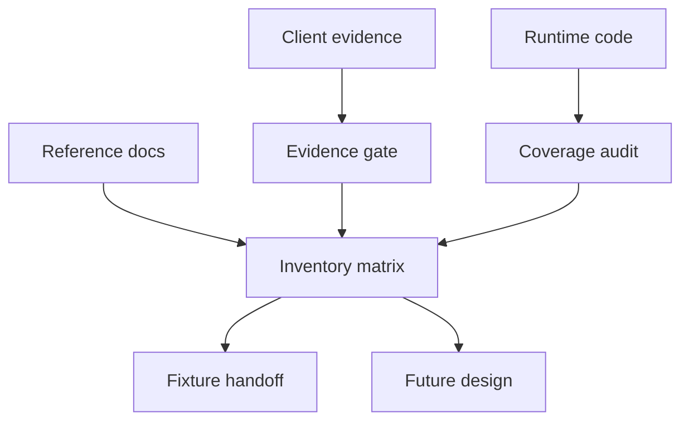
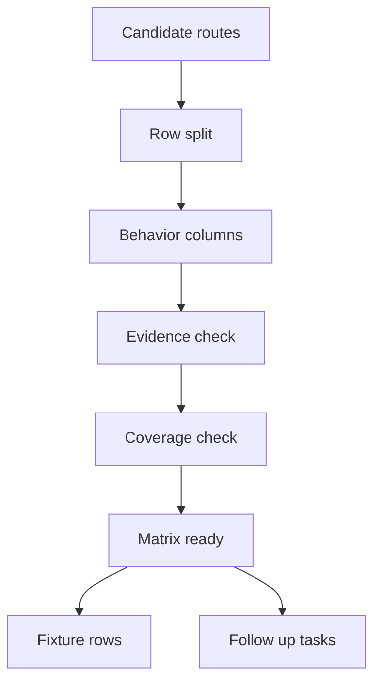
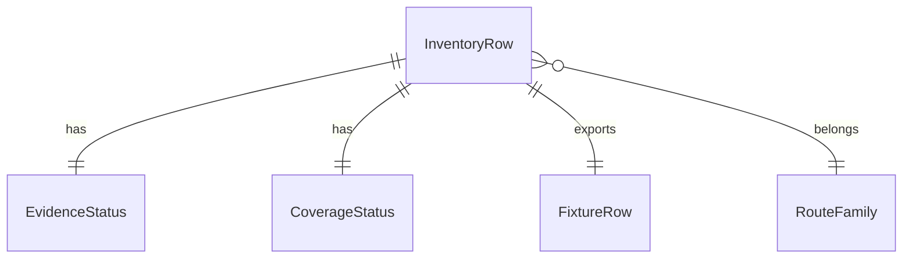

# 設計ドキュメント

## Overview

この feature は、Athena の stable client static/media surface について、実装者と fixture 抽出担当者が同じ route inventory を参照できる状態を作る。対象は screenshots、avatars、beatmap thumbnails、preview audio、menu assets、host-based aliases であり、runtime 実装ではなく client-visible contract の監査結果を確定する。

現状の Athena は stable bancho と一部 legacy web endpoints を持つが、static/media routes は runtime coverage がない。この設計は `research.md` の Static/Media Route Inventory Matrix を所有し、Stable Reference Candidate と Stable Compatibility Evidence を分け、未確認 contract を `needs-reference` として後続実装から分離する。

### Goals

- Static/media route candidate を row-level matrix として確定し、method、host alias、path pattern、classification、priority、coverage、behavior、evidence、fixture extraction row を記録する。
- Beatmap thumbnail、avatar、screenshot serving を P1、preview audio を原則 classification `deferred` かつ priority `P2`、menu/seasonal/title を classification `deferred` かつ priority `P3` として扱い、preview audio は core gameplay evidence が出た場合だけ再分類・再優先度付けする。
- Current Athena coverage と follow-up readiness を明確にし、#17 fixture extraction と後続 runtime spec が推測なしで対象 row を選べるようにする。

### Non-Goals

- Stable static/media runtime route、handler、service、repository、DB schema の実装。
- `.osu` / `.osz` download/search contract、osu!direct search response、score submission、online state、user stats の詳細設計。
- Avatar resize library、ImageMagick、pyvips、Pillow など画像処理手段の選定または依存追加。
- User-facing avatar profile UI、operator import UI、public/admin API の具体 contract。
- Stable traffic capture または fixture extraction の実行そのもの。この spec は抽出対象 row を渡す。

## Boundary Commitments

### This Spec Owns

- `.kiro/specs/stable-static-media-inventory/research.md` の Static/Media Route Inventory Matrix。
- Matrix row schema、row split rule、classification enum、priority enum、coverage enum、evidence status policy。
- Screenshot、avatar、beatmap media、menu/seasonal/title、host alias の initial audited row set。
- Stable Reference Candidate と Stable Compatibility Evidence の区別、および `needs-reference` gate。
- Current Athena coverage audit と、後続 implementation / fixture extraction への handoff。

### Out of Boundary

- Production runtime route registration と Starlette endpoint 実装。
- Blob attachment tables、screenshot/avatar/beatmap media metadata persistence、Alembic migrations。
- Avatar variant generation、image validation、media transcoding、HTTP upstream fetch implementation。
- Score submission、presence、user stats、leaderboard、osu!direct の detailed implementation。
- Evidence を持たない stable behavior の確定実装。

### Allowed Dependencies

- Source documents: `docs/stable-compatibility-guide.md`、`docs/stable-compatibility-matrix.md`、`CONTEXT.md`。
- Runtime coverage evidence: `src/osu_server/composition/application.py`、`src/osu_server/composition/providers/stable_web_legacy.py`、関連 stable transport files。
- Existing design language: `.kiro/steering/tech.md`、`.kiro/steering/roadmap.md`、`.kiro/steering/scaling.md`。
- Future implementation reference only: `BlobStorageService`、beatmap file fetch provider/use-case、multipart parser、RateLimiter。

### Revalidation Triggers

- Target stable client traffic が matrix row の path、host、query、response shape、header、missing behavior、expiry behavior を確認または否定したとき。
- Runtime implementation が static/media route、host alias、blob metadata、avatar variant、beatmap media cache を追加したとき。
- #17 fixture extraction の input format が `fixture extraction row` 列と合わなくなったとき。
- Stable compatibility docs の reference route inventory が更新され、candidate path または behavior が増減したとき。
- Stable Gameplay Core Workflow の優先順位が変わり、static/media implementation の実施順が前倒しまたは延期されたとき。

## Architecture

### Existing Architecture Analysis

Athena は layered modular monolith として、composition、runtime adapters、command/query use-cases、repositories、domain、infrastructure を分ける。現在の stable runtime route は `c.$DOMAIN`、`c<int>.$DOMAIN`、`ce.$DOMAIN`、`osu.$DOMAIN` に限定され、`osu.$DOMAIN` は registration、bancho connect、getscores、score submit を公開している。

Static/media route は現在 registered route、handler、service、metadata のいずれも存在しない。Blob storage、beatmap file fetch、multipart parser、RateLimiter は後続実装で再利用できるが、この inventory spec では read-only evidence と future boundary recommendation に留める。

### Architecture Pattern & Boundary Map

Selected pattern: documentation-as-contract inventory with evidence gate.



Architecture decisions:

- Matrix rows are the unit of ownership. Route family alone is not precise enough for fixture extraction or implementation tasks.
- Evidence gates are part of the inventory, not runtime policy. A `needs-reference` row blocks client-visible contract implementation but may still allow non-observable preparation work in later specs.
- Future runtime implementation should follow the hybrid direction recorded in `research.md`: stable transport adapters stay thin, while storage/source/variant/cache behavior belongs in dedicated command/query boundaries.

### Technology Stack

| Layer | Choice / Version | Role in Feature | Notes |
| --- | --- | --- | --- |
| Spec docs | Markdown | Inventory matrix, design, research log | No generated schema required |
| Backend source audit | Python 3.14+, Starlette, Dishka | Coverage evidence only | No runtime code changes in this spec |
| Data / Storage | Existing blob storage vocabulary | Future implementation reference | No new tables or blob writes in this spec |
| Infrastructure / Runtime | Existing host routing pattern | Coverage comparison input | No new host aliases registered now |

## File Structure Plan

### Directory Structure

```text
.kiro/specs/stable-static-media-inventory/
├── spec.json        # phase and approval metadata
├── requirements.md  # approved functional requirements
├── research.md      # owned inventory matrix and discovery decisions
└── design.md        # boundary and implementation guidance for the inventory

docs/
├── stable-compatibility-guide.md   # reference candidate source
└── stable-compatibility-matrix.md  # reference route inventory source

src/osu_server/composition/
├── application.py                  # current route coverage evidence
└── providers/stable_web_legacy.py  # current stable web handler coverage evidence
```

### Component to File Mapping

| Component | File | Responsibility |
| --- | --- | --- |
| StableStaticMediaInventoryMatrix | `.kiro/specs/stable-static-media-inventory/research.md` | Matrix rows and row schema |
| EvidenceGatePolicy | `.kiro/specs/stable-static-media-inventory/research.md` | Evidence status semantics and implementation readiness gate |
| CurrentCoverageAuditor | `.kiro/specs/stable-static-media-inventory/research.md` | Current `missing` / `partial` / `implemented` coverage notes |
| ScreenshotWorkflowInventory | `.kiro/specs/stable-static-media-inventory/research.md` | Screenshot upload/serving candidate rows and behavior gaps |
| AvatarServingInventory | `.kiro/specs/stable-static-media-inventory/research.md` | Avatar route, variant, checksum, fallback candidate rows |
| BeatmapMediaInventory | `.kiro/specs/stable-static-media-inventory/research.md` | Thumbnail and preview audio candidate rows |
| MenuSeasonalTitleInventory | `.kiro/specs/stable-static-media-inventory/research.md` | Menu JSON, seasonal, title, and menu image candidate rows |
| HostAliasInventory | `.kiro/specs/stable-static-media-inventory/research.md` | `a` / `assets` / `b` / `d` / `d.osu` / `s` / bare domain / `ha` host alias candidate rows |
| FixtureExtractionHandoff | `.kiro/specs/stable-static-media-inventory/research.md` | Row-level fixture extraction identifiers |

### Modified Files

- `.kiro/specs/stable-static-media-inventory/research.md` - Fill and maintain the route inventory matrix, discovery decisions, and synthesis outcomes.
- `.kiro/specs/stable-static-media-inventory/design.md` - Define the design boundary and matrix contract.
- `.kiro/specs/stable-static-media-inventory/spec.json` - Mark requirements approved and design generated.

No production source file is modified by this spec. Runtime files listed above are audit inputs.

## System Flows



Flow decisions:

- Row split happens before classification. If method, host, path pattern, redirect behavior, or response shape differs, the inventory records a separate row.
- Evidence check never upgrades a Stable Reference Candidate to confirmed without target stable client traffic or equivalent evidence.
- Coverage check uses current Athena runtime routes and handlers, not future planned code.

## Requirements Traceability

| Requirement | Summary | Components | Interfaces | Flows |
| --- | --- | --- | --- | --- |
| 1.1, 1.2, 1.3, 1.4, 1.5 | Matrix schema, row granularity, evidence labeling, fixture row unit | StableStaticMediaInventoryMatrix, EvidenceGatePolicy, FixtureExtractionHandoff | Matrix row schema | Row split, Evidence check |
| 2.1, 2.2, 2.3, 2.4, 2.5, 2.6, 2.7 | Classification, priority, adjacent scope, implementation order | StableStaticMediaInventoryMatrix, MenuSeasonalTitleInventory, CurrentCoverageAuditor | Classification policy | Coverage check, Follow up tasks |
| 3.1, 3.2, 3.3, 3.4 | `needs-reference` gate and evidence precedence | EvidenceGatePolicy | Evidence status policy | Evidence check |
| 4.1, 4.2, 4.3, 4.4, 4.5, 4.6, 4.7 | Screenshot workflow inventory and unresolved contract gaps | ScreenshotWorkflowInventory, EvidenceGatePolicy | Screenshot row contract | Row split, Evidence check |
| 5.1, 5.2, 5.3, 5.4, 5.5, 5.6, 5.7 | Avatar route, variant, PNG, fallback, checksum and size+checksum inventory | AvatarServingInventory, EvidenceGatePolicy | Avatar row contract | Row split, Evidence check |
| 6.1, 6.2, 6.3, 6.4, 6.5, 6.6 | Beatmap thumbnail and preview audio inventory, including checksum query rows | BeatmapMediaInventory, EvidenceGatePolicy | Beatmap media row contract | Row split, Evidence check |
| 7.1, 7.2, 7.3, 7.4 | Host alias candidate coverage and gating | HostAliasInventory, EvidenceGatePolicy | Host alias row contract | Row split, Evidence check |
| 8.1, 8.2, 8.3, 8.4, 8.5 | Behavior contract columns and observable response notes | StableStaticMediaInventoryMatrix, EvidenceGatePolicy | Behavior column schema | Behavior columns |
| 9.1, 9.2, 9.3, 9.4, 9.5 | Current coverage and follow-up readiness | CurrentCoverageAuditor, FixtureExtractionHandoff | Coverage enum, fixture row id | Coverage check, Fixture rows |

## Components and Interfaces

| Component | Domain/Layer | Intent | Req Coverage | Key Dependencies | Contracts |
| --- | --- | --- | --- | --- | --- |
| StableStaticMediaInventoryMatrix | Spec docs | Own the row schema and audited row set | 1.1, 1.2, 2.1, 2.2, 8.1, 9.1 | Reference docs P0, EvidenceGatePolicy P0 | State |
| EvidenceGatePolicy | Compatibility policy | Separate confirmed behavior from candidates | 1.3, 1.4, 3.1, 3.2, 3.3, 3.4, 8.2 | Client evidence P0, Reference docs P1 | State |
| CurrentCoverageAuditor | Coverage audit | Record current Athena coverage per row | 9.1, 9.2, 9.3, 9.4 | Runtime code P0 | State |
| ScreenshotWorkflowInventory | Route family inventory | Represent screenshot upload and serving as one workflow | 4.1, 4.2, 4.3, 4.4, 4.5, 4.6, 4.7 | Matrix P0, EvidenceGatePolicy P0 | State |
| AvatarServingInventory | Route family inventory | Represent avatar routes, variants, fallback, checksum and size+checksum gaps | 5.1, 5.2, 5.3, 5.4, 5.5, 5.6, 5.7 | Matrix P0, EvidenceGatePolicy P0 | State |
| BeatmapMediaInventory | Route family inventory | Represent thumbnail and preview audio delivery candidates, including checksum query behavior | 6.1, 6.2, 6.3, 6.4, 6.5, 6.6 | Matrix P0, Beatmap docs P1 | State |
| MenuSeasonalTitleInventory | Route family inventory | Represent menu JSON, seasonal background, title image, and menu image candidates | 2.6, 2.7, 7.1, 7.4 | Matrix P0, EvidenceGatePolicy P0 | State |
| HostAliasInventory | Route family inventory | Represent host alias candidate rows and blockers | 7.1, 7.2, 7.3, 7.4 | Matrix P0, Client evidence P0 | State |
| FixtureExtractionHandoff | Spec docs | Identify fixture extraction targets per matrix row | 1.5, 9.5 | Matrix P0, #17 fixture workflow P1 | State |

### Spec Documentation Layer

#### StableStaticMediaInventoryMatrix

| Field | Detail |
| --- | --- |
| Intent | Maintain the authoritative route inventory matrix for this spec |
| Requirements | 1.1, 1.2, 2.1, 2.2, 8.1, 9.1 |

**Responsibilities & Constraints**

- Record one row per client-observable contract.
- Use the required columns exactly: `route family`, `method`, `host alias`, `path pattern`, `compatibility classification`, `implementation priority`, `current Athena coverage`, `response contract candidate`, `cache headers`, `content type`, `redirect`, `missing asset response`, `expiry behavior`, `evidence status`, `fixture extraction row`.
- Preserve `.osu` / `.osz` related routes as adjacent rows without absorbing beatmap/direct detailed contracts.
- Avoid unspecified placeholders; use `needs-reference` when evidence is missing.

**Dependencies**

- Inbound: FixtureExtractionHandoff - consumes row identifiers (P0)
- Outbound: EvidenceGatePolicy - controls evidence labels (P0)
- Outbound: CurrentCoverageAuditor - supplies coverage values (P0)
- External: Stable compatibility docs - candidate route source (P1)

**Contracts**: State [x]

##### State Management

- State model: Markdown table in `research.md`.
- Persistence & consistency: Git-tracked document; every row must remain reviewable in plain text.
- Concurrency strategy: one spec branch owns matrix edits. If future agents edit the same table, integrate sequentially to avoid row loss.

**Implementation Notes**

- Integration: Use docs as candidate inputs and runtime route files as coverage inputs.
- Validation: Confirm all required columns exist and all audited rows have a fixture extraction row value.
- Risks: Large matrix drift. Keep row IDs stable once fixture extraction references them.

#### EvidenceGatePolicy

| Field | Detail |
| --- | --- |
| Intent | Prevent guessed stable behavior from becoming implementation-ready |
| Requirements | 1.3, 1.4, 3.1, 3.2, 3.3, 3.4, 8.2 |

**Responsibilities & Constraints**

- Mark unconfirmed client-visible behavior as `needs-reference`.
- Label docs/private-server-only behavior as Stable Reference Candidate.
- Permit non-observable preparation work only when client-visible behavior is not finalized.
- Prefer Stable Compatibility Evidence over conflicting Stable Reference Candidate and record rejected or superseded candidates.

**Dependencies**

- Inbound: All route family inventory components - request evidence status decisions (P0)
- Outbound: Client traffic or equivalent evidence - confirms behavior (P0)
- External: Reference docs - candidate behavior source (P1)

**Contracts**: State [x]

##### State Management

- State model: `evidence status` column plus candidate notes in `response contract candidate` and behavior columns.
- Valid evidence statuses: `confirmed`, `needs-reference`, `stable-reference-candidate`, `rejected`, `superseded`.
- Invariant: A row with any client-visible `needs-reference` behavior is not implementation-ready for that behavior.

**Implementation Notes**

- Integration: Link evidence source in the row notes or adjacent research log entry.
- Validation: Confirm every `needs-reference` row remains blocked in follow-up readiness language.
- Risks: Reference implementations can differ from target stable client behavior. Keep candidate and confirmed evidence separate.

#### CurrentCoverageAuditor

| Field | Detail |
| --- | --- |
| Intent | Record what Athena covers now without assuming planned implementation |
| Requirements | 9.1, 9.2, 9.3, 9.4 |

**Responsibilities & Constraints**

- Set `current Athena coverage` to `missing`, `partial`, or `implemented`.
- Use registered routes, handlers, and behavior coverage as evidence.
- Treat a route path without behavior columns as `partial`, not `implemented`.
- Treat absent route registration as `missing`.

**Dependencies**

- Inbound: StableStaticMediaInventoryMatrix - requires coverage values (P0)
- Outbound: `src/osu_server/composition/application.py` - route coverage evidence (P0)
- Outbound: stable transport/provider files - handler coverage evidence (P0)

**Contracts**: State [x]

##### State Management

- State model: `current Athena coverage` column and supporting notes in research log.
- Invariant: The static/media rows audited in this spec start as `missing` unless a registered route and behavior implementation exist in current code.

**Implementation Notes**

- Integration: Do not treat future planned files as implemented coverage.
- Validation: Re-run coverage audit after any route registration PR lands.
- Risks: Path aliases may be registered under host routers. Audit both `Host` and path fallback routes.

### Route Family Inventory Layer

#### ScreenshotWorkflowInventory

| Field | Detail |
| --- | --- |
| Intent | Represent screenshot upload and serving as one compatibility workflow |
| Requirements | 4.1, 4.2, 4.3, 4.4, 4.5, 4.6, 4.7 |

**Responsibilities & Constraints**

- Include upload, numeric id response candidate, serving routes, missing/hidden/expired behavior, expiry policy, and serving headers as linked rows.
- Use numeric screenshot id as preferred upload response candidate.
- Record JPEG/PNG original content type preservation for serving.
- Keep seven-day reference expiry and md5-shaped checksum source as `needs-reference`.
- Default Athena expiry policy candidate is configurable with unlimited retention by default.

**Dependencies**

- Inbound: StableStaticMediaInventoryMatrix - row schema (P0)
- Outbound: EvidenceGatePolicy - blocks unconfirmed upload and checksum contract (P0)
- External: Blob storage and multipart parser - future implementation references (P2)

**Contracts**: State [x]

##### State Management

- Minimum rows: `POST /web/osu-screenshot.php`, `POST /web/osu-ss.php`, `GET /ss/`, `GET /ss/<id>`, `GET /ss/<id>/<checksum>`, `GET /ss/<id>.<extension>`.
- Invariant: Upload and serving rows share the same Screenshot Compatibility Workflow note.

**Implementation Notes**

- Integration: Future runtime spec should use the same command boundary for upload metadata and blob storage.
- Validation: Fixture extraction must capture success and missing/hidden/expired serving cases separately.
- Risks: Upload field names and checksum source are evidence gaps and must not be guessed.

#### AvatarServingInventory

| Field | Detail |
| --- | --- |
| Intent | Represent stable avatar serving, variants, fallback, and source expectations |
| Requirements | 5.1, 5.2, 5.3, 5.4, 5.5, 5.6, 5.7 |

**Responsibilities & Constraints**

- Include `/a/`, `/a/<filename>`, `/forum/download.php?avatar=<filename>`, and avatar host aliases.
- Record shared validation and fallback expectations for all future asset sources.
- Record serving variants `25`, `128`, and `256`, including size+checksum rows when cache behavior differs.
- Record `image/png` as stable avatar variant content type.
- Record stable serving variant content hash as checksum candidate and keep exact source `needs-reference`.

**Dependencies**

- Inbound: StableStaticMediaInventoryMatrix - row schema (P0)
- Outbound: EvidenceGatePolicy - blocks checksum and exact alias assumptions (P0)
- External: Blob storage and future image processing dependency - implementation references (P2)

**Contracts**: State [x]

##### State Management

- Minimum rows: `GET /a/`, `GET /a/<filename>`, `GET /a/<filename>?c=<checksum>`, `GET /a/<filename>?s=<size>`, `GET /a/<filename>?s=<size>&c=<checksum>`, `GET /forum/download.php?avatar=<filename>`, `GET a.$DOMAIN/*`, `GET s.$DOMAIN/a/*`.
- Invariant: All supported avatar asset sources must converge on the same visible serving behavior in future implementation.

**Implementation Notes**

- Integration: Future runtime spec should route API and operator import through one avatar asset ingestion command.
- Validation: Matrix must distinguish default avatar behavior from user avatar behavior.
- Risks: Image processing dependency is unselected and must not be introduced by this inventory spec.

#### BeatmapMediaInventory

| Field | Detail |
| --- | --- |
| Intent | Represent beatmap thumbnail and preview audio candidates |
| Requirements | 6.1, 6.2, 6.3, 6.4, 6.5, 6.6 |

**Responsibilities & Constraints**

- Include `/mt/<filename>`, `/thumb/<filename>`, `/images/map-thumb/<filename>`, `/preview/<filename>`, `/mp3/preview/<filename>`, their `c=<checksum>` query variants, and host aliases.
- Record official-source-first and mirror-fallback expectation for future implementation.
- Record 404 as stable missing asset response candidate when official and mirror sources fail.
- Record retry suppression window requirement as future negative cache design input.
- Keep preview audio classification `deferred` and priority `P2` unless evidence proves core gameplay relevance.

**Dependencies**

- Inbound: StableStaticMediaInventoryMatrix - row schema (P0)
- Outbound: EvidenceGatePolicy - blocks unconfirmed filename/cache behavior (P0)
- External: Beatmap file fetch pattern - future implementation reference (P2)

**Contracts**: State [x]

##### State Management

- Minimum rows: `GET /mt/<filename>`, `GET /thumb/<filename>`, `GET /images/map-thumb/<filename>`, `GET /preview/<filename>`, `GET /mp3/preview/<filename>`, their `c=<checksum>` query variants, plus `b.$DOMAIN` and `s.$DOMAIN` equivalents.
- Invariant: Beatmap thumbnails are P1. Preview audio is classification `deferred` and priority `P2` by default unless evidence proves core gameplay relevance.

**Implementation Notes**

- Integration: Future runtime spec should not expose upstream HTTP behavior directly.
- Validation: Matrix must split thumbnail and preview audio rows because content type, priority, and checksum-query cache behavior differ.
- Risks: Filename key and checksum query behavior remain evidence gaps.

#### MenuSeasonalTitleInventory

| Field | Detail |
| --- | --- |
| Intent | Represent deferred menu, seasonal, title, and menu image candidates |
| Requirements | 2.6, 2.7, 7.1, 7.4 |

**Responsibilities & Constraints**

- Include `/assets/menu-content.json`, `assets.$DOMAIN/menu-content.json`, `/web/osu-getseasonal.php`, `/web/osu-title-image.php`, `/web/osu-title-image.php?l=1`, and static menu image host candidates.
- Keep menu, seasonal, title, and menu image rows as classification `deferred` and priority `P3` unless later evidence changes their gameplay relevance.
- Record menu JSON fields, seasonal JSON shape, title image bytes, title click redirect, and static image host behavior as Stable Reference Candidate values.
- Keep cache headers, exact content types, redirect status/target, disabled response, and rotation/expiry behavior evidence-gated.

**Dependencies**

- Inbound: StableStaticMediaInventoryMatrix - row schema (P0)
- Outbound: EvidenceGatePolicy - blocks unconfirmed menu and image behavior (P0)
- External: Stable menu/title reference docs - candidate behavior source (P1)

**Contracts**: State [x]

##### State Management

- Minimum rows: `GET /assets/menu-content.json`, `GET assets.$DOMAIN/menu-content.json`, `GET /web/osu-getseasonal.php`, `GET /web/osu-title-image.php`, `GET /web/osu-title-image.php?l=1`, `GET s.$DOMAIN/images/*`.
- Invariant: Menu, seasonal, title, and menu image rows stay implementation-deferred until target stable client evidence confirms they are core gameplay surfaces.

**Implementation Notes**

- Integration: Future runtime spec should route menu JSON, title image, and static image aliases through the same evidence-gated behavior columns as the matrix rows.
- Validation: Matrix must keep assets-host menu JSON separate from the canonical `/assets/menu-content.json` row because host alias is observable.
- Risks: Menu/title campaign source ownership and disabled response behavior remain unconfirmed.

#### HostAliasInventory

| Field | Detail |
| --- | --- |
| Intent | Represent host-based aliases and their evidence gates |
| Requirements | 7.1, 7.2, 7.3, 7.4 |

**Responsibilities & Constraints**

- Include candidate rows for `a.$DOMAIN`, `assets.$DOMAIN`, `b.$DOMAIN`, `d.$DOMAIN`, `d.osu.$DOMAIN`, `s.$DOMAIN`, bare domain, and `ha.$DOMAIN`.
- Mark exact host/path combinations as `needs-reference` unless confirmed.
- Map confirmed aliases to the same behavior as canonical route rows.
- Keep alias rows blocked when the canonical route family remains blocked.

**Dependencies**

- Inbound: StableStaticMediaInventoryMatrix - row schema (P0)
- Outbound: EvidenceGatePolicy - controls alias confirmation (P0)
- External: Starlette host routing pattern - future implementation reference (P2)

**Contracts**: State [x]

##### State Management

- Minimum rows: `GET a.$DOMAIN/*`, `GET a.$DOMAIN/ss/*.jpg`, `GET assets.$DOMAIN/menu-content.json`, `GET b.$DOMAIN/d/*`, `GET b.$DOMAIN/mt/*`, `GET b.$DOMAIN/thumb/*`, `GET b.$DOMAIN/images/map-thumb/*`, `GET b.$DOMAIN/preview/*`, `GET b.$DOMAIN/mp3/preview/*`, `GET d.$DOMAIN/d/*`, `GET d.osu.$DOMAIN/d/*`, `GET s.$DOMAIN/images/map-thumb/*`, `GET s.$DOMAIN/images/*`, `GET s.$DOMAIN/a/*`, `GET s.$DOMAIN/thumb/*`, `GET s.$DOMAIN/mt/*`, `GET s.$DOMAIN/preview/*`, `GET s.$DOMAIN/mp3/preview/*`, plus gated bare-domain and `ha.$DOMAIN` representative rows for `/a/*`, `/ss/*`, `/mt/*`, `/thumb/*`, `/images/map-thumb/*`, `/preview/*`, and `/mp3/preview/*`.
- Invariant: Alias rows must reference their canonical route family in the response contract candidate or evidence notes.

**Implementation Notes**

- Integration: Future runtime spec should add host aliases only after exact host/path evidence is confirmed or explicitly accepted as candidate behavior.
- Validation: Matrix must distinguish alias candidates from canonical rows.
- Risks: Stable clients may send host-based paths that differ from reference private server routes.

#### FixtureExtractionHandoff

| Field | Detail |
| --- | --- |
| Intent | Provide row-level input for #17 fixture extraction |
| Requirements | 1.5, 9.5 |

**Responsibilities & Constraints**

- Assign a stable fixture extraction row value for each audited row.
- Keep fixture IDs stable after handoff.
- Ensure row IDs are granular enough for method, host, path, response, and redirect differences.

**Dependencies**

- Inbound: StableStaticMediaInventoryMatrix - supplies audited rows (P0)
- Outbound: #17 fixture extraction workflow - consumes row IDs (P1)

**Contracts**: State [x]

##### State Management

- Fixture row format: `stable-static-media.<family>.<method>.<host>.<path>.<response>.<redirect>`.
- Segment order is fixed as method, host alias, path pattern, response shape, then redirect behavior.
- Method uses lowercase HTTP method tokens such as `get` or `post`.
- Host uses `canonical` for the default `osu.$DOMAIN` or path-only route, or the explicit host token such as `a-host`, `assets-host`, `b-host`, `d-host`, `d-osu-host`, `s-host`, `bare-domain`, or `ha-host`.
- Path, response, and redirect segments use compact lowercase kebab-case tokens. Non-redirecting rows use `no-redirect`.
- Use `needs-reference` and `redirect-needs-reference` segments only when an unconfirmed row's response or redirect shape must not be assumed.
- Examples: `stable-static-media.screenshot.post.canonical.web-osu-screenshot.numeric-id.redirect-needs-reference`, `stable-static-media.screenshot.get.canonical.ss-id.redirect.to-ss-checksum-301`, `stable-static-media.avatar.get.canonical.a-filename.media-bytes.no-redirect`, `stable-static-media.beatmap-thumbnail.get.b-host.thumb-filename.media-bytes.redirect-needs-reference`.

**Implementation Notes**

- Integration: If #17 requires a different identifier format, update this design and matrix together.
- Validation: No audited row may leave `fixture extraction row` empty.
- Risks: Grouping multiple observable behaviors under one fixture ID makes fixtures ambiguous.

## Data Models

### Domain Model

This spec uses documentation-domain values rather than production domain classes.

- Stable Static/Media Inventory Row: one audited client-observable route contract.
- Stable Reference Candidate: behavior derived from private server implementation or docs.
- Stable Compatibility Evidence: target stable client traffic or equivalent confirmed evidence.
- Evidence Gate: rule that prevents `needs-reference` behavior from becoming implementation-ready.
- Fixture Extraction Row: stable identifier consumed by future fixture extraction.



### Logical Data Model

**Structure Definition**

| Field | Type | Required | Allowed values or rule |
| --- | --- | --- | --- |
| `route family` | text | yes | Values used by the matrix, including screenshot upload, screenshot serving, screenshot serving missing, screenshot serving hidden, screenshot serving expired, screenshot serving checksum rejected, avatar, avatar default, avatar serving, avatar serving checksum, avatar forum download, beatmap thumbnail, beatmap thumbnail checksum, preview audio, preview audio checksum, menu, menu image, seasonal, title, host alias, adjacent beatmap |
| `method` | text | yes | Matrix display uses uppercase HTTP method tokens such as `GET` and `POST`; fixture extraction row ids normalize the same method to lowercase |
| `host alias` | text | yes | canonical, bare-domain, `a-host`, `assets-host`, `b-host`, `d-host`, `d-osu-host`, `ha-host`, `s-host`, or another explicit audited alias token |
| `path pattern` | text | yes | Exact route pattern with placeholders where needed |
| `compatibility classification` | enum | yes | `required`, `deferred`, `out-of-scope`, `needs-reference` |
| `implementation priority` | enum | conditional | `P1`, `P2`, `P3`; only in-scope rows require a priority |
| `current Athena coverage` | enum | yes | `missing`, `partial`, `implemented` |
| `response contract candidate` | text | yes | Confirmed behavior, Stable Reference Candidate, or `needs-reference` |
| `cache headers` | text | yes | Header candidate or `needs-reference` |
| `content type` | text | yes | Media type candidate or `needs-reference` |
| `redirect` | text | yes | Redirect status/target shape or `none` or `needs-reference` |
| `missing asset response` | text | yes | Status/body candidate or `needs-reference` |
| `expiry behavior` | text | yes | Policy candidate, `none`, or `needs-reference` |
| `evidence status` | enum | yes | `confirmed`, `needs-reference`, `stable-reference-candidate`, `rejected`, `superseded` |
| `fixture extraction row` | text | yes | Stable fixture identifier in `stable-static-media.<family>.<method>.<host>.<path>.<response>.<redirect>` format |

**Consistency & Integrity**

- Each row has exactly one compatibility classification.
- Each in-scope row has one priority.
- A row with `needs-reference` in any behavior column remains blocked for final client-visible implementation.
- `current Athena coverage=implemented` requires route registration and all recorded behavior columns to be covered.

### Physical Data Model

The physical representation is a Markdown table in `research.md`. There is no database table, migration, generated schema, or runtime config in this spec.

### Data Contracts & Integration

- Input contract: reference docs, current runtime code evidence, stable client traffic evidence.
- Output contract: route inventory matrix rows with stable fixture extraction identifiers.
- Integration contract: future specs consume matrix rows as implementation scope, not route family names.

## Error Handling

### Error Strategy

This spec has documentation validation errors rather than runtime errors.

- Missing required column: block design/task readiness until the column is restored.
- Invalid enum value: block row handoff until corrected.
- Empty fixture extraction row: block fixture extraction handoff for that row.
- Candidate behavior without evidence status: mark as `needs-reference` or `stable-reference-candidate`.
- Coverage mismatch with current route code: update `current Athena coverage` or record the dispute in research notes.

### Error Categories and Responses

| Category | Example | Response |
| --- | --- | --- |
| Matrix shape error | Required column removed | Repair `research.md` before task generation |
| Evidence error | Reference behavior marked confirmed without traffic evidence | Downgrade to `stable-reference-candidate` or `needs-reference` |
| Coverage error | Unregistered route marked implemented | Set coverage to `missing` |
| Scope error | `.osz` detailed contract added as owned implementation | Move to adjacent beatmap/direct scope |

### Monitoring

No runtime monitoring is introduced. Reviewers validate the matrix during spec review and when follow-up route implementation changes land.

## Testing Strategy

### Documentation Validation

- Verify the matrix contains all required columns from 1.1 and 8.1.
- Verify all audited route candidates have row-level `fixture extraction row` values for 1.5 and 9.5.
- Verify `needs-reference` appears instead of unspecified placeholders for unconfirmed behavior columns for 1.3 and 8.2.
- Verify Stable Reference Candidate rows are not labeled as confirmed without evidence for 1.4 and 3.4.

### Coverage Audit Checks

- Compare matrix rows against `src/osu_server/composition/application.py` and stable web legacy providers to validate 9.1, 9.2, 9.3, and 9.4.
- Confirm static/media rows remain `missing` until registered route and behavior coverage both exist.
- Confirm `.osu` / `.osz` rows are marked adjacent beatmap/direct scope for 2.3.

### Route Family Review Checks

- Screenshot rows cover upload, numeric id candidate, serving, missing/hidden/expired behavior, expiry, and checksum gap for 4.1 through 4.7.
- Avatar rows cover canonical paths, host aliases, variants `25`, `128`, `256`, `image/png`, fallback, and checksum gap for 5.1 through 5.7.
- Beatmap media rows cover thumbnail and preview paths, official-first/mirror fallback expectation, 404 missing behavior, retry suppression, and preview P2 classification for 6.1 through 6.6.
- Host alias rows cover `a.$DOMAIN`, `assets.$DOMAIN`, `b.$DOMAIN`, `d.$DOMAIN`, `d.osu.$DOMAIN`, `s.$DOMAIN`, bare domain, and `ha.$DOMAIN` with exact path combinations marked `needs-reference` unless confirmed for 7.1 through 7.4.

### Review Gate Checks

- Confirm every requirement ID in the traceability table appears in a component or validation check.
- Confirm no production source file is modified by inventory tasks.
- Confirm future implementation recommendations do not override evidence gates.

## Security Considerations

This spec does not add auth, upload, or serving behavior. It still records security-sensitive future considerations:

- Screenshot upload and serving can expose user-generated images. Future implementation must authenticate uploaders and respect hidden/expired/missing behavior.
- Avatar ingestion can expose user identity imagery. Future implementation must share validation and fallback behavior across asset sources.
- Host aliases must not become broad proxy surfaces without exact route evidence.

## Performance & Scalability

This spec has no runtime performance impact. Future implementation notes carried forward:

- Avatar variants should prefer original storage plus persistent variant cache rather than resize on every request.
- Beatmap media should use Athena-controlled cache and short negative cache for repeated upstream misses.
- Local blob backend is not sufficient for production horizontal scaling; future serving design must preserve S3-compatible backend compatibility.

## Migration Strategy

No runtime migration is required. Spec workflow phases:

1. Approve requirements and generate this design.
2. Complete `research.md` matrix rows using reference docs and current coverage audit.
3. Review matrix for evidence gates and fixture extraction readiness.
4. Hand selected rows to #17 fixture extraction.
5. Create follow-up runtime implementation specs after Stable Gameplay Core Workflow priority items.
