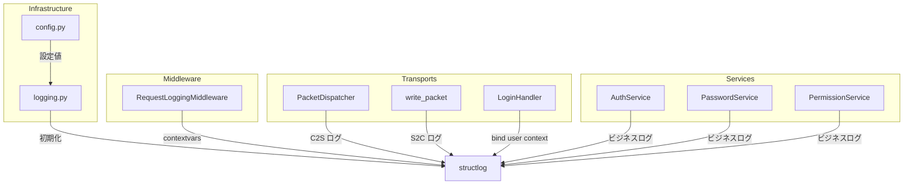
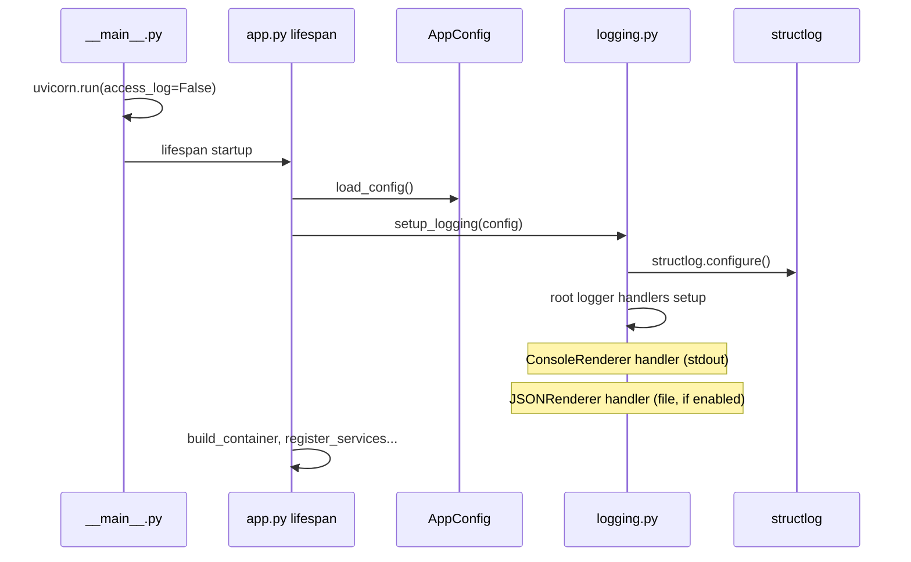
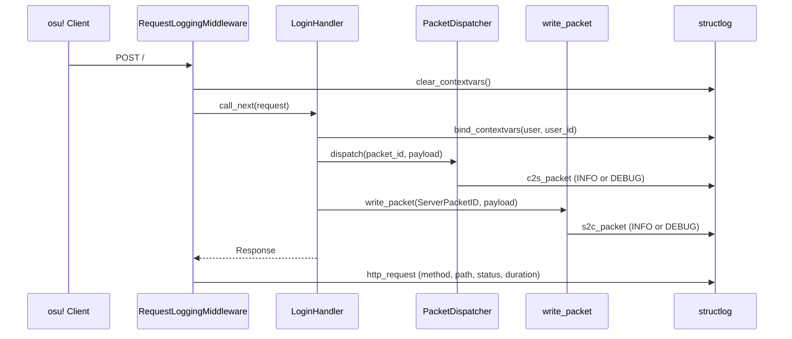

# Design Document: structured-logging

## Overview
**Purpose**: Athena サーバーに structlog ベースの構造化ログ基盤を導入し、HTTP リクエスト・bancho パケット処理・ビジネスロジックの可視化を実現する。

**Users**: 開発者（コンソールでリアルタイム追跡）、オペレーター（JSON ログで運用監視）、AI アシスタント（JSON ログで自動デバッグ）。

**Impact**: 現状3箇所のみの最低限エラーログから、全トランスポート・パケット処理・サービス層をカバーする構造化ログへ拡張。

### Goals
- structlog + stdlib 統合によるログ基盤の構築
- コンソール（カラー出力）+ JSON ファイル（`logs/athena.jsonl`）のデュアル出力
- bancho パケット処理（C2S/S2C 双方向）のブラックボックス可視化
- 既存サービス（auth/password/permission）へのビジネスロジックログ追加

### Non-Goals
- 相関 ID によるリクエストトレーシング
- セキュリティ監査ログ（ログイン試行記録・IP 追跡）
- 外部サービス連携（Sentry 等）
- メトリクス・パフォーマンス監視
- ログローテーション・永続化戦略

## Boundary Commitments

### This Spec Owns
- structlog の初期化・設定・プロセッサチェーン構成
- `AppConfig` へのログ関連設定フィールド追加
- HTTP リクエストログミドルウェア
- `PacketDispatcher.dispatch()` への C2S パケットログ
- `write_packet()` への S2C パケットログ
- ノイジーパケットの抑制定義
- contextvars によるリクエストスコープのコンテキスト伝播
- パスワードマスキングプロセッサ
- 既存3箇所の `logging.getLogger` → `structlog.get_logger` 移行
- 既存サービス（auth/password/permission）へのビジネスロジックログ追加
- ログ基盤のユニットテスト

### Out of Boundary
- 新規サービス・ハンドラへのログ追加（各機能 spec で対応）
- domain 層へのログ呼び出し導入
- ログローテーション・永続化戦略
- 監査ログ・セキュリティイベント記録
- パフォーマンスメトリクス

### Allowed Dependencies
- `structlog` >= 25.5.0（PyPI パッケージ、新規依存）
- Python 標準 `logging` モジュール
- `osu_server.config.AppConfig`（設定値の参照）
- `osu_server.transports.bancho.protocol.enums.ClientPacketID`（ノイジーパケット定義）
- `osu_server.transports.bancho.protocol.enums.ServerPacketID`（S2C ノイジーパケット定義）

### Revalidation Triggers
- structlog のメジャーバージョンアップ（プロセッサ API の変更）
- ログ出力先の追加（外部サービス連携等）
- 新しいパケットタイプの追加（ノイジーパケットリストの更新）
- レイヤー構成の変更（import-linter ルールの更新）

## Architecture

### Existing Architecture Analysis
- **レイヤー構成**: transports → services → repositories → domain → infrastructure → shared（import-linter で強制）
- **DI**: 自前軽量コンテナ。`lifespan()` で初期化、`app.state` にハンドラを格納
- **設定**: pydantic-settings の `AppConfig`。環境変数 + `.env` で読み込み
- **既存ログ**: `logging.getLogger(__name__)` が3箇所（container.py, auth_service.py, login.py）

### Architecture Pattern & Boundary Map



**Architecture Integration**:
- **Selected pattern**: structlog stdlib 統合（ProcessorFormatter パターン）
- **Existing patterns preserved**: pydantic-settings による設定管理、レイヤードアーキテクチャ、DI コンテナによるライフサイクル管理
- **New components**: `infrastructure/logging.py`（1ファイル）、`RequestLoggingMiddleware`（ミドルウェア）
- **Dependency direction**: infrastructure → shared のみ。上位層は structlog を直接インポート

### Technology Stack

| Layer | Choice / Version | Role in Feature | Notes |
|-------|------------------|-----------------|-------|
| Backend | structlog >= 25.5.0 | 構造化ログライブラリ | stdlib 統合、contextvars、ProcessorFormatter |
| Backend | Python logging (stdlib) | ハンドラ・フォーマッタ基盤 | StreamHandler, FileHandler |
| Backend | Starlette BaseHTTPMiddleware | HTTP リクエストログ | 全トランスポート共通 |

## File Structure Plan

### New Files
```
src/osu_server/
├── infrastructure/
│   └── logging.py              # structlog 初期化、プロセッサ、setup_logging()
└── transports/
    └── bancho/
        └── middleware.py        # RequestLoggingMiddleware（将来の拡張用に bancho 配下ではなく共通配置も検討したが、現状は Starlette app 直接）
```

`RequestLoggingMiddleware` は `app.py` 内にインラインで定義するか、専用ファイルに切り出すかの判断がある。Starlette アプリ全体に適用するミドルウェアなので、`app.py` の composition root 内で定義する。

実質的な新規ファイルは `infrastructure/logging.py` の1つのみ。

### Modified Files
- `src/osu_server/config.py` — `log_level`, `log_json_enabled`, `log_json_path` フィールド追加
- `src/osu_server/app.py` — `setup_logging()` 呼び出し追加、`RequestLoggingMiddleware` 追加、uvicorn アクセスログ無効化
- `src/osu_server/__main__.py` — uvicorn の `access_log=False` 設定
- `src/osu_server/infrastructure/di/container.py` — `logging.getLogger` → `structlog.get_logger` 移行
- `src/osu_server/transports/bancho/protocol/writer.py` — S2C パケットログ追加
- `src/osu_server/transports/bancho/dispatch.py` — C2S パケットログ追加、ノイジーパケット抑制
- `src/osu_server/transports/bancho/handlers/login.py` — `logging.getLogger` → `structlog.get_logger` 移行、contextvars バインド追加
- `src/osu_server/services/auth_service.py` — `logging.getLogger` → `structlog.get_logger` 移行、ビジネスロジックログ追加
- `src/osu_server/services/password_service.py` — ビジネスロジックログ追加
- `src/osu_server/services/permission_service.py` — ビジネスロジックログ追加
- `pyproject.toml` — structlog 依存追加
- `.gitignore` — `logs/` ディレクトリ追加
- `tests/` — ログ基盤のユニットテスト追加

## System Flows

### ログ初期化フロー



### リクエスト処理ログフロー（bancho POST /）



## Requirements Traceability

| Requirement | Summary | Components | Interfaces | Flows |
|-------------|---------|------------|------------|-------|
| 1.1, 1.2, 1.3, 1.4 | ログ設定 | AppConfig, setup_logging | AppConfig fields | 初期化フロー |
| 2.1, 2.2, 2.3 | コンソール出力 | setup_logging (ConsoleRenderer) | StreamHandler | 初期化フロー |
| 3.1, 3.2, 3.3, 3.4 | JSON ファイル出力 | setup_logging (JSONRenderer, FileHandler) | FileHandler | 初期化フロー |
| 4.1, 4.2 | HTTP リクエストログ | RequestLoggingMiddleware | dispatch() | リクエスト処理フロー |
| 5.1, 5.2, 5.3, 5.4 | C2S パケットログ | PacketDispatcher | dispatch() | リクエスト処理フロー |
| 6.1, 6.2 | S2C パケットログ | write_packet | write_packet() | リクエスト処理フロー |
| 7.1, 7.2 | コンテキスト伝播 | RequestLoggingMiddleware, LoginHandler | contextvars | リクエスト処理フロー |
| 8.1, 8.2, 8.3, 8.4, 8.5 | サービスログ | AuthService, PasswordService, PermissionService | 各メソッド内 | — |
| 9.1, 9.2 | 機密情報保護 | mask_sensitive_fields プロセッサ | processor chain | — |
| 10.1, 10.2 | プロセス統一 | setup_logging | setup_logging() | 初期化フロー |
| 11.1, 11.2, 11.3 | テスト | test_logging.py | capture_logs | — |

## Components and Interfaces

| Component | Domain/Layer | Intent | Req Coverage | Key Dependencies | Contracts |
|-----------|--------------|--------|--------------|------------------|-----------|
| setup_logging | Infrastructure | structlog 初期化 | 1, 2, 3, 10 | AppConfig (P0) | Service |
| mask_sensitive_fields | Infrastructure | パスワードマスキング | 9 | — | Service |
| QUIET_PACKETS | Infrastructure | ノイジーパケット定義 | 5.3, 6.2 | ClientPacketID, ServerPacketID (P0) | — |
| RequestLoggingMiddleware | Transports | HTTP リクエストログ | 4, 7 | structlog (P0), Starlette (P0) | Service |
| PacketDispatcher (修正) | Transports | C2S パケットログ追加 | 5 | structlog (P0), QUIET_PACKETS (P1) | Service |
| write_packet (修正) | Transports | S2C パケットログ追加 | 6 | structlog (P0), QUIET_PACKETS (P1) | Service |
| AppConfig (修正) | Infrastructure | ログ設定フィールド | 1 | pydantic-settings (P0) | State |
| AuthService (修正) | Services | ビジネスロジックログ | 8.1, 8.2, 8.3 | structlog (P0) | — |
| PasswordService (修正) | Services | ビジネスロジックログ | 8.4 | structlog (P0) | — |
| PermissionService (修正) | Services | ビジネスロジックログ | 8.5 | structlog (P0) | — |

### Infrastructure Layer

#### setup_logging

| Field | Detail |
|-------|--------|
| Intent | structlog の初期化と stdlib logging ハンドラの構成 |
| Requirements | 1.1, 1.2, 1.3, 1.4, 2.1, 2.2, 2.3, 3.1, 3.2, 3.3, 3.4, 10.1, 10.2 |

**Responsibilities & Constraints**
- `AppConfig` の設定値に基づいて structlog プロセッサチェーンを構成
- ConsoleRenderer 用 StreamHandler を常に設定
- JSON 出力有効時は JSONRenderer 用 FileHandler を追加
- FileHandler のエラーハンドリング（書き込み失敗時は warning 出力して継続）
- uvicorn の `uvicorn.error` / `uvicorn.access` ロガーのハンドラを上書き

**Contracts**: Service [x]

##### Service Interface
```python
def setup_logging(config: AppConfig) -> None:
    """structlog を初期化し、stdlib logging ハンドラを構成する。

    - コンソール出力（ConsoleRenderer）は常に有効
    - config.log_json_enabled が True の場合、JSON ファイル出力も有効化
    - config.log_level でルートロガーのレベルを制御
    """
    ...
```

- Preconditions: `config` が有効な `AppConfig` インスタンスであること
- Postconditions: `structlog.get_logger()` で構造化ロガーが取得可能。コンソール出力が有効。JSON 出力が設定に応じて有効
- Invariants: アプリケーションのライフサイクル中に1回だけ呼ばれる

##### プロセッサチェーン構成

```python
shared_processors: list[Processor] = [
    structlog.contextvars.merge_contextvars,
    mask_sensitive_fields,
    structlog.stdlib.add_log_level,
    structlog.processors.TimeStamper(fmt="iso"),
    structlog.processors.StackInfoRenderer(),
    structlog.processors.format_exc_info,
    structlog.processors.UnicodeDecoder(),
]
```

#### mask_sensitive_fields

| Field | Detail |
|-------|--------|
| Intent | ログイベント辞書から機密情報をマスキング |
| Requirements | 9.1, 9.2 |

**Contracts**: Service [x]

##### Service Interface
```python
def mask_sensitive_fields(
    logger: structlog.types.WrappedLogger,
    method_name: str,
    event_dict: structlog.types.EventDict,
) -> structlog.types.EventDict:
    """パスワード関連キーの値を '***' に置換する。"""
    ...
```

マスキング対象キー: `password`, `password_hash`, `password_md5`

#### QUIET_PACKETS

| Field | Detail |
|-------|--------|
| Intent | ノイジーパケットの定義（INFO で出力しない） |
| Requirements | 5.3, 6.2 |

```python
QUIET_C2S_PACKETS: frozenset[ClientPacketID] = frozenset({
    ClientPacketID.PING,
    ClientPacketID.USER_STATS_REQUEST,
    ClientPacketID.USER_PRESENCE_REQUEST,
})

QUIET_S2C_PACKETS: frozenset[ServerPacketID] = frozenset({
    ServerPacketID.PONG,
    ServerPacketID.USER_STATS,
    ServerPacketID.USER_PRESENCE,
})
```

### Transports Layer

#### RequestLoggingMiddleware

| Field | Detail |
|-------|--------|
| Intent | 全 HTTP リクエストのログ記録とコンテキスト管理 |
| Requirements | 4.1, 4.2, 7.1, 7.2 |

**Responsibilities & Constraints**
- リクエスト開始時に `clear_contextvars()` でコンテキストをクリア
- リクエスト完了時に method, path, status, duration_ms をログ
- Starlette `BaseHTTPMiddleware` を継承

**Contracts**: Service [x]

##### Service Interface
```python
class RequestLoggingMiddleware(BaseHTTPMiddleware):
    async def dispatch(
        self, request: Request, call_next: RequestResponseEndpoint
    ) -> Response:
        """HTTP リクエストをログに記録し、contextvars を管理する。"""
        ...
```

- Preconditions: Starlette アプリにミドルウェアとして登録されていること
- Postconditions: リクエスト完了後、http_request イベントがログに記録される。contextvars がクリアされる

#### PacketDispatcher.dispatch() 修正

| Field | Detail |
|-------|--------|
| Intent | C2S パケット受信のログ記録 |
| Requirements | 5.1, 5.2, 5.3, 5.4 |

**修正内容**:
- `dispatch()` メソッド内でパケット受信をログ
- `QUIET_C2S_PACKETS` に含まれるパケットは `logger.debug()`
- それ以外は `logger.info()` でペイロードサイズ付き
- ハンドラ未登録パケットは `logger.debug("c2s_unhandled", ...)`

#### write_packet() 修正

| Field | Detail |
|-------|--------|
| Intent | S2C パケット構築のログ記録 |
| Requirements | 6.1, 6.2 |

**修正内容**:
- `write_packet()` 内でパケット構築をログ
- `QUIET_S2C_PACKETS` に含まれるパケットは `logger.debug()`
- それ以外は `logger.info()` でペイロードサイズ付き

### Services Layer

#### AuthService 修正

| Field | Detail |
|-------|--------|
| Intent | 認証・登録のビジネスロジックログ |
| Requirements | 8.1, 8.2, 8.3 |

**ログイベント**:
- `login_success` — ユーザー名、ユーザー ID
- `login_failed` — ユーザー名、失敗理由（user_not_found, password_mismatch, account_restricted 等）
- `registration_success` — ユーザー名、ユーザー ID
- `registration_failed` — ユーザー名、失敗理由

#### PasswordService 修正

| Field | Detail |
|-------|--------|
| Intent | パスワード検証のビジネスロジックログ |
| Requirements | 8.4 |

**ログイベント**:
- `password_verification_failed` — 失敗理由（hash_mismatch）
- `password_banned` — 禁止リストまたは HIBP でブロック（パスワード値はマスキングプロセッサで保護）

#### PermissionService 修正

| Field | Detail |
|-------|--------|
| Intent | 権限チェックのビジネスロジックログ |
| Requirements | 8.5 |

**ログイベント**:
- `permissions_computed` — ユーザー ID、付与された権限フラグ

### Configuration

#### AppConfig 修正

| Field | Detail |
|-------|--------|
| Intent | ログ関連設定フィールドの追加 |
| Requirements | 1.1, 1.2, 1.3, 1.4 |

**Contracts**: State [x]

##### State Management
```python
class AppConfig(BaseSettings):
    # ... existing fields ...

    log_level: str = "INFO"
    log_json_enabled: bool = False
    log_json_path: str = "logs/athena.jsonl"
```

- `log_level`: ルートロガーのレベル。DEBUG / INFO / WARNING / ERROR
- `log_json_enabled`: JSON ファイル出力の有効/無効。デフォルト無効
- `log_json_path`: JSON ログファイルのパス。デフォルト `logs/athena.jsonl`

## Error Handling

### Error Strategy
- **JSON ファイル書き込み失敗**: FileHandler レベルでキャッチ。コンソールに warning 出力し、アプリケーション継続（3.4）
- **ログ初期化失敗**: `setup_logging()` で例外が発生した場合、stderr に出力して起動を続行（ログなしでの運用より起動しないことのほうが深刻）
- **不正なログレベル設定**: pydantic のバリデーションで起動時に検出

## Testing Strategy

### Unit Tests
- `setup_logging()` が ConsoleRenderer ハンドラを設定すること（1.1, 2.1）
- `setup_logging()` が `log_json_enabled=True` 時に FileHandler を追加すること（3.1）
- `setup_logging()` が `log_json_enabled=False` 時に FileHandler を追加しないこと（1.2）
- `setup_logging()` が `log_level` に応じてルートロガーのレベルを設定すること（1.1, 11.3）
- `mask_sensitive_fields` が `password`, `password_hash`, `password_md5` キーをマスキングすること（9.1）
- `mask_sensitive_fields` がマスキング対象外のキーを変更しないこと（9.2）
- `structlog.testing.capture_logs()` を使用して、パケットログやサービスログが期待されるイベント名・フィールドで出力されることを検証（11.1, 11.2）

### Integration Tests
- `RequestLoggingMiddleware` が HTTP リクエストの method, path, status, duration_ms をログすること（4.1）
- `PacketDispatcher.dispatch()` がノイジーパケットを DEBUG でログすること（5.3）
- `PacketDispatcher.dispatch()` が通常パケットを INFO でログすること（5.1）
- contextvars にバインドされたユーザー情報がログエントリに含まれること（7.1）

## Security Considerations
- パスワード・パスワードハッシュは structlog プロセッサで自動マスキング（9.1）
- マスキング対象は `password`, `password_hash`, `password_md5` キーに限定（9.2）
- ログファイル（`logs/athena.jsonl`）のパーミッションは OS デフォルトに委ねる（本 spec のスコープ外）
- `.gitignore` に `logs/` を追加してリポジトリへの誤コミットを防止
