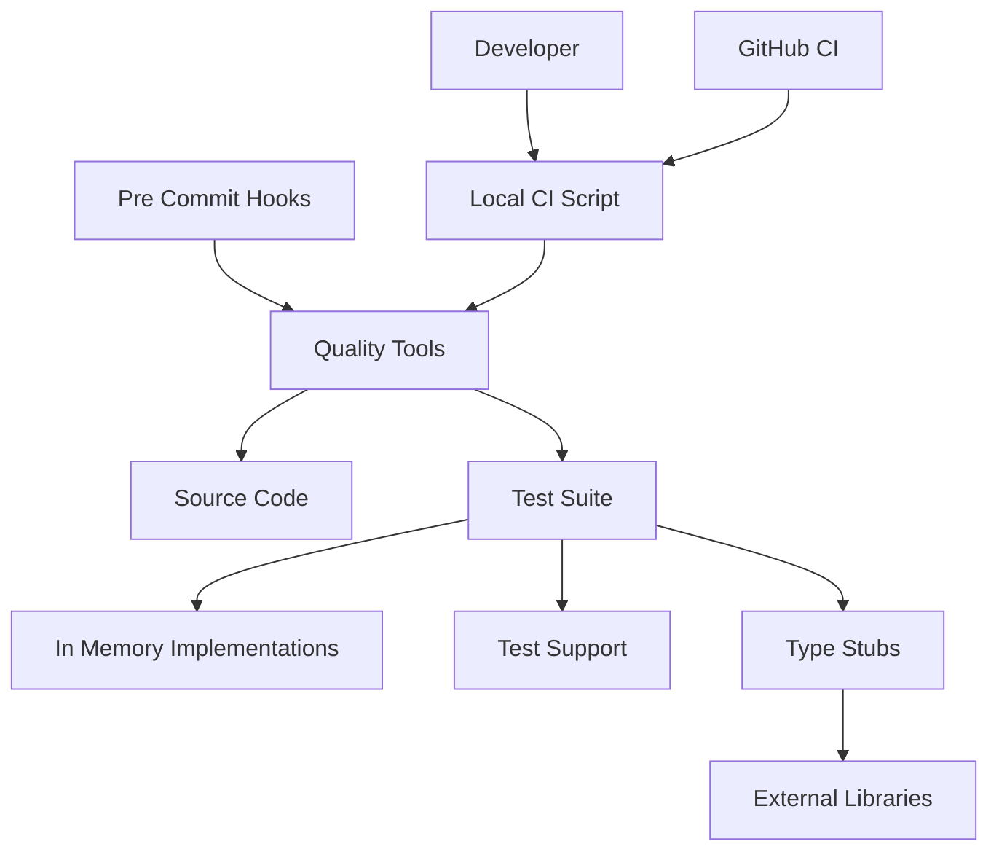
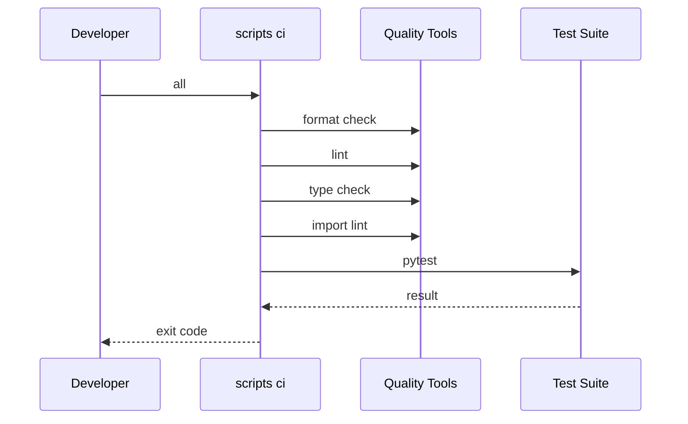
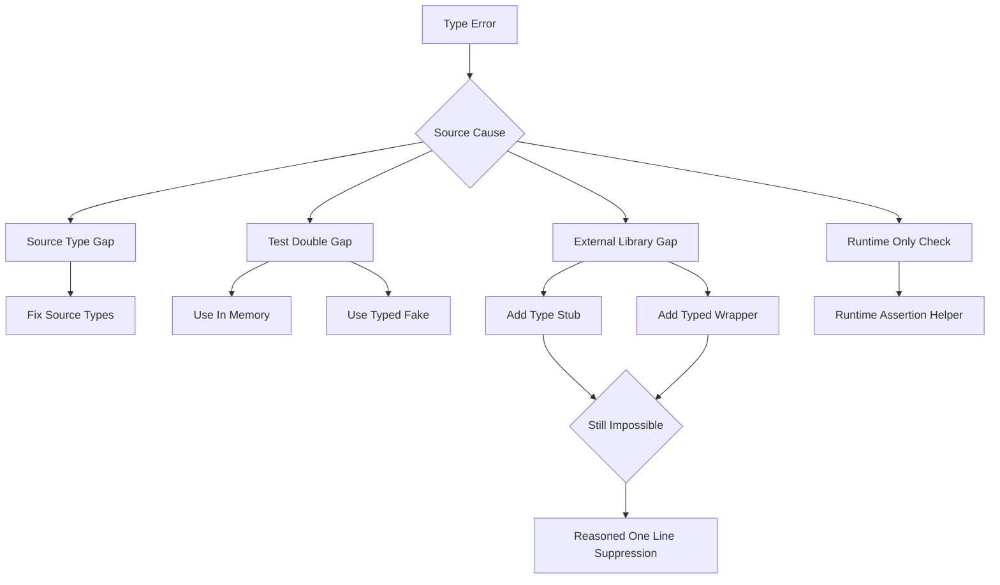
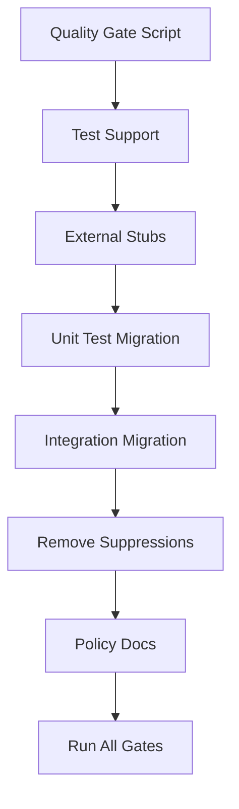

# Design Document

## Overview

この設計は、`tests/` 全体を strict な型チェック対象にし、型回避に依存したテストを型付き double、typed factory、外部 stub、ローカル CI スクリプトへ置き換える。対象ユーザーは athena の開発者であり、テスト追加・修正時に CI と同じ品質基準を手元で再現できる状態を提供する。

影響範囲はテストコード、テスト補助コード、型スタブ、品質ゲート設定、型安全ポリシー文書である。プロダクト仕様やテスト期待値は変更しない。

### Goals

- `uv run basedpyright src/ tests/` を CI・ローカル品質ゲートの必須条件にする。
- `tests/` の広域 pyright 抑制、安易な `type: ignore`、`AsyncMock`、`Any`、不要な `cast` を構造的に減らす。
- CI・pre-commit・ローカル実行の品質基準を同期する。
- テスト型安全の作法をドキュメント化し、再発を防ぐ。

### Non-Goals

- プロダクト仕様、API 振る舞い、bancho プロトコルの期待値変更。
- カバレッジ閾値の導入。
- pre-commit で integration / E2E テストを常時実行する変更。
- 型安全化と無関係なテスト整理。

## Boundary Commitments

### This Spec Owns

- `tests/` 全体に対する型安全化方針と移行。
- `scripts/ci.sh` によるローカル CI 実行契約。
- CI の type check 対象を `src/ tests/` に拡張すること。
- pre-commit source である `devenv.nix` の品質ゲート整合。
- `tests/support/` と `tests/factories/` の最小限の typed helper/fake/factory。
- 外部ライブラリ型補完の `typings/` 追加・補完。
- `.agents/rules/type-safety-policy.md` のテスト型安全ルール更新。

### Out of Boundary

- `.pre-commit-config.yaml` の直接編集。これは `git-hooks.nix` 生成物である。
- DB/Valkey service 起動の新規 orchestration。`scripts/ci.sh test` は既存の CI services または devenv services を前提にする。
- テスト対象の期待結果変更、失敗テストの削除、skip による回避。
- 外部ライブラリの大規模な差し替えや新規品質ツール導入。

### Allowed Dependencies

- `uv`、`basedpyright`、`ruff`、`pytest`、`import-linter`、`devenv` の既存ツールチェーン。
- 既存の `src/osu_server/repositories/memory/`、`src/osu_server/infrastructure/state/memory/`、`src/osu_server/infrastructure/messaging/memory.py`。
- 既存 Protocol と dataclass domain model。
- `typings/` 配下の自前 stub。
- `.github/workflows/ci.yml` と `devenv.nix`。

### Revalidation Triggers

- CI job の構成、Python バージョン、または `uv` 実行環境が変わる。
- basedpyright、ruff、pytest、import-linter の設定または対象パスが変わる。
- Starlette/httpx/Valkey/Caterpillar/structlog の型定義や実 API が変わる。
- in-memory 実装や Protocol のメソッド署名が変わる。
- `devenv.nix` の git hook 生成方式が変わる。

## Architecture

### Existing Architecture Analysis

- Python 3.14、uv、basedpyright strict、ruff、pytest、import-linter が既存の品質基盤である。
- CI quality job は `tests/` を ruff 対象に含めているが、basedpyright は `src/` のみを対象にしている。
- pre-commit は `devenv.nix` が source of truth であり、生成済み `.pre-commit-config.yaml` は手編集しない。
- 既存の repository/state/messaging には Protocol と in-memory 実装があり、`AsyncMock` の多くを置換できる。
- `typings/glide/`、`typings/glide_shared/`、`typings/httpx/` が存在し、外部型補完の配置方針は確立済みである。

### Architecture Pattern & Boundary Map

選択パターンは「typed test support + quality gate consolidation」である。テストの型安全化はテストコード内の個別修正だけでなく、品質ゲート・型補完・ドキュメントを同じ境界で扱う。



Key decisions:

- `scripts/ci.sh` は CI とローカルの実行契約を共有する。
- `tests/support/` は型付き fake/helper の置き場であり、既存 in-memory 実装を置換しない。
- `typings/` は外部ライブラリの型不足だけを補う。

### Technology Stack

| Layer | Choice / Version | Role in Feature | Notes |
|-------|------------------|-----------------|-------|
| Runtime / Scripts | POSIX shell via `scripts/ci.sh` | ローカル CI 実行契約 | 新規依存なし |
| Quality | basedpyright strict | `src/ tests/` の型チェック | CI 対象を tests へ拡張 |
| Quality | ruff | lint / format check / fix | `fix` サブコマンドのみ自動修正 |
| Test | pytest + pytest-asyncio + pytest-timeout | 全テストと pre-commit unit gate | CI test は `tests/ -v` |
| Import Rules | import-linter | レイヤー契約検証 | `quality` に含める |
| Test Doubles | 既存 in-memory 実装 + typed fake | `AsyncMock` 置換 | Protocol 準拠を必須にする |
| Type Stubs | `typings/` | 外部ライブラリ型補完 | 既存配置を継続 |

## File Structure Plan

### Directory Structure

```text
scripts/
└── ci.sh                         # quality/test/all/fix のローカル CI 契約

tests/
├── support/
│   ├── __init__.py               # typed test support package marker
│   ├── runtime_assertions.py     # frozen/invariant の runtime-only assertion helper
│   ├── http.py                   # TestClient/Response/httpx 境界の typed helper
│   ├── valkey.py                 # Valkey cleanup と encodable keys の typed helper
│   ├── fakes.py                  # 複数ファイルで使う Protocol 準拠 fake
│   └── assertions.py             # 複数ファイルで使う型付き assertion helper
├── factories/
│   ├── __init__.py               # factory package marker
│   ├── domain.py                 # dataclass/domain object の typed factory
│   └── config.py                 # AppConfig 生成の typed factory
└── ...                           # 既存 tests は suppress 削除と helper 利用へ移行

typings/
├── httpx/                        # 既存 httpx stub の補完
├── glide/                        # 既存 Valkey Glide stub の補完
├── glide_shared/                 # 既存 Valkey shared stub の補完
└── <package>/                    # 必要な外部ライブラリ stub の追加
```

### Modified Files

- `.github/workflows/ci.yml` — quality/test job を `scripts/ci.sh quality` / `scripts/ci.sh test` に寄せ、basedpyright 対象を `src/ tests/` に統一する。
- `devenv.nix` — pre-commit source of truth として `src/ tests/` の品質ゲートを維持し、必要なら `scripts/ci.sh quality` と同じ順序・対象へ近づける。
- `.agents/rules/type-safety-policy.md` — テスト double、factory、external stub、例外条件のルールを今回の設計に合わせて補強する。
- `src/osu_server/infrastructure/di/container.py` — DI resolve の型が tests 側で suppress を誘発する場合、generic contract を修正する。
- `src/osu_server/infrastructure/security/hibp.py` または周辺 Protocol — HIBP の typed fake を自然に差し込めない場合、最小の抽象を追加する。
- `src/osu_server/repositories/interfaces/*.py`、`src/osu_server/infrastructure/state/interfaces/*.py`、`src/osu_server/infrastructure/messaging/interfaces.py` — tests 側で Protocol 署名不整合が見つかった場合のみ修正する。
- `tests/conftest.py` — ファイルレベル suppress を削除し、typed fixture/helper へ置換する。
- `tests/unit/**`, `tests/integration/**`, `tests/e2e/**` — `AsyncMock`、`Any`、`cast`、`type: ignore`、ファイルレベル suppress をカテゴリ別に置換する。

## System Flows

### Local and CI Quality Flow



`quality` は format check → lint → type check → import lint の順に実行する。`test` は CI と同じ全テストを実行するが、DB/Valkey service の起動は担当しない。

### Type Error Remediation Flow



## Requirements Traceability

| Requirement | Summary | Components | Interfaces | Flows |
|-------------|---------|------------|------------|-------|
| 1.1 | ローカル品質チェックで `src/ tests/` 型チェック | Local CI Script | `scripts/ci.sh quality` | Local and CI Quality Flow |
| 1.2 | CI quality で `src/ tests/` 型チェック | CI Workflow, Local CI Script | `.github/workflows/ci.yml` | Local and CI Quality Flow |
| 1.3 | tests 型エラーを失敗扱い | Local CI Script, CI Workflow | basedpyright command | Local and CI Quality Flow |
| 1.4 | src 型定義不足も修正対象 | Source Typing Repairs | Protocol/type annotations | Type Error Remediation Flow |
| 2.1 | ファイルレベル suppress 排除 | Test Suite Migration | tests files | Type Error Remediation Flow |
| 2.2 | ignore を通常手段にしない | Test Suite Migration | tests files | Type Error Remediation Flow |
| 2.3 | 外部由来だけ理由付き1行抑制 | External Typing Boundary | `typings/`, inline comment | Type Error Remediation Flow |
| 2.4 | 抑制範囲を該当行に限定 | External Typing Boundary | inline suppression policy | Type Error Remediation Flow |
| 2.5 | 無関係な noqa/suppress 追加禁止 | Documentation Update, Test Suite Migration | type safety policy | Type Error Remediation Flow |
| 3.1 | 明示的 `Any` 原則禁止 | Test Suite Migration | tests files | Type Error Remediation Flow |
| 3.2 | in-memory または Protocol fake 利用 | Test Support Layer | `tests/support/fakes.py` | Type Error Remediation Flow |
| 3.3 | 外部境界の `Any` を閉じ込める | External Typing Boundary, Test Support Layer | typed wrapper/fake | Type Error Remediation Flow |
| 3.4 | 固定形辞書を具体型へ置換 | Test Factories | `tests/factories/*.py` | Type Error Remediation Flow |
| 4.1 | typed factory/builder 使用 | Test Factories | factory functions | Type Error Remediation Flow |
| 4.2 | `**kwargs` 型崩れ解消 | Test Factories | factory functions | Type Error Remediation Flow |
| 4.3 | 複数ファイル概念を共通化 | Test Factories, Test Support Layer | reusable helpers | Type Error Remediation Flow |
| 4.4 | 単一ファイル概念は局所化 | Test Suite Migration | local helpers | Type Error Remediation Flow |
| 5.1 | 外部型不足の解決順 | External Typing Boundary | stub/wrapper policy | Type Error Remediation Flow |
| 5.2 | 自前 stub 配置統一 | External Typing Boundary | `typings/<package>/` | Type Error Remediation Flow |
| 5.3 | 構造的補完優先 | External Typing Boundary | stubs/wrappers | Type Error Remediation Flow |
| 5.4 | 回避不能時だけ1行抑制 | External Typing Boundary | inline suppression policy | Type Error Remediation Flow |
| 6.1 | frozen test の直接代入 ignore 禁止 | Test Support Layer | `assert_rejects_setattr` | Type Error Remediation Flow |
| 6.2 | runtime-only helper へ局所化 | Test Support Layer | helper functions | Type Error Remediation Flow |
| 6.3 | 実行時例外を suppress なしで検証 | Test Support Layer | pytest raises helper | Type Error Remediation Flow |
| 7.1 | ローカル CI スクリプト提供 | Local CI Script | `scripts/ci.sh` | Local and CI Quality Flow |
| 7.2 | quality サブコマンド | Local CI Script | `quality` | Local and CI Quality Flow |
| 7.3 | test サブコマンド | Local CI Script | `test` | Local and CI Quality Flow |
| 7.4 | all サブコマンド | Local CI Script | `all` | Local and CI Quality Flow |
| 7.5 | fix サブコマンド | Local CI Script | `fix` | Local and CI Quality Flow |
| 7.6 | CI と同等基準 | CI Workflow, Local CI Script | CI job calls | Local and CI Quality Flow |
| 7.7 | pre-commit 主要品質チェック | Pre-commit Gate Source | `devenv.nix` | Local and CI Quality Flow |
| 8.1 | 避ける型回避を文書化 | Documentation Update | type safety policy | Type Error Remediation Flow |
| 8.2 | double/factory 使い分け文書化 | Documentation Update | type safety policy | Type Error Remediation Flow |
| 8.3 | 外部例外条件を文書化 | Documentation Update | type safety policy | Type Error Remediation Flow |
| 8.4 | cast/Any/suppression 基準を文書化 | Documentation Update | type safety policy | Type Error Remediation Flow |
| 9.1 | 全テストで既存振る舞い維持 | Test Suite Migration, Local CI Script | pytest | Local and CI Quality Flow |
| 9.2 | 期待結果維持 | Test Suite Migration | tests files | Type Error Remediation Flow |
| 9.3 | 削除/無効化ではなく原因修正 | Test Suite Migration | tests files | Type Error Remediation Flow |
| 9.4 | 無関係な仕様変更禁止 | Boundary Commitments | spec boundary | Type Error Remediation Flow |

## Components and Interfaces

| Component | Domain/Layer | Intent | Req Coverage | Key Dependencies | Contracts |
|-----------|--------------|--------|--------------|------------------|-----------|
| Local CI Script | Tooling | CI 相当のローカル実行契約 | 1.1, 1.3, 7.1-7.6, 9.1 | uv P0, quality tools P0 | Batch |
| CI Workflow | CI | GitHub Actions から Local CI Script を呼ぶ | 1.2, 7.6, 9.1 | scripts/ci.sh P0 | Batch |
| Pre-commit Gate Source | Tooling | devenv 管理 hook の整合 | 7.7 | devenv P0 | Batch |
| Test Support Layer | Tests | typed fake/helper を提供 | 3.2, 3.3, 4.3, 6.1-6.3 | existing Protocols P0 | Service |
| Test Factories | Tests | 型付きテストデータ生成 | 3.4, 4.1-4.4 | domain dataclasses P0 | Service |
| External Typing Boundary | Typing | 外部ライブラリ型不足を補完 | 2.3, 2.4, 5.1-5.4 | typings P0 | State |
| Source Typing Repairs | Source | tests 由来で見つかる src 型不足を修正 | 1.4 | src Protocols P0 | Service |
| Test Suite Migration | Tests | 既存 tests を typed pattern へ移行 | 2.1, 2.2, 2.5, 3.1, 9.1-9.4 | test support P1 | Batch |
| Documentation Update | Docs | 再発防止ルールを明文化 | 8.1-8.4 | `.agents/rules` P1 | State |

### Tooling

#### Local CI Script

| Field | Detail |
|-------|--------|
| Intent | CI quality/test をローカルで再現する単一入口 |
| Requirements | 1.1, 1.3, 7.1, 7.2, 7.3, 7.4, 7.5, 7.6, 9.1 |

**Responsibilities & Constraints**

- `scripts/ci.sh quality` は `uv run ruff format --check src/ tests/`、`uv run ruff check src/ tests/`、`uv run basedpyright src/ tests/`、`uv run lint-imports` の順に実行する。
- `scripts/ci.sh test` は `uv run pytest tests/ -v` を実行する。
- `scripts/ci.sh all` は `quality` の成功後に `test` を実行する。
- `scripts/ci.sh fix` は `uv run ruff format src/ tests/` と `uv run ruff check --fix src/ tests/` だけを実行する。
- service 起動、依存 install、DB migration は担当しない。

**Dependencies**

- Inbound: Developer / CI Workflow — script execution (P0)
- Outbound: uv commands — quality/test execution (P0)
- External: Postgres/Redis services — `test` 実行時の既存 integration 前提 (P1)

**Contracts**: Batch [x]

##### Batch / Job Contract

- Trigger: developer command or GitHub Actions step
- Input / validation: first argument must be `quality`, `test`, `all`, or `fix`
- Output / destination: stdout/stderr and process exit code
- Idempotency & recovery: no persistent state except `fix` modifying formatted/linted files

**Implementation Notes**

- Integration: `set -euo pipefail` を使い、サブコマンド未知時は usage と non-zero exit を返す。
- Validation: `scripts/ci.sh quality` と `scripts/ci.sh test` を CI から呼ぶ。
- Risks: `fix` はファイルを変更するため CI からは呼ばない。

#### CI Workflow

| Field | Detail |
|-------|--------|
| Intent | GitHub Actions の品質ゲートを Local CI Script と同期する |
| Requirements | 1.2, 7.6, 9.1 |

**Responsibilities & Constraints**

- quality job は既存 setup 後に `scripts/ci.sh quality` を実行する。
- test job は既存 Postgres/Redis services と env を維持し、`scripts/ci.sh test` を実行する。
- basedpyright 対象は `src/ tests/` である。

**Dependencies**

- Inbound: GitHub Actions event — pull request / main push (P0)
- Outbound: Local CI Script — shared command contract (P0)
- External: GitHub Actions services — Postgres and Redis (P1)

**Contracts**: Batch [x]

##### Batch / Job Contract

- Trigger: pull_request or push to main
- Input / validation: repository checkout, uv setup, locked dependencies, `.devenv/state/venv` symlink
- Output / destination: GitHub Actions job status
- Idempotency & recovery: rerunnable jobs; no stateful mutation beyond uv cache prune

#### Pre-commit Gate Source

| Field | Detail |
|-------|--------|
| Intent | pre-commit の source of truth を CI 方針と矛盾させない |
| Requirements | 7.7 |

**Responsibilities & Constraints**

- 編集対象は `devenv.nix`。
- `.pre-commit-config.yaml` は生成物として扱う。
- pre-commit は `basedpyright src/ tests/`、import-linter、unit pytest、ruff/format を維持する。
- integration / E2E は pre-commit に追加しない。

**Dependencies**

- Inbound: Developer commit flow (P1)
- Outbound: devenv git-hooks generation (P0)

**Contracts**: Batch [x]

### Test Typing

#### Test Support Layer

| Field | Detail |
|-------|--------|
| Intent | mock 由来の `Any` と runtime-only suppress を typed helper/fake へ置換する |
| Requirements | 3.2, 3.3, 4.3, 6.1, 6.2, 6.3 |

**Responsibilities & Constraints**

- 既存 in-memory 実装を優先し、足りないものだけ `tests/support/` に追加する。
- 複数ファイルで再利用される fake/helper のみ共通化する。
- 単一テスト専用 fake は対象テスト内に閉じる。
- runtime-only helper は frozen/invariant assertion だけに使う。

**Dependencies**

- Inbound: migrated tests (P0)
- Outbound: existing Protocols and in-memory implementations (P0)

**Contracts**: Service [x]

##### Service Interface

```python
def assert_rejects_setattr(instance: object, attribute: str, value: object) -> None: ...
```

- Preconditions: `instance` は実行時不変性を検証したいオブジェクトである。
- Postconditions: 対象属性の変更が例外を送出することを検証する。
- Invariants: helper は通常のテストデータ変更には使用しない。

```python
class FakeHIBPClient:
    async def is_password_compromised(self, password: str) -> bool: ...
```

- Preconditions: HIBP の戻り値だけを制御したいテストで使用する。
- Postconditions: `bool` を返し、`Any` を返さない。
- Invariants: HTTP 通信の詳細を検証するテストでは使わない。

**Implementation Notes**

- Integration: HIBP/httpx など外部境界の呼び出し観測が必要な場合は専用 fake に記録フィールドを持たせる。
- Validation: `AsyncMock` import がアプリ内依存の代替として残っていないことを grep と basedpyright で確認する。
- Risks: fake が本番 Protocol と drift しないよう、Protocol 準拠の型注釈で検出可能にする。

#### Test Factories

| Field | Detail |
|-------|--------|
| Intent | dataclass/object 生成時の `**kwargs` と `dict[str, Any]` を排除する |
| Requirements | 3.4, 4.1, 4.2, 4.3, 4.4 |

**Responsibilities & Constraints**

- domain dataclass と config の標準テスト値を型付き関数で提供する。
- builder は引数型を明示し、戻り値を対象型に固定する。
- 2ファイル未満の利用では共通 factory に昇格しない。

**Dependencies**

- Inbound: domain/service/infrastructure tests (P1)
- Outbound: domain dataclasses and AppConfig (P0)

**Contracts**: Service [x]

##### Service Interface

```python
def make_channel(
    *,
    name: str = "#osu",
    topic: str = "",
    read_privilege: int = 1,
    write_privilege: int = 1,
    auto_join: bool = True,
) -> Channel: ...
```

```python
def make_app_config(**overrides: object) -> AppConfig: ...
```

- Preconditions: factory は対象型の公開 constructor contract に従う。
- Postconditions: 対象型のインスタンスを返す。
- Invariants: `Any` を戻り値や公開引数に含めない。`overrides` が型崩れを誘発する場合は明示パラメータへ分解する。

#### External Typing Boundary

| Field | Detail |
|-------|--------|
| Intent | 外部ライブラリの unknown/Any を境界で補完する |
| Requirements | 2.3, 2.4, 5.1, 5.2, 5.3, 5.4 |

**Responsibilities & Constraints**

- 既存コミュニティ stub、`typings/` 補完、typed wrapper の順で解決する。
- 外部由来で回避不能な場合だけ理由付き1行 suppress を許可する。
- suppress はファイルレベルではなく該当行に限定する。

**Dependencies**

- Inbound: tests and src typing repairs (P0)
- Outbound: external libraries and `typings/` (P0)

**Contracts**: State [x]

##### State Management

- State model: `typings/<package>/` 配下の `.pyi` が external type surface を補完する。
- Persistence & consistency: stub は repository にコミットし、tooling と CI で検証する。
- Concurrency strategy: なし。

**Implementation Notes**

- Integration: Starlette `TestClient` が返す response、Valkey cleanup key 型、Caterpillar declarative type、structlog processor の順に補完対象を判断する。
- Validation: stub 追加ごとに該当 error が消えることを `uv run basedpyright src/ tests/` で確認する。
- Risks: 実 API と stub がズレた場合、実行時テストで検出する。

#### Source Typing Repairs

| Field | Detail |
|-------|--------|
| Intent | tests 由来の型エラー原因が src contract にある場合に根本修正する |
| Requirements | 1.4 |

**Responsibilities & Constraints**

- DI Container、Protocol、service constructor、external boundary の型注釈を修正対象にする。
- 実行時挙動は変えない。
- レイヤー依存方向を変えない。

**Dependencies**

- Inbound: Test Suite Migration (P1)
- Outbound: existing source modules (P0)

**Contracts**: Service [x]

##### Service Interface

既存 public interface を維持する。型注釈変更が caller contract を変える場合は design 再検証の対象にする。

### Migration

#### Test Suite Migration

| Field | Detail |
|-------|--------|
| Intent | 既存 tests を型安全 pattern へ段階的に置換する |
| Requirements | 2.1, 2.2, 2.5, 3.1, 9.1, 9.2, 9.3, 9.4 |

**Responsibilities & Constraints**

- suppress を外す前に代替 fake/factory/stub を用意する。
- 期待値、fixture semantics、integration/e2e の対象フローを維持する。
- テスト削除や skip で型エラーを回避しない。

**Dependencies**

- Inbound: all tests (P0)
- Outbound: Test Support Layer, Test Factories, External Typing Boundary (P1)

**Contracts**: Batch [x]

##### Batch / Job Contract

- Trigger: implementation tasks by category
- Input / validation: current tests and basedpyright diagnostics
- Output / destination: suppress-reduced tests passing quality gates
- Idempotency & recovery: each category can be validated independently with focused pytest and full quality gate

#### Documentation Update

| Field | Detail |
|-------|--------|
| Intent | 型安全なテスト作法をプロジェクト規約として残す |
| Requirements | 8.1, 8.2, 8.3, 8.4 |

**Responsibilities & Constraints**

- `.agents/rules/type-safety-policy.md` を更新する。
- 許可される例外条件と禁止パターンを明記する。
- コードと矛盾する例を載せない。

**Dependencies**

- Inbound: future developers and agents (P1)
- Outbound: project rules (P1)

**Contracts**: State [x]

## Data Models

この spec は永続化データモデルを変更しない。追加されるデータ表現はテスト補助の Python 型だけである。

### Domain Model

- 既存 domain dataclass は変更しない。
- typed factory は既存 domain constructor contract を呼ぶだけで、新しい domain invariant を定義しない。

### Data Contracts & Integration

- `scripts/ci.sh` command contract:
  - `quality`: format check、lint、type check、import lint。
  - `test`: full pytest。
  - `all`: quality then test。
  - `fix`: ruff format and ruff check fix only。
- `typings/` contract:
  - 外部 package ごとに `typings/<package>/` に配置する。
  - stub は `Any`/`Unknown` を境界で減らす目的に限定する。

## Error Handling

### Error Strategy

- `scripts/ci.sh` は未知サブコマンドで usage を表示し、non-zero exit を返す。
- quality/test command の失敗は即座に non-zero exit として伝播する。
- typed fake/factory は不正な入力を隠さず、通常の Python 例外または pytest assertion failure として表面化させる。
- 外部 stub で解決できない型不足は理由付き1行 suppress に限定し、失敗をファイル全体へ広げない。

### Monitoring

運用監視は追加しない。検知手段は CI job、pre-commit、`scripts/ci.sh all` の exit code である。

## Testing Strategy

### Quality Gate Tests

- `scripts/ci.sh quality` が format check → lint → type check → import lint の順で実行されることを実行確認する。
- `scripts/ci.sh fix` が formatter/linter 自動修正だけを実行し、type check と pytest を実行しないことを確認する。
- CI workflow が `scripts/ci.sh quality` と `scripts/ci.sh test` を呼び、type check 対象が `src/ tests/` であることを YAML review で確認する。

### Unit Tests

- runtime assertion helper が frozen object の属性変更失敗を suppress なしで検証できることを確認する。
- typed fake が対象 Protocol と同じ戻り値型を返し、`AsyncMock` なしで HIBP/PasswordService/Lifecycle 系テストを表現できることを確認する。
- typed factory が dataclass と AppConfig の標準値を `type: ignore` なしで生成できることを確認する。

### Integration Tests

- Valkey cleanup helper が `cast("list[TEncodable]", keys)` なしで keys を削除できることを確認する。
- TestClient/http response helper または stub 補完により、integration/e2e の `status_code`、`headers`、`content` 参照が unknown にならないことを確認する。
- 既存 integration/e2e の期待値が変更されていないことを `scripts/ci.sh test` で確認する。

### Validation Commands

```bash
uv run ruff format --check src/ tests/
uv run ruff check src/ tests/
uv run basedpyright src/ tests/
uv run lint-imports
uv run pytest tests/ -v
```

最終完了確認は `scripts/ci.sh all` を基準にする。

## Migration Strategy



1. `scripts/ci.sh` と CI workflow を先に整え、検証入口を固定する。
2. 既存 in-memory 実装で置換できる `AsyncMock` を減らす。
3. typed fake/factory/runtime helper を追加し、`type: ignore` と `Any` を減らす。
4. 外部ライブラリ型不足を `typings/` または wrapper で補う。
5. ファイルレベル suppress を削除し、回避不能な外部由来だけ理由付き1行 suppress にする。
6. 型安全ポリシーを更新し、`scripts/ci.sh all` を通す。

## Security Considerations

- HIBP 周辺の fake 化はネットワーク送信内容や k-anonymity の本番仕様を変更しない。
- `scripts/ci.sh` は secret を出力しない。既存 CI env と gitleaks hook の責務は維持する。

## Performance & Scalability

- pre-commit は unit pytest のみを維持し、integration/e2e は CI と `scripts/ci.sh test` に任せる。
- `scripts/ci.sh quality` は fail-fast にし、不要な後続処理を避ける。
- `basedpyright src/ tests/` の実行時間が増えるが、テスト型安全を CI で保証するための必須コストとして扱う。
