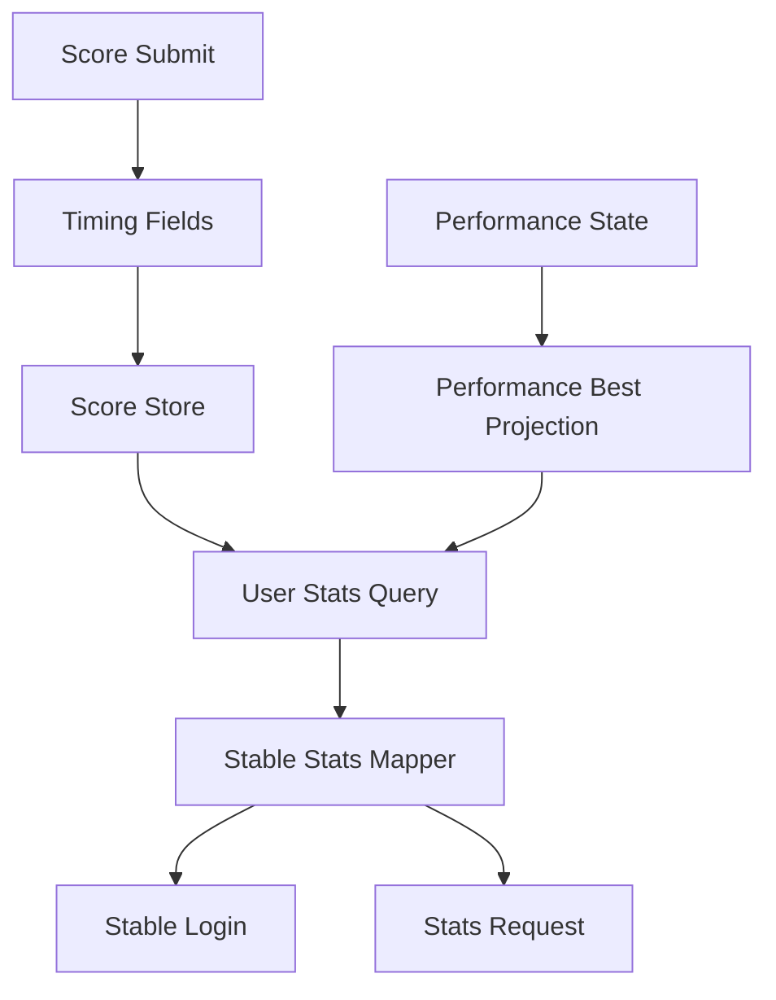
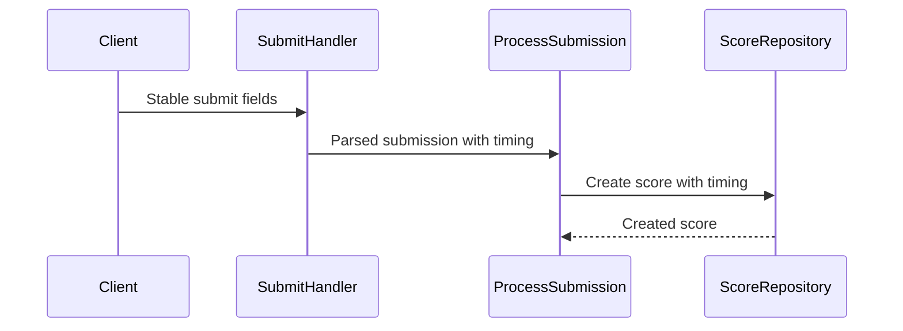
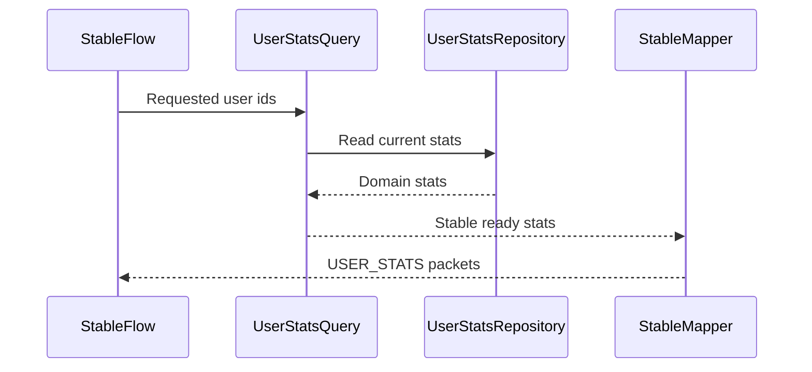
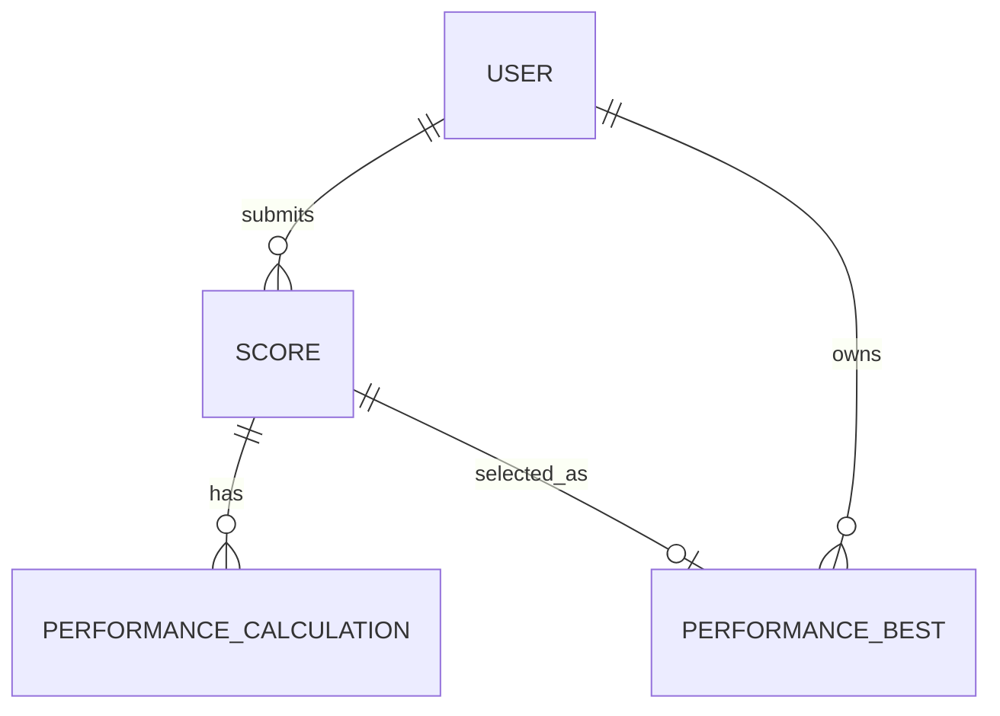

# Design Document

## Overview

user-stats は stable client のゲーム内 current stats を提供する。Score と current Performance Calculation を source data とし、PP-priority best performance projection と read-only aggregate query から `USER_STATS` に必要な値を返す。

この spec は current value に限定する。Web profile、daily rank graph、長期 snapshot は後続の `user-ranking` / Web 系 spec に残す。

### Goals

- Submit 時点の timing 情報を Score に残し、play time 集計が後から復元不能にならないようにする。
- PP、accuracy、ranked score、total score、play count、global rank を current stats として取得できるようにする。
- Stable login と `STATS_REQUEST` で既存 `USER_STATS` packet builder に current values を渡す。

### Non-Goals

- PP 計算実行、calculator adapter、Performance Calculation の state transition。
- Rank history snapshot、89日 graph、TimescaleDB などの時系列最適化。
- Public Web API、Lazer API、Web UI profile stats。
- Relax / Autopilot stats。

## Boundary Commitments

### This Spec Owns

- Score に保存する submit-time timing fields と play time derivation policy。
- PP-priority `beatmap_performance_bests` projection。
- Current user stats policy: weighted PP、accuracy、ranked score、total score、play count、nullable play time、global rank。
- Stable `USER_STATS` value mapping for login and stats request flows。
- UserStats query repository contracts and read-only use-case。

### Out of Boundary

- Performance Calculation creation, execution, recalculation formula, and provenance ownership。
- Beatmap leaderboard score-priority rows。
- Historical rank snapshots and graph rebuild。
- Stable packet field layout changes。
- Web and Lazer response surfaces。

### Allowed Dependencies

- score-ingestion Score source data and existing score command persistence.
- score-pp-calculation current Performance Calculation rows as read-only PP source.
- Beatmap metadata available at submit time for nullable passed-play time derivation.
- Stable bancho protocol builders and Caterpillar-backed C2S parser patterns.
- Existing identity visibility policy for leaderboard-visible user filtering.

### Revalidation Triggers

- `USER_STATS` field layout or stable stats request payload shape changes.
- Performance Calculation current-row semantics or PP precision changes.
- Score eligibility rules for ranked score or leaderboard visibility changes.
- Beatmap Leaderboard projection ownership changes.
- Future bonus PP compatibility evidence replacing the initial zero bonus policy.

## Architecture

### Existing Architecture Analysis

`user_stats()` already builds the stable S2C packet. `StablePresenceRoster.login_roster()` currently passes placeholder zeros. `ClientPacketID.STATS_REQUEST` exists and is treated as quiet traffic, but no handler is registered.

Score submission parses `ft` and carries `fail_time_ms` into the score submission use-case, but the Score domain model and SQLAlchemy score model do not persist timing. Performance Calculation already stores current PP separately from Score, and score-pp-calculation states that later leaderboard / stats features may read current PP.

### Architecture Pattern & Boundary Map

**Selected pattern:** Hexagonal read model extension. Score timing is command-side persistence. UserStats current values are query-side read model and stable transport mapping.



**Dependency direction:** stable transport -> query use-case -> query repository -> SQLAlchemy or memory adapter. Command submission -> Unit of Work -> command repository. Domain policies import only domain and shared primitives.

### Technology Stack

| Layer | Choice / Version | Role in Feature | Notes |
|-------|------------------|-----------------|-------|
| Backend / Services | Python 3.14 dataclasses | Domain policies and query inputs/results | No Pydantic in domain |
| Data / Storage | SQLAlchemy 2.0 async + PostgreSQL | Score timing fields and performance best projection | Alembic migration required |
| Transport | Stable bancho Caterpillar protocol | C2S stats request parsing and S2C `USER_STATS` building | Existing builder retained |
| Composition | Dishka providers | Query repository and use-case wiring | No environment branching |

No new dependency is required.

## File Structure Plan

### Directory Structure

```text
src/osu_server/
├── domain/
│   └── scores/
│       ├── score.py                    # Score timing fields
│       └── user_stats.py               # Current stats value objects and policies
├── services/
│   ├── commands/
│   │   └── scores/
│   │       └── process_submission.py   # Create Score with timing values
│   └── queries/
│       └── scores/
│           └── user_stats.py           # Current user stats query use-case
├── repositories/
│   ├── interfaces/
│   │   ├── commands/
│   │   │   └── beatmap_performance_bests.py
│   │   └── queries/
│   │       └── user_stats.py
│   ├── memory/
│   │   ├── commands/
│   │   │   ├── state.py
│   │   │   └── beatmap_performance_bests.py
│   │   └── queries/
│   │       └── user_stats.py
│   └── sqlalchemy/
│       ├── commands/
│       │   ├── scores.py
│       │   └── beatmap_performance_bests.py
│       ├── models/
│       │   ├── score.py
│       │   └── user_stats.py
│       └── queries/
│           └── user_stats.py
└── transports/
    └── stable/
        └── bancho/
            ├── handlers/
            │   └── stats.py
            ├── mappers/
            │   └── user_stats.py
            ├── protocol/
            │   └── c2s/
            │       └── stats.py
            └── workflows/
                ├── login_response_builder.py
                └── presence_roster.py
```

### Modified Files

- `alembic/versions/<timestamp>_add_user_stats_current_projection.py` — add score timing columns and `beatmap_performance_bests`.
- `src/osu_server/domain/scores/score.py` — add nullable `fail_time_ms`, `play_time_seconds`, `play_time_source`, and submit exit classification.
- `src/osu_server/domain/scores/__init__.py` — export UserStats domain values when needed.
- `src/osu_server/repositories/sqlalchemy/models/score.py` — add timing mapped columns.
- `src/osu_server/repositories/sqlalchemy/commands/scores.py` — persist and hydrate timing fields.
- `src/osu_server/repositories/sqlalchemy/queries/_shared.py` — hydrate timing fields in shared score mapping.
- `src/osu_server/repositories/memory/commands/scores.py` — preserve timing fields through in-memory command repository.
- `src/osu_server/repositories/interfaces/unit_of_work.py` — expose the performance best command repository through the command Unit of Work.
- `src/osu_server/repositories/sqlalchemy/unit_of_work.py` — construct SQLAlchemy performance best command repository.
- `src/osu_server/repositories/memory/unit_of_work.py` — construct in-memory performance best command repository.
- `src/osu_server/repositories/interfaces/queries/__init__.py`, `src/osu_server/repositories/sqlalchemy/queries/__init__.py`, `src/osu_server/repositories/memory/queries/__init__.py` — export UserStats query repositories.
- `src/osu_server/composition/providers/repository_adapters.py` — add SQLAlchemy and in-memory UserStats repository adapters.
- `src/osu_server/composition/providers/repositories.py` — provide `UserStatsQueryRepository`.
- `src/osu_server/composition/providers/stable_bancho.py` — inject UserStats query into login builder and stats handler.
- `src/osu_server/services/queries/scores/__init__.py` — export current stats query use-case.
- `src/osu_server/transports/stable/bancho/protocol/c2s/__init__.py` — export stats request parser.
- `src/osu_server/transports/stable/bancho/handlers/__init__.py` — export stats handler.

## System Flows

### Score Submit Timing Flow



Failed plays use `fail_time_ms` when valid. Passed plays use available beatmap length at acceptance time when available. Missing or invalid source data leaves `play_time_seconds` null.

### Current Stats Read Flow



Stats reads do not open command Unit of Work and do not mutate Score, Performance Calculation, or projection state.

## Requirements Traceability

| Requirement | Summary | Components | Interfaces | Flows |
|-------------|---------|------------|------------|-------|
| 1.1, 1.2, 1.3, 1.4, 1.5 | Preserve submit timing and nullable play time | Score Timing Fields, Score repository mappings | Command repository | Score Submit Timing Flow |
| 2.1, 2.2, 2.3, 2.4, 2.5 | Return current stats and defaults | UserStatsQuery, UserStatsPolicy, StableUserStatsMapper | Query service | Current Stats Read Flow |
| 3.1, 3.2, 3.3, 3.4, 3.5, 3.6 | PP best policy and no inline PP calculation | PerformanceBestProjection, UserStatsPolicy | Query repository, command projection repository | Current Stats Read Flow |
| 4.1, 4.2, 4.3, 4.4, 4.5 | Accuracy and score aggregation policy | UserStatsPolicy, UserStatsRepository | Query repository | Current Stats Read Flow |
| 5.1, 5.2, 5.3, 5.4 | Current global rank | UserStatsRepository, visibility policy | Query repository | Current Stats Read Flow |
| 6.1, 6.2, 6.3, 6.4 | Stable login stats | LoginResponseBuilder, StablePresenceRoster, StableUserStatsMapper | Stable packet builder | Current Stats Read Flow |
| 7.1, 7.2, 7.3, 7.4 | Stable stats request response | StatsRequestHandler, stats request parser, StableUserStatsMapper | C2S parser, packet queue | Current Stats Read Flow |
| 8.1, 8.2, 8.3, 8.4, 8.5 | Scope and compatibility boundaries | All components | Design constraints, tests | All flows |

## Components and Interfaces

| Component | Domain / Layer | Intent | Req Coverage | Key Dependencies | Contracts |
|-----------|----------------|--------|--------------|------------------|-----------|
| Score Timing Fields | Domain and persistence | Preserve submit-time timing on accepted Score | 1.1, 1.2, 1.3, 1.4, 1.5 | Score submission P0 | State |
| PerformanceBestProjection | Domain and persistence | Store PP-priority best score per user and beatmap | 3.1, 3.2, 3.3, 4.1 | Performance Calculation P0 | State, Service |
| UserStatsPolicy | Domain | Weighted PP, bonus PP, accuracy, stable defaults | 2.1, 2.2, 3.1, 3.5, 4.1, 4.2 | PerformanceBestProjection P0 | Service |
| UserStatsQueryRepository | Repository | Read current stats for users | 2.1, 4.3, 4.4, 5.1 | SQLAlchemy or memory P0 | State |
| CurrentUserStatsQuery | Service query | Transport-neutral current stats use-case | 2.1, 2.3, 5.2, 8.3 | UserStatsQueryRepository P0 | Service |
| StableUserStatsMapper | Stable transport mapper | Convert domain stats to `USER_STATS` packet values | 6.4, 7.1 | `user_stats()` P0 | Service |
| StatsRequestProtocol | Stable protocol | Parse C2S stats request payload with compatibility fixtures | 7.4, 8.4 | Caterpillar IntList P0 | API |
| StableLoginStatsIntegration | Stable workflow | Add current stats to login packet stream | 6.1, 6.2, 6.3 | CurrentUserStatsQuery P0 | Service |
| StatsRequestHandler | Stable handler | Respond to C2S stats requests | 7.1, 7.2, 7.3, 7.4 | PacketQueue P0 | API |

### Domain Layer

#### Score Timing Fields

| Field | Detail |
|-------|--------|
| Intent | Preserve timing values on Score so stats reads do not reconstruct them later |
| Requirements | 1.1, 1.2, 1.3, 1.4, 1.5 |

**Responsibilities & Constraints**

- Store `fail_time_ms: int | None`.
- Store `play_time_seconds: int | None`.
- Store `play_time_source: PlayTimeSource | None` with values such as `fail_time` and `beatmap_total_length`.
- Store `submit_exit_classification: str | None` for stable submit `x` semantics once confirmed by score-ingestion compatibility tests.
- Validate non-negative timing values.
- Keep unavailable timing as null, not zero.

**Contracts**: Service [ ] / API [ ] / Event [ ] / Batch [ ] / State [x]

#### UserStatsPolicy

| Field | Detail |
|-------|--------|
| Intent | Define current stats math without transport or repository dependencies |
| Requirements | 2.1, 2.2, 3.1, 3.2, 3.3, 3.4, 3.5, 4.1, 4.2 |

**Responsibilities & Constraints**

- Sort eligible best performances by PP descending.
- Use only the first 200 best performances for weighted PP and weighted accuracy.
- Weight row index `0` as `1.0`, index `1` as `0.95`, index `2` as `0.95 ** 2`.
- Initial bonus PP policy returns `0` and is named explicitly in code.
- Return stable defaults for empty or unavailable stats.

**Contracts**: Service [x] / API [ ] / Event [ ] / Batch [ ] / State [ ]

##### Service Interface

```python
class UserStatsPolicy:
    def calculate_weighted_pp(
        self,
        bests: tuple[UserPerformanceBest, ...],
    ) -> Decimal: ...

    def calculate_weighted_accuracy(
        self,
        bests: tuple[UserPerformanceBest, ...],
    ) -> float: ...
```

- Preconditions: `bests` are already eligible and sorted by PP descending.
- Postconditions: PP is non-negative and accuracy is `0.0` to `1.0`.
- Invariants: Bonus PP is a named policy term and not folded into a magic constant.

#### PerformanceBestProjection

| Field | Detail |
|-------|--------|
| Intent | Keep one PP-priority best score per user and beatmap |
| Requirements | 3.1, 3.2, 3.6, 4.1, 4.5 |

**Responsibilities & Constraints**

- Candidate score must be passed, vanilla, leaderboard eligible, and backed by completed current Performance Calculation with PP.
- Scope key is `(user_id, ruleset, playstyle, beatmap_id)`.
- Replacement order is `pp desc`, then `submitted_at asc`, then `score_id asc`.
- Projection updates never modify Performance Calculation rows.

**Contracts**: Service [x] / API [ ] / Event [ ] / Batch [x] / State [x]

##### Service Interface

```python
class RefreshPerformanceBestUseCase:
    async def execute(
        self,
        command: RefreshPerformanceBestCommand,
    ) -> RefreshPerformanceBestResult: ...
```

- Preconditions: The referenced score and current performance may or may not exist.
- Postconditions: The projection row for the scope is current or absent if no eligible candidate exists.
- Invariants: Projection state is derived from Score and Performance Calculation only.

### Repository Layer

#### UserStatsQueryRepository

| Field | Detail |
|-------|--------|
| Intent | Return current stats source rows for one or more users |
| Requirements | 2.1, 2.2, 2.3, 4.3, 4.4, 5.1, 5.2, 5.3 |

**Responsibilities & Constraints**

- Read accepted score counts, score totals, ranked score contribution, nullable play time sum, best performance rows, and global rank inputs.
- Filter global rank to leaderboard-visible users.
- Deduplicate requested user ids.
- Return empty/default-compatible rows for known users without stats.

**Contracts**: Service [ ] / API [ ] / Event [ ] / Batch [ ] / State [x]

##### State Management

- Persistence: SQLAlchemy query adapter joins Score, User visibility data, Performance Calculation, and `beatmap_performance_bests`.
- Consistency: Query is read-only and reflects committed state.
- Concurrency: Projection rebuild races converge through unique scope keys and deterministic replacement order.

### Service Query Layer

#### CurrentUserStatsQuery

| Field | Detail |
|-------|--------|
| Intent | Transport-neutral use-case returning current stats for requested users |
| Requirements | 2.1, 2.2, 2.3, 5.2, 8.3 |

**Responsibilities & Constraints**

- Accept tuple of user ids.
- Return results keyed by user id, preserving deduped request order where useful for transports.
- Apply `UserStatsPolicy` to best performance rows.
- Do not open command Unit of Work.

**Contracts**: Service [x] / API [ ] / Event [ ] / Batch [ ] / State [ ]

##### Service Interface

```python
@dataclass(slots=True, frozen=True)
class CurrentUserStatsQueryInput:
    user_ids: tuple[int, ...]

class CurrentUserStatsQuery:
    async def execute(
        self,
        input_data: CurrentUserStatsQueryInput,
    ) -> CurrentUserStatsQueryResult: ...
```

### Stable Transport Layer

#### StableUserStatsMapper

| Field | Detail |
|-------|--------|
| Intent | Map domain stats into existing stable `user_stats()` arguments |
| Requirements | 6.4, 7.1, 8.4 |

**Responsibilities & Constraints**

- Convert Decimal PP to stable integer with the existing builder clamp as final guard.
- Keep accuracy as the stable ratio expected by the existing builder.
- Use `rank=0` when global rank is unavailable.
- Preserve current status fields from presence/session data when available; use stable defaults otherwise.

**Contracts**: Service [x] / API [ ] / Event [ ] / Batch [ ] / State [ ]

#### StatsRequestHandler

| Field | Detail |
|-------|--------|
| Intent | Respond to C2S `STATS_REQUEST` with current `USER_STATS` packets |
| Requirements | 7.1, 7.2, 7.3, 7.4 |

**Responsibilities & Constraints**

- Parse and validate stats request payload with a Caterpillar-backed parser.
- Deduplicate user ids.
- Read current stats through `CurrentUserStatsQuery`.
- Enqueue packets to the requesting user's packet queue.
- Ignore malformed payloads after structured logging.

**Contracts**: Service [ ] / API [x] / Event [ ] / Batch [ ] / State [ ]

##### API Contract

| Packet | Request | Response | Errors |
|--------|---------|----------|--------|
| `STATS_REQUEST` | User id list payload verified by fixture | zero or more `USER_STATS` packets | malformed payload is ignored |

## Data Models

### Domain Model

- `Score`: accepted play attempt with score values and nullable timing fields.
- `UserPerformanceBest`: PP-priority best score for one user and beatmap scope.
- `UserCurrentStats`: current display aggregate for one user.
- `UserStatsPolicy`: weighted PP, bonus PP, and accuracy rules.



### Logical Data Model

`scores` additions:

| Field | Type | Nullable | Rule |
|-------|------|----------|------|
| `fail_time_ms` | integer | yes | non-negative when present |
| `play_time_seconds` | integer | yes | non-negative when present |
| `play_time_source` | string | yes | null when play time unavailable |
| `submit_exit_classification` | string | yes | stable submit classification or null when unavailable |

`beatmap_performance_bests`:

| Field | Type | Nullable | Rule |
|-------|------|----------|------|
| `id` | bigint | no | primary key |
| `user_id` | integer | no | user scope |
| `score_id` | bigint | no | selected score |
| `performance_calculation_id` | bigint | no | current completed PP input |
| `beatmap_id` | integer | no | beatmap scope |
| `ruleset` | smallint | no | ruleset scope |
| `playstyle` | smallint | no | initial vanilla only |
| `pp` | numeric | no | cached PP for ordering and aggregation |
| `accuracy` | float | no | cached score accuracy ratio |
| `score` | integer | no | tie-break and audit value |
| `submitted_at` | timestamp | no | tie-break value |
| `updated_at` | timestamp | no | projection maintenance timestamp |

Unique scope: `(user_id, beatmap_id, ruleset, playstyle)`.

### Physical Data Model

- Add non-negative check constraints for timing fields.
- Add index on `scores(user_id, playstyle, passed, leaderboard_eligible_at_submission)`.
- Add unique index on `beatmap_performance_bests(user_id, beatmap_id, ruleset, playstyle)`.
- Add rank support index on `beatmap_performance_bests(ruleset, playstyle, pp DESC, user_id)`.
- Add foreign keys to `scores.id` and `score_performance_calculations.id`.

## Error Handling

### Error Strategy

- Stats read failures degrade to stable-safe defaults for login.
- Malformed `STATS_REQUEST` payloads are logged and ignored.
- Missing Performance Calculation means PP contribution is absent, not an error.
- Missing play time remains null and does not block other stats.

### Error Categories and Responses

- **User Errors**: malformed stats request payload -> ignore request and keep session active.
- **System Errors**: repository read failure during login -> return defaults and log; during polling handler -> no packet response and log.
- **Business Logic Errors**: unverified bonus PP -> explicit zero bonus policy until compatibility is confirmed.

### Monitoring

- Log stats request malformed payloads with packet name and payload size.
- Log projection refresh skips with reason: missing score, missing current performance, ineligible score, or no PP.
- Query tests cover fallback behavior; runtime metrics can be added later if stats read volume requires it.

## Testing Strategy

### Unit Tests

- `UserStatsPolicy` weighted PP top 200, weight sequence, zero bonus policy, and weighted accuracy.
- Score timing derivation for failed plays, passed plays with beatmap length, invalid timing, and missing source.
- Stable mapper converts defaults, PP integer values, unavailable rank, and existing status fields.
- Stats request parser accepts canonical payload and rejects trailing or malformed bytes.

### Repository Contract Tests

- In-memory and SQLAlchemy score repositories preserve timing fields.
- UserStats query repository returns zero/default stats for a user without scores.
- UserStats query repository computes play count, total score, ranked score, weighted PP, weighted accuracy, nullable play time, and global rank.
- Performance best command repository replaces best rows by PP and deterministic tie-break.

### Integration Tests

- Score submission with `ft` persists fail time and makes play time available.
- Stable login packet stream includes current `USER_STATS` values for the logged-in user.
- `STATS_REQUEST` handler enqueues one `USER_STATS` packet per deduped visible user id.
- Performance recalculation or refresh workflow rebuilds affected performance best projection without mutating Performance Calculation state.

### Compatibility Tests

- Existing `USER_STATS` golden packet shape remains unchanged.
- New value fixtures prove non-zero ranked score, accuracy, play count, total score, rank, and PP encode into the existing wire fields.
- Malformed stats request does not disconnect the session.

## Performance & Scalability

- Current login reads should fetch stats in batches for requested user ids rather than one query per user.
- Global rank should use current PP aggregate and leaderboard-visible user filtering in a single read path.
- `beatmap_performance_bests` avoids scanning all historical scores for every login.
- Daily rank snapshots remain out of scope; no time-series storage is introduced here.
