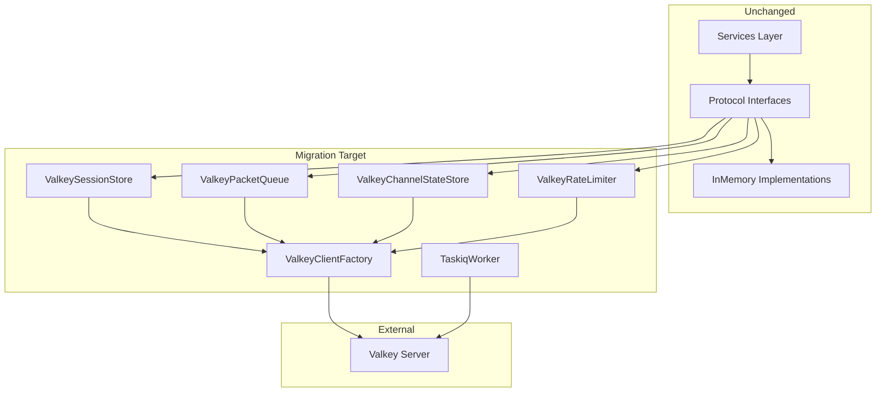
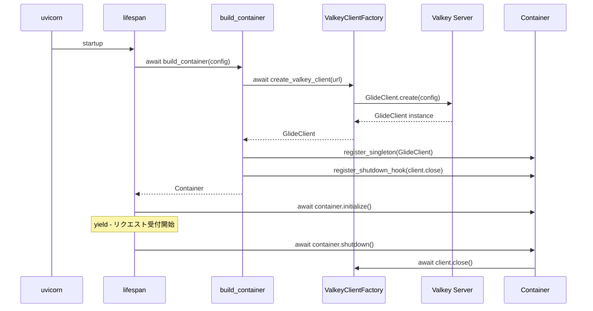

# Design Document

## Overview

**Purpose**: redis-py / ARQ を valkey-glide / taskiq に置き換え、型安全な Valkey クライアント基盤を構築する。

**Users**: athena 開発者が型安全なコードを書けるようになり、basedpyright strict モードでのエラーゼロを達成する。

**Impact**: Infrastructure 層の Redis 実装 4 ファイルを valkey-glide ベースに書き換え、worker を taskiq に移行し、開発環境を Valkey サーバーに切り替える。Protocol 抽象化により Services / Transports 層は変更不要。

### Goals
- redis-py への自前コードからの直接依存をゼロにする
- valkey-glide の型安全な API で basedpyright エラーゼロを達成する
- Lua スクリプトを Script オブジェクト (EVALSHA) に移行してパフォーマンス改善
- ARQ スケルトンを taskiq に置き換え

### Non-Goals
- 本番環境のデータ移行手順
- InMemory 実装の変更
- Protocol インターフェースの変更
- ChannelStateStore / RateLimiter の DI 登録 (channel-system スペックが担当)

## Boundary Commitments

### This Spec Owns
- `infrastructure/cache/` のクライアントファクトリ (redis → valkey)
- `infrastructure/state/redis/` → `infrastructure/state/valkey/` の全実装
- `repositories/redis/` → `repositories/valkey/` の全実装
- `infrastructure/di/providers.py` の DI キー変更 (`Redis` → `GlideClient`)
- `worker.py` の ARQ → taskiq 移行
- `config.py` の `redis_url` → `valkey_url` リネーム
- `app.py` の Redis 参照箇所の Valkey 置換
- `devenv.nix` のサーバー切り替え
- 環境変数 `REDIS_URL` → `VALKEY_URL`
- Integration テストの valkey-glide 移行
- ドキュメント更新 (CLAUDE.md, tech.md, roadmap.md, bancho_server_design.md, channel-system, type-safety-policy.md)
- `pyproject.toml` の依存変更

### Out of Boundary
- Protocol インターフェース (`SessionStore`, `PacketQueue`, `ChannelStateStore`, `RateLimiter`) の変更
- InMemory 実装 (`repositories/memory/`, `infrastructure/state/memory/`)
- Services 層 / Transports 層のコード
- テストコードの AsyncMock → InMemory 修正 (別タスク)
- ChannelStateStore / RateLimiter の DI 登録 (channel-system スペック)

### Allowed Dependencies
- `valkey-glide` (PyPI パッケージ)
- `taskiq` + `taskiq-redis` (PyPI パッケージ)
- 既存の Protocol インターフェース (import のみ、変更なし)
- `pydantic` (`RedisDsn` 型エイリアス)

### Revalidation Triggers
- `GlideClient` の DI キー変更により、`app.py` の `container.resolve()` 呼び出しが変わる
- 環境変数 `VALKEY_URL` への変更により、デプロイ設定の更新が必要
- `devenv.nix` のサービス変更により、開発環境のリセットが必要

## Architecture

### Existing Architecture Analysis

現在のアーキテクチャは Protocol 抽象化により上位層と下位実装を分離している:

```
Services / Transports (変更不要)
    ↓ Protocol interface
SessionStore / PacketQueue / ChannelStateStore / RateLimiter (Protocol)
    ↓ implements
RedisSessionStore / RedisPacketQueue / ... (redis-py) ← この層を置換
    ↓ uses
redis.asyncio.Redis (redis-py) ← これを GlideClient に置換
```

この分離のおかげで、影響は Infrastructure / Repositories 層のみに限定される。

### Architecture Pattern & Boundary Map



**Architecture Integration**:
- Selected pattern: Protocol 実装の差し替え (Strategy パターン)
- Domain boundaries: Protocol インターフェースが境界を維持
- Existing patterns preserved: DI コンテナ、環境ベース切り替え (test → InMemory, prod → Valkey)
- New components rationale: 既存クラスの 1:1 置換、新規コンポーネントなし

### Technology Stack

| Layer | Choice / Version | Role | Notes |
|-------|-----------------|------|-------|
| キャッシュ / ステート | valkey-glide 2.x | Valkey クライアント | Rust コア、型安全 |
| ジョブキュー | taskiq + taskiq-redis | 非同期ジョブ実行 | ARQ 置換 |
| サーバー | Valkey (devenv) | インメモリデータストア | Redis 互換 |
| 設定 | pydantic `ValkeyDsn = RedisDsn` | DSN バリデーション | スキーマ互換 |

## File Structure Plan

### Directory Structure

```
src/osu_server/
├── config.py                                    # valkey_url に変更
├── app.py                                       # GlideClient 参照に変更
├── worker.py                                    # ARQ → taskiq
├── infrastructure/
│   ├── cache/
│   │   └── valkey_client.py                     # NEW: GlideClient ファクトリ
│   ├── di/
│   │   └── providers.py                         # GlideClient DI 登録
│   └── state/
│       ├── valkey/                              # NEW: redis/ → valkey/ リネーム
│       │   ├── __init__.py
│       │   ├── packet_queue.py                  # ValkeyPacketQueue
│       │   ├── channel_state_store.py           # ValkeyChannelStateStore
│       │   └── rate_limiter.py                  # ValkeyRateLimiter
│       └── memory/                              # 変更なし
├── repositories/
│   ├── valkey/                                  # NEW: redis/ → valkey/ リネーム
│   │   ├── __init__.py
│   │   └── session_store.py                     # ValkeySessionStore
│   └── memory/                                  # 変更なし
tests/
├── integration/
│   ├── test_valkey.py                           # RENAME: test_redis.py
│   ├── test_valkey_session_store.py             # RENAME: test_redis_session_store.py
│   └── test_valkey_packet_queue.py              # RENAME: test_redis_packet_queue.py
```

### Modified Files

- `pyproject.toml` — 依存変更: `redis[hiredis]` → `valkey-glide`, `arq` → `taskiq` + `taskiq-redis`
- `devenv.nix` — `services.redis` → Valkey, `REDIS_URL` → `VALKEY_URL`
- `CLAUDE.md` — 技術スタック表の更新
- `.kiro/steering/tech.md` — 技術選定表の更新
- `.kiro/steering/roadmap.md` — Valkey 移行完了の反映
- `bancho_server_design.md` — Redis ステート設計の記述更新
- `.kiro/specs/channel-system/*.md` — Redis 参照箇所の更新
- `.claude/rules/type-safety-policy.md` — スタブ対応手順の更新

### Deleted Files

- `src/osu_server/infrastructure/cache/redis_client.py`
- `src/osu_server/infrastructure/state/redis/` (ディレクトリごと)
- `src/osu_server/repositories/redis/` (ディレクトリごと)
- `tests/integration/test_redis.py`
- `tests/integration/test_redis_session_store.py`
- `tests/integration/test_redis_packet_queue.py`

## System Flows

### アプリケーション起動フロー



## Requirements Traceability

| Requirement | Summary | Components | Interfaces |
|-------------|---------|------------|------------|
| 1.1, 1.2 | クライアント初期化と終了 | ValkeyClientFactory, providers.py | GlideClient lifecycle |
| 1.3, 1.4 | Lua Script 実行 | ValkeySessionStore, ValkeyPacketQueue | Script + invoke_script |
| 1.5 | Batch トランザクション | ValkeyChannelStateStore | Batch(is_atomic=True) |
| 1.6 | カウンター操作 | ValkeyRateLimiter | incr, expire |
| 1.7 | redis-py 直接 import 排除 | 全 src/ ファイル | — |
| 2.1, 2.2, 2.3 | taskiq 移行 | worker.py | taskiq broker |
| 3.1, 3.2, 3.3 | 開発環境 | devenv.nix | — |
| 4.1, 4.2, 4.3 | 設定リネーム | config.py | ValkeyDsn |
| 5.1, 5.2, 5.3 | ディレクトリ・クラスリネーム | 全 valkey/ ファイル | — |
| 6.1, 6.2, 6.3 | 型安全 | 全 valkey/ ファイル | basedpyright |
| 7.1, 7.2, 7.3, 7.4 | テスト維持 | test_valkey_*.py | — |
| 8.1-8.6 | ドキュメント更新 | markdown ファイル群 | — |
| 9.1-9.4 | 依存定義 | pyproject.toml | — |

## Components and Interfaces

| Component | Layer | Intent | Req Coverage | Key Dependencies |
|-----------|-------|--------|--------------|-----------------|
| ValkeyClientFactory | Infrastructure/Cache | GlideClient 生成 | 1.1, 1.2 | valkey-glide (P0) |
| ValkeySessionStore | Repositories/Valkey | セッション永続化 | 1.3 | GlideClient (P0), Script (P0) |
| ValkeyPacketQueue | Infrastructure/State | S2C パケットキュー | 1.4 | GlideClient (P0), Script (P0) |
| ValkeyChannelStateStore | Infrastructure/State | チャンネルメンバーシップ | 1.5 | GlideClient (P0), Batch (P0) |
| ValkeyRateLimiter | Infrastructure/State | レート制限 | 1.6 | GlideClient (P0) |
| TaskiqWorker | Worker | ジョブキュー | 2.1, 2.2, 2.3 | taskiq-redis (P0) |
| AppConfig | Config | 設定モデル | 4.1, 4.2 | pydantic (P0) |

### Infrastructure / Cache

#### ValkeyClientFactory

| Field | Detail |
|-------|--------|
| Intent | GlideClient インスタンスを生成して返すファクトリ |
| Requirements | 1.1, 1.2 |

**Responsibilities & Constraints**
- `GlideClientConfiguration` を構築し、`GlideClient.create()` で接続
- URL から host/port を抽出して `NodeAddress` に変換
- 単一の async ファクトリ関数として実装

**Dependencies**
- External: `valkey-glide` (`GlideClient`, `GlideClientConfiguration`, `NodeAddress`) — P0

**Contracts**: Service [x]

##### Service Interface

```python
async def create_valkey_client(valkey_url: str) -> GlideClient:
    """Valkey サーバーへの接続を確立して GlideClient を返す。"""
    ...
```

- Preconditions: `valkey_url` は `redis://host:port` 形式の有効な DSN
- Postconditions: 返却される `GlideClient` は接続確立済み

### Repositories / Valkey

#### ValkeySessionStore

| Field | Detail |
|-------|--------|
| Intent | SessionStore Protocol の Valkey 実装 |
| Requirements | 1.3 |

**Responsibilities & Constraints**
- 4 本の Lua スクリプトを `Script` オブジェクトとしてクラス変数に保持
- `invoke_script(script, keys=[...], args=[...])` で実行
- `get()` / `get_by_user()` は `client.get()` + JSON デシリアライズ
- `exists()` は `client.exists([key])` (リスト引数)
- `get_all_user_ids()` は `client.scan(cursor, match=..., count=...)` でイテレーション

**Dependencies**
- Inbound: Services (SessionStore Protocol 経由) — P0
- Outbound: GlideClient — P0

**Contracts**: Service [x] / State [x]

##### Service Interface

```python
class ValkeySessionStore:
    """SessionStore Protocol の Valkey 実装。"""

    _CREATE_SCRIPT: ClassVar[Script]
    _REFRESH_SCRIPT: ClassVar[Script]
    _DELETE_SCRIPT: ClassVar[Script]
    _DELETE_BY_USER_SCRIPT: ClassVar[Script]

    def __init__(self, client: GlideClient, *, ttl: int = 3600, key_prefix: str = "") -> None: ...
    async def create(self, user_id: int, token: str, data: SessionData) -> None: ...
    async def get(self, token: str) -> SessionData | None: ...
    async def get_by_user(self, user_id: int) -> SessionData | None: ...
    async def delete(self, token: str) -> None: ...
    async def exists(self, token: str) -> bool: ...
    async def refresh(self, token: str) -> bool: ...
    async def delete_by_user(self, user_id: int) -> None: ...
    async def get_all_user_ids(self) -> list[int]: ...
```

##### State Management
- Key patterns: `{prefix}session:{token}` → JSON, `{prefix}user_session:{user_id}` → token
- TTL: 両キー共有、Lua スクリプトでアトミック管理
- Concurrency: Lua スクリプトによる TOCTOU 回避

**Implementation Notes**
- `invoke_script` の `keys` / `args` は全て `list[str]`。int 値は `str()` 変換が必要
- `client.get()` は `bytes | None` を返す。`json.loads()` で dict に変換後 `SessionData(**dict)` を構築
- `client.scan()` のカーソルは `str` 入力、`bytes` 出力。ループ条件は `cursor == b"0"`

### Infrastructure / State / Valkey

#### ValkeyPacketQueue

| Field | Detail |
|-------|--------|
| Intent | PacketQueue Protocol の Valkey 実装 |
| Requirements | 1.4 |

**Responsibilities & Constraints**
- 3 本の Lua スクリプトを `Script` オブジェクトとして保持
- `enqueue` は activation flag チェック付き
- `dequeue_all` はアトミックに全パケットを drain

**Dependencies**
- Inbound: Services (PacketQueue Protocol 経由) — P0
- Outbound: GlideClient — P0

**Contracts**: Service [x] / State [x]

##### Service Interface

```python
class ValkeyPacketQueue:
    _DEQUEUE_ALL_SCRIPT: ClassVar[Script]
    _ENQUEUE_SCRIPT: ClassVar[Script]
    _REFRESH_SCRIPT: ClassVar[Script]

    def __init__(self, client: GlideClient, *, max_size: int = 4096, ttl: int = 300, key_prefix: str = "") -> None: ...
    async def enqueue(self, user_id: int, *data: bytes) -> None: ...
    async def dequeue_all(self, user_id: int) -> bytes: ...
    async def refresh_ttl(self, user_id: int, ttl: int) -> None: ...
```

**Implementation Notes**
- `invoke_script` の `args` は `list[str]`。bytes データは何らかのエンコーディング（文字列化）が必要か、ドキュメントで `bytes` 引数の扱いを実装フェーズで確認
- `dequeue_all` の戻り値は Lua の `LRANGE` 結果（リスト）→ `b"".join()` で連結

#### ValkeyChannelStateStore

| Field | Detail |
|-------|--------|
| Intent | ChannelStateStore Protocol の Valkey 実装 |
| Requirements | 1.5 |

**Responsibilities & Constraints**
- `Batch(is_atomic=True)` でアトミックな複数キー操作
- 双方向インデックス: `channel:{name}:members` ↔ `user:{id}:channels`

**Dependencies**
- Inbound: Services (ChannelStateStore Protocol 経由) — P0
- Outbound: GlideClient — P0

**Contracts**: Service [x] / State [x]

##### Service Interface

```python
class ValkeyChannelStateStore:
    def __init__(self, client: GlideClient, *, key_prefix: str = "") -> None: ...
    async def add_member(self, channel_name: str, user_id: int) -> None: ...
    async def remove_member(self, channel_name: str, user_id: int) -> None: ...
    async def is_member(self, channel_name: str, user_id: int) -> bool: ...
    async def get_members(self, channel_name: str) -> set[int]: ...
    async def get_member_count(self, channel_name: str) -> int: ...
    async def get_user_channels(self, user_id: int) -> set[str]: ...
    async def remove_user_from_all(self, user_id: int) -> set[str]: ...
```

**Implementation Notes**
- `sadd(key, {str(user_id)})` — member は `set[str]` 引数
- `sismember(key, str(user_id))` — member は `str` 引数
- `smembers()` は `set[bytes]` を返す → `int()` / `str()` 変換が必要
- Batch 内では `batch.sadd()`, `batch.srem()`, `batch.delete()` を呼び、`client.exec(batch)` で実行

#### ValkeyRateLimiter

| Field | Detail |
|-------|--------|
| Intent | RateLimiter Protocol の Valkey 実装 |
| Requirements | 1.6 |

**Responsibilities & Constraints**
- INCR + EXPIRE パターン (Lua 不要)

**Dependencies**
- Outbound: GlideClient — P0

**Contracts**: Service [x]

##### Service Interface

```python
class ValkeyRateLimiter:
    def __init__(self, client: GlideClient, *, key_prefix: str = "") -> None: ...
    async def check(self, user_id: int, limit: int, window: int) -> bool: ...
```

**Implementation Notes**
- `client.incr(key)` → `int`, `client.expire(key, window)` → `bool`
- redis-py と同じ戻り値型なので直接置換

### Worker

#### TaskiqWorker

| Field | Detail |
|-------|--------|
| Intent | taskiq ベースのワーカー設定 |
| Requirements | 2.1, 2.2, 2.3 |

**Responsibilities & Constraints**
- `ListQueueBroker` or `RedisStreamBroker` を URL で初期化
- startup/shutdown で DB エンジンのライフサイクル管理

**Dependencies**
- External: `taskiq` (P0), `taskiq-redis` (P0)

**Contracts**: Service [x]

##### Service Interface

```python
# worker.py
broker = ListQueueBroker(url=str(config.valkey_url))

# startup/shutdown hooks via taskiq lifecycle
```

**Implementation Notes**
- ARQ の `WorkerSettings` クラスパターンから taskiq のブローカー + デコレータパターンに移行
- 現在 `functions = []` (空) なので、構造のみ移行

### Config

#### AppConfig 変更

| Field | Detail |
|-------|--------|
| Intent | 環境変数名と設定フィールドのリネーム |
| Requirements | 4.1, 4.2, 4.3 |

**Implementation Notes**
- `ValkeyDsn = RedisDsn` 型エイリアスを定義
- `redis_url: RedisDsn` → `valkey_url: ValkeyDsn` に変更
- pydantic の `RedisDsn` バリデーション機能はそのまま活用 (`redis://` スキーマ)

## Error Handling

### Error Strategy

| カテゴリ | 対応 |
|---------|------|
| 接続失敗 | `GlideClient.create()` の例外をそのまま伝播 (startup 時) |
| コマンドタイムアウト | `GlideClientConfiguration` の `request_timeout` で制御 |
| Lua スクリプトエラー | `invoke_script` の例外をそのまま伝播 |
| ヘルスチェック失敗 | `client.ping()` の例外を catch して `checks["valkey"] = "error"` |

既存の Redis 実装と同じエラーハンドリングパターンを維持。valkey-glide の例外型が異なる場合は実装フェーズで調整。

## Testing Strategy

### Unit Tests
- InMemory 実装が全 Protocol をカバー済み → **変更なし** (7.4)
- 新規ユニットテストは不要

### Integration Tests
- `test_valkey.py` — GlideClient 接続、ping、基本 CRUD、TTL、close (1.1, 1.2)
- `test_valkey_session_store.py` — ValkeySessionStore の全メソッド、Lua スクリプト動作確認 (1.3)
- `test_valkey_packet_queue.py` — ValkeyPacketQueue の全メソッド、アトミック性、TTL (1.4)
- 環境変数 `VALKEY_URL` 未設定時はスキップ (既存パターン踏襲)

### Type Safety Verification
- `basedpyright src/` で全 valkey/ ファイルがエラーゼロ (6.1, 6.2, 6.3)
- ファイルレベル `# pyright:` 抑制が存在しないことを確認
