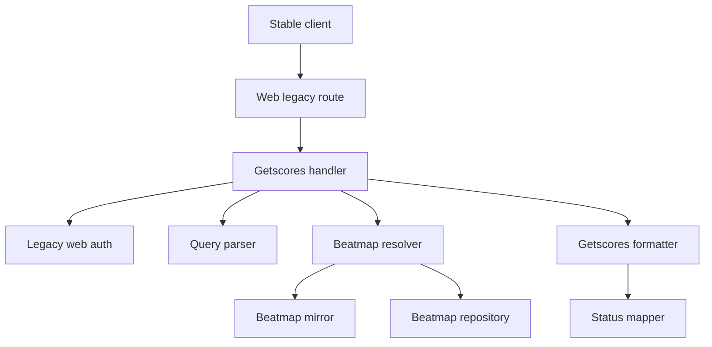
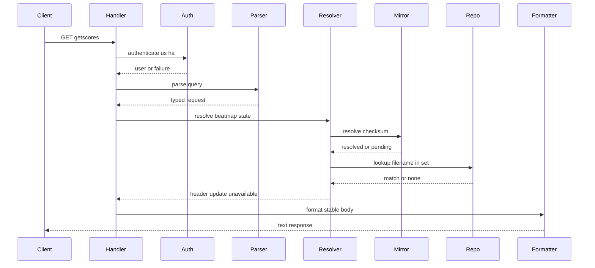

# Design Document

## Overview

この feature は osu! stable の song select で呼ばれる `GET /web/osu-osz2-getscores.php` を Athena の web legacy transport に追加する。MVP は leaderboard ranking rows を返さず、known submitted beatmap に対して stable-compatible beatmap header と score count `0` を返す。

この endpoint は beatmap metadata lookup と stable getscores wire formatting の境界である。score repository、personal best、PP、placement、replay、full leaderboard filtering は後続 feature に残し、現時点では beatmap mirror が持つ metadata と status を使って stable client の 404 / fetch failure を避ける。

### Goals

- `osu.$DOMAIN` 上の `GET /web/osu-osz2-getscores.php` を stable-compatible に処理する。
- `us` / `ha` credentials と active session で request を認証する。
- `c` checksum を最優先し、`f` filename と `i` beatmapset id hint で UpdateAvailable / fallback を判定する。
- known submitted beatmap は header response、unknown / NotSubmitted は `-1|false`、UpdateAvailable は `1|false` を返す。

### Non-Goals

- leaderboard score rows、personal best rows、score repository、rank placement。
- PP、star rating calculation、score mode/mod filtering、replay availability。
- score submission、leaderboard update workflow、osu!direct、beatmap upload。
- getscores 以外の legacy endpoint status mapper の変更。

## Boundary Commitments

### This Spec Owns

- `GET /web/osu-osz2-getscores.php` の web legacy transport handler。
- getscores query parsing と credential parameter extraction。
- getscores 専用 status mapper and stable text response formatter。
- beatmap header MVP response shape and short response shape。
- checksum-first lookup orchestration and UpdateAvailable decision。
- fixture-backed validation for observed official response behavior。

### Out of Boundary

- Score row provider, personal best provider, score persistence, score ranking。
- PP / star-rating cache and replay availability.
- Full leaderboard type behavior for Top, Mods, Friends, Country.
- Beatmap upload, local id allocation, WebUI rank management.
- Changing beatmap mirror source ownership or score eligibility rules.

### Allowed Dependencies

- `BeatmapMirrorService` for metadata-only checksum and beatmapset resolution.
- `BeatmapRepository` for exact filename lookup within a beatmapset.
- `LegacyWebAuthService` from the adjacent beatmap-info design for stable credential and active-session checks.
- Existing Starlette host routing, DI registration, and lifespan app-state adapter pattern.
- Existing beatmap domain status and metadata models.
- Existing structlog logging conventions for operator-observable diagnostics.

### Revalidation Triggers

- Official stable fixture changes for getscores response line structure or status values.
- `BeatmapMirrorService` resolve result shape or bounded wait behavior changes.
- Beatmap repository identity model changes, especially filename persistence.
- Legacy web auth contract changes for password md5 or active session requirements.
- Future score row implementation that changes score count, personal best, row ordering, or `v`/`m`/`mods` semantics.

## Architecture

### Existing Architecture Analysis

Athena already routes `osu.$DOMAIN` through a Starlette `Router` in `composition/application.py`. Endpoint adapters in `composition/endpoints.py` pull callable handlers from `app.state`; handlers are registered in `composition/service_registry.py` and exposed during `lifespan`.

`BeatmapMirrorService` provides cache-first checksum and beatmapset lookup with metadata fetch state and optional bounded wait. `BeatmapRepository` currently exposes checksum and beatmapset lookup, while this feature needs exact filename lookup within a beatmapset for UpdateAvailable and fallback behavior. The design keeps stable wire concerns in `transports/web_legacy` and does not change beatmap mirror's source ownership.

### Architecture Pattern & Boundary Map

Selected pattern: thin transport handler plus typed parser, resolver, mapper, and formatter. The endpoint owns stable query and response rules; beatmap mirror owns metadata state; score features are absent from this MVP.



Architecture decisions:

- Query parsing and response formatting are getscores-specific.
- Auth can reuse a shared legacy web credential service because only parameter names differ.
- Metadata resolution uses `require_osu_file=False`.
- Pending/WIP/Graveyard header visibility is a getscores formatter concern, not score eligibility.
- No score provider abstraction is added until score rows enter scope.

### Technology Stack

| Layer | Choice / Version | Role in Feature | Notes |
|-------|------------------|-----------------|-------|
| Transport | Starlette | Host route and callable endpoint | Existing app pattern |
| Backend / Services | Python 3.14+ dataclasses | Typed request/result value objects | Existing steering |
| Metadata | Existing `BeatmapMirrorService` | Metadata-only resolution and bounded wait | No new dependency |
| Persistence | Existing repository Protocols | Filename plus beatmapset lookup | Narrow read extension |
| Observability | structlog | Parse/auth/lookup/security diagnostics | Existing convention |
| Tests | pytest | Fixture-backed unit and integration tests | Existing steering |

## File Structure Plan

### Directory Structure

```text
src/osu_server/
├── services/
│   └── legacy_web_auth_service.py
├── transports/
│   └── web_legacy/
│       ├── getscores.py
│       ├── getscores_parser.py
│       └── getscores_formatter.py
└── repositories/
    ├── interfaces/
    │   └── beatmap_repository.py
    ├── memory/
    │   └── beatmap_repository.py
    └── sqlalchemy/
        ├── models/beatmap.py
        └── beatmap_repository.py

tests/
├── fixtures/
│   └── web_legacy/
│       └── getscores/
│           ├── ranked_response.txt
│           ├── loved_response.txt
│           ├── qualified_response.txt
│           ├── pending_response.txt
│           ├── wip_response.txt
│           ├── graveyard_response.txt
│           ├── not_submitted_response.txt
│           └── converted_mode_requests.json
├── unit/
│   └── transports/
│       └── web_legacy/
│           ├── test_getscores_parser.py
│           ├── test_getscores_formatter.py
│           └── test_getscores_resolver.py
└── integration/
    └── test_getscores_endpoint.py
```

### Modified Files

- `src/osu_server/composition/application.py` — add `GET /web/osu-osz2-getscores.php` only under `Host("osu.$DOMAIN")`.
- `src/osu_server/composition/endpoints.py` — add adapter resolving `GetscoresHandler` from `app.state`.
- `src/osu_server/composition/lifespan.py` — store `getscores_handler` on app state.
- `src/osu_server/composition/service_registry.py` — register `GetscoresHandler` and shared `LegacyWebAuthService` if not already registered by adjacent implementation.
- `src/osu_server/repositories/interfaces/beatmap_repository.py` — add exact lookup by beatmapset id and filename.
- `src/osu_server/repositories/memory/beatmap_repository.py` — support fixture lookup for tests.
- `src/osu_server/repositories/sqlalchemy/models/beatmap.py` — add persisted original filename only if no existing metadata field can satisfy exact lookup.
- `src/osu_server/repositories/sqlalchemy/beatmap_repository.py` — implement exact filename plus set lookup.
- `.kiro/specs/web-legacy-leaderboard-endpoint/research.md` — keep official fixture and reference implementation evidence current.

No new third-party package is introduced.

## System Flows

### Getscores Request



Flow decisions:

- Authentication failure stops before beatmap metadata is disclosed.
- Checksum result wins over filename and set hint conflicts.
- Filename plus beatmapset lookup is used for UpdateAvailable only when checksum misses.
- Pending after bounded wait maps to unavailable.
- Mode/mods/leaderboard controls are parsed but do not change MVP header output.

## Requirements Traceability

| Requirement | Summary | Components | Interfaces | Flows |
|-------------|---------|------------|------------|-------|
| 1.1, 1.2, 1.3, 1.4 | Endpoint scope and MVP exclusions | Route, Handler | API | Getscores Request |
| 2.1, 2.2, 2.3, 2.4, 2.5 | `us` / `ha` auth and disclosure prevention | Handler, LegacyWebAuthService | API, Service | Getscores Request |
| 3.1, 3.2, 3.3, 3.4, 3.5, 3.6, 3.7, 3.8, 3.9 | Stable query parsing | GetscoresQueryParser | Service | Getscores Request |
| 4.1, 4.2, 4.3, 4.4, 4.5, 4.6 | Lookup priority and identity safety | GetscoresResolver, BeatmapRepository | Service, State | Getscores Request |
| 5.1, 5.2, 5.3, 5.4, 5.5, 5.6, 5.7, 5.8 | Metadata resolution and bounded wait | GetscoresResolver, BeatmapMirrorService | Service | Getscores Request |
| 6.1, 6.2, 6.3, 6.4 | UpdateAvailable response | GetscoresResolver, Formatter | Service | Getscores Request |
| 7.1, 7.2, 7.3, 7.4, 7.5 | Unavailable response | GetscoresResolver, Formatter | Service, API | Getscores Request |
| 8.1, 8.2, 8.3, 8.4, 8.5, 8.6, 8.7, 8.8 | Submitted header response | Formatter, StatusMapper | API | Getscores Request |
| 9.1, 9.2, 9.3, 9.4, 9.5, 9.6, 9.7, 9.8 | Getscores status mapping | GetscoresStatusMapper | Service | None |
| 10.1, 10.2, 10.3, 10.4, 10.5, 10.6 | Parse-only controls | Parser, Handler | Service | Getscores Request |
| 11.1, 11.2, 11.3, 11.4, 11.5, 11.6, 11.7, 11.8, 11.9 | Stable text formatting and sanitization | Formatter | API | Getscores Request |
| 12.1, 12.2, 12.3, 12.4, 12.5 | Security and observability | Handler, Parser, Resolver | Logging | Getscores Request |
| 13.1, 13.2, 13.3, 13.4, 13.5 | Fixture and evidence validation | Tests, Research log | Fixture contract | None |

## Components and Interfaces

| Component | Domain/Layer | Intent | Req Coverage | Key Dependencies | Contracts |
|-----------|--------------|--------|--------------|------------------|-----------|
| GetscoresHandler | Transport | Authenticate, parse, resolve, and format endpoint response | 1, 2, 3, 7, 10, 12 | Auth P0, Parser P0, Resolver P0, Formatter P0 | API, Service |
| GetscoresQueryParser | Transport | Convert query params into typed request | 3, 10, 12 | none P0 | Service |
| GetscoresResolver | Transport orchestration | Decide header, update, or unavailable outcome | 4, 5, 6, 7 | Mirror P0, Repository P0 | Service, State |
| GetscoresFormatter | Transport | Build stable text bodies | 6, 7, 8, 11 | StatusMapper P0 | Service, API |
| GetscoresStatusMapper | Transport | Map Athena status to getscores wire values | 8, 9 | Beatmap domain P0 | Service |
| LegacyWebAuthService | Service | Verify legacy credentials and active session | 2 | UserRepository P0, PasswordService P0, SessionStore P0 | Service |
| BeatmapRepository Filename Set Lookup | Repository | Find exact filename in a beatmapset | 4, 6 | Persistence P0 | State |

### Transport Layer

#### GetscoresHandler

| Field | Detail |
|-------|--------|
| Intent | Callable Starlette endpoint for stable getscores MVP |
| Requirements | 1.1, 1.2, 1.3, 1.4, 2.4, 7.5, 10.6, 12.2, 12.5 |

**Responsibilities & Constraints**

- Reads raw query params and extracts `us` / `ha` for auth.
- Delegates parsing, resolution, and formatting.
- Returns no beatmap data on authentication failure.
- Does not access SQLAlchemy sessions or score persistence.
- Does not include score row provider logic.

**Dependencies**

- Inbound: Starlette route — invokes handler (P0)
- Outbound: `LegacyWebAuthService` — authorizes active stable user (P0)
- Outbound: `GetscoresQueryParser` — parses query (P0)
- Outbound: `GetscoresResolver` — resolves beatmap outcome (P0)
- Outbound: `GetscoresFormatter` — builds response body (P0)

**Contracts**: Service [x] / API [x] / Event [ ] / Batch [ ] / State [ ]

##### API Contract

| Method | Endpoint | Request | Response | Errors |
|--------|----------|---------|----------|--------|
| GET | `/web/osu-osz2-getscores.php` on `osu.$DOMAIN` | Query `s`, `vv`, `v`, `c`, `f`, `m`, `i`, `mods`, `h`, `a`, `us`, `ha` | `text/plain; charset=UTF-8` with header body, `-1|false`, or `1|false` | `401` auth failure; `200` stable short response for beatmap unavailable/update states |

##### Service Interface

```python
class GetscoresHandler:
    async def __call__(self, request: Request) -> Response: ...
```

Preconditions:

- Route is registered only under the osu web host router.

Postconditions:

- Response bodies contain no internal provenance or fetch-state fields.
- Ranking rows and personal best rows are absent in this MVP.

#### GetscoresQueryParser

| Field | Detail |
|-------|--------|
| Intent | Parse stable query params into a typed single-map request |
| Requirements | 3.1, 3.2, 3.3, 3.4, 3.5, 3.6, 3.7, 3.8, 3.9, 10.1, 10.2, 10.3, 10.4, 10.5 |

**Responsibilities & Constraints**

- Preserves identity fields separately from parse-only controls.
- Treats `i` as beatmapset id hint.
- Treats malformed non-identity fields as diagnostics rather than hard failures.
- Emits a typed invalid identity outcome when checksum/filename/set data is insufficient.

**Contracts**: Service [x] / API [ ] / Event [ ] / Batch [ ] / State [ ]

##### Service Interface

```python
@dataclass(slots=True, frozen=True)
class GetscoresRequest:
    checksum_md5: str | None
    filename: str | None
    beatmapset_id_hint: int | None
    mode: int | None
    mods: int | None
    leaderboard_type: int | None
    leaderboard_version: int | None
    song_select: bool | None
    anti_cheat_signal: bool
    parse_warnings: tuple[GetscoresParseWarning, ...]

@dataclass(slots=True, frozen=True)
class GetscoresParseResult:
    request: GetscoresRequest | None
    error: GetscoresParseError | None

class GetscoresQueryParser:
    def parse(self, query: Mapping[str, str]) -> GetscoresParseResult: ...
```

`GetscoresParseError` values:

- `missing_identity`
- `invalid_checksum`

`GetscoresParseWarning` values:

- `invalid_mode`
- `invalid_mods`
- `invalid_leaderboard_type`
- `invalid_leaderboard_version`
- `invalid_song_select_flag`
- `invalid_anti_cheat_signal`

### Resolution Layer

#### GetscoresResolver

| Field | Detail |
|-------|--------|
| Intent | Convert parsed request into header/update/unavailable outcome |
| Requirements | 4.1, 4.2, 4.3, 4.4, 4.5, 4.6, 5.1, 5.2, 5.3, 5.4, 5.5, 5.6, 5.7, 5.8, 6.1, 6.3, 6.4, 7.1, 7.2, 7.3, 7.4 |

**Responsibilities & Constraints**

- Calls checksum resolution first when checksum is present.
- Requests metadata-only resolution with bounded wait.
- Uses filename plus beatmapset id lookup only after checksum miss.
- Returns UpdateAvailable only when same set and filename identify a submitted beatmap with a different checksum.
- Does not use beatmapset id alone to choose a beatmap.
- Does not consult score state.

**Dependencies**

- Outbound: `BeatmapMirrorService` — checksum and beatmapset metadata resolution (P0)
- Outbound: `BeatmapRepository` — exact filename/set lookup (P0)
- Outbound: `GetscoresStatusMapper` — submitted visibility check can be shared with formatter (P1)

**Contracts**: Service [x] / API [ ] / Event [ ] / Batch [ ] / State [x]

##### Service Interface

```python
class GetscoresOutcomeKind(Enum):
    HEADER = "header"
    UNAVAILABLE = "unavailable"
    UPDATE_AVAILABLE = "update_available"

@dataclass(slots=True, frozen=True)
class GetscoresResolvedHeader:
    beatmap: Beatmap
    beatmapset: BeatmapSet

@dataclass(slots=True, frozen=True)
class GetscoresResolveOutcome:
    kind: GetscoresOutcomeKind
    header: GetscoresResolvedHeader | None
    reason: GetscoresResolveReason

class GetscoresResolver:
    async def resolve(self, request: GetscoresRequest) -> GetscoresResolveOutcome: ...
```

Postconditions:

- `HEADER` includes both beatmap and beatmapset.
- `UNAVAILABLE` maps to `-1|false`.
- `UPDATE_AVAILABLE` maps to `1|false`.

##### State Management

- Natural identity priority: checksum, then filename within beatmapset.
- Consistency: repository and beatmap mirror remain the source of truth.
- Concurrency: duplicate fetch prevention is delegated to beatmap mirror fetch state.

### Formatting Layer

#### GetscoresFormatter

| Field | Detail |
|-------|--------|
| Intent | Build stable-compatible text/plain getscores response bodies |
| Requirements | 6.2, 7.1, 7.2, 7.3, 7.4, 8.1, 8.4, 8.5, 8.6, 8.7, 8.8, 11.1, 11.2, 11.3, 11.4, 11.5, 11.6, 11.7, 11.8, 11.9 |

**Responsibilities & Constraints**

- Emits short bodies `-1|false` and `1|false`.
- Emits header bodies with score count `0`.
- Emits empty personal best and score sections.
- Sanitizes artist/title delimiters.
- Does not emit chunk framing markers.
- Does not emit source, verification, policy, or fetch-state provenance.

**Contracts**: Service [x] / API [x] / Event [ ] / Batch [ ] / State [ ]

##### Service Interface

```python
class GetscoresFormatter:
    def format(self, outcome: GetscoresResolveOutcome) -> bytes: ...
```

Known header body shape:

```text
<status>|false|<beatmap_id>|<beatmapset_id>|0||
0
[bold:0,size:20]<artist>|<title>
0


```

#### GetscoresStatusMapper

| Field | Detail |
|-------|--------|
| Intent | Convert effective beatmap status to getscores wire value |
| Requirements | 8.2, 8.3, 9.1, 9.2, 9.3, 9.4, 9.5, 9.6, 9.7, 9.8 |

**Responsibilities & Constraints**

- Maps submitted statuses to values observed in getscores fixtures and bancho.py constants.
- Keeps getscores mapping independent from beatmap-info mapping.
- Treats Pending/WIP/Graveyard as header-visible status `0`.
- Returns no header value for hidden/non-submitted states.

##### Service Interface

```python
class GetscoresStatusMapper:
    def map_header_status(self, beatmap: Beatmap) -> int | None: ...
```

Mapping:

| Effective status | Getscores value |
|------------------|-----------------|
| NotSubmitted / unknown / unresolved | `-1` short response |
| Pending / WIP / Graveyard | `0` |
| UpdateAvailable | `1` short response |
| Ranked | `2` |
| Approved | `3` |
| Qualified | `4` |
| Loved | `5` |

### Service Layer

#### LegacyWebAuthService

| Field | Detail |
|-------|--------|
| Intent | Shared stable web credential auth for `us` / `ha` and `u` / `h` style endpoints |
| Requirements | 2.1, 2.2, 2.3, 2.4, 2.5, 12.2 |

**Responsibilities & Constraints**

- Verifies username and password md5 with existing user/password services.
- Requires active bancho session by user id.
- Accepts endpoint-extracted parameter values rather than reading query params itself.
- Returns typed success/failure result; transport decides HTTP response.

**Contracts**: Service [x] / API [ ] / Event [ ] / Batch [ ] / State [ ]

##### Service Interface

```python
@dataclass(slots=True, frozen=True)
class LegacyWebAuthResult:
    user_id: int | None
    username: str | None
    failure: LegacyWebAuthFailure | None

class LegacyWebAuthService:
    async def authenticate(
        self,
        username: str | None,
        password_md5: str | None,
    ) -> LegacyWebAuthResult: ...
```

### Repository Layer

#### BeatmapRepository Filename Set Lookup

| Field | Detail |
|-------|--------|
| Intent | Resolve exact filename inside a beatmapset for fallback and UpdateAvailable |
| Requirements | 4.3, 4.4, 6.1, 6.3 |

**Responsibilities & Constraints**

- Performs exact lookup by beatmapset id and original filename.
- Does not query external sources directly.
- Does not use beatmapset id alone to choose a difficulty.
- Supports tests through in-memory repository.

##### State Management

- Lookup key: `(beatmapset_id, original_filename)`.
- Collision behavior: exact set-scoped match only.
- Persistence: nullable filename attribute may be added if existing metadata cannot supply it.

## Data Models

### Domain Model

This feature introduces transport value objects only:

- `GetscoresRequest`
- `GetscoresParseResult`
- `GetscoresResolveOutcome`
- `GetscoresResolvedHeader`

It reuses existing `Beatmap`, `BeatmapSet`, `BeatmapRankStatus`, `BeatmapResolveOptions`, and `BeatmapResolveResult`.

### Logical Data Model

No new aggregate is owned by this spec. The only persistence-facing change is a read key for exact filename lookup within a beatmapset.

Rules:

- `Beatmap.checksum_md5` remains the primary identity.
- `BeatmapSet.id` is a hint and grouping key.
- `original_filename` is a fallback attribute, not authoritative identity.

### Data Contracts & Integration

#### Query Contract

| Field | Meaning in MVP |
|-------|----------------|
| `us` | Username credential |
| `ha` | Password md5 credential |
| `c` | Beatmap checksum/md5 |
| `f` | Original `.osu` filename |
| `i` | Beatmapset id hint |
| `m` | Parse-only requested mode |
| `mods` | Parse-only requested mods |
| `v` | Parse-only leaderboard type |
| `vv` | Parse-only leaderboard version marker |
| `s` | Parse-only song-select/editor flag |
| `h` | Map package hash or unrelated legacy field, not auth |
| `a` | Anti-cheat signal diagnostic |

#### Response Contract

Short unavailable:

```text
-1|false
```

Short update available:

```text
1|false
```

Known submitted header:

```text
<status>|false|<beatmap_id>|<beatmapset_id>|0||
0
[bold:0,size:20]<artist>|<title>
0


```

## Error Handling

### Error Strategy

- Authentication failures return `401` with no beatmap data.
- Unknown, NotSubmitted, pending-after-wait, failed metadata, and invalid identity map to `200` `-1|false`.
- UpdateAvailable maps to `200` `1|false`.
- Malformed non-identity fields are logged and do not block known header response.
- Unexpected exceptions remain handled by existing middleware after contextual logging where possible.

### Error Categories and Responses

| Category | Condition | Response | Observable Signal |
|----------|-----------|----------|-------------------|
| Auth | missing/invalid `us` or `ha` | `401` empty | `getscores_auth_failed` |
| Session | no active session | `401` empty | `getscores_auth_failed` |
| Identity | missing usable identity | `200 -1|false` | `getscores_identity_invalid` |
| Lookup | NotSubmitted/unknown/pending/failed | `200 -1|false` | `getscores_unavailable` |
| Update | same set/filename different checksum | `200 1|false` | `getscores_update_available` |
| Parse warning | malformed parse-only field | normal outcome | `getscores_parse_warning` |
| Security | `a` signal present | normal outcome | `getscores_anti_cheat_signal` |

## Testing Strategy

### Unit Tests

- Parser preserves all observed query fields and treats `i` as beatmapset id hint (`3.1`-`3.7`, `10.1`-`10.5`).
- Parser warns on malformed non-identity fields without blocking known identity (`3.8`).
- Resolver prioritizes checksum over conflicting filename/set hint (`4.1`, `4.2`, `4.5`).
- Resolver returns UpdateAvailable only for same set and filename with different checksum (`6.1`-`6.4`).
- Formatter emits `-1|false`, `1|false`, and header body shape without chunk framing (`7.1`-`7.5`, `11.1`-`11.9`).
- Status mapper covers `-1`, `0`, `1`, `2`, `3`, `4`, and `5` paths (`9.1`-`9.8`).

### Integration Tests

- `Host: osu.$DOMAIN` routes `GET /web/osu-osz2-getscores.php`; non-osu fallback is absent (`1.1`, `1.2`).
- Valid `us` / `ha` with active session authorizes; missing/invalid/no-session requests do not reveal beatmap data (`2.1`-`2.5`).
- Known checksum returns header with score count `0` and no score rows (`8.1`-`8.8`).
- Unknown checksum enqueues metadata-only resolution and returns header if bounded wait resolves (`5.2`-`5.8`).
- Pending-after-wait and failed metadata return `-1|false` (`7.2`, `7.3`).

### Fixture Validation

- Store official decoded response bodies for Ranked, Loved, Qualified, Pending, WIP, Graveyard, and NotSubmitted (`13.1`, `13.2`).
- Store converted mode requests showing header identity remains stable across `m=0..3` (`10.4`, `13.2`).
- Record bancho.py reference findings while asserting official fixture precedence (`13.3`, `13.4`, `13.5`).

### Performance and Load

- Validate that metadata-only resolution does not require `.osu` file availability (`5.8`).
- Validate known checksum path does not wait for external metadata (`5.1`).

## Security Considerations

- `ha` is password md5 and must not be logged.
- `h` is not a credential for this endpoint.
- `a` is diagnostic/security signal only in this MVP.
- Stable response bodies must not expose source, verification, policy, fetch-state, local override provenance, or credential diagnostics.

## Performance & Scalability

- Known checksum responses should return from cache/repository without bounded wait.
- Missing metadata uses the existing bounded wait behavior; the handler does not hold database transactions across waits.
- `.osu` file body fetch is disabled for this endpoint.
- Filename lookup is exact and set-scoped to avoid broad scans.

## Migration Strategy

No broad migration is owned by this spec. If exact filename lookup cannot be satisfied by existing persisted metadata, add a nullable original filename attribute in the beatmap persistence area. Existing records without filename remain resolvable by checksum and simply cannot produce filename/set UpdateAvailable until refreshed.

## Supporting References

- `.kiro/specs/web-legacy-leaderboard-endpoint/research.md` records official fixtures, request fields, and reference implementation findings.
- `.kiro/specs/beatmap-info-endpoint/research.md` records adjacent stable metadata lookup behavior.
- `.kiro/specs/beatmap-mirror/requirements.md` defines metadata resolution behavior consumed by this endpoint.
